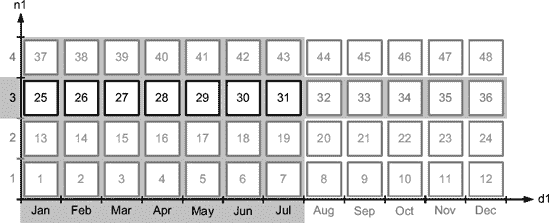
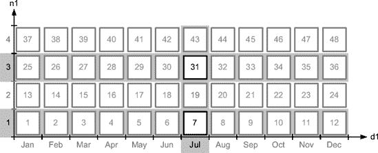
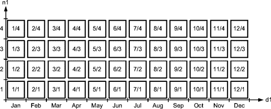
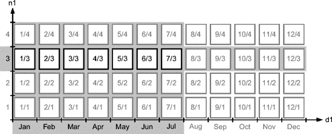
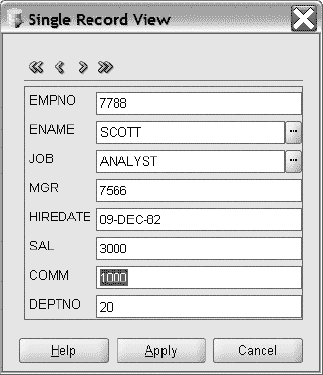
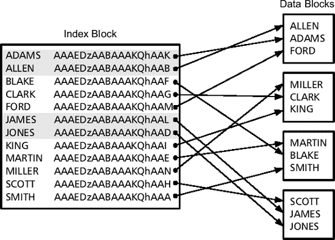

# Oracle 执行计划中的分区范围操作

## PARTITION RANGE SINGLE

前述执行计划包含操作 `PARTITION RANGE SINGLE`。这是因为查询优化器识别出只有单个分区包含需要处理的数据。

## PARTITION RANGE ITERATOR

显然，在某些情况下需要访问多个分区。例如，在以下查询中，限制条件使用了小于条件 (`<`)，而非基于相等条件 (`=`)。因此，操作变为 `PARTITION RANGE ITERATOR`，列 `Pstart` 和 `Pstop` 显示了被访问的分区范围（参见图 9-7）。此外，列 `Starts` 显示操作 1 只执行了一次，但操作 2 对每个分区执行了一次。换句话说，执行了七次完整的分区扫描。

```sql
SELECT * FROM t WHERE n1 = 3 AND d1 < to_date('2007-07-19','yyyy-mm-dd')
```

```
------------------------------------------------------------------
| Id | Operation                 | Name | Starts | Pstart| Pstop |
------------------------------------------------------------------
|  1 |  PARTITION RANGE ITERATOR |      |      1 |    25 |    31 |
|* 2 |   TABLE ACCESS FULL       | T    |      7 |    25 |    31 |
------------------------------------------------------------------

2 - filter("N1"=3 AND
           "D1"<TO_DATE('2007-07-19 00:00:00', 'yyyy-mm-dd hh24:mi:ss'))
```

当限制条件仅基于分区键的前导部分时，也会使用 `PARTITION RANGE ITERATOR` 操作。以下查询说明了这一点，其中限制应用于分区键的第一列。注意，分区 37 也被访问了。这是因为，如果列 `d1` 的值晚于 2007 年 1 月 31 日，那么列 `n1` 等于 3 的行将存储在该分区中。

```sql
SELECT * FROM t WHERE n1 = 3
```

```
------------------------------------------------------------------
| Id | Operation                 | Name | Starts | Pstart| Pstop |
------------------------------------------------------------------
|  1 |  PARTITION RANGE ITERATOR |      |      1 |    25 |    37 |
|* 2 |   TABLE ACCESS FULL       | T    |     13 |    25 |    37 |
------------------------------------------------------------------

  2 - filter("N1"=3)
```



**图 9-7.** `PARTITION RANGE ITERATOR` 操作的表示

正如该操作名称所暗示的，它仅适用于连续的分区范围。当使用非连续范围时，下一节介绍的操作就会发挥作用。

## PARTITION RANGE INLIST

如果限制条件基于一个或多个包含多个元素的 `IN` 条件，执行计划中会出现一个特定的操作：`PARTITION RANGE INLIST`。使用此操作时，列 `Pstart` 和 `Pstop` 不提供关于访问了哪些分区的精确信息。相反，它们显示值 `KEY(I)`。这表明分区修剪是针对 `IN` 条件中的每个值单独进行的。此外，列 `Starts` 显示访问了多少个分区（本例中是两次）。

```sql
SELECT * FROM t WHERE n1 IN (1,3) AND d1 = to_date('2007-07-19','yyyy-mm-dd')
```

```
----------------------------------------------------------------
| Id | Operation               | Name | Starts | Pstart| Pstop |
----------------------------------------------------------------
|  1 |  PARTITION RANGE INLIST |      |      1 |KEY(I) |KEY(I) |
|* 2 |   TABLE ACCESS FULL     | T    |      2 |KEY(I) |KEY(I) |
----------------------------------------------------------------

2 - filter("D1"=TO_DATE('2007-07-19 00:00:00', 'yyyy-mm-dd hh24:mi:ss') AND
           ("N1"=1 OR "N1"=3))
```

在这种特定情况下，基于 `WHERE` 子句，您可以推断出只访问了分区 7 和 31。图 9-8 说明了这一点。

当然，如果 `IN` 条件中的值分布足够广，可能访问大部分分区。在查询优化器识别出所有分区都被访问的情况下，将应用下一节的操作。



**图 9-8.** `PARTITION RANGE INLIST` 操作的表示

## PARTITION RANGE ALL

如果未对分区键应用任何限制条件，则必须访问所有分区。在这种情况下，执行计划包含操作 `PARTITION RANGE ALL`，列 `Starts`、`Pstart` 和 `Pstop` 清晰地显示所有分区都被访问了。

```sql
SELECT * FROM t WHERE n3 BETWEEN 6000 AND 7000
```

```
-------------------------------------------------------------
| Id | Operation            | Name | Starts | Pstart| Pstop |
-------------------------------------------------------------
|  1 |  PARTITION RANGE ALL |      |      1 |     1 |    48 |
|* 2 |   TABLE ACCESS FULL  | T    |     48 |     1 |    48 |
-------------------------------------------------------------

  2 - filter("N3">=6000 AND "N3"<=7000)
```

当使用不等式作为分区键的限制时，也会使用完全相同的执行计划。以下查询是一个例子：

```sql
SELECT * FROM t WHERE n1 != 3 AND d1 != to_date('2007-07-19','yyyy-mm-dd')
```

另一种使用完全相同执行计划的情况是，当对分区键的限制基于表达式或函数时。例如，在以下查询中，对列 `n1` 加 1，并通过函数 `to_char` 修改了列 `d1`。

```sql
SELECT * FROM t WHERE n1 + 1 = 4 AND to_char(d1,'yyyy-mm-dd') = '2007-07-19'
```

这意味着，为了利用分区修剪，不仅应该有基于分区键的限制，而且不应对其应用表达式或函数。如果必须应用表达式，从 Oracle 数据库 11*g*开始，可以选择虚拟列作为分区键。

## PARTITION RANGE EMPTY

当查询优化器识别到没有分区能够存储需要处理的数据时，执行计划中会出现一个特殊操作 `PARTITION RANGE EMPTY`。例如，以下查询寻找的数据没有可以存储的分区（列 `n1` 超出范围）。同样重要的是要注意，不仅列 `Pstart` 和 `Pstop` 被设置为值 `INVALID`，而且只有操作 1 被执行（由于基本上是一个无操作，因此不消耗任何资源）。

```sql
SELECT * FROM t WHERE n1 = 5 AND d1 = to_date('2007-07-19','yyyy-mm-dd')
```

```
---------------------------------------------------------------
| Id | Operation              | Name | Starts | Pstart| Pstop |
---------------------------------------------------------------
|  1 |  PARTITION RANGE EMPTY |      |      1 |INVALID|INVALID|
|* 2 |   TABLE ACCESS FULL    | T    |      0 |INVALID|INVALID|
---------------------------------------------------------------

  2 - filter("N1"=5 AND
             "D1"=TO_DATE('2008-07-19 00:00:00', 'yyyy-mm-dd hh24:mi:ss'))
```

## PARTITION RANGE OR


在 Oracle Database 10*g* 第 1 版及之前，一个包含多个谓词（在分区键上）且通过 `OR` 条件组合的 `WHERE` 子句可能会导致全表扫描。换句话说，查询优化器并不总是能够利用分区剪枝。从 Oracle Database 10*g* 第 2 版开始，得益于 `OR 剪枝`，这一限制不再适用。以下查询便是一个这样的例子。当使用此类剪枝时，执行计划中会出现 `PARTITION RANGE OR` 操作。同时请注意，列 `Pstart` 和 `Pstop` 被设置为 `KEY(OR)` 值。在下面的示例中，根据 `Starts` 列，访问了 18 个分区。之所以是 18 个，是因为尽管应用于列 `n1` 的限制条件导致访问了分区 25 到 37，但应用于列 `d1` 的限制条件却导致访问了分区 1、3、15、27 和 39（分区 1 是必需的，以便找出是否存在列 `n1` 值小于 1 的行）。

```sql
SELECT * FROM t WHERE n1 = 3 OR d1 = to_date('2007-03-06','yyyy-mm-dd')
```
```
------------------------------------------------------------
| Id | Operation           | Name | Starts | Pstart| Pstop |
------------------------------------------------------------
|  1 |  PARTITION RANGE OR |      |      1 |KEY(OR)|KEY(OR)|
|* 2 |   TABLE ACCESS FULL | T    |     18 |KEY(OR)|KEY(OR)|
------------------------------------------------------------

  2 - filter("N1"=3 OR
             "D1"=TO_DATE('2007-03-06 00:00:00', 'yyyy-mm-dd hh24:mi:ss'))
```

## PARTITION RANGE SUBQUERY

在之前的章节中，所有用于分区剪枝的限制条件都基于字面值或绑定变量。然而，限制条件实际上也可能是连接条件，这并不少见。每当连接基于分区键时，查询优化器必须在三种策略之间做出选择。自然，它应该选择能降低成本的那种策略。

* * *

**注意** 第 10 章详细介绍了连接方法。

* * *

第一种策略是避开分区剪枝。以下查询（注意表 `tx` 是表 `t` 的副本；唯一的区别是表 `tx` 没有分区）说明了这一点，其中没有对表 `t` 执行分区剪枝。实际上，由于操作 4 是 `PARTITION RANGE ALL`，操作 5 会针对所有分区进行处理。在这个特定例子中，这个执行计划效率极低，尤其是因为该查询的选择性非常强。

```sql
SELECT * FROM tx, t WHERE tx.d1 = t.d1 AND tx.n1 = t.n1 AND tx.id = 19
```
```
-----------------------------------------------------------------------
| Id | Operation                     | Name  | Starts | Pstart| Pstop |
-----------------------------------------------------------------------
|* 1 |  HASH JOIN                    |       |      1 |       |       |
|  2 |   TABLE ACCESS BY INDEX ROWID | TX    |      1 |        |      |
|* 3 |    INDEX UNIQUE SCAN          | TX_PK |      1 |        |      |
|  4 |   PARTITION RANGE ALL         |       |      1 |      1 |   48 |
|  5 |    TABLE ACCESS FULL          | T     |     48 |      1 |   48 |
-----------------------------------------------------------------------
  1 - access("TX"."D1"="T"."D1" AND "TX"."N1"="T"."N1")
  3 - access("TX"."ID"=19)
```

这种策略始终可用。然而，如果连接条件的选择性不接近 1，或者换句话说，在应该使用分区剪枝的情况下，它可能导致性能不佳。

第二种策略是使用 `NESTED LOOPS` 操作执行连接，并将需要进行分区剪枝的表定义为第二个子操作。事实上，正如第 6 章所讨论的，`NESTED LOOPS` 操作是一个关联组合操作，因此它的第一个子操作控制第二个子操作的执行。下面的例子展示了这种情况。请注意，`PARTITION RANGE ITERATOR` 操作以及 `Pstart` 和 `Pstop` 列的值证实了分区剪枝的发生。根据 `Starts` 列，只访问了一个分区。因此，在这个具体案例中，下面的执行计划比第一种策略使用的那个要高效得多：

```sql
SELECT * FROM tx, t WHERE tx.d1 = t.d1 AND tx.n1 = t.n1 AND tx.id = 19
```
```
-----------------------------------------------------------------------
| Id | Operation                     | Name  | Starts | Pstart| Pstop |
-----------------------------------------------------------------------
|  1 |  NESTED LOOPS                 |       |      1 |       |       |
|  2 |   TABLE ACCESS BY INDEX ROWID | TX    |      1 |       |       |
|* 3 |    INDEX UNIQUE SCAN          | TX_PK |      1 |       |       |
|  4 |   PARTITION RANGE ITERATOR    |       |      1 |   KEY |   KEY |
|* 5 |    TABLE ACCESS FULL          | T     |      1 |   KEY |   KEY |
-----------------------------------------------------------------------

  3 - access("TX"."ID"=19)
  5 - filter(("TX"."D1"="T"."D1" AND "TX"."N1"="T"."N1"))
```

这种策略仅在 `NESTED LOOP` 操作（本例中是操作 2）的第一个子操作返回的行数较少时表现良好。否则，第二个子操作（本例中是操作 4）甚至可能多次访问同一个分区。

第三种策略是使用 `HASH JOIN` 或 `MERGE JOIN` 操作执行连接。然而，对于这些连接方法，无法实现基于连接条件的常规分区剪枝。实际上，正如第 6 章所讨论的，它们是不关联的组合操作，因此两个子操作是分开执行的。在这种情况下，查询优化器可以利用另一种分区剪枝类型，即`子查询剪枝`。其核心思想是：通过执行一个递归查询（在第一个子操作访问的表上）来获取那些映射到第二个子操作分区键的连接条件列，从而找出第二个子操作应该访问哪些分区。然后，通过查阅存储在数据字典中的第二个子操作的分区定义，确定第二个子操作要访问的分区，从而实现仅扫描这些分区。下面的查询展示了这个例子。请注意，`PARTITION RANGE SUBQUERY` 操作以及 `Pstart` 和 `Pstop` 列的值证实了分区剪枝的发生。根据 `Starts` 列，只访问了一个分区。

```sql
SELECT * FROM tx, t WHERE tx.d1 = t.d1 AND tx.n1 = t.n1 AND tx.id = 19
```
```
-----------------------------------------------------------------------
| Id | Operation                     | Name  | Starts | Pstart| Pstop |
-----------------------------------------------------------------------
|* 1 |  HASH JOIN                    |       |      1 |       |       |
|  2 |   TABLE ACCESS BY INDEX ROWID | TX    |      1 |       |       |
|* 3 |    INDEX UNIQUE SCAN          | TX_PK |      1 |       |       |
|  4 |   PARTITION RANGE SUBQUERY    |       |      1 |KEY(SQ)|KEY(SQ)|
|  5 |    TABLE ACCESS FULL          | T     |      1 |KEY(SQ)|KEY(SQ)|
-----------------------------------------------------------------------

  1 - access("TX"."D1"="T"."D1" AND "TX"."N1"="T"."N1")
  3 - access("TX"."ID"=19)
```


实际发生的情况是，为了找出需要访问哪些分区，操作 `PARTITION RANGE SUBQUERY` 会递归地执行以下查询。此递归查询通过函数 `tbl$or$idx$part$num` 检索包含相关数据的分区编号。利用这些信息，操作 5 可以进行分区修剪。例如，在此案例中，只需扫描分区 37：

```sql
SQL> SELECT DISTINCT tbl$or$idx$part$num("T", 0, 1, 0, "N1", "D1") AS part_num
  2  FROM (SELECT "TX"."N1" "N1", "TX"."D1" "D1"
  3       FROM "TX" "TX"
  4       WHERE "TX"."ID"=19)
  5  ORDER BY 1;

  PART_NUM
----------
        37
```

显然，仅当执行递归查询带来的开销小于因分区修剪而获得的收益时，使用这第三种技术才有意义。对于本示例中的查询，由第二种和第三种策略产生的执行计划效率非常相似。然而，如果选择性较弱，由第三种策略产生的执行计划将更为高效。

请注意，操作 `PARTITION RANGE SUBQUERY` 是在 Oracle Database 10g Release 2 中引入的。在更早的版本中，子查询修剪也可用，但使用的是操作 `PARTITION RANGE ITERATOR`。在 Oracle Database 10g Release 1 及更早版本中，识别子查询修剪的唯一方法是检查列 `Pstart` 和 `Pstop` 是否包含值 `KEY(SQ)`。

## PARTITION RANGE JOIN-FILTER

子查询修剪是一种有用的优化技术。然而，如前一节所述，部分 SQL 语句会被执行两次。为了避免这种双重执行，Oracle Database 11g 提供了另一种分区修剪类型：连接过滤修剪（也称为布隆过滤器修剪）。为了理解其工作原理，让我们看一下由用于描述子查询修剪的相同查询生成的执行计划。注意，出现了一些新内容：操作 `PART JOIN FILTER CREATE`；操作 `PARTITION RANGE JOIN-FILTER`；以及在列 `Name`、`Pstart` 和 `Pstop` 中出现的字符串 `:BF0000`。

```sql
SELECT * FROM tx, t WHERE tx.d1 = t.d1 AND tx.n1 = t.n1 AND tx.id = 19

---------------------------------------------------------------------------
| Id | Operation                       | Name    | Starts | Pstart| Pstop |
---------------------------------------------------------------------------
|* 1 |  HASH JOIN                      |         |      1 |       |       |
|  2 |   PART JOIN FILTER CREATE       | :BF0000 |      1 |       |       |
|  3 |    TABLE ACCESS BY INDEX ROWID  | TX      |      1 |       |       |
|* 4 |     INDEX UNIQUE SCAN           | TX_PK   |      1 |       |       |
|  5 |    PARTITION RANGE JOIN-FILTER  |         |      1 |:BF0000|:BF0000|
|  6 |     TABLE ACCESS FULL           | T       |      1 |:BF0000|:BF0000|
---------------------------------------------------------------------------
1 - access("TX"."N1"="T"."N1" AND "TX"."D1"="T"."D1")
  4 - access("TX"."ID"=19)
```

执行计划的执行过程如下：

*   操作 3 和 4 通过索引 `tx_pk` 访问表 `tx`。
*   基于操作 3 返回的数据，操作 2 根据 `tx.d1` 和 `tx.n1` 列的值创建一个内存结构（一个布隆过滤器）。
*   基于操作 2 创建的内存结构，操作 5 能够利用分区修剪，因此仅访问包含相关数据的分区。在此案例中，仅访问了一个分区（参见 `Starts` 列）。

## PARTITION RANGE MULTI-COLUMN

如果分区键由多个列组成，观察当限制条件未定义在每一列上时会发生什么非常重要。主要问题是：查询优化器是否会利用分区修剪？答案取决于您使用的版本。实际上，在早期版本中，查询优化器仅当限制条件应用于分区键的前导部分时才使用分区修剪。例如，如果分区键由 `c1`、`c2` 和 `c3` 三列组成，则仅当指定了对 `c1` 的限制或对 `c1` 和 `c2` 的限制时，分区修剪才可能发生。这意味着对 `c2` 和 `c3` 的限制不会导致分区修剪。此限制已在 Oracle Database 10g Release 2 中通过多列修剪被移除。随后，它也被回移植到补丁集 9.2.0.8 和 10.1.0.5 中。多列修剪的概念相当简单：无论限制定义在哪些列上，分区修剪总是会发生。

让我们在之前使用过的相同测试表上查看此功能的实际应用。由于测试表的分区键由两列组成，因此需要考虑两种情况：限制应用于第一列或应用于第二列。以下是前者的示例：

```sql
SELECT * FROM t WHERE n1 = 3

-------------------------------------------------------------------
| Id | Operation                 | Name | Starts | Pstart| Pstop |
-------------------------------------------------------------------
|  1 |  PARTITION RANGE ITERATOR |      |      1 |    25 |    37 |
|* 2 |   TABLE ACCESS FULL       | T    |     13 |    25 |    37 |
-------------------------------------------------------------------

  2 - filter("N1"=3)
```

以下是后者的示例。注意，操作 `PARTITION RANGE MULTI-COLUMN` 以及列 `Pstart` 和 `Pstop` 的值确认发生了分区修剪；但是，未提供关于访问了哪些分区的信息。

```sql
SELECT * FROM t WHERE d1 = to_date('2007-07-19','yyyy-mm-dd')

-----------------------------------------------------------------------
| Id | Operation                  | Name | Starts | Pstart| Pstop |
-----------------------------------------------------------------------
|  1 |  PARTITION RANGE MULTI-COLUMN |      |      1 |KEY(MC)|KEY(MC)|
|* 2 |   TABLE ACCESS FULL           | T    |      8 |KEY(MC)|KEY(MC)|
-----------------------------------------------------------------------

  2 - filter("D1"=TO_DATE('2007-07-19 00:00:00', 'yyyy-mm-dd hh24:mi:ss'))
```

同样重要的是要注意，操作 `PARTITION RANGE MULTI-COLUMN` 首次在 Oracle Database 10g Release 2 中引入。在更早的版本中，多列修剪也可用，但使用的是操作 `PARTITION RANGE ITERATOR`。因此，在更早版本中识别多列修剪的唯一方法是检查列 `Pstart` 和 `Pstop` 是否包含值 `KEY(MC)`。

#### 哈希和列表分区

上一节仅涵盖了范围分区。无论如何，对于哈希和列表分区，为范围分区描述的大部分技术同样可用。

以下是哈希分区中可用的操作。注意，仅缺少 `OR` 和多列修剪。脚本 `pruning_hash.sql` 提供了包含这些操作的执行计划示例：

*   `PARTITION HASH SINGLE`
*   `PARTITION HASH ITERATOR`
*   `PARTITION HASH INLIST`
*   `PARTITION HASH ALL`
*   `PARTITION HASH SUBQUERY`
*   `PARTITION HASH JOIN-FILTER`

以下是列表分区中可用的操作。注意，仅缺少多列修剪。这很明显，因为在列表分区中，分区键始终由单列组成。脚本 `pruning_list.sql` 提供了包含这些操作的执行计划示例：

*   `PARTITION LIST SINGLE`
*   `PARTITION LIST ITERATOR`
*   `PARTITION LIST INLIST`
*   `PARTITION LIST ALL`
*   `PARTITION LIST EMPTY`
*   `PARTITION LIST OR`
*   `PARTITION LIST SUBQUERY`
*   `PARTITION LIST JOIN-FILTER`


## 复合分区

关于复合分区，可说的内容不多。基本上，适用于分区的原则同样适用于子分区。尽管如此，至少用一个例子来说明还是有意义的。下面的测试表按范围（基于列 `d1`）进行分区，按列表（基于列 `n1`）进行子分区。以下 SQL 语句（摘自脚本 `pruning_composite.sql`）用于创建该表。请注意，此处同样，每年有 48 个分区。

```sql
CREATE TABLE t (
  id NUMBER,
  d1 DATE,
  n1 NUMBER,
  n2 NUMBER,
  n3 NUMBER,
  pad VARCHAR2(4000),
  CONSTRAINT t_pk PRIMARY KEY (id)
)
PARTITION BY RANGE (d1)
SUBPARTITION BY LIST (n1)
SUBPARTITION TEMPLATE (
  SUBPARTITION sp_1 VALUES (1),
  SUBPARTITION sp_2 VALUES (2),
  SUBPARTITION sp_3 VALUES (3),
  SUBPARTITION sp_4 VALUES (4)
)(
  PARTITION t_jan_2007 VALUES LESS THAN (to_date('2007-02-01','yyyy-mm-dd')),
  PARTITION t_feb_2007 VALUES LESS THAN (to_date('2007-03-01','yyyy-mm-dd')),
  PARTITION t_mar_2007 VALUES LESS THAN (to_date('2007-04-01','yyyy-mm-dd')),
  ...
  PARTITION t_oct_2007 VALUES LESS THAN (to_date('2007-11-01','yyyy-mm-dd')),
  PARTITION t_nov_2007 VALUES LESS THAN (to_date('2007-12-01','yyyy-mm-dd')),
  PARTITION t_dec_2007 VALUES LESS THAN (to_date('2008-01-01','yyyy-mm-dd'))
)
```

图 9-9 是此测试表的图形化表示。如果你将其与之前的表（见图 9-5）进行比较，唯一的区别在于，没有一个单一的值可以唯一标识整个表中子分区的位置。实际上，子分区的位置是基于其“父”分区的。



**图 9-9.** *测试表每年由 48 个分区组成。*

当然，在这种情况下，名称和位置之间的映射关系同样可以在数据字典中找到。以下查询展示了如何从数据字典视图 `user_tab_partitions` 和 `user_tab_subpartitions` 中获取该信息：

```sql
SQL> SELECT subpartition_name, partition_position, subpartition_position
  2  FROM user_tab_partitions p, user_tab_subpartitions s
  3  WHERE p.table_name = 'T'
  4  AND s.table_name = p.table_name
  5  AND s.partition_name = p.partition_name
  6  ORDER BY p.partition_position, s.subpartition_position;
```

```
SUBPARTITION_NAME  PARTITION_POSITION SUBPARTITION_POSITION
------------------ ------------------ ---------------------
T_JAN_2007_SP_1                     1                     1
T_JAN_2007_SP_2                     1                     2
T_JAN_2007_SP_3                     1                     3
T_JAN_2007_SP_4                     1                     4
T_FEB_2007_SP_1                     2                     1
...
T_NOV_2007_SP_4                    11                     4
T_DEC_2007_SP_1                    12                     1
T_DEC_2007_SP_2                    12                     2
T_DEC_2007_SP_3                    12                     3
T_DEC_2007_SP_4                    12                     4
```

以下查询是同时在分区和子分区级别施加限制的示例。操作与之前章节描述的相同。操作 1 在分区级别应用，操作 2 在子分区级别应用。在分区级别，访问的是分区 1 到 7。对于每个访问的分区，只访问其子分区 3。图 9-10 展示了这种行为。请注意，当针对数据字典执行时，`Pstart` 和 `Pstop` 列中的值与上一个查询的结果是如何匹配的。

```sql
SELECT * FROM t WHERE d1 < to_date('2007-07-19','yyyy-mm-dd') AND n1 = 3
```

```
------------------------------------------------------------------
| Id | Operation                 | Name | Starts | Pstart| Pstop |
------------------------------------------------------------------
|  1 |  PARTITION RANGE ITERATOR |      |      1 |     1 |     7 |
|  2 |   PARTITION LIST SINGLE   |      |      7 |     3 |     3 |
|* 3 |    TABLE ACCESS FULL      | T    |      7 |   KEY |   KEY |
------------------------------------------------------------------

  3 - filter("D1"<TO_DATE(' 2007-07-19 00:00:00', 'syyyy-mm-dd hh24:mi:ss'))
```


**图 9-10.** *复合分区修剪的表示*


## 设计考量

正如你在前面章节中所见，查询优化器能在多种情况下利用分区修剪。表 9-1 总结了每种分区方法和最常见的 SQL 条件下发生分区修剪的时机。

**表 9-1.** 导致分区修剪的条件

| **条件** | **范围** | **列表** | **哈希** |
| --- | --- | --- | --- |
| 等于 (`=`) |  |  |  |
| `IN` |  |  |  |
| `BETWEEN`, `>`, `>=`, `<`, 或 `<=` |  |  |  |
| `IS NULL` |  |  |  |
| * 不等于 (`!=` 或 `<>`)、`NOT IN` 和 `NOT NULL`* **基于表达式和函数的条件及限制不会导致分区修剪。*

选择分区键和分区方法可能是你在设计分区表时需要做出的最重要决策。目标是为了利用分区修剪，以处理尽可能多的 SQL 语句。此外，理想情况下，一个分区应只包含你期望由单个 SQL 语句处理的数据。例如，如果有频繁的按天处理数据的 SQL 语句，你应该按天分区。或者，如果有频繁的按国家处理数据的 SQL 语句，你应该按国家对数据进行分区。如果做错了，你将永远无法利用分区修剪。必须非常仔细地考虑应用程序的以下四个特征，因为它们对分区策略的影响最大：

-   限制条件预计应用于哪些列，以及其应用频率
-   这些列中将存储何种数据
-   这些限制中将使用何种 SQL 条件
-   是否需要定期清除数据，以及基于什么标准进行清除

第一和第四个特征对于选择分区键至关重要。第二和第三个特征则用于选择分区方法。让我们详细讨论它们。

了解限制条件应用于哪些列是必不可少的，因为如果没有对分区键应用任何限制，则不可能进行分区修剪。换句话说，基于此标准，你只能在有限的几列中做选择。在实践中，不同的 SQL 语句应用多个（可能非常不同的）限制是相当常见的。因此，你还必须了解不同 SQL 语句的使用频率。这样，你就可以决定哪些限制是优化时最重要的。无论如何，你只应考虑那些选择性较弱的限制。事实上，选择性强的限制可以通过其他访问结构（例如索引）进行优化。

一旦确定了可能用于分区键的列，就该看看它们存储的数据了。目的是找出哪种分区方法适用于这些数据。为此，有两点至关重要。首先，只有范围和列表分区允许将“相关”数据（例如，整个七月的销售额或所有欧洲国家）分组在一起，或将特定值精确映射到特定分区。其次，每种分区方法仅适用于非常特定的数据类型：

-   `范围` 适用于本质上是顺序的值。典型例子是时间戳和序列生成的数字。
-   `列表` 适用于不同值的数量既明确已知又有限的情况。典型例子是各种状态信息（例如，启用、禁用、已处理）以及描述人（例如，性别、婚姻状况）或物（例如，国家和邮政编码、货币、类别、格式）的属性。
-   `哈希` 适用于所有不同值的数量远大于分区数的数据类型（例如，客户编号）。

分区方法必须既适合数据类型，又适合应用于组成分区键的列的限制条件。这里，应考虑表 9-1 中描述的与哈希分区相关的限制。此外，请注意，尽管在技术上可以在列表分区表上使用范围条件，但此类条件*不一定*会导致分区修剪。事实上，列表分区表中的数据本质上不是顺序的。

如果存在定期清除活动，你还应考虑是否可以利用分区特性来实现这些活动。删除一个分区比删除其包含的数据要快得多。这种策略通常仅在使用范围分区时才可行。

一旦选择了分区键，就需要决定是否可以修改该分区键。这种修改通常意味着将行移动到另一个分区，从而更改其 rowid。通常，一行永远不会更改其 rowid。因此，如果存在这种可能性，不仅必须在表级别启用行移动以允许数据库引擎进行如此关键的修改，而且应用程序也需要特别小心地使用 rowid。

最后，但以我之见非常重要的一点是，要防止我在实施分区的项目中遇到的最常见错误。这个错误是在没有实施分区的情况下设计并实现数据库和应用程序，然后再对其进行分区。这种方法十有八九会失败。

我强烈建议从项目一开始就规划分区的使用。如果你认为以后必要时可以轻松引入它，那你可能会大吃一惊。

## 全索引扫描

数据库引擎不仅可以使用索引来提取 rowid 列表，并将其用作指针来读取表中对应的行，还可以直接读取作为索引键一部分的列值，从而避免通过 rowid 访问表。由于这项非常重要的优化，当索引包含处理查询所需的所有数据时，全表扫描或全分区扫描可能会被**全索引扫描** (`full index scan`) 取代。由于索引段通常比表段小得多，这对于减少逻辑读的数量非常有用。

全索引扫描在三种主要情况下很有用。

第一种情况是当索引存储了查询使用的所有列时。例如，由于列 `n1` 在测试表中被索引，以下查询可以利用全索引扫描。以下执行计划确认没有执行表访问（请注意，本节中的所有示例都基于脚本 `index_full_scan.sql`）：

```sql
SELECT /*+ index(t t_n1_i) */ n1 FROM t WHERE n1 IS NOT NULL
```

```
-----------------------------------------------------
| Id | Operation        | Name   | Starts | Buffers |
-----------------------------------------------------
|* 1 |   INDEX FULL SCAN | T_N1_I |      1 |     689 |
-----------------------------------------------------

  1 - filter("N1" IS NOT NULL)
```

必须理解，此执行计划是可能的，因为 `WHERE` 子句中的条件 (`n1 IS NOT NULL`) 确保存储了处理所需的所有数据（列 `n1` 上的 `NOT NULL` 约束具有相同的效果，因为它确保不会插入 `NULL` 值）。否则，由于单列 B 树索引不存储 `NULL` 值，将会执行全表扫描。

操作 `INDEX FULL SCAN`（可以通过提示 `index` 强制使用，如前例所示）根据其结构扫描索引。这样做的优点是检索的数据根据索引键排序。缺点是，如果索引块不在缓冲区高速缓存中，则通过单块读取从数据文件中读取它们。由于全索引扫描可能读取大量数据，这通常是低效的。为了在此类情况下提高性能，可以使用**索引快速全扫描** (`index fast full scans`)。以下执行计划显示了一个示例：

```sql
SELECT /*+ index_ffs(t t_n1_i) */ n1 FROM t WHERE n1 IS NOT NULL
```

```
---------------------------------------
| Id | Operation             | Name   |
---------------------------------------
|* 1 |   INDEX FAST FULL SCAN | T_N1_I |
---------------------------------------

  1 - filter("N1" IS NOT NULL)
```

操作 `INDEX FAST FULL SCAN`（可以通过提示 `index_ffs` 强制使用）的特点是，如果索引块不在缓冲区高速缓存中，则通过多块读取从数据文件中读取它们，就像全表扫描对表所做的那样。在此类扫描期间，根块和分支块可以简单地被丢弃，因为所有数据都存储在叶块中（通常根块和分支块仅占索引段的一小部分，因此即使它们被无用读取，开销通常也可以忽略不计）。因此，不考虑索引结构进行访问，因此检索的数据不会根据索引键排序。

第二种情况与前一种情况类似。唯一的区别是数据必须按照其在索引中存储的相同顺序交付。例如，如下列查询所示，因为指定了 `ORDER BY` 子句。由于顺序很重要，只能使用操作 `INDEX FULL SCAN` 来避免排序操作。

```sql
SELECT /*+ index(t t_n1_i) */ n1 FROM t WHERE n1 IS NOT NULL ORDER BY n1
```

```
----------------------------------
| Id | Operation        | Name   |
----------------------------------
|* 1 |   INDEX FULL SCAN | T_N1_I |
----------------------------------

  1 - filter("N1" IS NOT NULL)
```

由于操作 `INDEX FULL SCAN` 的效率低于操作 `INDEX FAST FULL SCAN`，因此仅当顺序重要时才使用前者。

默认情况下，索引扫描按升序执行。因此，提示 `index` 指示查询优化器也以这种方式运行。要明确指定扫描顺序，可以使用提示 `index_asc` 和 `index_desc`。以下查询展示了用法。执行计划显示了按降序扫描：

```sql
SELECT /*+ index_desc(t t_n1_i) */ n1 FROM t WHERE n1 IS NOT NULL ORDER BY n1 DESC
```

```
---------------------------------------------
| Id | Operation                   | Name   |
---------------------------------------------
|* 1 |   INDEX FULL SCAN DESCENDING | T_N1_I |
---------------------------------------------

  1 - filter("N1" IS NOT NULL)
```

第三种情况与函数 `count` 相关。如果查询包含它，查询优化器会尝试利用索引来避免全表扫描。以下查询是一个示例。请注意，操作 `SORT AGGREGATE` 用于执行函数 `count`。

```sql
SELECT /*+ index_ffs(t t_n1_i) */ count(n1) FROM t
```

```
----------------------------------------
| Id | Operation              | Name   |
----------------------------------------
|  1 |   SORT AGGREGATE       |        |
|  2 |    INDEX FAST FULL SCAN | T_N1_I |
----------------------------------------
```

当针对*可为空* (`nullable`) 的列处理 `count` 时，查询优化器能够选择任何包含该列的索引。当处理 `count(*)` 或针对*不可为空* (`not-nullable`) 的列进行计数时，查询优化器能够选择任何包含至少一个不可为空列的索引（这是必要的，因为只有在这种情况下才能保证索引条目数与行数相同）。因此，它会选择不可为空列的最小索引。

尽管本节中的示例基于 B 树索引，但大多数技术也适用于位图索引。只有两个区别。首先，位图索引不能按降序扫描（这是由于实现导致的限制）。其次，位图索引始终存储 `NULL` 值。因此，它们可以用于比 B 树索引更多的情况。以下查询显示了与前面类似的示例：

```sql
SELECT /*+ index(t t_n2_i) */ n2 FROM t WHERE n2 IS NOT NULL
```

```
-------------------------------------
| Id | Operation                    |
-------------------------------------
|  1 |   BITMAP CONVERSION TO ROWIDS |
|* 2 |    BITMAP INDEX FULL SCAN     |
-------------------------------------

  2 - filter("N2" IS NOT NULL)
```

```sql
SELECT /*+ index_ffs(t t_n2_i) */ n2 FROM t WHERE n2 IS NOT NULL
```

```
--------------------------------------
| Id | Operation                     |
--------------------------------------
|  1 |   BITMAP CONVERSION TO ROWIDS  |
|* 2 |    BITMAP INDEX FAST FULL SCAN |
--------------------------------------

  2 - filter("N2" IS NOT NULL)
```

```sql
SELECT /*+ index(t t_n2_i) */ n2 FROM t WHERE n2 IS NOT NULL ORDER BY n2
```

```
-------------------------------------
| Id | Operation                    |
-------------------------------------
|  1 |   BITMAP CONVERSION TO ROWIDS |
|* 2 |    BITMAP INDEX FULL SCAN     |
-------------------------------------

  2 - filter("N2" IS NOT NULL)
```

```sql
SELECT /*+ index_ffs(t t_n2_i) */ count(n2) FROM t
```

```
---------------------------------------
| Id | Operation                      |
---------------------------------------
|  1 |   SORT AGGREGATE                |
|  2 |    BITMAP CONVERSION TO ROWIDS  |
|  3 |     BITMAP INDEX FAST FULL SCAN |
---------------------------------------
```


#### 具有强选择性的 SQL 语句

要高效处理具有强选择性的 SQL 语句，应通过 `rowid`、索引或单表哈希簇来访问数据。¹ 这三种可能性将在后续章节中描述。

##### Rowid 访问

访问一行的最有效方式是在 `WHERE` 子句中直接指定其 `rowid`。然而，要利用这种访问路径，你必须首先获取 `rowid`，将其存储起来，然后在后续访问中复用它。换句话说，只有在一行数据至少被访问两次时，才应考虑采用此方法。在实践中，当 SQL 语句具有强选择性时，这种情况相当常见。例如，用于手动维护数据的应用程序（即非批处理作业）通常至少访问相同的行两次：至少一次用于显示当前数据，至少第二次用于存储修改。在这种情况下，仔细利用 `rowid` 访问的效率是有意义的。

Oracle 的两个工具提供了演示此类实现的优秀示例：Forms 和 SQL Developer。例如，当 SQL Developer 显示数据时，它会同时获取数据本身及其 `rowid`。对于用户 `scott` 的 `emp` 表，该工具执行以下查询。请注意，`SELECT` 子句中的第一列是 `rowid`。

```sql
SELECT ROWID,"EMPNO","ENAME","JOB","MGR","HIREDATE","SAL","COMM","DEPTNO"
FROM "SCOTT"."EMP"
```

之后，`rowid` 可用于直接访问每个特定行。例如，如果你打开“单记录视图”对话框（参见图 9-11），编辑 `comm` 列并提交修改，则会执行以下 SQL 语句。如你所见，该工具使用 `rowid` 来引用已修改的行，而不是主键（从而节省了从主键索引中读取多个数据块的开销）。

```sql
UPDATE "SCOTT"."EMP" SET COMM = '1000' WHERE ROWID = 'AAADGZAAEAAAAAoAAH'
```



*图 9-11.* 用于显示、浏览和编辑数据的 SQL Developer 对话框

从性能角度来看，使用 `rowid` 非常好，因为可以直接访问行，而无需借助索引等二级访问结构。以下是与此类 SQL 语句相关的执行计划：

```
-----------------------------------------------------
| Id | Operation                    | Name | Starts |
-----------------------------------------------------
|  1 |  UPDATE                      | EMP  |      1 |
|  2 |   TABLE ACCESS BY USER ROWID | EMP  |      1 |
-----------------------------------------------------
```

请注意，操作 `TABLE ACCESS BY USER ROWID` 专门在 `rowid` 作为参数或字面量直接传递时使用。在下一节中，你将看到当 `rowid` 从索引中提取时，将改用操作 `TABLE ACCESS BY INDEX ROWID`。这些表访问操作的效果是相同的；这两个操作仅用于区分 `rowid` 的来源。

当 SQL 语句通过 `IN` 条件指定多个 `rowid` 时，执行计划中会出现一个附加操作 `INLIST ITERATOR`。以下查询是一个示例。请注意，操作 1（父操作）仅表示操作 2（子操作）被多次处理。根据操作 2 的 `Starts` 列的值，它被处理了两次。换句话说，通过 `rowid` 访问了 `emp` 表两次。

```sql
SELECT *
FROM emp
WHERE rowid IN ('AAADGZAAEAAAAAoAAH', 'AAADGZAAEAAAAAoAAI')
```

```
-----------------------------------------------------
| Id | Operation                    | Name | Starts |
-----------------------------------------------------
| 1  |  INLIST ITERATOR               |      |    1 |
| 2  |   TABLE ACCESS BY USER ROWID   | EMP  |    2 |
-----------------------------------------------------
```

* * *

**注意** 操作 `INLIST ITERATOR` 并非 `rowid` 访问所特有。它是一个通用操作，在 `WHERE` 子句中存在 `IN` 条件时使用。它意味着对 `IN` 子句中指定的对象列表进行迭代，并将其逐个传递给子操作。

* * *

总之，每当特定行至少被访问两次时，你应该考虑在第一次访问时获取 `rowid`，并在后续访问中加以利用。


##### 索引访问

索引访问是迄今为止对于具有高选择性的 SQL 语句最常用的访问路径。为了利用索引，必须通过索引来应用 `WHERE` 子句中存在的至少一个限制条件。为此，不仅要对提供高选择性的 `WHERE` 子句中使用的列进行索引，还要理解哪些类型的条件可以通过索引高效地应用。数据库引擎支持不同类型的索引。在详细描述 B 树和位图索引支持的属性和访问路径之前，讨论聚簇因子（或者换句话说，为什么数据分布会影响索引扫描的性能）非常重要（参见图 9-4）。

***

注意：尽管数据库引擎支持针对复杂数据（如 PDF 文档或图像）的域索引，但本书不涵盖此内容。更多信息请参阅 `Oracle Database Documentation`。

***

#### 聚簇因子

如第 4 章所述，聚簇因子表示有多少相邻的索引键不引用表中的同一个数据块（位图索引是个例外，因为它们的聚簇因子始终设置为索引中的键数；参见第 4 章）。这里有一个可能有帮助的心理图景。如果通过索引访问整个表，并且在缓冲区缓存中只有一个缓冲区来存储数据块，那么聚簇因子就是针对表执行的物理读取次数。例如，图 9-12 所示索引的聚簇因子为 10（注意有 12 行，但只有两个高亮显示的相邻索引键引用了相同的数据块）。



**图 9-12.** 索引块与数据块之间的关系

从性能角度来看，您应该避免基于行的处理。正如本章前面所讨论的，数据库引擎得益于行预取，也尽可能避免它。实际上，当需要从同一个块中提取多行时，数据库引擎不是每行访问一次该块（即进行一次逻辑读），而是在一次访问中提取所有行。为了强调这一点，让我们看一个基于脚本 `clustering_factor.sql` 的例子。以下是该脚本创建的测试表：

```sql
SQL> CREATE TABLE t (
  2       id NUMBER,
  3       pad VARCHAR2(4000),
  4       CONSTRAINT t_pk PRIMARY KEY (id)
  5  );

SQL> INSERT INTO t
  2     SELECT rownum AS id, dbms_random.string('p',500) AS pad
  3     FROM dual
  4     CONNECT BY level <= 1000;
```

由于 `id` 列的值是按递增顺序插入的，支持主键的索引的聚簇因子接近表中的块数。换句话说，它非常好。

```sql
SQL> SELECT blocks, num_rows
  2  FROM user_tables
  3  WHERE table_name = 'T';

     BLOCKS     NUM_ROWS
  -----------  -----------
          73       1000

SQL> SELECT blevel, leaf_blocks, clustering_factor
  2  FROM user_indexes
  3  WHERE index_name = 'T_PK';

       BLEVEL LEAF_BLOCKS CLUSTERING_FACTOR
   ---------- ----------- -----------------
            1           2                72
```

现在，看看当通过主键访问整个表时执行的逻辑读取次数是很有用的（使用一个提示来强制执行此执行计划）。第一次测试的行预取大小设置为 2。因此，至少需要执行 500 次对数据库引擎的调用来检索 1,000 行。通过查看逻辑读取次数（`Buffers` 列）可以确认此行为：索引上为 503，表上为 572（1,075 – 503）。基本上，每次调用从索引块中提取两个 rowid，并且由于良好的聚簇因子，几乎每次它们的数据都在同一个数据块中找到。

```sql
SQL> set arraysize 2
SQL> SELECT /*+ index(t t_pk) */ * FROM t;

---------------------------------------------------------------------
| Id | Operation                   | Name | Starts | A-Rows | Buffers |
---------------------------------------------------------------------
|  1 | TABLE ACCESS BY INDEX ROWID| T    |      1 |   1000 |    1075 |
|  2 | INDEX FULL SCAN            | T_PK |      1 |   1000 |     503 |
---------------------------------------------------------------------
```

第二次测试的行预取大小设置为 100。因此，至少 10 次对数据库引擎的调用就足以检索所有行。同样，通过查看逻辑读取次数可以确认此行为：索引上为 13，表上为 82（95 – 13）。基本上，每次调用从索引块中提取 10 个 rowid，并且它们的数据通常在同一个数据块中找到。

```sql
SQL> set arraysize 100
SQL> SELECT /*+ index(t t_pk) */ * FROM t;

---------------------------------------------------------------------
| Id | Operation                   | Name | Starts | A-Rows | Buffers |
---------------------------------------------------------------------
|  1 | TABLE ACCESS BY INDEX ROWID| T    |      1 |   1000 |      95 |
|  2 | INDEX FULL SCAN            | T_PK |      1 |   1000 |      13 |
---------------------------------------------------------------------
```

值得注意的是，在前两个例子中，表上执行的逻辑读取次数等于聚簇因子加上调用次数（即行数除以预取大小）的总和。然而，情况并非总是如此。

现在让我们使用一个高得多的聚簇因子进行相同的测试。为此，在 `INSERT` 语句中添加了一个 `ORDER BY` 子句。唯一改变的统计信息是聚簇因子。注意它接近行数。换句话说，它非常差。

```sql
SQL> INSERT INTO t
  2  SELECT rownum AS id, dbms_random.string('p',500) AS pad
  3  FROM dual
  4  CONNECT BY level <= 1000
  5  ORDER BY dbms_random.value;

SQL> SELECT blocks, num_rows
  2  FROM user_tables
  3  WHERE table_name = 'T';

       BLOCKS   NUM_ROWS
   ---------- ----------
          73       1000

SQL> SELECT blevel, leaf_blocks, clustering_factor
  2  FROM user_indexes
  3  WHERE index_name = 'T_PK';

       BLEVEL LEAF_BLOCKS CLUSTERING_FACTOR
   ---------- ----------- -----------------
            1           2               990
```

以下是两次测试的逻辑读取次数。一方面，两次测试中索引上的逻辑读取次数没有变化。这是合理的，因为它接近对数据库引擎的调用次数。另一方面，两次测试中表上的逻辑读取次数都接近行数。这也是合理的，因为索引中两个相邻的 rowid 几乎从不引用同一个块。

```sql
SQL> set arraysize 2
SQL> SELECT /*+ index(t t_pk) */ * FROM t;
```

