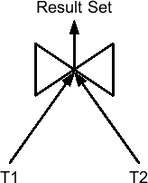
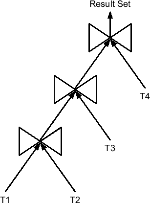
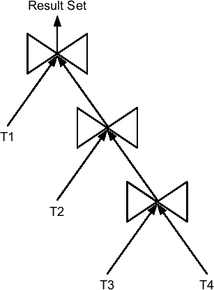
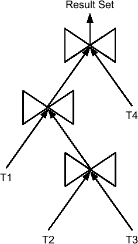
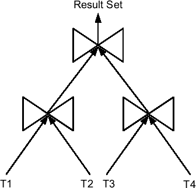

# 位图索引执行计划详解

## 位图索引组合查询

第三个查询与第一个类似。唯一的区别在于条件 `n4!=6` 代替了 `n4=6`。由于执行计划差异很大，我们来详细分析。

初始时，操作 6 扫描基于列 `n5` 的索引，查找满足条件 `n5=42` 的行。生成的位图传递给操作 5。接着，操作 7 对基于列 `n6` 的索引执行相同扫描，查找条件 `n6=11`。两次索引扫描完成后，操作 5 计算两组位图的 `AND` 操作，并将结果传递给操作 4。

然后，操作 8 扫描基于列 `n4` 的索引，查找满足条件 `n4=6` 的行（这与 `WHERE` 子句中指定的条件相反）。生成的位图传递给操作 4，该操作将其从操作 5 传递的位图中减去。

随后，操作 9 和 3 执行相同的扫描以查找条件 `n4 IS NULL`。这是必要的，因为 `NULL` 值不满足条件 `n4!=6`。

最后，操作 2 将结果位图转换为 rowid 列表，操作 1 使用这些 rowid 访问表。

```sql
SELECT /*+ index_combine(t i_n4 i_n5 i_n6) */ *
FROM t
WHERE n4 != 6 AND n5 = 42 AND n6 = 11
```

```
-------------------------------------------------------------------------
| Id | Operation                     | Name | Starts | A-Rows | Buffers |
-------------------------------------------------------------------------
|  1 |  TABLE ACCESS BY INDEX ROWID  | T    |      1 |      1 |       9 |
|  2 |   BITMAP CONVERSION TO ROWIDS |      |      1 |      1 |       8 |
|*  3 |    BITMAP MINUS              |      |      1 |      1 |       8 |
|  4 |    BITMAP MINUS              |      |      1 |      1 |       6 |
|  5 |     BITMAP AND               |      |      1 |      1 |       4 |
|*  6 |      BITMAP INDEX SINGLE VALUE| I_N5 |      1 |      1 |       2 |
|*  7 |      BITMAP INDEX SINGLE VALUE| I_N6 |      1 |      1 |       2 |
|*  8 |     BITMAP INDEX SINGLE VALUE | I_N4 |      1 |      1 |       2 |
|*  9 |     BITMAP INDEX SINGLE VALUE | I_N4 |      1 |      1 |       2 |
-------------------------------------------------------------------------

  6 - access("N5"=42)
  7 - access("N6"=11)
  8 - access("N4"=6)
  9 - access("N4" IS NULL)
```

总之，位图索引可以高效组合，并能在组合过程中应用多个 SQL 条件。简言之，它们非常灵活。由于这些特性，它们在查询未知（非固定）的报告系统中至关重要。

## B 树索引的位图执行计划

前一节描述的位图执行计划性能优异，同样适用于 B 树索引。其思想是数据库引擎能够基于 B 树索引扫描返回的数据构建一种内存中的位图索引。以下查询是一个示例，它与关于复合 B 树索引部分使用的查询相同。注意，执行计划中的 `BITMAP CONVERSION FROM ROWIDS` 操作负责转换。

```sql
SELECT /*+ index_combine(t i_n1 i_n2 i_n3) */ *
FROM t
WHERE n1 = 6 AND n2 = 42 AND n3 = 11
```

```
-------------------------------------------------------------------------------------
| Id | Operation                                 | Name | Starts | A-Rows | Buffers |
-------------------------------------------------------------------------------------
|  1 |  TABLE ACCESS BY INDEX ROWID              | T    |      1 |      1 |      10 |
|  2 |   BITMAP CONVERSION TO ROWIDS             |      |      1 |      1 |       9 |
|  3 |    BITMAP AND                             |      |      1 |      1 |       9 |
|  4 |     BITMAP CONVERSION FROM ROWIDS         |      |      1 |      1 |       3 |
|*  5 |      INDEX RANGE SCAN                     | I_N2 |      1 |     89 |       3 |
|  6 |     BITMAP CONVERSION FROM ROWIDS         |      |      1 |      1 |       3 |
|*  7 |      INDEX RANGE SCAN                     | I_N3 |      1 |    164 |       3 |
|  8 |     BITMAP CONVERSION FROM ROWIDS         |      |      1 |      1 |       3 |
|*  9 |      INDEX RANGE SCAN                     | I_N1 |      1 |    527 |       3 |
-------------------------------------------------------------------------------------

  5 - access("N2"=42)
  7 - access("N3"=11)
  9 - access("N1"=6)
```

***

**注意**：查询优化器并不总能正确估计此转换的成本。与之相关的成本可能被低估。因此，即使转换不合适也可能被执行。如果这导致问题，您可以通过将未公开的初始化参数 `_b_tree_bitmap_plans` 设置为 `FALSE` 来禁用此功能。

***

## 索引全扫描

与索引相关的一个有用优化技术是，数据库引擎可以从索引中提取 rowid 列表以访问表，并获取存储在索引中的列数据。因此，当索引包含处理查询所需的所有数据时，可以执行 *索引全扫描*。这有助于减少逻辑读的数量。事实上，索引全扫描不访问表。如果索引的聚簇因子很高，这可能特别有用。以下查询说明了这一点。注意，没有执行表访问。

```sql
SELECT c1 FROM t WHERE c1 LIKE 'A%'
```

```
-------------------------------------------------------------------
| Id | Operation               | Name | Starts | A-Rows | Buffers |
-------------------------------------------------------------------
|*  1 |  INDEX RANGE SCAN       | I_C1 |      1 |    119 |       6 |
-------------------------------------------------------------------

  1 - access("C1" LIKE 'A%')
      filter("C1" LIKE 'A%')
```

如果 `SELECT` 子句引用的是列 `n1` 而不是 `c1`，查询优化器则无法利用索引全扫描。请注意，在以下示例中，查询执行了 124 次逻辑读（5 次访问索引，119 次访问表；换句话说，每个从索引获取的 rowid 对应一次）来检索 119 行：

```sql
SELECT n1 FROM t WHERE c1 LIKE 'A%'
```

```
-----------------------------------------------------------------------
| Id  | Operation                  | Name | Starts | A-Rows | Buffers |
-----------------------------------------------------------------------
|   1 | TABLE ACCESS BY INDEX ROWID| T    |      1 |    119 |     124 |
|*  2 |  INDEX RANGE SCAN          | I_C1 |      1 |    119 |       5 |
-----------------------------------------------------------------------

  2 - access("C1" LIKE 'A%')
  filter("C1" LIKE 'A%')
```


在这种情况下，为了利用**索引覆盖扫描**，你可能会向索引中添加列，即使这些列并未用于应用限制条件。其核心思想是创建一个复合索引，其索引键由 SQL 语句中引用的所有列组成，而不仅仅是`WHERE`子句中的列。换句话说，你是在“误用”索引来存储冗余数据，从而**最小化逻辑读取次数**。但请注意，索引的引导列必须是`WHERE`子句中引用的列之一。在本例中，这意味着创建了一个基于列`c1`和`n1`的复合索引。有了这个索引，完全相同的查询仅需**四次逻辑读取**即可检索到相同的行，而不是 124 次。

```
-------------------------------------------------------------------------
| Id  | Operation                 | Name    | Starts | A-Rows | Buffers |
-------------------------------------------------------------------------
|*  1 | INDEX RANGE SCAN          | I_C1_N1 |      1 |    119 |       4 |
-------------------------------------------------------------------------
```

```
  1 - access("C1" LIKE 'A%')
      filter("C1" LIKE 'A%')
```

尽管本节中的示例基于 B 树索引，但索引覆盖扫描同样适用于位图索引。

## 索引组织表

实现索引覆盖扫描的一种特殊方法是创建**索引组织表**。这类表的核心理念实际上是为了完全避免使用表段。相反，所有数据都存储在基于主键的索引段中。也可以将部分数据存储在溢出段中。然而，这样做会丧失使用索引组织表的优势（除非溢出段很少被访问）。当创建二级索引（即除主键外的另一个索引）时，也会发生同样的情况：需要访问两个段。因此，使用它没有好处。基于这些原因，你应该仅在满足两个条件时才考虑使用索引组织表。首先，表通常通过主键访问。其次，所有数据都可以存储在索引结构中（一行最多占用一个数据块的 50%空间）。在所有其他情况下，使用它们意义不大。

索引组织表中的一行不是通过物理 rowid 引用的，而是通过**逻辑 rowid**引用的。这种 rowid 由两部分组成：第一部分是一个“猜测”，指向该行（键）在插入时所在的数据块；第二部分是主键的值。通过逻辑 rowid 访问索引组织表时，首先遵循这个猜测，希望该行仍在插入时的数据块中。但是，由于当发生数据块拆分时这个猜测不会被更新，在执行 DML 语句后它可能会变得陈旧。如果猜测正确，使用逻辑 rowid 就可以**通过一次逻辑读取访问一行数据**（参见图 9-3）。如果猜测错误，逻辑读取的次数将等于或大于两次（一次是通过猜测进行的无效访问，另一次是使用主键的常规访问）。自然，为了获得最佳性能，**保持猜测正确至关重要**。为了评估此类猜测的正确性，视图`user_indexes`中提供了`pct_direct_access`列，该列由包`dbms_stats`更新。该值提供了特定索引的正确猜测百分比。以下示例（摘自脚本`iot_guess.sql`）不仅展示了陈旧猜测对逻辑读取次数的影响，还展示了如何纠正此类非最优情况（注意索引`i`是一个二级索引）：

```
SQL> SELECT pct_direct_access
  2 FROM user_indexes
  3 WHERE index_name = 'I';

PCT_DIRECT_ACCESS
-----------------
               76

SQL> SELECT /*+ index(t i) */ count(pad) FROM t WHERE n > 0;

------------------------------------------------------------------
| Id  | Operation                               | Name | Buffers |
------------------------------------------------------------------
|   1 | SORT AGGREGATE                          |      |    1496 |
|   2 |  INDEX UNIQUE SCAN                      | T_PK |    1496 |
|   3 |   INDEX RANGE SCAN                      | I    |       6 |
------------------------------------------------------------------

SQL> ALTER INDEX i UPDATE BLOCK REFERENCES;
SQL> execute dbms_stats.gather_index_stats(ownname=>user, indname=>'i')

SQL> SELECT pct_direct_access
  2 FROM user_indexes
  3 WHERE index_name = 'I';

PCT_DIRECT_ACCESS
-----------------
              100

SQL> SELECT /*+ index(t i) */ count(pad) FROM t WHERE n > 0;

-----------------------------------------------------------------
| Id  | Operation                               | Name | Buffers |
-----------------------------------------------------------------
|   1 | SORT AGGREGATE                          |      |    1006 |
|   2 |  INDEX UNIQUE SCAN                      | T_PK |    1006 |
|   3 | INDEX RANGE SCAN                        | I    |       6 |
-----------------------------------------------------------------
```

除了避免访问表段外，索引组织表还提供了两个不应低估的优势。第一，数据总是**聚簇存储**的，因此基于主键的范围扫描总能高效执行，而不像堆组织表那样仅在聚簇因子较低时才高效。第二个优势是，基于主键的范围扫描总是按照数据在主键索引中的存储顺序返回数据。这对于优化`ORDER BY`操作可能很有用。

## 全局、本地还是非分区索引？

对于分区表，通常会创建**本地分区索引**。这样做的主要优点是减少了索引和表分区之间的依赖关系。例如，在添加、删除或交换新分区时，事情会变得容易得多。简而言之，创建本地索引通常是好的。然而，也存在一些不可能或不建议这样做的情况。

第一个问题与主键和唯一索引有关。事实上，要基于本地索引，其键必须包含分区键。虽然有时可能实现，但更多时候，如果不扭曲逻辑数据库设计，就没有这种可能性。当使用范围分区时尤其如此。因此，在我看来，这应仅作为最后的手段来考虑。你绝不应该搞乱逻辑设计。既然逻辑设计不能改变，就只剩下另外两种可能性了。第一种是创建**非分区索引**。第二种是创建**全局分区索引**。后者仅在确有实际优势时才应实施。不过，由于此类索引通常是哈希分区的（顺便说一句，这只从 Oracle 数据库 10*g*才开始可能），因此仅对非常大的索引或承受极高负载的索引这样做才有利。总之，为了支持主键和唯一键而创建非分区索引的情况**并不少见**。


## 本地分区索引的第二个问题

本地分区索引的第二个问题是，对于无法利用分区修剪（partition pruning）的 SQL 语句，它们可能会使性能变得更差。这种情况的原因在本章前面的“Range Partitioning”一节中已经描述过。其对索引扫描的影响可能非常大。下面的例子基于 Figure 9-5 中的范围分区表，展示了问题可能是什么。首先，创建了一个非分区索引。通过它，查询执行了四次逻辑读取来检索一行。这很好。请注意，操作`TABLE ACCESS BY GLOBAL INDEX ROWID`表明`rowid`来自全局或非分区索引。

```sql
SQL> CREATE INDEX i ON t (n3);

SQL> SELECT * FROM t WHERE n3 = 3885;

1 row selected.

------------------------------------------------------------------------------------
| Id | Operation                               | Name | Starts | Pstart| Pstop | Buffers |
------------------------------------------------------------------------------------
|  1 | TABLE ACCESS BY GLOBAL INDEX ROWID      | T    |      1 | ROWID | ROWID |       4 |
|* 2 |  INDEX RANGE SCAN                       | I    |      1 |       |       |       3 |
------------------------------------------------------------------------------------

  2 - filter("N3"=3885)
```

对于这个测试的第二部分，索引被重新创建。这次它是一个本地索引。由于表有 48 个分区，索引也将有 48 个分区。因为测试查询不包含基于分区键的限制，所以无法执行分区修剪。这不仅由操作`PARTITION RANGE ALL`所证实，也由列`Pstart`和`Pstop`所证实。还要注意，操作`TABLE ACCESS BY LOCAL INDEX ROWID`表明`rowid`来自本地分区索引。此执行计划的问题在于，与前一种情况执行单次索引扫描不同，这次对每个分区都执行了一次索引扫描（注意操作 2 和 3 的列`Starts`）。因此，即使只检索单行数据，也需要 50 次逻辑读取。

```sql
SQL> CREATE INDEX i ON t (n3) LOCAL;

SQL> SELECT * FROM t WHERE n3 = 3885;

1 row selected.

------------------------------------------------------------------------------------
| Id | Operation                               | Name | Starts | Pstart| Pstop | Buffers |
------------------------------------------------------------------------------------
|  1 | PARTITION RANGE ALL                     |      |      1 |     1 |    48 |      50 |
|  2 |  TABLE ACCESS BY LOCAL INDEX ROWID      | T    |     48 |     1 |    48 |      50 |
|* 3 |   INDEX RANGE SCAN                      | I    |     48 |     1 |    48 |      49 |
------------------------------------------------------------------------------------

  3 - access("N3"=3885)
```

总之，如果没有分区修剪，逻辑读取的数量会与分区数量成比例地增加。因此，如前所述，有时使用非分区索引可能比分区索引更好。或者，作为一个折衷方案，拥有有限数量的分区可能是好的。然而，请注意，有时你没有选择。例如，位图索引只能创建为本地索引。

## 单表哈希集群访问

实际上，很少有数据库利用单表哈希集群。事实上，当它们被正确设置大小并通过集群键上的等值条件访问时，它们能提供出色的性能。这有两个原因。首先，它们不需要单独的访问结构（例如索引来定位数据）。实际上，集群键足以定位数据。其次，与一个集群键相关的所有数据都聚集在一起。这两个优势也在本章前面 Figure 9-3 和 9-4 中总结的测试中得到了证明。

单表哈希集群专用于实现那些频繁（理想情况下是总是）通过特定键访问的查找表。基本上，这与你可以从索引组织表获得的使用方式相同。然而，两者之间存在一些主要差异。Table 9-4 列出了与索引组织表相比，单表哈希集群的主要优点和缺点。关键的缺点是单表哈希集群需要精确地设置大小才能利用它们的优势。

**Table 9-4.** 单表哈希集群与索引组织表的比较

| **优点** | **缺点** |
| --- | --- |
| 性能更好（如果通过集群键访问且大小设置正确） | 需要仔细设置大小以避免哈希冲突和空间浪费 |
| 集群键可以不同于主键 | 不支持分区，不支持`LOB`列 |

当通过集群键访问单表哈希集群时，操作`TABLE ACCESS HASH`会出现在执行计划中。它的作用是直接通过集群键访问包含所需数据的块。由脚本`hash_cluster.sql`生成的输出摘录说明了这一点：

```sql
SELECT * FROM t WHERE id = 6

----------------------------------------------------------------
| Id  | Operation           | Name | Starts | A-Rows | Buffers |
----------------------------------------------------------------
|*  1 |  TABLE ACCESS HASH  | T    |      1 |      1 |       1 |
----------------------------------------------------------------

  1 - access("ID"=6)
```

除了等值条件，另一个能够通过集群键访问数据的条件是`IN`条件。当指定该条件时，操作`CONCATENATION`会出现在执行计划中。该操作的每个子节点执行一次以获取一个特定的集群键。

```sql
SELECT * FROM t WHERE id IN (6, 8, 19, 28)

--------------------------------------------------------------
| Id  | Operation         | Name | Starts | A-Rows | Buffers |
--------------------------------------------------------------
|   1 | CONCATENATION     |      |      1 |      4 |       4 |
|*  2 |  TABLE ACCESS HASH| T    |      1 |      1 |       1 |
|*  3 |  TABLE ACCESS HASH| T    |      1 |      1 |       1 |
|*  4 |  TABLE ACCESS HASH| T    |      1 |      1 |       1 |
|*  5 |  TABLE ACCESS HASH| T    |      1 |      1 |       1 |
--------------------------------------------------------------

  2 - access("ID"=28)
  3 - access("ID"=19)
  4 - access("ID"=8)
  5 - access("ID"=6)
```

必须强调的是，所有其他条件，如果没有索引可用，将导致全表扫描。例如，下面这个在`WHERE`子句中包含范围条件的查询，使用了一个索引：

```sql
SELECT * FROM t WHERE id < 6

------------------------------------------------------------------------
| Id  | Operation                   | Name | Starts | A-Rows | Buffers |
------------------------------------------------------------------------
|   1 |  TABLE ACCESS BY INDEX ROWID| T    |      1 |      5 |       5 |
|*  2 |   INDEX RANGE SCAN          | T_PK |      1 |      5 |       3 |
------------------------------------------------------------------------

  2 - access("ID"<6)
```


### 前往 第 10 章

本章不仅阐述了在选择高效访问路径时**选择性**的重要性，还介绍了处理存储在单表中数据的不同方法。为此，具有弱选择性的 SQL 语句应使用全表扫描、全分区扫描或全索引扫描。我还讨论了为了高效处理具有强选择性的 SQL 语句，首选的访问路径是基于 rowid、索引和单表哈希集群的。
到目前为止，我只讨论了处理单表的 SQL 语句。在实践中，将几个表连接在一起是相当常见的。为了解决这个问题，下一章将描述三种基本的连接方法及其优缺点，以便您了解何时以及如何使用适当的连接方法。

---

1. 实际上，也存在多表哈希集群和索引集群。由于它们在实践中很少使用，此处不作描述。

### 第 10 章
#### 优化连接

当一个 SQL 语句引用多个表时，查询优化器除了要确定每个表的访问路径外，还必须确定表的连接顺序以及使用的连接方法。查询优化器的目标是通过尽早过滤掉不需要的数据来最小化处理量。
本章首先定义关键术语，并解释三种基本连接方法（`嵌套循环连接`、`合并连接` 和 `哈希连接`）的工作原理。接着提供一些关于如何选择连接方法的建议。最后，本章描述了一些优化技术，如分区连接和转换。

---

**注意** 在本章中，几个 SQL 语句包含提示。这样做不仅是为了向您展示哪个提示会导向哪个执行计划，也是为了向您展示它们的使用示例。无论如何，文中既未提供真实引用，也未提供完整语法。您可以在 `SQL 参考` 手册的 第 2 章 中找到这些内容。

---

##### 定义

为避免误解，以下各节定义了本章中使用的一些术语和概念。具体来说，我将涵盖不同类型的连接树、限制条件与连接条件之间的区别，以及不同类型的连接。

#### 连接树

数据库引擎支持的所有连接方法一次只处理两组数据。这些被称为 `左输入` 和 `右输入`。之所以这样命名，是因为在使用图形化表示时（参见 图 10-1），其中一个输入位于连接的左侧（`T1`），另一个位于右侧（`T2`）。请注意，在此图形化表示中，左侧的节点在右侧的节点之前执行。
当需要连接两组以上的数据时，查询优化器会评估 `连接树`。查询优化器使用的连接树类型将在接下来的四节中描述。



**图 10-1.** *两组数据之间连接的图形化表示*

#### 左深树

如 图 10-2 所示，`左深树` 是一种连接树，其中每个连接的右输入是一个表（即，不是由先前连接生成的结果集）。这是查询优化器最常用的连接树。



**图 10-2.** *在左深树中，右输入始终是一个表。*

以下执行计划说明了 图 10-2 中描述的连接树。请注意，每个连接操作（即第 5、6、7 行）的第二个子节点（即右输入）都是一个表。

```
-------------------------------------
| Id | Operation            |  Name |
-------------------------------------
|  1 |   HASH JOIN           |      |
|  2 |    HASH JOIN          |      |
|  3 |    HASH JOIN          |      |
|  4 |     TABLE ACCESS FULL | T1   |
|  5 |     TABLE ACCESS FULL | T2   |
|  6 |    TABLE ACCESS FULL  | T3   |
|  7 |   TABLE ACCESS FULL   | T4   |
-------------------------------------
```

#### 右深树

如 图 10-3 所示，`右深树` 是一种连接树，其中每个连接的左输入是一个表。查询优化器很少使用这种连接树。



**图 10-3.** *在右深树中，左输入始终是一个表。*

以下执行计划说明了 图 10-3 中描述的连接树。请注意，每个连接操作（即第 2、4、6 行）的第一个子节点（即左输入）都是一个表。

```
-------------------------------------
| Id |  Operation            | Name |
-------------------------------------
|  1 | HASH JOIN             |      |
|  2 |  TABLE ACCESS FULL    | T1   |
|  3 |  HASH JOIN            |      |
|  4 |   TABLE ACCESS FULL   | T2   |
|  5 |   HASH JOIN           |      |
|  6 |    TABLE ACCESS FULL  | T3   |
|  7 |    TABLE ACCESS FULL  | T4   |
-------------------------------------
```

#### 之字形树

如 图 10-4 所示，`之字形树` 是一种连接树，其中每个连接至少有一个输入是表，但基于表的输入有时在左侧，有时在右侧。查询优化器不常使用这种类型的连接树。



**图 10-4.** *在之字形树中，两个输入中至少有一个是表。*

以下执行计划说明了 图 10-4 中描述的连接树：

```
------------------------------------
| Id | Operation            | Name |
------------------------------------
|* 1 | HASH JOIN            |      |
|* 2 |  HASH JOIN           |      |
|  3 |   TABLE ACCESS FULL  | T1   |
|* 4 |   HASH JOIN          |      |
|  5 |    TABLE ACCESS FULL | T2   |
|  6 |    TABLE ACCESS FULL | T3   |
|  7 |   TABLE ACCESS FULL  | T4   |
------------------------------------
```

#### 茂密树

如 图 10-5 所示，`茂密树` 是一种连接树，其连接可能有两个输入都不是表。换句话说，树的结构是完全自由的。查询优化器只有在没有其他可能性时才会选择这种类型的连接树。这通常发生在存在不可合并的视图或子查询时。



**图 10-5.** *茂密树的结构是完全自由的。*

以下执行计划说明了 图 10-5 中描述的连接树。请注意，连接操作 1 的子节点是另外两个连接操作的结果集。

```
-------------------------------------
| Id | Operation              | Name|
-------------------------------------
|  1 |  HASH JOIN             |     |
|  2 |   VIEW                 |     |
|  3 |    HASH JOIN           |     |
|  4 |     TABLE ACCESS FULL  | T1  |
|  5 |     TABLE ACCESS FULL  | T2  |
|  6 |   VIEW                 |     |
|  7 |    HASH JOIN           |     |
|  8 |     TABLE ACCESS FULL  | T3  |
|  9 |     TABLE ACCESS FULL  | T4  |
-------------------------------------
```


##### 连接类型

指定连接有两种语法类型。传统语法由最早的 SQL 标准（SQL-86）规定，它同时使用 `FROM` 子句和 `WHERE` 子句来指定连接。而较新的语法（自 Oracle9*i* 起支持，并首次出现在 SQL-92 中）仅使用 `FROM` 子句来指定连接。这种较新的语法有时被称为 `ANSI 连接语法`。然而，从 SQL 标准的角度来看，这两种语法类型都是有效的。对于 Oracle 而言，由于历史原因，最常用的是传统语法。事实上，不仅许多开发人员和 DBA 习惯于使用它，许多应用程序也是使用它开发的。尽管如此，较新的语法提供了传统语法不支持的可能性。以下各节将提供基于这两种语法的示例。这里用作示例的所有查询都在脚本 `join_types.sql` 中提供。

***

**注意** 本节描述的连接类型并非互斥。一个给定的连接可能属于多个类别。例如，完全可以设想一个既是 θ 连接又是自连接的情况。

***

## 交叉连接

`交叉连接`，也称为`笛卡尔积`，是将一个表的每一行与另一个表的每一行组合起来的操作。这种操作在以下查询说明的两种情况下执行。第一个查询使用了传统连接语法（未指定连接条件）：

```
SELECT emp.ename, dept.dname
FROM emp, dept
```

第二个查询使用了新的连接语法（使用了 `CROSS JOIN`）：

```
SELECT emp.ename, dept.dname
FROM emp CROSS JOIN dept
```

实际上，交叉连接很少被需要。然而，后一种语法更能明确表达开发者的意图。交叉连接的优点在于它们是被显式指定的。事实上，对于前一种语法，无法确定编写 SQL 语句的人是否忘记了 `WHERE` 子句。

## θ 连接

`θ 连接` 等同于在交叉连接的结果集上执行选择操作。换句话说，它不是返回一个表的每一行与另一个表的每一行的所有组合，而是只返回满足连接条件的行。以下两个查询是此类连接的示例：

```
SELECT emp.ename, salgrade.grade
FROM emp, salgrade
WHERE emp.sal BETWEEN salgrade.losal AND salgrade.hisal
```

```
SELECT emp.ename, salgrade.grade
FROM emp JOIN salgrade ON emp.sal BETWEEN salgrade.losal AND salgrade.hisal
```

θ 连接也称为 `内连接`。在前面使用新连接语法的查询中，`INNER` 关键字是隐含的，但也可以像下面的例子那样显式地写出来：

```
SELECT emp.ename, salgrade.grade
FROM emp INNER JOIN salgrade ON emp.sal BETWEEN salgrade.losal AND salgrade.hisal
```

## 等值连接

`等值连接`（又称 `自然连接`）是 θ 连接的一种特殊类型，其连接条件中只使用等于运算符。以下两个查询是示例：

```
SELECT emp.ename, dept.dname
FROM emp, dept
WHERE emp.deptno = dept.deptno
```

```
SELECT emp.ename, dept.dname
FROM emp JOIN dept ON emp.deptno = dept.deptno
```

## 自连接

`自连接` 是 θ 连接的一种特殊类型，其中表与自身进行连接。以下是两个查询示例。注意，在 `FROM` 子句中引用了 `emp` 表两次。

```
SELECT emp.ename, mgr.ename
FROM emp, emp mgr
WHERE emp.mgr = mgr.empno
```

```
SELECT emp.ename, mgr.ename
FROM emp JOIN emp mgr ON emp.mgr = mgr.empno
```

##### 外连接

`外连接` 扩展了 θ 连接的结果集。实际上，使用外连接时，即使另一个表中没有匹配的值，也会返回一个表（`保留表`）的所有行。值 `NULL` 会与另一个表中没有匹配行的返回列关联。例如，上一节（自连接）中的查询并没有返回 `emp` 表的所有行，因为员工 `KING`（总裁）没有经理。要使用传统语法指定外连接，必须使用 Oracle 的扩展（基于 `(+)` 运算符）。以下查询是一个示例：

```
SELECT emp.ename, mgr.ename
FROM emp, emp mgr
WHERE emp.mgr = mgr.empno(+)
```

要使用新语法指定外连接，有几种可能性。例如，以下两个查询与前面的查询是等效的：

```
SELECT emp.ename, mgr.ename
FROM emp LEFT JOIN emp mgr ON emp.mgr = mgr.empno
```

```
SELECT emp.ename, mgr.ename
FROM emp mgr RIGHT JOIN emp ON emp.mgr = mgr.empno
```

下面的查询表明，与 θ 连接类似，可以添加 `OUTER` 关键字来显式指定它是外连接：

```
SELECT emp.ename, mgr.ename
FROM emp LEFT OUTER JOIN emp mgr ON emp.mgr = mgr.empno
```

此外，使用新的连接语法，可以通过 `全外连接` 指定返回两个表的所有行。换句话说，两个表中在另一个表中没有匹配行的行都会被保留。以下查询是一个示例：

```
SELECT mgr.ename AS manager, emp.ename AS subordinate
FROM emp FULL OUTER JOIN emp mgr ON emp.mgr = mgr.empno
```

从 Oracle Database 10*g* 开始，还可以指定`分区外连接`。¹ 请注意，`分区`一词与第 9 章中讨论的对象的物理分区无关。相反，它的含义是在运行时将数据划分为若干个子集。其思路是在一个表与另一个表的子集之间执行外连接，而不是在两个表之间。例如，在下面的查询中，表 `emp` 根据 `job` 列被划分为子集。然后，每个子集与表 `dept` 进行外连接。

```
SELECT dept.dname, count(emp.empno)
FROM dept LEFT JOIN emp PARTITION BY (emp.job) ON emp.deptno = dept.deptno
WHERE emp.job = 'MANAGER'
GROUP BY dept.dname
```

## 半连接

两个表之间的 `半连接` 在另一个表中有匹配行时，返回一个表的行。与 θ 连接相反，左输入表的行最多只返回一次。此外，根本不返回右输入表的数据。连接条件使用 `IN` 或 `EXISTS` 编写。以下两个查询是示例：

```
SELECT deptno, dname, loc
FROM dept
WHERE deptno IN (SELECT deptno FROM emp)
```

```
SELECT deptno, dname, loc
FROM dept
WHERE EXISTS (SELECT deptno FROM emp WHERE emp.deptno = dept.deptno)
```

## 反连接

`反连接` 是半连接的一种特殊类型，它只返回一个表中在另一个表中没有匹配行的行。连接条件通常使用 `NOT IN` 或 `NOT EXISTS` 编写。以下两个查询是示例：

```
SELECT deptno, dname, loc
FROM dept
WHERE deptno NOT IN (SELECT deptno FROM emp)
```

```
SELECT deptno, dname, loc
FROM dept
WHERE NOT EXISTS (SELECT deptno FROM emp WHERE emp.deptno = dept.deptno)
```


