# 限制条件与连接条件

要选择连接方法，理解 `限制条件`（又称 `过滤条件`）与 `连接条件` 之间的区别至关重要。从语法角度来看，只有在使用旧式连接语法时，两者才可能被混淆。事实上，在旧式连接语法中，`WHERE` 子句同时用于指定限制条件和连接条件。而使用新式连接语法时，限制条件在 `WHERE` 子句中指定，连接条件则在 `FROM` 子句中指定。以下伪 SQL 语句说明了这一点：

```sql
SELECT *
FROM <table1> [OUTER] JOIN <table2> ON ( <join conditions> )
WHERE <restrictions>
```

从概念角度来看，包含连接条件和限制条件的 SQL 语句按以下方式执行：

*   根据连接条件连接两个数据集。
*   将限制条件应用于连接返回的结果集。

换句话说，指定连接条件是为了在连接两个数据集时避免产生笛卡尔积（交叉连接）。它的目的不是过滤结果集。而指定限制条件则是为了过滤前一个操作（例如，连接）返回的结果集。例如，在以下查询中，连接条件是 `emp.deptno=dept.deptno`，限制条件是 `dept.loc='DALLAS'`：

```sql
SELECT emp.ename
FROM emp, dept
WHERE emp.deptno = dept.deptno
AND dept.loc = 'DALLAS'
```

从实现角度来看，查询优化器误用限制条件和连接条件的情况并不少见。一方面，连接条件可能被用来过滤数据。另一方面，限制条件可能在连接条件之前被求值，以最小化需要连接的数据量。例如，前面的查询可能会使用如下执行计划。请注意限制条件 `dept.loc='DALLAS'`（操作 2）如何在连接条件 `emp.deptno=dept.deptno`（操作 1）之前被应用。

```
----------------------------------
| Id | Operation          | Name |
----------------------------------
|* 1 |  HASH JOIN         |      |
|* 2 |   TABLE ACCESS FULL| DEPT |
|  3 |   TABLE ACCESS FULL| EMP  |
----------------------------------

   1 - access("EMP"."DEPTNO"="DEPT"."DEPTNO")
   2 - filter("DEPT"."LOC"='DALLAS')
```

##### 嵌套循环连接

以下部分描述了嵌套循环连接的工作原理。首先，我描述其一般行为，然后给出一些两表和四表连接的例子。最后，我描述一些优化技术（例如，块预取）。所有示例均基于脚本 `nested_loops_join.sql`。

### 概念

嵌套循环连接处理的两个数据集称为 `外循环`（又称 `驱动行源`）和 `内循环`。外循环是左侧输入，内循环是右侧输入。如 图 10-6 所示，外循环执行一次，而内循环针对外循环返回的每一行都执行一次。

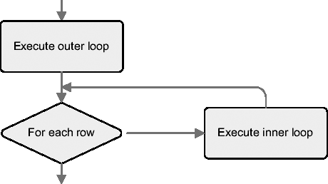

**图 10-6.** 嵌套循环连接执行的处理概览

嵌套循环连接具有以下特定特征：

*   左侧输入（外循环）仅执行一次。右侧输入（内循环）可能执行多次。
*   它们能够在完全处理所有行之前返回结果集的第一行。
*   它们能够利用索引来应用限制条件和连接条件。
*   它们支持所有类型的连接。

### 两表连接

以下是一个处理两个表之间嵌套循环连接的简单执行计划示例。该示例还展示了如何使用 `leading` 和 `use_nl` 提示来强制使用嵌套循环。前者指示首先访问表 `t1`。换句话说，它指定了哪个表在外循环中被访问。后者指定了使用哪种连接方法将内循环（即表 `t2`）返回的数据连接到表 `t1`。必须注意的是，`use_nl` 提示不包含对表 `t1` 的引用。

```sql
SELECT /*+ leading(t1) use_nl(t2) full(t1) full(t2) */ *
FROM t1, t2
WHERE t1.id = t2.t1_id
AND t1.n = 19
```

```
-----------------------------------
| Id | Operation           | Name |
-----------------------------------
|  0 | SELECT STATEMENT    |      |
|  1 |  NESTED LOOPS       |      |
|* 2 |   TABLE ACCESS FULL | T1   |
|* 3 |   TABLE ACCESS FULL | T2   |
-----------------------------------

   2 - filter("T1"."N"=19)
   3 - filter("T1"."ID"="T2"."T1_ID")
```

如 第 6 章 所述，`NESTED LOOPS` 操作是类型相关的组合操作。这意味着第一个子节点（外循环）控制第二个子节点（内循环）的执行。在这种情况下，执行计划的处理可以总结如下：

*   通过全表扫描读取表 `t1` 中的所有行，然后应用限制条件 `n=19`。
*   表 `t2` 的全表扫描执行的次数等于上一步返回的行数。

显然，当操作 2 返回多行时，这种执行计划效率低下，因此查询优化器几乎从不选择它。因此，在此特定示例中，必须指定两个访问提示（`full`）来强制查询优化器使用此执行计划。另一方面，如果外循环只返回一行且内循环的选择性很高，那么对表 `t2` 进行全表扫描可能是可行的。为了说明这一点，让我们为表 `t1` 的 `n` 列创建以下唯一索引：

```sql
CREATE UNIQUE INDEX t1_n ON t1 (n)
```

有了这个索引，前面的查询可以使用如下执行计划执行。请注意，由于操作 3（`INDEX UNIQUE SCAN`），内循环保证执行不超过一次。

```sql
SELECT /*+ ordered use_nl(t2) index(t1) full(t2) */ *
FROM t1, t2
WHERE t1.id = t2.t1_id
AND t1.n = 19
```

```
--------------------------------------------
| Id | Operation                    | Name |
--------------------------------------------
|  0 | SELECT STATEMENT             |      |
|  1 |  NESTED LOOPS                |      |
|  2 |   TABLE ACCESS BY INDEX ROWID| T1   |
|* 3 |    INDEX UNIQUE SCAN         | T1_N |
|* 4 |   TABLE ACCESS FULL          | T2   |
--------------------------------------------

  3 - access("T1"."N"=19)
  4 - filter("T1"."ID"="T2"."T1_ID")
```

正如前一章所讨论的，如果内循环的选择性非常低，那么对内循环使用索引扫描是有意义的。由于嵌套循环连接是一个相关的组合操作，对于内循环，甚至可以为此目的利用连接条件。例如，在以下执行计划中，操作 5 使用操作 3 返回的 `t1.id` 列的值进行查找：

```sql
SELECT /*+ ordered use_nl(t2) index(t1) index(t2) */ *
FROM t1, t2
WHERE t1.id = t2.t1_id
AND t1.n = 19
```

```
-------------------------------------------------
| Id | Operation                     | Name      |
-------------------------------------------------
|  0 |  SELECT STATEMENT             |           |
|  1 |   NESTED LOOPS                |           |
|  2 |    TABLE ACCESS BY INDEX ROWID| T1        |
|* 3 |     INDEX UNIQUE SCAN         | T1_N      |
|  4 |    TABLE ACCESS BY INDEX ROWID| T2        |
|* 5 |     INDEX RANGE SCAN          | T2_T1_ID  |
-------------------------------------------------

  3 - access("T1"."N"=19)
  5 - access("T1"."ID"="T2"."T1_ID")
```

总之，如果内循环执行多次（或很多次），只有具有良好选择性且导致极少逻辑读的访问路径才有意义。

#### 四表连接

以下执行计划是一个典型的左深树示例，采用嵌套循环连接实现（图形化表示请参考图 10-2）。请注意每个表是如何通过索引访问的。此示例还展示了如何通过使用提示 `ordered` 和 `use_nl` 来强制使用嵌套循环。前者指定按 `FROM` 子句中出现的相同顺序访问表。后者指定使用哪种连接方法将其他表连接到第一个表或前一次连接操作的结果集。

```sql
SELECT /*+ ordered use_nl(t2 t3 t4) */ t1.*, t2.*, t3.*, t4.*
FROM t1, t2, t3, t4
WHERE t1.id = t2.t1_id
AND t2.id = t3.t2_id
AND t3.id = t4.t3_id
AND t1.n = 19
```

```
---------------------------------------------------
| Id  | Operation                      | Name     |
---------------------------------------------------
|   0 | SELECT STATEMENT               |          |
|   1 |  NESTED LOOPS                  |          |
|   2 |   NESTED LOOPS                 |          |
|   3 |    NESTED LOOPS                |          |
|   4 |     TABLE ACCESS BY INDEX ROWID| T1       |
|*  5 |      INDEX RANGE SCAN          | T1_N     |
|   6 |     TABLE ACCESS BY INDEX ROWID| T2       |
|*  7 |      INDEX RANGE SCAN          | T2_T1_ID |
|   8 |   TABLE ACCESS BY INDEX ROWID  | T3       |
|*  9 |    INDEX RANGE SCAN            | T3_T2_ID |
|  10 |  TABLE ACCESS BY INDEX ROWID   | T4       |
|* 11 |   INDEX RANGE SCAN             | T4_T3_ID |
---------------------------------------------------

   5 - access("T1"."N"=19)
   7 - access("T1"."ID"="T2"."T1_ID")
   9 - access("T2"."ID"="T3"."T2_ID")
  11 - access("T3"."ID"="T4"."T3_ID")
```

这类执行计划的处理过程可概括如下（此描述假设未使用行预取）：

1.  当获取第一行时（换句话说，不是在查询被解析或执行时），处理开始于从表 `t1` 中获取满足条件 `t1.n=19` 的第一行。
2.  基于在表 `t1` 中找到的数据，查找表 `t2`。请注意，数据库引擎利用连接条件 `t1.id=t2.t1_id` 来访问表 `t2`。实际上，该表没有应用任何限制条件。只有满足连接条件的第一行被返回给父操作。
3.  基于在表 `t2` 中找到的数据，查找表 `t3`。同样，数据库引擎利用连接条件 `t2.id=t3.t2_id` 来访问表 `t3`。只有满足连接条件的第一行被返回给父操作。
4.  基于在表 `t3` 中找到的数据，查找表 `t4`。这里也是，数据库引擎利用连接条件 `t3.id=t4.t3_id` 来访问表 `t4`。满足连接条件的第一行会立即返回给客户端。
5.  当获取后续行时，执行与第一次获取相同的操作。显然，处理会从上次匹配的位置重新开始（如果有的话，可能是表 `t4` 中匹配的第二行）。必须强调的是，一旦找到满足请求的行，数据就会立即返回。换句话说，不必在返回第一行之前完全执行连接。

#### 块预取

在正常情况下，基于单块处理的每个访问路径（例如，`rowid` 访问和 `index range scan`）在缓存未命中时会导致单块物理读。对于嵌套循环连接，尤其是在处理大量行时，这可能效率非常低。事实上，嵌套循环连接通过多次单块物理读访问多个相邻块的情况并不少见。

为了提高嵌套循环连接的效率，数据库引擎能够利用块预取。这种优化技术的目标是用一次多块物理读替代对相邻块执行的多次单块物理读。这对于索引和表都适用。

观察访问路径无法判断数据库引擎是否会使用预取。唯一的方法是查看服务器进程执行的物理读，特别是与之相关的等待事件：

-  事件 `db file sequential read` 与单块物理读相关。因此，如果该事件发生，则说明要么没有使用块预取，要么无法使用它（例如，因为所需的块已在缓冲区缓存中）。
-  事件 `db file scattered read` 与多块物理读相关。因此，如果该事件在 `rowid` 访问或 `index range scan` 时发生，则意味着正在使用块预取。

重要的是要注意，您无法控制块预取的使用。数据库引擎决定是否利用它。

***

`注意` 正如 MetaLink 笔记 `Table Prefetching Causes Intermittent Wrong Results in 9iR2,10gR1, and 10gR2` (406966.1) 中所述，直到 Oracle Database 10*g* Release 2，表预取可能会导致错误的结果。我强烈建议您查阅该笔记，以确定该问题是否适用于您正在使用的版本。

***

## 替代执行计划

正如`双表连接`章节所讨论的，可以使用以下执行计划来执行嵌套循环连接：

```
----------------------------------------------
| Id | Operation                  | Name      |
----------------------------------------------
|  0 | SELECT STATEMENT           |           |
|  1 | NESTED LOOPS               |           |
|  2 | TABLE ACCESS BY INDEX ROWID| T1        |
|* 3 | INDEX UNIQUE SCAN          | T1_N      |
|  4 | TABLE ACCESS BY INDEX ROWID| T2        |
|* 5 | INDEX RANGE SCAN           | T2_T1_ID  |
----------------------------------------------
```

```
  3 - access("T1"."N"=19)
  5 - access("T1"."ID"="T2"."T1_ID")
```

实际上，在近期的版本中，只有当外循环或内循环基于索引唯一扫描时，才会使用这种类型的执行计划。让我们看看如果列 `n` 上的索引 `t1_n` 被定义为非唯一索引时会发生什么：

```
CREATE INDEX t1_n ON t1 (n)
```

在此索引存在的情况下，将使用以下执行计划。请注意表 `t2` 中通过 rowid 访问的位置发生了变化。在前一个计划中，它是操作 4，而在下面的计划中，它是操作 1。特殊之处在于 rowid 访问（操作 1）的子节点是嵌套循环连接（操作 2）。从我们的角度来看，这两个执行计划完成的工作是相同的。下面的执行计划可能是为了利用内部优化（如块预取）而实现的。

```
-------------------------------------------------
| Id | Operation                     | Name      |
-------------------------------------------------
|  0 | SELECT STATEMENT              |           |
|  1 |  TABLE ACCESS BY INDEX ROWID  | T2        |
|  2 |   NESTED LOOPS                |           |
|  3 |    TABLE ACCESS BY INDEX ROWID| T1        |
|* 4 |     INDEX RANGE SCAN          | T1_N      |
|* 5 |    INDEX RANGE SCAN           | T2_T1_ID  |
-------------------------------------------------
```

```
  4 - access("T1"."N"=19)
  5 - access("T1"."ID"="T2"."T1_ID")
```

从 Oracle Database 11g 开始，可能会观察到以下执行计划，以替代之前的计划。请注意，即使查询始终相同（即双表连接），该执行计划却包含两个嵌套循环连接！一个简单的性能测试显示，使用它大约有 10% 的性能提升。这可能是因为一个只适用于新执行计划的新的内部优化。为了控制这个新的执行计划，可以使用提示 `nlj_batching` 和 `no_nlj_batching`。

```
--------------------------------------------------
| Id |     Operation                  | Name      |
--------------------------------------------------
|  0 | SELECT STATEMENT               |           |
|  1 |  NESTED LOOPS                  |           |
|  2 |   NESTED LOOPS                 |           |
|  3 |    TABLE ACCESS BY INDEX ROWID | T1        |
|* 4 |     INDEX RANGE SCAN           | T1_N      |
|* 5 |    INDEX RANGE SCAN            | T2_T1_ID  |
|  6 |    TABLE ACCESS BY INDEX ROWID | T2        |
--------------------------------------------------
```

```
  4 - access("T1"."N"=19)
  5 - access("T1"."ID"="T2"."T1_ID")
```

##### 合并连接

接下来的章节将描述合并连接（亦称排序合并连接）的工作原理。我将从描述其一般行为开始，并给出一些双表和四表连接的示例。最后，描述处理过程中使用的工作区。所有示例都基于脚本 `merge_join.sql`。

### 概念

在处理合并连接时，两组数据都会被读取，并根据连接条件的列进行排序。一旦这些操作完成，两个工作区中包含的数据就会被合并，如图 10-7 所示。

合并连接具有以下特性：

*   每个子节点只执行一次。
*   两个输入都必须根据连接条件的列进行排序。
*   由于排序操作，在返回结果集的第一行之前，两个输入都必须完全读取并排序完毕。
*   支持所有类型的连接。

**注意** 在某些情况下，例如当使用合并连接执行交叉连接时，上述两个特性并不适用。首先，两个输入不需要排序。其次，第一行可以立即返回。本章不进一步描述这些情况，因为它们并不常见。

合并连接并不常用。原因是在大多数情况下，嵌套循环连接或哈希连接的性能都优于合并连接。然而，这种连接方法至关重要，因为它是唯一支持所有类型的连接的方法。

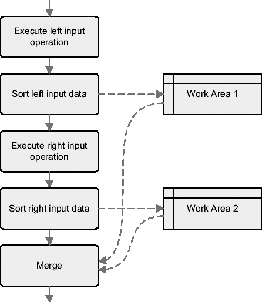

`图 10-7.` 合并连接执行处理的概述


## 两表连接

以下是一个简单的执行计划，处理两个表之间的归并连接。该示例还展示了如何通过使用 `ordered` 和 `use_merge` 提示来强制执行归并连接。

```sql
SELECT /*+ ordered use_merge(t2) */ *
FROM t1, t2
WHERE t1.id = t2.t1_id
AND t1.n = 19
```

```
------------------------------------
| Id | Operation            | Name |
------------------------------------
|  0 | SELECT STATEMENT     |      |
|  1 |  MERGE JOIN          |      |
|  2 |   SORT JOIN          |      |
|* 3 |    TABLE ACCESS FULL | T1   |
|* 4 |   SORT JOIN          |      |
|  5 |    TABLE ACCESS FULL | T2   |
------------------------------------

  3 - filter("T1"."N"=19)
  4 - access("T1"."ID"="T2"."T1_ID")
      filter("T1"."ID"="T2"."T1_ID")
```

正如在第 6 章中所描述的，`MERGE JOIN`（归并连接）操作属于无关合并类型。这意味着两个子操作只会被处理一次，并且彼此独立。在这种情况下，执行计划的处理过程可以总结如下：

*   通过全表扫描读取表 `t1` 中的所有行，应用限制条件 `n=19`，然后根据用作连接条件的列（`id`）对结果行进行排序。
*   通过全表扫描读取表 `t2` 中的所有行，并根据用作连接条件的列（`t1_id`）进行排序。
*   将两个数据集连接在一起，并返回结果行。请注意，连接本身是直接的，因为两个数据集已根据相同的值（连接条件中使用的列）进行了排序。

`MERGE JOIN` 操作（以及其他无关合并操作）最重要的限制是其无法利用索引来应用连接条件。换句话说，索引只能作为访问路径，在排序输入之前用于评估限制条件（如果可用）。因此，为了选择访问路径，你必须将第 9 章中讨论的方法应用于两个表。例如，如果限制条件 `n=19` 具有良好的选择性，创建索引来应用它可能是有用的。

```sql
CREATE INDEX t1_n ON t1 (n)
```

实际上，有了这个索引，可能会使用以下执行计划。你应该注意到，表 `t1` 不再是通过全表扫描访问的。

```
----------------------------------------------
| Id | Operation                              | Name |
----------------------------------------------
|  0 | SELECT STATEMENT                       |      |
|  1 |  MERGE JOIN                            |      |
|  2 |   SORT JOIN                            |      |
|  3 |    TABLE ACCESS BY INDEX ROWID | T1   |
|* 4 |     INDEX RANGE SCAN           | T1_N |
|* 5 |   SORT JOIN                            |      |
|  6 |    TABLE ACCESS FULL           | T2   |
----------------------------------------------

  4 - access("T1"."N"=19)
  5 - access("T1"."ID"="T2"."T1_ID")
      filter("T1"."ID"="T2"."T1_ID")
```

为了执行归并连接，可能会在排序操作上消耗不可忽略的资源。为了提高性能，查询优化器会在节省资源的情况下避免执行排序操作。但是，这只有在数据已经根据用作连接条件的列排好序时才可能。这在两种情况下会发生。第一种是当使用利用基于连接条件列构建的索引进行索引范围扫描时。第二种是当归并连接之前的步骤（例如，另一个归并连接）已经将数据按正确顺序排序时。例如，在下面的执行计划中，请注意表 `t1` 是如何通过索引 `t1_pk`（该索引是构建在用作连接条件的列 `id` 上的）访问的。因此，对于左侧输入，可以避免排序操作（`SORT JOIN`）。

```
----------------------------------------------
| Id | Operation                              | Name  |
----------------------------------------------
|  0 | SELECT STATEMENT                       |       |
|  1 |  MERGE JOIN                            |       |
|* 2 |   TABLE ACCESS BY INDEX ROWID | T1    |
|  3 |    INDEX FULL SCAN            | T1_PK |
|* 4 |   SORT JOIN                    |       |
|  5 |    TABLE ACCESS FULL          | T2    |
----------------------------------------------

  2 - filter("T1"."N"=19)
  4 - access("T1"."ID"="T2"."T1_ID")
      filter("T1"."ID"="T2"."T1_ID")
```

## 四表连接

以下执行计划是使用归并连接实现的典型左深树示例（关于图形化表示，请参阅图 10-2）。该示例还展示了如何通过 `leading` 和 `use_merge` 提示来强制执行归并连接。请注意，`leading` 提示仅从 Oracle Database 10*g* 开始支持多个表。

```sql
SELECT /*+ leading(t1 t2 t3) use_merge(t2 t3 t4) */ t1.*, t2.*, t3.*, t4.*
FROM t1, t2, t3, t4
WHERE t1.id = t2.t1_id
AND t2.id = t3.t2_id
AND t3.id = t4.t3_id
AND t1.n = 19
```

```
----------------------------------------
| Id  | Operation               | Name |
----------------------------------------
|  0  | SELECT STATEMENT        |      |
|  1  |  MERGE JOIN             |      |
|  2  |   SORT JOIN             |      |
|  3  |    MERGE JOIN           |      |
|  4  |     SORT JOIN           |      |
|  5  |      MERGE JOIN         |      |
|  6  |       SORT JOIN         |      |
|*  7  |        TABLE ACCESS FULL| T1   |
|*  8  |       SORT JOIN         |      |
|  9  |        TABLE ACCESS FULL| T2   |
|* 10  |      SORT JOIN          |      |
|  11 |        TABLE ACCESS FULL| T3   |
|* 12 |      SORT JOIN          |      |
|  13 |       TABLE ACCESS FULL | T4   |
----------------------------------------

   7 - filter("T1"."N"=19)
   8 - access("T1"."ID"="T2"."T1_ID")
       filter("T1"."ID"="T2"."T1_ID")
  10 - access("T2"."ID"="T3"."T2_ID")
       filter("T2"."ID"="T3"."T2_ID")
  12 - access("T3"."ID"="T4"."T3_ID")
       filter("T3"."ID"="T4"."T3_ID")
```

其处理过程与上一节讨论的两表连接并无本质不同。然而，重要的是要强调数据被多次排序。事实上，每个连接条件都基于不同的列。例如，表 `t1` 和表 `t2` 连接产生的结果数据，已根据表 `t1` 的 `id` 列排序，现在又通过操作 4 根据表 `t2` 的 `id` 列再次排序。操作 3 返回的数据也是如此。事实上，它必须根据表 `t3` 的 `id` 列进行排序。总之，为了处理这种类型的执行计划，必须执行六次排序，并且所有这些排序都必须在能够返回第一行数据之前完成。


#### 工作区

为了处理合并连接，内存中最多会使用两个工作区来对数据进行排序。如果排序完全在内存中处理，则称为*内存排序*。如果排序需要将临时数据溢出到磁盘，则称为*磁盘排序*。从性能角度来看，内存排序显然应该比磁盘排序更快。接下来的章节将讨论这两种排序的工作原理。我还将根据 `dbms_xplan` 包的输出，讨论如何识别用于处理 SQL 语句的是哪一种排序。

我在第 5 章讨论过工作区配置（大小调整）。你可能还记得，那部分介绍了两种大小调整方法。使用哪一种方法取决于初始化参数 `workarea_size_policy` 的值。这两种方法如下：

`auto`:
数据库引擎自动调整工作区的大小。专用于一个实例的 PGA 总量由初始化参数 `pga_aggregate_target` 限制，或者从 Oracle Database 11*g* 开始，由初始化参数 `memory_target` 限制。

`manual`:
初始化参数 `sort_area_size` 限制了单个工作区的最大大小。此外，初始化参数 `sort_area_retained_size` 控制排序结束后如何释放 PGA。

**内存排序**

内存排序的处理过程是直接的。数据被加载到工作区中，然后进行排序。需要强调的是，所有数据都必须加载到工作区中，而不仅仅是作为连接条件引用的列。因此，为了避免浪费大量内存，`SELECT` 子句中只应添加真正必需的列。为了说明这一点，让我们看两个基于上一节讨论的四表连接的例子。

在下面的例子中，所有表中的所有列都在 `SELECT` 子句中被引用。在执行计划中，`OMem` 和 `Used-Mem` 这两列提供了有关工作区的信息。前者是估计的内存排序所需内存量。后者是操作在执行期间实际使用的内存量。括号中的值（即零）表示排序完全在内存中处理。

```sql
SELECT `t1.*, t2.*, t3.*, t4.*` FROM t1, t2, t3, t4
WHERE t1.id = t2.t1_id
AND t2.id = t3.t2_id
AND t3.id = t4.t3_id
AND t1.n = 19
```

```
--------------------------------------------------------
| Id | Operation              | Name | `OMem` | `Used-Mem` |
--------------------------------------------------------
|  1 | MERGE JOIN             |      |       |            |
|  2 |  SORT JOIN             |      | 24576 | 22528 (0)  |
|  3 |   MERGE JOIN           |      |       |            |
|  4 |    SORT JOIN           |      |  4096 | 4096 (0)   |
|  5 |     MERGE JOIN         |      |       |            |
|  6 |      SORT JOIN         |      |  2048 | 2048 (0)   |
|  7 |       TABLE ACCESS FULL| T1   |       |            |
|  8 |      SORT JOIN         |      | 11264 | 10240 (0)  |
|  9 |       TABLE ACCESS FULL| T2   |       |            |
| 10 |    SORT JOIN           |      |   106K| 96256 (0)  |
| 11 |     TABLE ACCESS FULL  | T3   |       |            |
| 12 |  SORT JOIN             |      |   974K| 865K (0)   |
| 13 |   TABLE ACCESS FULL    | T4   |       |            |
--------------------------------------------------------
```

在下面的例子中，`SELECT` 子句中仅引用了 `WHERE` 子句中已引用的列之一。需要注意的是，除了操作 6 之外，所有其他排序都使用了更小的工作区，而且即使在两种情况下执行计划相同，这一点也成立。同时请注意，查询优化器的估算（`OMem` 列）已经考虑到了这种差异。

```sql
SELECT `t1.id, t2.id, t3.id, t4.id` FROM t1, t2, t3, t4
WHERE t1.id = t2.t1_id
AND t2.id = t3.t2_id
AND t3.id = t4.t3_id
AND t1.n = 19
```

```
-----------------------------------------------------------
| Id | Operation                | Name | `OMem` | `Used-Mem` |
-----------------------------------------------------------
|  1 |  MERGE JOIN              |      |       |            |
|  2 |   SORT JOIN              |      |  4096 | 4096   (0) |
|  3 |    MERGE JOIN            |      |       |            |
|  4 |     SORT JOIN            |      |  2048 | 2048   (0) |
|  5 |      MERGE JOIN          |      |       |            |
|  6 |       SORT JOIN          |      |  2048 | 2048   (0) |
|  7 |        TABLE ACCESS FULL | T1   |       |            |
|  8 |       SORT JOIN          |      |  4096 | 4096   (0) |
|  9 |        TABLE ACCESS FULL | T2   |       |            |
| 10 |     SORT JOIN            |      | 36864 | 32768  (0) |
| 11 |      TABLE ACCESS FULL   | T3   |       |            |
| 12 |   SORT JOIN              |      |   337K| 299K (0)   |
| 13 |    TABLE ACCESS FULL     | T4   |       |            |
-----------------------------------------------------------
```

**磁盘排序**

当工作区太小而无法容纳所有数据时，数据库引擎会分几个步骤处理排序。这些步骤在下面的列表中详细说明。显然，实际的步骤数不仅取决于数据量，还取决于工作区的大小。

1.  数据从表中读取并存储到工作区。在存储时，会构建一个根据排序条件组织数据的结构。在此示例中，数据根据 `id` 列排序。这是图 10-8 中的步骤 1。
2.  当工作区已满时，其部分内容会被溢出到用户临时表空间中的一个临时段。这种类型的数据批次称为*排序运行*。请注意，所有数据不仅存储在工作区中，也存储在临时段中。这是图 10-8 中的步骤 2。

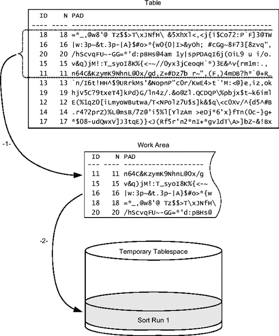

**图 10-8.** *磁盘排序，第一次排序运行*

3.  由于数据已溢出到临时段，工作区中释放出了一些可用空间。因此，可以继续读取输入数据并存储到工作区中。这是图 10-9 中的步骤 3。
4.  当工作区再次变满时，另一个排序运行被存储到临时段中。这是图 10-9 中的步骤 4。

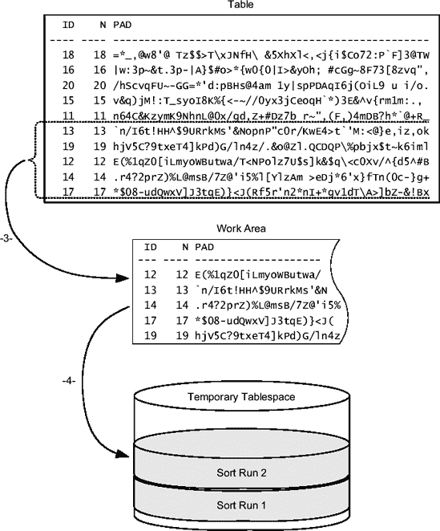

**图 10-9.** *磁盘排序，第二次排序运行*

5.  当所有数据都被排序并存储到临时段中时，就到了合并它们的时候了。合并阶段是必要的，因为每个排序运行都是独立排序的。为了执行合并，会从每个排序运行中读取一些数据。例如，当 id 等于 11 的行存储在排序运行 1 中时，id 等于 12 的行则存储在排序运行 2 中。换句话说，合并利用了数据在溢出到临时段之前已被排序这一事实，以便顺序读取每个排序运行。这是图 10-10 中的步骤 5。
6.  一旦有正确排序的数据可用，就可以将其返回给父操作。这是图 10-10 中的步骤 6。

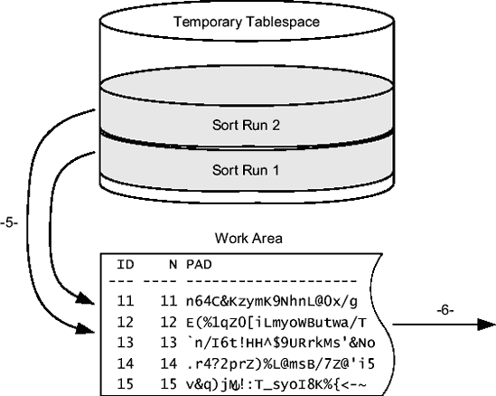

**图 10-10.** *磁盘排序，合并阶段*


在刚才描述的例子中，数据只被写入和从临时段读取了一次。这种排序称为 **`一次排序`**。当工作区的大小远小于待排序数据量时，则需要多个合并阶段。在这种情况下，数据会被多次写入和从临时段读取。这种排序称为 **`多次排序`**。显然，从性能角度看，一次排序应比多次排序更快。

为了识别这两种排序类型，您可以使用 `dbms_xplan` 包生成的输出。让我们看一下基于上一节已使用的四表连接的输出示例。此输出中显示了两个额外的列：`1Mem` 和 `Used-Tmp`。前者是一次排序所需估计的内存量。后者是该操作在执行期间使用的临时段实际大小。如果没有可用值，则表示已执行内存排序。另外，请注意，对于使用临时空间的操作，方括号中的值不再为 0。它们的值被设置为为该排序执行的传递次数。换句话说，虽然操作 10 是一次排序，但操作 12 是多次（九次）排序。

```sql
SELECT t1.*, t2.*, t3.*, t4.*
FROM t1, t2, t3, t4
WHERE t1.id = t2.t1_id
AND t2.id = t3.t2_id
AND t3.id = t4.t3_id
AND t1.n = 19
```
```
-----------------------------------------------------------------------
| Id | Operation            | Name |  OMem | 1Mem | Used-Mem| Used-Tmp|
| ---------------------------------------------------------------------
|   1|MERGE JOIN            |      |       |      |         |         |
|   2| SORT JOIN            |      | 37888 | 37888|32768 (0)|         |
|   3|  MERGE JOIN          |      |       |      |         |         |
|   4|   SORT JOIN          |      |  5120 |  5120| 4096 (0)|         |
|   5|   MERGE JOIN         |      |       |      |         |         |
|   6|    SORT JOIN         |      |  3072 |  3072| 2048 (0)|         |
|   7|     TABLE ACCESS FULL| T1   |       |      |         |         |
|   8|    SORT JOIN         |      | 23552 |23552 |20480 (0)|         |
|   9|     TABLE ACCESS FULL| T2   |       |      |         |         |
|  10|   SORT JOIN          |      |  108K |  108K|74752 (1)|    1024 |
|  11|    TABLE ACCESS FULL | T3   |       |      |         |         |
|  12|SORT JOIN             |      | 1251K |  576K|74752 (9)|    2048 |
|  13| TABLE ACCESS FULL    | T4   |       |      |         |         |
-----------------------------------------------------------------------
```

***

`注意` 通常，`dbms_xplan` 包的输出显示的是以字节为单位的内存大小值。不幸的是，正如 第 6 章 中指出的，`Used-Tmp` 列中的值必须乘以 `1,024` 才能得到字节数。例如，在前面的输出中，操作 10 和 12 分别使用了 1MB 和 2MB 的临时空间。

***

##### 哈希连接

本节描述哈希连接的工作原理。首先给出其一般行为描述以及两表和四表连接的一些示例，接着描述处理期间使用的工作区。最后，描述一种特殊的优化技术——索引连接。所有示例均基于脚本 `hash_join.sql`。

#### 概念

哈希连接处理的两组数据称为 **`构建输入`** 和 **`探测输入`**。构建输入是左侧输入，探测输入是右侧输入。如 图 10-11 所示，使用构建输入的每一行，在内存中（或在内存不足时使用临时空间）构建一个哈希表。请注意，为此目的使用的哈希键是基于用作连接条件的列计算的。一旦哈希表包含了构建输入的所有数据，就开始处理探测输入。每一行都会针对哈希表进行探测，以查明其是否满足连接条件。显然，只返回匹配的行。

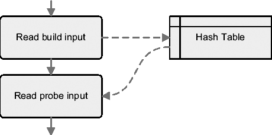
**图 10-11.** 哈希连接执行的处理概览

哈希连接具有以下特性：

*   每个子节点只执行一次。
*   哈希表仅在左侧输入上构建。因此，它通常在最小的输入上构建。
*   在返回第一行之前，必须完全处理左侧输入。
*   不支持交叉连接、theta 连接和分区外连接。

#### 两表连接

以下是一个处理两表间哈希连接的简单执行计划示例。该示例还展示了如何通过 `leading` 和 `use_hash` 提示来强制使用哈希连接。

```sql
SELECT /*+ leading(t1) use_hash(t2) */ *
FROM t1, t2
WHERE t1.id = t2.t1_id
AND t1.n = 19
```
```
----------------------------------
| Id | Operation          | Name |
----------------------------------
|   0| SELECT STATEMENT   |      |
|*  1|  HASH JOIN         |      |
|*  2|   TABLE ACCESS FULL| T1   |
|   3|   TABLE ACCESS FULL| T2   |
----------------------------------
```
```
   1 - access("T1"."ID"="T2"."T1_ID")
   2 - filter("T1"."N"=19)
```

如 第 6 章 所述，`HASH JOIN` 操作属于非关联组合类型。这意味着两个子节点仅处理一次且彼此独立。在这种情况下，执行计划的处理过程可以总结如下：

*   通过全表扫描读取表 `t1` 的所有行，应用限制条件 `n=19`，并用结果行构建哈希表。为构建哈希表，对用作连接条件的列 `(id)` 应用哈希函数。
*   通过全表扫描读取表 `t2` 的所有行，对用作连接条件的列 `(t1_id)` 应用哈希函数，并探测哈希表。如果找到匹配项，则返回结果行。

`HASH JOIN` 操作（与其他非关联组合操作一样）最重要的限制是无法利用索引来应用连接条件。这意味着仅当存在限制条件时，索引才能用作访问路径。因此，为了选择访问路径，有必要对两个表都应用 第 9 章 中讨论的方法。例如，如果限制条件 `n=19` 具有良好的选择性，则创建一个索引来应用它可能是有用的。

```sql
CREATE INDEX t1_n ON t1 (n)
```

实际上，有了这个索引，可能会使用以下执行计划。请注意，表 `t1` 不再通过全表扫描访问。

```
--------------------------------------------
| Id | Operation                    | Name |
--------------------------------------------
|   0| SELECT STATEMENT             |      |
|*  1|  HASH JOIN|                  |      |
|   2|   TABLE ACCESS BY INDEX ROWID| T1   |
|*  3|    INDEX RANGE SCAN          | T1_N |
|   4|   TABLE ACCESS FULL          | T2   |
--------------------------------------------
```
```
   1 - access("T1"."ID"="T2"."T1_ID")
   3 - access("T1"."N"=19)
```


#### 四表连接

以下执行计划是一个典型的左深树示例，使用哈希连接实现（有关图形表示，请参考图 10-2）。此示例还展示了如何通过提示`leading`和`use_hash`来强制使用哈希连接。

```
SELECT /*+ leading(t1 t2 t3) use_hash(t2 t3 t4) */ t1.*, t2.*, t3.*, t4.*
FROM t1, t2, t3, t4
WHERE t1.id = t2.t1_id
AND t2.id = t3.t2_id
AND t3.id = t4.t3_id
AND t1.n = 19
------------------------------------
| Id | Operation            | Name |
------------------------------------
|   0| SELECT STATEMENT     |      |
|*  1|  HASH JOIN           |      |
|*  2|   HASH JOIN          |      |
|*  3|    HASH JOIN         |      |
|*  4|     TABLE ACCESS FULL| T1   |
|   5|     TABLE ACCESS FULL| T2   |
|   6|    TABLE ACCESS FULL | T3   |
|   7|   TABLE ACCESS FULL  | T4   |
------------------------------------
   1 - access("T3"."ID"="T4"."T3_ID")
   2 - access("T2"."ID"="T3"."T2_ID")
   3 - access("T1"."ID"="T2"."T1_ID")
   4 - filter("T1"."N"=19)
```

此类执行计划的处理过程总结如下：

* 表`t1`通过全表扫描读取，应用限制条件`n=19`，并创建一个包含结果行的哈希表。
* 表`t2`通过全表扫描读取，并探测前一步创建的哈希表。然后，创建一个包含结果行的哈希表。
* 表`t3`通过全表扫描读取，并探测前一步创建的哈希表。然后创建一个包含结果行的哈希表。
* 表`t4`通过全表扫描读取，并探测前一步创建的哈希表。返回结果行。只有在表`t1`、`t2`和`t3`都已完全处理完毕后，才能返回第一行。相反，要返回第一行，则无需完全处理表`t4`。

哈希连接的一个独特性质是它们也支持右深树和锯齿形树。以下执行计划是前者的示例（有关图形表示，请参考图 10-3）。与上一个示例相比，只有 SQL 语句中指定的提示不同。

```
SELECT /*+ leading(t3 t4 t2) use_hash(t1 t2 t4) */ t1.*, t2.*, t3.*, t4.*
FROM t1, t2, t3, t4
WHERE t1.id = t2.t1_id
AND t2.id = t3.t2_id
AND t3.id = t4.t3_id
AND t1.n = 19
-------------------------------------
| Id  | Operation            | Name |
-------------------------------------
|   0 | SELECT STATEMENT     |      |
|*  1 |  HASH JOIN           |      |
|*  2 |   TABLE ACCESS FULL  | T1   |
|*  3 |   HASH JOIN          |      |
|   4 |    TABLE ACCESS FULL | T2   |
|*  5 |    HASH JOIN         |      |
|   6 |     TABLE ACCESS FULL| T3   |
|   7 |     TABLE ACCESS FULL| T4   |
-------------------------------------
   1 - access("T1"."ID"="T2"."T1_ID")
   2 - filter("T1"."N"=19)
   3 - access("T2"."ID"="T3"."T2_ID")
   5 - access("T3"."ID"="T4"."T3_ID")
```

两个执行计划（即左深树和右深树）之间的区别之一是在给定时间使用的活动工作区（即哈希表）的数量。对于左深树，最多同时有两个工作区可用。此外，当处理最后一个表时，只需要一个工作区。另一方面，在右深树中，在几乎整个执行过程中，分配和探测的工作区数量（等于连接的数量）。

动态性能视图`v$sql_workarea_active`提供有关活动工作区的信息。以下查询显示了当前正在执行上述执行计划的会话所使用的工作区。`operation_id`列用于将工作区与执行计划中的操作关联起来，`actual_mem_used`列显示大小（以字节为单位），`tempseg_size`和`tablespace`列提供了临时空间使用情况的信息。

```
SQL> SELECT operation_id, operation_type, actual_mem_used, tempseg_size, tablespace
  2 FROM v$session s, v$sql_workarea_active w
  3 WHERE s.sid = w.sid
  4 AND s.sid = 87;

OPERATION_ID OPERATION_TYPE ACTUAL_MEM_USED TEMPSEG_SIZE TABLESPACE
------------ -------------- --------------- ------------ ----------
           1 HASH-JOIN                57344
           3 HASH-JOIN               178176
           5 HASH-JOIN               196608      1048576 TEMP
```

#### 工作区

为了处理哈希连接，需要使用内存中的工作区来存储哈希表。如果工作区足够大以存储整个哈希表，则哈希连接完全在内存中处理。如果工作区不够大，数据会溢出到临时段中。本章前面已经解释了如何判断连接是否完全在内存中执行。

我在第 5 章中讨论了工作区配置（大小调整）。你可能还记得，有两种方法可以执行大小调整。你使用哪种方法取决于初始化参数`workarea_size_policy`的值。

`auto:`

数据库引擎自动进行工作区的大小调整。专用于一个实例的 PGA 总量由初始化参数`pga_aggregate_target`限制，或者从 Oracle 数据库 11g 开始，由初始化参数`memory_target`限制。

`manual:`

初始化参数`hash_area_size`限制单个工作区的最大大小。

##### 索引连接

索引连接只能使用哈希连接执行。因此，它们可以被视为哈希连接的一种特殊情况。它们的目的是通过连接属于同一个表的两个或多个索引来避免昂贵的全表扫描。当一个表有许多被索引的列，而 SQL 语句仅引用其中少数几列时，这可能非常有用。以下查询是一个示例。请注意该查询如何只引用一个表，但出乎意料的是，执行的是连接而不是单表访问。同样重要的是要注意，两个数据集之间的连接条件基于 rowid。此示例还展示了如何通过提示`index_join`来强制使用索引连接。

```
SELECT /*+ index_join(t4 t4_n t4_pk) */ id, n
FROM t4
WHERE id BETWEEN 10
AND 20
AND n < 100

-----------------------------------------------
| Id  | Operation          | Name             |
-----------------------------------------------
|   0 | SELECT STATEMENT   |                  |
|*  1 |  VIEW              | index$_join$_001 |
|*  2 |   HASH JOIN        |                  |
|*  3 |    INDEX RANGE SCAN| T4_N             |
|*  4 |    INDEX RANGE SCAN| T4_PK            |
-----------------------------------------------
    1 - filter("ID"<=20 AND "N"<100 AND "ID">=10)
    2 - access(ROWID=ROWID)
    3 - access("N"<100)
    4 - access("ID">=10 AND "ID"<=20)
```


##### 外连接

前面描述的三种基本连接方法都支持外连接。当执行外连接时，在执行计划中唯一可见的区别是连接操作附加了`OUTER`关键字。为了说明这一点，下面的 SQL 语句由于优化器提示的作用，执行的是外哈希连接。请注意，即使 SQL 语句使用了新的连接语法，其谓词仍然使用了基于操作符`(+)`的 Oracle 专有语法。

```sql
SELECT /*+ leading(t1) use_hash(t2) */ *
FROM t1 LEFT JOIN t2 ON (t1.id = t2.t1_id)
```

```
-----------------------------------
| Id  | Operation          | Name |
-----------------------------------
|   0 | SELECT STATEMENT   |      |
|*  1 |  HASH JOIN OUTER   |      |
|   2 |   TABLE ACCESS FULL|  T1  |
|   3 |   TABLE ACCESS FULL|  T2  |
-----------------------------------

   1 - access("T1"."ID"="T2"."T1_ID"(+))
```

外连接的一个重要限制是，保留表（例如前面 SQL 语句中的表`t1`）必须是连接操作的左侧输入。然而，从 Oracle Database 10*g*开始，这个限制被部分解除了。实际上，数据库引擎支持*右*外哈希连接。下面的执行计划基于与前面相同的 SQL 语句，说明了这一点。实际上，查询优化器会选择在较小的结果集上构建哈希表。当然，这有助于限制工作区的大小。在本例中，由于表`t1`小于表`t2`，为了演示目的，需要使用提示`swap_join_inputs`来强制查询优化器交换两个连接输入。

```sql
SELECT /*+ leading(t1) use_hash(t2) swap_join_inputs(t2) */ *
FROM t1 LEFT JOIN t2 ON (t1.id = t2.t1_id)
```

```
--------------------------------------
| Id  | Operation             | Name |
--------------------------------------
|   0 | SELECT STATEMENT      |      |
|*  1 |  HASH JOIN RIGHT OUTER|      |
|   2 |   TABLE ACCESS FULL   | T2   |
|   3 |   TABLE ACCESS FULL   | T1   |
--------------------------------------

   1 - access("T1"."ID"="T2"."T1_ID"(+))
```

因此，每当查询优化器需要为包含外连接的 SQL 语句生成执行计划时，它的选择是有限的。唯一的例外是从 Oracle Database 10*g*开始的哈希连接。

##### 选择连接方法

要选择连接方法，必须考虑以下问题：

*   优化器目标，即首行优化（first-rows）和全行优化（all-rows）
*   待优化的连接类型以及谓词的选择性
*   是否并行执行连接

接下来的章节将基于这三个标准，讨论如何选择连接方法，或者更具体地说，如何在嵌套循环连接、合并连接和哈希连接之间做出选择。

#### 首行优化

在首行优化下，总的响应时间是查询优化器的次要目标。返回第一行数据的响应时间才是其最重要的目标。因此，为了成功的首行优化，连接应该在找到第一个匹配行后立即返回，而不是在处理完所有行之后。为此，嵌套循环连接通常是最佳选择。哈希连接仅在一定程度上支持部分执行，偶尔有用。相比之下，合并连接很少适合首行优化。

#### 全行优化

在全行优化下，返回整个结果集的响应时间是查询优化器最重要的目标。因此，为了成功的全行优化，连接应尽快完全执行。选择最佳连接方法时，处理/返回行的绝对数量并不重要。关键的是处理/返回行的相对数量，即选择性。可以区分两种主要情况：

*   当选择性高时，哈希连接通常是最佳选择。
*   当选择性低时，嵌套循环连接通常是最佳选择。通常，只有当选择性是限制条件而非连接条件的结果时，才会考虑哈希连接和合并连接。

一般来说，只有当结果集已经排序，或者由于技术限制无法使用哈希连接时，才会考虑合并连接（见下一节）。

##### 支持的连接方法

要选择连接方法，了解需要执行哪种类型的连接至关重要。实际上，并非所有连接方法都支持所有类型的连接。表 10-1 总结了在什么情况下可用哪些方法。

**表 10-1.** *每种连接方法支持的连接类型*

| **连接** | **嵌套循环连接** | **哈希连接** | **合并连接** |
| --- | --- | --- | --- |
| 笛卡尔连接 | 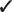 |  |  |
| Theta 连接 |  |  |  |
| 等值连接 |  |  |  |
| 半连接/反连接 |  |  |  |
| 外连接 |  |  |  |
| 分区外连接 |  |  |  |

#### 并行连接

所有连接方法都可以并行执行。然而，如图 10-12 所示，它们的扩展性不同。根据并行度的不同，一种方法可能比另一种更快。因此，为了选出最佳连接方法，了解是否使用并行处理以及并行度是多少至关重要。请注意，第 11 章 涵盖了并行处理。

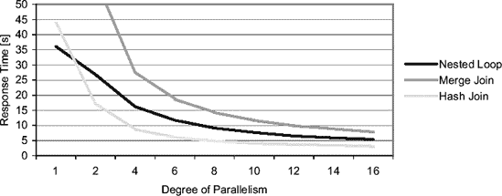

**图 10-12.** *不同并行度下的性能比较。此图显示了在具有 8 个 CPU 的系统上执行的一个两表连接（50K 行和 94M 行）。*

### 分区连接

*分区连接*（不应与分区外连接混淆）是一种优化技术，查询优化器仅将其应用于合并连接和哈希连接。分区连接用于减少处理连接所使用的 CPU、内存，以及在 RAC 情况下的网络资源。基本思想是将一个大连接分解为几个小连接。分区连接可以是完全的，也可以是部分的。接下来的章节描述了这两种方案。所有示例查询均在脚本`pwj.sql`中提供。

* * *

**注意** 分区连接需要分区表。因此，仅当使用企业版的分区选项时才可用。

* * *


## 全分区连接

为了说明全分区连接的操作，让我们首先描述不使用此优化时连接是如何执行的。图 10-13 显示了两个分区表之间的连接。所有两表行的单个连接由单个服务器进程执行。

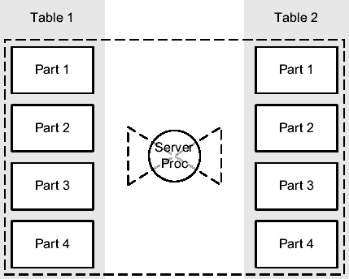

**图 10-13.** 不使用分区连接的两个分区表连接

当两个表在其连接键上进行等分区时，数据库引擎能够利用全分区连接。它不是执行一个大的连接，而是如图 10-14 所示，执行多个较小的连接（本例中为 4 个）。请注意，这是可能的，因为表的分区方式相同。因此，例如存储在表 1 的分区 1 中的每一行，在表 2 的分区 1 中只能有匹配的行。

将大连接分解为几个较小连接最有用的功能之一是能够并行化执行。实际上，数据库引擎能够为每个连接启动一个单独的从属进程。例如，在图 10-14 中，服务器进程协调四个从属进程来执行全分区连接。（第 11 章提供了关于并行处理的更多信息。）

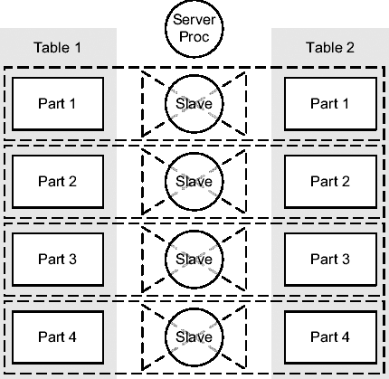

**图 10-14.** 使用全分区连接的两个表连接

图 10-15 显示了基于脚本 `pwj_performance.sql` 的性能测试结果。该测试旨在重现如图 10-14 所示的执行，具体来说，是连接具有四个分区的两个表。在此特定情况下，表分别包含 1,000,000 和 10,000,000 行。请注意，并行执行的程度等于分区数，即四个。

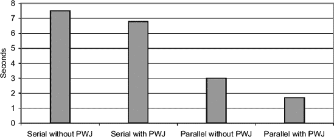

**图 10-15.** 使用和不使用全分区连接时，两表连接的响应时间

要识别是否使用了全分区连接，需要查看执行计划。如果分区操作出现在连接操作之前，则意味着正在使用全分区连接。在下面的执行计划中，分区操作 `PARTITION HASH ALL` 出现在连接操作 `HASH JOIN` 之前。注意你可以使用提示 `pq_distribute` 来强制使用全分区连接。

```
SELECT /*+ ordered use_hash(t2p) pq_distribute(t2p none none) */ *
FROM t1p, t2p
WHERE t1p.id = t2p.id

------------------------------------
| Id  | Operation           | Name |
------------------------------------
|   0 | SELECT STATEMENT    |      |
|   1 |  PARTITION HASH ALL |      |
|   2 |   HASH JOIN         |      |
|   3 |    TABLE ACCESS FULL| T1P  |
|   4 |    TABLE ACCESS FULL| T2P  |
------------------------------------
```

上述执行计划显示了一个串行的全分区连接。下面显示的是相同 SQL 语句在并行处理时使用的执行计划。同样，分区操作 `PX PARTITION HASH ALL` 出现在连接操作 `HASH JOIN` 之前。（第 11 章提供了关于用于并行处理的操作的更多信息。）

```
--------------------------------------------
| Id  | Operation               | Name     |
--------------------------------------------
|   0 | SELECT STATEMENT        |          |
|   1 |  PX COORDINATOR         |          |
|   2 |   PX SEND QC (RANDOM)   | :TQ10000 |
|   3 |    PX PARTITION HASH ALL|          |
|   4 |     HASH JOIN           |          |
|   5 |      TABLE ACCESS FULL  | T1P      |
|   6 |      TABLE ACCESS FULL  | T2P      |
--------------------------------------------
```

由于全分区连接需要两个等分区的表，在物理数据库设计期间使用此优化技术需要特别注意。换句话说，对预期会频繁进行大规模连接的表进行等分区是至关重要的。如果你不对它们进行等分区，就无法从全分区连接中受益。

同样重要的是要注意，所有分区方法都受支持，并且全分区连接能够连接分区与子分区。为了说明，假设有两个表：`sales` 和 `customers`。连接键是 `customer_id`。如果两个表都进行哈希分区，具有相同数量的分区，并且都使用连接键作为分区键，就有可能利用全分区连接。请记住，像 `sales` 这样的表（换句话说，包含历史数据的表）通常需要用范围分区进行分区。在这种情况下，可以对 `sales` 表进行复合分区：分区级别使用范围，子分区级别使用哈希，以同时满足两个需求。因此，全分区连接在 `customers` 表的哈希分区与 `sales` 表的子分区之间执行。

## 部分分区连接

与全分区连接相反，部分分区连接不需要两个等分区的表。此外，只需要一个表根据连接键进行分区；另一个表（可以是分区或未分区的）基于连接键动态分区。部分分区连接的另一个特点是它们只能并行执行。图 10-16 说明了一个部分分区连接。在这种情况下，其中一个表根本没有分区。在执行期间，数据库引擎启动两组并行从属进程。第一组读取未分区的表（表 2）并根据连接键分发数据。第二组从第一组接收数据，每个从属进程读取分区表的一个分区，然后执行其那部分的连接。

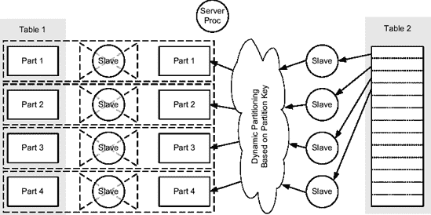

**图 10-16.** 使用部分分区连接的两个表连接

要识别是否使用了部分分区连接，需要查看执行计划。如果 `PX SEND` 操作的类型是 `PARTITION (KEY)`，则意味着正在使用部分分区连接。在以下示例中，操作 7 提供了该信息：

```
SELECT /*+ ordered use_hash(t2p) pq_distribute(t2p none partition) */ *
FROM t1p, t2p
WHERE t1p.id = t2p.id

-----------------------------------------------
| Id  | Operation                   | Name    |
-----------------------------------------------
|   0 | SELECT STATEMENT            |         |
|   1 |  PX COORDINATOR             |         |
|   2 |   PX SEND QC (RANDOM)       | :TQ10001|
|   3 |    HASH JOIN BUFFERED       |         |
|   4 |     PX PARTITION HASH ALL   |         |
|   5 |      TABLE ACCESS FULL      | T1P     |
|   6 |     PX RECEIVE              |         |
|   7 |      PX SEND PARTITION (KEY)| :TQ10000|
|   8 |       PX BLOCK ITERATOR     |         |
|   9 |        TABLE ACCESS FULL    | T2P     |
-----------------------------------------------
```

在实践中，部分分区连接不一定会带来性能提升。实际上，常规连接可能比部分分区连接更快。换句话说，使用部分分区连接可能对性能有害。因此，你很少会看到查询优化器使用这种优化技术。


##### 转换

查询优化器依靠转换来提升查询性能。其目标是生成语义等价的 SQL 语句（即产生相同结果的语句），这些语句要么更容易优化，要么具有更广阔的搜索空间。只要技术上可行，某些转换就会被执行，因为查询优化器假定它们总能带来更好的性能。另一些被称为*基于成本的转换*的操作，则仅在转换能带来更低开销时才会被应用。接下来的章节将描述与连接相关的四种转换：消除冗余连接、将外连接转换为内连接、子查询解嵌套和星型转换。

#### 连接消除

在某些特定情况下，从 Oracle Database 10*g* Release 2 开始，查询优化器能够完全避免执行一个连接，即使 SQL 语句显式要求进行连接。这种优化技术被称为*连接消除*。当使用包含连接的视图时，这种转换特别有用。但请注意，连接消除不仅限于视图，它也可以应用于不带视图的 SQL 语句。

让我们看一个基于脚本 `join_elimination.sql` 的示例，来阐释这种优化技术。以下 SQL 语句定义了该视图。请注意，表 `t1` 和表 `t2` 之间存在主从关系。事实上，表 `t2` 通过其列 `t1_id` 引用了表 `t1` 的主键。

```sql
CREATE VIEW v AS
SELECT t1.id AS t1_id, t1.n AS t1_n, t2.id AS t2_id, t2.n AS t2_n
FROM t1, t2
WHERE t1.id = t2.t1_id
```

当引用了所有列时，如下面的示例所示，连接会正常执行。这并不意外。

```sql
SELECT * FROM v
```

```
-----------------------------------
| Id  | Operation          | Name |
-----------------------------------
|   0 | SELECT STATEMENT   |      |
|*  1 |  HASH JOIN         |      |
|   2 |   TABLE ACCESS FULL| T1   |
|   3 |   TABLE ACCESS FULL| T2   |
-----------------------------------

   1 - access("T1"."ID"="T2"."T1_ID")
```

然而，如下面的示例所示，当仅引用了子表中定义的列时，查询优化器便能够消除该连接。它可以这样做，是因为存在一个已验证的外键约束，该约束保证了表 `t2` 中的所有行都引用表 `t1` 中的一行。

```sql
SELECT t2_id, t2_n FROM v
```

```
----------------------------------
| Id  | Operation         | Name |
----------------------------------
|   0 | SELECT STATEMENT  |      |
|   1 |  TABLE ACCESS FULL| T2   |
----------------------------------
```

#### 外连接转内连接

如果一个外连接是多余的，查询优化器可以将其转换为内连接。下面的示例基于脚本 `outer_to_inner.sql`，阐释了这种转换。第一条 SQL 语句对应的执行计划，由于使用了提示 `no_outer_join_to_inner`（此提示仅在 Oracle Database 11*g* 及以上版本可用），实现了一个外连接（`HASH JOIN OUTER`）。换句话说，没有应用任何转换。而在第二条 SQL 语句对应的执行计划中，不仅连接不再是外连接，而且对于限制条件 `t2.id IS NOT NULL` 也没有应用任何谓词。

```sql
SELECT /*+ no_outer_join_to_inner */ *
FROM t1, t2
WHERE t1.id = t2.t1_id(+)
AND t2.id IS NOT NULL
```

```
-------------------------------------
| Id  | Operation            | Name |
-------------------------------------
|   0 | SELECT STATEMENT     |      |
|*  1 |  FILTER              |      |
|*  2 |  HASH JOIN OUTER     |      |
|   3 |   TABLE ACCESS FULL  | T1   |
|   4 |   TABLE ACCESS FULL  | T2   |
-------------------------------------

   1 - filter("T2"."ID" IS NOT NULL)
   2 - access("T1"."ID"="T2"."T1_ID"(+))
```

```sql
SELECT *
FROM t1, t2
WHERE t1.id = t2.t1_id(+)
AND t2.id IS NOT NULL
```

```
-----------------------------------
| Id  | Operation          | Name |
-----------------------------------
|   0 | SELECT STATEMENT   |      |
|*  1 |  HASH JOIN         |      |
|   2 |   TABLE ACCESS FULL| T1   |
|   3 |   TABLE ACCESS FULL| T2   |
-----------------------------------

   1 - access("T1"."ID"="T2"."T1_ID")
```

显然，这类 SQL 语句的质量应该受到质疑。但无论如何，查询优化器能够识别此类异常情况并避免执行不必要的处理，这是一件好事。


## 子查询展开

简而言之，子查询展开的目的是将半连接和反连接子查询转换为常规连接。这样一来，查询优化器就能利用所有可用的连接方法。实际上，如果不进行子查询展开，执行子查询的基本方法是基于 `FILTER` 操作。下面的示例（基于脚本 `subquery_unnesting.sql`）说明了这一点。正如第 6 章所述，`FILTER` 操作是一种关联组合操作。因此，子查询（第 3 和第 4 行）对于主查询（第 2 行）返回的每一行（实际上，如第 6 章所述，对于列 `t2.t1_id` 的每一个不同值）都会执行一次。

```sql
SELECT *
FROM t2
WHERE EXISTS (SELECT /*+ no_unnest */ 1
             FROM t1
             WHERE t2.t1_id = t1.id
             AND t1.pad IS NOT NULL)
```

```
----------------------------------------------
| Id  | Operation                    | Name  |
----------------------------------------------
|   0 | SELECT STATEMENT             |       |
|*  1 |  FILTER                      |       |
|   2 |   TABLE ACCESS FULL          | T2    |
|*  3 |   TABLE ACCESS BY INDEX ROWID| T1    |
|*  4 |    INDEX UNIQUE SCAN         | T1_PK |
----------------------------------------------

   1 - filter( EXISTS (SELECT /*+ NO_UNNEST */ 0 FROM "T1" "T1" WHERE
              "T1"."ID"=:B1 AND "T1"."PAD" IS NOT NULL))
   3 - filter("T1"."PAD" IS NOT NULL)
   4 - access("T1"."ID"=:B1)
```

要生成此执行计划，必须在子查询中指定提示 `no_unnest`。换句话说，我不得不强制查询优化器不使用本节介绍的优化技术——子查询展开。实际上，如果没有 `no_unnest` 提示，查询优化器会展开子查询并产生下面的执行计划。请注意，半连接是通过 `HASH JOIN SEMI` 操作实现的。因此，表 `t1`（第 3 行）只被访问了一次。

```
-----------------------------------
| Id  | Operation          | Name |
-----------------------------------
|   0 | SELECT STATEMENT   |      |
|*  1 |  HASH JOIN SEMI    |      |
|   2 |   TABLE ACCESS FULL| T2   |
|*  3 |   TABLE ACCESS FULL| T1   |
-----------------------------------

   1 - access("T2"."T1_ID"="T1"."ID")
   3 - filter("T1"."PAD" IS NOT NULL)
```

即使在此示例中使用了哈希连接，也请注意查询优化器也可能选择使用其他连接方法。

展开子查询可以总结为两个步骤。第一步，如下面的查询所示，是将子查询重写为内联视图。请注意，这不是一个有效的 SQL 语句，因为实现半连接 `(s=)` 的运算符在 SQL 中不可用（它仅在查询优化器内部使用）。

```sql
SELECT *
FROM t2, (SELECT id FROM t1 WHERE pad IS NOT NULL) sq
WHERE t2.t1_id s= sq.id
```

第二步，如这里所示，是将内联视图重写为常规连接：

```sql
SELECT *
FROM t2, t1
WHERE t2.t1_id s= t1.id
AND t1.pad IS NOT NULL
```

虽然前面的示例基于半连接，但相同的优化技术也用于反连接。不过请注意，这类转换并非总是能应用。例如，如果子查询包含集合运算符、某些类型的聚合或伪列 `rownum`，则无法使用子查询展开。

## 星型转换

*星型转换*是一种用于*星型模式*（也称为维度模型）的优化技术。这种模式由一个大型中心表（*事实表*）和若干其他表（*维度表*）组成。其主要特征是事实表引用维度表。图 10-17 是一个基于示例模式 SH 的示例（《*示例模式*》手册对此有完整描述）。

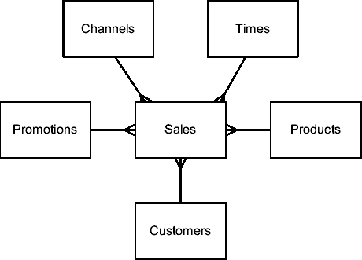

**图 10-17.** 一个典型的星型模式

以下是一个针对星型模式执行的典型查询：

```sql
SELECT c.cust_state_province, t.fiscal_month_name, sum(s.amount_sold) AS amount_sold
FROM sales s, customers c, times t, products p
WHERE s.cust_id = c.cust_id
AND s.time_id = t.time_id
AND s.prod_id = p.prod_id
AND c.cust_year_of_birth BETWEEN 1970 AND 1979
AND p.prod_subcategory = 'Cameras'
GROUP BY c.cust_state_province, t.fiscal_month_name
ORDER BY c.cust_state_province, sum(s.amount_sold) DESC
```

为了优化针对此星型模式的查询，查询优化器应该执行以下操作：

1.  开始评估每个带有约束条件的维度表。
2.  汇总结果维度键的列表。
3.  使用此列表从事实表中提取匹配的行。

不幸的是，这种方法无法用常规连接实现。一方面，查询优化器一次只能连接两个数据集。另一方面，连接两个维度表会导致笛卡尔积。为了解决这个问题，数据库引擎实现了星型转换。

* * *

**注意** 尽管星型转换最初在 1997 年随 Oracle8 引入，并在两年后的 Oracle8*i*中得到了显著增强——也就是说，它已经存在一段时间了——但其稳定性一直是个问题。可能自引入以来发布的每一个补丁集都修复了与之相关的错误。每当出现问题时，就会产生 `ORA-07445`、`ORA-00600` 错误或错误的结果。也就是说，我从 Oracle8*i* Release 2 开始就成功使用了这个功能。我的建议只是仔细测试它。如果有效，性能提升将是相当可观的。如果无效，至少在投入生产之前你就会知道。

* * *

要利用星型转换，你需要满足两个基本要求。首先，必须启用该功能。你使用初始化参数 `star_transformation_enabled` 来控制它。请注意，默认情况下，该功能是禁用的，因为参数设置为 `FALSE`。要启用它，应将其设置为 `temp_disable` 或 `TRUE`。其次，事实表上的每个外键必须有一个单列的位图索引。实际上，查询优化器也能够将 B 树索引动态转换为位图索引。但是，如果你想使用星型转换，最好首先创建位图索引。

当初始化参数 `star_transformation_enabled` 设置为 `temp_disable` 时，示例 SQL 语句将使用以下执行计划。此示例及后续示例均基于脚本 `star_transformation.sql`。


```
--------------------------------------------------------------------------
| Id  | Operation                          | Name                    |
--------------------------------------------------------------------------
|   0 | SELECT STATEMENT                   |                         |
|   1 |  SORT ORDER BY                     |                         |
|   2 |   HASH GROUP BY                    |                         |
|*  3 |    HASH JOIN                       |                         |
|   4 |     TABLE ACCESS FULL              | TIMES                   |
|*  5 |     HASH JOIN                      |                         |
|   6 |     PARTITION RANGE ALL            |                         |
|   7 |      TABLE ACCESS BY LOCAL INDEX ROWID| SALES                |
|   8 |       BITMAP CONVERSION TO ROWIDS  |                         |
|   9 |        BITMAP AND                  |                         |
|  10 |         BITMAP MERGE               |                         |
|  11 |          BITMAP KEY ITERATION      |                         |
|  12 |           BUFFER SORT              |                         |
|  13 |            TABLE ACCESS BY INDEX ROWID| PRODUCTS             |
|* 14 |             INDEX RANGE SCAN       | PRODUCTS_PROD_SUBCAT_IX |
|* 15 |            BITMAP INDEX RANGE SCAN | SALES_PROD_BIX          |
|  16 |          BITMAP MERGE              |                         |
|  17 |           BITMAP KEY ITERATION     |                         |
|  18 |            BUFFER SORT             |                         |
|* 19 |             TABLE ACCESS FULL      | CUSTOMERS               |
|* 20 |            BITMAP INDEX RANGE SCAN | SALES_CUST_BIX          |
|* 21 |      TABLE ACCESS FULL             | CUSTOMERS               |
--------------------------------------------------------------------------

    3 - access("S"."TIME_ID"="T"."TIME_ID")
    5 - access("S"."CUST_ID"="C"."CUST_ID")
   14 - access("P"."PROD_SUBCATEGORY"='Cameras')
   15 - access("S"."PROD_ID"="P"."PROD_ID")
   19 - filter("C"."CUST_YEAR_OF_BIRTH">=1970 AND "C"."CUST_YEAR_OF_BIRTH"<=1979)
   20 - access("S"."CUST_ID"="C"."CUST_ID")
   21 - filter("C"."CUST_YEAR_OF_BIRTH">=1970 AND "C"."CUST_YEAR_OF_BIRTH"<=1979)
```

由于这个执行计划包含一些特殊操作，让我们详细看看它的操作流程：

1.  执行从操作 4 开始，对维度表 `times` 进行全表扫描。利用从它返回的数据，构建一个哈希表。这对于操作 3，即哈希连接是必要的。
2.  操作 13 和 14 访问维度表 `products` 并应用限制条件 `p.prod_subcategory='Cameras'`。
3.  操作 12，`BUFFER SORT`，将操作 13 返回的数据存储在缓冲区中。
4.  操作 11，`BITMAP KEY ITERATION`，是一个关联组合操作。对于其第一个子操作（操作 12）返回的每一行，第二个子操作（操作 15）会执行一次。在这个案例中，执行的是基于事实表上定义的位图索引的查找。请注意，这种查找只能使用位图索引完成。这就是为什么你需要在事实表的每个外键列上建立位图索引。
5.  操作 10，`BITMAP MERGE`，合并其子操作传递给它的位图。这个操作是必要的，因为一个位图索引的索引键可能只覆盖了索引表的一部分。
6.  操作 16 到 20 以与操作 10 到 15 处理维度表 `products` 相同的方式处理维度表 `customers`。实际上，每个应用了限制条件的维度都以相同方式处理。
7.  操作 9，`BITMAP AND`，组合从其两个子操作（10 和 16）传递过来的位图，并只保留匹配的条目。
8.  操作 8，`BITMAP CONVERSION TO ROWIDS`，将其子操作（9）传递的位图转换为事实表 `sales` 的 rowid。
9.  操作 7 使用其子操作（8）传递的 rowid 访问事实表。
10. 利用操作 7 返回的行，构建一个哈希表。这对于操作 5，即哈希连接是必要的。请注意，操作 6 仅是信息性的，告诉你所有分区都被处理了。
11. 操作 21 对维度表 `customers` 进行全表扫描，并应用限制条件 `c.cust_year_of_birth BETWEEN 1970 AND 1979`。对于结果中的每一行，都会探测两个哈希连接（操作 3 和 5）的哈希表。如果找到匹配的行，则将它们传递给操作 2。
12. 操作 2，`HASH GROUP BY`，处理 `GROUP BY` 子句，并将结果行传递给操作 1。
13. 最后，操作 1，`SORT ORDER BY`，处理 `ORDER BY` 子句。

总之，执行星型转换需要执行以下步骤：

*   维度表与事实表上对应的位图索引进行“连接”。这个操作仅对应用了限制条件的维度表是必要的，在本例中是表 `products` 和 `customers`。
*   生成的位图被合并并转换为 rowid。然后，通过 rowid 访问事实表。
*   维度表与从事实表中选择的数据进行连接。这个操作仅对在 `WHERE` 子句之外引用了列的维度是必要的，在本例中，是表 `times` 以及再次出现的表 `customers`（这就是为什么表 `customers` 在执行计划中出现了两次）。

### 两个额外的优化技术

你可以对这种基本行为应用两种额外的优化技术：临时表和位图连接索引。

临时表的目的是避免维度表的重复处理。例如，在前面的执行计划中，不仅维度表 `customers` 被访问了两次并进行了全表扫描（操作 19 和 21），而且应用于它的谓词也执行了两次。其思路是只访问维度表一次，应用谓词，并将结果行存储在临时表中。当初始化参数 `star_transformation_enabled` 设置为 `TRUE` 时，就会启用这种优化技术。以下的执行计划是基于与之前相同的 SQL 语句，就是一个例子。请注意临时表 `sys_temp_0fd9d6600_2d2eac` 的创建（操作 1 到 3）及其使用（操作 22 和 24）。

