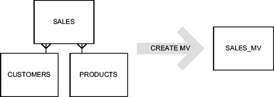

# 执行计划与位图连接索引

## 执行计划示例

```
 -----------------------------------------------------------------------------
 | Id  | Operation                               | Name                      |
 -----------------------------------------------------------------------------
 |   0 | SELECT STATEMENT                        |                           |
 |   1 |  TEMP TABLE TRANSFORMATION              |                           |
 |   2 |   LOAD AS SELECT                        | SYS_TEMP_0FD9D6600_2D2EAC |
 |*  3 |    TABLE ACCESS FULL                    | CUSTOMERS                 |
 |   4 |   SORT ORDER BY                         |                           |
 |   5 |    HASH GROUP BY                        |                           |
 |*  6 |     HASH JOIN                           |                           |
 |   7 |      TABLE ACCESS FULL                  | TIMES                     |
 |*  8 |      HASH JOIN                          |                           |
 |   9 |       PARTITION RANGE ALL               |                           |
 |  10 |        TABLE ACCESS BY LOCAL INDEX ROWID| SALES                     |
 |  11 |         BITMAP CONVERSION TO ROWIDS     |                           |
 |  12 |          BITMAP AND                     |                           |
 |  13 |           BITMAP MERGE                  |                           |
 |  14 |            BITMAP KEY ITERATION         |                           |
 |  15 |             BUFFER SORT                 |                           |
 |  16 |              TABLE ACCESS BY INDEX ROWID| PRODUCTS                  |
 |* 17 |               INDEX RANGE SCAN          | PRODUCTS_PROD_SUBCAT_IX   |
 |* 18 |             BITMAP INDEX RANGE SCAN     | SALES_PROD_BIX            |
 |  19 |           BITMAP MERGE                  |                           |
 |  20 |            BITMAP KEY ITERATION         |                           |
 |  21 |             BUFFER SORT                 |                           |
 |  22 |              TABLE ACCESS FULL          |SYS_TEMP_0FD9D6600_2D2EAC  |
 |* 23 |             BITMAP INDEX RANGE SCAN     | SALES_CUST_BIX            |
 |  24 |       TABLE ACCESS FULL                 |SYS_TEMP_0FD9D6600_2D2EAC  |
 -----------------------------------------------------------------------------
```

```
    3 - filter("C"."CUST_YEAR_OF_BIRTH">=1970 AND "C"."CUST_YEAR_OF_BIRTH"<=1979)
    6 - access("S"."TIME_ID"="T"."TIME_ID")
    8 - access("S"."CUST_ID"="C0")
   17 - access("P"."PROD_SUBCATEGORY"='Cameras')
   18 - access("S"."PROD_ID"="P"."PROD_ID")
   23 - access("S"."CUST_ID"="C0")
```

## 位图连接索引技术

第二种优化技术基于位图连接索引 (`bitmap-join indexes`)。其核心思想是避免维表与事实表上相应位图索引之间的“连接”操作。为此，需要在事实表上创建位图连接索引，并索引维表中的一个或多个列。

例如，为了应用过滤条件 `c.cust_year_of_birth BETWEEN 1970 AND 1979` 和 `p.prod_subcategory='Cameras'`，需要创建以下索引：

```sql
CREATE BITMAP INDEX sales_cust_year_of_birth_bix ON sales (c.cust_year_of_birth)
FROM sales s, customers c
WHERE s.cust_id = c.cust_id
LOCAL

CREATE BITMAP INDEX sales_prod_subcategory_bix ON sales (p.prod_subcategory)
FROM sales s, products p
WHERE s.prod_id = p.prod_id
LOCAL
```

应用这两个索引后，将得到如下执行计划。请注意，生成 `rowids` 的方法（第 9 至 13 行）比之前的例子直接得多。实际上，它不再需要访问维表并与事实表上的位图索引进行连接，只需直接访问位图连接索引即可。这是因为关联维度行的值已经存储在事实表的位图连接索引中。

```
 -------------------------------------------------------------------------------
 | Id  | Operation                              | Name                         |
 -------------------------------------------------------------------------------
 |   0 | SELECT STATEMENT                       |                              |
 |   1 |  SORT ORDER BY                         |                              |
 |   2 |   HASH GROUP BY                        |                              |
 |*  3 |    HASH JOIN                           |                              |
 |   4 |     TABLE ACCESS FULL                  | TIMES                        |
 |*  5 |    HASH JOIN                           |                              |
 |*  6 |     TABLE ACCESS FULL                  | CUSTOMERS                    |
 |   7 |     PARTITION RANGE ALL                |                              |
 |   8 |      TABLE ACCESS BY LOCAL INDEX ROWID | SALES                        |
 |   9 |        BITMAP CONVERSION TO ROWIDS     |                              |
 |  10 |         BITMAP AND                     |                              |
 |* 11 |          BITMAP INDEX SINGLE VALUE     | SALES_PROD_SUBCATEGORY_BIX   |
 |  12 |         BITMAP MERGE                   |                              |
 |* 13 |           BITMAP INDEX RANGE SCAN      | SALES_CUST_YEAR_OF_BIRTH_BIX |
 -------------------------------------------------------------------------------
```

```
    3 - access("S"."TIME_ID"="T"."TIME_ID")
    5 - access("S"."CUST_ID"="C"."CUST_ID")
    6 - filter("C"."CUST_YEAR_OF_BIRTH">=1970 AND "C"."CUST_YEAR_OF_BIRTH"<=1979)
   11 - access("S"."SYS_NC00009$"='Cameras')
   13 - access("S"."SYS_NC00008$">=1970 AND "S"."SYS_NC00008$"<=1979)
```

## 星型转换总结

星型转换 (`star transformation`) 是一种基于代价的转换。因此，当启用时，查询优化器不仅会判断是否值得使用它，还会判断临时表和/或位图连接索引是否对高效执行 SQL 语句有用。此特性的使用也可以通过提示 `star_transformation` 和 `no_star_transformation` 来控制。但需注意，即使指定了提示 `star_transformation`，也不能保证一定会发生星型转换。此行为也有明确的文档说明。

## 下一章预告

### 前往 第 11 章：超越数据访问与连接优化

本章描述了与连接相关的两个主要内容。首先，介绍了数据库引擎执行连接的方法（嵌套循环连接、归并连接和哈希连接），以及何时适合使用每种方法。其次，介绍了一些查询优化器为扩大搜索空间而应用的转换技术。

既然已经讨论了基本的访问路径和连接方法，现在该看看高级优化技术了。在下一章中，我将讨论物化视图、结果缓存、并行处理和直接路径插入。虽然这些功能不常使用，但如果应用得当，它们可以极大地提升性能。是时候超越访问和连接优化了。

***

1. 注意，这种类型的外连接未在 SQL:2003 标准中指定，但预计会在下一版 SQL 标准中包含。


### 第 11 章
#### 超越数据访问与连接优化

在考虑本章介绍的高级优化技术之前，必须先优化好数据访问和连接操作。实际上，本章描述的技术仅用于在其他方法无法提升性能时进一步改善性能。换句话说，你应该先打好基础，如果性能仍不达标，再考虑采用特殊手段。

本章将介绍物化视图、结果缓存、并行处理、直接路径插入、行预取以及数组接口的工作原理及其提升性能的方法。每个描述优化技术的章节都采用相同的组织结构：先进行简要介绍，接着描述该技术的工作原理及适用场景，最后以常见陷阱和误区的讨论收尾。

***

**注意** 本章的几条 SQL 语句包含提示（hints），目的是向你展示其用法示例。在任何情况下，这些语句都既非真实引用，也未提供完整语法。你可以在 `SQL 参考`手册的第 2 章中找到这些内容。

***

***

**注意** 本章展示了不同性能测试的结果。性能数据仅用于帮助你比较不同类型的处理方式，并让你对其影响有所感受。请记住，每个系统和每个应用都有其自身特点。因此，根据应用环境的不同，每种技术的适用性可能差异很大。

***

##### 物化视图

`视图`是一种基于创建时指定的查询结果集返回的虚拟表。每次访问视图时，都会执行该查询。为了免于每次访问都执行查询，可以将查询结果集存储在`物化视图`中。换言之，物化视图只是对已存储在其他地方的数据进行转换和复制。

***

**注意** 物化视图也可用于分布式环境，以在数据库之间复制数据。本书不涉及此种用法。

***

###### 工作原理

以下章节描述了物化视图是什么及其工作原理。在描述了物化视图所基于的概念之后，将详细探讨查询重写和刷新。

#### 概念

假设你需要优化以下查询（可在脚本 `mv.sql` 中找到）的性能，该查询基于示例模式 `sh`（`示例模式`手册对此有完整描述）。

```sql
SELECT p.prod_category, c.country_id,
       sum(s.quantity_sold) AS quantity_sold,
       sum(s.amount_sold) AS amount_sold
FROM sales s, customers c, products p
WHERE s.cust_id = c.cust_id
AND s.prod_id = p.prod_id
GROUP BY p.prod_category, c.country_id
ORDER BY p.prod_category, c.country_id
```

如果你运用第 6 章和第 9 章中描述的方法和规则来评估执行计划的效率，你会发现一切良好。估算结果非常出色，而且不同访问路径每返回一行的逻辑读取次数都非常低。

```
------------------------------------------------------------------------
| Id  | Operation               | Name      | E-Rows | A-Rows | Buffers|
------------------------------------------------------------------------
|   1 |  SORT GROUP BY          |           |     68 |     81 |   3844 |
|*  2 |   HASH JOIN             |           |    918K|    918K|   3844 |
|   3 |    TABLE ACCESS FULL    | PRODUCTS  |     72 |     72 |     11 |
|*  4 |    HASH JOIN            |           |    918K|    918K|   3833 |
|   5 |     TABLE ACCESS FULL   | CUSTOMERS |  55500 |  55500 |   1457 |
|   6 |     PARTITION RANGE ALL |           |    918K|    918K|   2376 |
|   7 |      TABLE ACCESS FULL  | SALES     |    918K|    918K|   2376 |
------------------------------------------------------------------------

   2 - access("S"."PROD_ID"="P"."PROD_ID")
   4 - access("S"."CUST_ID"="C"."CUST_ID")
```

问题在于聚合操作发生前处理的数据量太大。仅仅改变访问路径或连接方法无法提升性能，因为它们已经处于最优状态；换句话说，其潜力已完全发挥。现在是时候应用高级优化技术了。让我们基于待优化的查询创建一个物化视图。

物化视图通过 `CREATE MATERIALIZED VIEW` 语句创建。最简单的情况下，你需要指定名称及该物化视图所基于的查询。注意，物化视图所基于的表称为`基表`（又称`主表`）。以下 SQL 语句和图 11-1 对此进行了说明（请注意，原始查询中的 `ORDER BY` 子句被省略了）：

```sql
CREATE MATERIALIZED VIEW sales_mv
AS
SELECT p.prod_category, c.country_id,
       sum(s.quantity_sold) AS quantity_sold,
       sum(s.amount_sold) AS amount_sold
FROM sales s, customers c, products p
WHERE s.cust_id = c.cust_id
AND s.prod_id = p.prod_id
GROUP BY p.prod_category, c.country_id
```



**图 11-1.** *物化视图的创建*

***

**注意** 当你基于包含 `ORDER BY` 子句的查询创建物化视图时，行仅在创建物化视图时按照 `ORDER BY` 子句进行排序。随后的刷新过程中，不会维持此排序标准。这也是因为存储在数据字典中的定义并未包含 `ORDER BY` 子句。

***


