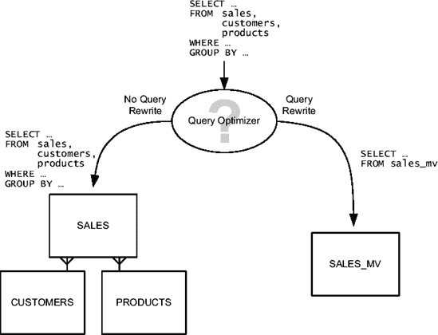
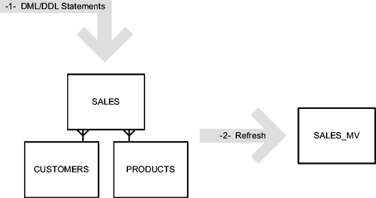
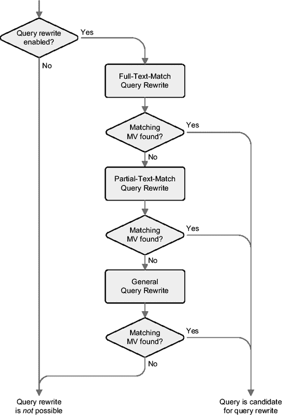

# 物化视图与查询重写

## 容器表与基本查询

当你执行前面的 SQL 语句时，数据库引擎会创建一个物化视图（它只是数据字典中的一个对象；换句话说，它只是元数据）和一个*容器表*。容器表是一个“常规”表，其名称与物化视图相同，用于存储查询返回的结果集。

你可以像查询任何其他表一样查询容器表。下面的 SQL 语句展示了一个示例。请注意，与原始查询相比，逻辑读的数量已从 3,844 降至 3。另请注意，访问路径 `MAT_VIEW ACCESS FULL` 清楚地表明正在访问物化视图。此访问路径仅在 Oracle Database 10*g* 及以上版本中存在。在早期版本中，会使用常规的 `TABLE ACCESS FULL`，但这只是一个命名约定，用于方便地指出正在使用物化视图。实际上，这两种访问路径是完全相同的。

```sql
SELECT * FROM sales_mv ORDER BY prod_category, country_id
```

```
----------------------------------------------------------------------
| Id  | Operation             | Name     | E-Rows | A-Rows | Buffers |
----------------------------------------------------------------------
|   1 |  SORT ORDER BY        |          |     81 |     81 |       3 |
|   2 |   MAT_VIEW ACCESS FULL| SALES_MV |     81 |     81 |       3 |
----------------------------------------------------------------------
```

## 查询重写机制

直接引用容器表总是一个选项。但是，如果你想在不修改 SQL 语句的情况下提高应用程序的性能，还有第二种强大的可能性：使用*查询重写*。

查询重写的概念很简单。当查询优化器收到要优化的查询时，它可以决定按原样使用它（换句话说，即*不*使用查询重写），也可以选择重写它以使用包含执行该查询所需的全部或部分数据的物化视图。当然，这一决定基于查询优化器对启用和不启用查询重写时执行计划的成本估算。成本较低的执行计划将用于执行查询。提示 `rewrite` 和 `no_rewrite` 可用于影响查询优化器的决策。



**图 11-2.** 查询优化器可以使用查询重写来自动使用物化视图。

要利用查询重写，必须在两个级别启用它。首先，你必须将动态初始化参数 `query_rewrite_enabled` 设置为 `TRUE`。其次，你必须为物化视图启用它。

```sql
ALTER MATERIALIZED VIEW sales_mv ENABLE QUERY REWRITE
```

一旦启用了查询重写，如果你提交原始查询，优化器会将物化视图视为查询重写的候选对象；在这种情况下，查询优化器实际上会重写查询以使用物化视图。请注意，访问路径 `MAT_VIEW REWRITE ACCESS FULL` 清楚地表明发生了查询重写。同样，此访问路径仅在 Oracle Database 10*g* 及以上版本中存在。在早期版本中，会使用常规的 `TABLE ACCESS FULL`，即使这只是一个用于方便地指示正在使用物化视图的命名约定；这两种访问路径是完全相同的。

```sql
SELECT p.prod_category, c.country_id,
       sum(s.quantity_sold) AS quantity_sold,
       sum(s.amount_sold) AS amount_sold
FROM sales s, customers c, products p
WHERE s.cust_id = c.cust_id
AND s.prod_id = p.prod_id
GROUP BY p.prod_category, c.country_id
ORDER BY p.prod_category, c.country_id
```

```
------------------------------------------------------------------------------
| Id  | Operation                     | Name     |  E-Rows |A-Rows | Buffers |
------------------------------------------------------------------------------
|   1 |  SORT ORDER BY                |          |      81 |    81 |       3 |
|   2 |   MAT_VIEW REWRITE ACCESS FULL| SALES_MV |      81 |    81 |       3 |
------------------------------------------------------------------------------
```

总之，通过查询重写，查询优化器能够自动使用包含执行查询所需数据的物化视图。打个比方，这类似于向表添加索引时发生的情况。你（通常）不必修改 SQL 语句就能利用它。得益于数据字典，查询优化器知道这样的索引存在，并且如果它对更高效地执行 SQL 语句有用，查询优化器就会使用它。物化视图也是如此。

## 数据刷新

当通过 DML 或 DDL 语句修改基表时，物化视图（实际上是容器表）可能包含*陈旧*的数据（“陈旧”意味着“旧的”，即如果现在在新的基表内容上执行物化视图查询，其结果集不再相等的数据）。因此，如图 11-3 所示，在修改基表后，必须对物化视图执行*刷新*。你可以选择物化视图刷新的方式和时间。



**图 11-3.** 修改基表后，必须刷新物化视图。

## 参数设置

正如你在上一节看到的，你可以在不指定参数的情况下创建物化视图。但是，你可以完全自定义其创建：

*   你可以为容器表指定物理属性，如分区、压缩、表空间和存储参数。在这方面，容器表的处理方式与任何其他表相同。因此，你可以应用第 9 章中讨论的技术来进一步优化数据访问。
*   创建物化视图时，会执行查询，并将结果集插入容器表。这是因为默认使用了参数 `build immediate`。还存在两种额外的可能性：首先，通过指定参数 `build deferred` 将行的插入延迟到第一次刷新；其次，通过指定参数 `on prebuilt table` 将已有的表重用作容器表。
*   默认情况下，查询重写是禁用的。要启用它，你必须指定参数 `enable query rewrite`。
*   为了提高快速刷新（本章稍后描述）的性能，默认情况下会在容器表上创建索引。要禁止创建此索引，可以指定参数 `using no index`。例如，这对于避免索引维护开销非常有用，如果你永远不想执行快速刷新，这种开销可能相当可观。

以下 SQL 语句展示了一个基于相同查询的示例，但指定了刚刚描述的几个参数：

```sql
CREATE MATERIALIZED VIEW sales_mv
PARTITION BY HASH (country_id) PARTITIONS 8
TABLESPACE users
BUILD IMMEDIATE
USING NO INDEX
ENABLE QUERY REWRITE
AS
SELECT p.prod_category, c.country_id,
       sum(s.quantity_sold) AS quantity_sold,
       sum(s.amount_sold) AS amount_sold
FROM sales s, customers c, products p
WHERE s.cust_id = c.cust_id
AND s.prod_id = p.prod_id
GROUP BY p.prod_category, c.country_id
```


此外，您还可以指定物化视图的刷新方式。“物化视图刷新”一节提供了关于此主题的详细信息。

## 查询重写

每当 SQL 语句中存在 `SELECT` 子句时，或者更具体地说，在以下情况下，查询优化器能够利用查询重写功能：

*   `SELECT ... FROM ...`
*   `CREATE TABLE ... AS SELECT ... FROM ...`
*   `INSERT INTO ... SELECT ... FROM ...`
*   子查询

另外，如前所述，查询重写仅在满足两个要求时才会被使用。首先，动态初始化参数 `query_rewrite_enabled` 必须设置为 `TRUE`（仅从 Oracle Database 10*g* 开始，默认值才是 `TRUE`）。其次，创建物化视图时必须使用参数 `enable query rewrite`。

一旦满足这些要求，每次查询优化器生成执行计划时，都必须确定是否可以使用包含所需数据的物化视图来重写 SQL 语句。为此，它使用以下三种方法之一：

*   `全文匹配查询重写`：将传递给查询优化器的查询文本与每个可用物化视图的查询文本进行比较。如果它们匹配，则该物化视图显然包含所需数据。请注意，此比较不像数据库引擎通常使用的比较那样严格：它不区分大小写（字面值除外），并忽略空白（例如换行符和制表符）以及 `ORDER BY` 子句。
*   `部分文本匹配查询重写`：比较方式类似于全文匹配查询重写。但不同之处在于，允许 `SELECT` 子句存在差异。例如，如果物化视图存储了三列，而待优化的查询只引用了其中两列，则该物化视图包含所有所需数据，因此可以进行查询重写。
*   `通用查询重写`：为了找到匹配的物化视图，通用查询重写会进行一种语义分析。为此，它广泛使用约束和维度来推断基础表中数据之间的语义关系。目的是即使传递给查询优化器的查询与匹配物化视图关联的查询差异很大，也能应用查询重写。事实上，设计良好的物化视图通常被用来重写许多（可能非常不同的）SQL 语句。

## 维度

查询优化器使用存储在数据字典中的约束来推断数据关系，以便尽可能充分地利用通用查询重写。有时，同一表中甚至不同表中的列之间存在其他非常有用但约束未涵盖的关系。这对于反规范化表（例如 `sh` 模式中的 `times` 表）尤其如此。为了向查询优化器提供此类信息，可以使用 `维度`。通过它，可以使用 `层次结构` 指定 1:n 关系，并使用 `属性` 指定 1:1 关系。层次结构和属性都基于 `级别`，简单来说就是表中的列。以下 SQL 语句说明了这一点：

```sql
CREATE DIMENSION times_dim
LEVEL day IS times.time_id
LEVEL month IS times.calendar_month_desc
LEVEL quarter IS times.calendar_quarter_desc
LEVEL year IS times.calendar_year
HIERARCHY cal_rollup (day CHILD OF month CHILD OF quarter CHILD OF year)
ATTRIBUTE day DETERMINES (day_name, day_number_in_month)
ATTRIBUTE month DETERMINES (calendar_month_number, calendar_month_name)
ATTRIBUTE quarter DETERMINES (calendar_quarter_number)
ATTRIBUTE year DETERMINES (days_in_cal_year)
```

有关维度的详细信息，请参阅《数据仓库指南》手册。

全文匹配和部分文本匹配查询重写可以非常快速地应用。但由于它们的决策基于简单的文本匹配，因此灵活性不高。因此，它们只能重写有限数量的查询。相比之下，通用查询重写功能强大得多。缺点是应用它的开销要高得多。因此，查询优化器按复杂度（从而也是解析开销）递增的顺序应用这些方法，直到找到匹配的物化视图。此过程如图 11-4 所示。



**图 11-4.** *查询重写过程*

以下示例基于脚本 `mv_rewrite.sql`，展示了通用查询重写的应用。请注意，该查询与前面章节中用于定义物化视图 `sales_mv` 的查询相似。存在三个不同之处。首先，`SELECT` 子句不同。无论如何，物化视图包含所有必要的数据。其次，指定了一个 `ORDER BY` 子句。第三，没有引用表 `customers`。然而，由于表 `sales` 上存在一个已验证的、引用表 `customers` 的外键约束，查询优化器可以确定省略该连接不会导致数据丢失。因此，它可以使用物化视图 `sales_mv`。

```sql
SQL> SELECT upper(p.prod_category) AS prod_category,
  2         sum(s.amount_sold) AS amount_sold
  3  FROM sales s, products p
  4  WHERE s.prod_id = p.prod_id
  5  GROUP BY p.prod_category
  6  ORDER BY p.prod_category;

--------------------------------------------------
| Id  | Operation                       |Name    |
--------------------------------------------------
|   1 |  SORT GROUP BY                  |        |
|   2 |   MAT_VIEW REWRITE ACCESS FULL  |SALES_MV|
--------------------------------------------------
```

重要的是要注意，默认情况下，查询优化器不会使用未经验证的约束。因此，如果存在此类未经验证的约束，查询优化器将无法使用通用查询重写。由于对于这个特定查询，无法使用全文匹配查询重写和部分文本匹配查询重写，因此不会发生查询重写。以下示例说明了这一点。请注意，这与前一个示例中使用的查询相同。只有约束 `sales_customer_fk` 的状态发生了变化。

```sql
SQL> ALTER TABLE sales MODIFY CONSTRAINT sales_customer_fk NOVALIDATE;

SQL> SELECT upper(p.prod_category) AS prod_category,
  2         sum(s.amount_sold) AS amount_sold
  3  FROM sales s, products p
  4  WHERE s.prod_id = p.prod_id
  5  GROUP BY p.prod_category
  6  ORDER BY p.prod_category;

--------------------------------------------
| Id  | Operation               | Name     |
--------------------------------------------
|   1 |  SORT GROUP BY          |          |
|   2 |   HASH JOIN             |          |
|   3 |    VIEW                 | VW_GBC_5 |
|   4 |     HASH GROUP BY       |          |
|   5 |      PARTITION RANGE ALL|          |
|   6 |       TABLE ACCESS FULL | SALES    |
|   7 |    TABLE ACCESS FULL    | PRODUCTS |
--------------------------------------------
```

特别是在数据集市中，使用一些虽然数据库引擎未验证、但由于我们（谨慎地）维护表的方式而知道数据满足这些条件的约束并不少见。同时，物化视图虽然被数据库引擎认为是过时的，但已知对于重写查询是安全的，这种情况也不少见。


