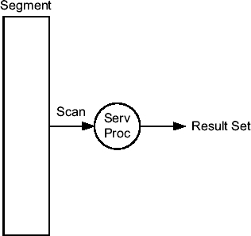
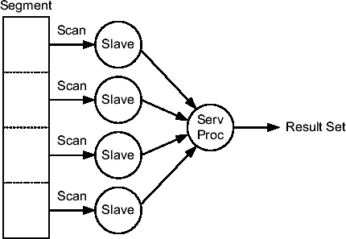

# Oracle 结果缓存详解

| 名称                         | 字节总和   |
|------------------------------|------------|
| 结果缓存                     | 196888     |
| 结果缓存：布隆过滤器         | 2048       |
| 结果缓存：缓存管理器         | 152        |
| 结果缓存：内存管理器         | 200        |
| 结果缓存：状态对象           | 2896       |
|                              | 202184     |

## 服务器结果缓存

### 初始化参数

*   `result_cache_mode` 指定了在何种情况下使用结果缓存。可以将其设置为 `manual`（默认值）或 `force`。在 `manual` 模式下，仅当使用了 `result_cache` 提示时才使用结果缓存。在 `force` 模式下，所有未包含 `no_result_cache` 提示的查询都会使用结果缓存。由于大多数情况下你只希望对有限数量的查询使用结果缓存，建议保持此初始化参数的默认值，仅在必要时添加 `result_cache` 提示。
*   `result_cache_max_result` 指定了任何单个结果可以使用的 `result_cache_max_size` 的百分比。默认值为 5。允许值范围为 0 到 100。超过此限制的结果将失效。
*   `result_cache_remote_expiration` 指定了基于远程对象的结果的时间有效性（以分钟为单位）。这是必要的，因为当远程对象发生更改时，不会立即使其相关结果失效。相反，结果会在超过此初始化参数定义的时间有效性后失效。默认值为 0，表示禁用基于远程对象的查询缓存。

初始化参数 `result_cache_max_size` 和 `result_cache_max_result` 只能在系统级别更改。另外两个，`result_cache_mode` 和 `result_cache_remote_expiration`，也可以在会话级别更改。

***

**注意：** 将初始化参数 `result_cache_remote_expiration` 设置为大于 0 的值可能导致结果过时。因此，只有在你完全理解并接受其影响的情况下，才应使用大于 0 的值。

***

### 使用限制

结果缓存的使用有以下几个明显的限制：

*   引用非确定性函数、序列和临时表的查询不会被缓存。
*   违反读一致性的查询不会被缓存。例如，由一个对引用表持有未提交事务的会话创建的结果集无法被缓存。
*   引用数据字典视图的查询不会被缓存。

***

### DBMS_RESULT_CACHE 包

你可以使用 `dbms_result_cache` 包来管理结果缓存。它提供了以下子程序：

*   `bypass` 临时禁用（或启用）会话或系统级别的结果缓存。
*   `flush` 从结果缓存中移除所有对象。
*   `invalidate` 使所有依赖于给定数据库对象的结果集失效。
*   `invalidate_object` 使单个缓存条目失效。
*   `memory_report` 生成关于内存使用情况的报告。
*   `status` 显示结果缓存的状态。

## PL/SQL 函数结果缓存

PL/SQL 函数结果缓存与服务器结果缓存类似，但它支持 PL/SQL 函数。它也与服务器结果缓存共享相同的内存结构。其目的是将函数（仅限于函数——结果缓存不能用于过程）的返回值存储在结果缓存中。显然，具有不同输入值的函数会被缓存到不同的缓存条目中。以下示例（摘自 `result_cache_plsql.sql` 脚本的输出）显示了一个启用了结果缓存的函数。为启用它，指定了 `RESULT_CACHE` 子句。可选地，`RELIES_ON` 子句还可以指定函数的返回值依赖于哪些表。此信息对于缓存条目的失效至关重要。

```
SQL> CREATE OR REPLACE FUNCTION f(p IN NUMBER)
  2    RETURN NUMBER
  3    RESULT_CACHE RELIES_ON (t)
  4  IS
  5    l_ret NUMBER;
  6  BEGIN
  7    SELECT count(*) INTO l_ret
  8    FROM t
  9    WHERE id = p;
 10    RETURN l_ret;
 11  END;
 12  /
```

在以下示例中，在禁用结果缓存的情况下调用了该函数 10,000 次（使用 `bypass` 过程临时禁用缓存）。执行耗时 4.76 秒。

```
SQL> execute dbms_result_cache.bypass(bypass_mode => TRUE, session => TRUE)

SQL> SELECT count(f(1)) FROM t;

COUNT(F(1))
-----------
      10000

Elapsed: 00:00:04.76
```

现在，再次调用该函数 10,000 次，但这次启用了结果缓存。执行仅耗时 0.04 秒。

```
SQL> execute dbms_result_cache.bypass(bypass_mode => FALSE, session => TRUE)

SQL> SELECT count(f(1)) FROM t;

COUNT(F(1))
-----------
      10000

Elapsed: 00:00:00.04
```

***

**注意：** 如果未指定 `RELIES_ON` 子句，或指定了错误信息，那么由于函数所依赖的对象发生修改而进行的失效操作将不会发生。因此，可能导致结果过时。

***

### PL/SQL 函数结果缓存使用限制

结果缓存不能用于以下函数：

*   具有 `OUT` 和/或 `IN OUT` 参数的函数
*   以调用者权限定义的函数
*   管道表函数
*   从匿名块调用的函数
*   具有 `IN` 参数或返回值类型为以下类型的函数：LOBs、`REF CURSOR`、对象和记录

此外，请注意未处理的异常不会存储在结果缓存中。换句话说，如果函数引发异常并且该异常传播给调用者，则下次调用同一函数时将再次执行。

## 客户端结果缓存

客户端结果缓存是一个客户端缓存，用于存储查询的结果集。其目的和工作方式与服务器结果缓存类似。与服务器端实现相比，有两个重要区别。首先，它避免了执行 SQL 语句所需的客户端/服务器往返。这是一个巨大的优势。其次，失效基于轮询机制，因此无法保证一致性。这是一个巨大的劣势。

为了实现轮询，客户端必须定期执行数据库调用来检查数据库引擎，以查看其缓存的结果集是否需要失效。为了最小化与轮询相关的开销，每次客户端因其他原因执行数据库调用时，它也会检查缓存结果集的有效性。这样，对于持续执行“常规”数据库调用的客户端，可以避免专门用于失效缓存结果集的数据库调用。

即使这是一个客户端缓存，你也必须在服务器端启用它。以下是控制客户端结果缓存的初始化参数：

*   `client_result_cache_size` 指定了每个客户端进程可用于结果缓存的最大内存量（以字节为单位）。如果设置为 0（默认值），则该功能被禁用。此初始化参数是静态的，只能在实例级别设置。因此需要重启实例才能更改它。
*   `client_result_cache_lag` 指定了两次数据库调用之间的最大时间滞后（以毫秒为单位）。换句话说，它指定了过时的结果集可以在客户端缓存中保留多长时间。默认值为 3,000。此初始化参数是静态的，只能在实例级别设置。因此需要重启实例才能更改它。

除了服务器端配置外，还可以在客户端的 `sqlnet.ora` 文件中指定以下参数：


*   `oci_result_cache_max_size` 会覆盖通过初始化参数 `client_result_cache_size` 指定的服务器端设置。但请注意，如果客户端结果缓存在服务器端被禁用，此参数无法启用它。
*   `oci_result_cache_max_rset_size` 指定（以字节为单位）任何单个结果集可使用的最大内存量。
*   `oci_result_cache_max_rset_rows` 指定任何单个结果集可存储的最大行数。

###### 何时使用它

如果你遇到的性能问题是由于应用程序反复执行相同操作导致的，那么你需要减少操作的执行频率或响应时间。理想情况下，你应该两者都做。然而，有时（例如，当应用程序的代码无法修改时）你只能实现后者。为了减少响应时间，你应该首先采用第 9 章和第 10 章介绍的技术。如果这还不够，才应考虑高级优化技术，例如结果缓存。基本上，结果缓存在两个条件下是有效的。第一，相同数据的查询频率高于其修改频率。第二，有足够的内存来存储结果。

在大多数情况下，你不应该为所有查询启用结果缓存。事实上，大多数时候，只有特定的查询才能从结果缓存中受益。对于其他查询，结果缓存管理纯粹是开销，还可能使缓存负担过重。此外，请记住服务器端缓存由所有会话共享，因此它们的访问是同步的（它们可能像任何共享资源一样成为串行化点）。因此，你只应为需要它的查询启用结果缓存。换句话说，提示 `result_cache` 应选择性地添加，并且只有在真正需要提高性能时才使用。

服务器结果缓存并不能完全避免执行查询的开销。这意味着，如果一个查询在不使用结果缓存的情况下每行执行的逻辑读已经相对较少（且没有物理读），那么使用它时速度不会快很多。请记住，缓冲区缓存和结果缓存都存储在相同的共享内存中。

PL/SQL 函数结果缓存对于在 SQL 语句中频繁使用的函数特别有用。事实上，此类函数为处理或返回的每一行都被调用，而只有少数行的输入参数不同的情况并不少见。但是，从 PL/SQL 中频繁调用的函数也可以利用结果缓存。

由于一致性问题，客户端结果缓存应仅用于只读或主要是读取的表。

最后，请注意，你可以同时利用服务器和客户端结果缓存。但是，对于由客户端执行的查询，你不能选择绕过客户端结果缓存而仅使用服务器结果缓存。换句话说，两个结果缓存都会被使用。

###### 陷阱与误区

正如前几节所指出的，在以下情况下不保证结果的一致性：

*   当初始化参数 `result_cache_remote_expiration` 设置为大于 0 的值，并且通过数据库链接执行查询时
*   当定义未指定（或错误指定）`RELIES_ON` 子句的 PL/SQL 函数时
*   当使用客户端结果缓存时

在这种情况下，除非你完全理解并接受每种情况的含义，否则最好避免使用结果缓存。

##### 并行处理

当你向数据库引擎提交 SQL 语句时，默认情况下它由单个服务器进程串行执行。因此，即使运行数据库引擎的服务器有多个 CPU，你的 SQL 语句也只在单个 CPU 上运行。并行处理的目的是将单个 SQL 语句的执行分配到多个 CPU 上。

* * *

**注意** 并行处理仅在企业版中可用。

* * *

###### 工作原理

在描述查询、DML 语句和 DDL 语句如何并行执行的具体细节之前，理解并行处理的基础知识、了解如何配置实例以利用并行处理以及如何控制并行度非常重要。

* * *

**注意** 因为从 Oracle Database 10*g* 开始，与并行处理相关的执行计划更具描述性，所以在以下章节中，我只展示在该版本上生成的执行计划。如果你想将它们与 Oracle9*i* 的执行计划进行比较，可以运行可下载的脚本。

* * *

**基础知识**

没有并行处理时，SQL 语句由单个服务器进程串行执行，而该进程又在单个 CPU 上运行。这意味着执行 SQL 语句所使用的资源量受限于单个 CPU 能处理的量。例如，如图 11-5 所示，如果一个 SQL 语句执行扫描整个段的数据访问操作（如果大部分数据是从磁盘读取，这可能是 I/O 密集型操作），而不管 I/O 子系统可以提供的总吞吐量如何，响应时间都会受到单个 CPU 可用带宽的限制。当然，这种带宽可能因为 CPU 与磁盘之间数据访问路径的硬件限制而受限，但也因为执行是串行的：当服务器进程在 CPU 上时，根据定义它没有在访问磁盘（异步 I/O 是例外），因此无法利用 I/O 子系统可以提供的总吞吐量。



**图 11-5.** *串行执行的 SQL 语句由单个服务器进程处理。*

以下 SQL 语句及其相关执行计划展示了图 11-5 所示处理的示例：

```
SELECT * FROM t

----------------------------------
| Id  | Operation         | Name |
----------------------------------
|   0 | SELECT STATEMENT  |      |
|   1 |  TABLE ACCESS FULL| T    |
----------------------------------
```

并行处理的目的是将一个大任务拆分成若干个较小的子任务。如果有一个并行处理的 SQL 语句，这基本上意味着有多个*从属进程*协作执行一个 SQL 语句。从属进程的协调由提交 SQL 语句的会话关联的服务器进程控制。由于这个角色，它通常被称为*查询协调器*。查询协调器负责获取从属进程，为每个从属进程分配一个子任务，收集并组合它们交付的部分结果集，并将最终结果集返回给客户端。例如，在需要扫描整个段的 SQL 语句的情况下，查询协调器可以指示每个从属进程扫描段的一部分并将必要数据交付给它。图 11-6 说明了这一点。由于四个从属进程中的每一个都能在不同的 CPU 上运行，在这种情况下，响应时间不再受限于单个 CPU 可用的带宽。



**图 11-6.** *并行执行的 SQL 语句由一组从属进程处理，这些从属进程由一个服务器进程（即查询协调器）协调。*


