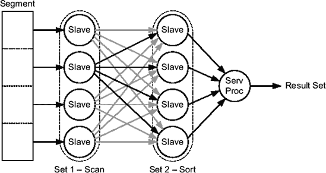

# 并行执行中的粒度与操作

在如图 11-6 所示的并行扫描中，工作以称为*粒度*的工作单元分配给从属进程。每个从属进程在特定时间处理单个粒度。如果粒度数量多于从属进程，那么当一个从属进程完成一个粒度的工作后，它将接收另一个粒度，直到所有粒度都被处理完毕。数据库引擎可以使用两种类型的粒度：

*   **分区粒度**：是整个分区或子分区。显然，这种粒度只能用于分区段。
*   **块范围粒度**：是在运行时（而非解析时）动态定义的段的块范围。

由于分区粒度的定义是静态的（只有数量可能因分区修剪而变化），块范围粒度在大多数情况下更常用。它们的主要优势在于，在大多数情况下，它们允许将工作均匀地分配给从属进程。实际上，使用分区粒度时，工作分配不仅高度依赖于从属进程数量与分区数量的比率，还依赖于每个分区中存储的数据量。如果工作分配不均，一些从属进程可能比其他进程工作得多得多，因此可能导致更长的响应时间。结果，并行执行的整体效率可能会受到影响。

以下执行计划展示了图 11-6 中说明的处理示例。操作 4 (`TABLE ACCESS FULL`) 扫描表 `t` 的一部分。它扫描哪一部分取决于其父操作 3 (`PX BLOCK ITERATOR`)。这是与块范围粒度相关的操作。然后，操作 2 (`PX SEND QC`) 将检索到的数据发送给查询协调器。请注意，在执行计划中，您可以通过查看列 `TQ` 来识别由一组从属进程执行的操作。在此执行计划中，操作 2 到 4 具有相同的值 (`Q1,00`)，因此由同一组从属进程执行（注意，根据执行计划，您无法知道该组中有多少从属进程）。还要注意操作 2 中从属进程与查询协调器 (`QC`) 之间的并行到串行 (`P->S`) 通信。这是必要的，因为如图 11-6 所示，四个从属进程向查询协调器发送数据。

```sql
SELECT * FROM t

----------------------------------------------------------------------
| Id  | Operation            | Name     |    TQ  |IN-OUT| PQ Distrib |
----------------------------------------------------------------------
|   0 | SELECT STATEMENT     |          |        |      |            |
|   1 |  PX COORDINATOR      |          |        |      |            |
|   2 |   PX SEND QC (RANDOM)| :TQ10000 |  Q1,00 | P->S | QC (RAND)  |
|   3 |    PX BLOCK ITERATOR |          |  Q1,00 | PCWC |            |
|   4 |     TABLE ACCESS FULL| T        |  Q1,00 | PCWP |            |
----------------------------------------------------------------------
```

数据访问操作并不是唯一可以并行执行的操作。实际上，除此之外，数据库引擎还能够并行化插入、连接、聚合和排序。当一条 SQL 语句执行两个或多个独立操作（例如，扫描和排序）时，数据库引擎通常使用两组从属进程。例如，如图 11-7 所示，如果一条 SQL 语句执行扫描然后排序，则一组用于扫描，另一组用于排序。



**图 11-7.** *可以使用多组从属进程来执行一条 SQL 语句。*

单个操作的并行化称为*操作内并行性*。例如，在图 11-7 中，操作内并行性（使用四个从属进程）被使用了两次：一次用于扫描，一次用于排序。当使用多组从属进程执行一条 SQL 语句时，这种并行化称为*操作间并行性*。例如，在图 11-7 中，操作间并行性用于集合 1（扫描）和集合 2（排序）之间。

当使用操作间并行性时，会发生从属进程组之间的通信。在图 11-7 中，集合 1 从段中读取数据并将其发送给集合 2 进行排序。发送数据的从属进程称为*生产者*。接收数据的从属进程称为*消费者*。根据生产者和消费者执行的操作，行使用以下方法之一进行分布：

*   **广播**：每个生产者将所有行发送给每个消费者。
*   **循环**：生产者像发牌一样，逐个将每行发送给单个消费者。结果，行被均匀地分布在消费者之间。
*   **范围**：生产者将特定的行范围发送给不同的消费者。执行动态范围分区以确定哪一行必须发送给哪个消费者。例如，对于排序，此方法基于 `ORDER BY` 子句中使用的列对行进行范围分区。
*   **哈希**：生产者根据哈希函数的计算结果将行发送给消费者。执行动态哈希分区以确定哪一行要发送给哪个消费者。例如，对于聚合，此方法可以基于 `GROUP BY` 子句中使用的列对行进行哈希分区。
*   **QC 随机**：每个生产者将所有行发送给查询协调器。顺序不重要（因此是随机的）。这是与查询协调器通信最常用的分布方式。
*   **QC 顺序**：每个生产者将所有行发送给查询协调器。顺序很重要。例如，并行执行的排序使用此方法将数据发送给查询协调器。

**并行操作之间的关系**

在并行执行的执行计划中，使用以下并行操作之间的关系：

*   **并行到串行 (`P->S`)**：一个并行操作将数据发送给串行操作。例如，在每个执行计划中，这用于将数据发送给查询协调器。
*   **并行到并行 (`P->P`)**：一个并行操作将数据发送给另一个并行操作。当存在两组从属进程时使用此关系。
*   **与父操作并行组合 (`PCWP`)**：一个操作由与执行计划中父操作相同的从属进程并行执行。因此，不发生通信。
*   **与子操作并行组合 (`PCWC`)**：一个操作由与执行计划中子操作相同的从属进程并行执行。因此，不发生通信。
*   **串行到并行 (`S->P`)**：一个串行操作将数据发送给并行操作。由于大多数情况下这是低效的，应避免使用。主要有两个原因。首先，单个进程可能无法像多个进程消费数据那样快地产生数据。如果是这种情况，消费者会花费大量时间等待数据，而不是做实际工作。其次，需要不必要的通信来将数据从串行执行的操作发送到并行执行的操作。

在由包 `dbms_xplan` 生成的输出中，并行操作之间的关系在列 `IN-OUT` 中提供。


