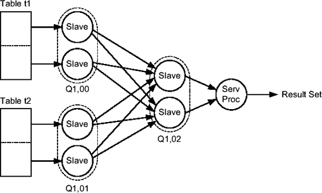

# 并行查询执行与配置

以下执行计划是图 11-7 中所示处理过程的一个示例。操作 5 到 7 在列`TQ (Q1,00)`上具有相同的值，这意味着它们由一组从属进程执行（图 11-7 中的第 1 组）。另一方面，操作 2 到 4 具有另一个值`(Q1,01)`，因此由另一组从属进程执行（图 11-7 中的第 2 组）。第 1 组（生产者）基于块范围粒度扫描表`t`，并将检索到的数据发送给第 2 组。反过来，第 2 组（消费者）接收数据，对其进行排序，并将排序后的结果集发送给查询协调器。第 1 组和第 2 组并发地进行处理。由于它们相互通信，处理数据较快的一组会等待另一组。例如，在下面的执行计划中，第 2 组很可能比第 1 组生产数据的速度更快地消费数据。如果是这种情况，第 2 组会花费大量时间等待第 1 组。

```sql
SELECT * FROM t ORDER BY id
--------------------------------------------------------------------
|Id |Operation                | Name     |    TQ |IN-OUT|PQ Distrib|
--------------------------------------------------------------------
|  0|SELECT STATEMENT         |          |       |      |          |
|  1| PX COORDINATOR          |          |       |      |          |
|  2|  PX SEND QC (ORDER)     | :TQ10001 | Q1,01 | P->S |QC (ORDER)|
|  3|   SORT ORDER BY         |          | Q1,01 | PCWP |          |
|  4|    PX RECEIVE           |          | Q1,01 | PCWP |          |
|  5|     PX SEND RANGE       | :TQ10000 | Q1,00 | P->P |RANGE     |
|  6|      PX BLOCK ITERATOR  |          | Q1,00 | PCWC |          |
|  7|       TABLE ACCESS FULL | T        | Q1,00 | PCWP |          |
--------------------------------------------------------------------
```

生产者通过一个名为`table queue`的 SGA 中的内存结构向消费者发送数据。对于每一对生产者-消费者，都有一个`table queue`。例如，在图 11-7 中，两组从属进程之间的通信总共使用了 16 个`table queues`。此外，还有 4 个`table queues`用于第 2 组与服务器进程之间的通信。生产者通过`PX SEND`操作写入`table queues`。消费者通过`PX RECEIVE`操作从中读取——查询协调器是个例外，因为它们使用`PX COORDINATOR`操作。

###### 配置

每个实例的从属进程数量是有限制的。因此，实例维护一个从属进程池。查询协调器从池中请求从属进程；然后使用它们执行一条 SQL 语句，最后，当执行完成时，将它们返回到池中。以下初始化参数用于配置此池：

*   `parallel_min_servers` 指定在实例启动时启动的从属进程数。这些从属进程始终可用，无需在服务器进程需要时再启动。超过此最小数量的从属进程在需要时动态启动，并且一旦返回池中，会空闲五分钟。如果在此期间未被重用，它们将被关闭。默认情况下，此初始化参数设置为 0。这意味着在启动时不创建任何从属进程。我建议仅当某些 SQL 语句等待从属进程启动时间过长时才更改此值。与此操作相关的等待事件是`os thread startup`。
*   `parallel_max_servers` 指定池中可用从属进程的最大数量。很难给出如何设置此参数的建议。然而，将核心数（即初始化参数`cpu_count`的值）的 8-10 倍作为一个起始点是不错的。默认值取决于其他几个初始化参数、版本和平台。

要显示池的状态，可以使用以下查询：

```sql
SQL> SELECT *
  2 FROM v$px_process_sysstat
  3 WHERE statistic LIKE 'Servers%';

STATISTIC          VALUE
------------------ -----
Servers In Use         4
Servers Available      8
Servers Started       46
Servers Shutdown      34
Servers Highwater     12
Servers Cleaned Up     0
```

用于进程间通信的`table queues`是可以从共享池或大池分配的内存结构。然而，*不*建议将共享池用于它们。大池专为非可重用内存结构设计，是一个更好的选择。有两种情况会导致为`table queues`使用大池：

*   通过初始化参数`sga_target`或（自 Oracle 数据库 11*g*起）`memory_target`启用了自动 SGA 管理。
*   初始化参数`parallel_automatic_tuning`设置为`TRUE`。请注意，此初始化参数自 Oracle 数据库 10*g*起已弃用。但是，如果你*不*想使用自动 SGA 管理，自 Oracle 数据库 10*g*起，设置它是使用大池进行并行处理的唯一方法。

***

**注意** 尽管其名称如此，初始化参数`parallel_automatic_tuning`仅做两件简单的事情。首先，它更改了几个与并行处理相关的初始化参数的默认值。其次，它指示数据库引擎为`table queues`使用大池。

***

每个`table queue`最多由三个（使用 RAC 时为四个）缓冲区组成。每个缓冲区的大小（以字节为单位）通过初始化参数`parallel_execution_message_size`设置。默认大小为 2,152 字节，或者如果`parallel_automatic_tuning`设置为`TRUE`，则为 4,096 字节。这通常太小。为了获得最佳性能，你应将其设置为支持的最高值。根据你使用的平台，这可能是 16KB、32KB 或 64KB。

在增加它时，你应确保有足够的内存可用。你可以使用公式 11-1 计算非 RAC 实例应可用的最小大池大小。

`large_pool_size ≥ parallel_max_servers`² · `parallel_execution_message_size` · 3

**公式 11-1** *非 RAC 实例用于表队列的大池用量（对于 RAC 实例，乘以 4 而不是乘以 3）*

要显示实例当前使用了多少大池，可以运行以下查询：

```sql
SQL> SELECT *
  2 FROM v$sgastat
  3 WHERE name = 'PX msg pool';

POOL       NAME          BYTES
---------- ----------- -------
large pool PX msg pool 1032960
```

## 并行度


用于**操作内并行**的从属进程数量被称为`并行度`(`DOP`)。每个表和索引都关联一个并行度。默认情况下，引用该对象的操作会使用其并行度。默认值为 1，表示不使用并行处理。如下列 SQL 语句所示，可以在创建对象时或之后使用`PARALLEL`子句设置并行度：

```sql
CREATE TABLE t (id NUMBER, pad VARCHAR2(1000)) PARALLEL 4
```

```sql
ALTER TABLE t PARALLEL 2
```

```sql
CREATE INDEX i ON t (id) PARALLEL 4
```

```sql
ALTER INDEX i PARALLEL 2
```

***

**注意** 使用并行处理来提升维护任务或创建表/索引的批处理作业的性能是相当常见的做法。为此，可以使用`PARALLEL`子句。但是请注意，使用此子句后，不仅在表或索引创建期间，后续对该对象执行的操作也会使用该并行度。因此，如果你只想在表或索引创建期间使用并行处理，务必在创建完成后修改其并行度。

***

要禁用并行处理，可以将并行度设置为 1 或指定`NOPARALLEL`子句：

```sql
ALTER TABLE t PARALLEL 1
```

```sql
ALTER INDEX i NOPARALLEL
```

***

**说明** 当使用`PARALLEL`子句而未指定并行度时（例如，`ALTER TABLE t PARALLEL`），将使用系统默认值。为了计算此默认值，数据库引擎将可用 CPU 数量（初始化参数`cpu_count`的值）乘以一个`CPU`预期处理的从属进程数（初始化参数`parallel_threads_per_cpu`——在大多数平台上，该参数的默认值为 2）。大多数情况下，默认并行度过高。因此，我通常建议指定一个明确的值。

***

要覆盖在表和索引级别定义的并行度，可以使用提示`parallel`、`no_parallel`（Oracle9*i*中为`noparallel`）、`parallel_index`和`no_parallel_index`（Oracle9*i*中为`noparallel_index`）。前两个覆盖表级别的设置，后两个覆盖索引级别的设置。它们的使用示例将在下一节中提供。当在 SQL 语句中为使用的不同表或索引指定了不同的并行度时，数据库引擎会计算出一个单一的并行度，并用于整个 SQL 语句。规则在手册中有详细说明，但通常，选择的并行度就是表或索引级别指定的并行度中的最大值。

由于并行度定义了**操作内并行**的从属进程数量，因此当使用**操作间并行**时，执行 SQL 语句所使用的从属进程数量将是并行度的两倍。这是因为在任何给定时间最多有两组从属进程处于活动状态，并且每组的并行度必须相等。

如前一节所述，池中最大从属进程数受初始化参数`parallel_max_servers`限制。因此，必须理解，在表和索引级别指定的并行度仅定义了查询协调器向池请求多少从属进程，而非实际分配给它的数量。实际上，数据库引擎可能无法满足请求，这取决于查询协调器请求从属进程时已有多少从属进程在运行。例如，如果最大从属进程数设置为 40，对于图 11-7 所示的执行计划（需要 8 个从属进程），只能有 5 个并发 SQL 语句（40/8）以所需的并行度执行。达到限制后，有两种可能：要么并行度被降级（即减少），要么向服务器进程返回错误（`ORA-12827: insufficient parallel query slaves available`）。要配置使用哪种可能性，必须设置初始化参数`parallel_min_percent`。它可以设置为 0 到 100 之间的整数值。主要有三种情况：

*   `0`：此值（默认值）指定并行度可以被静默降级。换句话说，数据库引擎可以提供尽可能多的从属进程。如果可用从属进程少于两个，执行将被串行化。这意味着 SQL 语句总是会被执行，并且永远不会引发`ORA-12827`错误。
*   `1–99`：1 到 99 之间的值定义了降级的下限。必须至少提供指定百分比的从属进程；否则，将引发`ORA-12827`错误。例如，如果设置为 25，并且请求了 16 个从属进程，则必须至少提供 4 个（16*25/100）以避免错误。
*   `100`：使用此值，要么提供所有请求的从属进程，要么引发`ORA-12827`错误。

以下示例（基于脚本`px_dop1.sql`）在没有其他并行执行运行时执行，说明了这一点：

```sql
SQL> show parameter parallel_max_servers

NAME                  TYPE    VALUE
--------------------- -------- ------
parallel_max_servers  integer  40

SQL> ALTER TABLE t PARALLEL 50;

SQL> ALTER SESSION SET parallel_min_percent = 80;

SQL> SELECT count(pad) FROM t;

  COUNT(*)
----------
    100000

SQL> ALTER SESSION SET parallel_min_percent = 81;

SQL> SELECT count(pad) FROM t;
SELECT count(pad) FROM t
*
ERROR at line 1:
ORA-12827: insufficient parallel query slaves available
```

另一个影响分配给服务器进程的从属进程数量的初始化参数是`parallel_adaptive_multi_user`。它接受两个值：

*   `FALSE:` 如果池未耗尽，则将请求的从属进程数分配给服务器进程。这是 Oracle9*i*中的默认值。
*   `TRUE:` 随着已分配的从属进程数量增加，即使池中仍有足够的服务器来满足所需的并行度，请求的并行度也会自动降低。这是 Oracle Database 10*g*及之后版本的默认值。

为了说明初始化参数`parallel_adaptive_multi_user`的影响，让我们看看在短时间间隔内执行越来越多的并行操作时分配的从属进程数量。为此，使用了以下 shell 脚本。其目的是以 5 秒为间隔启动 15 个并行操作，每个操作的并行度为 8（这是表级别的默认值）。

```bash
sql="select * from t;"
for i in 1 2 3 4 5 6 7 8 9 10 11 12 13 14 15
do
  sqlplus -s $user/$password <<<$sql &
  sleep 5
done
```


## 并行查询

以下操作，无论是在查询还是子查询中，都可以并行执行：

*   全表扫描、全分区扫描和快速全索引扫描
*   索引全扫描和范围扫描，但仅限于索引已分区的情况（在给定时间，一个分区只能由一个从属进程访问；作为副作用，并行度受所访问分区数量的限制）
*   连接（第 10 章提供了一些示例）
*   集合运算符
*   排序
*   聚合

* * *

**注意** 并行执行的全表扫描、全分区扫描和快速全索引扫描使用直接读，因此会绕过缓冲区缓存。但是，索引全扫描和范围扫描会进行常规的物理读。

* * *

并行查询默认是*启用*的。在会话级别，你可以使用以下 SQL 语句来启用和禁用它们：

```sql
ALTER SESSION ENABLE PARALLEL QUERY
ALTER SESSION DISABLE PARALLEL QUERY
```

此外，也可以使用以下 SQL 语句启用并行查询，同时覆盖在表或索引级别定义的并行度：

```sql
ALTER SESSION FORCE PARALLEL QUERY PARALLEL 4
```

然而，请注意，提示（hint）的优先级高于会话级别的设置。一方面，即使在会话级别禁用了并行查询，提示也可以强制并行执行。真正关闭并行查询的唯一方法是将初始化参数 `parallel_max_servers` 设置为 `0`。另一方面，即使在会话级别强制指定了并行度，提示也可能导致使用另一个并行度。要检查并行查询在会话级别是启用还是禁用，你可以执行如下查询（`pq_status` 列的值为 `ENABLED`、`DISABLED` 或 `FORCED`）：

```sql
SELECT pq_status
FROM v$session
WHERE sid = sys_context('userenv','sid')
```

以下执行计划展示了一个包含并行索引范围扫描、并行全表扫描和并行哈希连接的示例。它基于脚本 `px_query.sql`。请注意其中的提示：提示 `parallel_index` 用于索引访问，提示 `parallel` 用于表扫描。这两个提示都指定了并行度为 2。此外，提示 `pq_distribute` 用于指定分布方法。`TQ` 列包含三个值，这意味着使用了三组从属进程来执行此执行计划。操作 8 并行扫描索引 `i1`（因为索引 `i1` 是分区的）。然后，操作 7 使用从索引 `i1` 提取的 rowid 访问表 `t1`。如操作 6 所示，这两个操作使用了分区粒度。接着，数据通过哈希分布发送给消费者（集合 `Q1,02` 的从属进程）。当消费者收到数据（操作 4）时，它们将其传递给操作 3 以构建哈希连接的哈希表。一旦表 `t1` 的所有数据处理完毕，就可以开始表 `t2` 的并行全扫描。这在操作 12 中执行。如操作 11 所示，此操作使用了块范围粒度。然后，数据通过哈希分布发送给消费者（集合 `Q1,02` 的从属进程）。当消费者收到数据（操作 9）时，它们将其传递给操作 3 以探测哈希表。最后，操作 2（`PX SEND QC`）将满足连接条件的行发送给查询协调器。图 11-9 说明了此执行计划。

```sql
SELECT /*+ leading(t1) use_hash(t2)
           index(t1) parallel_index(t1 2)
           full(t2) parallel(t2 2)
           pq_distribute(t2 hash,hash) */ *
FROM t1, t2
WHERE t1.id > 9000
AND t1.id = t2.id+1
--------------------------------------------------------------------------
| Id | Operation                   | Name   |  TQ | IN-OUT | PQ Distrib |
--------------------------------------------------------------------------
|   0| SELECT STATEMENT            |        |     |        |            |
|   1|   PX COORDINATOR            |        |     |        |            |
|   2|    PX SEND QC (RANDOM)      | :TQ10002|Q1,02| P->S   | QC (RAND)  |
|*  3|     HASH JOIN BUFFERED      |        |Q1,02| PCWP   |            |
|   4|      PX RECEIVE             |        |Q1,02| PCWP   |            |
|   5|       PX SEND HASH          | :TQ10000|Q1,00| P->P   | HASH       |
|   6|        PX PARTITION HASH ALL|        |Q1,00| PCWC   |            |
|   7|         TABLE ACCESS BY INDEX ROWID|T1 |Q1,00| PCWP   |            |
|*  8|          INDEX RANGE SCAN   | I1     |Q1,00| PCWP   |            |
|   9|      PX RECEIVE             |        |Q1,02| PCWP   |            |
|  10|       PX SEND HASH          | :TQ10001|Q1,01| P->P   | HASH       |
|  11|        PX BLOCK ITERATOR    |        |Q1,01| PCWC   |            |
|* 12|         TABLE ACCESS FULL   | T2     |Q1,01| PCWP   |            |
--------------------------------------------------------------------------

   3 - access("T1"."ID"="T2"."ID"+1)
   8 - access("T1"."ID">9000)
  12 - filter("T2"."ID"+1>9000)
```

根据执行计划和图 11-9，使用了三组从属进程（因为请求的并行度是 2，总共六个从属进程）。实际上，只从池中分配了两组（换句话说，四个从属进程）。这是因为用于扫描表 `t1` 的集合（`Q1,00`）与用于扫描表 `t2` 的集合（`Q1,01`）从未同时工作。因此，查询协调器简单地（重新）为这两个集合使用了相同的从属进程。



**图 11-9.** *三组从属进程并行执行查询。*

## 并行 DML 语句

以下 DML 语句可以并行执行：

*   `DELETE`
*   带子查询的 `INSERT`（因为并行执行单行 `INSERT` 语句没有意义，所以带有 `VALUES` 子句的 `INSERT` 语句无法并行化）
*   `MERGE`
*   `UPDATE`

***

**注意** 并行执行的 `INSERT` 语句和 `MERGE` 语句（用于插入数据的部分）使用直接路径插入。因此，它们受到直接路径插入利弊的影响。我将在本章后面的“直接路径插入”一节中描述它们。

***

在以下情况下，DML 语句无法并行执行：

*   表具有触发器；
*   表具有引用自身的外键约束、具有删除级联的外键约束或延迟约束；
*   修改了对象列；或
*   修改了聚簇表或临时表。

并行 DML 语句默认是*禁用*的（请注意，这与并行查询相反）。在会话级别，可以使用以下 SQL 语句启用和禁用它们：

```sql
ALTER SESSION ENABLE PARALLEL DML
```

```sql
ALTER SESSION DISABLE PARALLEL DML
```

此外，还可以使用以下 SQL 语句强制并行执行，并指定特定的并行度：

```sql
ALTER SESSION FORCE PARALLEL DML PARALLEL 4
```

与并行查询的情况不同，仅使用 Hints 无法启用并行 DML 语句。换句话说，必须在会话级别绝对启用 DML 语句的并行处理才能利用它。要检查会话级别是否启用或禁用了并行 DML 语句，可以执行类似以下的查询（列 `pdml_status` 会被设置为 `ENABLED`、`DISABLED` 或 `FORCED`）：

```sql
SELECT pdml_status
FROM v$session
WHERE sid = sys_context('userenv','sid')
```

除了 `INSERT` 语句外，还必须启用并行查询才能并行执行 DML 语句。实际上，DML 语句基本由两个操作组成：第一个操作查找要修改的行，第二个操作修改它们。问题在于，如果查找行的部分没有并行执行，那么修改行的部分就无法并行化。为了说明这种行为，让我们看几个基于 `px_dml.sql` 脚本的示例。

*   当并行查询和 DML 语句都被禁用时，没有操作被并行化。
    ```sql
    SQL> ALTER SESSION DISABLE PARALLEL QUERY;
    SQL> ALTER SESSION DISABLE PARALLEL DML;
    SQL> ALTER TABLE t PARALLEL 2;
    SQL> UPDATE t SET id = id + 1;
    ```
    ```
    -----------------------------------
    | Id | Operation           | Name |
    -----------------------------------
    |   0| UPDATE STATEMENT    |      |
    |   1|  UPDATE             | T    |
    |   2|   TABLE ACCESS FULL | T    |
    -----------------------------------
    ```
*   当仅启用并行查询时，DML 语句的更新部分未并行执行。实际上，只有操作 3 到 5 由从属进程执行。因此，操作 1 (`UPDATE`) 由查询协调器串行执行。
    ```sql
    SQL> ALTER SESSION ENABLE PARALLEL QUERY;
    SQL> ALTER SESSION DISABLE PARALLEL DML;
    SQL> ALTER TABLE t PARALLEL 2;
    SQL> UPDATE t SET id = id + 1;
    ```
    ```
    ----------------------------------------------------------------
    |Id |Operation             | Name     |   TQ |IN-OUT|PQ Distrib|
    ----------------------------------------------------------------
    |  0|UPDATE STATEMENT      |          |      |      |          |
    |  1| UPDATE               | T        |      |      |          |
    |  2|  PX COORDINATOR      |          |      |      |          |
    |  3|   PX SEND QC (RANDOM)| :TQ10000 |Q1,00 |P->S  |QC (RAND) |
    |  4|    PX BLOCK ITERATOR |          |Q1,00 | PCWC |          |
    |  5|     TABLE ACCESS FULL| T        |Q1,00 | PCWP |          |
    ----------------------------------------------------------------
    ```
*   当并行查询和 DML 语句都被启用时，更新部分（操作 3）也可以并行执行。在这种情况下，仅使用一组从属进程（操作 2 到 5 在 `TQ` 列中的值相同）。这意味着同一个从属进程扫描表并修改行。
    ```sql
    SQL> ALTER SESSION ENABLE PARALLEL QUERY;
    SQL> ALTER SESSION ENABLE PARALLEL DML;
    SQL> ALTER TABLE t PARALLEL 2;
    SQL> UPDATE t SET id = id + 1;
    ```
    ```
    ---------------------------------------------------------------
    |Id | Operation             | Name   |  TQ  |IN-OUT|PQ Distrib|
    ---------------------------------------------------------------
    |  0| UPDATE STATEMENT      |        |      |      |          |
    |  1|  PX COORDINATOR       |        |      |      |          |
    |  2|   PX SEND QC (RANDOM) |:TQ10000|Q1,00 |P->S  |QC (RAND) |
    |  3|    UPDATE             | T      |Q1,00 | PCWP |          |
    |  4|     PX BLOCK ITERATOR |        |Q1,00 | PCWC |          |
    |  5|      TABLE ACCESS FULL| T      |Q1,00 | PCWP |          |
    ---------------------------------------------------------------
    ```

## 并行 DDL 语句

表和索引支持并行 DDL 语句。以下是通常被并行化的操作：

*   `CREATE TABLE AS SELECT` (CTAS) 语句
*   索引的创建和重建
*   约束的创建和验证

此外，对于分区表和索引，诸如 `SPLIT` 和 `MOVE` 等分区管理操作可以并行化。通常，能够利用并行处理的 DDL 语句会提供 `PARALLEL` 子句（您稍后会看到，约束是个例外）来指定是否使用并行处理，如果使用，则指定并行度。Hints 不能用于指定并行度。

并行 DDL 语句默认是*启用*的。在会话级别，您可以使用以下 SQL 语句启用和禁用它们：

```sql
ALTER SESSION ENABLE PARALLEL DDL
```

```sql
ALTER SESSION DISABLE PARALLEL DDL
```

还可以使用以下 SQL 语句强制并行执行，并指定特定的并行度（对于支持此功能的 DDL 语句）：

```sql
ALTER SESSION FORCE PARALLEL DDL PARALLEL 4
```

要检查会话级别是否启用或禁用了并行 DDL 语句，可以执行类似以下的查询（列 `pddl_status` 会被设置为 `ENABLED`、`DISABLED` 或 `FORCED`）：

```sql
SELECT pddl_status
FROM v$session
WHERE sid = sys_context('userenv','sid')
```

以下各节针对三种主要类型的可并行执行的 DML 语句，展示了几个基于 `px_ddl.sql` 脚本的示例。

### CTAS 语句

CTAS 语句由两个处理数据的操作组成：用于从源表检索数据的查询和向目标表的插入。每个部分都可以独立于另一部分，以串行或并行方式执行。但是，如果使用了并行处理，通常会将两个操作都并行化。以下执行计划说明了这一点：


