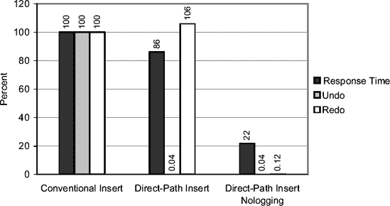
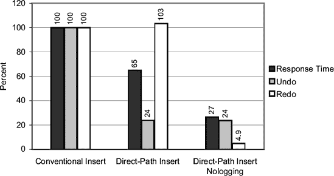
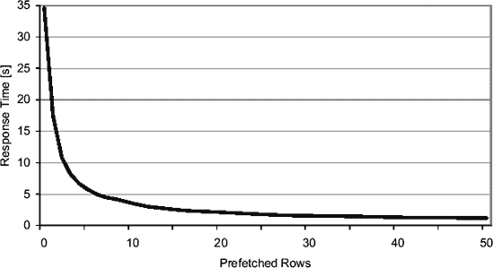
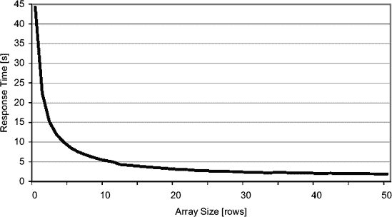
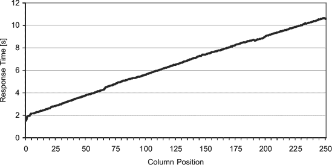
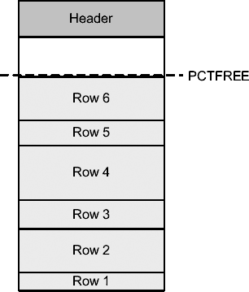
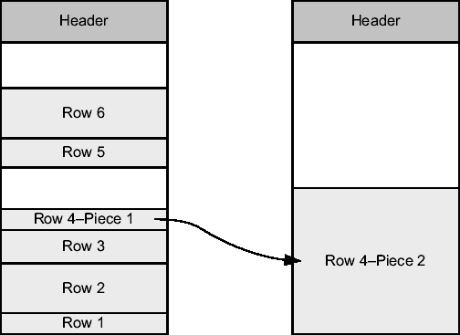
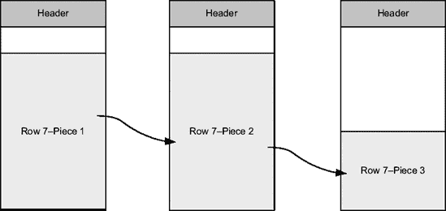
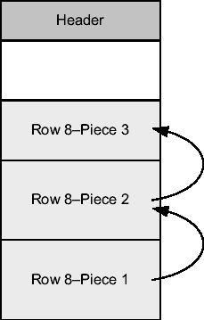

# Oracle 并行处理与直接路径插入

要实现高效的并行化，关键在于工作量是否在所有从属进程之间均匀分配。实际上，属于一个集合的所有从属进程必须等待其他所有进程完成后才能继续。简而言之，并行操作的速度取决于最慢的从属进程。

若要检查某个 SQL 语句的实际分布情况，可以使用动态性能视图`v$pq_tqstat`。基本上，该视图会为每个从属进程以及执行计划中的每个`PX SEND`和`PX RECEIVE`操作提供一行信息。但请注意，这些信息仅针对当前会话，并且只针对最后执行的并行 SQL 语句。

现在，我将基于脚本`px_tqstat.sql`生成的输出描述一个示例。两个输出之间的映射是通过执行计划中的`TQ`列与视图`v$pq_tqstat`中的`dfo_number`和`tq_id`列完成的。对于生产者来说，`dfo_number`是字母 Q 前缀的数字，而`tq_id`是逗号后的数字。例如，`Q1,00`映射到`dfo_number`等于 1 且`tq_id`等于 0。此外，`PX SEND`操作映射到生产者，`PX RECEIVE`操作映射到消费者。

```
SQL> SELECT * FROM t t1, t t2 WHERE t1.id = t2.id;

-------------------------------------------------------------------------
| Id | Operation                   | Name    |  TQ |IN-OUT| PQ Distrib |
-------------------------------------------------------------------------
|   0| SELECT STATEMENT            |         |     |      |            |
|   1|  PX COORDINATOR             |         |     |      |            |
|   2|   PX SEND QC (RANDOM)       | :TQ10001| Q1,01| P->S | QC (RAND)  |
|   3|    HASH JOIN                |         | Q1,01| PCWP |            |
|   4|     PX RECEIVE              |         | Q1,01| PCWP |            |
|   5|      PX SEND PARTITION (KEY)| :TQ10000| Q1,00| P->P | PART (KEY) |
|   6|       PX BLOCK ITERATOR     |         | Q1,00| PCWC |            |
|   7|        TABLE ACCESS FULL    | T       | Q1,00| PCWP |            |
|   8|     PX PARTITION HASH ALL   |         | Q1,01| PCWC |            |
|   9|      TABLE ACCESS FULL      | T       | Q1,01| PCWP |            |
-------------------------------------------------------------------------
```

```
SQL> SELECT dfo_number, tq_id, server_type, process, num_rows, bytes
   2 FROM v$pq_tqstat
   3 ORDER BY dfo_number, tq_id, server_type DESC, process;
DFO_NUMBER    TQ_ID SERVER_TYPE PROCESS    NUM_ROWS    BYTES
---------- -------- ----------- ---------- -------- --------
         1        0 Producer    P002          54952  6009713
         1        0 Producer    P003          45048  4921468
         1        0 Consumer    P000          20238  2213326
         1        0 Consumer    P001          79762  8717855
         1        1 Producer    P000          20238  4426604
         1        1 Producer    P001          79762 17435710
         1        1 Consumer    QC           100000 21862314
```

在这种情况下，您可以获得以下信息：

*   操作 5 已通过从属进程`P002`发送了 54,952 行，通过从属进程`P003`发送了 45,048 行。
*   操作 4 接收了操作 5 发送的数据：通过从属进程`P000`接收了 20,238 行，通过从属进程`P001`接收了 79,762 行。这表明在这种特定情况下，基于分区键的分布效果并不理想。
*   操作 2 通过从属进程`P000`向查询协调器发送了 20,238 行，通过从属进程`P001`发送了 79,762 行。由于之前的分布，这次分布也不理想。
*   由查询协调器执行的操作 1 接收了 100,000 行。

每个从属进程打开自己到实例的会话。这意味着，如果您想监视或跟踪执行单个 SQL 语句的处理过程，您不能只关注单个会话，而必须聚合来自多个会话的执行统计信息。例如，使用 SQL 跟踪时，每个从属进程都会生成自己的跟踪文件（在这种情况下，命令行工具`TRCSESS`可能很有用）。与此相关的一个主要问题是，查询协调器忽略为其工作的从属进程的执行统计信息。下面的执行计划说明了这一点。请注意，除了查询协调器（`PX COORDINATOR`）执行的操作外，列`Starts`、`A-Rows`和`Buffers`的值都设置为 0。

```
----------------------------------------------------------------------
| Id | Operation                  | Name    | Starts| A-Rows| Buffers|
----------------------------------------------------------------------
|   1| PX COORDINATOR             |         |      1|   100K|      14|
|   2|  PX SEND QC (RANDOM)       | :TQ10001|      0|     0 |       0|
|   3|   HASH JOIN                |         |      0|     0 |       0|
|   4|    PX RECEIVE              |         |      0|     0 |       0|
|   5|     PX SEND PARTITION (KEY)| :TQ10000|      0|     0 |       0|
|   6|      PX BLOCK ITERATOR     |         |      0|     0 |       0|
|   7|       TABLE ACCESS FULL    | T       |      0|     0 |       0|
|   8|    PX PARTITION HASH ALL   |         |      0|     0 |       0|
|   9|     TABLE ACCESS FULL      | T       |      0|     0 |       0|
----------------------------------------------------------------------
```

执行并行 DML 语句的会话（并且只有该会话——对于其他会话，未提交的数据甚至不可见）在提交（或回滚）事务之前无法访问已修改的表。在提交（或回滚）之前执行的 SQL 语句将以`ORA-12838: cannot read/modify an object after modifying it in parallel error`错误终止。下面是一个例子：

```
SQL> UPDATE t SET id = id + 1;

SQL> SELECT count(*) FROM t;
SELECT count(*) FROM t
                     *

ERROR at line 1:
ORA-12838: cannot read/modify an object after modifying it in parallel

SQL> COMMIT;

SQL> SELECT count(*) FROM t;

  COUNT(*)
----------
    100000
```

##### 直接路径插入

Oracle 数据库引擎提供两种类型的`INSERT`语句将数据加载到表中：*常规插入*和*直接路径插入*。常规插入，顾名思义，是通常使用的类型。而直接路径插入，仅当数据库引擎被明确指示时才使用。直接路径插入的目的是高效加载大量数据（对于少量数据，其性能可能比常规插入差）。它们之所以能实现这一目标，是因为其实现针对性能进行了优化，但牺牲了功能。因此，它们比常规插入有更多的要求和限制。现在，我将讨论直接路径插入的工作原理、何时应使用它们，以及一些与之相关的常见陷阱和谬误。


###### 工作原理

必须理解，并非所有类型的 `INSERT` 语句都支持直接路径插入。实际上，只有 `INSERT INTO ... SELECT ...` 语句（包括多表插入）、`MERGE` 语句（用于插入数据的部分）以及使用 OCI 直接路径接口的应用程序（例如 SQL*Loader 实用程序）能够利用这一特性。这意味着使用 `VALUES` 子句的“常规” `INSERT` 语句不支持此功能。

你有两种方式可以使 `INSERT INTO ... SELECT ...` 语句使用直接路径插入：

*   在 SQL 语句中指定提示 `append`：`INSERT /*+ append */ INTO ... SELECT ...`
*   并行执行该 SQL 语句。注意，在这种情况下，`INSERT` 和 `SELECT` 部分都可以独立地并行化。为了利用直接路径插入，至少 `INSERT` 部分必须并行化。

为了提高效率和性能，直接路径插入使用直接写入（direct writes）将数据直接加载到被修改段（segment）的高水位线（high watermark）之上。这一事实具有重要影响：

*   由于直接写入，会绕过缓冲区缓存（buffer cache）。
*   不允许并发的 `DELETE`、`INSERT`、`MERGE` 和 `UPDATE` 语句，以及（重新）构建修改表上的索引。自然，会获取表锁来保证这一点。
*   高水位线下包含空闲空间的数据块不会被考虑在内。这意味着即使定期执行 `DELETE` 语句以清除数据，该段的大小也会持续增长。

直接路径插入能带来更好性能的原因之一是，表段生成的撤销（undo）最少。事实上，撤销仅为空间管理操作（例如，增加高水位线并向段添加新区（extent））生成，而不会为通过直接路径插入的数据块中包含的行生成。但是，如果表有索引，则通常会为索引段生成撤销。如果还想避免与索引段相关的撤销，可以在加载前将索引标记为不可用（unusable），并在加载完成后重建它们。特别是在 ETL 作业中，这是常见的做法；此外，这通常是因为重建索引可能比让数据库引擎在加载结束时进行维护更快。

为了进一步提高性能，你还可以使用*最小化日志记录（minimal logging）*。其目的是最小化重做（redo）日志的生成。这是可选的，但对于显著减少响应时间通常至关重要。可以通过在表或分区级别设置 `nologging` 参数来指示使用最小化日志记录。关键要理解，最小化日志记录仅对直接路径插入和某些 DDL 语句受支持。实际上，所有其他操作都会生成重做日志。

***

`注意` 仅在你完全理解其影响的情况下，才应使用 `nologging` 并最小化重做生成。事实上，对于使用最小化日志记录修改的数据块，无法执行介质恢复（media recovery）。这意味着如果执行介质恢复，数据库引擎只能将这些块标记为逻辑损坏，因为介质恢复需要访问重做信息来重建块的内容。自然，如前所述，使用 `nologging` 时不会存储重做信息。因此，访问包含此类块的 SQL 语句会以 `ORA-26040: Data block was loaded using the NOLOGGING option` 错误终止。因此，仅当你能够手动重新加载数据或愿意在加载后进行备份时，才应使用最小化日志记录。

***

图 11-10 展示了一个使用直接路径插入可以实现的性能提升示例。这些数据是在我的测试系统上运行脚本 `dpi_performance.sql` 测得的。



**图 11-10.** *使用和不使用直接路径插入加载数据的比较（无索引表）*

注意，在图 11-10 中，两种直接路径插入的撤销生成都可以忽略不计。这是因为被修改的表没有索引。图 11-11 显示了相同测试但在有主键情况下的数据。正如预期，会生成索引段的撤销。



**图 11-11.** *使用和不使用直接路径插入加载数据的比较（带主键表）*

直接路径插入不支持所有常规插入所支持的对象。它们的功能是受限的。如果数据库引擎无法执行直接路径插入，该操作会被静默地转换为常规插入。当满足以下任一条件时，会发生这种情况：

*   在修改的表上存在启用的 `INSERT` 触发器。（注意，`DELETE` 和 `UPDATE` 触发器对直接路径插入没有影响。）
*   在修改的表上存在启用的外键（指向该表的其他表的外键不是问题）。
*   修改的表是索引组织的（index organized）。
*   修改的表存储在集群（cluster）中。
*   修改的表包含对象类型列。

###### 何时使用

当你需要加载大量数据，并且直接路径插入的限制对你来说不是问题时，就应该使用它。

如果性能是你的主要目标，你可能还会考虑使用最小化日志记录（`nologging`）。然而，如前所述，仅当你完全理解并接受其影响，并且采取了必要措施以防止在此过程中丢失数据时，才应使用此选项。

###### 陷阱与谬误

即使*没有*使用最小化日志记录，在 `noarchivelog`（非归档日志）模式下运行的数据库也不会为直接路径插入生成重做日志。

对于存储在处于 *force logging*（强制日志记录）模式的数据库或表空间中的段，无法使用最小化日志记录。实际上，`force logging` 会覆盖 `nologging` 参数。注意，`force logging` 对于备用数据库和流（streams）特别有用。要成功使用它们，重做日志需要包含所有修改的信息。

在直接路径插入期间，高水位线不会增加。此操作仅在事务提交时执行。因此，执行直接路径插入的会话（并且只有该会话——对于其他会话，未提交的高水位线之上的数据甚至不可见）在加载后无法访问被修改的表，除非提交（或回滚）该事务。在提交（或回滚）之前执行的 SQL 语句会以 `ORA-12838: cannot read/modify an object after modifying it in parallel` 错误终止。以下是一个示例：

```sql
SQL> INSERT /*+ append */ INTO t SELECT * FROM t;

100000 rows created.

SQL> SELECT count(*) FROM t;
SELECT count(*) FROM t
                    *
ERROR at line 1:
ORA-12838: cannot read/modify an object after modifying it in parallel

SQL> COMMIT;
SQL> SELECT count(*) FROM t;

  COUNT(*)
----------
    200000
```

错误 `ORA-12938` 关联的文本可能令人困惑，因为即使没有使用并行处理，也会生成此错误。

##### 行预取

当应用程序从数据库获取数据时，它可以逐行获取，或者更好的方式是同时获取多行。一次获取多行称为*行预取（row prefetching）*。


###### 工作原理

行预取的概念很简单。每当应用程序请求驱动程序从数据库中获取一行时，会同时预取多行并存储在客户端内存中。这样，后续的多个请求就不必再执行数据库调用来获取数据，它们可以直接从客户端内存中获取。因此，往返数据库的次数会随着预取行数的增加而成比例地减少。所以，获取包含大量行的结果集所产生的开销可以大大降低。例如，图 11-12 展示了通过将预取行数增加到 50 来获取 100,000 行的响应时间。此测试使用了 Java 类`RowPrefetchingPerf.java`。



**图 11-12.** 获取包含大量行的结果集所需的时间强烈依赖于预取的行数。

必须理解的是，不使用行预取（即逐行处理）时的性能低下*并非*由数据库引擎引起。相反，是应用程序导致了这一问题并因此受到影响。这一点在查看非预取情况下由 SQL 跟踪生成的执行统计信息时变得显而易见。下图显示，即使客户端耗时约 35 秒（参见图 11-12），在数据库端处理查询仅花费了 2.79 秒！

```
call    count     cpu   elapsed     disk     query    current     rows
----- ------- ------- --------- -------- --------- ----------- -------
Parse       1    0.00      0.00        0         0          0        0
Execute     1    0.00      0.00        0         0          0        0
Fetch  100001    2.66      2.79        0    100005          0   100000
----- ------- ------ --------- -------- --------- ----------- --------
total  100003    2.66      2.79        0    100005          0   100000
```

即使行预取对客户端重要得多，数据库也能从中受益。实际上，行预取极大地减少了逻辑读取的次数。以下执行统计信息显示了预取 50 行时的减少情况：

```
call   count   cpu     elapsed     disk     query   current    rows
----- ------ ----- ----------- -------- --------- --------- -------
Parse      1  0.00        0.00        0       123         1       0
Execute    1  0.00        0.00        0         0         0       0
Fetch   2001  0.10        0.11        0      4369         0  100000
------- ---- ----- ----------- -------- --------- --------- -------
total   2003  0.11        0.12        0      4492         1  100000
```

接下来的章节提供了关于如何在 PL/SQL、OCI、JDBC 和 ODP.NET 中利用行预取的一些基本信息。

## PL/SQL

自 Oracle 数据库 10*g*起，如果在编译时动态初始化参数`plsql_optimize_level`被设置为 2 或更高，则游标`FOR`循环会使用行预取。例如，以下 PL/SQL 块中的查询一次预取 100 行。请注意，预取的行数无法更改。

```
BEGIN
  FOR c IN (SELECT * FROM t)
  LOOP
    -- process data
    NULL;
  END LOOP;
END;
```

> **注意** 自 Oracle 数据库 10*g* Release 2 起，初始化参数`plsql_optimize_level`的默认值为 2。但在 Oracle 数据库 10*g* Release 1 中，该值为 0。

必须理解的是，行预取仅自动用于游标`FOR`循环。要将行预取与其他类型的游标一起使用，必须使用`BULK COLLECT`子句。下面展示了它与隐式游标的用法：

```
DECLARE
  TYPE t_t IS TABLE OF t%ROWTYPE;
  l_t t_t;
BEGIN
  SELECT * BULK COLLECT INTO l_t
  FROM t;
  FOR i IN l_t.FIRST..l_t.LAST
  LOOP
    -- process data
    NULL;
  END LOOP;
END;
```

使用前面的 PL/SQL 块，结果集中的所有行将在一次获取中返回。如果行数很多，则需要大量内存。因此，在实践中，要么你知道将返回的行数有限，要么使用`LIMIT`子句为单次获取设置一个限制。以下 PL/SQL 块展示了如何一次获取 100 行：

```
DECLARE
  CURSOR c IS SELECT * FROM t;
  TYPE t_t IS TABLE OF t%ROWTYPE;
  l_t t_t;
BEGIN
  OPEN c;
  LOOP
    FETCH c BULK COLLECT INTO l_t LIMIT 100;
    EXIT WHEN l_t.COUNT = 0;
    FOR i IN l_t.FIRST..l_t.LAST
    LOOP
      -- process data
      NULL;
    END LOOP;
  END LOOP;
  CLOSE c;
END;
```

包`dbms_sql`、原生动态 SQL 和`RETURNING`子句都支持行预取。然而，与前面的两个示例一样，它必须被显式启用（例如，通过`BULK COLLECT`）。

## OCI

在 OCI 中，行预取由两个语句属性控制：`OCI_ATTR_PREFETCH_ROWS`和`OCI_ATTR_PREFETCH_MEMORY`。前者限制获取的行数。后者限制用于获取行的内存量（以字节为单位）。以下代码片段展示了如何调用函数`OCIAttrSet`来设置这些属性。C 程序`row_prefetching.c`提供了一个完整的示例。

```
ub4 rows = 100;
OCIAttrSet(stm,                    // statement handle
           OCI_HTYPE_STMT,         // type of handle being modified
           &rows,                  // attribute's value
           sizeof(rows),           // size of the attribute's value
           OCI_ATTR_PREFETCH_ROWS, // attribute being set
           err);                   // error handle

ub4 memory = 10240;
OCIAttrSet(stm,                      // statement handle
           OCI_HTYPE_STMT,           // type of handle being modified
           &memory,                  // attribute's value
           sizeof(memory),           // size of the attribute's value
           OCI_ATTR_PREFETCH_MEMORY, // attribute being set
           err);                     // error handle
```

当两个属性都被设置时，首先达到的限制将生效。要关闭行预取，必须将两个属性都设置为零。

## JDBC

Oracle JDBC 驱动程序默认启用行预取。你可以通过两种方式更改默认获取行数（10）。第一种是在使用`OracleDataSource`类或`OracleDriver`类打开到数据库的连接时，指定属性`defaultRowPrefetch`。以下代码片段展示了一个示例，其中为`OracleDataSource`对象设置了用户、密码和预取行数。请注意，在这种情况下，因为`defaultRowPrefetch`被设置为 1，所以行预取被禁用。

```
connectionProperties = new Properties();
connectionProperties.put("user", user);
connectionProperties.put("password", password);
connectionProperties.put("defaultRowPrefetch", "1");
dataSource.setConnectionProperties(connectionProperties);
```

第二种方式是在连接级别使用`Statement`类中的`setFetchSize`方法覆盖默认值。以下代码片段展示了一个示例，其中使用`setFetchSize`方法将获取的行数设置为 100。Java 程序`RowPrefetching.java`提供了一个完整的示例。

```
sql = "SELECT id, pad FROM t";
statement = connection.prepareStatement(sql);
statement.setFetchSize(100);
resultset = statement.executeQuery();
while (resultset.next())
{
  id = resultset.getLong("id");
  pad = resultset.getString("pad");
  // process data
}
resultset.close();
statement.close();
```

## ODP.NET

ODP.NET 的默认获取大小（65,536）是以字节定义的，*而不是*行数。你可以通过`OracleCommand`和`OracleDataReader`类提供的`FetchSize`属性来更改此值。以下代码片段是如何设置获取 100 行的值的示例。注意`OracleCommand`类的`RowSize`属性是如何用于计算存储 100 行所需内存量的。C#程序`RowPrefetching.cs`提供了一个完整的示例。

```
sql = "SELECT id, pad FROM t";
command = new OracleCommand(sql, connection);
reader = command.ExecuteReader();
reader.FetchSize = command.RowSize * 100;
while (reader.Read())
{
  id = reader.GetDecimal(0);
  pad = reader.GetString(1);
  // process data
}
reader.Close();
```

自 Oracle Data Provider for .NET Release 10.2.0.3 起，你还可以通过以下注册表项更改默认获取大小（`<Assembly_Version>`是`Oracle.DataAccess.dll`的完整版本号）：

```
HKEY_LOCAL_MACHINE\SOFTWARE\ORACLE\ODP.NET\<Assembly_Version>\FetchSize
```


##### 行预取

###### 何时使用

任何时候需要获取多行数据时，使用行预取都是有意义的。

###### 陷阱与误解

当使用 OCI 库时，并非总是能够完全禁用行预取。例如，使用 JDBC OCI 驱动程序或 SQL*Plus 时，最小获取行数为两行。在实践中，这不是问题，但可能会引起一些困惑，例如，为什么在 SQL*Plus 中将系统变量 `arraysize` 设置为 1 后，仍然看到获取了两行数据。

如果一个应用程序每次显示，比如说，10 行数据，那么从数据库预取 100 行通常是没有意义的。理想情况下，预取的行数应与应用程序在特定时间所需的行数相同。

##### 数组接口

在上一节中，你已经看到当应用程序从数据库获取数据时，它可以逐行获取，或者更好的是，使用行预取。同样的概念适用于应用程序向数据库引擎传递数据的情况，或者换句话说，在绑定输入变量期间。为此，可以使用*数组接口*。

###### 工作原理

数组接口允许你绑定数组而不是标量值。当特定的 DML 语句需要插入或修改大量行时，这非常有用。无需为每一行单独执行 DML 语句，你可以将所有必要的值绑定为数组并只执行一次，或者如果行数很多，可以将执行拆分为更小的批次。因此，与数据库的往返次数与执行次数成比例地减少。图 11-13 显示了通过将数组大小增加到 50 来插入 100,000 行的响应时间。Java 类 `ArrayInterfacePerf.java` 用于此测试。



`图 11-13.` 将数据加载到数据库所需的时间在很大程度上取决于每次执行处理的行数。

必须理解的是，没有数组处理（换句话说，逐行处理）的加载性能差*并非*由数据库引擎造成。相反，是应用程序导致并承受了这一后果。通过查看 SQL 跟踪生成的执行统计信息，你可以清楚地看到这一点。下图显示，即使客户端耗时约 44 秒（见图 11-13），处理数据库端插入只花费了 3.16 秒。

```
call     count      cpu    elapsed       disk      query    current       rows
------- ------ -------- ---------- ---------- ---------- ---------- ----------
Parse        1     0.00       0.00          0          0          0          0
Execute 100000     3.07       3.16          1       1498     113131     100000
Fetch        0     0.00       0.00          0          0          0          0
------- ------ -------- ---------- ---------- ---------- ---------- ----------
total   100001     3.07       3.16          1       1498     113131     100000
```

即使数组接口对客户端高效得多，数据库也能从中受益。实际上，数组接口减少了逻辑读的次数。以下执行统计信息显示了以每批 50 行插入时的减少情况：

```
call     count      cpu    elapsed       disk      query    current       rows
------- ------ -------- ---------- ---------- ---------- ---------- ----------
Parse        1     0.00       0.00          0          0          0          0
Execute   2000     0.45       1.23          2       2858      15677     100000
Fetch        0     0.00       0.00          0          0          0          0
------- ------ -------- ---------- ---------- ---------- ---------- ----------
total     2001     0.45       1.23          2       2858      15677     100000
```

接下来的章节将提供关于如何在 PL/SQL、OCI、JDBC 和 ODP.NET 中利用数组接口的一些基本信息。

**PL/SQL**

要在 PL/SQL 中使用数组接口，可以使用 `FORALL` 语句。通过它，你可以执行一个绑定数组的 DML 语句，从而向数据库引擎传递数据。以下 PL/SQL 块展示了如何通过单次执行插入 100,000 行。注意，代码的第一部分仅用于准备数组。带有 `INSERT` 语句的 `FORALL` 语句只用了两行。

```
DECLARE
  TYPE t_id IS TABLE OF t.id%TYPE;
  TYPE t_pad IS TABLE OF t.pad%TYPE;
  l_id t_id := t_id();
  l_pad t_pad := t_pad();
BEGIN
  -- 准备数据
  l_id.extend(100000);
  l_pad.extend(100000);
  FOR i IN 1..100000
  LOOP
    l_id(i) := i;
    l_pad(i) := rpad('*',100,'*');
  END LOOP;
  -- 插入数据
  FORALL i IN l_id.FIRST..l_id.LAST
    INSERT INTO t VALUES (l_id(i), l_pad(i));
END;
```

需要注意的是，即使语法基于关键字 `FORALL`，但这并不是一个循环。所有行都在一次数据库调用中发送。

数组接口不仅在此情况下受支持，`dbms_sql` 包和原生动态 SQL 也支持它。

**OCI**

要在 OCI 中利用数组接口，不需要特定的函数。实际上，用于绑定变量的函数 `OCIBindByPos` 和 `OCIBindByName`，以及用于执行 SQL 语句的函数 `OCIStmtExecute`，都具备使用数组作为参数的能力。C 程序 `array_interface.c` 提供了一个示例。

**JDBC**

要在 JDBC 中使用数组接口，可以使用*批量更新*。如下列代码片段所示，它通过单次执行插入 100,000 行，你可以通过执行 `addBatch` 方法将一个“执行”添加到批次中。当包含多个执行的整个批次准备就绪后，可以通过执行 `executeBatch` 方法将其提交给数据库引擎。这两个方法在 `Statement` 类中可用，因此也在其子类 `PreparedStatement` 和 `CallableStatement` 中可用。Java 程序 `ArrayInterface.java` 提供了一个完整的示例。

```
sql = "INSERT INTO t VALUES (?, ?)";
statement = connection.prepareStatement(sql);
for (int i=1 ; i<=100000 ; i++)
{
  statement.setInt(1, i);
  statement.setString(2, "... some text ...");
  statement.addBatch();
}
statement.executeBatch();
statement.close();
```

**ODP.NET**

要在 ODP.NET 中使用数组接口，只需定义基于数组的参数，并将属性 `ArrayBindCount` 设置为数组中存储的值的数量即可。以下代码片段通过单次执行插入 100,000 行，说明了这一点。你可以在 C# 程序 `ArrayInterface.cs` 中找到完整的示例。

```
Decimal[] idValues = new Decimal[100000];
String[] padValues = new String[100000];

for (int i=0 ; i<100000 ; i++)
{
  // 初始化数组
}
id = new OracleParameter();
id.OracleDbType = OracleDbType.Decimal;
id.Value = idValues;

pad = new OracleParameter();
pad.OracleDbType = OracleDbType.Varchar2;
pad.Value = padValues;

sql = "INSERT INTO t VALUES (:id, :pad)";
command = new OracleCommand(sql, connection);
command.ArrayBindCount = 100000;
command.Parameters.Add(id);
command.Parameters.Add(pad);
command.ExecuteNonQuery();
```

###### 何时使用

任何时候需要插入或多行修改时，使用数组接口都是有意义的。


###### 陷阱与误区

在通过 SQL 跟踪生成的执行统计信息中，没有关于数组处理利用率的明确信息。但是，如果你知道 SQL 语句，通过观察修改行数与执行次数的比率，你应该能够识别是否使用了数组处理。例如，在以下执行统计信息中，一个简单的`INSERT`语句只执行了一次，却插入了 2,342 行。类似这样的情况只有在使用数组接口时才可能。

```sql
INSERT INTO T VALUES (:B1, :B2 )
```

```
call     count      cpu    elapsed       disk      query    current       rows
------- ------ -------- ---------- ---------- ---------- ---------- ----------
Parse        1     0.00       0.00          0          0          0          0
Execute      1     0.00       0.00          0         78        522       2342
Fetch        0     0.00       0.00          0          0          0          0
------- ------ -------- ---------- ---------- ---------- ---------- ----------
total        2     0.00       0.00          0         78        522       2342
```

### 继续学习 第 12 章

本章描述了一些旨在提高性能的高级优化技术。其中一些（物化视图、结果缓存、并行处理和直接路径插入）只应在使用“常规”优化技术无法达到所需性能时使用。相反，其他技术（行预取和数组处理）应尽可能始终使用。

虽然本章主要介绍了一些不常用的优化技术，但下一章（也是最后一章）描述的技术基本上适用于存储在数据库中的每个表。实际上，当你将逻辑设计转换为物理设计时，对于每个表都需要决定数据如何物理存储。

### 第十二章
优化物理设计

**在**将逻辑设计转换为物理设计的过程中，你必须做出四类决策。首先，对于每个表，你不仅需要决定是使用堆表、聚簇还是索引组织表，还需要决定是否需要对它进行分区。其次，你必须考虑是否应该利用冗余访问结构，如索引和物化视图。第三，你必须决定如何实现约束（而不是*是否*需要实现它们）。第四，你必须决定数据如何存储在块中，包括列的顺序、使用的数据类型、每个块应存储多少行，或者是否应激活压缩。本章仅重点讨论第四个主题。关于其他主题，尤其是前两个主题的信息，请参考第 9 章、第 10 章和第 11 章。

本章旨在解释为什么物理设计的优化不应被视为微调活动，而应被视为一种基本的优化技术。本章首先讨论为何选择正确的列顺序和正确的数据类型至关重要。接着解释什么是行迁移和行链接，如何识别与它们相关的问题，以及如何首先避免行迁移和行链接。然后，它描述了高工作负载系统常见的一种性能问题：块争用。最后，它描述了如何利用数据压缩来提高性能。

#### 最佳列顺序

通常很少有人费心为表寻找最佳的列顺序。根据情况，这可能完全没有影响，也可能导致显著的开销。为了理解在哪些情况下可能导致显著开销，描述数据库引擎如何将行存储到块中至关重要。

存储在块中的行格式非常简单（参见图 12-1）。首先，有一个头部（H），记录有关行本身的一些属性，例如它是否被锁定或包含多少列。然后，是各列数据。因为每一列的大小可能不同，所以每列都由两部分组成。第一部分是数据的长度（L*n*）。第二部分是数据本身（D*n*）。


**图 12-1.** *存储在数据库块中的行的格式（H=行头，Ln=第 n 列的长度，Dn=第 n 列的数据）*

这种格式需要理解的关键点是，数据库引擎不知道行中列的偏移量。例如，如果它必须定位第 3 列，它必须从定位第 1 列开始。然后，基于第 1 列的长度，它定位第 2 列。最后，基于第 2 列的长度，它定位第 3 列。因此，当一行有不止几列时，靠近行开头的列可能比靠近行末尾的列定位得更快。为了更好地理解这一点，你可以基于脚本`column_order.sql`执行以下测试，以测量查找列相关的开销：

1.  创建一个包含 250 列的表：`CREATE TABLE t (n1 NUMBER, n2 NUMBER, ..., n249 NUMBER, n250 NUMBER)`
2.  插入 10,000 行。每行的每一列存储相同的值。
3.  在循环中执行以下查询 1,000 次，测量每个列的响应时间。`SELECT count(<col>) FROM t`

图 12-2 总结了在我的测试服务器上运行此测试的结果。值得注意的是，引用第一列（位置 1）的查询比引用第 250 列（位置 250）的查询快约五倍。这是因为数据库引擎优化了每一次访问，从而避免了定位和读取处理所不需要的列。例如，查询`SELECT count(n3) FROM t`在定位到第三列后就停止遍历该行。图 12-2 也在位置 0 报告了`count(*)`的数据，它根本不需要访问任何列。

因此，一般规则是将频繁访问的列放在前面。然而，为了利用这一点，你应该注意只访问（引用）真正需要的列。无论如何，从性能的角度来看，选择不需要的列（或者更糟的是，即使应用程序实际上只需要其中一些列，也经常使用`SELECT *`引用所有列）是不好的，这不仅因为如你所见从块中读取它们会有开销，还因为服务器和客户端上临时存储它们需要更多内存，并且通过网络发送数据需要更多时间和资源。简单地说，每次处理数据时，都会有开销。

实际上，与列位置相关的开销在以下一种或多种情况下（更）为明显：

*   当表有很多列，并且 SQL 语句频繁引用位于行末尾的极少数列时。
*   当从单个块中读取许多行时，例如在全表扫描期间。这是因为，通常，定位和访问一个块的开销远大于在读取少量行时定位和访问列的开销。




**图 12-2.** `列在行中的位置 vs. 访问它所需的处理量`

由于尾部的 `NULL` 值不被存储，将预期包含 `NULL` 值的列放在表末尾是合理的。这样，物理存储的列数以及随之而来的行的平均大小可能会减少。

#### 最优数据类型

近年来，我见证了一个在物理设计中令人担忧的趋势。这个趋势可以被称为*错误的数据类型选择*。乍一看，为列选择数据类型似乎是一个非常直接的决定。然而，在一个软件架构师花费大量时间讨论敏捷软件开发、SOA、Ajax 或持久化框架等高层概念，却似乎忘记了底层细节的世界里，我相信回归基础并讨论为何数据类型选择至关重要是必要的。

### 数据类型选择中的陷阱

为了说明错误的数据类型选择，我将展示五个我反复遇到的典型问题例子。尽管这一切可能看起来非常基础，但可以肯定的是，现在有大量正在运行的系统正因为这些问题而遭受痛苦。

错误数据类型选择导致的第一个问题是，当数据在数据库中插入或修改时，验证错误或缺失。例如，如果一个列旨在存储数值，为其选择字符数据类型就需要外部验证。换句话说，数据库引擎无法验证数据。它将此任务交给了应用程序。即使这种验证很容易实现，但请记住，每次相同的代码片段分散在多个位置，而不是集中在数据库中，迟早会出现功能上的不匹配（通常，在某些位置验证可能被遗忘，或者验证后来发生变化，而其实现只在某些位置更新）。我举的例子与初始化参数 `nls_numeric_characters` 有关。请记住，这个初始化参数指定了用作小数点和组分隔符的字符。例如，在瑞士，它通常被设置为 `".,`"，因此圆周率值格式化为：`3.14159`。而在德国，它通常被设置为 `",."`，因此相同的值格式化为：`3,14159`。迟早，使用此初始化参数的不同客户端设置来运行应用程序，如果因为数据库中使用了错误的数据类型而发生转换，就会导致 `ORA-01722: invalid number` 错误。而当你注意到这一点时，你的数据库里将充斥着同时包含两种格式的 `VARCHAR2` 列，因此将不得不进行痛苦的数据协调。

错误数据类型选择导致的第二个问题是信息丢失。换句话说，在将原始（正确）数据类型转换为数据库数据类型的过程中，信息丢失了。例如，想象一下当事件的日期和时间用 `DATE` 数据类型而不是 `TIMESTAMP WITH TIME ZONE` 数据类型存储时会发生什么。小数秒和时区信息会丢失。尽管前者导致的误差非常小（小于一秒），但后者可能是个更大的问题。在我目睹的一个案例中，客户的数据总是使用本地标准时间（无夏令时调整）生成并直接存储在数据库中。问题出在出于报告目的，需要应用夏令时校正时。于是实现了一个用于在两个时区之间进行转换的函数。其签名如下：

```
new_time_dst(in_date DATE, tz1 VARCHAR2, tz2 VARCHAR2) RETURN DATE
```

调用一次这样的函数非常快。问题在于为每个报告调用它数千次。结果，响应时间增加了 25 倍。显然，如果使用正确的数据类型，一切不仅会更快，也会更容易（转换会自动执行）。

错误数据类型选择导致的第三个问题是事情不能按预期工作。假设你必须基于存储日期时间信息的 `DATE` 或 `TIMESTAMP` 列对表进行范围分区。这通常不是什么大问题。问题在于，如果用作分区键的列包含基于某种格式掩码的日期时间值的数字表示，或等效的字符串表示，而不是纯 `DATE` 或 `TIMESTAMP` 值。如果从日期时间值到数字值的转换是使用像 `YYYYMMDDHH24MISS` 这样的格式掩码执行的，那么定义范围分区仍然是可能的。然而，如果转换是基于像 `DDMMYYYYHH24MISS` 这样的格式掩码，那么不改变列的数据类型或格式，你就无法解决这个问题，因为数字（或字符串）的顺序与自然的日期时间值顺序不匹配（从 Oracle Database 11*g* 开始，或许可以通过实现基于虚拟列的分区来解决此问题）。

错误数据类型选择导致的第四个问题与查询优化器有关。这可能是这个简短列表中最不明显的一个，也是导致最微妙问题的一个。原因在于，使用错误的数据类型，查询优化器将进行错误的估计，从而选择次优的访问路径。当这种事情发生时，大多数人通常会责怪查询优化器“又一次”没有做好它的工作。实际上，问题是信息对它隐藏了，因此查询优化器无法正确工作。为了更好地理解这个问题，请看下面的例子，它基于脚本 `wrong_datatype.sql`。在这里，你正在检查基于三列的类似限制的估计基数，这三列存储相同的数据集（2008 年每一天的日期），但基于不同的数据类型。如你所见，查询优化器只能正确定义的那一列做出精确估计（正确的基数是 29）。

```
SQL> CREATE TABLE t (d DATE, n NUMBER(8), c VARCHAR2(8));

SQL> INSERT INTO t (d)
  2 SELECT trunc(sysdate,'year')+level-1
  3 FROM dual
  4 CONNECT BY level <= 366;

SQL> UPDATE t
  2 SET n = to_number(to_char(d,'YYYYMMDD')), c = to_char(d,'YYYYMMDD');

SQL> SELECT *
  2 FROM t
  3 ORDER BY d;
D                  N        C
---------- --------- ---------
01-JAN-08  20080101  20080101
02-JAN-08  20080102  20080102
...
30-DEC-08  20081230  20081230
31-DEC-08  20081231  20081231

SQL> execute dbms_stats.gather_table_stats(ownname=>user, tabname=>'t')

SQL> EXPLAIN PLAN SET STATEMENT_ID = 'd' FOR
  2 SELECT *
  3 FROM t
  4 WHERE d BETWEEN to_date('20080201','YYYYMMDD')
  5             AND to_date('20080229','YYYYMMDD');

SQL> EXPLAIN PLAN SET STATEMENT_ID = 'n' FOR
  2 SELECT *
  3 FROM t
  4 WHERE n BETWEEN 20080201 AND 20080229;

SQL> EXPLAIN PLAN SET STATEMENT_ID = 'c' FOR
  2 SELECT *
  3 FROM t
  4 WHERE c BETWEEN '20080201' AND '20080229';

SQL> SELECT statement_id, cardinality
  2 FROM plan_table
  3 WHERE id = 0;

STATEMENT_ID CARDINALITY
------------ -----------
d                     30
n                     11
c                     11
```


## 第五个问题也与查询优化器相关

不过，这个问题是由**隐式转换**引起的（作为一般规则，你应该始终避免隐式转换）。可能发生的情况是，隐式转换会阻止查询优化器选择索引。为了说明这个问题，我们使用与前面示例相同的表。对于此表，我们基于`VARCHAR2`数据类型的列创建了一个索引。如果`WHERE`子句包含对该列的、使用字符串的限制条件，查询优化器就会选择索引。但是，如果限制条件使用的是数字（开发者"知道"该列只存储数值），则会进行全表扫描（请注意，在第二个 SQL 语句中，基于函数`to_number`的隐式转换阻止了索引的使用）。

```sql
SQL> CREATE INDEX i ON t (c);

SQL> SELECT *
  2 FROM t
  3 WHERE c = '20080229';

---------------------------------------------
| Id | Operation                     | Name |
---------------------------------------------
|  0 | SELECT STATEMENT              |      |
|  1 |  TABLE ACCESS BY INDEX ROWID  | T    |
|* 2 |   INDEX RANGE SCAN            | I    |
---------------------------------------------

    2 - access("C"='20080229')

SQL> SELECT *
  2 FROM t
  3 WHERE c = 20080229;

-----------------------------------
| Id  | Operation         | Name |
-----------------------------------
|  0 | SELECT STATEMENT    |      |
|* 1 |   TABLE ACCESS FULL | T    |
-----------------------------------

    1 - filter(TO_NUMBER("C")=20080229)
```

总而言之，正确选择数据类型有充分的理由。这样做可以为你避免许多问题。

### 数据类型选择的最佳实践

如前一节所讨论的，其关键原则在于，每种数据类型只应存储为其设计而生的值。例如，数字必须存储在数值数据类型中，而不是字符串数据类型中。此外，当存在多种数据类型时（例如，可以存储字符串的多种数据类型），重要的是选择能够以最有效的方式完全存储数据的那一种。换句话说，你应该避免信息丢失或性能损失。

接下来的章节提供了一些在选择数据类型时应考虑的信息（主要与性能相关）。它们涵盖了内置数据类型的四个主要类别：数字、日期时间、字符串和位串。

#### 数字

用于存储浮点数和整数的主要数据类型是`NUMBER`。它是一种变长数据类型。这意味着可以通过指定*精度*和*标度*来确定存储数据的准确度。当它用于存储整数或不需要完全精确时，指定标度以节省空间很重要。下面的示例显示了相同的值根据标度的不同，占用 21 字节或 2 字节：

```sql
SQL> CREATE TABLE t (n1 NUMBER, n2 NUMBER(*,2));

SQL> INSERT INTO t VALUES (1/3, 1/3);

SQL> SELECT * FROM t;

                                     N1   N2
----------------------------------- ----
.333333333333333333333333333333333  .33

SQL> SELECT vsize(n1), vsize(n2) FROM t;

VSIZE(N1)  VSIZE(N2)
--------- ----------
       21          2
```

由于其内部格式是专有的，CPU 无法直接处理它们。相反，它们由 Oracle 内部库例程处理。因此，`NUMBER`数据类型在处理密集计算负载时效率不高。为了解决这个问题，从 Oracle Database 10*g*开始，提供了两种新的数据类型：`BINARY_FLOAT`和`BINARY_DOUBLE`。它们比`NUMBER`数据类型有两个优势。首先，它们实现了 IEEE 754 标准，因此 CPU 可以直接处理它们。其次，它们是定长数据类型。表 12-1 总结了这些数据类型之间的差异。

**表 12-1.** 数字数据类型比较

| 属性 | `NUMBER(precision,scale)` | `BINARY_FLOAT` | `BINARY_DOUBLE` |
| --- | --- | --- | --- |
| 值范围 | ±1.0E126 | ±3.40E38 | ±1.79E308 |
| 大小 | 1–22 字节 | 4 字节 | 8 字节 |
| 支持 ±无穷大 | 是 | 是 | 是 |
| 支持 NaN | 否 | 是 | 是 |
| 优点 | 精度高，可指定精度和标度 | 速度快，定长 | 速度快，定长 |
| * 自 Oracle Database 10*g 起可用 | | | |

#### 字符串

用于存储字符串的三种基本数据类型是：`VARCHAR2`、`CHAR`和`CLOB`。前两种分别最多支持 4,000 和 2,000 字节（注意最大长度以字节而非字符为单位指定）。第三种在 Oracle9*i*中最多支持 4GB，从 Oracle Database 10*g*开始甚至更多。`VARCHAR2`和`CHAR`的主要区别在于前者是变长的，而后者是定长的。这意味着当字符串长度已知时，通常使用`CHAR`。然而，我的建议是始终使用`VARCHAR2`，因为它比`CHAR`提供更好的性能。只有当预期字符串长度超过`VARCHAR2`上限时，才应使用`CLOB`。从 Oracle Database 11*g*开始，`CLOB`有两种存储方法：`basicfile`和`securefile`。为了获得更好的性能，你应该使用`securefile`。

这三种基本数据类型根据数据库字符集存储字符串。此外，还有另外三种数据类型`NVARCHAR2`、`NCHAR`和`NCLOB`，可用于根据*国家字符集*（在数据库级别定义的辅助 Unicode 字符集）存储字符串。这三种数据类型与同名的基本数据类型具有相同的特征，只是字符集不同。

`LONG`是另一种字符串数据类型，尽管它已被弃用，由`CLOB`替代。你不应再使用它；它仅出于向后兼容性而提供。

#### 日期时间

用于存储日期时间值的数据类型是`DATE`、`TIMESTAMP`、`TIMESTAMP WITH TIME ZONE`和`TIMESTAMP WITH LOCAL TIME ZONE`。它们都存储以下信息：年、月、日、小时、分钟和秒。这部分的长度固定为 7 字节。基于`TIMESTAMP`的三种数据类型还可能存储秒的小数部分（0-9 位，默认为 6 位）。这部分是变长的：0-4 字节。最后，`TIMESTAMP WITH TIME ZONE`额外用两个字节存储时区。由于它们存储的信息各不相同，最适合的数据类型是为存储所需数据而占用最小空间的那种。

#### 位串

有两种数据类型用于存储位串：`RAW`和`BLOB`。前者最多支持 2,000 字节。后者仅当预期位串大于 2,000 字节时才应使用。从 Oracle Database 11*g*开始，`BLOB`有两种存储方法：`basicfile`和`securefile`。为了获得更好的性能，你应该使用`securefile`。

另一种位串数据类型是`LONG RAW`，但它已被弃用，由`BLOB`替代。你不应再使用它；它仅出于向后兼容性而提供。

#### 行迁移与行链接

行迁移和行链接常常被混淆。在我看来，这主要有两个原因。首先，它们共享一些特征，所以容易混淆。其次，因为 Oracle 在其文档和软件实现中，从未非常一致地区分它们。因此，在描述如何检测和避免它们之前，有必要简要说明两者之间的区别。


## 迁移与链化

当行被插入到一个块中时，数据库引擎会保留一些空闲空间供未来更新使用。你可以通过参数 `PCTFREE` 来定义为更新保留的空闲空间量。举例来说，我在图 12-3 所示的块中插入了六行。由于已达到通过 `PCTFREE` 设置的限制，此块不再可用于插入。



**图 12-3.** 插入操作会为未来的更新保留一些空闲空间。

当一行被更新且其大小增加时，数据库引擎会尝试在其存储的块中找到足够的空闲空间。如果没有足够的空闲空间，该行将被拆分为两个片段。第一个片段（仅包含控制信息，例如指向第二个片段的 rowid）保留在原始块中。这样做是为了避免更改 rowid。请注意，这至关重要，因为 rowid 可能不仅被数据库引擎永久存储在索引中，也可能被客户端临时存储在内存中。包含所有数据的第二个片段则进入另一个块。这种行被称为`迁移行`。例如，在图 12-4 中，第 4 行已被迁移。



**图 12-4.** 更新后无法再存储在原始块中的行会被迁移到另一个块。

当一行太大而无法放入单个块时，它会被拆分成两个或多个片段。然后，每个片段存储在不同的块中，并在这些片段之间建立链。这种类型的行被称为`链行`。例如，图 12-5 显示了一个跨越三个块的链行。



**图 12-5.** 一个链行被拆分成两个或更多片段。

存在导致行链化的第二种情况：包含大量列的表。实际上，数据库引擎无法在一个行片段中存储超过 255 列。因此，每当需要存储超过 255 列时，行就会被拆分成多个片段。这种情况很特殊，因为属于同一行的多个片段也可能存储在单个块中。这被称为`块内行链`。图 12-6 显示了一个有三段（因为它有 654 列）的行。



**图 12-6.** 超过 255 列的表可能导致块内行链。

请注意，迁移行是由更新引起的，而链行则可能由插入或更新引起。当链行由更新引起时，这些行可能同时发生迁移和链化。

## 问题描述

行迁移对性能的影响取决于读取行所使用的访问路径。如果通过 rowid 访问它们，成本会翻倍。实际上，两个行片段都必须分别被访问。相反，如果通过全表扫描访问，则没有额外开销。这是因为不包含数据的第一个行片段会被简单地跳过。

行链化对性能的影响与访问路径无关。实际上，每次找到第一个片段时，也必须通过 rowid 读取所有其他片段。然而，有一个例外。正如“最佳列顺序”一节所讨论的，当只需要一行的部分内容时，并非所有片段都需要被访问。例如，如果只需要存储在第一个片段中的列，则无需访问所有其他片段。

适用于迁移和链化的一个额外开销与行级锁相关。每个行片段都必须被锁定。这意味着锁导致的额外开销与片段数量成比例增加。

## 问题识别

检测迁移行和链行主要有两种技术。不幸的是，两者都不基于响应时间。这意味着无法获得关于问题真实影响的详细信息。第一种技术基于视图 `v$sysstat` 和 `v$sesstat`，仅能给出一个线索，表明数据库某处存在迁移行或链行。其思路是检查统计项 `table fetch continued row`，它给出了读取超过一个行片段（包括块内链行）的获取次数。为了评估行链化和迁移的相对影响，还可以将此统计项与 `table scan rows gotten` 和 `table fetch by rowid` 进行比较。相比之下，第二种技术提供了关于迁移行和链行的精确信息。不幸的是，它需要针对每个可能包含链行或迁移行的表执行 SQL 语句 `ANALYZE TABLE <table_name> LIST CHAINED ROWS`。如果找到链行或迁移行，它们的 rowid 会被插入到表 `chained_rows` 中。然后，基于这些 rowid，如下列查询所示，可以估算行的大小，并通过将其大小与块大小进行比较，识别它们是迁移行还是链行。

```sql
SELECT vsize(<col1>) + vsize(<col2>) + ... + vsize(<coln>)
FROM <table>
WHERE rowid = '<rowid>'
```

或者，作为一种粗略估计，也可以查看表 `dba_tables` 中的 `avg_row_len` 列。如果平均行长度大于块大小，则这些行很可能是链行。

* * *

**注意** 表 `dba_tables` 的 `chain_cnt` 列应该提供链行和迁移行的数量。不幸的是，`dbms_stats` 包不会收集此统计信息。它简单地被设置为 0。虽然用正确值填充它的唯一方法是执行 SQL 语句 `ANALYZE TABLE <table_name> COMPUTE STATISTICS`，但这将导致被分析表的所有对象统计信息被覆盖。这不是推荐的做法。

* * *

## 解决方案

避免迁移的措施与避免链化的措施不同。因此，我要强调的是，在采取措施之前，你必须确定问题是由迁移还是由链化引起的。

避免行迁移是可能的。这只是一个正确设置 `PCTFREE` 的问题，换句话说，就是保留足够的空闲空间，以便将修改后的行完全存储在原始块中。这样，如果你确定正在经历行迁移，你应该增加 `PCTFREE` 的当前值。为了选择一个合适的值，你应该估算平均行增长量。要做到这一点，你需要知道行在插入时的平均大小，以及它们不再被更新时的平均大小。

要从表中删除迁移行，有两种可能。首先，你可以使用导出/导入或 `ALTER TABLE MOVE` 完全重组表。其次，你可以只将迁移行复制到临时表中，然后从原始表中删除并重新插入它们。当迁移行的百分比较小且没有足够的时间或资源完全重组表时，第二种方法特别有用。

避免行链化要困难得多。显而易见的措施是使用更大的块大小。然而，有时即使最大的块大小也不够大。此外，如果链化是由于列数超过 255 引起的，只有重新设计才能解决问题。因此，在某些情况下，解决此问题的唯一可行方法是将不常访问的列放在表的末尾，从而避免每次访问所有片段。


#### 块争用

块争用是指多个进程同时竞相访问相同数据块的情况，它可能导致应用程序性能下降。通过调整表或索引的物理存储参数，有时可以缓解块争用问题。

## 问题描述

缓冲区缓存在实例的所有进程间共享。因此，多个进程可能并发地读取或修改存储在缓冲区缓存中的同一个数据块。为避免访问冲突，每个进程在访问缓冲区缓存中的数据块前，必须先获得其上的一个**锁针**（此规则存在例外情况，但就本节讨论目的而言并不重要）。`锁针`是一种短期锁，以共享模式或独占模式获取。对于一个给定的数据块，多个进程可以同时持有共享模式的锁针（例如，如果它们都只需读取该数据块），而只能有一个进程持有独占模式的锁针（修改数据块时需要）。每当一个进程需要的锁针模式与其他进程持有的锁针模式冲突时，它就必须等待。这就遇到了`块争用`。

***

**注意** 在能够锁住或解锁一个数据块之前，进程必须先获得保护该数据块的`cache buffers chains`门锁。因此，块争用有时可能会被门锁争用所掩盖。

***

关于块争用的系统级信息可通过视图`v$waitstat`获取（以下查询展示了该视图提供信息的示例）。理解此视图的关键在于，`class`列指的是数据块类型，而非被等待的数据或结构类型。例如，如果争用源于段头块中的空闲列表，则等待信息会报告在`segment header`类下，而非`free list`类下。

```sql
SQL> SELECT * FROM v$waitstat;

CLASS                     COUNT          TIME
------------------ -------------- --------------
data block              102011          5162
sort block                   0              0
save undo block              0              0
segment header           76053            719
save undo header             0              0
free list                 3265             12
extent map                   0              0
1st level bmb             6318            352
2nd level bmb              185              3
3rd level bmb                0              0
bitmap block                 0              0
bitmap index block           0              0
file header block          389           2069
unused                       0              0
system undo header           1              1
system undo block            0              0
undo header               3244             70
undo block                  38              2
```

## 问题识别

如果您遵循第 3 章中描述的分析路线图，识别块争用问题的唯一有效方法是测量因它们损失了多少时间。获取此信息的最佳方式是使用性能剖析器。为此，您应该检查与块争用相关的等待事件，即`buffer busy waits`。实际上，经历块争用的进程会等待该事件。因此，如果此事件在资源使用剖析中显示为相关组成部分，那么应用程序正在遭受块争用之苦。要分析这种情况，您需要以下信息：

*   经历了等待的 SQL 语句
*   等待发生时所在的数据块类别
*   等待发生时所在的段

由于第 3 章描述了两种剖析器，TKPROF 和 TVD$XTAT，我将在接下来的两节中使用同一个示例来展示两种剖析器的输出。用作示例的跟踪文件是通过执行脚本`buffer_busy_waits.sql`生成的。跟踪文件和两个输出文件均可在文件`buffer_busy_waits.zip`中找到。

##### 使用 TKPROF

TKPROF 生成的输出文件显示，一个 SQL 语句（一个`UPDATE`语句）几乎导致了全部响应时间。以下摘录展示了它的执行统计信息。在`10,000`次执行中，测得的流逝时间为`5.69`秒，CPU 时间为`0.94`秒。

```sql
UPDATE T SET D = SYSDATE WHERE ID = :B1 AND N10 = ID

call     count       cpu   elapsed        disk      query    current       rows
------- ------  -------- ---------- ---------- ---------- ----------  ----------
Parse        1      0.00       0.00          0          0          0           0
Execute  10000      0.94       5.69          0      31934      29484       10000
Fetch        0      0.00       0.00          0          0          0           0
------- ------  -------- ---------- ---------- ---------- ----------  ----------
total    10001      0.94       5.69          0      31934      29484       10000
```

由于 CPU 时间仅占响应时间的 16.5%，因此有必要分析处理过程中发生的等待，以查明时间是如何消耗的。以下摘录正好展示了该信息。您可以看到，最大的消耗者是`buffer busy waits`事件，耗时`4.64`秒。另请注意，在此特定情况下，`cache buffers chains`门锁的争用极小。换句话说，该 SQL 语句经历了块争用。

```sql
Event waited on                             Times    Max. Wait  Total Waited
----------------------------------------    Waited    ---------  ------------
buffer busy waits                             4466        0.01         4.64
latch: In memory undo latch                    152        0.00         0.02
latch: cache buffers chains                    584        0.00         0.04
wait list latch free                             2        0.01         0.02
latch: undo global data                          3        0.00         0.00
latch free                                       3        0.00         0.00
latch: enqueue hash chains                       3        0.00         0.00
```

如前所述，为了分析`buffer busy waits`事件，了解等待发生的数据块类别和所在段至关重要。此信息在 TKPROF 输出中不可用。您必须手动从原始跟踪文件中提取。这很麻烦（尤其是因为等待次数很多；本例中有`4,466`次）。因此，我建议为此目的使用 TVD$XTAT。

##### 使用 TVD$XTAT


当然，作为高级文档工程师和翻译员，我已为您将英文技术文档精准翻译成中文，并完整保留了所有 Markdown 格式。


很自然，`TVD$XTAT`的输出也指出，一个`UPDATE`语句正在遭受块争用。如下摘录所示，输出的第一部分与`TKPROF`生成的内容相似。它同样揭示出最大的响应时间组成部分是事件`buffer busy waits`（缓冲区忙等待）。

```
调用     次数   未命中数     CPU 时间  耗时  物理 IO  逻辑 IO  一致性读  当前读   行数
-------- ------ ------- ------- -------- ----- ------ ----------- -------- -- ---
解析        1        1   0.000   0.000     0       0           0        0      0
执行 10,000        1   0.942   5.694     0  61,418      31,934   29,484 10,000
获取        0        0   0.000   0.000     0       0           0        0      0
-------- ------ ------- ------ -------- ---- ------- ----------- -------- ---- --
总计   10,001        2   0.942   5.694     0  61,418      31,934   29,484 10,000

组件                    持续时间         %       事件数        事件
---------------------------- --------- -------- ---------- ------------
buffer busy waits               4.649   81.753       4,466        0.001
CPU                             0.942   16.563         n/a          n/a
latch: cache buffers chains     0.043    0.752         584        0.000
latch: In memory undo latch     0.025    0.445         152        0.000
wait list latch free            0.024    0.425           2        0.012
recursive statements            0.003    0.053         n/a          n/a
latch free                      0.000    0.005           3        0.000
latch: undo global data         0.000    0.002           3        0.000
latch: enqueue hash chains      0.000    0.002           3        0.000
---------------------------- --------- --------
总计                           5.686   100.000
```

`TVD$XTAT`提供的额外信息是一个包含发生等待的块的列表。以下摘录展示了在此案例分析中这样一个列表的样子。从中你可以看到，超过 99%的`buffer busy waits`事件发生在文件 4 的块 23,725 上。同时请注意，发生争用的块是一个数据块。

```
文件    块号       总持续时间       %       事件数      %     类/原因
-----   ------------   -------------- -------  ----------------  ------ ----------------
4       23,725        4.628  99.544             4,102 91.850 data block (1)
2                 9            0.003   0.068                31  0.694 undo header (17)
2                121            0.003   0.058                40  0.896 undo header (31)
2                105            0.003   0.055                34  0.761 undo header (29)
2                 89            0.002   0.051                25  0.560 undo header (27)
2                137            0.002   0.051                31  0.694 undo header (33)
2                 57            0.002   0.040                38  0.851 undo header (23)
2                 73            0.002   0.039                39  0.873 undo header (25)
2                153            0.002   0.037                35  0.784 undo header (35)
2                 25            0.002   0.037                45  1.008 undo header (19)
2                 41            0.001   0.020                43  0.963 undo header (21)
2              7,418                0   0.000                 1  0.022 undo block (26)
2              7,674                0   0.000                 1  0.022 undo block (28)
2              7,927                0   0.000                 1  0.022 undo block (36)
---- --------------- ---------------- ------- ----------------- -------
总计                           4.649 100.000             4,466 100.000
```

---

**注意** 对于每个经历过块争用的块，都会给出争用原因或块的类别。这是因为直到 Oracle9*i*，跟踪文件包含前者，而从 Oracle Database 10*g*开始，它们只包含后者。这并非 SQL 跟踪生成的文件所特有。实际上，提供关于等待事件信息的动态性能视图也以相同的方式进行了修改。

---

根据这些信息，你可以通过类似下面的查询找出发生等待的段名（请注意，执行此查询可能非常消耗资源）：

```
SQL> SELECT owner, segment_name, segment_type
  2 FROM dba_extents
  3 WHERE file_id = 4
  4 AND 23725 BETWEEN block_id AND block_id+blocks-1;

所有者       段名    段类型
--------  ---------------  --------------
OPS$CHA     T               TABLE
```

总之，整个分析提供了以下信息：

*   遭遇等待的 SQL 语句是一个`UPDATE`语句。
*   等待绝大多数时间发生在单个数据块上。
*   发生等待的段是 schema `ops$cha`中的表`t`，换句话说，就是执行该`UPDATE`语句的表本身。


