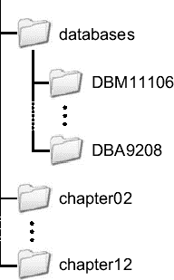

# 解决方案

通过识别 SQL 语句、遇到的等待事件对应的块类型和段，应该能够确定问题的根本原因。让我们讨论一些常见块类型的典型情况。

## 数据块争用

构成表或索引段的所有块（不包括用于存储元数据的块，例如段头）被称为**数据块**。对它们的争用有两个主要原因。第一个原因是给定段上的表或索引扫描频率非常高。第二个原因是执行频率非常高。乍一看，这两者是一样的。为什么它们实际上不同需要一些解释。在第一种情况下，问题是由于低效的执行计划导致对相同块进行频繁的表或索引扫描。通常这是因为低效的关联组合操作（例如，嵌套循环连接）。在这里，即使两三个并发执行的 SQL 语句也可能足以引起争用。而在第二种情况下，问题是多个 SQL 语句同时访问相同的块。换句话说，问题在于针对（少数）块并发执行的 SQL 语句的数量。两者可能同时发生。如果是这种情况，请注意先解决第一个问题，然后再处理第二个问题。实际上，当第一个问题解决后，第二个问题可能会消失。

要解决第一个问题，需要进行 SQL 调优。必须用高效的执行计划替代低效的执行计划。当然，在某些情况下，这说起来容易做起来难。然而，这确实是必须实现的目标。

要解决第二个问题，有几种可用的方法。使用哪种方法取决于 SQL 语句的类型（即 `DELETE, INSERT, SELECT`[¹] 和 `UPDATE`）以及段的类型（即表或索引）。但是，在开始之前，当执行频率很高时，你应该始终问一个问题：真的有必要如此频繁地对相同数据执行那些 SQL 语句吗？实际上，看到应用程序（例如，实现了某种轮询机制）不必要地过于频繁地执行相同的 SQL 语句并不罕见。如果执行频率无法降低，则存在以下可能性。请注意，在所有情况下，目标都是将活动分散到更多的块上以解决问题。

*   如果因 `DELETE, SELECT` 和 `UPDATE` 语句导致表的块出现争用，你应该减少每个块的行数。请注意，这与常见的最佳实践（即让每个块容纳尽可能多的行）相反。为了在每个块中存储更少的行，可以使用更高的 `PCTFREE` 或更小的块大小。
*   如果因 `INSERT` 语句且使用了 freelist 段空间管理而导致表的块出现争用，可以增加 freelists 的数量。实际上，拥有多个 freelists 的目的正是为了将并发的 `INSERT` 语句分散到多个块上。另一种可能性是将段移动到具有自动段空间管理的表空间中。
*   如果因索引块出现争用，有两种可能的解决方案。首先，可以使用 `REVERSE` 选项创建索引。但请注意，如果争用发生在索引的根块上，此方法没有帮助。其次，可以基于索引键的前导列对索引进行哈希分区（这会创建多个根块，因此如果访问单个分区，有助于解决根块争用）。由于全局哈希分区索引仅在 Oracle Database 10*g*及更高版本中可用，因此在 Oracle9*i*中这不是一个选项。

关于反向索引需要注意的重要一点是，不能对它们使用基于范围条件（例如 `BETWEEN, >` 或 `<=`）的限制进行范围扫描。当然，等式谓词是支持的。以下示例基于脚本 `reserve_index.sql`，显示了在使用 `REVERSE` 选项重建索引后，查询优化器不再使用该索引。

```sql
SQL> SELECT * FROM t WHERE n < 10;

--------------------------------------------
| Id  | Operation                   | Name |
--------------------------------------------
| 0   | SELECT STATEMENT            |      |
| 1   |  TABLE ACCESS BY INDEX ROWID| T    |
| 2   |   INDEX RANGE SCAN          | T_I  |
--------------------------------------------

SQL> ALTER INDEX t_i REBUILD REVERSE;

SQL> SELECT * FROM t WHERE n < 10;

----------------------------------
| Id | Operation          | Name |
----------------------------------
|  0 | SELECT STATEMENT   |      |
|  1 |  TABLE ACCESS FULL | T    |
----------------------------------
```

请注意，提示（hints）在这种情况下也没有帮助。数据库引擎根本无法将范围条件与反向索引的索引范围扫描一起应用。因此，如下例所示，如果你试图强制查询优化器使用索引访问，将会使用索引全扫描。

```sql
SQL> SELECT /*+ index(t) */ * FROM t WHERE n < 10;

--------------------------------------------
| Id  | Operation                   | Name |
--------------------------------------------
|   0 | SELECT STATEMENT            |      |
|   1 |  TABLE ACCESS BY INDEX ROWID| T    |
|   2 |   INDEX FULL SCAN           | T_I  |
--------------------------------------------
```

## 段头块争用

每个表和索引段都有一个头块。此块包含以下元数据：关于段高水位线的信息、构成段的范围列表以及关于空闲空间的信息。为了管理空闲空间，头块包含（根据所使用的段空间管理类型）freelists 或包含自动段空间管理信息的块列表。通常，当其内容被多个进程同时修改时，会经历对段头块的争用。请注意，头块在以下情况下会被修改：

*   如果 `INSERT` 语句需要提高高水位线
*   如果 `INSERT` 语句需要分配新的范围
*   如果 `DELETE, INSERT` 和 `UPDATE` 语句需要修改 freelist

针对这些情况的一个可能解决方案是对段进行分区，以便将负载分散到多个段头块上。大多数情况下，这可以通过哈希分区来实现，尽管根据负载和分区键，其他分区方法也可能有效。但是，如果问题是由于第二种或第三种情况引起的，则还存在其他解决方案。对于第二种情况，你应该使用更大的范围。这样，新范围将很少被分配。对于第三种情况（不适用于使用自动段空间管理的表空间），可以通过 freelist 组将 freelists 移动到其他块中。实际上，当使用多个 freelist 组时，freelists 不再位于段头块中（它们分布在由参数 `FREELIST GROUPS` 指定的值所决定的多个块上，因此你将减少对它们的争用——你不仅仅是将争用转移到了另一个地方！）。另一种可能性是使用具有自动段空间管理的表空间来代替 freelist 段空间管理。

[¹]: 有关详细信息，请参见第 12 章。


**注意** 关于 Oracle 数据库引擎，一个经久不衰的迷思是，空闲列表组仅在启用 Real Application Clusters 时才有用。这是`错误的`。空闲列表组在每个数据库中都很有用。我强调这一点，是因为我太多次读到和听到了关于此的错误信息。

## 对撤销头和撤销块的争用

对这类块的争用在两种情况下发生。第一种，且仅针对撤销头块，是当可用的撤销段很少，而大量事务并发提交（或回滚）时。这应该仅在你使用手动撤销管理时才是问题。换句话说，它通常在数据库管理员手动创建了回滚段时发生。要解决此问题，你应该使用自动撤销管理。第二种情况是当多个会话同时修改和查询相同的块时。结果，必须创建大量一致性读块，这要求你访问该块及其关联的撤销块。对于这种情况，除了减少数据块的并发性（从而同时减少对撤销块的争用）外，几乎无能为力。

## 对区间映射块的争用

正如“对段头块的争用”一节所讨论的，段头块包含构成该段的区间列表。如果该列表在段头块中放不下，它就会分布在多个块上：段头块和一个或多个区间映射块。当并发的 `INSERT` 语句必须不断分配新区间时，就会体验到对段头块的争用。要解决此问题，你应该使用更大的区间。

## 对空闲列表块的争用

正如“对段头块的争用”一节所讨论的，空闲列表可以通过空闲列表组被移入其他称为`空闲列表块`的块中。当并发的 `DELETE`、`INSERT` 或 `UPDATE` 语句必须修改空闲列表时，就会体验到对空闲列表块的争用。要解决此问题，你应该增加空闲列表组的数量。另一种可能性是使用具有自动段空间管理的表空间，而不是空闲列表段空间管理。

#### 数据压缩

压缩数据的常见目标是节省磁盘空间。由于我们讨论的是性能，在本节中，我将谈论数据压缩另一个常被遗忘的优势：提高响应时间。

**注意** 数据压缩是仅在企业版中可用的功能。

思路相当简单。如果一条 SQL 语句必须通过全表（或分区）扫描处理大量数据，那么其资源使用分布的主要贡献者很可能与 I/O 操作相关。在这种情况下，减少从磁盘读取的数据量将提高性能。实际上，性能的提升几乎应与压缩因子成比例。下面的示例（基于脚本 `data_compression.sql`）说明了这一点：

```sql
SQL> CREATE TABLE t NOCOMPRESS AS
  2 SELECT rownum AS n, rpad(' ',500,mod(rownum,15)) AS pad
  3 FROM dual
  4 CONNECT BY level <= 2000000;
```

```sql
SQL> execute dbms_stats.gather_table_stats(ownname=>user, tabname=>'t')
```

```sql
SQL> SELECT table_name, blocks FROM user_tables WHERE table_name = 'T';

TABLE_NAME                               BLOCKS
------------------------------ --------------------
T                                         143486
```

```sql
SQL> SELECT count(n) FROM t;

   COUNT(*)
-----------
    2000000

Elapsed: 00:00:12.68
```

```sql
SQL> ALTER TABLE t MOVE COMPRESS;
```

```sql
SQL> execute dbms_stats.gather_table_stats(ownname=>user, tabname=>'t')
```

```sql
SQL> SELECT table_name, blocks FROM user_tables WHERE table_name = 'T';

TABLE_NAME                               BLOCKS
------------------------------ --------------------
T                                          27274
```

```sql
SQL> SELECT count(n) FROM t;

   COUNT(*)
-----------
    2000000

Elapsed: 00:00:02.76
```

```sql
SQL> SELECT 143486/27274, 12.68/2.76 FROM dual;

143486/27274   12.68/2.76
------------ -------------
  5.26090782    4.5942029
```

要像示例中那样，为全表扫描操作利用数据压缩优势，拥有备用的 CPU 资源至关重要。这不是因为“解压缩”块的 CPU 开销（它非常小；它们不是使用类似 zip 的算法压缩的），而仅仅是因为 SQL 引擎执行的操作（在上一个示例中，访问块并执行 `count`）在更短的时间段内完成。例如，在我的测试系统上，执行测试查询时的 CPU 利用率在未压缩时约为 7%，在压缩后约为 11%。

要使用数据压缩，必须满足以下要求：
*   表不能超过 255 列。
*   创建表时不能使用参数 `rowdependencies`。

需要注意的是，尽管数据压缩确实有一些优点，但它也有几个缺点。最显著的一点是，直到 Oracle Database 10*g*，数据库引擎仅在通过直接路径接口插入数据时才压缩数据块。因此，它只会在以下操作中压缩数据块：
*   `CREATE TABLE ... COMPRESS ... AS SELECT ...`
*   `ALTER TABLE ... MOVE COMPRESS`
*   `INSERT /*+ append */ INTO ... SELECT ...`
*   `INSERT /*+ parallel(...) */ INTO ... SELECT ...`
*   使用 OCI 直接路径接口的应用程序执行的加载（例如，SQL*Loader 实用程序）

结果是，通过常规 `INSERT` 语句插入的数据会被插入到未压缩的块中。另一个缺点是，`UPDATE` 语句不仅通常会导致行迁移并存储在未压缩的块中，而且 `DELETE` 语句在压缩块中造成的空闲空间永远不会被重用。由于这些原因，我建议仅在（主要）只读的段上使用数据压缩。例如，在存储长期历史记录的分区表中，如果只有最后几个分区被修改，那么压缩那些（主要）只读的分区可能是有用的。数据仓库和完全刷新的物化视图也是数据压缩的良好候选对象。

自 Oracle Database 11*g* 起，提供以下两种压缩方法：
`compress for direct_load operations`：此方法等同于 Oracle Database 10*g* 之前使用的压缩方法（即等同于指定 `compress`）。
`compress for all operations`：此方法部分克服了前一种方法的一些限制。但是，需要高级压缩选项。

由于新的压缩方法是动态的（数据可能不是在插入时压缩，而是在存储它的块稍后被修改时压缩），因此很难给出关于其使用的建议。实际上，在仍然有几种情况下，新压缩方法并不比旧方法好。为了弄清楚新压缩方法是否能够正确处理非（主要）只读的数据，我强烈建议你使用预期的负载仔细测试它。

[1.] `SELECT` 语句在两种情况下修改块：第一种，当指定了 `FOR UPDATE` 选项时；第二种，当发生延迟块清理时。

## 第五部分
附录


### 附录 A
#### 可下载文件

本附录列出了全书用到的所有文件。同时，它还描述了测试环境，这一点很重要，因为某些脚本只有在特定配置下才能正确运行。

### 测试环境

我的测试服务器是一台 Dell PowerEdge 1900，配备了一个四核至强处理器（`E5320`, `1.86GHz`）、`4GB` 内存、两个用于操作系统和所有其他应用的镜像 SATA 磁盘（Samsung Spinpoint, `300GB`, `7,200rpm`），以及四个用于数据库文件的条带化 SAS 磁盘（Seagate Cheetah, `73GB`, `15,000rpm`）。该服务器通过千兆网络和交换机连接到我的工作站和其他测试客户端。

操作系统是 CentOS¹ `4.4 x86_64`。安装了以下版本的 Oracle 数据库引擎（实际上，这是该平台目前所有可用的版本）：

*   `Oracle9i Release 2`: `9.2.0.4`, `9.2.0.6`, `9.2.0.7`, `9.2.0.8`
*   `Oracle Database 10g Release 1`: `10.1.0.3`, `10.1.0.4`, `10.1.0.5`
*   `Oracle Database 10g Release 2`: `10.2.0.1`, `10.2.0.2`, `10.2.0.3`, `10.2.0.4`
*   `Oracle Database 11g Release 1`: `11.1.0.6`

对于每个版本，我安装了两个数据库：不含选项的企业版和包含所有选项的企业版。

#### 可下载文件

图 A-1 展示了您可以从 [`top.antognini.ch`](http://top.antognini.ch) 下载的发行文件的结构。对于每一章（第 1 章除外），都有一个包含相关文件的目录。此外，对于每个数据库，都有一个包含我用来构建它的文件的目录。



**图 A-1.** 发行文件的目录结构

### 数据库

脚本是使用 Database Configuration Assistant 生成的。对于所有数据库，只设置了与数据库名称、文件位置和内存使用相关的初始化参数。所有其他初始化参数均保留为默认值。唯一的例外是初始化参数 `remote_os_authent`，它被设置为 `TRUE`。请注意，除了在“沙盒”（一个没有价值且不包含任何重要数据的系统）中，您绝不应在数据库中使用此值。

数据库的名称定义了安装的类型。例如，图 A-1 中显示的两个数据库的名称意味着以下内容：

*   `DBM11106`：不含选项（`M` 代表“最小化”）的 `11.1.0.6` 版本数据库。
*   `DBA9208`：包含所有选项（`A` 代表“全部”）的 `9.2.0.8` 版本数据库。

每个脚本都已在所有数据库上测试过。如果某个特定脚本在某个数据库中不起作用，脚本的头部会注明这种情况。

## 第 2 章

表 A-1 中列出的文件可供第 2 章下载。

**表 A-1.** 第 2 章文件

| **文件名** | **描述** |
| --- | --- |
| `bind_variables.sql` | 此脚本展示绑定变量如何以及何时导致游标共享。 |
| `bind_variables_peeking.sql` | 此脚本展示绑定变量窥视的优缺点。 |
| `selectivity.sql` | 此脚本提供“定义选择性”一节中展示的示例。 |
| `sharable_cursors.sql` | 此脚本展示无法共享的父游标和子游标的示例。 |

## 第 3 章

表 A-2 中列出的文件可供第 3 章下载。

**表 A-2.** 第 3 章文件

| **文件名** | **描述** |
| --- | --- |
| `DBM11106_ora_6334.trc` | 这是用作解释 TKPROF 和 TVD$XTAT 输出基础的示例跟踪文件。 |
| `DBM11106_ora_6334.txt` | 这是跟踪文件 `DBM11106_ora_9813.trc` 的 TKPROF 输出，用作解释 TKPROF 生成文件格式的基础。 |
| `DBM11106_ora_6334.html` | 这是跟踪文件 `DBM11106_ora_9813.trc` 的 TVD$XTAT 输出，用作解释 TVD$XTAT 生成文件格式的基础。 |
| `dbm10203_ora_24433.trc` | 这是图 3-19 中描述的示例跟踪文件。它显示了关于由单个会话生成的多个部分的信息如何存储。 |
| `dbm10203_s000_24374.trc` | 这是图 3-19 中展示的示例跟踪文件。它显示了关于通过共享服务器连接的三个会话的信息如何存储。 |
| `dbms_profiler.sql` | 此脚本展示如何对 PL/SQL 进行性能分析以及如何显示生成的信息。 |
| `dbms_profiler_triggers.sql` | 您可以使用此脚本创建两个触发器来启用和禁用 PL/SQL 性能分析器。 |
| `LoggingPerf.java` | 您可以使用这个 Java 类来比较 log4j 类 `Logger` 的 `info` 和 `isInfoEnabled` 方法的平均执行时间。 |
| `makefile.mk` | 这是我用来编译示例中给出的 C 程序的 makefile。 |
| `map_session_to_tracefile.sql` | 您可以使用此脚本将会话 ID 映射到跟踪文件。 |
| `perfect_triangles.sql` | 您可以使用此脚本创建 PL/SQL 过程 `perfect_triangles`，该过程在“收集性能分析数据”一节中用作示例。 |
| `session_attributes.c` | 这个 C 程序展示了如何通过 OCI 设置客户端标识符、客户端信息、模块名和操作名。 |
| `SessionAttributes.cs` | 这个 C# 类展示了如何通过 ODP.NET 设置客户端标识符。 |
| `SessionAttributes.java` | 这个 Java 类展示了如何通过 JDBC 设置客户端标识符、模块名和操作名。 |
| `trcsess.awk` | 您可以使用此 awk 脚本使使用 Oracle9*i* 生成的 SQL 跟踪文件与命令行工具 `trcsess` 兼容。 |

## 第 4 章

表 A-3 中列出的文件可供第 4 章下载。

**表 A-3.** 第 4 章文件


