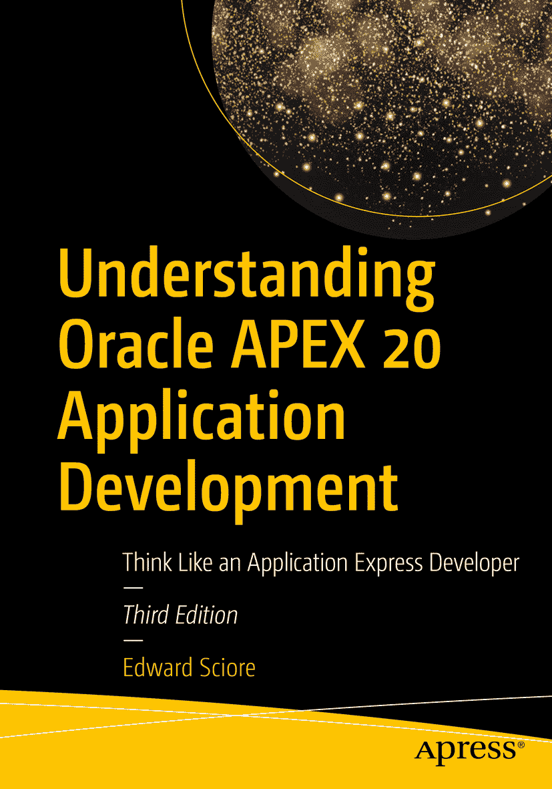

ISBN 978-1-4842-6164-4 电子书 ISBN 978-1-4842-6165-1 [`doi.org/10.1007/978-1-4842-6165-1`](https://doi.org/10.1007/978-1-4842-6165-1) © Edward Sciore 2020

本作品受版权保护。出版者保留所有权利，无论涉及材料的全部或部分，具体包括翻译权、转载权、插图重用权、朗诵权、广播权、缩微胶片或其他任何物理方式的复制权，以及信息传输或存储与检索、电子改编、计算机软件，或任何目前已知或今后开发的类似或相异的方法。本出版物中使用的通用描述性名称、注册商标、服务标志等，即使未作特别说明，也不意味着这些名称不受相关保护性法律法规的约束而可自由通用。出版者、作者和编辑可安全地假设本书中的建议和信息在出版时是真实准确的。出版者、作者或编辑均不对本作品所含材料或任何可能存在的错误或遗漏提供明示或暗示的保证。出版者对于出版地图中的管辖权主张以及机构从属关系保持中立。本书通过 Springer Science+Business Media New York（地址：233 Spring Street, 6th Floor, New York, NY 10013）向全球图书贸易发行。电话：1-800-SPRINGER，传真：(201) 348-4505，电子邮件：orders-ny@springer-sbm.com，或访问网站：www.springeronline.com。Apress Media, LLC 是一家位于加利福尼亚州的有限责任公司，其唯一成员（所有者）是 Springer Science + Business Media Finance Inc (SSBM Finance Inc)。SSBM Finance Inc 是特拉华州的一家公司。

*献给我的父母，感谢他们多年来坚定不移的爱与支持。*

