# 1. SQL 工作坊

恭喜！你即将开始学习如何构建 APEX Web 应用程序。但在开始之前，你需要一个 APEX 账户。获取账户的方式有几种：你可以通过 `apex.oracle.com` 网站注册一个免费账户；你可能会在工作中被分配到一个 APEX 服务器的账户；或者你甚至可以自己安装一个 APEX 服务器并为其创建你自己的账户。

无论哪种情况，你的 APEX 服务器都会有一个关联的 URL。在浏览器中访问该 URL 会带你进入登录界面。图 1-1 显示了 `apex.oracle.com` 服务器使用的登录界面。

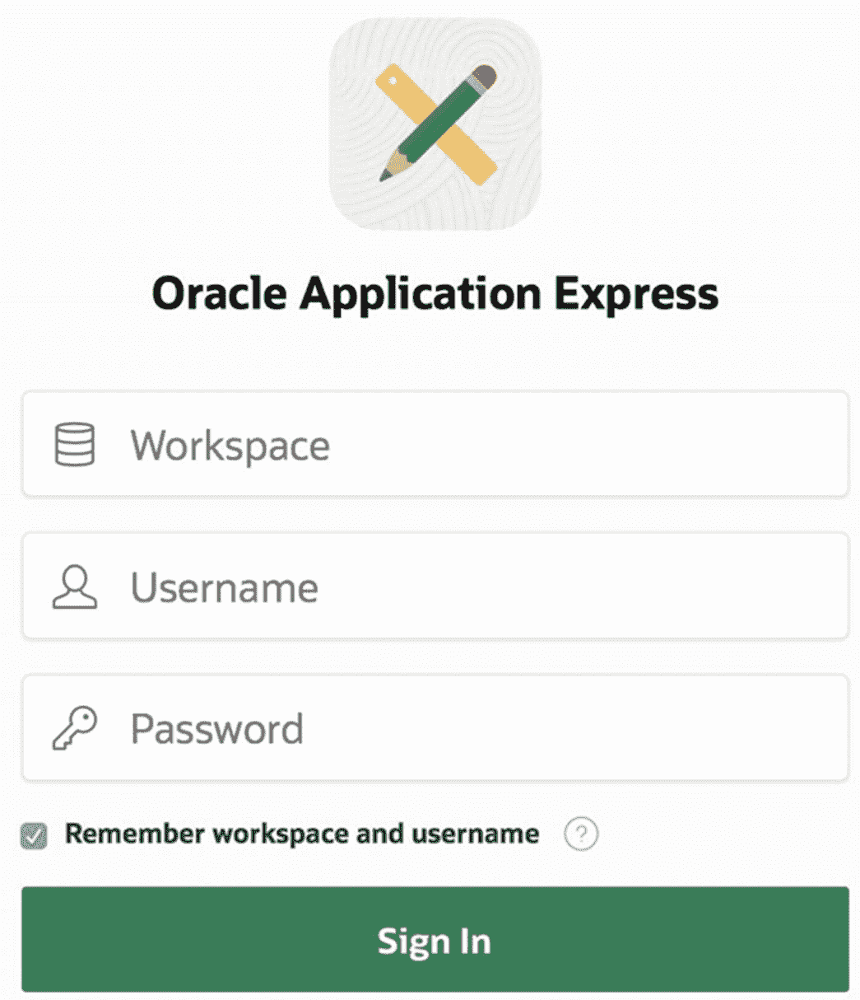

图 1-1

APEX 登录界面

输入你的凭证后，你将进入 APEX 主屏幕，其顶部如图 1-2 所示。

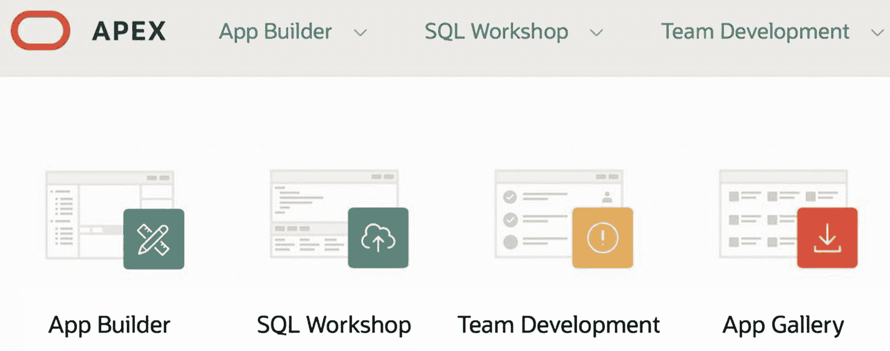

图 1-2

APEX 主屏幕

APEX 开发环境包含多种工具。其中最重要的是 `App Builder` 工具，这将从第 2 章开始深入介绍。我们在这里首先了解 APEX `SQL 工作坊` 中的两个工具：`对象浏览器` 和 `SQL 命令` 工具。这些工具允许你直接访问数据库——`对象浏览器` 让你通过图形用户界面进行操作，而 `SQL 命令` 工具让你执行 SQL 语句和 PL/SQL 代码块。

虽然 `SQL 工作坊` 工具对于应用程序开发并非必不可少，但使用它们可以让你的工作轻松许多。以下是它们能提供帮助的五个方面：

*   `对象浏览器` 可以帮你回想数据库对象及其结构。例如，一个典型的应用程序涉及多个表，每个表又可能有众多的列。要记住每个表的详细信息通常是不切实际的。当构建一个引用某个表的页面时，你可以使用这些工具来帮助你刷新记忆。
*   用于修改数据库结构。例如，这些工具是执行导言中提到的 `alter table` 命令的最简单方法。
*   用于修改数据库内容。例如，你可能需要插入或修改记录，以测试页面在新数据或修改后数据下的行为，或者在测试页面后重置数据库。
*   用于检查数据库表的内容。运行页面后，你可以验证数据库是否已正确更新。
*   用于调试 SQL 语句或 PL/SQL 代码块。通过先在 `SQL 命令` 工具中执行代码，你可以在实际将其赋值为页面上某个属性的值之前，验证它是否产生了预期的结果。

要进入 `SQL 工作坊`，请在 APEX 主屏幕上点击 `SQL 工作坊` 按钮。图 1-3 显示了结果屏幕。从这个屏幕，你可以点击 `对象浏览器` 或 `SQL 命令` 按钮进入所需的工具。

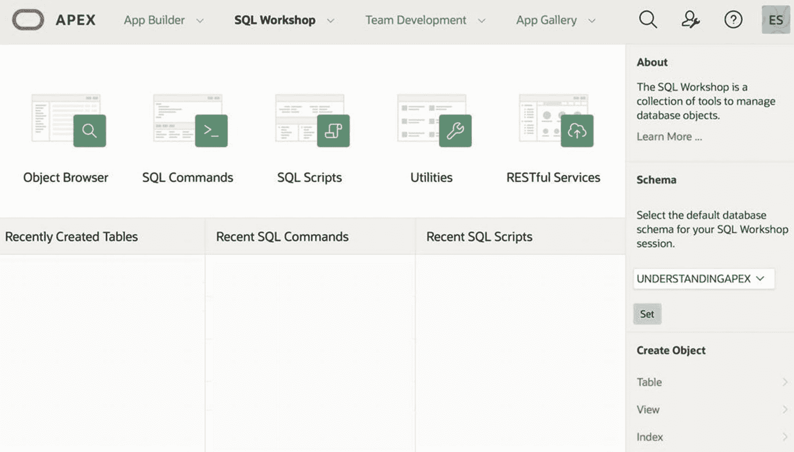

图 1-3

SQL 工作坊主屏幕

## 下载数据表

本书会频繁使用示例表 `EMP` 和 `DEPT`。如果你的工作区中没有这些表，以下是加载它们的方法。点击 `SQL 工作坊` 选项卡旁边的箭头，选择 `实用工具`，然后选择 `示例数据集`；参见图 1-4。图 1-5 显示了结果屏幕，其中列出了可用的数据表。点击 `EMP/DEPT` 数据集的 `安装` 按钮，并按照指示操作。

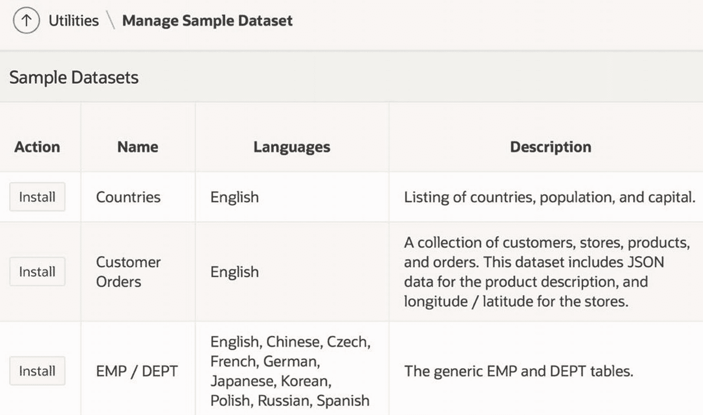

图 1-5

示例数据集屏幕

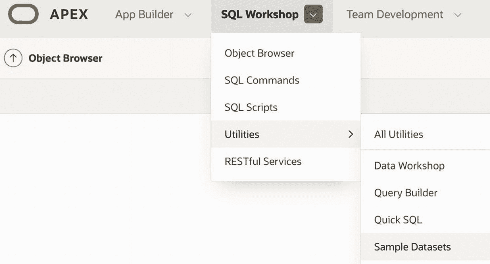

图 1-4

进入示例数据集

要验证这些表是否已安装，请返回到 `SQL 工作坊` 主屏幕（如图 1-3 所示）。`EMP` 和 `DEPT` 的条目现在应出现在 `最近创建的表` 区域。

## 对象浏览器

`对象浏览器` 让你能够快速轻松地与你的表进行交互。通过它，你可以查看每个表的描述——即其列的类型和属性，以及其约束、索引和触发器——以及其内容。你也可以使用 `对象浏览器` 对表的描述或内容进行简单的更改。

`对象浏览器` 的主屏幕在其左侧显示一个表名列表。点击一个表名会显示有关该表的信息。例如，`EMP` 表的屏幕如图 1-6 所示。

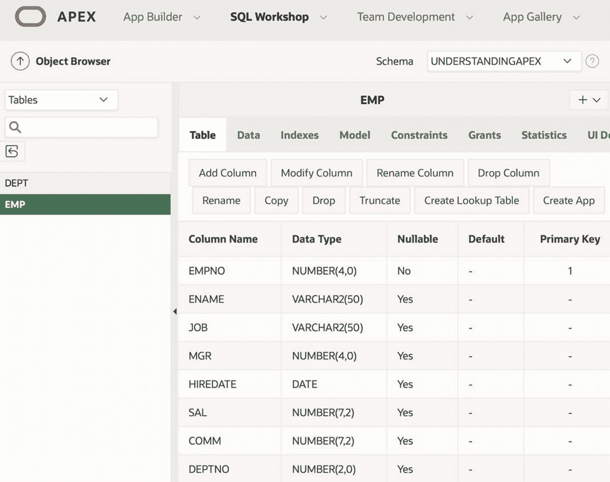

图 1-6

在对象浏览器中查看 EMP 表

屏幕的主要部分显示有关表的每一列的信息。在此信息上方是一系列按钮，允许你修改它。举个例子，回想一下导言中讨论的添加 `Offsite` 列的必要性；现在让我们将该列添加到表中。点击 `添加列` 按钮会显示一个表单，供你填写新列的详细信息。图 1-7 显示了我如何填写此表单。

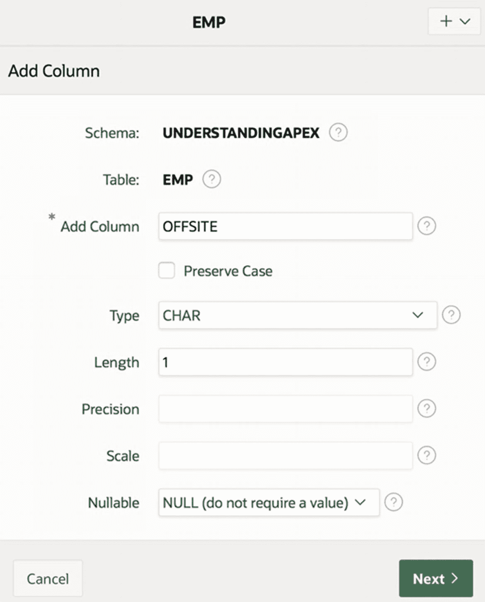

图 1-7

向 EMP 添加新列

点击 `下一步` 按钮会带你进入确认屏幕；从那里，点击 `完成` 以完成操作。`EMP` 屏幕现在应该显示新列。

回到图 1-6，观察修改按钮行上方的标签栏。当前选中了 `表` 标签，它显示表的列信息。其他标签向你显示其他类型的信息，并提供查看和修改该信息的适当方式。例如，点击 `索引` 标签会显示该表的当前索引。图 1-8 显示了 `EMP` 的三个索引。点击索引的名称会显示该索引的更多详细信息。

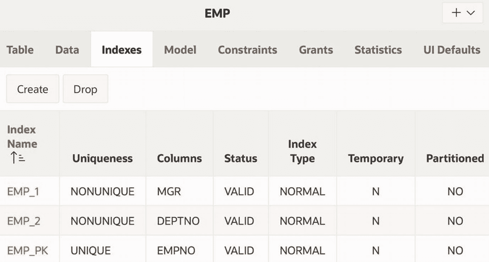

图 1-8

浏览 EMP 的索引

最后，考虑 `数据` 标签，它显示表的内容。该表的顶部如图 1-9 所示。注意，有一个用于插入新行的按钮，并且在每行的开头都有一个编辑链接。

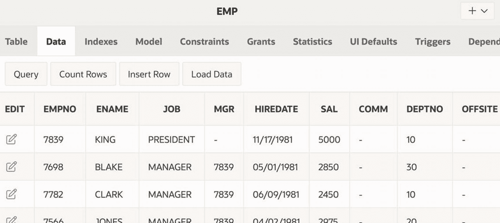

图 1-9

查看 EMP 的内容

点击某行的编辑链接会显示一个用于修改它的表单。图 1-10 显示了员工 7698 的此表单。点击 `应用更改` 按钮会执行对列值所做的任何修改；点击 `删除` 按钮则会删除该记录。

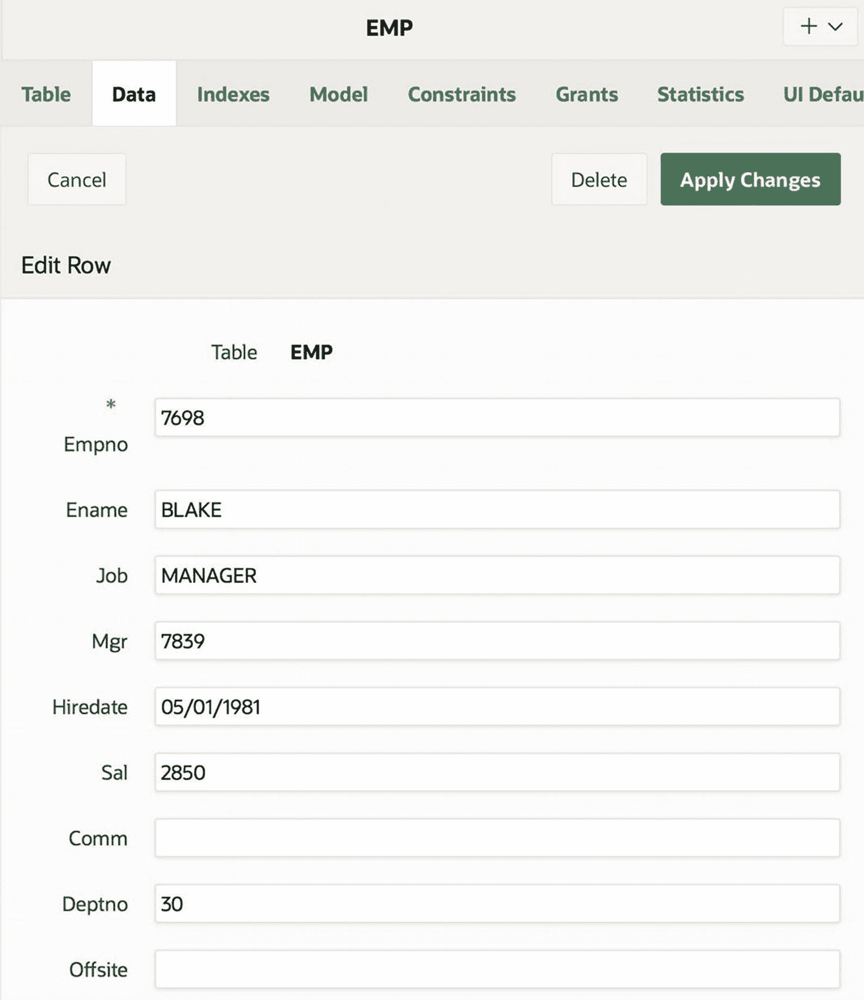

图 1-10

编辑员工 7698 的内容

如果你愿意，可以编辑此记录，将 `Offsite` 的值设置为 `N`。然后你可以继续编辑其他记录，根据需要将它们的列值设置为 `Y` 或 `N`。然而，考虑到这种方法的繁琐性，使用 `SQL 命令` 工具会更容易，这将在下一节讨论。


## SQL 命令工具

你在对象浏览器中可以执行的大多数操作都对应着一条或多条 SQL 语句。实际上，对象浏览器只是一种用于编写和执行较简单 SQL 语句的便捷方式。如果你想要执行更复杂的活动，请使用 SQL 命令工具。

SQL 命令工具将屏幕分为两部分。你可以在顶部区域输入 SQL 语句或 PL/SQL 块，结果则显示在底部。图 1-11 展示了执行 SQL 语句 `select * from EMP` 后的屏幕。

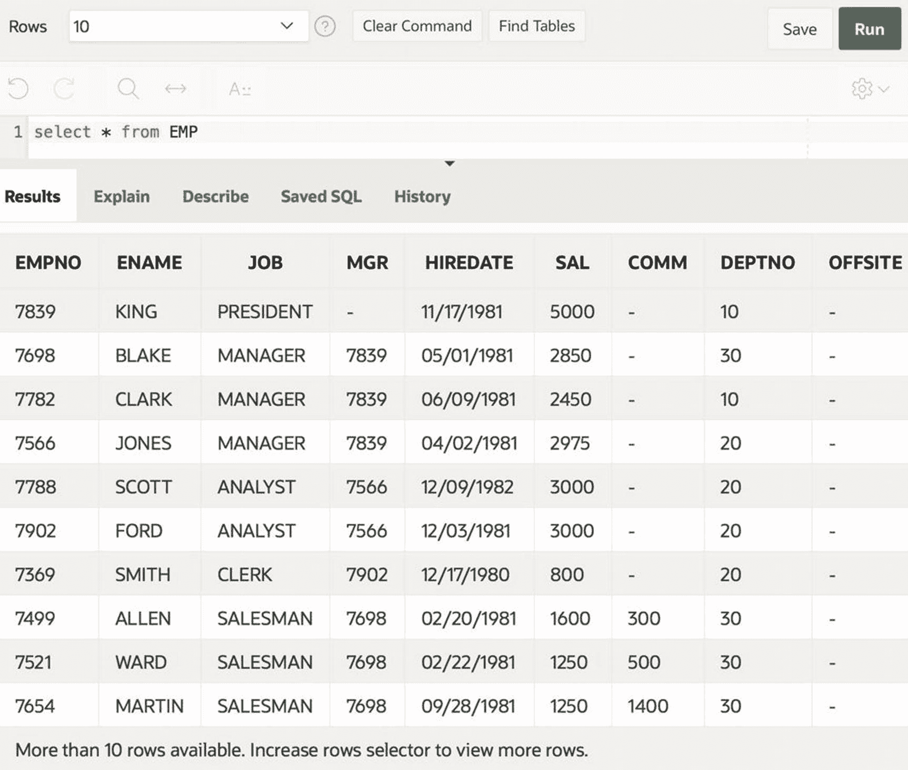
图 1-11

使用 SQL 命令工具

APEX 仅显示了 14 条员工记录中的 10 条。原因在于图中顶部标记为 `行` 的选择列表，其值指定了要显示的最大行数。默认情况下，该值设置为 10；如果你希望显示更多行，必须先选择一个更大的数字。这个特性是故意设计的。通过强制你显式指定查询的输出规模，APEX 保护你免受自身失误的影响。例如，假设你执行一个多表查询，却忘了包含连接条件。产生的输出可能轻易达到数十亿条记录，如果不加以截断，将导致你的 APEX 会话无法使用。

该选择列表右侧是一个 `查找表` 按钮，当你需要提醒自己有哪些表及其列时，这个按钮很有用。点击此按钮会显示一个类似于对象浏览器的窗口。你可以滚动浏览可用的表；选择一个表会显示其列信息。图 1-12 显示了使用 `表查找器` 窗口显示 `DEPT` 表列的结果。

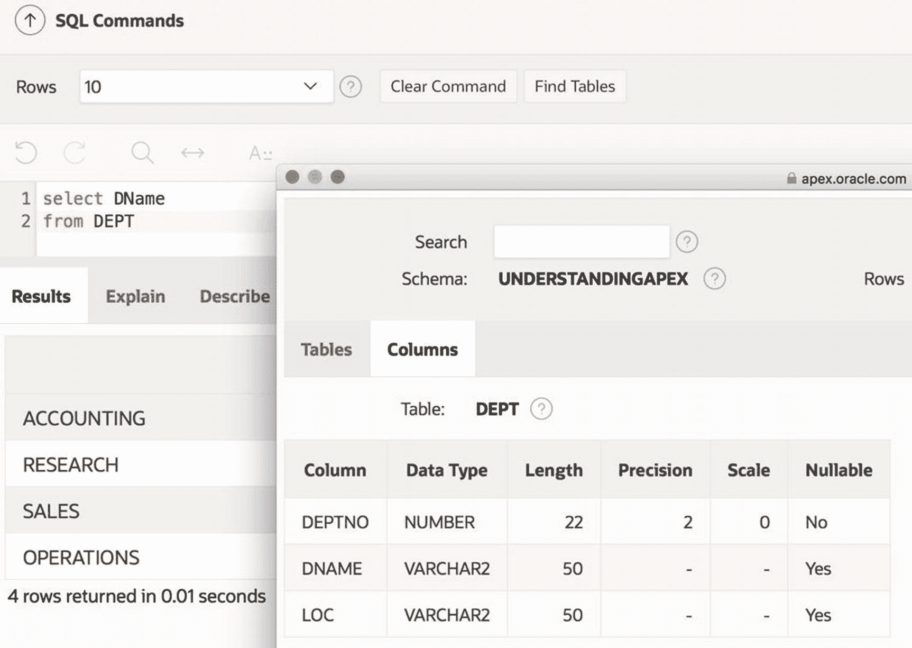
图 1-12

使用表查找器窗口

你可能已经从图 1-11 注意到，`EMP` 记录仍然没有 `出差` 字段的值。在介绍中，我提到除了 `SCOTT`、`ALLEN`、`WARD` 和 `TURNER`，所有员工都在现场工作。处理这个问题的简便方法是执行两条更新命令：第一条将每个人的 `出差` 值设置为 `N`，第二条将选定的四条记录设置为 `Y`。你可以在命令工具中单独运行每条语句，也可以将它们合并成一个 PL/SQL 块来执行。后一种选项的代码如代码清单 1-1 所示。

```
begin
update EMP
set OffSite = 'N';
update EMP
set OffSite = 'Y'
where EName in ('SCOTT', 'ALLEN', 'WARD', 'TURNER');
end;
```
代码清单 1-1：用于分配出差值的 PL/SQL 块

## 总结

本章探讨了 APEX SQL 工作坊中的对象浏览器和 SQL 命令工具。这两种工具都允许你查看和修改数据库，但通过的是截然不同的界面。对象浏览器提供了一个可视化界面，你通过点击按钮和填写表单来执行任务。SQL 命令工具则提供了一个基于命令的界面，你通过执行 SQL 语句来执行任务。

对象浏览器非常适合执行常见和简单的任务。顾名思义，对象浏览器也非常适合探索数据库。点击式的界面使得发现数据库中的各种表并探索其列变得很容易。对象浏览器也不要求用户熟悉 SQL，因此特别适合临时用户。

而 SQL 命令工具则假设用户既熟悉数据库结构又精通 SQL。因此，该命令工具适合有经验的数据库用户。如果你了解相应的 SQL，那么从 SQL 命令工具执行许多任务会比从对象浏览器容易得多。

