# 2. 应用程序与页面

本章开始介绍 APEX 应用程序构建器。你将学习创建应用程序和页面的基本工具——特别是“创建应用程序”向导和“创建页面”向导——并使用它们来构建一个可以从任何浏览器运行的多页面应用程序。你还将看到如何使用 APEX 页面设计器来修改应用程序中页面的属性。虽然这些页面目前没有实质内容，但本章介绍的技术为后续章节的内容创建技术提供了基础。

## 创建应用程序

### 访问应用构建器

要使用应用构建器，您需要进入其主屏幕。图 1-2 展示了两种方法：您可以点击 APEX 菜单栏中的 `App Builder` 选项卡，也可以点击 APEX 主屏幕上的大型 `App Builder` 按钮。两种方式都会带您进入如图 2-1 所示的屏幕。

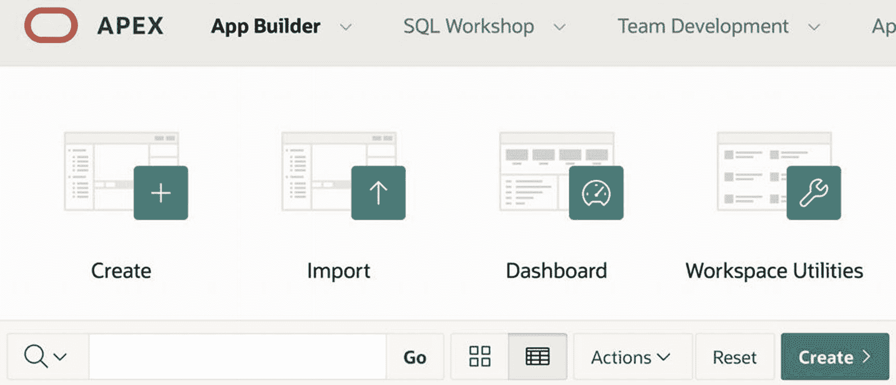

*图 2-1：应用构建器主屏幕*

### 创建新应用程序

图 2-1 显示了可用于创建新应用程序的两个按钮：左上角的大型 `Create` 按钮，以及搜索栏最右侧的较小绿色 `Create` 按钮。点击任一按钮都会打开 `创建应用程序` 向导。

### 选择应用程序类型

向导的第一个屏幕如图 2-2 所示。它要求您选择一个应用程序类型。您正在创建一个新应用程序，因此点击 `新建应用程序`。中间的按钮允许您从现有的电子表格（或类似）文件创建应用程序，而最右侧的按钮则允许您从 APEX 应用程序库中导入预先构建好的应用程序。在您熟悉 APEX 之后，可以探索应用程序库。它包含许多有趣的应用程序——有些为典型的数据库任务提供了解决方案，另一些则展示了 APEX 的高级功能。

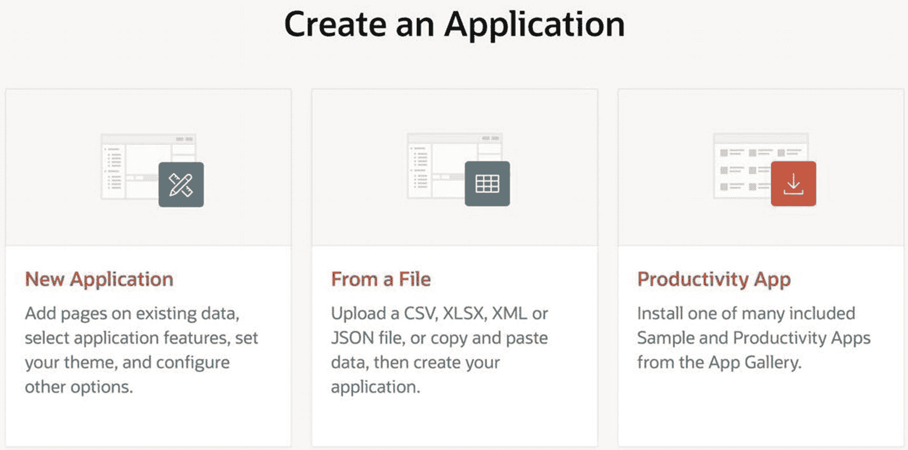

*图 2-2：创建应用程序向导的第一个屏幕*

### 配置应用程序详细信息

向导的第二个屏幕如图 2-3 所示。您应在页面左上角的文本字段中输入所需应用程序的名称；我选择了 `员工演示`。页面其余部分显示了应用程序的默认配置，并邀请您进行自定义。例如，`外观` 属性声明新应用程序将使用 `Vita` 主题，并在左侧显示其导航菜单。如果您愿意，可以通过点击右侧的“设置外观”按钮来更改此外观。将出现一个屏幕，向您展示其他可供选择的主题，并允许您更改导航菜单的位置。您还可以选择应用构建器用来标识您的应用程序的图标。

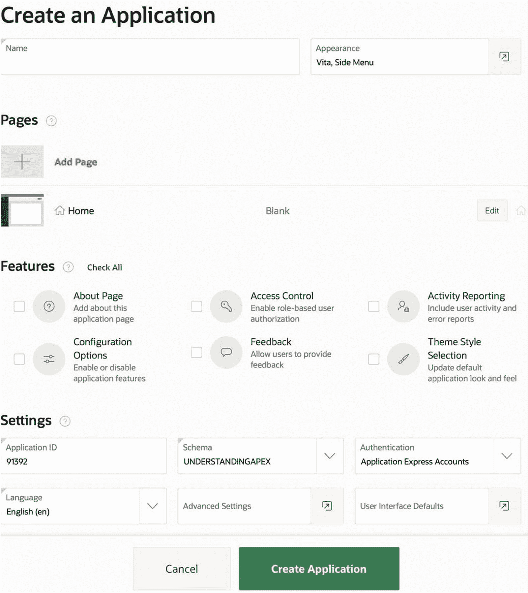

*图 2-3：创建应用程序向导的第二个屏幕*

### 配置页面、功能和设置

屏幕的 `页面` 部分声明新应用程序将包含一个名为 `Home` 的空白页面。您可以通过点击 `编辑` 按钮来编辑该页面，也可以添加其他页面。尽管此功能对于有经验的开发者可能很有用，但并非必需——您可以在应用程序创建后轻松地添加和编辑页面。保持默认页面不变是最简单的。

`功能` 部分允许您指定典型网站共有的几个有用功能。这些功能可以在以后添加，因此现在无需指定。

`设置` 部分包含一些其他设置。`应用程序 ID` 值由向导分配，并在 APEX 服务器上唯一标识您的应用程序。我的 `员工演示` 应用程序被分配了编号 91392；您的将会不同。这里另一个值得一提的属性是 `认证`。此属性的值决定了人们如何登录到您的应用程序。默认值为 `Application Express 账户`，这将仅允许在您工作区拥有账户的用户登录。另一个选项是 `数据库`，这将只允许底层数据库的用户登录。目前，请保持默认设置。第 13 章在探讨各种认证选项时，将重新审视这个选择。

### 完成创建

当您准备好让 APEX 创建您的应用程序时，点击绿色的 `创建应用程序` 按钮。您将被带回应用构建器主屏幕，该屏幕现在应该会显示您应用程序的一个条目。图 2-4 显示了我创建 `员工演示` 后的该屏幕。通常，应用构建器主屏幕包含您创建的每个应用程序的条目。这些条目既可以显示为报表中的行（如图 2-4 所示），也可以显示为图标。查看图 2-4 中 `Go` 按钮右侧的两个切换按钮。最左侧的切换按钮以图标形式显示条目，最右侧的则以报表形式显示它们。请试试看。

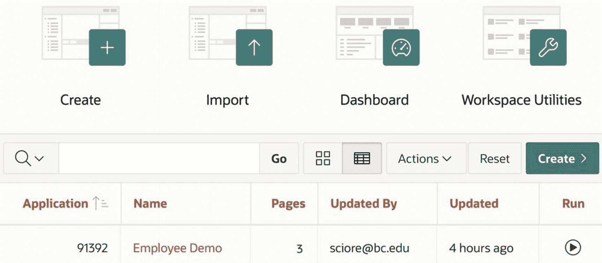

*图 2-4：更新后的应用构建器主屏幕*

### 编辑应用程序属性

点击应用程序条目的名称将带你进入该应用程序的主屏幕，其中包含该应用程序每个页面的条目。例如，我的应用程序的初始主屏幕如图 2-5 所示。该屏幕包含三个页面的条目：一个全局页面、一个主页和一个登录页面。请注意，图中的条目显示为图标。也可以使用与图 2-4 中相同的切换按钮，将它们显示为报告中的行。

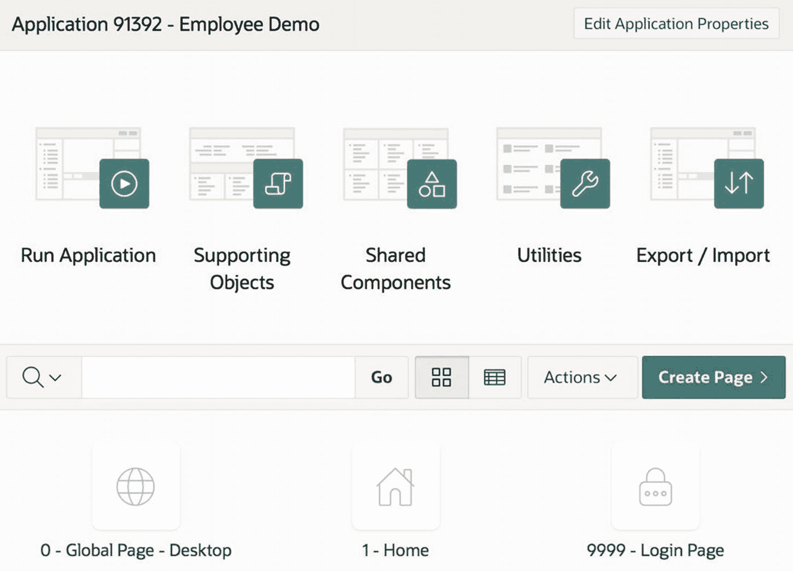

**图 2-5**

**新创建的应用程序主屏幕**

每个应用程序都有许多可定制的属性。点击主屏幕右上角的`Edit Application Properties`按钮，会显示一个属性屏幕，其顶部如图 2-6 所示。

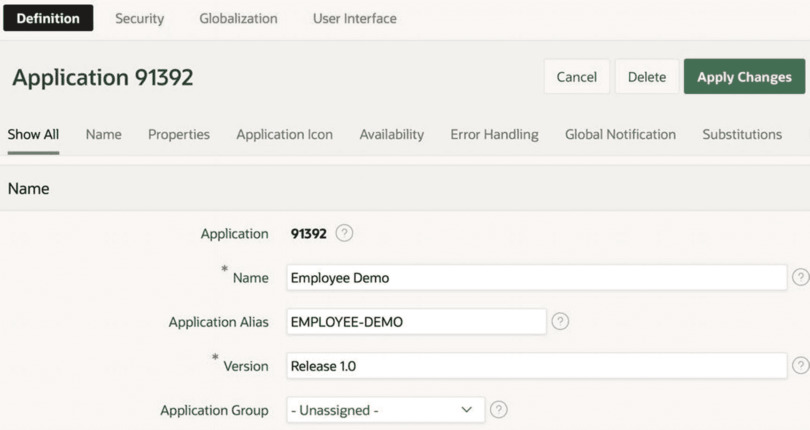

**图 2-6**

**编辑应用程序的属性**

该屏幕为了便于管理，将应用程序的属性组织成`sections`。图 2-6 显示了`Name`部分及其五个属性。第一个属性`Application`保存分配给该应用程序的 ID，且不可修改。其他属性是可修改的；只需在文本框中键入所需值（或者在`Application Group`的情况下从下拉列表中选择一个值），然后点击`Apply Changes`按钮。对我们来说，唯一有趣的属性是`Name`，它允许你更改应用程序名称。

某些属性的标签包含一个红色星号。该星号意味着该属性必须具有非空值。

每个属性的右侧都有一个小问号图标。点击该图标会显示该属性的帮助文本，当某个属性你不熟悉并且想要了解其用途时，这尤其有用。作为一个实验，点击`Name`部分中每个属性的帮助图标，看看它们的用途是否符合你的预期。

再看图 2-6，注意`Name`部分上方的标签行。第一个标签为`Show All`，并且当前被选中；其他标签则按部分名称标注。`Show All`标签在一个屏幕上显示所有部分的属性。点击某个部分标签会显示该部分的属性。再次强调，点击每个部分属性的帮助图标是一个有用的练习，哪怕只是为了了解可以进行何种自定义。大多数属性可能看起来晦涩难懂，因为你还没有深入研究 APEX。当然，目前（除了`Name`之外）它们都不怎么有趣。

你的应用程序还有更多属性。看图 2-6 顶部的四个链接，分别标记为`Definition`、`Security`、`Globalization`和`User Interface`。注意`Definition`是被选中的，这意味着你到目前为止只看到了定义属性。点击其他三个链接可以快速查看其他属性。安全属性管理各种安全限制，是第 13 章的主题。全球化属性允许你修改时间/日期设置。用户界面属性则管理某些页面显示问题。这里，`Logo`部分很有趣——它可以让你管理出现在应用程序每个页面左上角的 logo。默认情况下，logo 是应用程序的名称，但你可以指定任何想要的文本甚至图像。例如，你可能已经注意到 APEX 屏幕都有一个基于图像的 Oracle logo。我们将在第 3 章回到`Logo`属性。

### 删除应用程序

有两种方法可以删除应用程序。应用程序主屏幕的右侧包含一个名为`Delete This Application`的任务；点击该链接即可执行删除操作。或者，在应用程序的全局属性屏幕（参见图 2-6）上，你可以点击`Apply Changes`按钮左侧的`Delete`按钮；该按钮在显示`Definition`属性时出现。

### 运行应用程序页面

Web 应用程序是 Web 页面的集合。通过`running a page`，你是在请求 APEX 在你的浏览器中呈现它。术语`running an application`是运行其主页的简写。有两种方法可以运行一个页面：从 APEX 内部（作为开发者）和从 APEX 外部（作为用户）。接下来的章节将分别考虑这两种方式。

#### 在 APEX 中运行页面

在 APEX 中运行应用程序最简单的方法是点击应用程序主页左上角的大号 `Run Application` 按钮（参考图 2-5）。或者，你可以转到应用程序构建器主页中该应用程序的条目（图 2-4）并点击其 `Run` 按钮。

要运行应用程序的任意页面，你必须为该页面打开页面设计器。（页面设计器将在本章后面讨论，你可以在图 2-12 中找到其截图。）点击设计器右上角的绿色箭头按钮来运行该页面。

无论你以哪种方式运行新创建的应用程序，你都会发现应用程序会要求你输入姓名和密码，如图 2-7 所示。这是你在创建应用程序时指定的授权方案的结果。回想一下，你指定了通过 `Application Express Accounts` 进行授权，这意味着只有拥有应用程序工作区账户的人才能运行该应用程序。换句话说，图 2-7 的窗口向你询问的是与你登录 APEX 所使用的相同用户名/密码。

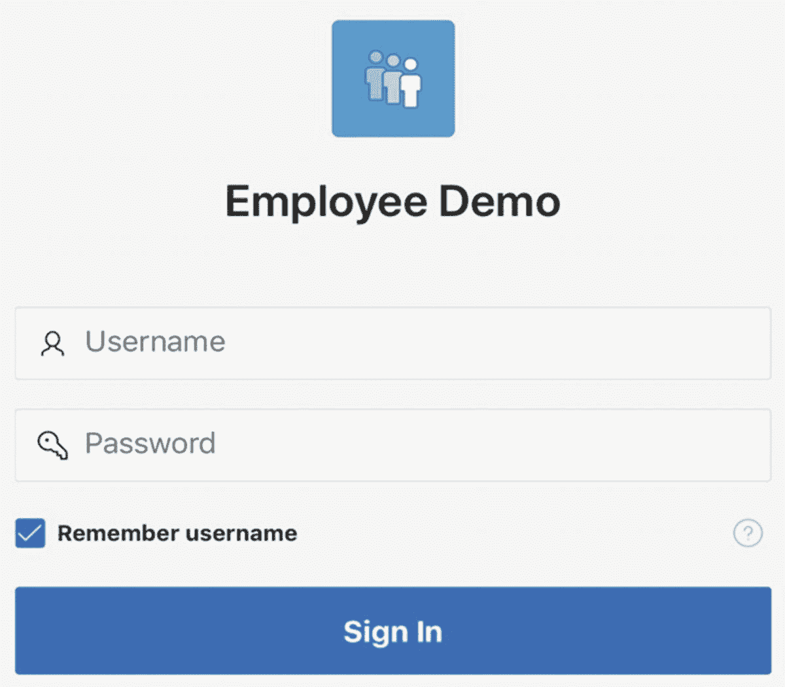
图 2-7
登录到你的应用程序

如果你是工作区的管理员（当你注册 `apex.oracle.com` 账户时就会发生），那么你很可能是该工作区中唯一拥有账户的人。如果你希望其他人能够使用你的应用程序，那么你有两个选择：你可以在你的工作区中创建额外的账户，或者你可以使用另一种身份验证方法。这些选项将在第 13 章中讨论。

成功登录后，APEX 将显示请求的页面。图 2-8 显示了你应用程序的主页及其当前状态。*导航栏* 沿着顶部运行。其左侧是徽标，默认情况下是应用程序的名称。其右侧是你的用户名；点击它可以注销。*导航菜单* 沿着页面左侧向下运行。它当前包含一个标记为 `Home` 的条目。点击徽标左侧的图标可切换此菜单的可见性。该页面包含一个名为 `Employee Demo` 的面包屑区域，除此之外是空的。该页面没有其他内容，因为你当然尚未指定任何内容。

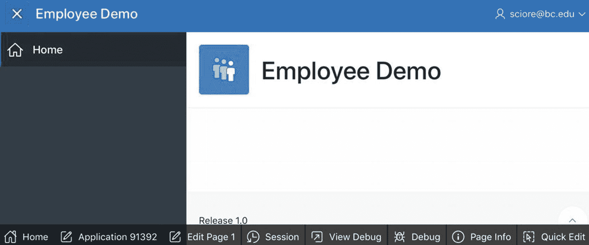
图 2-8
从 APEX 内部运行的新创建的主页

图 2-8 还显示了页面底部的一行按钮。这些按钮称为 *开发人员工具栏*，每当从 APEX 内部运行页面时就会出现。有三个按钮对于构建和调试你的应用程序特别有用。`Edit Page` 按钮将你带到当前页面的页面设计器以便编辑。`Application` 按钮将你带到当前应用程序的主页以便处理其他页面。而 `Session` 按钮会弹出一个窗口，显示应用程序的当前状态，以便你可以验证其行为是否正确。后一个主题将在第 6 章中讨论。

如果你愿意，可以从你的应用程序中移除工具栏。再次查看图 2-6 的 `Application Properties` 页面，并注意其中有一个名为 `Availability` 的部分。此部分具有属性 `Status`，用于指定如何访问应用程序。默认值通常是 `Available with Developer Toolbar`，它指定工具栏对开发人员可见。如果你不想要该工具栏，请将值更改为 `Available`。

#### 从 APEX 外部运行页面

APEX 的 `Create Application` 向导为每个新应用程序分配一个 ID 号。从图 2-3 可以看到，我的 `Employee Demo` 应用程序被分配了 ID 91392。这个数字在应用程序构建器中处处显示；事实上，自那时起除了图 2-7 之外的每个图形中它都出现了。APEX 也会为应用程序的每个页面分配一个 ID 号。默认情况下，主页的 ID 是 1，全局页面（将在第 4 章讨论）是 0，登录页面是 9999。

要从 APEX 外部运行一个页面，你需要其 URL。此 URL 包含一些标识 APEX 服务器的字符，后跟应用程序 ID 和页面 ID。例如，我的 `Employee Demo` 主页的 URL 是

[`https://apex.oracle.com/pls/apex/f?p=91392:1`](https://apex.oracle.com/pls/apex/f%253Fp%253D91392:1.)

直到字符 `f?p=` 为止，此 URL 对于由 `apex.oracle.com` 服务器托管的每个 APEX 应用程序都是相同的。等号后的字符是应用程序 ID 和页面 ID，用冒号分隔。如果你在 URL 中省略页面 ID，APEX 会假定你指的是页面 1。

如果你在提交此 URL 时已登录到应用程序的工作区，那么开发人员工具栏将显示在屏幕底部，就像你从 APEX 内部运行应用程序一样。否则，你将看到没有它的页面，就像普通用户看到的那样。

## 创建新页面

有几种方法可以为你的应用程序创建新页面，但最直接的方式是在应用主屏幕上点击 `创建页面` 按钮（参见图 2-5）。这样会打开 `创建页面` 向导。你应该使用这个向导为你的应用程序创建第二个页面。

向导的第一个屏幕（如图 2-9 所示）要求你选择页面类型。目前，我建议你只创建空白页面；其他页面类型是为有经验的开发者（或毫无头绪的初学者）准备的快捷方式。例如，一个 `报告` 页面实际上就是一个包含报告区域的空白页面。

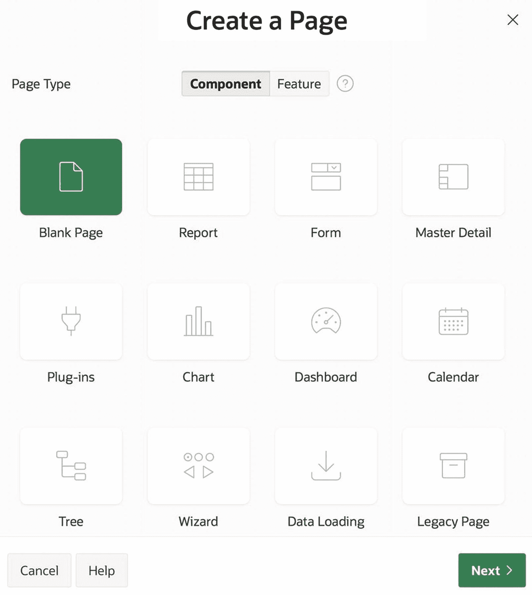

图 2-9：“创建页面”向导的第一个屏幕

向导的第二个屏幕要求输入页面的名称、编号和模式；参见图 2-10。你可以自由使用向导建议的页面编号。在页面名称中输入 `区域实践`，并将模式设置为 `常规`。（其他模式将在“属性编辑器”部分讨论。）`面包屑` 属性指定页面是否应显示面包屑导航。面包屑导航将在第 4 章讨论；目前，将 `面包屑` 属性设置为 `不在页面上使用面包屑`。

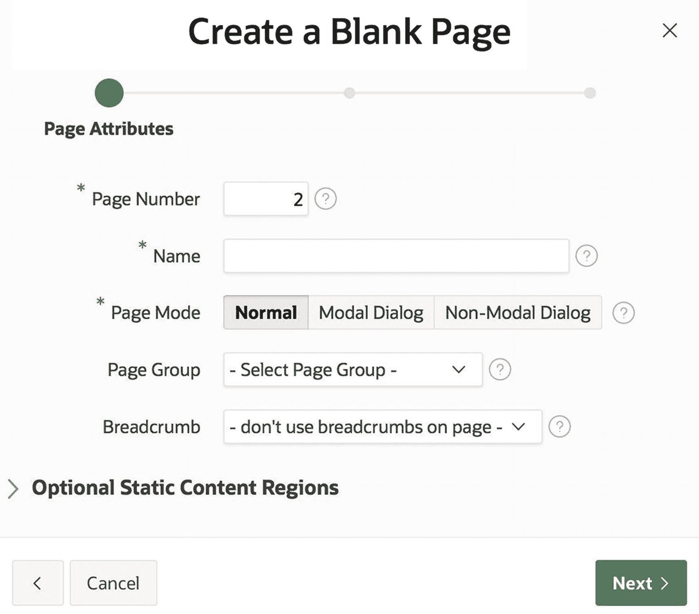

图 2-10：“创建页面”向导的第二个屏幕

图 2-11 显示了向导的第三个屏幕，它要求你指定页面是否应该有一个导航菜单条目。选择 `创建新的导航菜单条目` 选项会使屏幕显示项目，供你指定条目名称及其父级。这些选项将在第 4 章更详细地讨论；目前，使用如图所示的 `区域实践` 和 `未选择父级` 这两个值。

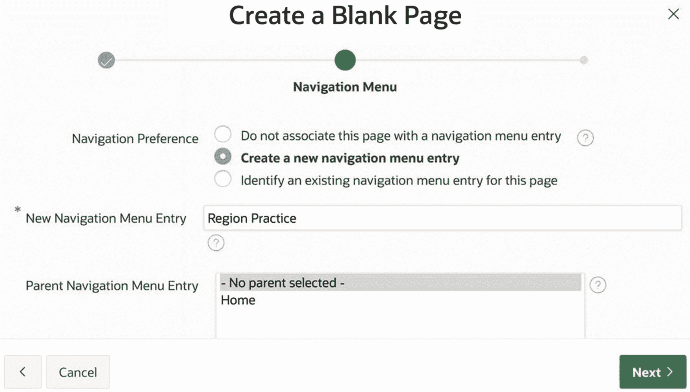

图 2-11：“创建页面”向导的第三个屏幕

向导的第四个屏幕（未显示）要求确认。当你点击其 `完成` 按钮时，APEX 会带你进入新页面的页面设计器。但在你深入探究页面设计器及其用法之前，你应该先看看你刚刚创建的页面。

回到你的应用程序主屏幕（图 2-4），可以通过点击页面设计器面包屑上的链接，或者点击 `App Builder` 选项卡，然后选择你的应用程序图标。屏幕现在应该包含页面 2 的图标。运行你的应用程序，观察导航菜单现在有两个条目。点击 `区域实践` 条目查看你的新页面。请注意，此页面的内容甚至比主页还少，因为它缺少面包屑导航。还要注意，你可以通过点击它们的导航菜单条目在页面之间移动。

## 页面设计器

APEX 页面设计器屏幕让你管理页面的属性和内容。因为一个页面可以有多种组件，每个组件又有众多属性，所以页面设计器极其密集，对初学者来说可能令人生畏。在本书中，你将根据需要，逐步了解页面设计器的不同部分。每次介绍一个新的 APEX 功能时，你也会看到它与页面设计器的关系。本节介绍页面设计器的基本功能。

要进入某个页面的页面设计器，从应用程序主屏幕开始，点击所需页面的名称（或图标）。图 2-12 显示了你的主页页面设计器的顶部。

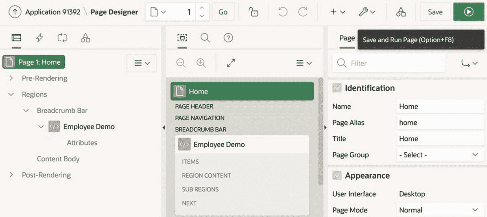

图 2-12：主页的页面设计器

在图 2-12 的顶部，面包屑导航的右侧，是一个由几个按钮组成的工具栏。以下是一些立即可用的按钮：

*   `撤销` 和 `重做` 按钮（在锁定图标右侧）以常规方式将页面恢复到之前的状态。
*   `实用工具` 按钮（标有扳手图标）有一个菜单项，允许你删除页面。
*   `保存` 按钮保存你对页面的更改。
*   `运行` 按钮（在保存按钮右侧）保存页面并运行它。

页面设计器支持一种迭代的页面开发方法。其理念是在页面设计器内编辑页面内容，然后运行该页面。检查输出后，你返回页面设计器并重复此过程，直到页面令人满意。

工具栏下方是三个垂直面板，构成了页面设计器的核心。左侧面板显示页面上的组件。右侧面板指定所选组件的属性，称为 `属性编辑器`。中间面板提供实用功能。

中间面板有三个选项卡，分别对应 `布局`、`页面搜索` 和 `帮助` 这些实用功能。在图 2-12 中被选中的 `布局` 选项卡，以可视化方式显示页面布局。你可以通过拖动中间面板的左右边框来改变其大小，并且可以点击面板顶部的图标在选项卡之间切换。

左侧面板显示页面的组件，有四个选项卡：`呈现`、`动态操作`、`处理` 和 `页面共享组件`。该面板一次只能显示一个选项卡的内容。你可以通过点击面板顶部的四个图标之一来选择你想要的选项卡。本书重点介绍 `呈现` 和 `处理` 选项卡，并从 `呈现` 选项卡开始。`处理` 选项卡将在第 7 章介绍。

`呈现` 选项卡显示决定页面外观的组件。这些组件以树状结构显示。树的根节点表示页面。它有三个子节点，对应页面呈现的三个阶段：`预呈现`（组件初始化的阶段）、`区域`（组件被呈现的阶段）和 `后呈现`（执行清理活动的阶段）。为了便于阅读，图 2-13 复制了页面 1 的呈现树。

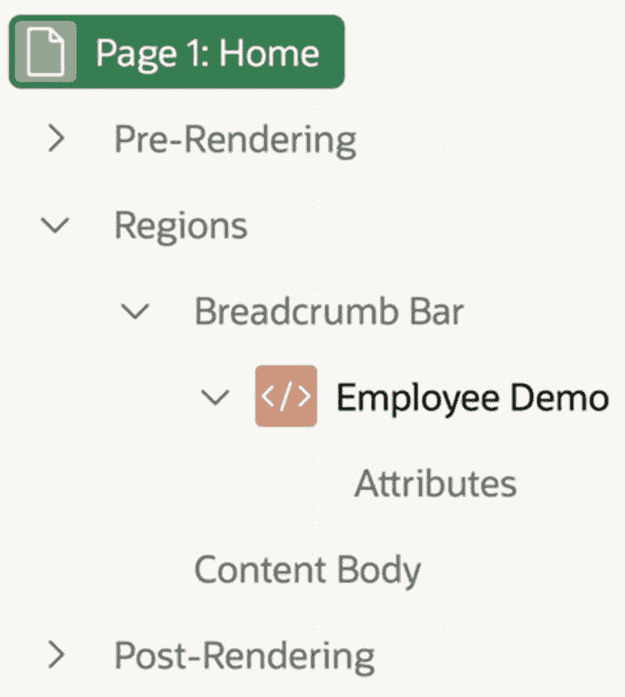

图 2-13：主页的呈现树

页面上绝大多数组件位于 `区域` 子树中，所以让我们更仔细地探索它。

页面的空间被划分为 `位置`。例如，`面包屑栏` 位置横跨页面顶部，而 `内容主体` 位置涵盖了页面中央的主要区域。页面中的每个区域都被分配到一个位置。

`区域`子树的结构如下：其子节点表示页面位置，每个位置节点又为分配给该位置的每个区域设有一个子节点。因此，在图 2-13 中，`区域`的两个子节点分别对应`面包屑栏`和`内容主体`这两个位置。`面包屑栏`位置有一个子节点，表示`员工演示`区域；而`内容主体`位置没有区域，因此也没有子节点。

此外，每个区域节点都有一个名为`属性`的子节点，并且根据其类型，还可能拥有其他子节点。这些节点的用途将在第 3 章介绍。

如果渲染树中的某个节点有子节点，那么它的左侧会有一个展开/折叠箭头。点击箭头可以展开节点以显示其子节点；再次点击则会折叠节点以隐藏子节点。您还可以右键单击节点，以递归方式折叠或展开该节点的子树。

### 属性编辑器

属性编辑器是页面设计器的右侧面板。它的作用是显示在左侧面板中所选组件的属性。

例如，转到主页的页面设计器，点击渲染树的根组件（标记为`页面 1：主页`）。右侧面板随后将显示该页面的页面级属性。图 2-14 展示了主页属性编辑器的顶部部分，显示了页面的`标识`和`外观`部分的属性。此时有三个属性值得一提：`名称`、`标题`和`页面模式`。

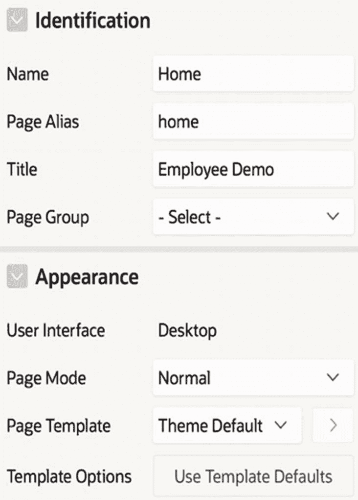
*图 2-14：主页的属性编辑器*

`名称`属性在应用程序构建器内部标识页面。您在创建页面时已为其命名，如果想到更好的名称，可以在此处更改。

`标题`属性向用户标识页面。浏览器通常在浏览器标签页中显示页面标题。该属性当前值为`员工演示`。为了体验，将其值更改为`这是我的主页`，重新运行页面，并观察浏览器标签页中的变化。

`页面模式`属性指定页面的使用方式。有三种可能的值：`正常`、`模态对话框`和`非模态对话框`。

Web 应用程序中的大多数页面都是正常页面。浏览器只需简单地替换之前显示的页面即可显示正常页面。浏览器标签页（或窗口）的历史记录可以视为访问正常页面的序列。

非模态对话框页面在新的浏览器窗口中打开。此类页面通常用作辅助页面，围绕正常页面的主要流程。在第 1 章查看 SQL 命令工具时，您已经见过一个非模态页面的例子。其屏幕（如图 1-11 所示）是一个正常页面。但当您点击`查找表`按钮时，`表查找器`窗口会弹出，如图 1-12 所示。该窗口的内容就是一个非模态对话框页面。您可以按需将其保持打开状态，在屏幕上随意移动，并在需要时在它与当前正常页面之间切换控制权。

模态对话框页面对应于对话框。它在当前正常页面之上打开，并且在关闭之前不允许用户进行其他任何操作。应用程序构建器的`创建页面`向导（如图 2-9 至 2-11 所示）就是由模态页面组成的。虽然从这些图中看不出来，但这些向导屏幕是显示在应用程序的主屏幕之上的。在用户退出向导之前，底层屏幕的所有组件（例如按钮、链接和选项卡）都将被禁用。

附带说明一下，APEX 中并非所有向导都是模态的。一个例子是`创建应用程序`向导，其屏幕如图 2-2 和 2-3 所示。这些屏幕是伪装成模态对话框的正常页面。可以通过两种方式辨别：它们并非位于之前的正常页面之上，并且您可以通过点击菜单栏选项卡随时退出向导。

尝试不同的页面模式是很好的做法。转到`区域练习`页面的页面设计器，将其页面模式设置为`模态对话框`。您无法直接运行该页面（因为模态页面只能在另一个页面之上显示），因此请运行主页，然后点击`区域练习`菜单项。您应该能观察到该页面的模态特性，如图 2-15 所示。然后在页面设计器中重新编辑该页面，将页面模式设置为`非模态对话框`，并重复该实验。观察到该页面仍然无法直接运行。当您运行主页并点击`区域练习`菜单项时，区域练习页面将在一个新的独立浏览器窗口中打开，如图 2-16 所示。完成后，请将页面的模式设置回`正常`。

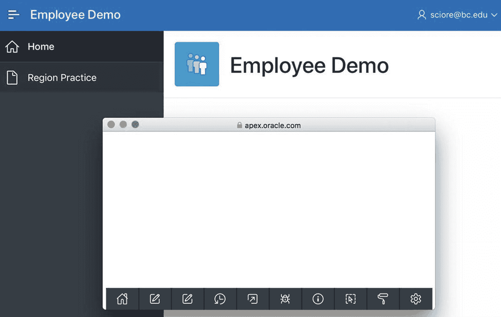
*图 2-16：作为非模态对话框页面的区域练习*

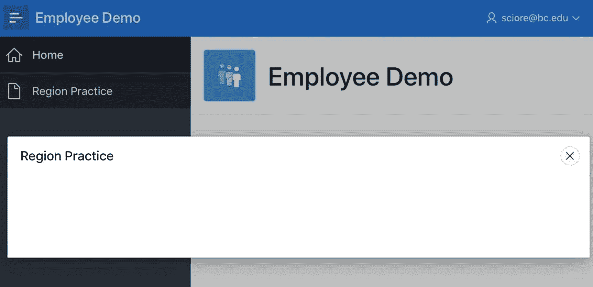
*图 2-15：作为模态对话框页面的区域练习*

### 访问内置帮助

到目前为止，您已经看到了两种不同的属性编辑方式：图 2-6 的`应用程序属性`屏幕（用于编辑应用程序的属性）和图 2-12 的属性编辑器（用于编辑指定页面的属性）。这两种界面之间一个有趣的区别在于它们提供内置帮助的方式。要阅读应用程序属性的帮助文本，您需要单击其右侧的问号图标。要阅读页面属性的帮助文本，您需要使用页面设计器的`帮助`部分。

回想一下，页面设计器中间面板的顶部有三个选项卡：`布局`、`搜索`和`帮助`。当您选择`帮助`时，中间面板将显示属性编辑器中当前所选属性的帮助文本。当您在属性编辑器中从一个属性移动到下一个属性时，中间面板会显示该属性的帮助文本。例如，图 2-17 显示了页面`名称`属性的帮助文本。

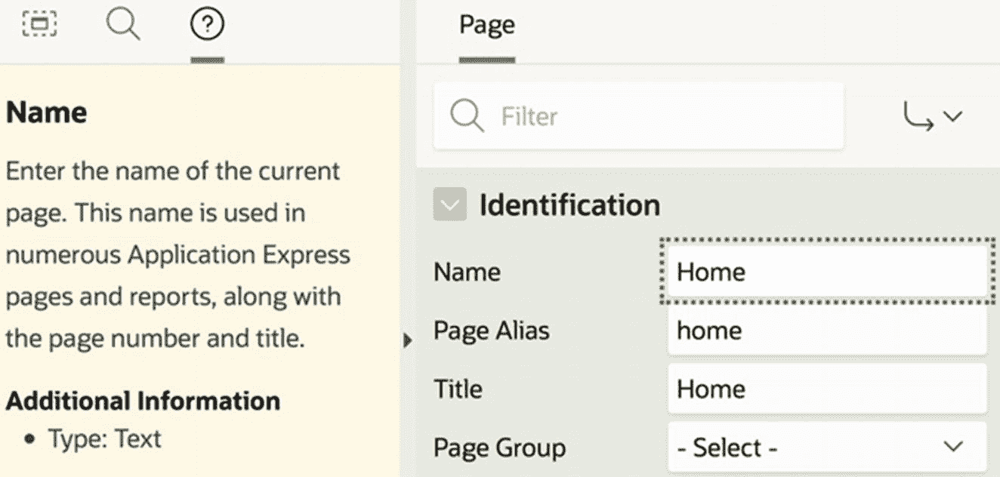
*图 2-17：使用内置帮助*

## 总结

在本章中，您开始了在 APEX 应用程序构建器中的旅程。您了解了如何创建应用程序、用页面填充它，以及如何在浏览器中运行它们。您还了解了如何使用 APEX 页面设计器来查看和更改页面的属性。

到目前为止，您应用程序中的页面还没有内容。本书的其余章节将探讨您可以添加到页面中的不同类型的内容。第 3 章介绍区域。

