# 3. 区域

页面的内容被划分为称为*区域*的矩形区域。例如，考虑图 1-3 所示的 APEX SQL Workshop 主屏幕，它显示了七个区域。其中六个区域有标题：`Recently Created Tables`、`Recent SQL Commands`、`Recent SQL Scripts`、`About`、`Schema` 和 `Create Object`。第七个区域包含五个大按钮，没有标题。

每个区域都有一个*类型*，表示它可以包含何种内容。图 1-3 中的区域属于三种不同的区域类型：

*   `Recently Created Tables`、`Recent SQL Commands` 和 `Recent SQL Scripts` 区域包含报表，其类型为 `Classic Report`。
*   `Create Object` 区域包含一个链接列表，其类型为 `List`。
*   `About`、`Schema` 以及那个无标题区域的类型为 `Static Content`。

一个区域也可以包含*控件*——即项目和按钮。在图 1-3 中，`Schema` 区域包含一个选择列表项目和一个按钮，而无标题区域包含五个大按钮。由于 APEX 将区域的控件视为与其内容不同的部分，因此任何区域，无论类型如何，都可以包含控件。本章重点介绍区域的内容；控件将在第 5 章和第 6 章讨论。

APEX 支持多种不同的区域类型。本章涵盖四种基本类型：`Static Content`、`Classic Report`、`Chart` 和 `Interactive Report`。后续章节将介绍其他区域类型：第 4 章的 `Breadcrumb` 和 `List`，第 6 章的 `Region Display Selector`，第 10 章的 `Form`，以及第 11 章的 `Interactive Grid`。

## 创建和删除区域

要为页面创建一个新区域，请转到该页面的页面设计器。在其渲染树中右键单击 `Regions` 节点，然后选择 `Create Region`，如图 3-1 所示。然后，APEX 会将一个区域组件（名为 `New`）作为子项添加到 `Content Body` 文件夹下的渲染树中。该组件也会有一个自己的子项，名为 `Attributes`。参见图 3-2。

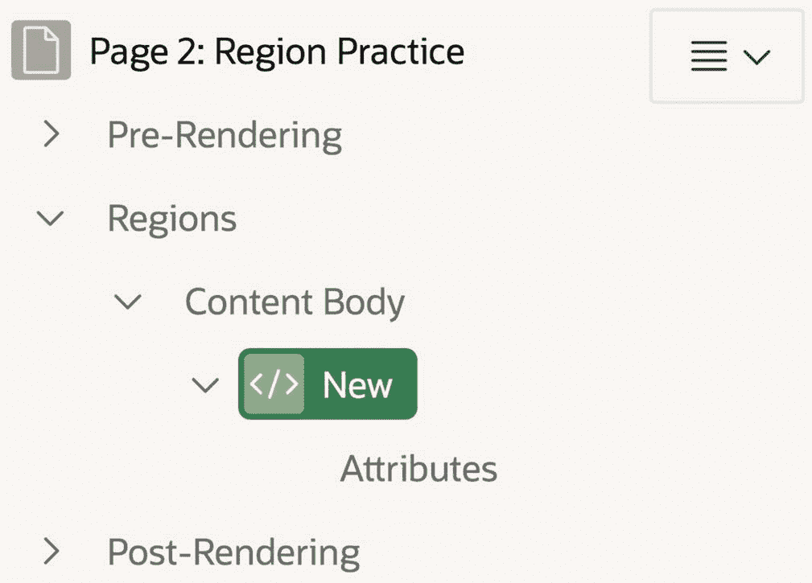

图 3-2

APEX 向页面添加新区域

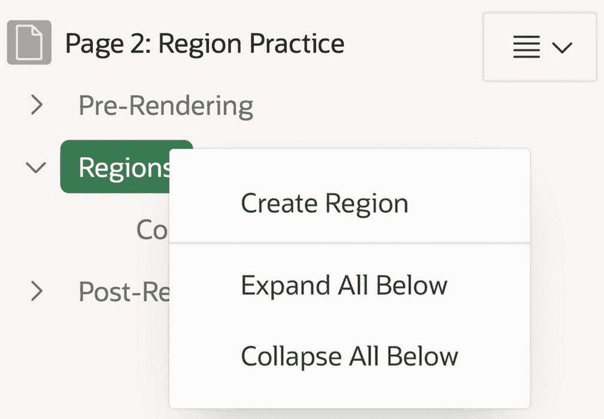

图 3-1

右键单击“区域”节点以创建新区域

APEX 在渲染树中使用两个组件来表示单个区域，这可能看起来有些奇怪。原因是这些组件的属性有不同的关注点。特别是，区域组件（此处标记为 `New`）包含所有区域共有的属性，而 `Attributes` 组件则包含特定于区域类型的属性。与类型无关的属性将在下一节讨论，之后是与类型相关的属性。

如果要删除一个区域，只需在渲染树中右键单击其组件并选择 `Delete`。例如，随主页一起提供的面包屑区域是无用的。转到页面 1 的页面设计器，在渲染树中找到 `Breadcrumb` 区域并将其删除。参见图 3-3。

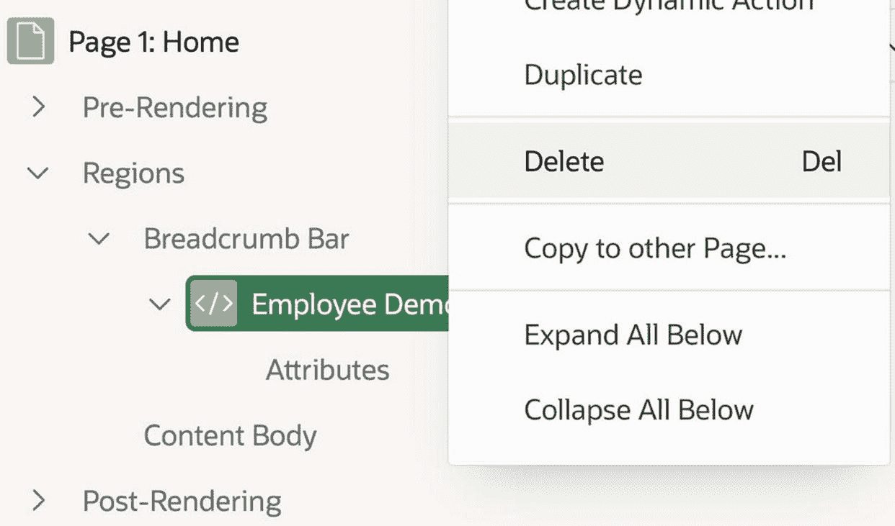

图 3-3

删除区域

## 与类型无关的区域属性

要编辑区域的与类型无关的属性，首先在渲染树中选择该区域的节点。属性编辑器随后将显示该区域的所有与类型无关的属性及其值。这些属性根据其目的被分组为*节*。这里，我将讨论四个重要的节：`Identification`、`Source`、`Layout` 和 `Appearance`。

### “标识”和“来源”节

图 3-4 显示了 `Region Practice` 页面的 `New` 区域的 `Identification` 和 `Source` 节及其属性 `Title`、`Type` 和 `Text`。`Title` 属性标识区域并描述其用途。此值通常在页面渲染时显示在区域的标题中。

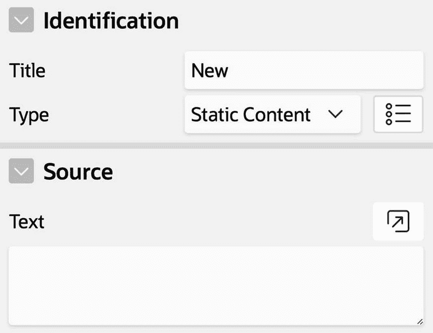

图 3-4

新区域的“标识”和“来源”属性

新区域默认被分配标题 `New`。创建区域后，您应该做的第一件事就是为其分配一个更有意义的标题。APEX 在此处接受 HTML 格式标签。例如，转到 `Region Practice` 页面的页面设计器，在渲染树中选择 `New` 区域，并将其 `Title` 属性更改为：

```
My First Region
```

然后，在页面上再创建两个区域，标题分别为：

```
My Second Region
```

和

```
My Third Region
```

保存并运行页面。它应该如图 3-5 所示。请注意，每个标题分别以斜体、粗体和红色显示在其区域的标题中。

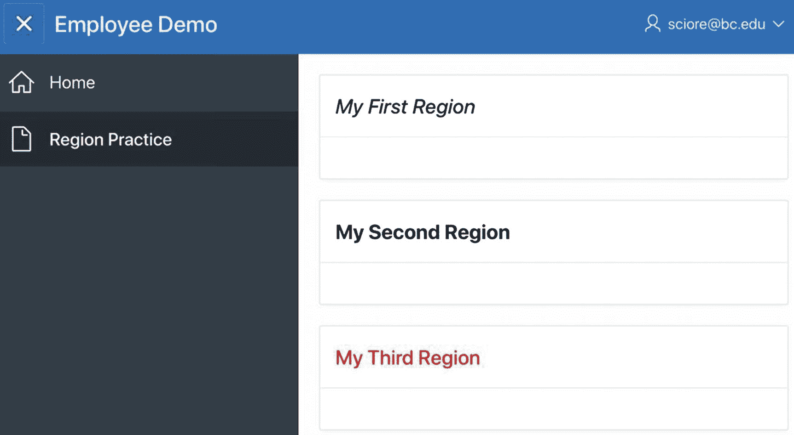

图 3-5

“区域练习”页面上的三个区域

区域的内容由其 `Type` 属性和 `Source` 节决定。区域的类型指定了它包含的内容种类，而 `Source` 节指定了实际内容。例如，如果区域的类型是 `Static Content`，则其 `Source` 节包含区域应显示的文本；如果区域的类型是 `Classic Report`，则其 `Source` 节指定区域应显示的表。

新区域被分配类型 `Static Content`，其源文本为空。为了有趣，让我们给区域 `My First Region` 和 `My Second Region` 分配一些源文本。我选了一些简单的内容，即 `This is my first region` 和 `This is my second region`。

您可以通过从其可能类型的列表中选择类型来更改区域的 `Type` 属性。例如，将 `My Third Region` 的类型更改为 `Classic Report`。当您这样做时，`Source` 节会发生变化，以便您可以指定报表；参见图 3-6。默认情况下，属性编辑器期望报表显示整个表：源类型是 `Table/View`，而 `Table Name` 属性为空，等待输入表名。属性编辑器在属性名称旁边放置一个红色错误指示符，以提醒您输入表名。它在这一点上非常坚持——在错误被清除之前，它不会让您保存页面。因此，输入 `DEPT` 作为表名，并观察错误图标消失。

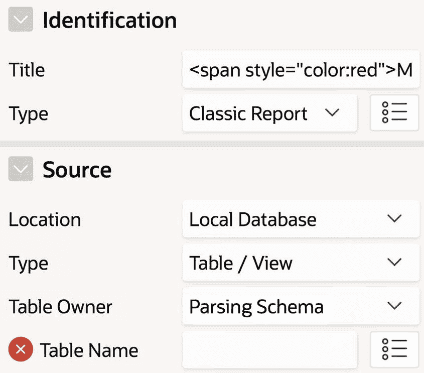

图 3-6

经典报表的默认“来源”属性

或者，报表的来源可以是 SQL 查询。为了尝试一下，将源类型更改为 `SQL Query`。这将导致 `Table Name` 属性被 `SQL Query` 属性替换，同样带有红色错误指示符。输入查询 `select * from DEPT` 并观察指示符消失。

图 3-7 显示了运行修改后页面的结果。

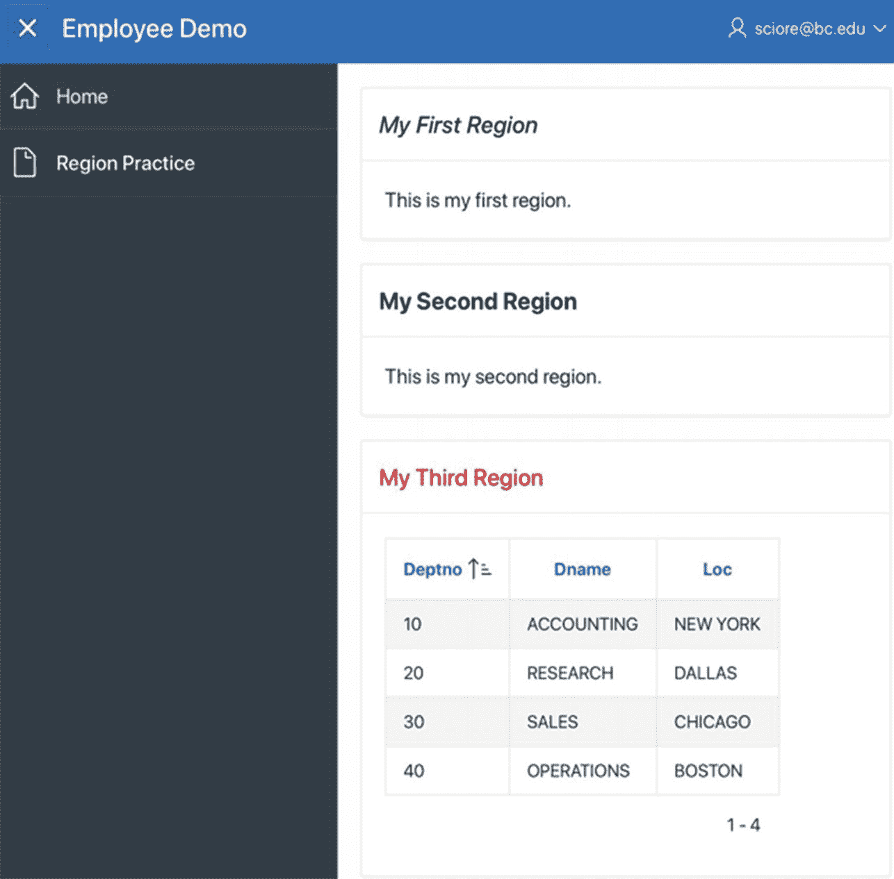

图 3-7

每个区域都有一个非空的来源


## 布局部分

一个区域的 `Layout`（布局）部分包含指定该区域在其页面上位置的属性。这些属性如图 3-8 所示。
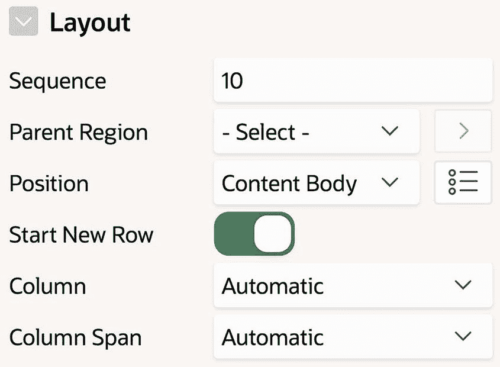
图 3-8
区域的默认布局部分

`Parent Region`（父区域）和 `Position`（位置）属性提供了两种不同的方式来指定区域在页面上的位置。这两个属性中只能有一个有值。`Parent Region` 有值意味着该区域应位于一个指定的区域（称为其 `parent`，父区域）内。`Position` 有值意味着该区域应位于页面上的一个特定位置。默认情况下，新区域位于 `Content Body`（内容主体）位置，如图 3-8 所示。您可以通过从其下拉列表中选择来更改位置，如图 3-9 所示。
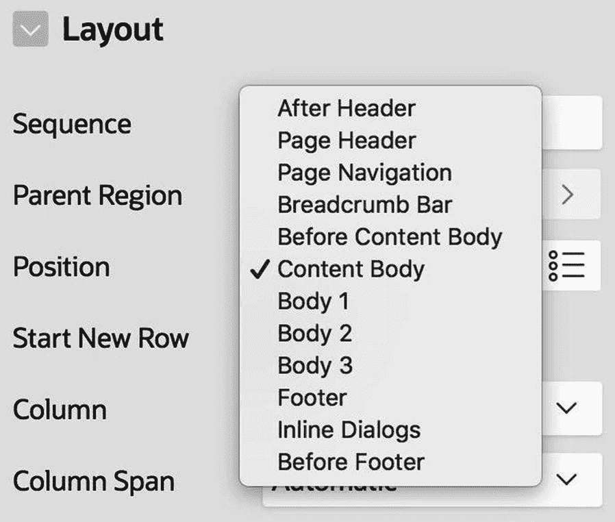
图 3-9
可能的区域位置

这些位置按它们在页面上从上到下的出现顺序列出。大多数位置都有特定的用途。例如，`Content Body` 位置是通用区域的主要放置位置，`Page Navigation`（页面导航）位置用于页面左侧的导航菜单，而 `Breadcrumb Bar`（面包屑栏）用于面包屑区域。

注意：其中一些位置（即 `After Header`、`Body 1`、`Body 2`、`Body 3`、`Footer` 和 `Before Footer`）是 `legacy`（遗留）位置。也就是说，它们仅用于支持使用旧版 APEX 编写的应用程序。新应用程序不应使用它们。

可能的区域位置集合由页面的 `template`（模板）决定。创建页面时，会为其分配应用程序主题定义的默认模板。例如，`Universal` 主题的默认页面模板称为 `Standard`。

可以更改页面的模板。在渲染树中选择页面组件，然后查看 `Appearance`（外观）部分中的 `Page Template`（页面模板）属性。当前，模板设置为 `Theme Default`（主题默认）。您可以通过点击该属性的选择列表来更改模板。例如，将 `Region Practice`（区域练习）页面的模板更改为 `Right Side Column`（右侧栏），如图 3-10 所示。
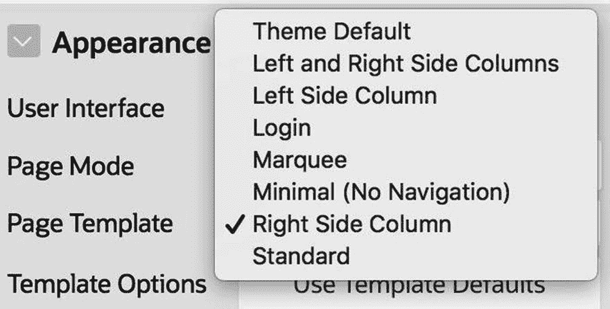
图 3-10
页面模板选项

现在选择一个区域（例如 `My Second Region`，我的第二个区域）并重新检查其 `Position` 值列表；您会发现除了图 3-9 中的值外，还有一个值 `Right Column`（右栏）。将 `My Second Region` 的位置设置为 `Right Column` 并重新运行页面。该区域现在应显示为右侧栏，如图 3-11 所示。（我为第二个区域的源添加了更多文本以使其更像侧边栏。）请注意，侧边栏区域在其左上角有一个箭头图标。点击该图标可在显示和隐藏侧边栏之间切换。
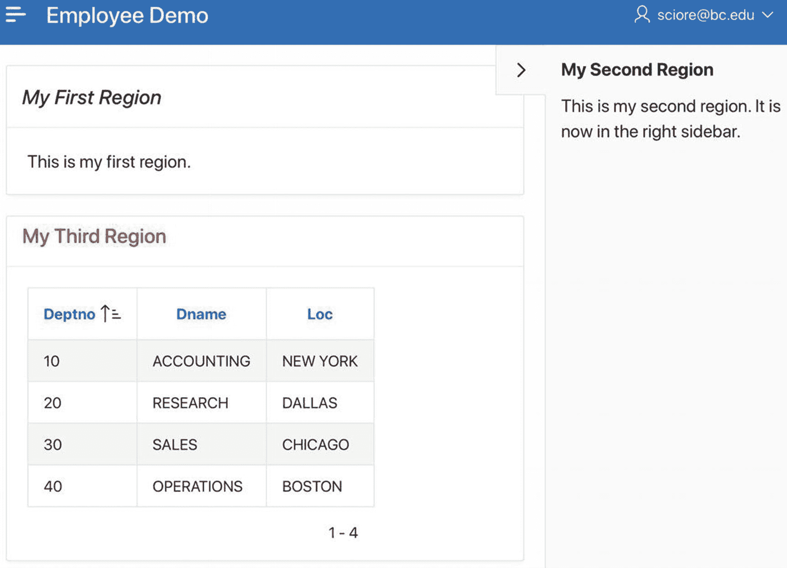
图 3-11
向右侧栏添加区域

`Layout` 部分还有一个 `Sequence`（序列）属性，可以在图 3-8 中看到。如果两个区域位于页面的同一位置，它们的 `Sequence` 值决定了它们在该位置中的放置顺序。区域在创建时按顺序分配序列号，但您只需为 `Sequence` 分配不同的值即可更改该顺序。例如，`My First Region`（我的第一个区域）和 `My Third Region`（我的第三个区域）都位于 `Content Body` 位置，序列号分别为 `10` 和 `30`。如果您将 `My Third Region` 的序列号更改为 `5`，则渲染后的页面将类似于图 3-11，只不过 `My Third Region` 将出现在 `My First Region` 上方。

尽管尝试将区域放置在页面上的不同位置是很好的，但页面上的大多数区域通常位于同一位置（特别是 `Content Body`）。在这种情况下，`Layout` 部分的其余属性决定了区域在该位置内的相对位置。

一个位置中的区域被组织在网格中；每个区域被分配给该网格的一行和一列。APEX 根据区域的序列号来定位它们。第一个区域被放置在网格第一行的第一列。然后，每个后续区域按以下方式之一放置：

*   与前一个区域位于同一行和同一列（在这种情况下，它显示在前一个区域下方）
*   在当前行的下一列
*   在新行的第一列

`Layout` 部分的 `Start New Row`（开始新行）和 `New Column`（新列）属性允许您指定使用哪个选项。图 3-12 显示了一个被放置在同一行新列中的区域的这些属性。图 3-8 显示了一个区域开始新行的情况；请注意，在这种情况下，`New Column` 属性是不必要的，因此没有出现。
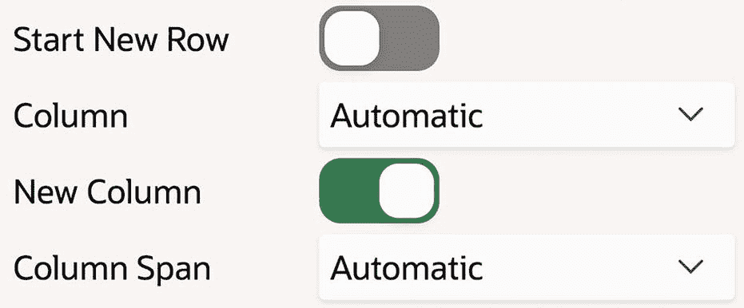
图 3-12
指定行和列的区域定位

在将每个区域分配给一行和一列之后，APEX 会确定这些区域内位置中的大小和位置。为此，APEX 使用 `Column`（列）和 `Column Span`（列跨度）属性的值（如图 3-12 所示）来确定行中每个区域的偏移量和宽度。

`Column` 属性指定区域在其行内的偏移量。APEX 将一个位置的宽度划分为 12 个“网格点”；`Column` 的值是一个从 1 到 12 的数字，表示其中一个点。值为 `1` 表示区域从位置的极左侧开始；值为 `7` 表示区域从位置的中心开始。`Column Span` 属性指定列的宽度。其值也是一个从 1 到 12 的数字，表示以网格点为单位的宽度。

例如，图 3-13 显示了 `Region Practice` 区域的另一种配置。以下是如何从图 3-11 开始创建该配置：首先将页面模板改回 `Theme Default`，将 `My Second Region` 移回 `Content Body` 位置与其他区域在一起，并将 `My Third Region` 的序列号设为最小。然后按如下方式设置它们的 `Grid`（网格）属性：
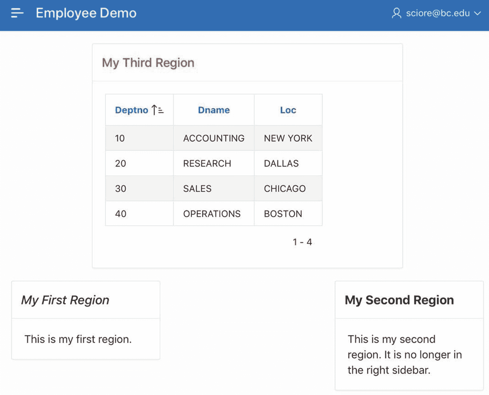
图 3-13
显示 Region Practice 区域的另一种方式

*   `My Third Region` 开始一个新行，其 `Column` 值为 `3`，`Column Span` 值为 `8`。也就是说，其宽度是位置宽度的三分之二，并且居中显示。


### 外观部分

图 3-10 展示了页面的 `Appearance` 部分，其属性允许你配置页面的模板。类似地，每个区域也有一个模板，该模板由区域 `Appearance` 部分中的 `Template` 属性指定。图 3-14 展示了该属性的各种可选值。

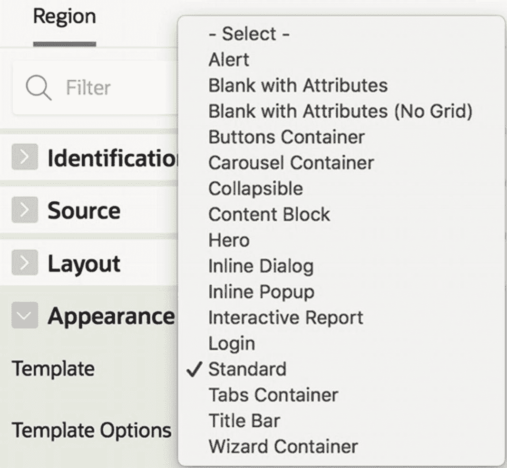

图 3-14

区域 `Template` 属性的选项

最常见的是 `Standard` 模板，它在顶部的边框中显示区域的标题。其他许多模板都有特殊用途，例如 `Alert`、`Inline Dialog`、`Login`、`Title Bar` 和 `Wizard Container`。

`Collapsible` 模板与 `Standard` 类似，只是在左上角增加了一个小按钮。点击该按钮可以在隐藏区域主体和显示区域主体之间切换。使用 `Buttons Container` 或 `Blank with Attributes` 模板的区域没有标题；这两个模板的主要区别在于按钮区域有边框，而空白区域没有。

## 拖放操作

将注意力转向页面设计器的中间面板，特别是 `Layout` 选项卡。点击此选项卡会使中间面板显示页面内容的样式化表示。该面板有一个与每个区域位置对应的区域，每个区域包含分配给该位置的区域的表示。

例如，考虑图 3-13 中所示的 `Region Practice` 页面；其网格布局如图 3-15 所示。从中你可以看到 `Content Body` 位置中的三个区域，它们的显示方式与页面呈现时的大致相同。

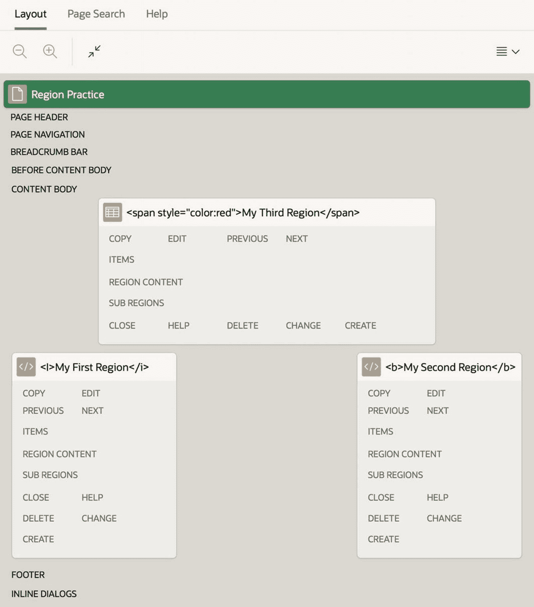

图 3-15

页面布局区域

网格布局在设计时为你提供了渲染页面布局的视觉近似。当你更改区域的 `Position` 和 `Layout` 属性值时，网格布局也会相应改变。

如果在网格布局中点击区域的标题栏，该区域的属性将出现在属性编辑器中。你还可以将区域拖动到网格布局上的其他位置。拖动时，可用位置会以黄色高亮显示，这些区域内的放置点会由一个轮廓矩形指示。你可以将区域放置到空位置、另一个区域的 `Sub Regions` 部分（使该区域成为另一个区域的子区域），或者另一个区域的上方、下方、左侧或右侧（将该区域添加到该位置的网格中）。当你这样做时，你会看到区域的 `Layout` 属性相应地发生变化。

在页面设计器中下部中央区域，网格布局下方，有一个称为 `gallery` 的区域。该区域默认最小化。要展开它，请点击网格布局底部中间的手柄。你可以使用此区域通过拖放来创建页面组件。具体来说，点击图库的 `Regions` 按钮将显示每种可能区域类型的图标，如图 3-16 所示。要创建特定类型的区域，请点击其图标并将其拖到网格布局上的所需位置。

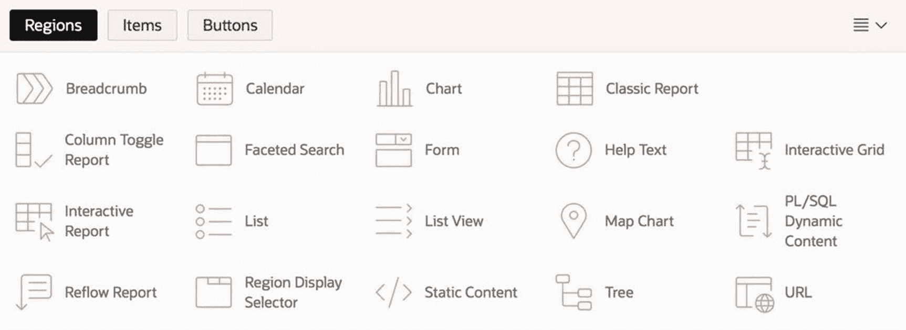

图 3-16

区域图库

使用图库是创建区域的一种便捷方式，额外的好处是 APEX 会自动为其类型和位置属性分配适当的值。但一旦创建，这样的区域就与其他任何区域相同。特别是，区域的属性（包括其类型和位置）可以随时修改，不受限制，无论它是如何创建的。

## 静态内容区域

一个 `static content region` 可以显示文本或格式化的 HTML 代码。APEX 屏幕包含几个静态区域的示例。例如，再次考虑图 1-3 中的 SQL Workshop 主屏幕。页面右侧标题为 `About` 的区域是一个静态内容区域，其源是显示的文本。源中包含 HTML 标签，使 `Learn More...` 被格式化为一个链接。

你可以对你的演示应用程序做类似的事情。让我们充实主页，使其包含四个静态内容区域。图 3-17 展示了页面的最终样子。本节的目标是学习创建此页面所需的概念。

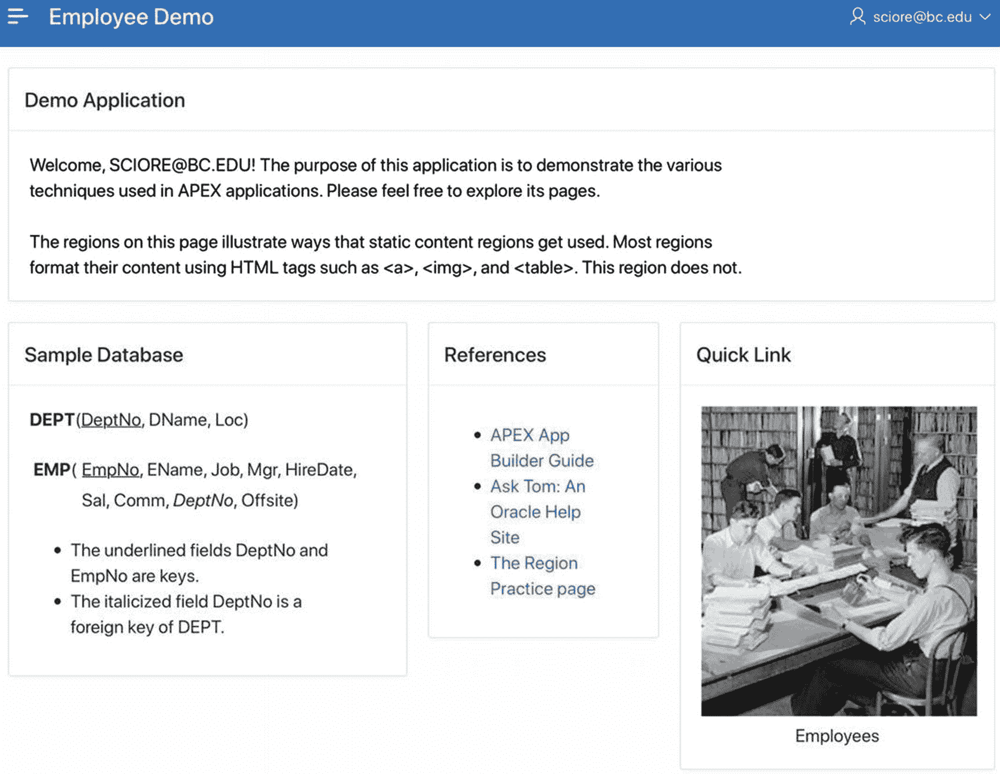

图 3-17

包含四个静态内容区域的主页（照片由美国国会图书馆印刷品与照片部提供，编号 LC-H261-4562）

第一步是在分配任何内容之前在页面上创建并定位这些区域。为此，请执行以下任务：

*   转到主页的页面设计器并创建四个新区域。这些区域默认类型将是 `Static Content`，这正是你想要的。
*   依次将标题 `Demo Application`、`Sample Database`、`References` 和 `Quick Link` 分配给这些区域。
*   将区域放置在 `Content Body` 位置，并使用它们的 `Layout` 属性指定其在页面上的位置。具体来说，`Demo Application` 和 `Sample Database` 区域开始新行，其他两个区域开始新列。`Sample Database`、`References` 和 `Quick Link` 区域的列跨度应分别为 5、3 和 4。

此时，你可以运行你的主页并验证其是否具有预期的结构。页面应如图 3-18 所示。

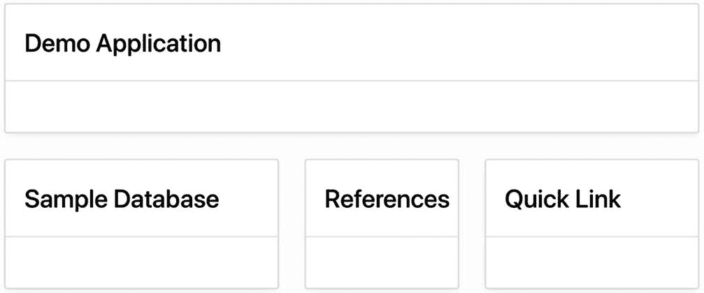

图 3-18

主页的结构

下一步是向这些区域添加内容。以下各节将讨论相关问题。


### 格式化文本与非格式化文本

静态内容区域的来源是要显示的文本。APEX 可以以两种方式解释此文本：一种是按书写原样显示的字符，另一种是需要格式化的 HTML 代码。指定此选项的属性称为 `输出为`，它出现在页面渲染树中区域 `属性` 节点的 `设置` 部分。图 3-19 展示了此部分以及 `输出为` 属性的两个可能值。

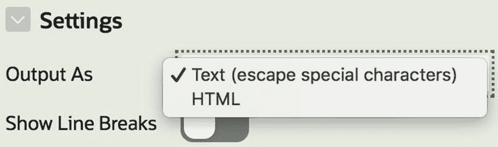
图 3-19：静态内容区域的类型特定属性

`输出为` 的值为 `HTML` 指定该区域的源包含 HTML 代码。APEX 在渲染页面时会按原样将此代码发送到浏览器，以便浏览器可以相应地格式化源。

另一方面，值 `文本（转义特殊字符）` 指定应按原样显示源。在这种情况下，APEX 需要转换文本，以便浏览器没有可执行的 HTML 标签。它通过将某些字符（例如 `<` 和 `>`）替换为碰巧打印效果相同的不同字符（例如 `<` 和 `>`）来实现。这种转换称为 `转义` 字符。结果是看起来像 HTML 代码但实际并非如此的文本。

图 3-17 中的 `示例数据库` 区域说明了几种格式：

*   `EMP` 和 `DEPT` 表的描述使用了粗体、斜体和下划线标签。
*   为了使 `EMP` 的字段在两行中对齐，它使用了一个包含两列的无边框表格：第一行由一列中的“`EMP(`”和第二列中的字段组成，第二行由第一列中的空内容和第二列中的剩余字段组成。
*   项目符号列表在 HTML 中实现为无序列表，每个项目符号点是一个列表项。

因此，该区域的 `输出为` 属性需要设置为 `HTML`。该区域的源代码如代码清单 3-1 所示。

```
DEPT(DeptNo, DName, Loc)

EMP(
EmpNo, EName, Job, Mgr, HireDate, 

Sal, Comm, DeptNo, Offsite) 

 下划线字段 DeptNo 和 EmpNo 是主键。
 斜体字段 DeptNo 是 DEPT 的外键。

代码清单 3-1：示例数据库区域的源
```

现在考虑 `演示应用` 区域。它的内容是非格式化的，实际上包含不应格式化的 HTML 标签。因此，此区域的 `输出为` 属性应设置为 `文本（转义特殊字符）`。其源如代码清单 3-2 所示。

```
欢迎, &APP_USER.! 本应用程序的目的是演示 APEX 应用程序中使用的各种技术。请随意浏览其页面。
本页上的区域展示了静态内容区域的使用方式。大多数区域使用 HTML 标签（如 <b>、<i> 和 <u>）格式化其内容。本区域不这样做。
代码清单 3-2：演示应用区域的源
```

此清单开头提到了“`&APP_USER`.”。此字符串称为替换字符串，APEX 将其解释为用户名。接下来将讨论此主题。

### 替换字符串

APEX 服务器有几个内置变量，其中包含有用的信息。以下是三个有用的变量：

*   变量 `APP_USER` 保存当前登录用户的用户名。如果应用程序不要求用户登录，则该变量的值为 `APEX_PUBLIC_USER`。
*   变量 `APP_ID` 保存当前应用程序的 ID。
*   变量 `APP_SESSION` 保存当前会话的 ID。

要从 HTML 文本中引用变量的值，您在变量名前添加字符 `&` 并在后附加句点字符 (`.`)。这样的表达式称为替换字符串。换句话说，名为 `X` 的变量的替换字符串写作 “`&X`.” 。当 APEX 服务器渲染页面时，它会用该变量的值文本替换该替换字符串。

例如，替换字符串 `&APP_USER.` 出现在 `演示应用` 区域的源中。当 APEX 服务器渲染页面时，它会用变量 `APP_USER` 的值（在本例中为 `SCIORE@BC.EDU`）文本替换该替换字符串。

### 引用 APEX 页面

`参考资料` 区域包含一个包含三个条目的项目符号列表。前两个条目包含指向外部网页的链接；第三个条目是指向应用程序的 `区域实践` 页面的链接。该区域的源如代码清单 3-3 所示。

```
APEX 应用构建器指南

Ask Tom: 一个 Oracle 帮助站点

区域实践页面

代码清单 3-3：参考资料区域的源
```

HTML `<a>` 标签指定一个链接；其参数是目标位置的 URL。清单中的第一个链接是一个典型链接，它引用外部网站上的一个页面。第二个链接引用另一个 APEX 应用程序的一个页面——特别是 `asktom.oracle.com` 上 APEX 服务器中应用程序 100 的第 1 页。请注意该链接如何使用“f?p=”表示法，如第 2 章所述。

清单中的第三个链接引用当前应用程序的第 2 页；因此，它可以写为相对引用。它使用内置变量 `APP_ID` 和 `APP_SESSION` 来引用当前应用程序 ID 和会话 ID。引用如下所示：

```
f?p=&APP_ID.:2:&APP_SESSION.
```

会话的概念将在第 6 章中介绍。目前，只需知道 APEX 使用会话标识符来指示相关的页面访问。通过将会话 ID 传递到 URL 中，您可以确保在跟踪链接时当前会话将继续。请注意，区域中的第二个链接没有包含会话标识符。这是合适的，因为该链接开始了一个与 Ask Tom 应用程序的新会话。


## 引用本地图片

HTML 的``标签用于显示图像；其参数是图像文件的 URL。如果 URL 是引用另一个网络服务器上的文件，使用绝对 URL 即可。但是，如果你计划将图像文件存储在 APEX 网络服务器上，则应使用相对 URL。此 URL 的格式按如下方式确定。

首先要做的是将文件上传到服务器。转到应用程序的主页，点击`共享组件`按钮，并找到`文件`部分，如图 3-20 所示。

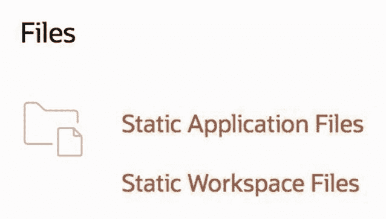

**图 3-20** 共享组件屏幕的文件部分

你有两个选项可供选择：`静态应用程序文件`或`静态工作区文件`。它们之间的区别在于可见性。应用程序文件只能被特定的应用程序引用，而工作区文件可以被工作区中的任何应用程序访问。无论你点击哪个选项，都将进入一个让你选择文件的屏幕。然后点击`上传`按钮进行上传。

要使用 HTML 的``标签显示你的图像文件，你必须指定其在服务器上的位置。然而，APEX 不会告诉你它存储图像文件的位置；相反，它为你提供了内置变量。有两个变量，`APP_IMAGES`和`WORKSPACE_IMAGES`，它们的值分别保存服务器上你的应用程序图像和工作区图像的路径。你使用**替换字符串**来访问这些变量的值。例如，我将员工照片上传到一个名为`employees.jpg`的文件，并将其在 APEX 中保存为应用程序文件。你也应该对你的图片做同样的操作。显示此文件的 HTML 标签是：

```

```

请注意此标签中句点字符的两种不同用法。第一个是替换字符串表示法的一部分，在页面渲染时将被替换为图像目录的路径；第二个是文件名的一部分。

考虑到这一点，看一下清单 3-4 中`快速链接`区域的源代码。

```
<a href="f?p=&APP_ID.:3:&SESSION.">
    
</a>
```

**清单 3-4** 快速链接区域的源代码

此代码使用``标签显示`employees.jpg`图像，然后使用`<a>`和`</a>`标签将此图像包装在链接中。因此，点击图像会将用户带到应用程序的第 3 页（这意味着在下一节创建第 3 页之前，该链接将不起作用）。

第 2 章讨论了使用图像作为应用程序徽标的可能性。为了演示这种可能性，我创建了一个"Employee Demo"文字的艺术化图像，将其保存在文件`Logo.jpg`中，并将其作为应用程序文件上传到 APEX。然后，我按照第 2 章的描述配置了应用程序的徽标。也就是说，我在应用程序主页点击了`编辑应用程序属性`按钮，点击了`用户界面`选项卡，并修改了`徽标`部分中的属性，如图 3-21 所示。徽标的截图如图 3-22 所示。


**图 3-22** 对应图 3-21 的徽标

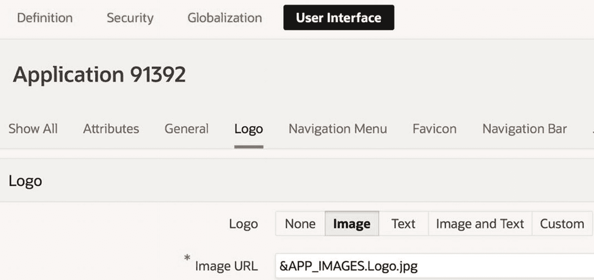

**图 3-21** 指定图像徽标

## 经典报表区域

在本章前面，当你在`区域练习`页面创建了一个源查询为`select * from DEPT`的报表时，你已经简要接触过经典报表区域。本节将更详细地探讨经典报表。`员工演示`应用程序的第 3 页包含两个区域，标题为`默认报表`和`格式化报表`。图 3-23 和图 3-24 显示了这两个区域的报表。

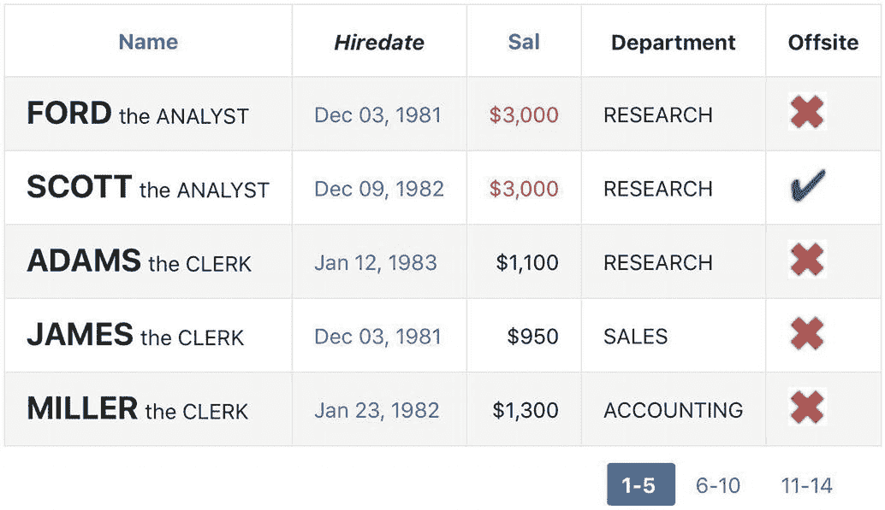

**图 3-24** 格式化的员工报表

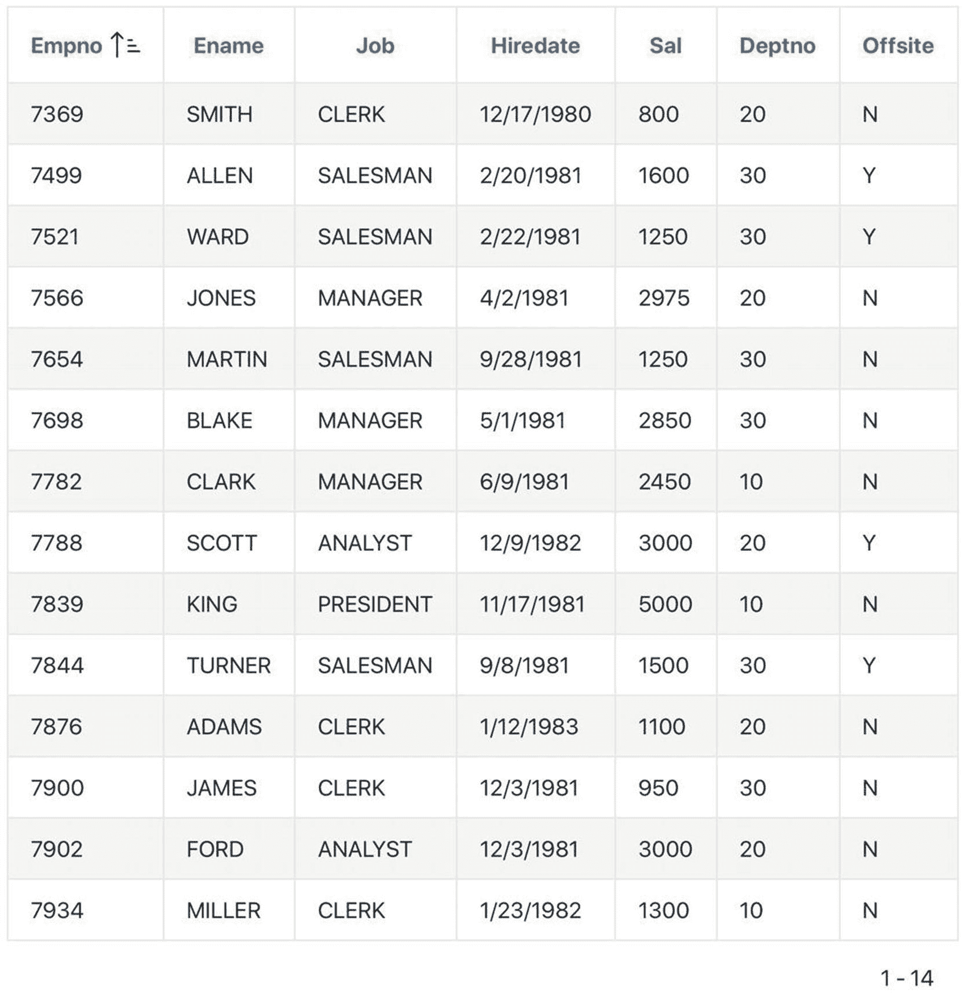

**图 3-23** 默认的员工报表

这两个报表具有相同的来源，即以下 SQL 查询：

```
select EmpNo, EName, Job, HireDate, Sal, DeptNo, Offsite
from EMP
```

格式化报表与默认报表的不同之处如下：

*   不显示`EmpNo`和`Job`列。
*   `EName`和`DeptNo`的列标题已被重命名，`Hiredate`的标题为斜体。
*   记录只能按员工姓名或工资排序。
*   员工姓名通过使用更大字体、加粗书写来突出显示，并包含员工的职位。
*   雇佣日期的格式与默认报表不同，并且是链接。
*   工资值被格式化为货币并右对齐，超过$2,500 的值显示为红色。
*   部门值显示为部门名称，而不是部门编号。
*   `Offsite`列的值显示为图像而不是文本。
*   一次显示的行数更少，带有分页控件。

本节将向你展示如何使用报表区域的特定类型属性（结合对 SQL 源查询的一些补充）来构建格式化报表。首先按照以下步骤操作：

*   创建一个名为`经典报表`的新空白页面，页面编号为 3。告诉向导也为该页面创建一个名为`经典报表`的导航菜单条目。
*   转到此页面的页面编辑器并创建两个新区域。将区域标题命名为`默认报表`和`格式化报表`，并将它们放置在页面的`内容主体`位置。
*   将每个区域的类型设置为`经典报表`，源查询为前面给出的查询。
*   配置它们的`布局`属性，使`格式化报表`区域开始一个新行。（或者，如果你希望报表并排显示，请设置属性使`格式化报表`不开始新行。）

此时，你的页面应该显示两个相同的区域，看起来像图 3-23。图 3-25 描绘了此页面最终渲染树的顶部，显示了`默认报表`区域的组件。（`格式化报表`区域的组件类似，因此省略。）请注意，APEX 为每个报表创建了几个组件：一个包含与类型无关的属性的组件（标有区域名称），一个包含报表特定属性的组件（标为`属性`），以及为报表的每一列包含列特定属性的组件。以下各节将探讨这些列特定和报表特定的属性。

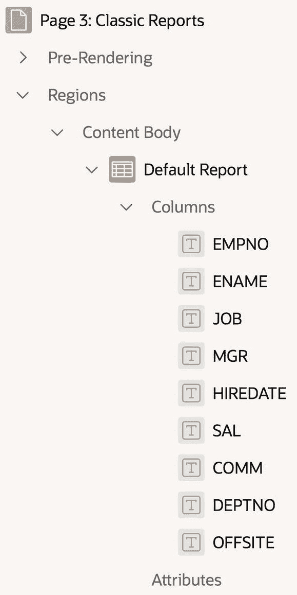

**图 3-25** 经典报表区域的渲染树

## 列特定属性

报表中的每一列都有自己的一组属性。当你在渲染树中选择一个列节点时，属性编辑器会显示其列特定属性。这些属性分为几个部分，接下来将进行讨论。

## 标识


图 3-26 展示了 `Identification`（标识）部分中的两个属性。`Column Name`（列名）属性是列的名称。列名直接来源于源查询，因此该值无法更改。

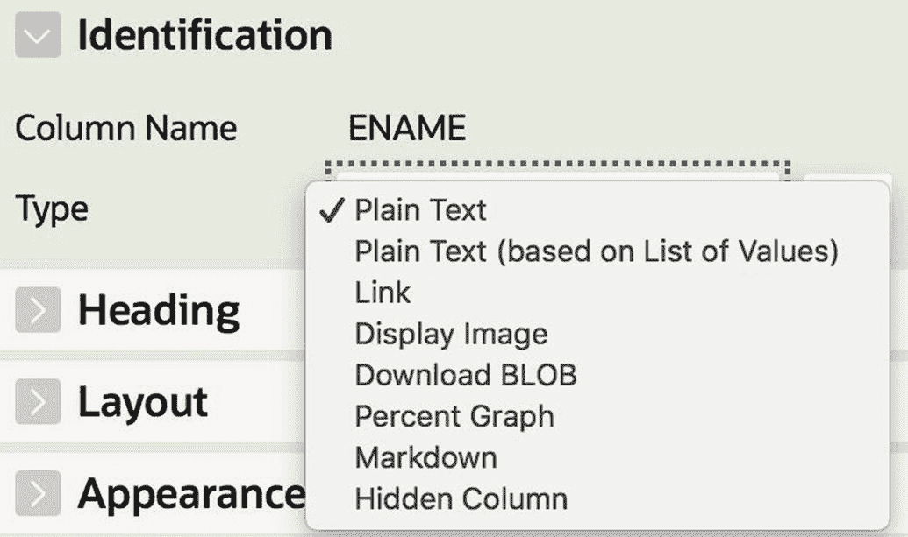

图 3-26 指定 ENAME 列的类型

## 标识

`Type`（类型）属性指定了 APEX 应如何显示列值。可能的类型值如图 3-26 所示。`Plain Text`（纯文本）类型是默认类型，表示按原样显示值。`Link`（链接）类型表示将值显示为链接，`Display Image`（显示图像）类型显示为图像，`Percent Graph`（百分比图）类型以图形方式显示。`Hidden Column`（隐藏列）类型表示完全不显示值。

在 `Default Report`（默认报表）区域中，所有列都是纯文本。`Formatted Report`（格式化报表）区域的列具有以下类型：`ENAME`、`SAL` 和 `OFFSITE` 是纯文本，`EMPNO` 和 `JOB` 是隐藏列，`HIREDATE` 是链接，而 `DEPTNO` 是基于值列表的纯文本。在你的应用程序中，你现在可以更改这两个隐藏列的类型。但是，你需要等到本章后面才能更改 `HIREDATE` 和 `DEPTNO` 的类型。

## 列标题

列的 `Heading`（标题）部分包含两个用于自定义列报表头的属性。`Heading` 属性包含在列标题中显示的值。默认情况下，这是列名，但可以更改。例如，在我的应用程序中，我将 `ENAME` 的标题更改为 `Name`（姓名），将 `DEPTNO` 的标题更改为 `Department`（部门）。

通常，`Heading` 的值可以包含 HTML 代码，例如格式化文本或图像。例如，图 3-27 屾示了我为 `HIREDATE` 标题编写的 HTML 代码，它使 APEX 以斜体显示字符串 `Hiredate`。

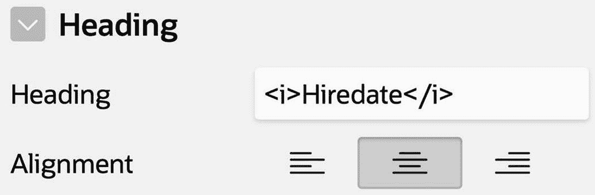

图 3-27 指定 HIREDATE 列的标题

默认情况下，列标题在列中居中对齐。这几乎总是你想要的。但是，如果出于某种原因这看起来合适，`Alignment`（对齐）属性允许你指定不同的对齐方式。

## 列布局

`Layout`（布局）部分包含两个用于自定义列显示的属性。`Sequence`（序列）属性决定了列在报表中出现的顺序。`Column Alignment`（列对齐）属性指定了列值的对齐方式。默认情况下，列值左对齐。图 3-28 显示了 `SAL` 列的 `Layout` 部分，其中对齐方式设置为右对齐。

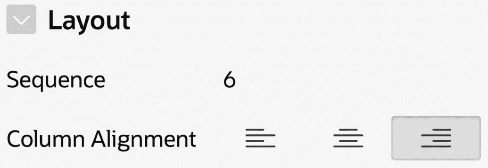

图 3-28 指定 SAL 列的布局

## 排序顺序

APEX 将排序问题分为两个方面：首次渲染报表时如何排序记录，以及用户是否可以通过单击列标题进行交互式重新排序。如果报表的源查询包含 `order by` 子句，则记录按该顺序排序，且用户无法更改。否则，这些方面由每个列的 `Sorting`（排序）部分中的属性决定。图 3-29 显示了 `ENAME` 的 `Sorting` 部分。

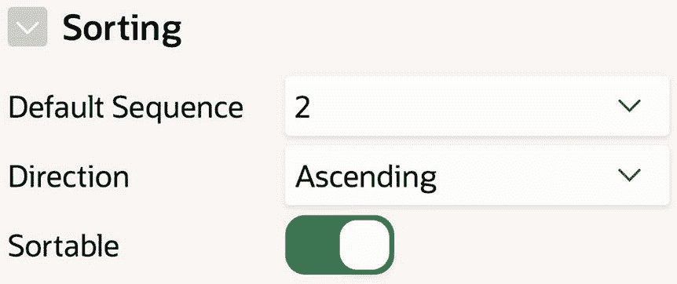

图 3-29 指定 ENAME 列的排序行为

`Default Sequence`（默认序列）属性指定了初始排序顺序。参与初始排序顺序的每一列都将有一个 `Default Sequence` 值，主排序列的值为 1。在图 3-29 中，`ENAME` 的序列是 2。图中未显示的是 `JOB` 的序列属性，其排序序列值为 1。它们共同意味着报表将按职位排序后呈现，而职位相同的两个员工将按姓名字母顺序列出（如你在图 3-24 中所见）。

`Sortable`（可排序）属性指定用户是否能够对列进行交互式排序。默认情况下，所有列都是可排序的。在 `Formatted Report` 区域中，我关闭了除 `ENAME` 和 `SAL` 之外所有列的可排序性。初始排序序列与可排序性完全无关。例如，`Formatted Report` 区域最初是按 `JOB` 列排序的，尽管该列甚至是不可见的。

## 值列表

考虑格式化报表中的 `DEPTNO` 列。它显示来自 `DEPT` 表的值，尽管报表只提到了 `EMP` 表。这是怎么回事？答案是列中的值没有改变；它们仍然是部门编号。但是，你可以建立部门名称与编号之间的对应关系，并告诉 APEX 显示给定部门编号对应的名称。返回值（部门编号）与其显示值（部门名称）之间的这种对应关系称为 *值列表*。

形式上，值列表是一个两列的表。第一列保存显示值，第二列保存相应的返回值。指定值列表的一种有用方式是使用 SQL 查询。例如，`DEPTNO` 列的值列表查询很简单：

```sql
select DName, DeptNo
from DEPT
```

当你将列的类型分配为 `Plain Text (based on List of Values)`（纯文本（基于值列表））时，属性编辑器会显示一个 `List of Values`（值列表）部分。图 3-30 显示了填入属性值后的该部分。

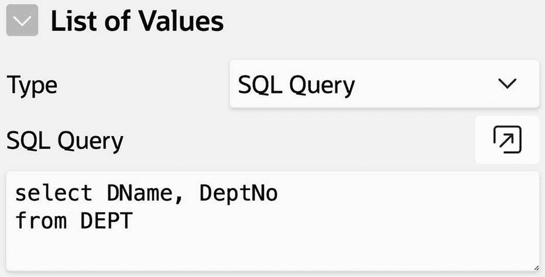

图 3-30 使用值列表格式化 DEPTNO 列

## 格式掩码

有时你可能希望将数字显示为具有特定格式的字符串。例如，你可能使用逗号分隔每三位数字，你可能规定小数点后的位数，或者你可能在数字前添加货币符号。日期值也可以用不同的格式书写。在每种情况下，你都可以使用 *格式掩码* 来表达你想要的格式。

列的 `Format Mask`（格式掩码）属性位于其 `Appearance`（外观）部分。图 3-31 显示了我如何为 `SAL` 填写该属性。右侧的图标是一个“快速选择”按钮。单击它会弹出一个常用格式列表；选择一种格式会将其掩码放入属性的文本框中。如果你不熟悉 Oracle 格式掩码语法，通过检查各种掩码可以获得相当的了解。例如，`9` 表示一个可选数字，`0` 表示一个必需数字，`G` 表示千位分隔符，`D` 表示小数点，等等。这样的理解使得可以修改掩码以满足你的需求。

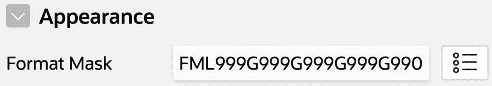

图 3-31 我为 SAL 设置的格式掩码

例如，为了获得 `SAL` 列的掩码，我从格式列表中选择了货币格式 $5,234.10，这产生了掩码 `FML999G999G999G999G990D00`。然而，由于 `EMP` 表以整美元存储工资值，我不想显示小数点及其右边的两位数字。所以我从掩码末尾删除了 `D00`。


## 日期格式掩码

`HIREDATE`的掩码创建方式类似。对各种日期格式掩码的检查表明，`DD`表示日期，`Mon`是月份的三字母缩写，`YYYY`是四位数的年份。我将这些元素组合起来，创建了所需格式的掩码，如图 3-32 所示。

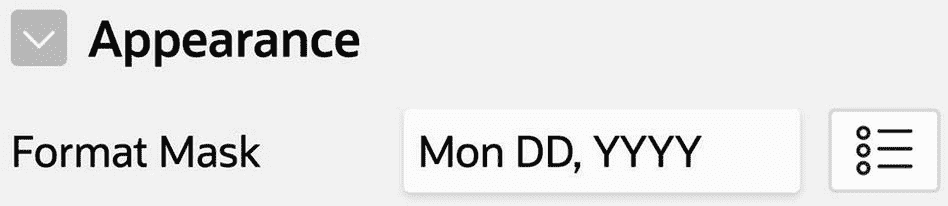

图 3-32
我为`HIREDATE`设置的格式掩码

关于格式掩码语法的完整描述，请在 Oracle SQL 文档中搜索“format models”。

## 列格式化

`纯文本`类型的列有一个名为`列格式化`的部分，其中包含一个名为`HTML 表达式`的属性。此属性允许您通过将列值包装在 HTML 表达式中来对其进行格式化。有关示例，请回顾图 3-24 中已格式化的`ENAME`列。每个员工的名字都以大号粗体显示，其后是该员工的职位。图 3-33 显示了与此格式对应的 HTML 表达式。

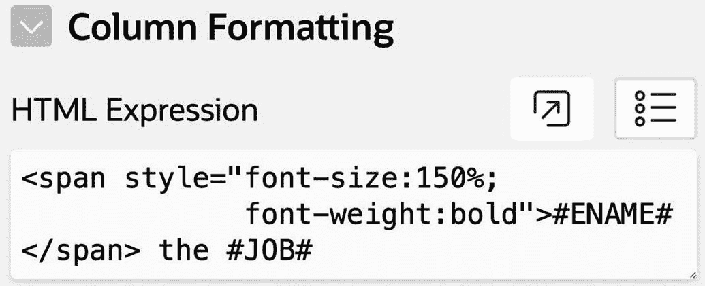

图 3-33
格式化`ENAME`列

这个表达式需要一些解释。首先，考虑一下您会为名为`FORD`的员工编写什么样的 HTML 表达式。要使名字变成大号粗体，可以将其放在`<b><big></big></b>`标签内。生成的表达式如下所示：

```
<b><big>FORD</big></b> the ANALYST
```

这个表达式几乎就是`HTML 表达式`值应有的样子——唯一的区别是员工的姓名和职位需要根据报表的每一行而变化。APEX 通过以下约定使其成为可能：对于名为`X`的列，术语`#X#`表示当前行中`X`的值。因此，您应该将上述表达式中的`FORD`替换为`#ENAME#`，将`ANALYST`替换为`#JOB#`，从而得到图 3-33 中的表达式：

```
<b><big>#ENAME#</big></b> the #JOB#
```

请注意，表达式`#JOB#`是有意义的，即使`JOB`列在报表中不可见。实际上，在报表中设置不可见列的常见原因之一，就是为了能在报表的其他地方使用它们的值。

### 链接列

图 3-24 中的`HIREDATE`值被格式化为链接。具体来说，点击一个雇佣日期（例如`Dec 03, 1981`）会将浏览器重定向到 URL [`http://www.infoplease.com/year/1981.html`](http://www.infoplease.com/year/1981.html)，该页面提供了当年的时事信息。

实现此功能的一种方法是用适当的 HTML 表达式包装雇佣日期。例如，1981 年 12 月 3 日的链接将是：

```
<a href="http://www.infoplease.com/year/1981.html" target="_blank">#HIREDATE#</a>
```

请注意，`<a>`标签的第二个参数是`target="_blank"``。这个参数导致目标页面在新的浏览器标签页中打开，这在本例中似乎是合理的。这个 HTML 表达式的问题在于，无论雇佣日期是什么，它总是重定向到 1981 年的页面。我们需要一种方法从雇佣日期中提取雇佣年份，不幸的是，这在 HTML 中无法实现。

然而，在 SQL 查询中提取年份是可行的。思路是让 SQL 源查询计算一个新列，其值为雇佣年份。以下查询可以完成这项工作：

```sql
select e.*, extract(year from e.HireDate) as HireYear
from EMP e
```

使用这个新的源查询的一个结果是，`HIREYEAR`现在将成为报表的一列。由于您不希望它在报表中显示，您应该将其类型设置为`隐藏列`。

将`格式化报表`区域的源修改为此查询后，您可以通过在其`HTML 表达式`属性中使用`#HIREYEAR#`来格式化`HIREDATE`列，如下所示：

```
<a href="http://www.infoplease.com/year/#HIREYEAR#.html" target="_blank">#HIREDATE#</a>
```

尽管此技术有效，但将列格式化为链接的更好方法是将其`类型`属性设置为`链接`。这样做会使属性编辑器显示一个`链接`部分。此部分包含`目标`属性，其初始值为`未定义链接目标`。点击该值会打开一个模态的`链接生成器`页面，在其中您可以指定目标是 APEX 应用程序的页面还是任意 URL。在本例中，选择`URL`并在出现的文本框中输入目标 URL，如图 3-34 所示。然后单击确定按钮返回属性编辑器。

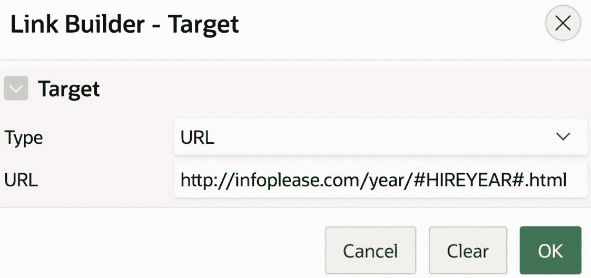

图 3-34
使用`链接生成器`页面

然后，您可以在链接部分输入`链接文本和链接属性`的适当值，如图 3-35 所示。请注意，您需要在链接生成器中输入 URL 的“http://”部分，即使`目标`属性不显示它。

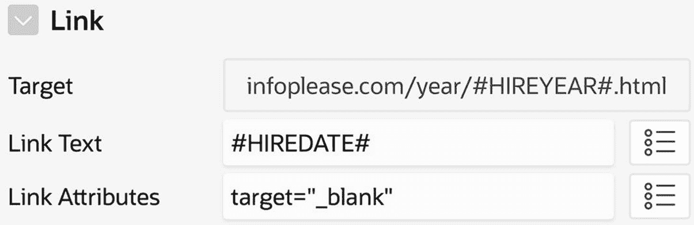

图 3-35
`HIREDATE`列的链接属性

## 条件格式化

回想一下，图 3-24 将超过 2500 的薪资显示为红色。使用`HTML 表达式`属性将`SAL`值格式化为特定颜色是相当容易的。例如，以下表达式使所有薪资值变为红色：

```
<font color="red">#SAL#</font>
```

但是，如何编写一个表达式使得只有部分值变为红色呢？因为 HTML 本身无法执行计算，您必须再次依赖 SQL 来完成。思路是让 SQL 源查询计算另一个新列，名为`SalColor`，其值为薪资值的颜色。以下是所需的查询（新代码以粗体显示）：

```sql
select e.*, extract(year from e.HireDate) as HireYear,
case when e.Sal>2500 then 'red' else 'black' end as SalColor
from EMP e
```

将`格式化报表`区域的源更改为使用此查询后，您可以通过将以下代码分配给`SAL`列的`HTML 表达式`属性来格式化该列：

```
<font color="#SALCOLOR#">#SAL#</font>
```

您可以对`OFFSITE`列应用相同的技术。在格式化报表中，`Offsite`值如果其值为**Y**则显示绿色对勾图片，否则显示红色对勾图片。假设这两张图片已保存为 APEX 应用程序文件`checkgreen.jpg`和`checkred.jpg`。（您可以从 Apress 网站下载这些文件。）那么，值为**Y**时应格式化为以下 HTML 表达式：

```

```

值为**N**时应格式化为：

```

```

区分这两个文件名的方法是扩展 SQL 源查询，使其计算一个新列，名为`OffsiteImage`，其值为`'checkgreen.jpg'`或`'checkred.jpg'`。SQL 查询现在如下所示（新代码以粗体显示）：

```sql
select e.*, extract(year from e.HireDate) as HireYear,
case when e.Sal>2500 then 'red' else 'black' end as SalColor,
case when e.Offsite = 'Y' then 'checkgreen.jpg'
else 'checkred.jpg' end as OffsiteImage
from EMP e
```

将报表的源更改为该查询后，您可以通过将以下代码分配给`OFFSITE`列的`HTML 表达式`属性来格式化该列：

```

```

最后，您应该将`SALCOLOR`和`OFFSITEIMAGE`列的类型设置为`隐藏列`。

## 报表特定属性

现在是考虑经典报表特定属性的时候了。这些属性与渲染树中区域的`属性`节点相关联，并处理分页和记录分组等问题。图 3-36 显示了`格式化报表`区域的`布局`和`分页`部分。

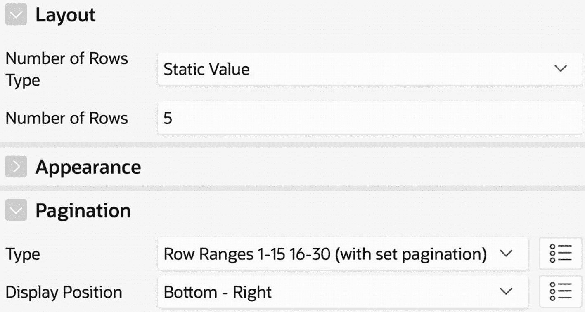


## 图 3-36 经典报表区域的报表特定属性

`行数`属性指定一次显示报表的多少行。默认值为`15`，但我在`格式化报表`区域中将其改为了`5`。分页`类型`属性允许您选择分页控件的格式。图中所示的选项用于图 3-24 中的`格式化报表`区域。理解其他选项的最佳方式是在你的报表上逐一尝试，观察其效果。

## 使用源查询进行格式化

尽管前面的章节重点介绍了如何使用 APEX 格式化源查询的行，但重要的是要意识到，通过使用更精确的源查询，你也可以获得许多相同的功能。以下是`格式化报表`演示区域的一些示例。

与其隐藏一列，不如直接在查询中不包含它可能更合适。特别是，`EmpNo`列在格式化报表中没有作用，最好完全排除在其源查询之外。另一方面，`Job`、`SalColor`、`OffsiteImage`和`HireYear`列是格式化其他列所必需的，因此它们必须出现在源查询中，并且必须是`隐藏列`类型。

与其在属性编辑器中更改列的标题，不如在源查询中更改列的名称。一个例子是`EName`列，它被重命名为`Name`。替代方法是在源查询中使用`AS`关键字，如下所示：

```
select EName as Name, ...
from EMP
```

如果你不希望用户能够以交互方式更改记录的排序顺序，在源查询中指定排序顺序比单独设置每个列的可排序性属性更容易。

与其使用值列表来格式化`DeptNo`列，你可以修改源查询，使其成为`EMP`和`DEPT`表的连接，如下所示：

```
select e.EName as Name, ..., d.DName, ...
from EMP e join DEPT d
on e.DeptNo = d.DeptNo
```

在这种情况下，很难说这两种方法哪个更好。值列表方法需要 APEX 为报表的每一行搜索值列表，这可能比直接进行连接的开销更大。另一方面，值列表方法更简单，更直接地传达了设计者的意图。

经验法则是，源查询应指定你想要显示的*内容*，而列属性应指定你想要显示的*方式*。在某些情况下（例如隐藏列），这种区分是明确的。在其他情况下（例如使用值列表），则不那么明确。

## 图表区域

*图表*是显示数据点的可视化方式。一个数据点由两个值组成：x 坐标（称为*标签*）和 y 坐标（称为*值*）。例如，让我们构建一个名为`Charts`的页面，它将是应用程序的第 4 页。此页面包含两个图表区域，如图 3-37 和 3-38 所示。

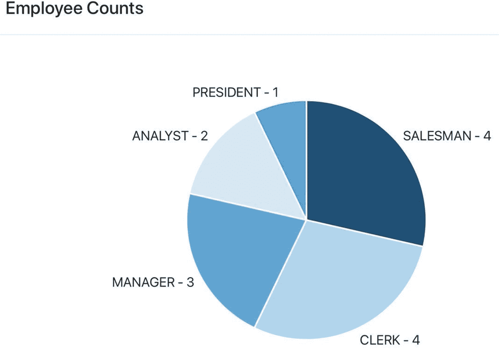

图 3-38 员工计数图表区域

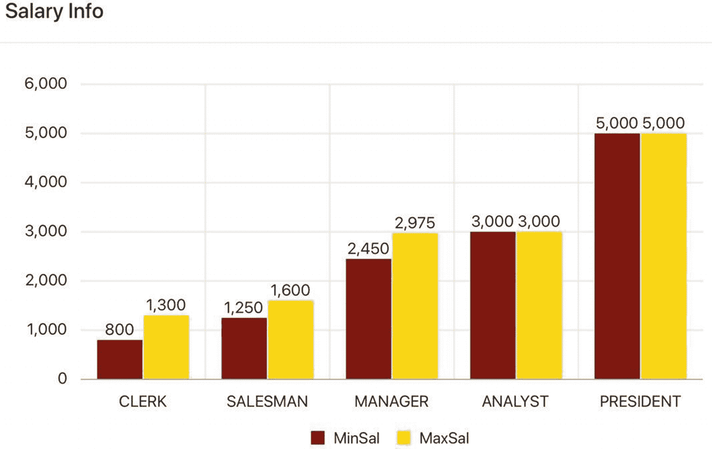

图 3-37 薪资信息图表区域

柱状图由十个数据点组成，给出了每种职位员工的最低和最高工资。这些点被组织成两个*系列*，每个系列五个点。

饼图由五个数据点组成，每种职位一个。每个点的标签是职位的名称，值是拥有该职位的员工数量。图表为每个标签显示一个饼图扇区，其大小与其值成比例。例如，十四名员工中有两名是分析师，因此`ANALYST`扇区的大小是整个饼图大小的十四分之二。

## 创建图表区域

要构建此页面，首先创建一个名为`Charts`的新空白页面，并向其添加两个类型为`图表`的区域。将第一个区域命名为`薪资信息`，第二个区域命名为`员工计数`。图 3-39 显示了这些区域最终的渲染树。

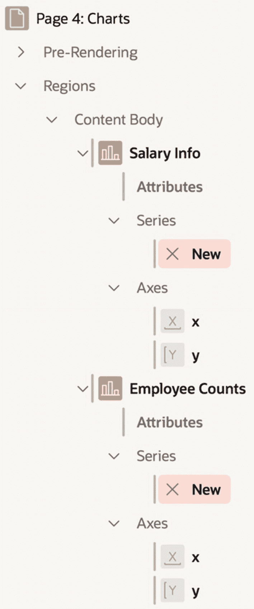

图 3-39 两个图表区域的渲染树

从该图中，你可以看到图表有四种属性：类型无关属性（由区域名称表示）、图表特定属性（由`属性`表示）、每个图表系列特定的属性（由`系列`表示）以及与图表轴相关的属性（由`轴`表示）。默认情况下，创建图表时带有一个系列（名为`新建`），但你可以重命名该系列并添加其他系列。

图 3-39 中的每个系列都标有红色错误指示器，告诉你图表需要进一步配置。接下来将讨论此配置的细节。

### 配置图表

每个图表都需要一个*源*，这是一个指定图表数据点的表达式。常见的源是 SQL 查询。

如果图表有 N 个系列，那么查询将有 N+1 列——一列包含标签，其他列包含每个系列的值。例如，`薪资信息`系列的源查询如下：

```
select Job, min(Sal) as MinSal, max(Sal) as MaxSal
from EMP
group by Job
order by MinSal
```

你指定图表源的方式类似于指定报表源的方式。图表的`源`部分包含你需要的三个属性。图 3-40 显示了`薪资信息`区域这些属性的值。

你还应该对你的`员工计数`区域进行类似的更改，使用以下源查询：

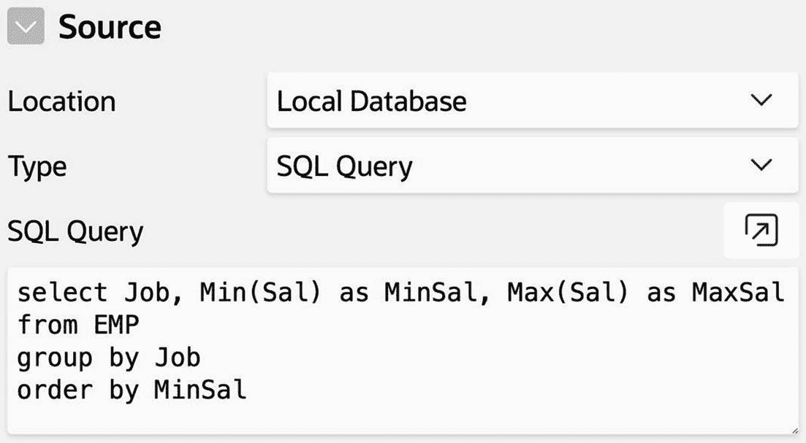

图 3-40 指定薪资信息图表的源

```
select Job, count(*) as EmpCount
from EMP
group by Job
order by EmpCount desc
```

### 配置图表系列

配置图表的源之后，你可以配置它的每个系列。系列的相关属性位于其`标识`、`源`和`列映射`部分。图 3-41 显示了为`薪资信息`创建的系列的这些部分。

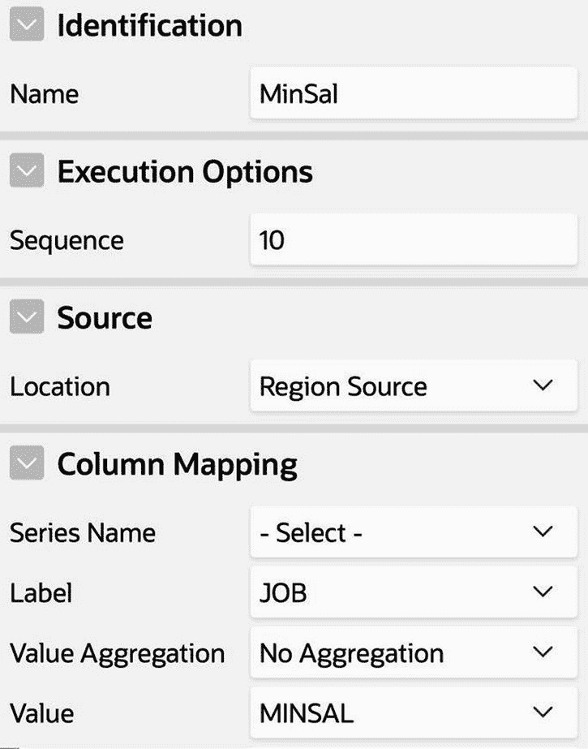

图 3-41 为薪资信息图表指定一个系列


## APEX 图表配置与自定义

### 配置单个系列

`Identification`（标识）部分允许您为系列选择一个名称。由于此系列将保存每个职位的最低工资，我将其命名为 `MinSal`。（您还需要创建另一个系列来保存最高工资，但现在还不需要。）

`Source`（源）部分用于指定系列的数据源。由于您已经为该区域定义了一个源，因此应选择 `Region Source`（区域源）。另一个选项（此处不讨论）是让每个系列定义自己的源。这种灵活性在比较来自不同表的数据时很有用，但会导致复杂性超出本书讨论范围。

`Column Mapping`（列映射）部分要求您为属性 `Label`（标签）和 `Value`（值）指定值。`Label` 值将是保存标签的源列的名称，在本例中为 `JOB`。`Value` 值将是保存此系列值的源列的名称，在本例中为 `MINSAL`。

在配置好 `Salary Info`（薪资信息）系列后，您应该参考图 3-41 的模型来配置 `Salary Info` 图表的系列。完成后，错误指示应从您的页面中消失，您应该能够保存它。如果运行该页面，您应该获得如图 3-42 所示的输出。这些图表相当不错，但需要进行自定义。接下来将讨论这个主题。

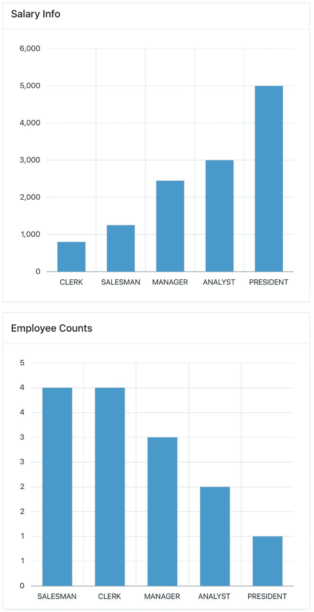

**图 3-42** 图表页面的初步效果

### 多系列图表

`Salary Info` 区域当前有一个系列，用于显示每个职位的最低工资。您可以轻松创建第二个系列来显示每个职位的最高工资，步骤如下。在区域的渲染树中右键单击 `Series`（系列）节点，然后选择 `Create Series`（创建系列）。然后像配置前一个系列一样配置该系列：将系列重命名为 `MaxSal`，并适当地设置其源和列映射。结果应如图 3-43 所示的多系列图表。

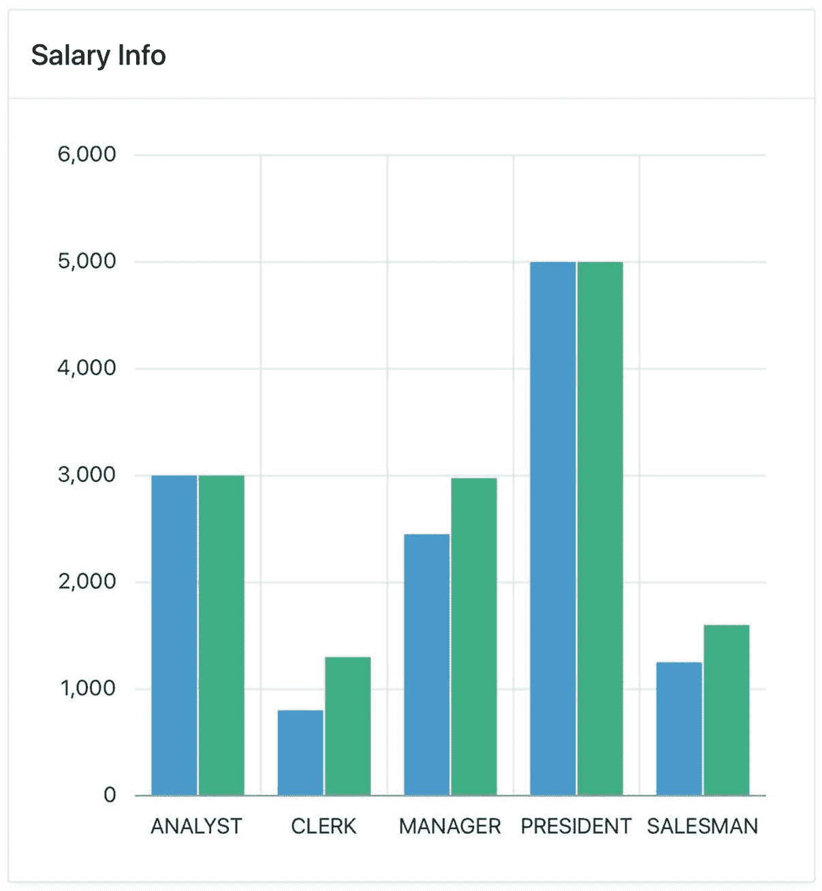

**图 3-43** 向图表添加第二个系列

虽然数据看起来不错，但请注意图表现在是按 `Job`（职位）排序，而不是按 `MinSal`（最低工资）排序。发生了什么？问题源于 APEX 允许每个系列定义自己的源，而这种灵活性会带来显著的复杂性。（如果源的标签集不同怎么办？如果它们的排序顺序不同怎么办？）因此，APEX 有两种图表渲染算法：一种是忽略这些复杂性的简单算法，另一种是需要单独定义的排序顺序来解决复杂性的复杂算法。图 3-44 展示了相关属性。图表的 `Attributes`（属性）节点包含一个 `Multi-Series Chart Data`（多系列图表数据）部分，其中有两个属性。`Fill Gaps in Chart Data`（填充图表数据中的间隙）属性指示是使用简单算法还是复杂算法。其默认值为 `on`，表示使用复杂算法；将其关闭则指定简单算法。`Sort Order`（排序顺序）属性在 `Fill Gaps`（填充间隙）属性为 `on` 时可见，以便您可以指定图表的排序顺序。

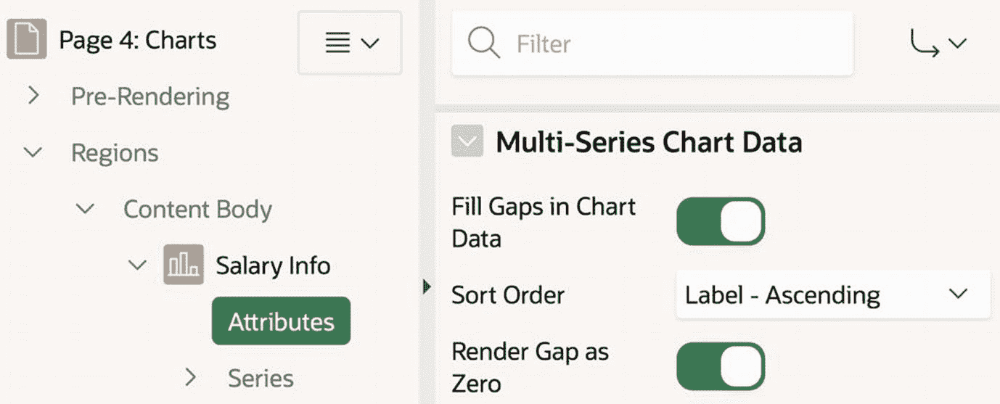

**图 3-44** 多系列图表数据属性

幸运的是，如果您的图表中所有系列都使用相同的源，这种复杂性就无关紧要了。您只需关闭 `Fill Gaps in Chart Data` 属性，排序就会恢复正常。

### 自定义图表

APEX 支持多种图表类型。新图表的默认类型是条形图，但您可以使用 `Chart`（图表）部分（来自渲染树的 `Attributes` 组件）进行更改。例如，转到您的 `Employee Counts`（员工计数）区域的 `Chart` 部分，将其图表类型更改为 `Pie`（饼图）。

APEX 会自动为条形图中的每个系列分配一种颜色。它在选择图表颜色方面做得相当不错，但有时您想自己选择。每个条形图系列在其 `Appearance`（外观）部分都有一个 `Color`（颜色）属性，如图 3-45 所示。您可以键入标准颜色的名称（如“maroon”），可以从右侧的快速选择菜单中选择常用颜色，或者可以使用颜色选择器从色轮中选择颜色。图 3-37 中的 `Salary Info` 图表指定了系列颜色 `MAROON`（栗色）和 `GOLD`（金色）。

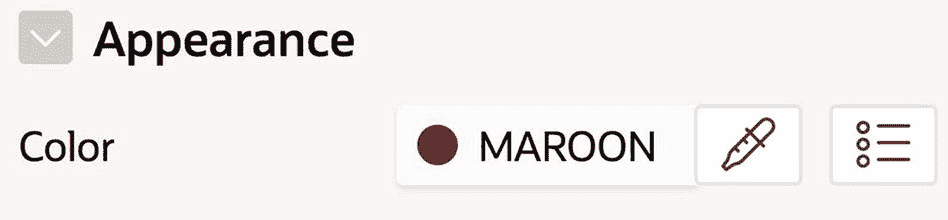

**图 3-45** 指定条形图系列的颜色

APEX 还为饼图的每个标签值分配一种颜色，使用一组鲜艳的颜色。但假设您想要一个不同的调色板。如何使用图 3-45 中的 `Color` 属性并不立即明了，因为它适用于整个系列。例如，如果将颜色设置为 `MAROON`，那么饼图中的每个段都将是栗色。您需要的是一种为每个标签指定颜色的方法。

思路是更改图表的源代码，如下所示：

```sql
select Job, count(*) as EmpCount,
case job when 'ANALYST'   then '#D6EAF8'
         when 'CLERK'     then '#AED6F1'
         when 'MANAGER'   then '#5DADE2'
         when 'PRESIDENT' then '#3498DB'
         when 'SALESMAN'  then '#1B4F72'
         end as JobColor
from EMP
group by Job
order by EmpCount desc;
```

`JobColor` 列计算每个职位的颜色。指定的颜色值对应于图 3-38 所示的蓝色调色板。图 3-46 显示了 `Salary Info` 图表修改后的 `Source` 部分。

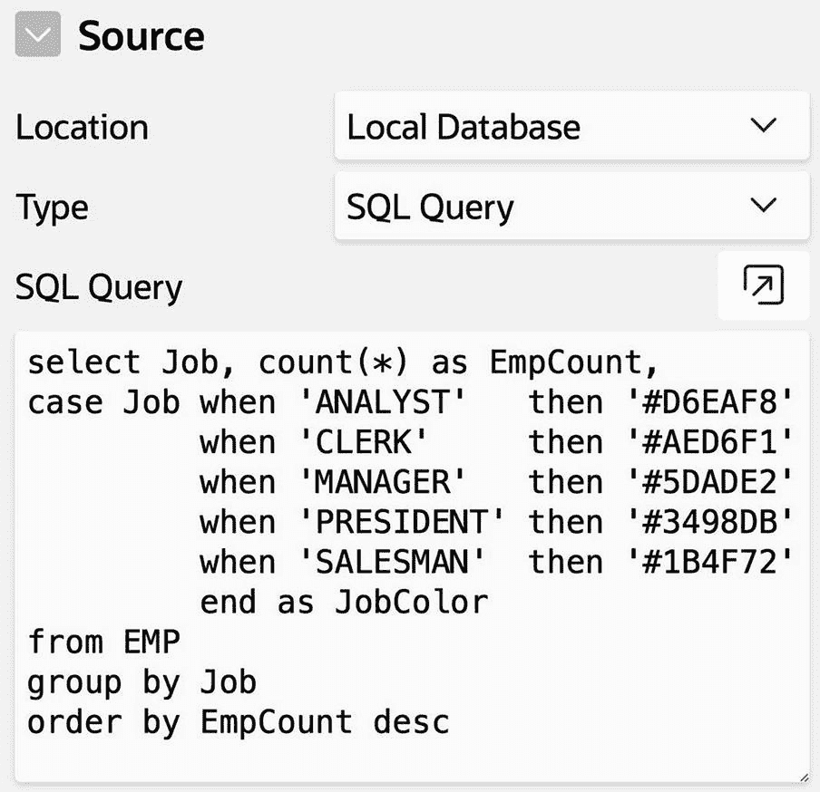

**图 3-46** 修改饼图源代码以包含颜色

`JobColor` 的值可以在 `Color` 属性中使用，如图 3-47 所示。请注意对 `JobColor` 的引用是作为替换字符串编写的。

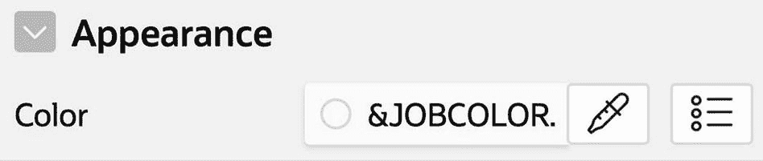

**图 3-47** 指定饼图颜色

自定义图表的另一种方法是显示图例（legend）。例如，图 3-37 在图表下方显示了一个图例。图例解释了图表上每种颜色的含义。多系列图表使用图例来传达每个系列的含义。饼图使用图例来标识各个段。因此，图 3-38 不需要图例，因为标签值直接显示在每个段旁边。

在 APEX 中，指定图例的属性位于 `Legend`（图例）部分，该部分属于区域的 `Attributes` 节点。图 3-48 显示了该部分的顶部。

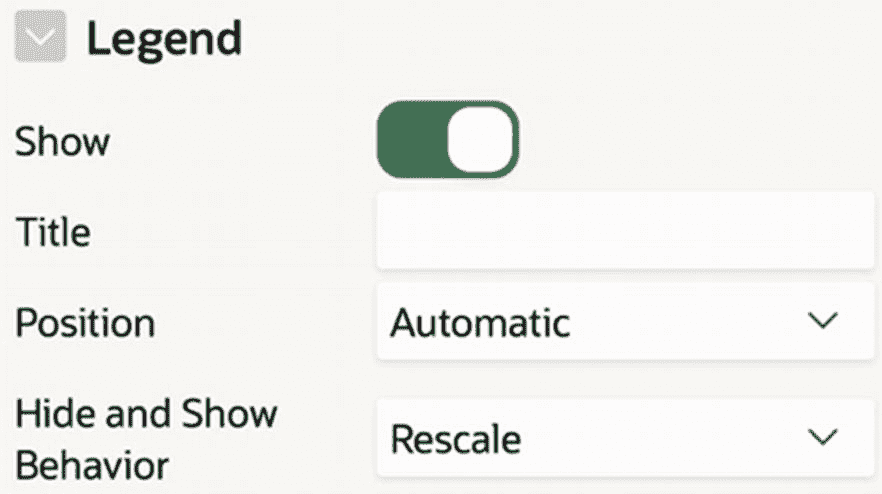

**图 3-48** 部分图表图例属性


## 图表属性配置

最重要的属性是 `Show`，它控制图例在页面上的可见性。通常其他属性使用默认值就足够了，但你应该尝试各个选项来看看效果。特别值得注意的是 `Hide and Show Behavior`。如果其值为 `None`，则点击图例没有任何作用。否则，在图例上点击某个系列名称会切换该系列在图表中的可见性，并相应地重新计算图表。这种行为对于饼图尤其有趣，因为图例标识的是扇区而非系列。作为一个实验，请启用 `Salary Info` 图表的图例，并将 `Hide and Show Behavior` 的值设置为 `Rescale`。然后运行页面，点击一些图例值，观察图表如何自我调整。

另一种图表定制方式是直接在图表中显示数据值。例如，在图[3-37]中，最低和最高薪资显示在其条形图的上方。在图[3-38]中，员工数量和标签名称显示在每个扇区的外部。相关属性位于系列属性的 `Label` 部分。图[3-49]展示了我是如何为饼图填写这些属性的。

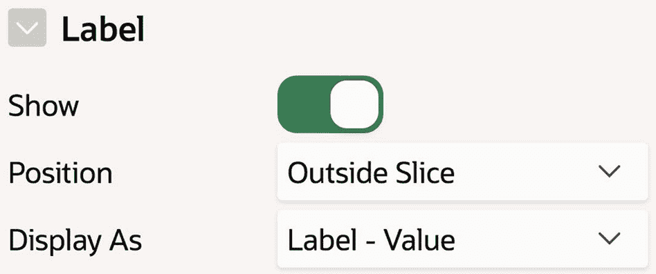

图 3-49 饼图的标签属性

最后，我想简要提一下控制条形图 X 轴和 Y 轴的属性。这些属性涉及轴的显示方式——多久显示一个刻度线、如何格式化显示的值、Y 值的范围是多少等等。通常默认值就足够了，但有时需要定制。一个例子可以在图[3-42]的 `Employee Counts` 图表中找到。请注意它的 Y 轴标签有重复。原因是网格标记以 0.5 递增，但标签只显示为整数。这种情况如图[3-50]和[3-51]所示。

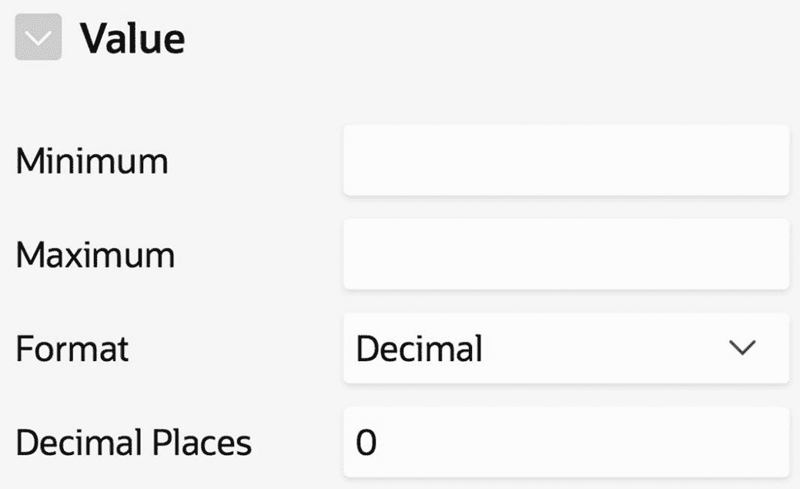

图 3-50 配置 Y 轴上的值

图[3-50]中的 `Decimal Places` 属性值为 `0`，意味着 APEX 将把 Y 轴标签显示为整数。如果你将 `Decimal Places` 的值改为 1，那么你会看到 Y 轴标签实际显示为 0.0, 0.5, 1.0 等值。然而，这样的图表没有任何意义，因为计数必须是整数。一个更好的解决方案是更改图[3-51]中的 `Minimum Step` 属性。该属性告诉 APEX 刻度线之间可以有多近。默认情况下，该值为空，允许 APEX 选择任何步长值。你需要将该属性值设置为 1，以便 Y 轴标签具有 0, 1, 2 等值。

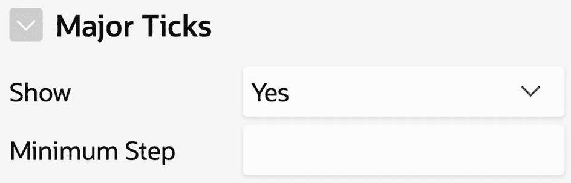

图 3-51 配置何时显示 Y 轴刻度线

APEX 有许多图表配置属性。理解它们的最好方法是进行实验。通过以各种方式更改属性来编辑这两个图表。例如，移动图例位置、更改配色方案和背景、在图表上包含或移除标签或值等等。

## 交互式报告区域

前面的章节探讨了页面设计者如何使用属性来定制经典报表和图表，以改善用户体验。而*交互式报告*允许用户在查看页面时自行执行部分此类定制。

图[3-52]展示了一个未经格式化的、原始的交互式报告区域。为了创建它，我创建了一个名为 `Interactive Reports` 的新空白页面，这是 `Employee Demo` 应用程序的第 5 页。然后我在其中创建了一个名为 `Employees` 的新区域，类型为 `Interactive Report`，并具有以下源查询：

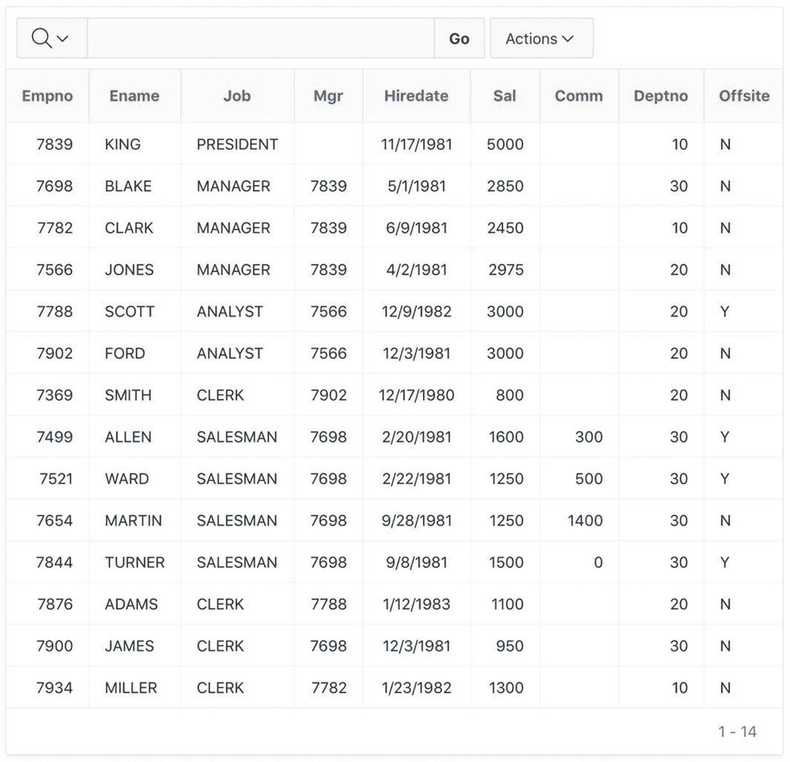

图 3-52 基于 EMP 表的交互式报告区域

```sql
select * from EMP
```

交互式报告区域有一个默认模板，与你之前看到的其它报表类型不同。那些区域使用了 `Standard` 模板，而图[3-52]使用的是 `Interactive Report` 模板。最明显的区别是 `Interactive Report` 模板不会在顶部显示其标题。

注意

像往常一样，你可以从属性编辑器的 `Appearance` 部分更改区域的模板。

除了区域模板，图[3-52]看起来很像经典报告区域。事实上，经典报告区域的所有属性也适用于交互式报告区域——你可以指定区域在页面上的位置、其源查询以及每列的格式。如果需要，你可以配置此区域，使其看起来与图[3-24]的格式化报告完全一样。然而，为了更好地关注交互式报告特有的定制功能，我将保持其未经格式化。

图[3-52]中的一个新功能是报告上方的一行项目，称为*搜索栏*。搜索栏允许用户通过过滤行、隐藏列、排序、创建图表以及对其值执行简单计算来交互式地定制报告。虽然图中未显示，但交互式报告也可以显示一个*链接列*，允许用户单独检查报告行。

接下来的章节将讨论与搜索栏和链接列相关的问题——特别是它们如何使用以及应用程序设计者如何配置它们的属性。

## 使用搜索栏

搜索栏包含四个项目：放大镜、文本框、`Go` 按钮和 `Actions` 按钮。前三个项目允许用户过滤报告的行。用户在文本框中输入搜索字符串，点击放大镜选择要搜索的列（也可以选择 `All Columns`），然后点击 `Go`。不包含搜索文本的记录将从报告中过滤掉。

例如，在文本框中输入 **82** 并选择 `Hiredate` 列，其效果是过滤出所有在 1982 年入职的员工。图[3-53]显示了生成的区域。

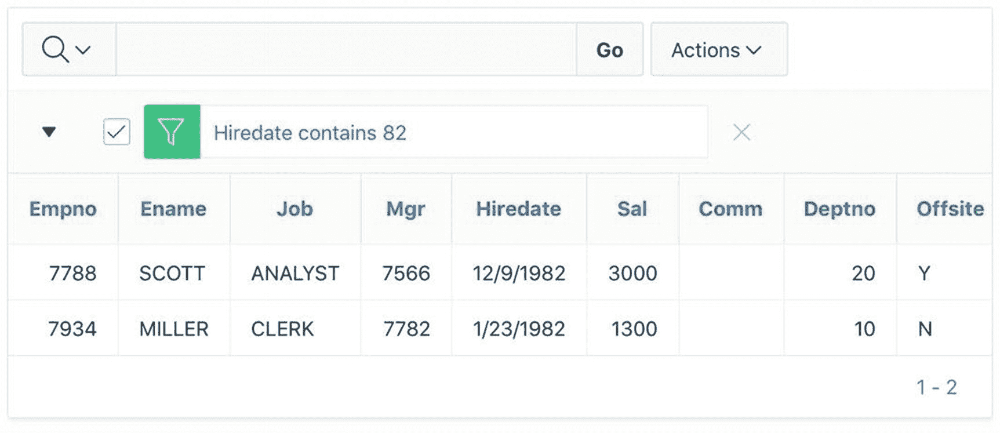

图 3-53 过滤图[3-52]报告后的结果

请注意，该区域现在在搜索栏下方有一行描述该过滤器。你可以点击左侧的复选框来启用/禁用它，或者点击右侧的 X 来永久删除它。

可以同时使用多个过滤器。例如，要查找 1982 年入职且在外工作的员工，你需要为 `Offsite` 列添加另一个过滤器。结果如图[3-54]所示。

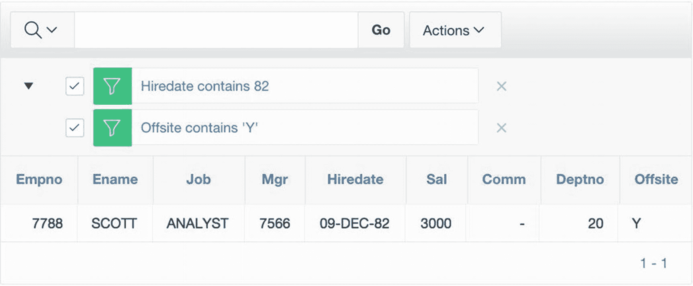

图 3-54 在图[3-53]的报告中添加第二个过滤器

通常，用户可以通过创建多个过滤器并有选择地启用各种过滤器子集来探索报告的内容。


`操作`按钮允许用户进一步自定义报告。点击该按钮会显示其可执行操作的菜单。该菜单出现在图 3-55 中，展示了`数据`操作的子菜单。以下章节将描述这些操作中较为实用的部分。

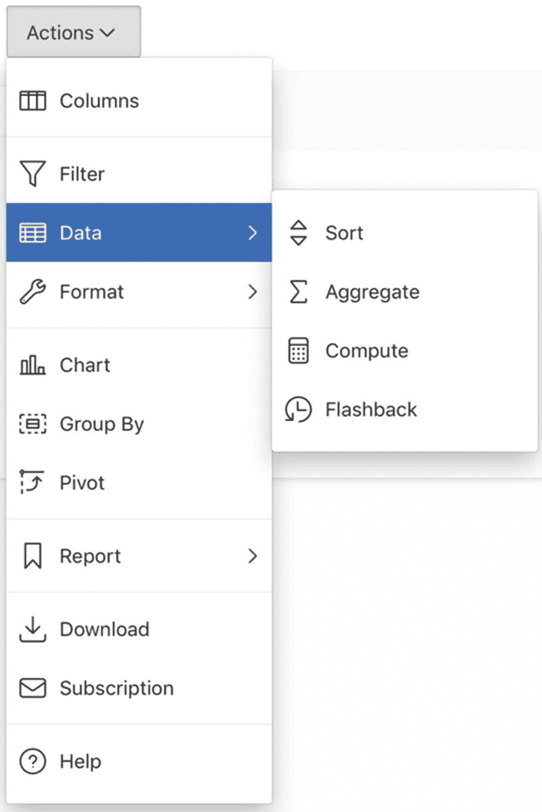

图 3-55 操作菜单

### 列

选择`列`操作会弹出一个模态对话框，用户可以在其中选择要在报告中显示的列及其顺序；图 3-56 展示了一个选择显示`Ename`、`Job`、`Hiredate`和`Sal`列的示例。

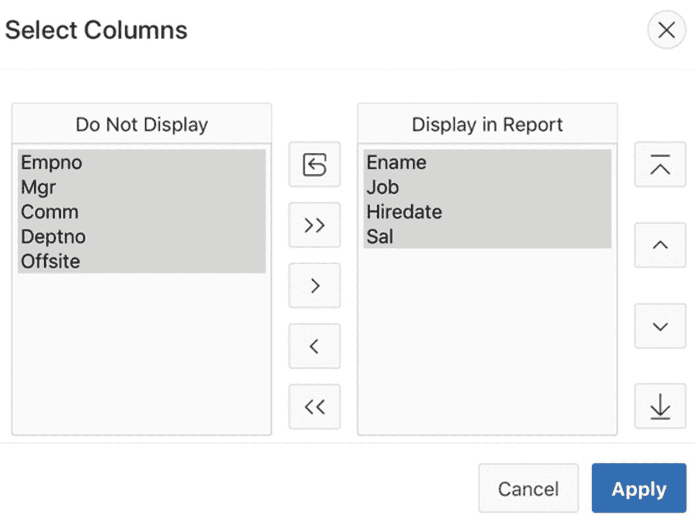

图 3-56 指定要显示的列

### 筛选器

选择`筛选器`操作会弹出一个模态对话框，用户可以在其中创建筛选器；参见图 3-57。它产生的筛选器类似于您为图 3-53 和 3-54 创建的筛选器。不同之处在于，之前的筛选器只能检查文本包含关系，而此对话框允许使用多种操作类型。例如，图 3-57 中指定的筛选器是 `Job!='CLERK'`。

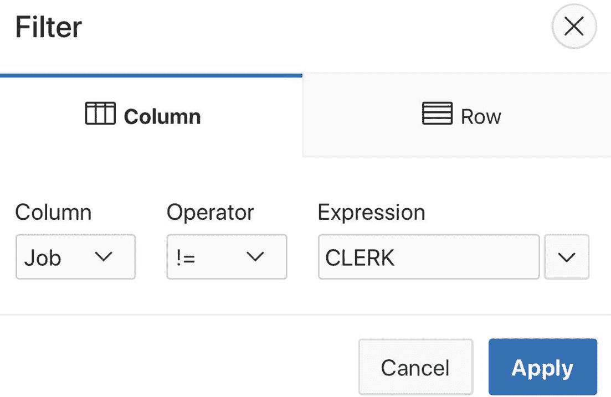

图 3-57 筛选器对话框

### 排序

选择`排序`操作会弹出一个模态对话框，用户可以在其中选择所需的排序顺序；参见图 3-58。用户选择要排序的列以及排序方向是升序还是降序。该图显示了选择排序列的菜单。请注意，用户可以对可见列和隐藏列进行排序。

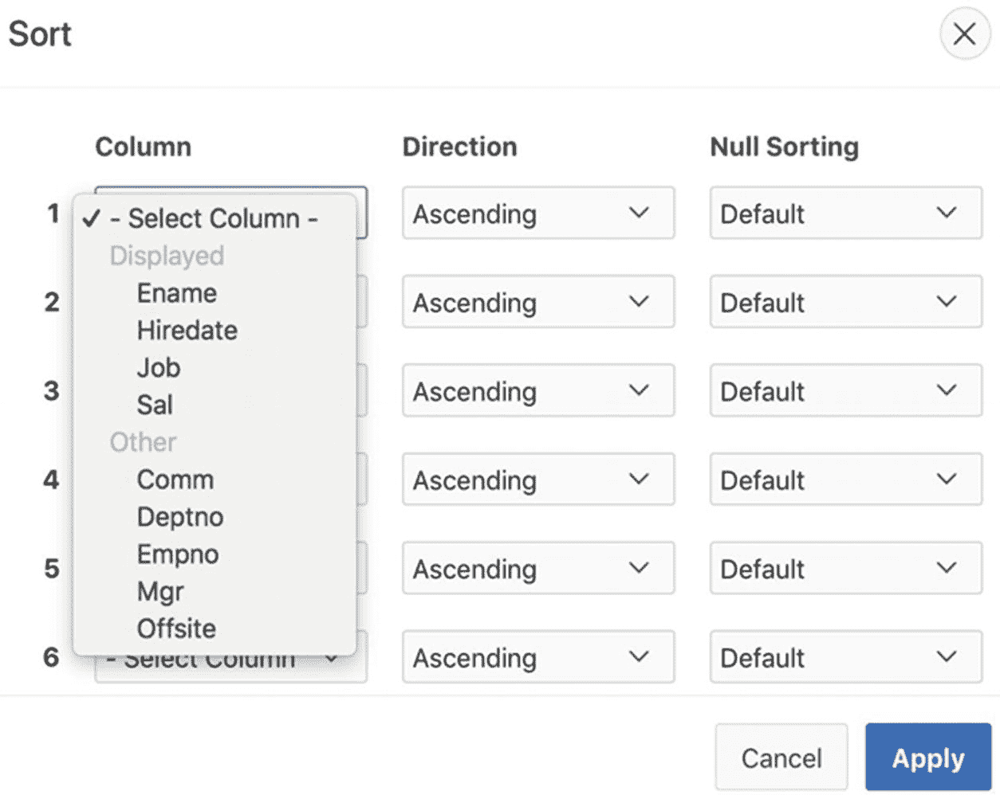

图 3-58 排序对话框

### 突出显示

`突出显示`操作位于`格式`子菜单中。它允许用户突出显示满足指定条件的行或单元格。回想一下，图 3-24 中的格式化经典报告将高薪值显示为红色。这是一种突出显示的形式。`突出显示`操作允许用户轻松实现这种以及其他形式的突出显示。

选择`突出显示`选项会弹出图 3-59 所示的模态对话框。`突出显示条件`的值指定了关注的数值。如果`突出显示类型`的值是`单元格`，则这些数值被突出显示；如果是`行`，则包含这些数值的行被突出显示。突出显示可以涉及背景色、文本色或两者。该图显示了与图 3-24 对应的突出显示设置。

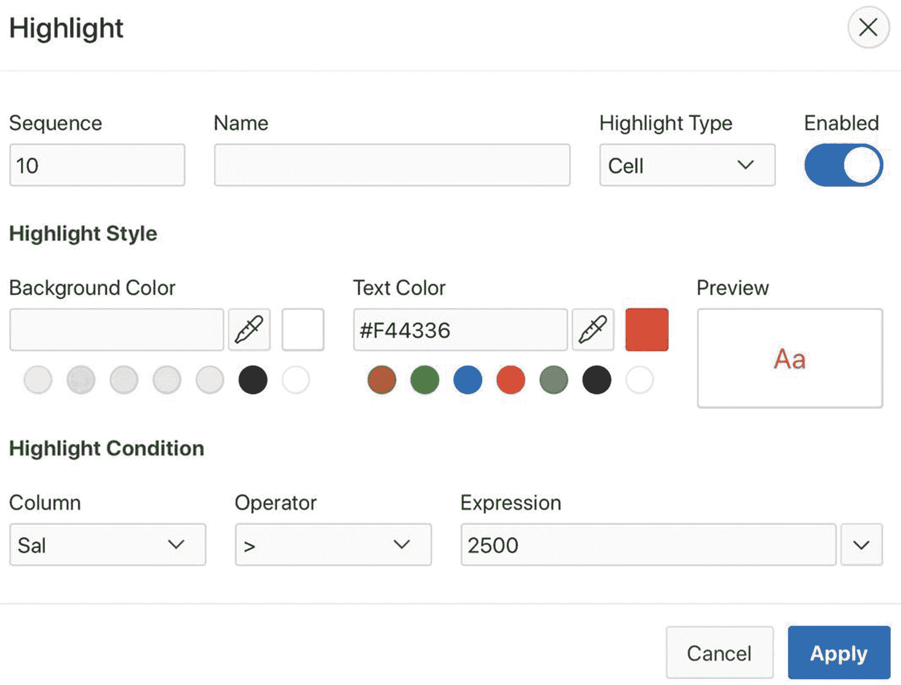

图 3-59 突出显示对话框

### 每页行数

`每页行数`操作也位于格式子菜单中。它允许用户随意更改报告的分页方式。点击菜单项会显示一个子菜单，用户可以从一系列可能的每页行数中进行选择。

### 图表

选择`图表`操作会弹出一个模态对话框，用户可以在其中基于报告中的数据创建图表；参见图 3-60。

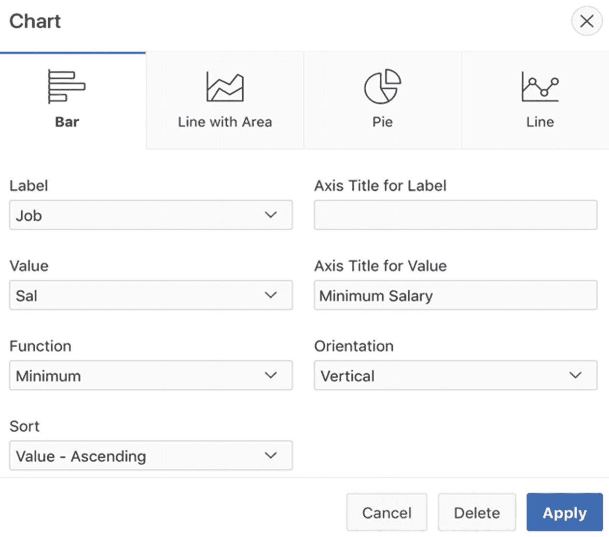

图 3-60 图表对话框

通过此对话框，用户可以创建对单个列进行聚合的单系列图表。该图指定了一个柱状图，显示每个职位的最低薪资，类似于图 3-37 中显示的柱状图。生成的图表出现在图 3-61 中。

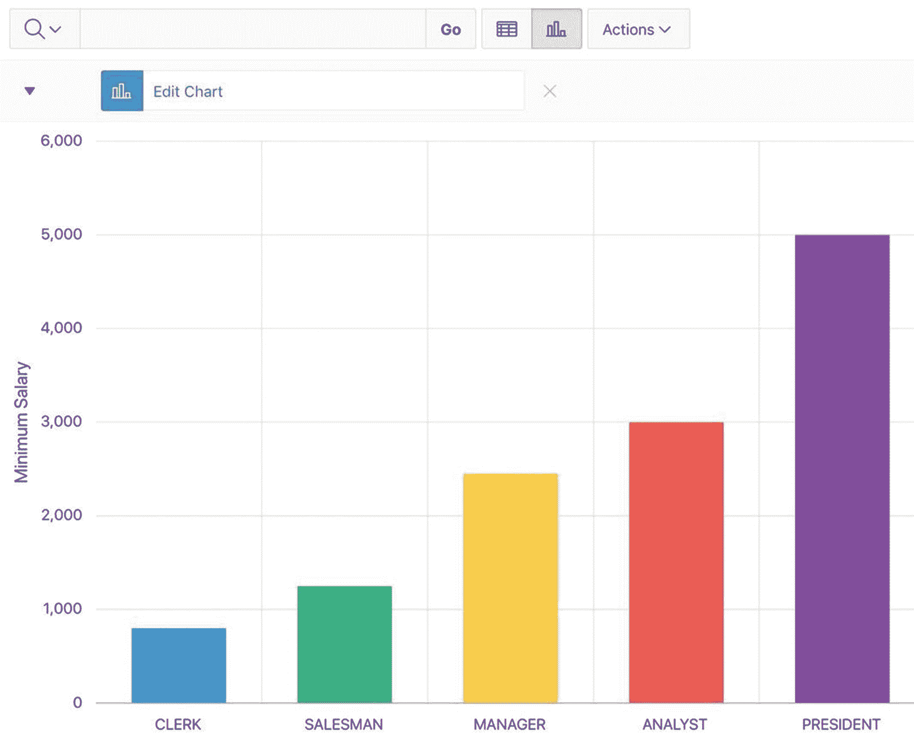

图 3-61 交互式图表

此图中有两点值得注意。首先，图表的许多方面是不可自定义的。例如，图表只能有一个系列，并且调色板是固定的。其次，搜索栏已扩展，在`操作`按钮左侧增加了两个报告/图表按钮。用户可以使用这些按钮在交互式报告及其图表之间切换。

### 配置搜索栏

搜索栏具有许多功能。然而，并非所有应用程序都需要全部功能。交互式报告区域具有允许应用程序开发人员限制此功能的属性。本节将考察这些属性。

图 3-62 显示了`交互式报告`页面及其交互式报告区域`Employees`的渲染树。请注意，此树具有与经典报告相同的结构（参考图 3-25），即`属性`组件包含报告特定的属性，而`列`文件夹包含每个列的属性。

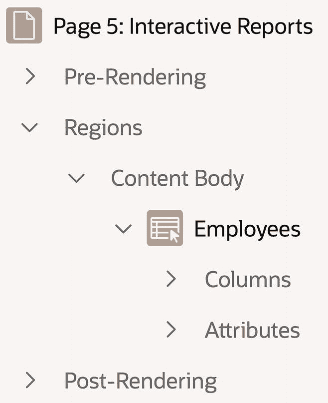

图 3-62 交互式报告页面的渲染树

`属性`节点的属性编辑器包含两个相关部分：`搜索栏`和`操作菜单`。图 3-63 显示了`搜索栏`部分的属性。这些属性让您可以选择性地显示搜索区域的不同部分。例如，关闭`包含搜索栏`属性会完全禁用该栏，关闭`搜索字段`则仅启用`操作`按钮，依此类推。

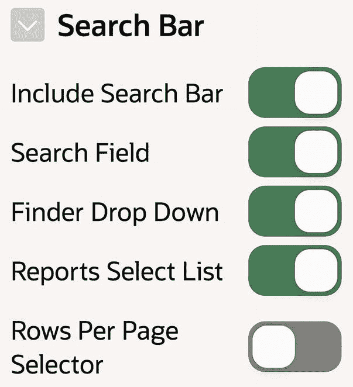

图 3-63 用于配置搜索区域的属性

图 3-64 显示了`操作菜单`部分的前几个属性。这些属性让您可以指定菜单中显示的操作。（由于篇幅所限，并非所有属性均已显示。）

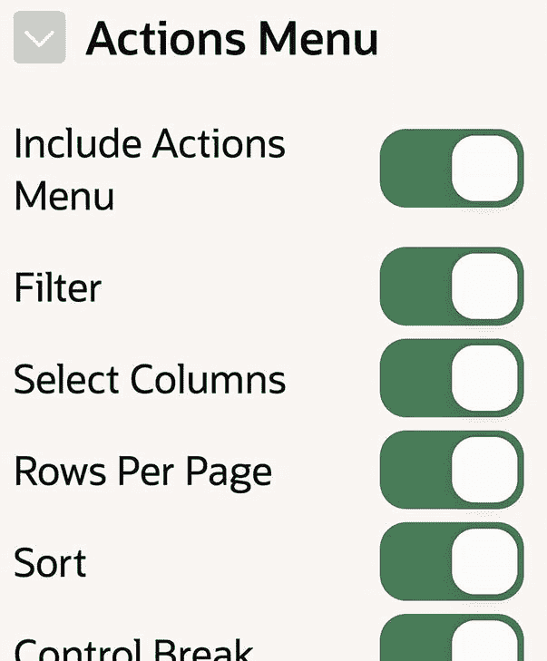

图 3-64 操作菜单部分的部分属性

最后，交互式报告的每个列都有用于配置其特定功能的属性。这些属性出现在该列的`允许用户`部分中，如图 3-65 所示。（同样，由于篇幅所限，并非所有属性均已显示。）

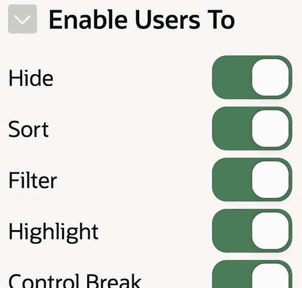

图 3-65 某列“允许用户”部分的部分属性

### 链接列

交互式报告可以显示一个特殊的列，其值是一个链接。点击此链接可在`单行视图`中显示报告。也就是说，报告会变为仅显示该行的值；它还显示供用户移至下一行或上一行的导航按钮以及一个返回原始报告的按钮。图 3-66 显示了带有链接列的交互式报告。图 3-67 显示了点击 `BLAKE` 的链接后报告的单行视图。请注意，此单行视图显示所有列，而不仅仅是报告中显示的列。


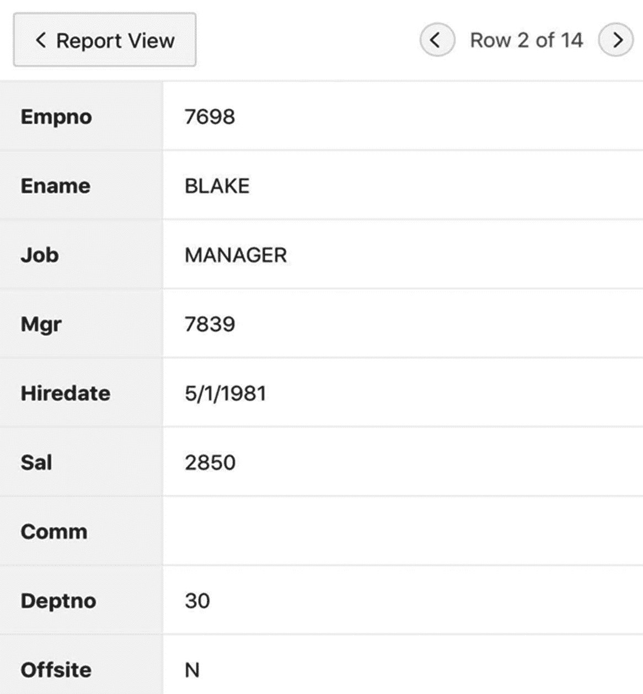
图 3-67 单行视图下的交互式报表

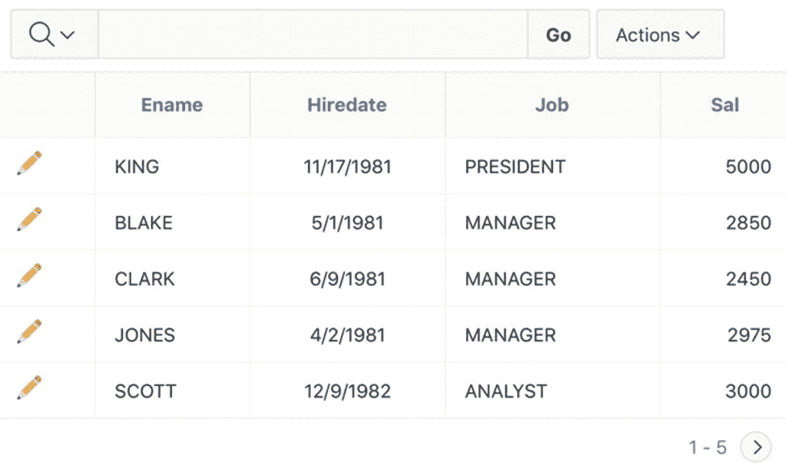
图 3-66 带有链接列的交互式报表

该区域的`属性`组件的属性编辑器包含两个部分——`链接`和`单行视图`——用于启用链接列并配置其行为。`链接`部分的属性如图 3-68 所示。

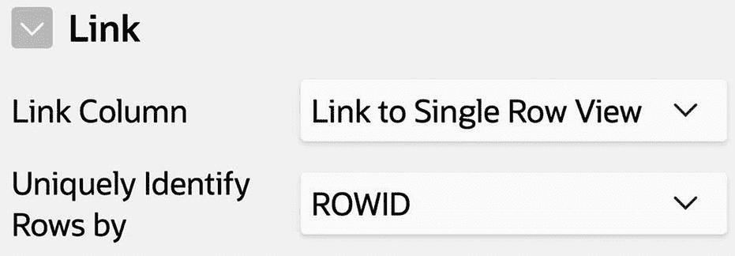
图 3-68 用于启用单记录视图的属性

要启用链接列，请将`链接列`属性的值设置为`链接到单行视图`。（您也可以将其设置为链接到任意 URL，但这个选项通常不那么常用。）然后，您必须指定单击链接时应选择哪一行。值`ROWID`表示使用被点击的行，这是最自然的选择。

图 3-69 展示了`单行视图`部分。这里一个有趣的属性是`仅显示的列`：启用它表示单行视图应显示与报表相同的列；禁用它则表示应显示所有列。

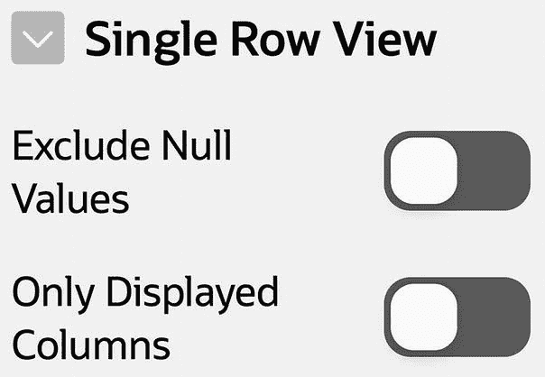
图 3-69 单行视图属性

## 本章小结

本章重点介绍了 APEX 区域的设计与使用。您首先研究了创建区域的不同方法、指定其在页面上位置所需的属性以及其外观和感觉。然后，您探索了四种常见的区域类型：`静态内容`、`经典报表`、`图表`和`交互式报表`。您了解了如何使用每种类型的区域，以及如何利用其类型特定的属性来有效地进行格式化。

静态内容区域主要用于显示 HTML 代码。您研究了与 APEX 相关的相对引用的细微差别——特别是如何引用存储在 APEX 服务器上的图像以及如何链接到当前应用程序的页面。这些相对引用依赖于某些 APEX 内置变量的值，如`APP_IMAGES`和`APP_ID`。您了解了如何使用`替换字符串`来访问这些变量的值。

经典报表区域显示 SQL 查询的输出。您了解了如何使用 APEX 属性来自定义区域的显示方式。其中，列的`HTML 表达式`属性尤为有用，它允许您通过将列值包装在 HTML 表达式中来进行格式化。您还了解了如何通过修改报表的源查询来执行条件格式化。

图表区域显示图表。您了解了如何使用 SQL 查询来指定图表内容，以及如何利用属性来配置图表的外观。

交互式报表区域显示报表，类似于经典报表区域。交互式报表在两个方面有所不同。首先，其搜索栏使用户能够以交互方式自定义报表。其次，其链接列允许用户以单记录模式查看报表。您研究了这些功能提供的功能，并将其与使用经典报表和图表区域可能实现的功能进行了比较。您还了解了应用程序开发人员如何根据需要，通过设置交互式报表区域的属性来仅启用部分功能。

## 4. 导航

Web 应用程序的用户应能轻松地在其页面间导航。您在使用 APEX 时已经遇到过三种导航功能：链接、面包屑和导航菜单。本章将详细研究这些功能，并向您展示在应用程序中使用它们的不同方式。

### 列表

在通常的表述中，`列表`就是事物的集合。然而，在 APEX 中，列表是链接的集合。列表是一个有用的导航工具，原因显而易见：单击链接会带您进入新页面。

以 APEX 列表的一个好例子来说，再次考虑 SQL Workshop 主屏幕，如图 1-3 所示。它的`创建对象`区域是一个列表，可快速访问各种对象创建向导页面。该列表为每种 SQL 对象类型设有一个条目，其链接将带您进入该对象的创建向导。

另一个例子是`员工演示`应用程序的主页，如图 3-17 所示。它的`参考`区域是一个包含链接的列表，这些链接将带您访问选定的网页。

也许列表最显著的例子是导航菜单。它的每个条目都是一个链接，可带您进入应用程序的指定页面。

APEX `列表管理器`让您可以查看、编辑和创建列表。要访问列表管理器，请从应用程序的主屏幕开始，单击页面顶部的大`共享组件`按钮。搜索`导航`部分并单击`列表`。您将被带到列表管理器的主屏幕，如图 4-1 所示。

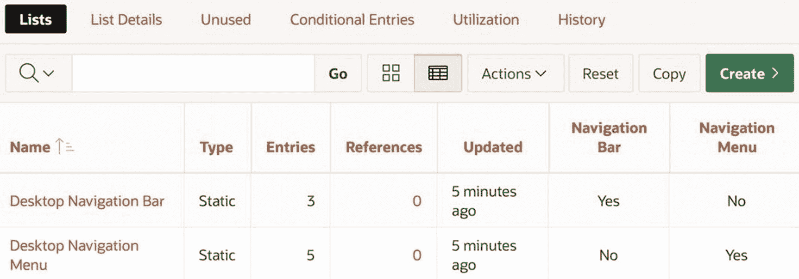
图 4-1 列表管理器

该图显示应用程序已有两个列表：`桌面导航栏`和`桌面导航菜单`。APEX 以特殊方式处理这些列表——它们的条目分别显示在导航栏（横跨页面顶部）和导航菜单（沿页面左侧向下）中。

### 查看列表详情

单击列表的名称（或选择屏幕顶部的`列表详细信息`链接）将带您进入`列表详细信息`屏幕。图 4-2 显示了`桌面导航菜单`列表的此屏幕。

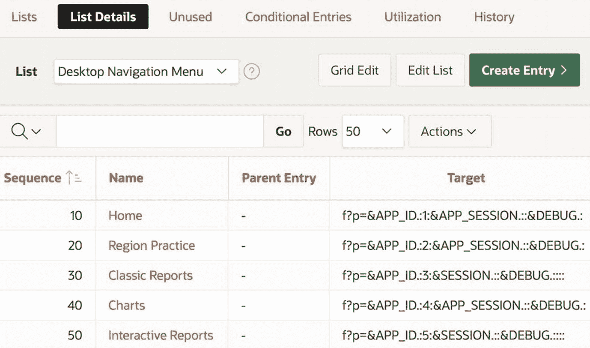
图 4-2 桌面导航菜单列表的详细信息

该屏幕显示了所选列表中每个条目的信息。最相关的值是`序列`、`名称`和`目标`。

*   序列号决定条目在列表中出现的顺序。
*   条目的名称指定其在列表中的显示方式。
*   条目的目标是单击链接时调用的 URL。

请注意图中每个目标 URL 都指向当前应用程序的一个页面，使用了第 2 章描述的语法。该语法的一个新方面是字符串`&DEBUG.`，它作为每个 URL 的第五个参数出现。URL 的这一部分指定应用程序应继续使用当前的调试模式（这是一个次要问题，本书中忽略）。

### 编辑列表条目

`列表详细信息`屏幕中每个条目的名称都是一个链接。单击某个条目的链接将带您进入`列表条目`屏幕，您可以在其中编辑该条目的值。图 4-3 显示了单击`区域实践`条目后出现的此屏幕的一部分。

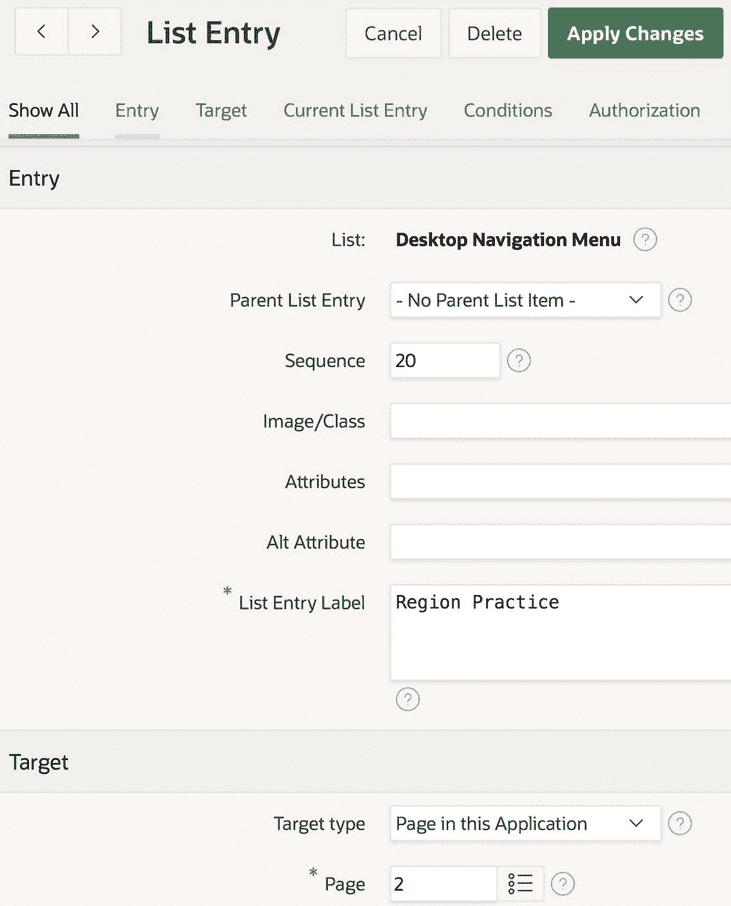
图 4-3 区域实践页面的列表条目屏幕


## APEX 导航与列表配置

### 修改导航菜单项

这里相关的属性是 `Sequence`、`List Entry Label` 和 `Page`。
作为实验，请更改这些属性的值——例如，将 `Sequence` 设置为 `60`，将 `List Entry Label` 设置为 `Fun with Regions`。然后运行应用程序。导航菜单现在应该如图 4-4 所示。特别是，原先标题为 `Region Practice` 的条目现在标题为 `Fun with Regions` 并出现在最后。

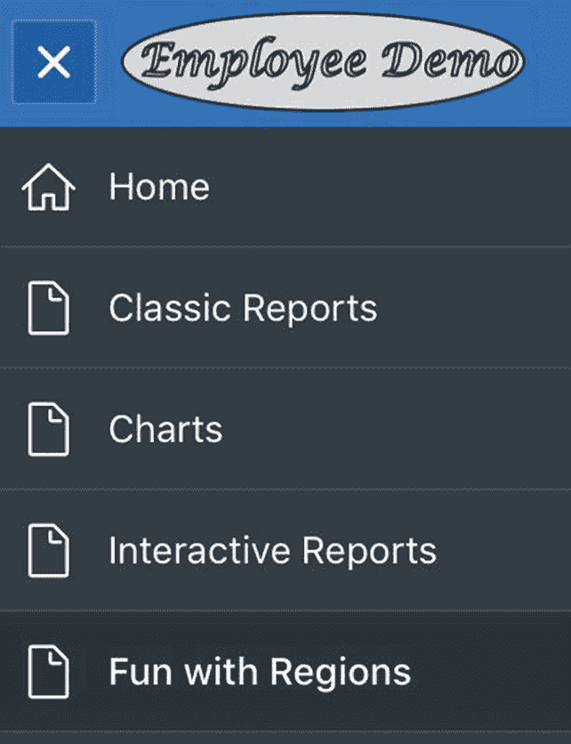

**图 4-4** 修改后的导航菜单

### 创建新的列表条目

现在请关注 `Desktop Navigation Bar` 列表。APEX 应用程序中的导航栏横跨每个页面的顶部。默认情况下，导航栏左侧显示徽标，右侧显示当前用户名（如第 2 章图 2-8 所示）。导航栏的总体意图是提供常用任务的快速链接。例如，徽标实际上是主页的链接，而用户名是一个菜单，其中包含一个链接到注销用户的存储过程。导航栏通常包含用于显示站点地图、在线帮助或联系信息的链接。

要查看导航栏的实现方式，请转到 `Desktop Navigation Bar` 列表的 `List Details` 屏幕；如图 4-5 所示。该列表包含三个条目。第一个条目显示用户名，第二个是一个无趣的分隔符，第三个是注销存储过程的链接。这些条目是分层组织的，这正是创建菜单结构的方式。用户名条目是父项，因此显示为菜单。注销条目是其子项，因此显示为菜单条目。分层列表将在本章后面详细讨论。

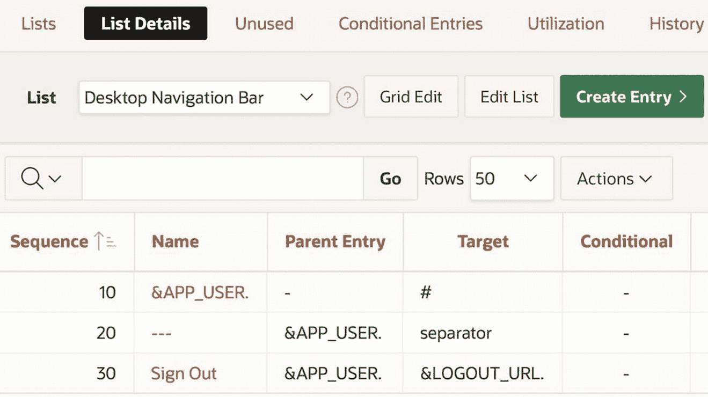

**图 4-5** Desktop Navigation Bar 列表的详细信息

让我们修改导航栏，使其拥有两个新条目：一个指向本书网页的链接和一个指向 `Contact Info` 页面的链接。要创建其他条目，请单击 `Create Entry` 按钮。然后将显示 `List Entry` 屏幕，如图 4-6 所示。请注意，此屏幕与图 4-3 基本相同，只是其按钮用于条目创建而非更新。

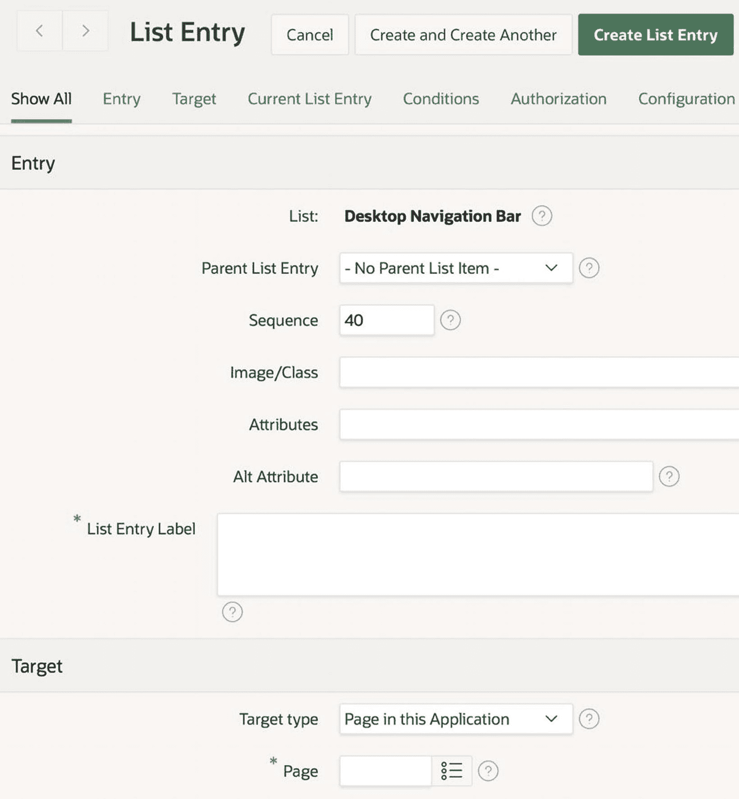

**图 4-6** 用于创建列表条目的 List Entry 屏幕

要创建指向本书网页的链接，您只需输入 `List Entry Label` 属性的值（我输入了 `Get the Book`）并设置目标。这里，目标是一个 URL，因此您需要将 `Target type` 属性设置为 `URL`，并将其 `URL Target` 属性设置为 [`www.apress.com/9781484261651`](http://www.apress.com/9781484261651)。
然后点击 `Create List Entry`。
既然如此，您也可以立即创建指向 `Contact Info` 页面的链接，尽管该页面尚不存在。假设它将是第 6 页，创建一个新的列表条目，将其 `List Entry Label` 设置为 `Contact Us`，`Target type` 设置为 `Page in this Application`，`Page` 值设置为 `6`。然后返回应用程序的主页。

现在创建 `Contact Info` 页面。当然，您可以按照自己的意愿设计页面。但只需创建一个包含单个 `Static Content` 区域的空白页面，其源是简单的文本消息即可。为了多样化，我将页面定义为 `modal dialog`，并将该区域的 `Template` 属性设置为 `Alert`。图 4-7 显示了单击 `Contact Us` 链接后的应用程序。请注意，`Contact Info` 页面不需要在导航菜单中有条目，因为它已在导航栏中有一个条目。

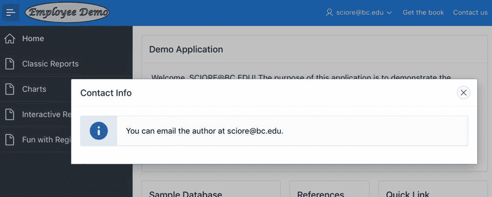

**图 4-7** 在导航栏上使用 Contact Us 链接

### 创建新列表

让我们创建一个列表来保存主页上 `References` 区域的三个链接。返回到图 4-1 的列表管理器屏幕。点击 `Create` 按钮将打开 APEX 列表创建向导。此向导有四个屏幕。在第一个屏幕上，选择 `From Scratch` 创建列表。在第二个屏幕上，给列表起一个名字（例如，**References**），并将其类型设置为 `Static`。

第三个屏幕让您可以机会通过输入标签和 URL 来创建菜单条目。您可以在那里创建条目，也可以等待并像上一节那样单独创建每个条目。我发现现在创建条目更快。图 4-8 显示了我如何填写屏幕。请注意，该图未显示完整的 URL，因为它们对于文本框来说太长了。供您参考，完整的 URL 出现在清单 3-3 中。

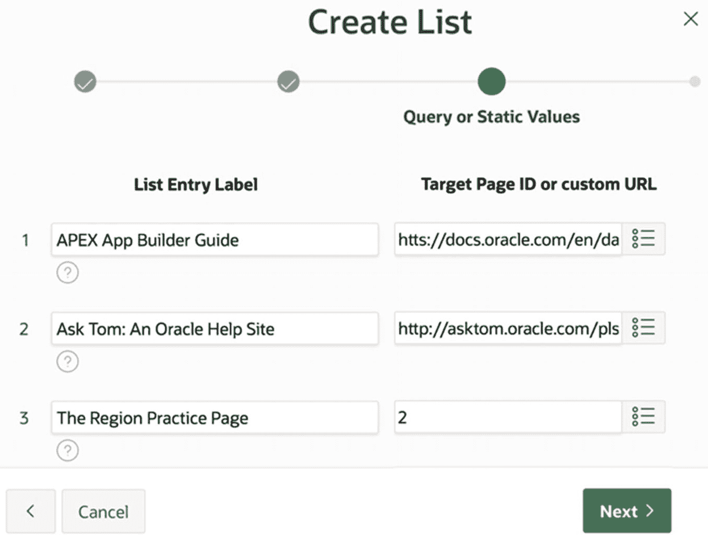

**图 4-8** 第三个 Create List 屏幕

最后一个屏幕询问您是否要为该列表创建一个区域。
由于您尚未了解列表区域，请选择 `No`。然后点击 `Create List` 来创建该列表。列表管理器现在应该显示新列表的条目。

### 修改导航界面

默认情况下，`Desktop Navigation Menu` 列表显示在页面左侧，而 `Desktop Navigation Bar` 列表显示在顶部。您可以通过修改应用程序的属性来更改这些默认值。

第 2 章讨论了如何获取应用程序的属性。回顾一下，转到应用程序的主屏幕（图 2-5）并单击右上角的 `Edit Application Properties` 按钮。您将进入应用程序的属性屏幕（图 2-6），它有四个选项卡：`Definition`、`Security`、`Globalization` 和 `User Interface`。
选择 `User Interface` 选项卡将显示用户界面属性；图 4-9 显示了该屏幕的顶部。

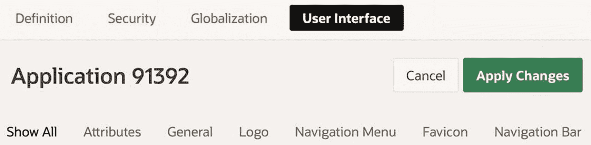

**图 4-9** 应用程序的用户界面属性

请注意图底部列出属性部分的选择条。您可能还记得第 3 章中的 `Logo` 属性（参见图 3-21）。然而，现在您感兴趣的是 `Navigation Menu` 和 `Navigation Bar` 部分。它们的属性允许您配置导航菜单和导航栏。

### 配置导航菜单

图 4-10 显示了 `Navigation Menu` 属性。

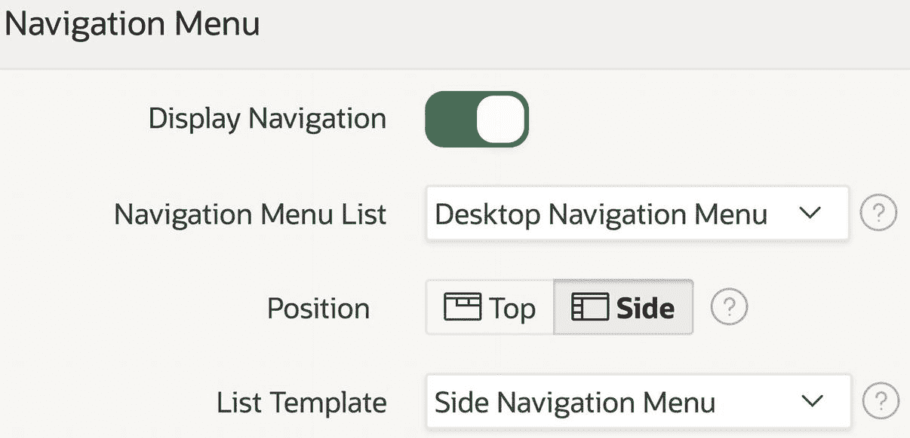

**图 4-10** 应用程序的 Navigation Menu 属性


`导航菜单列表`属性让你指定将作为导航菜单显示的列表。你可以从任何现有列表中选择。例如，选择`References`列表会导致显示如图 4-11 所示的导航菜单。

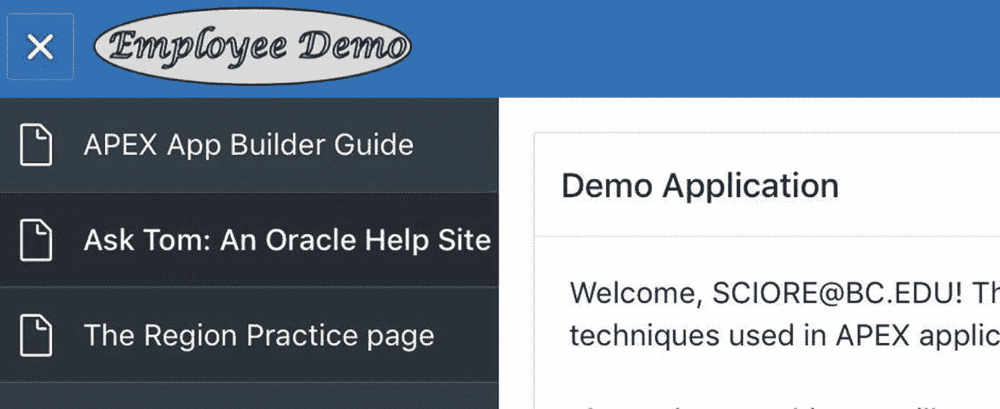

图 4-11：`References` 列表现在成为导航菜单

你也可以选择值`-Select Navigation Menu List-`作为导航菜单。这样做会将`导航菜单列表`属性设置为`null`，这会导致 APEX 完全不渲染导航菜单区域。

`位置`属性的值可以是`Side`或`Top`。选择`Top`会告诉 APEX 在页面顶部、导航栏下方渲染导航菜单。它还会导致`列表模板`属性的值变为`Top Navigation Menu`。图 4-12 显示了在顶部显示`Desktop Navigation Menu`列表的结果。

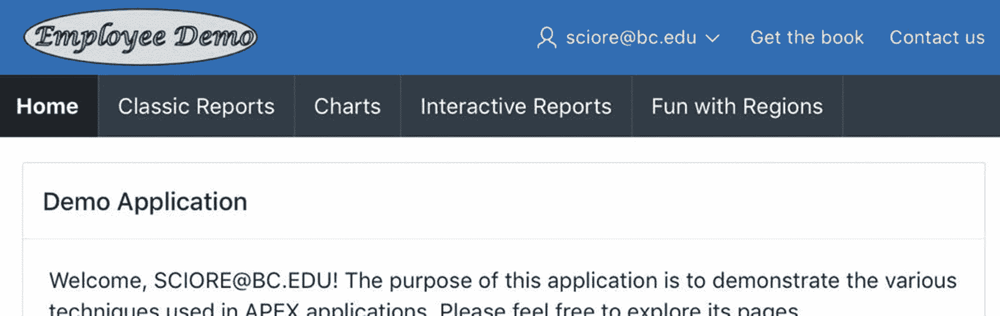

图 4-12：导航菜单现在出现在顶部

### 配置导航栏

图 4-13 展示了`导航栏`属性。

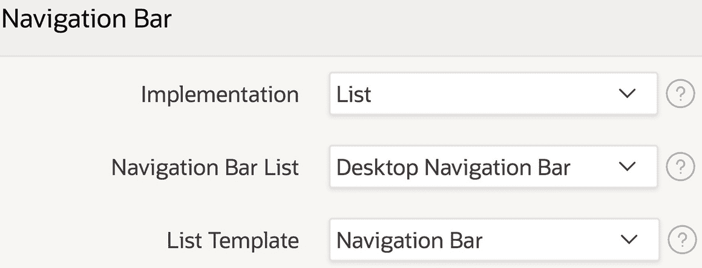

图 4-13：应用程序的导航栏属性

`导航栏列表`属性让你指定将出现在导航栏中的列表。与导航菜单一样，它可以是任何列表，但不能是`null`。例如，图 4-14 显示了将`Desktop Navigation Menu`列表放置在导航栏中的结果。


图 4-14：导航菜单现在出现在导航栏中

### 列表区域

为了让列表的内容在页面上可见，该列表必须被分配到该页面的某个位置。导航栏和导航菜单的位置是预定义的。如果你希望列表出现在其他任何地方，你必须将其放置在你创建的区域中。该区域的类型应为`列表`，并且其源应为列表的名称。

例如，图 4-15 展示了`列表练习`页面，这是演示应用程序的第 7 页。该页面包含四个区域，类型均为`列表`。前三个区域以三种不同的方式显示`References`列表，底部未命名的区域则显示`Desktop Navigation Menu`列表。

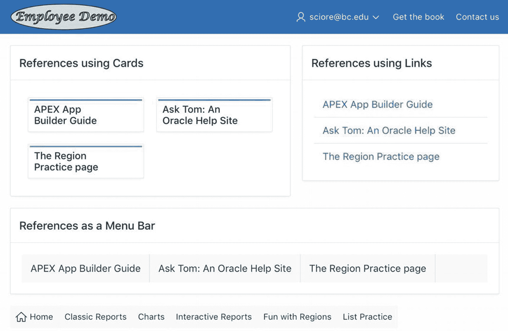

图 4-15：列表练习页面

要构建此页面，你应该新建一个页面并向其添加四个新区域。我将这些区域命名为`使用卡片的引用`、`使用链接的引用`、`作为导航栏的引用`和`导航菜单`。第一个区域的列跨度为 7；第二个区域在新行的同一列开始；另外两个区域则开始新的行。

将每个区域的类型设置为`列表`。一个`列表`区域的源必须是一个列表。属性编辑器让你从现有列表中选择，如图 4-16 所示。为前三个区域选择`References`列表，为`导航菜单`区域选择`Desktop Navigation Menu`列表。


图 4-16：选择列表区域的源

此时，你已拥有所需的列表区域，但它们都被格式化为链接。这对于`使用链接的引用`区域是合适的，但其他区域需要不同。要更改列表的显示方式，必须更改其模板。类型为`列表`的区域有一个名为`列表模板`的属性，可以通过在渲染树中选择其`属性`节点并在属性编辑器中查找`外观`部分来访问。图 4-17 显示了此属性的可能值。

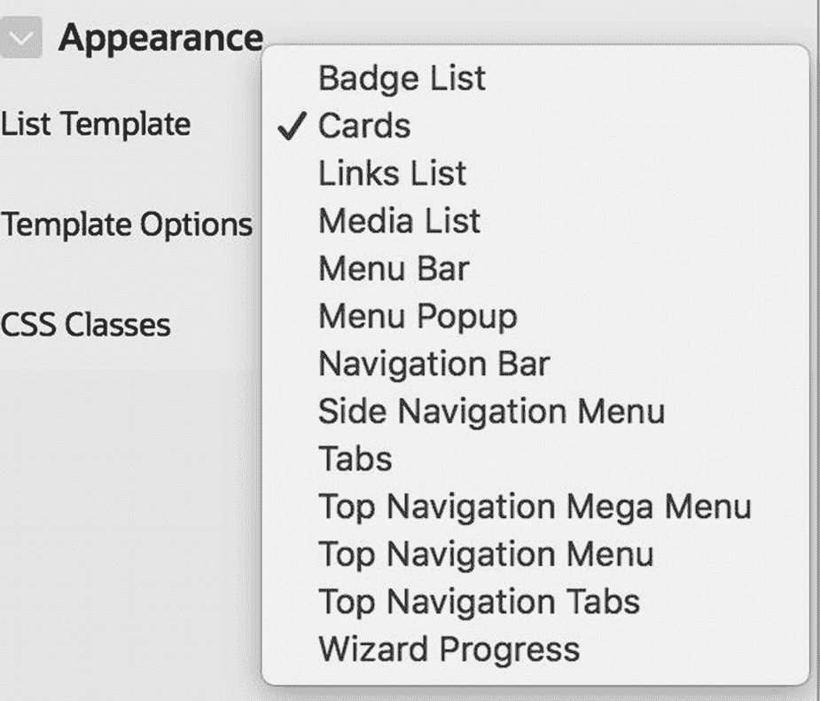

图 4-17：可能的列表模板值

要生成图 4-15 所示的页面，你应该将`使用卡片的引用`区域的模板设置为`卡片`，将`作为导航栏的引用`区域的模板设置为`菜单栏`，并将`导航菜单`区域的模板设置为`导航栏`。为了有趣，你也可以尝试将其他模板分配给这些区域，例如`徽章列表`、`媒体列表`和`选项卡`。

为了进一步自定义，一些列表模板具有可通过`模板选项`属性设置的选项。例如，`使用卡片的引用`区域使用了图 4-18 所示的选项。通常，理解各种模板选项用途的最佳方法是在你的区域上进行实验。

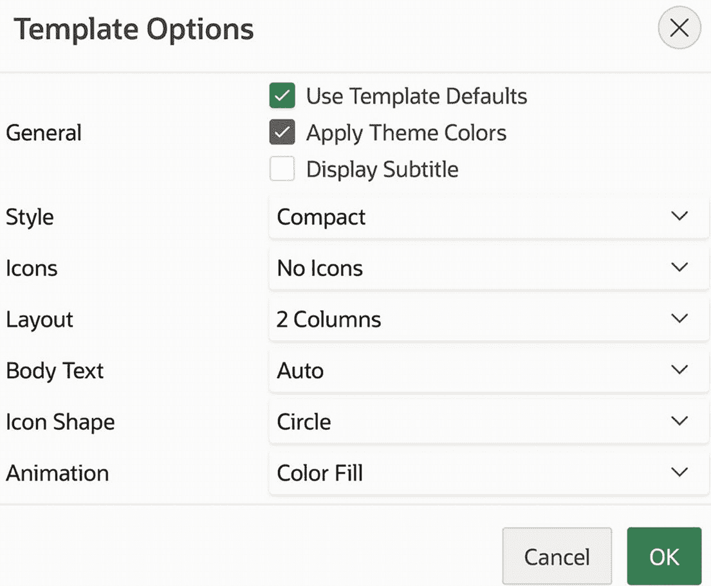

图 4-18：卡片模板的选项

除了选择列表模板，还记得你也可以通过选择区域模板来自定义区域。（第 3 章的图 3-10 展示了可能的模板。）图 4-15 的前三个区域使用了`标准`模板，该模板显示一个包含区域名称的标题。底部区域使用了`选项卡容器`模板。该模板在没有额外边框的情况下显示其内容；实际上，它看起来很像一个菜单栏。这个区域展示了如何使用列表区域来模拟出现在页面默认位置之外的菜单栏。

图 4-15 的另一个特点是它没有显示导航菜单区域。你之前已经看到了如何通过将全局属性`导航菜单列表`设置为`null`来隐藏应用程序所有页面的导航菜单。但如果你只想在单个页面上隐藏菜单呢？答案是使用页面的`导航菜单`属性，如图 4-19 所示。

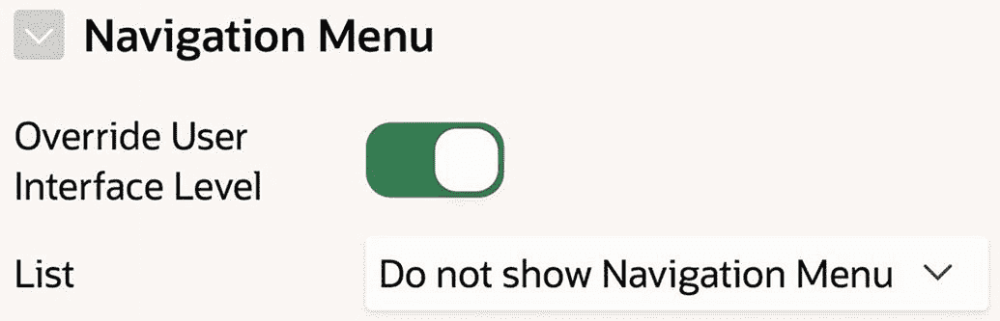

图 4-19：为单个页面配置导航菜单


启用 `覆盖用户界面级别` 属性后，将显示 `列表` 属性。随后，您可以选择一个列表作为页面的导航菜单，也可以选择不指定导航菜单。

将链接存储在列表中，并在列表区域中显示，是一项重要的技术；它远比手动使用 HTML 格式化链接更优越，就像您在主页的 `引用` 区域所做的那样。其中一个原因是，列表区域的模板负责格式化列表条目；您只需选择所需的模板。换言之，列表区域将内容（源列表）与格式（列表模板）分离。编写 HTML 代码来实现列表不仅繁琐，而且会将内容与格式混在一起。任何更改条目格式的决定都需要您重写 HTML 代码。

使用列表区域的第二个优势是，它会随着列表的更改而自动更新。这对于显示 `桌面导航菜单` 列表的区域尤为重要。例如，每当您为一个新页面创建导航菜单条目时，图 4-15 中的 `导航菜单` 区域就会相应地进行调整。

### 层级列表

`员工演示` 应用程序当前的 `桌面导航菜单` 列表中有六个条目。由于条目数量较少，简单地将它们线性地显示在页面侧面（或顶部）是合理的。然而，随着条目数量的增加，一个长长的线性列表会变得难以管理。常见的解决方案是分层显示条目。

APEX 导航栏（如图 1-3 所示）就是一个很好的例子。它的第一个选项卡（包含徽标）对应于 APEX 主屏幕；其他选项卡对应于 APEX 站点的通用类别。每个类别选项卡都有一个主目标页面，作为该类别的主屏幕。点击类别选项卡的主要部分会带您前往该页面。每个类别选项卡还有一个下拉箭头；点击它会显示该类别的次要选项卡菜单。这样就形成了一个功能齐全且界面整洁的效果，次要选项卡在需要时才会显示。

在层级列表中，每个列表条目都可以有一个 `父级` 条目。没有父级的条目定义了一个层级结构，被称为该层级的 `根`。一个层级可以有多个级别，这意味着一个条目的父级也可能有其父级。例如，图 4-20 展示了 APEX 导航栏的 `应用构建器` 条目。它的子级之一 `工作区实用工具` 也有自己的子级。

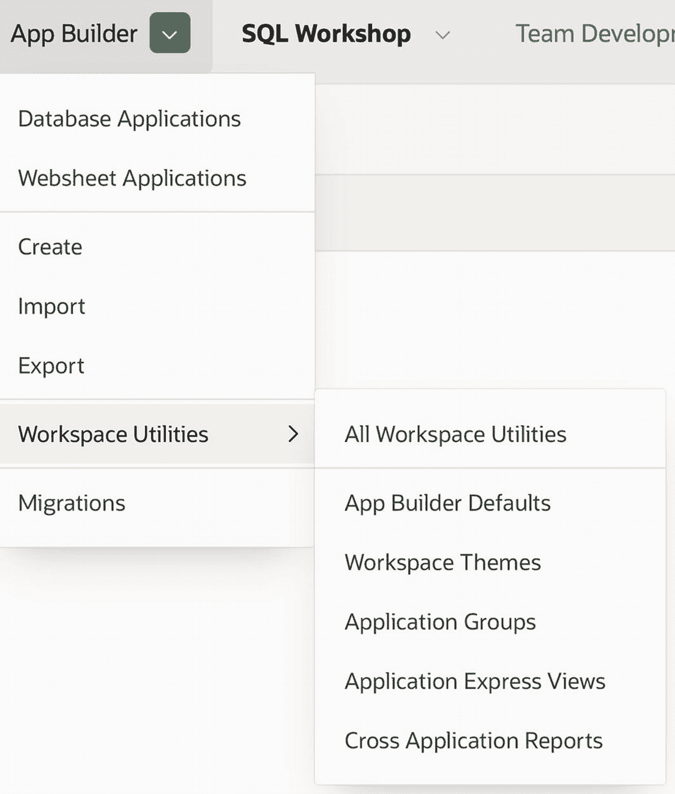
*图 4-20：APEX 导航栏中的应用构建器菜单*

让我们看看如何类似地重构 `员工演示` 应用程序。它的 `桌面导航菜单` 列表将包含主页以及两个层级结构：

*   一个 `区域` 层级，包含页面 `区域练习`、`经典报表`、`图表` 和 `交互式报表`
*   一个 `列表` 层级，包含页面 `列表练习`

每个层级对应本书的一个章节——`区域` 层级包含在第 3 章开发的页面，`列表` 层级包含在第 4 章开发的页面。随着本书的进展，我将遵循此约定，为每章开发的页面创建一个新的层级结构。

但在开始创建层级之前，您需要考虑如何配置每个根条目。显然，其 `父列表条目` 属性的值应为 `null`，表示它是一个根。但是，应该为其 `目标` 属性赋予什么值呢？有三种合理的策略：您可以创建一个专用的“主屏幕”作为目标；也可以将目标设置为其某个子级的目标；或者可以将目标设置为 `null`。APEX 采用了第一种策略——它为应用构建器、SQL 工作坊等分别设置了主屏幕。采用第二种策略的效果是使所选目标成为该部分的默认页面。而采用第三种策略则无法选择父级，从而迫使用户选择一个子级。本书将遵循以下约定：拥有单个子级的根条目将把该子级作为其目标，而拥有多个子级的根条目将采用空目标。

要创建此层级列表，请先转到 `桌面导航菜单` 的 `列表详细信息` 屏幕，该屏幕如图 4-2 所示。创建两个新的列表条目作为两个层级的根，并根据前述约定设置它们的目标页面：`区域` 条目的目标应为空，`列表` 条目的目标应为 `列表练习` 页面。

现在需要为五个子条目设置父级。直接的方法是转到每个条目的 `列表条目` 屏幕（如图 4-3 所示）并修改其 `父列表条目` 属性。不过，`列表详细信息` 屏幕有一个向导可以加速此过程。点击 `列表详细信息` 屏幕右侧标题为 `重新分配此列表中的列表条目` 的链接。该链接会带您到一个 `重新分配列表条目` 屏幕，从那里您可以快速指定给定父条目的子级。无论您采用哪种方式，桌面导航菜单的最终条目应如图 4-21 所示。

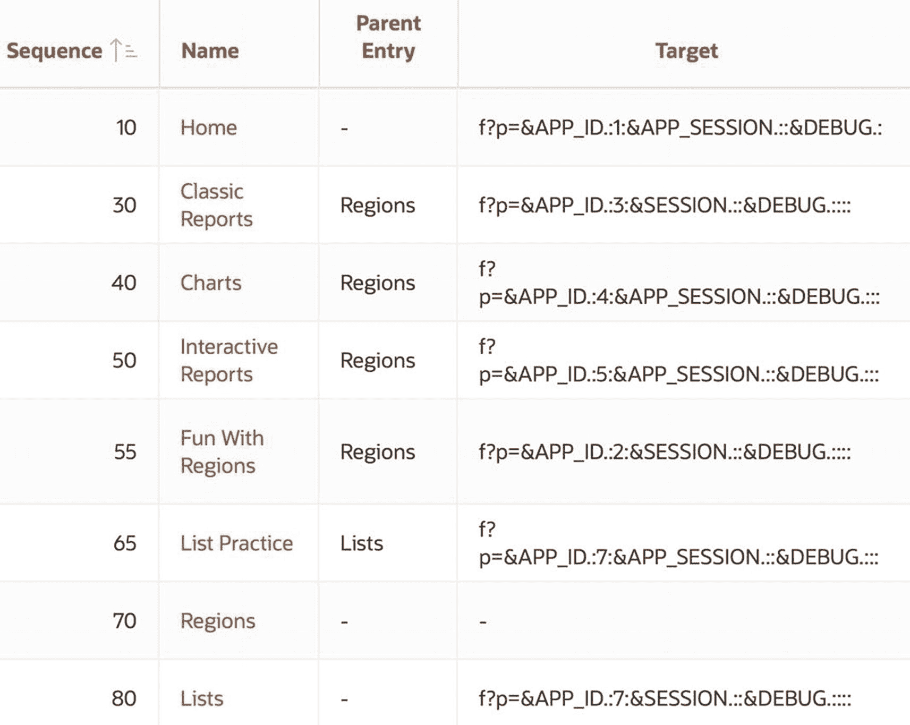
*图 4-21：层级导航菜单的条目*

图 4-22 显示了生成的导航菜单的截图，其中我点击了 `区域` 菜单以查看其子级。

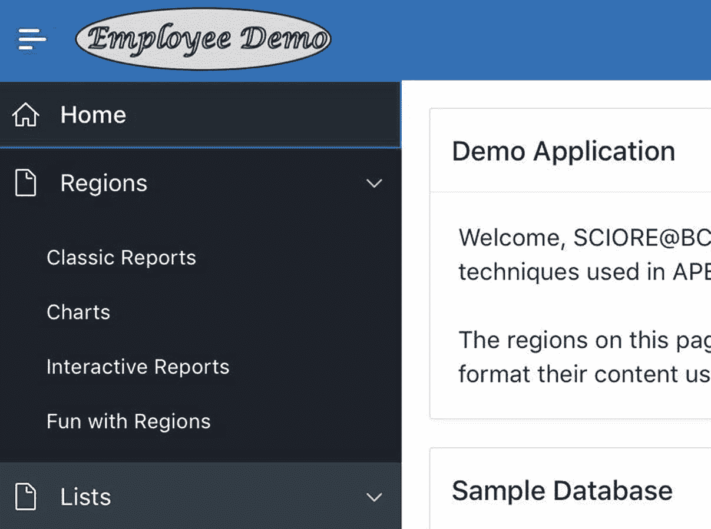
*图 4-22：层级导航菜单*

每次创建新页面时，您都可以使用前述技术为其在 `桌面导航菜单` 列表中添加条目。然而，在创建页面时直接向列表中添加新条目通常更方便。请考虑创建页面向导的第三个屏幕，如图 4-23 所示。

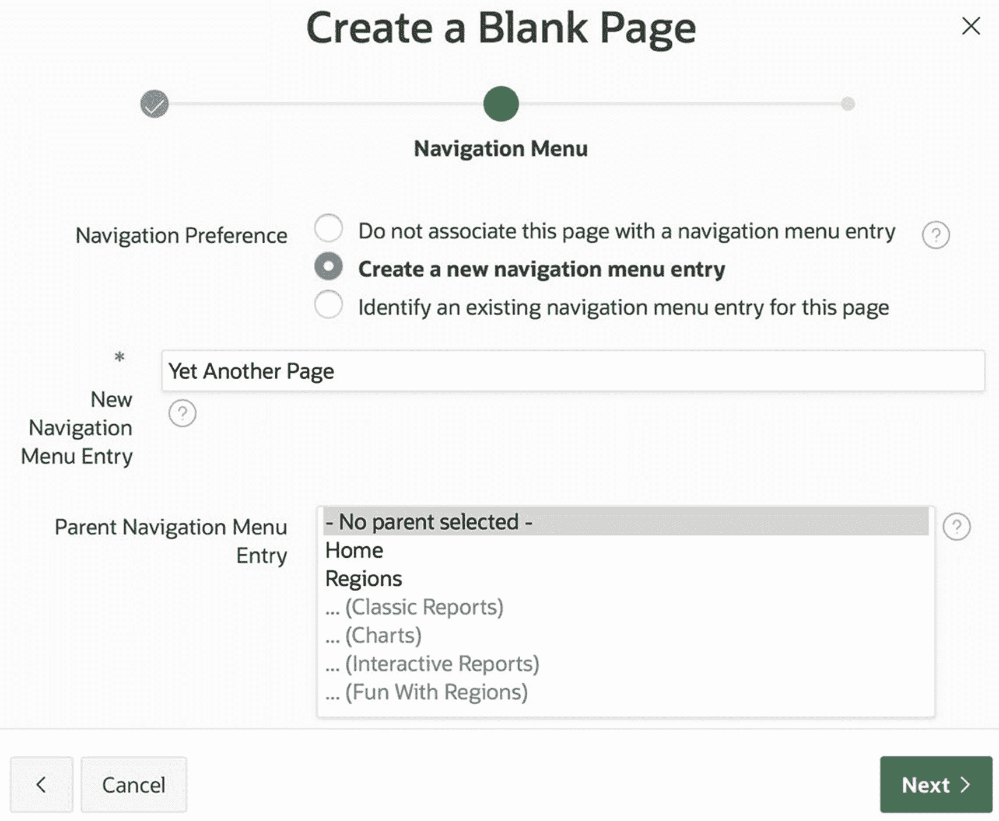
*图 4-23：在页面创建过程中指定菜单层级*


## 导航

标记为 `Parent Navigation Menu Entry` 的项会显示导航菜单列表中的每一个条目。（你需要滚动列表才能看到全部。）其默认值为 `-No parent selected-`，这将使新的菜单条目成为根条目。如果你希望新条目成为另一个条目的子项，就必须指定一个父项。理想情况下，你应该能够直接从列表中选择你想要的条目。然而，有些条目是灰显且不可选择的。具体来说，可选的条目是那些已经是父项的条目，或者是“潜在父项”（即没有目标的条目）。大多数情况下，你想要的父项是可选的。但如果你希望新条目是某个灰显条目的子项，你必须通过列表管理器为其分配父项。

### 巨型菜单

分层导航菜单通过两种方式改善用户体验。首先，它们对菜单条目进行结构化，使用户更容易理解有哪些可用操作。其次，它们减少了菜单所需的屏幕空间占用。

一个较新的设计思路是保持分层结构，但一次性显示所有菜单条目，这被称为 *巨型菜单*。例如，图 4-24 展示了带有巨型菜单的员工演示应用程序的外观。点击标志左侧的图标可以切换菜单的可见性。每个菜单条目都是指向其目标页面的链接。

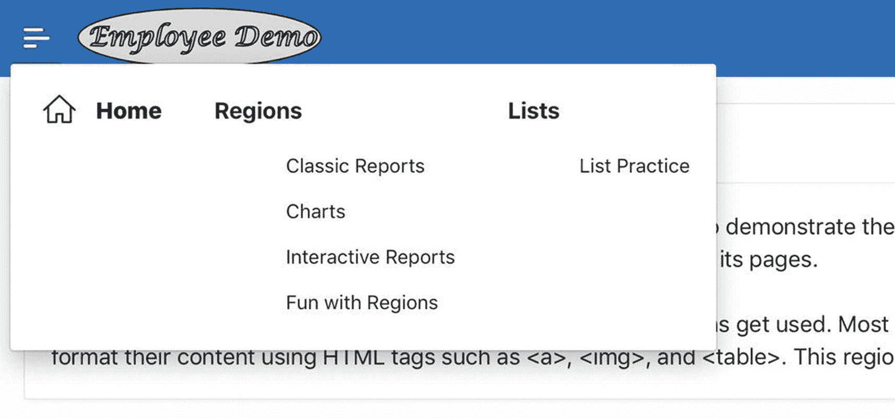

图 4-24 一个巨型菜单

APEX 将巨型菜单实现为另一种导航菜单模板。要创建巨型菜单，请点击应用程序主页上的 `Edit Application Properties` 按钮，然后点击 `User Interface` 选项卡。找到 `Navigation Menu` 部分，将其 `Position` 属性设置为 `Top`，将其 `List Template` 属性设置为 `Top Navigation Mega Menu`，如图 4-25 所示。

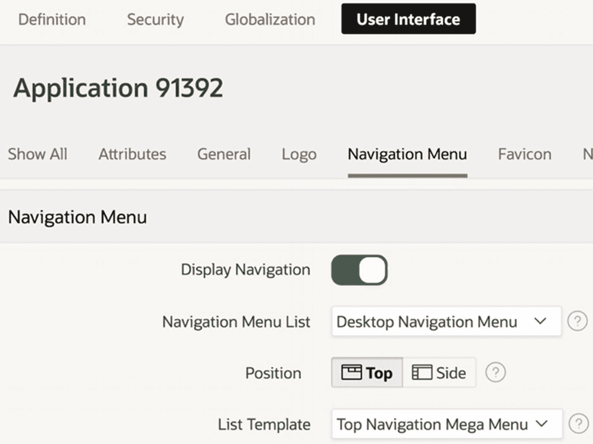

图 4-25 指定一个巨型导航菜单

### 页面层级

一个大型 Web 应用程序包含的页面太多，无法全部放入导航菜单。因此，导航菜单包含应用程序的 *着陆页*——那些标志着最突出任务开始的页面。

通常，应用程序中的所有页面集合也具有层级结构。这种页面层级的显式呈现被称为 *站点地图*。例如，考虑一个 APEX 站点中的页面。它们在层级中的根是 APEX 主页。根的子项对应于应用程序的各种类别，如应用构建器、SQL 工作室和团队开发工具。每个类别都有一个“主页”，它领导着包含其类别页面的子树。

图 4-26 列出了对应于 APEX 应用构建器的部分页面层级。由于空间限制，该图省略了许多页面。

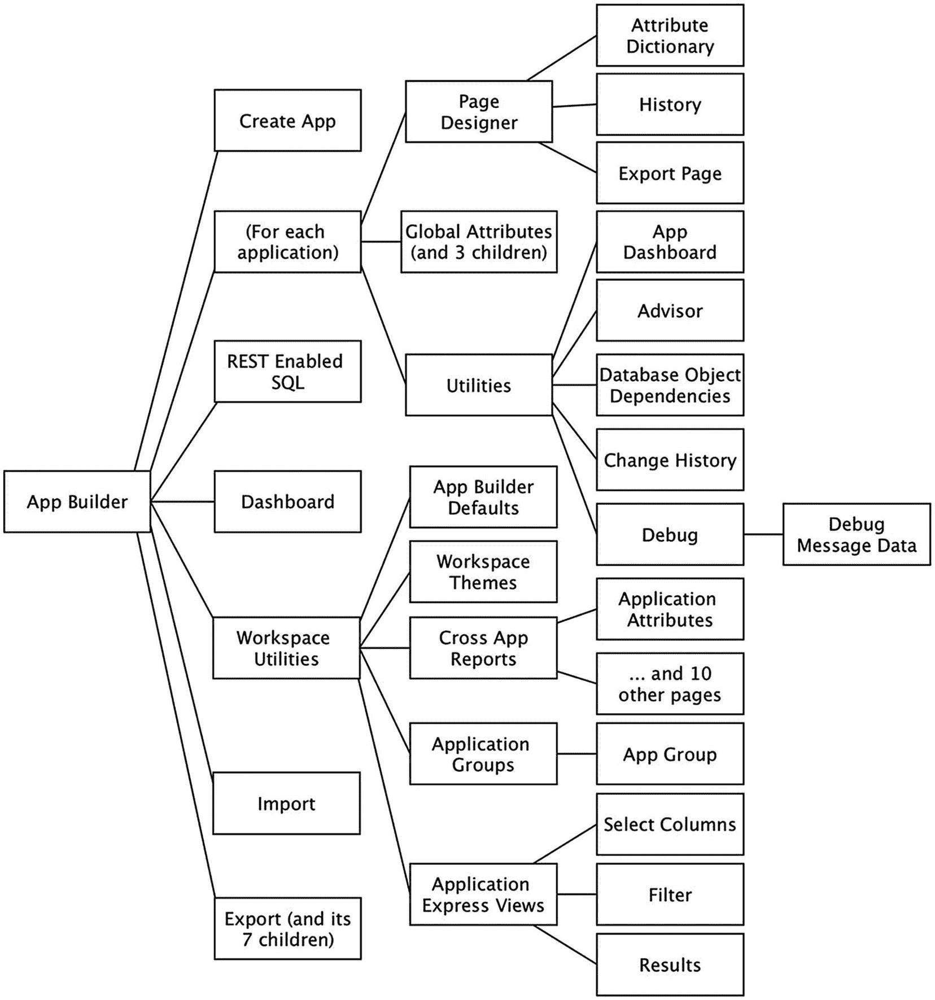

图 4-26 应用构建器的页面层级

将此页面层级与应用构建器的导航菜单进行比较是值得的。导航菜单涵盖了该树前三层中的大多数（但非全部）页面。导航菜单中明显缺少的是对应于每个应用程序子树的条目；这些页面改为通过应用构建器主页上的图标和按钮访问。

### 面包屑导航

你可以通过给出页面层级中从该页面到主页路径上的页面序列，来描述应用程序中任何页面的位置。例如，`Application Attributes` 页面的位置是

```
App Builder > Workspace Utilities > Cross Application Reports > Application Attributes
```

此路径被称为 *面包屑导航*。并非所有 APEX 屏幕都显示其面包屑导航，但如果它们显示，通常会显示在导航栏下方。请注意，APEX 面包屑导航中的第一个条目显示为带圈的向上箭头，这表示层级的根页面。

作为练习，导航到 APEX 站点的其他页面并注意它们的面包屑导航。事实上，看看你是否能找到图 4-26 中列出的所有页面。面包屑导航是可点击的。点击其路径的任何部分都会将你带到相应的页面。

导航菜单和面包屑导航是互补的导航工具。导航菜单对所有页面都是一样的，其条目涵盖了应用程序的全部功能。通过查看菜单，用户可以确定任何所需操作的适当起始页面。另一方面，页面的面包屑导航特定于该页面，并提供有关该页面在页面层级中位置的上下文信息。例如，假设你正在查看应用构建器的 `Application Attributes` 页面。它的面包屑导航告诉你该页面是跨应用程序报告之一。该信息可能会促使你点击面包屑导航来探索其他跨应用程序报告。

在 APEX 中，整个页面层级被称为 *面包屑对象*。面包屑对象本质上是一个分层列表——它为层级中的每个页面包含一个条目，每个条目（根除外）都有一个父项。

APEX 会自动为每个应用程序创建一个面包屑对象（名为 `Breadcrumb`）。APEX *面包屑管理器* 允许你编辑此对象并创建其他面包屑对象。要进入面包屑管理器，请从应用程序的主页开始，选择页面顶部的 `Shared Components` 按钮。搜索 `Navigation` 部分，点击 `Breadcrumbs`，然后点击 `Breadcrumb` 图标。你将被带到该面包屑对象的面包屑管理器。图 4-27 显示了我的 `Employee Demo` 应用程序的面包屑管理器。

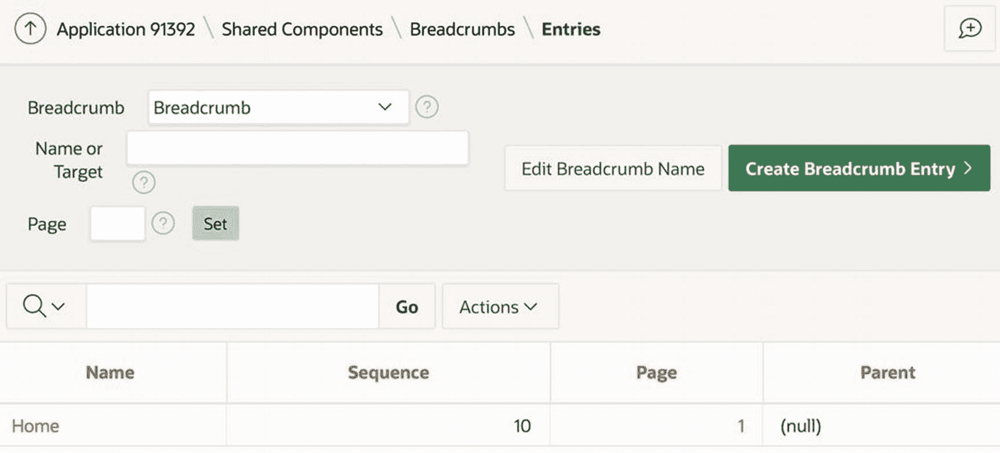

图 4-27 面包屑管理器

该图显示只有一个面包屑条目，对应于主页。此条目是在我创建应用程序时自动创建的。请注意，即使我从主页删除了其面包屑区域，该条目仍然存在。

当我创建其他页面时，我告诉向导不要为新页面创建面包屑条目。相反，我现在可以使用面包屑管理器来创建面包屑条目。点击 `Create Breadcrumb Entry` 按钮。图 4-28 显示了生成的屏幕。

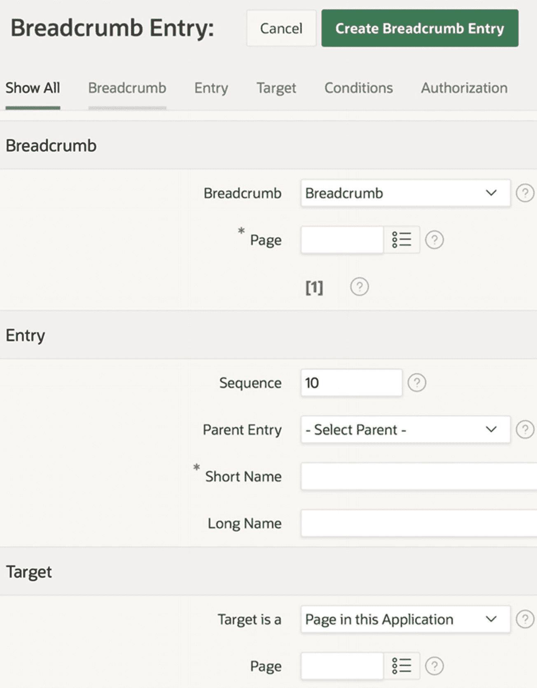

图 4-28 面包屑条目屏幕

此屏幕允许你指定页面及其父项，以及有关面包屑如何在页面上显示的信息。具体而言：

*   `Page` 属性（在 `Breadcrumb` 部分中）指定页面。
*   `Parent Entry` 属性指定父项。
*   `Short Name` 属性指定页面在面包屑上的显示方式。选择页面的名称通常是合理的。
*   `Page` 属性（在 `Target` 部分中）指定用户点击该面包屑条目时发生的情况。它通常与前面的 `Page` 属性值相同。

让我们为第 7 页，即 `List Practice` 页面创建一个面包屑条目，它将是主页的子项。在 `Breadcrumb Page` 和 `Target Page` 属性中输入 7，在 `Parent Entry` 属性中输入 `1`，在 `Short Name` 属性中输入 `List Practice`。


