# 5. 项目与按钮

本书迄今为止一直专注于应用程序如何向用户显示信息。在本章及下一章中，你将研究那些允许用户向应用程序发送回信息的组件。这些组件，即 `项目`（items）和 `按钮`（buttons），被称为 `窗体控件`（form controls），因为它们通常出现在网页表单中。
APEX 支持多种类型的项目，它们的外观和行为差异很大。然而，它们都可以被理解为几个基本概念的变体。本章的主要目的是探讨这些概念，并研究它们如何在不同的项目类型中得以体现。

## 面包屑区域

如果你想让一个页面显示面包屑对象，你必须为其创建一个区域。`Breadcrumb` 区域类型就是为此目的而设计的。虽然你可以将面包屑区域放置在页面上的任何位置，但它自然应该放在 `面包屑栏`（Breadcrumb Bar）位置，该位置位于导航栏正下方。通常，你需要遵循以下步骤向页面添加面包屑区域。

*   向页面添加一个新区域。
*   将区域的类型设置为 `Breadcrumb`。
*   将区域的源设置为 `Breadcrumb` 对象。
*   将该区域分配到 `面包屑栏`（Breadcrumb Bar）位置。
*   将区域模板设置为 `带属性的空白`（Blank with Attributes），这样它将在没有边框或标题的情况下显示。
*   设置区域模板选项，使面包屑显示时有足够边距。

顺便提一下，如果你在创建页面时选择创建面包屑，你的任务会稍微简单一些。图 4-29 展示了创建页面向导的第二个屏幕，假设你在创建 `列表练习`（List Practice）页面时就为其创建了面包屑。你只需要为 `父条目`（Parent Entry）和 `条目名称`（Entry Name）项输入值。

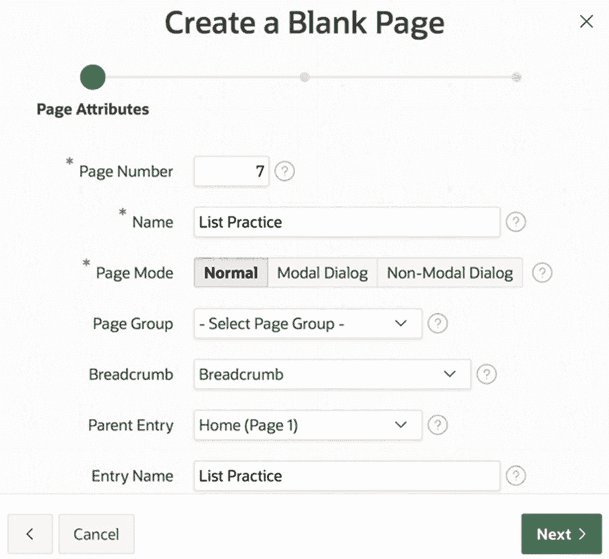

图 4-29
在创建页面时创建面包屑条目

在你的应用程序中，使用这些步骤向 `列表练习` 页面添加一个面包屑区域。图 4-30 显示了结果页面的导航栏和面包屑区域。请注意，与列表区域不同，面包屑区域并不显示其完整的源对象。它只显示与当前页面对应的面包屑。


图 4-30
面包屑区域中的面包屑对象

## 全局页面

显示列表或面包屑对象的标准方式是将其放置在页面上的一个区域中。这种技术提供了相当大的灵活性——每个页面可以在不同位置、使用不同模板来显示列表或面包屑。然而，你通常不需要这么大的灵活性。假设你希望每个页面都以完全相同的方式显示列表或面包屑。实现这种统一性最简单的方法是使用 `全局页面`（global page）。
全局页面是一个特殊的页面，其内容会包含在应用程序的每一个其他页面中。如果你将图 4-30 中的面包屑区域或图 4-15 中的 `导航菜单`（Navigation Menu）区域放在全局页面中，这些区域将统一出现在应用程序的所有页面上。APEX 在应用程序创建时会创建全局页面；按照惯例，全局页面的页面编号为 0。
面包屑区域的一个优点是，APEX 只会在页面确实有面包屑时才在页面上渲染它。也就是说，如果你把面包屑区域放在全局页面中，它将只出现在那些实际拥有面包屑的页面上。

#### 小结

APEX 中主要的导航工具是链接列表，也称为 `列表`（list）。内置的 `桌面导航栏`（Desktop Navigation Bar）列表的条目显示在应用程序的导航栏中，而 `桌面导航菜单`（Desktop Navigation Menu）列表的条目则出现在应用程序的导航菜单中。列表管理器允许你编辑这些列表的内容，应用程序的 `用户界面`（User Interface）属性则允许你自定义它们的位置和样式。
你也可以使用列表管理器来创建自己的列表。你可以通过将列表放置在类型为 `List` 的区域中来在页面上显示它。每个列表区域都有一个 `模板`（Template）属性，让你可以自定义列表的显示方式。
列表可以是分层的，即一个列表条目可以是一个或多个子条目的父级。这种层次结构为列表条目提供了结构。这种结构对于导航菜单列表尤其有用，因为它允许菜单包含大量条目而不会让用户不知所措。
另一种导航工具是 `面包屑`（breadcrumb）。要为页面定义面包屑，你必须首先了解该页面如何适应所有应用程序页面的层次结构中。页面的面包屑是从该页面到根节点的层次结构中的路径。要在页面上显示面包屑，你必须将其放置在类型为 `Breadcrumb` 的区域中。通常将面包屑区域放在应用程序的全局页面（页面 0）中，以便它在每个页面的相同位置出现。

## 项目

一个 `项目`（item）是网页中保存值的元素。每个项目都有一个 `类型`（type），例如 `文本字段`（Text Field）、`复选框`（Checkbox）或 `选择列表`（Select List）。每种项目类型都有特定的方式来显示其值并让用户修改该值。
你在使用 APEX 的过程中已经遇到了几种项目类型。例如，图 5-1 显示了用于重命名 `DEPT` 表某一列的对象浏览器屏幕。此图显示了五个项目：两个只读项目（标记为 `Schema` 和 `Table`）、一个选择列表（`当前列名`（Current Column Name））、一个文本框（`新列名`（New Column Name））和一个复选框（`保留大小写`（Preserve Case））。通常，每次你在 APEX 屏幕中输入一个值，都是通过一个项目来完成的。

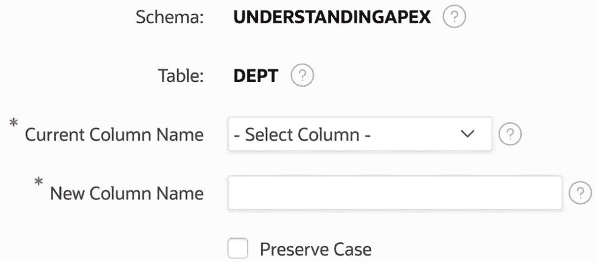

图 5-1
APEX 屏幕中的不同项目类型

APEX 应用程序构建器支持 22 种不同的项目类型。这些项目类型可以分为三类：`基于文本`（text-based）的项目允许你通过键入来指定值，`基于列表`（list-based）的项目允许你从列表中选择来指定值，而`基于显示`（display-based）的项目则不允许你指定值。图 5-1 包含了所有三个项目类别的示例。本章将讨论这些类别及其项目类型。

## 项目示例页面

在本章中，你将创建如图 5-2 所示的页面。这个名为 `项目示例`（Item Sampler）的页面将成为 `员工演示`（Employee Demo）应用程序的第 8 页。页面本身不会做任何有趣的事情；其唯一目的是展示一些常见项目类型的功能，并展示如何配置它们的属性。

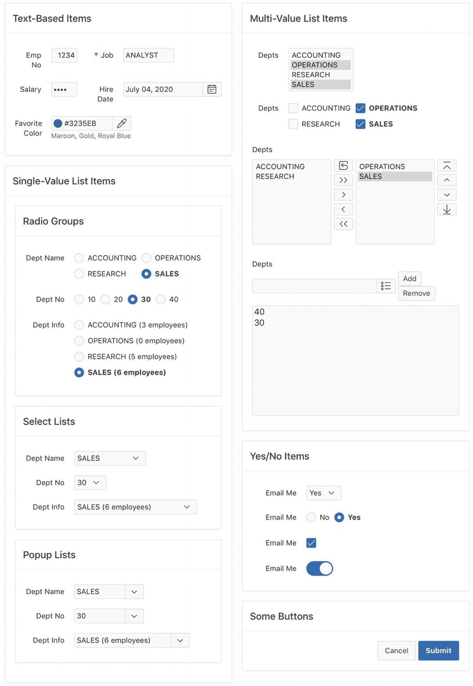


## Item Sampler 页面

构建 `Item Sampler` 页面的第一步是创建一个空白页面和八个静态内容区域。使用每个区域的 `Layout` 属性将它们定位在页面上，如第 3 章所述（参见图 3-8 和 3-12）。具体而言：

*   `Text-Based Items` 开始一个新行。
*   `Single-Value List Items` 位于同一行和列，这导致它被放置在 `Text-Based Items` 下方。
*   `Radio Groups`、`Select Lists` 和 `Popup Lists` 的父区域都是 `Single-Value List Items`，并且各自开始一个新行。
*   `Multi-Value List Items` 在同一行开始一个新列。
*   `Yes/No Items` 和 `Some Buttons` 位于同一行和列。

因此，这些区域形成了一个包含两列的单行。图 5-3 显示了生成的空白区域。

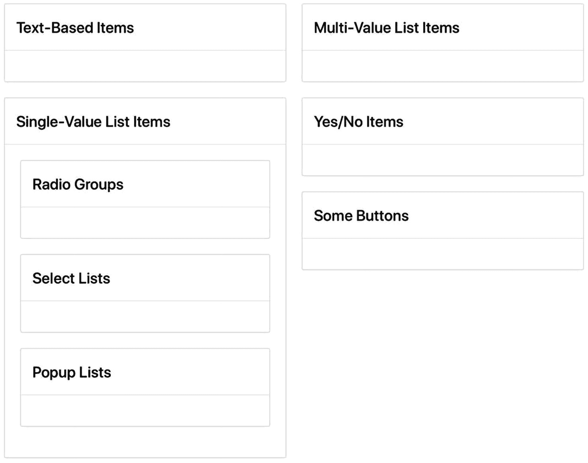

**图 5-3 Item Sampler 页面的结构**

## 创建和删除项

页面上的每个项在页面的渲染树中都有一个对应的节点，位于与该项区域对应的子树中。例如，图 5-4 显示了已完成的 `Text-Based Items` 区域的 `rendering` 子树。它有一个名为 `Items` 的子节点，该节点下有该区域内每个项对应的子节点。

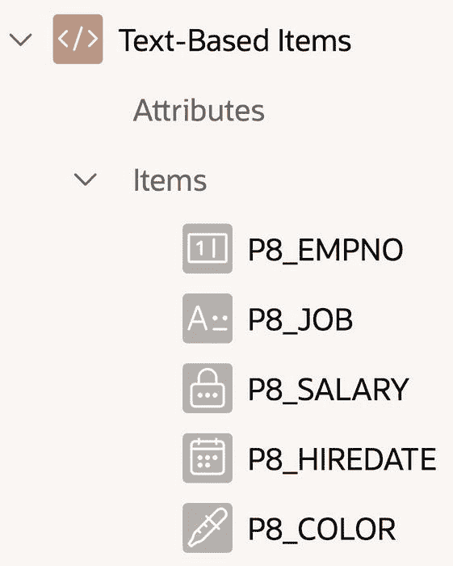

**图 5-4 Text-Based Items 区域的渲染子树**

要为区域创建项，请在渲染树中右键单击该区域的条目并选择 `Create Page Item`。APEX 随后会将一个节点插入到该区域的 `Items` 子树中。当您单击该节点时，该属性的属性将显示在属性编辑器中。

APEX 为新项的 `Name` 和 `Type` 属性分配默认值。这些属性显示在属性编辑器的 `Identification` 部分中，如图 5-5 所示。

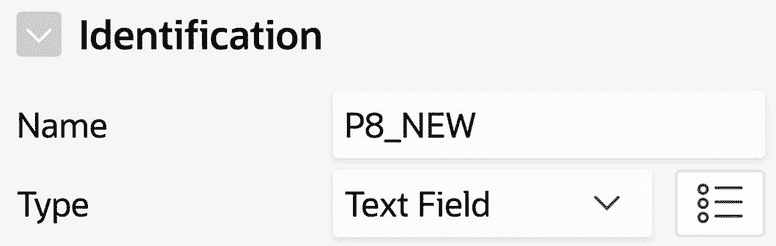

**图 5-5 项的识别部分**

这个新项的名称是 `P8_NEW`。前缀表示包含该项的页面，在本例中是第 8 页。创建项时，您应将后缀从 `NEW` 重命名为更有意义的名称，但保留前缀。APEX 社区强烈建议使用页码作为项名称的前缀，没有理由不遵循此建议。
`Type` 属性指定项的类型。默认情况下，类型是 `Text Field`，但您可以单击选择列表，从 APEX 支持的 22 种不同项类型中选择。

创建项的另一种方法是使用拖放。回想一下，页面设计器有一个库部分，位于其中间面板的 `Layout` 选项卡底部。该库为每种项类型都有一个图标，如图 5-6 所示。您可以通过将其中一个图标拖到您选择的页面区域来创建新项。

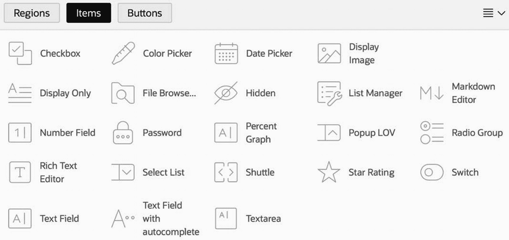

**图 5-6 项库**

每个项还有一个关联的*标签*，即您希望与项一起显示的字符串。此字符串在属性编辑器的 `Label` 部分中指定。例如，图 5-7 显示了 `Item Sampler` 页面左上角项的标签规范。

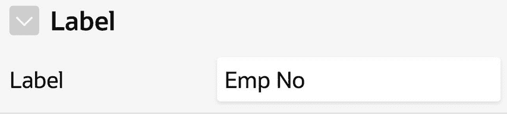

**图 5-7 指定项的标签**

图 5-8 显示了项的 `Template` 属性，该属性位于其 `Appearance` 部分。此属性指定标签相对于其项的呈现方式。有七种可能的值。`Hidden` 值会隐藏标签，三种 `Optional` 值正常显示标签，三种 `Required` 值会用红色星号格式化标签。关键字 `Above` 指定标签放置在项上方，`Floating` 指定标签出现在项内及其值旁边。如果未指定任何关键字，则标签放置在项的左侧。

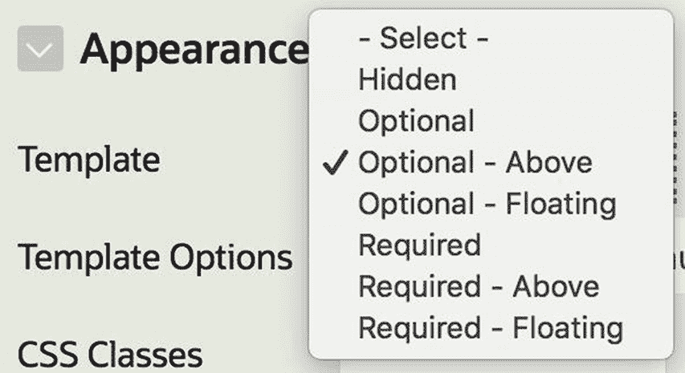

**图 5-8 指定项的外观**

`Item Sampler` 页面中的项大多使用 `Optional` 模板。右列中两个较大的项使用 `Optional-Above`，以节省水平空间。左列顶部标记为 `Job` 的项使用 `Required` 模板。`Required` 模板的目的是警告用户必须填写此项的值。该项的 `Value Required` 属性（位于其 `Validation` 部分）强制实施此限制，将在第 8 章讨论。
要删除项，请在渲染树中右键单击其条目并选择 `Delete` 选项。
您现在可以创建 `Item Sampler` 页面的所有 22 个项，将它们放置在具有适当标签的适当区域中。具体来说，`Text-Based Items` 区域有五个项，`Single-Value Items` 区域各有三个项，`Multi-Value Items` 区域有四个项，`Yes/No Items` 区域有四个项。

目前，您只需要为每个项指定名称和标签。表 5-1 为您列出了这些值。项类型目前还不重要；现在，您应将每个项类型保留为 `Text Field`。创建完项后，您可以随意尝试不同的标签模板。

**表 5-1 Item Sampler 页面中的项**

| 区域 | 名称 | 标签 |
| :--- | :--- | :--- |
| Text-Based Items | `P8_EMPNO` | 员工编号 |
| | `P8_JOB` | 职位 |
| | `P8_SALARY` | 薪资 |
| | `P8_HIREDATE` | 入职日期 |
| | `P8_COLOR` | 喜爱颜色 |
| Radio Groups | `P8_RADIO_NAME` | 部门名称 |
| | `P8_RADIO_NO` | 部门编号 |
| | `P8_RADIO_INFO` | 部门信息 |
| Select Lists | `P8_SELECT_NAME` | 部门名称 |
| | `P8_SELECT_NO` | 部门编号 |
| | `P8_SELECT_INFO` | 部门信息 |
| Popup Lists | `P8_POPUP_NAME` | 部门名称 |
| | `P8_POPUP_NO` | 部门编号 |
| | `P8_POPUP_INFO` | 部门信息 |
| Multi-Value List Items | `P8_M_SELECT` | 部门 |
| | `P8_CHECKBOX` | 部门 |
| | `P8_SHUTTLE` | 部门 |
| | `P8_LIST` | 部门 |
| Yes/No Items | `P8_YN_SELECT` | 给我发邮件 |
| | `P8_YN_RADIO` | 给我发邮件 |
| | `P8_YN_CHECKBOX` | 给我发邮件 |
| | `P8_YN_SWITCH` | 给我发邮件 |

## 定位项

您的下一个任务是将其项定位在其区域内。APEX 以行的形式显示区域的项，位于区域的顶部或底部。区域的 `Item Display Position` 属性（在区域的 `Appearance` 部分中）可让您指定其项是出现在其内容上方还是下方。此属性对于 `Item Sampler` 页面无关紧要，因为其区域没有其他内容，但对于下一章的页面将变得有用。
项的 `Layout` 部分决定了其在区域内的位置。APEX 在区域内定位项的方式类似于在页面内定位区域的方式。项根据其 `Sequence` 属性的值从左到右放置到行中，每当其 `Start New Row` 属性被选中时，就移动到新行。区域的宽度被划分为 12 个网格点。每个项（包括其标签，如果显示在项的左侧）有一个起始网格点和一个以网格点为单位的宽度。

## 布局示例

例如，图 5-9 展示了 `P8_EMPNO` 项的 `Layout` 部分。这些值指定了该项将占据区域的前三分之一（以便 `P8_JOB` 有足够的空间占据剩余的三分之二）。

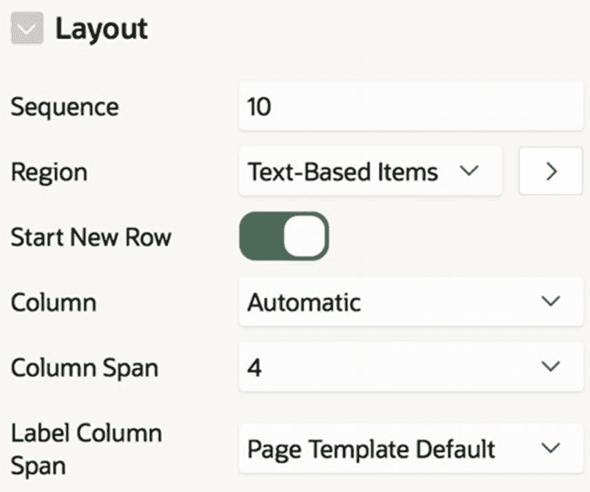

图 5-9 在其区域中指定项的位置

当项的标签显示在其左侧时，APEX 需要决定将多少项宽度分配给标签，多少分配给项本身。图 5-9 所示的 `Label Column Span` 属性指定了分配给标签的网格点数。默认值通常非常合适。但如果标签过长或需要特殊处理，显式指定标签跨度（或指定 `Floating` 或 `Above` 标签模板）可能更好。

现在，你能够将你的 `Item Sampler` 项定位在其区域中了。大多数项可以使用其默认布局属性，唯一的例外是 `Text-Based Items` 区域中的项。项 `P8_EMPNO` 和 `P8_SALARY` 各自开始一个新行，列跨度为 4；项 `P8_JOB` 和 `P8_HIREDATE` 各自开始一个新列。项 `P8_COLOR` 开始一个新行。

你页面上的项现在结构正确，但它们仍然是默认的 `Text Field` 类型。这个问题将在接下来处理。

## Text-Based Items

基于文本的项以其输入框为特征，用户可以在其中键入值。APEX 提供了多种基于文本的项，其中五种显示在图 5-2 的 `Text-Based Items` 区域中。为了可读性，该区域在图 5-10 中重印。

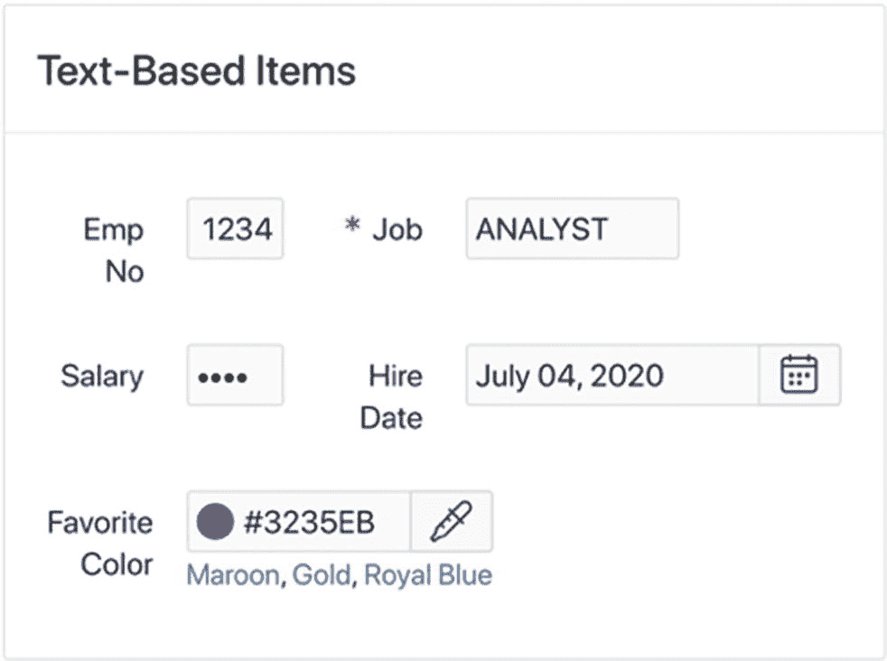

图 5-10 图 5-2 的 Text-Based Items 区域

以下小节将介绍各种基于文本的项类型及其属性，然后讨论所有基于文本项共有的一些属性。

### Text Fields

`Text Field` 是默认的项类型。它也是最简单的项类型，因为对输入框中可以输入的值没有限制。项的值就是你输入到输入框中的内容。

### Number Fields

项 `P8_EMPNO` 是一个数字字段；它与文本字段的不同之处在于其值只能是数字。数字字段项的 `Settings` 部分有几个特定于数字的属性。图 5-11 显示了 `P8_EMPNO` 的这些属性。`Minimum Value` 和 `Maximum Value` 属性允许你以明显的方式限制允许的项值。`Number Alignment` 属性允许你指定数字在输入框内的对齐方式。

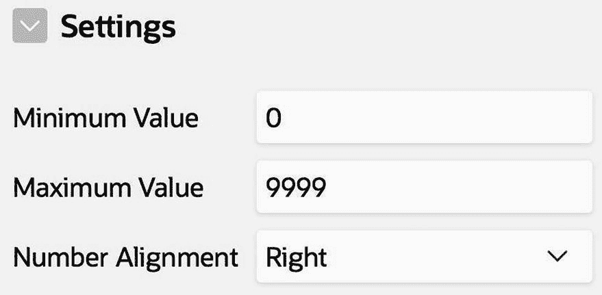

图 5-11 与数字字段相关的属性

### Password Items

项 `P8_SALARY` 是一个密码字段；它与文本字段的不同之处在于其值不会显示在页面上。输入时，其字符会被圆圈替代，页面渲染时也以这种方式显示。

### Text Fields with Autocomplete

自动完成的文本字段是一个带有相关建议值列表的文本字段。当你在输入框中键入时，页面会显示一个匹配值的菜单。如果你点击一个显示的值，APEX 会自动将该值输入到输入框中。例如，项 `P8_JOB` 是一个自动完成的文本字段，其关联列表由五个当前的职位名称组成。当我在框中输入 `a` 时，APEX 显示了职位名称 `ANALYST`（因为它是唯一以 `a` 开头的职位）；然后我就可以点击该标题而无需进一步输入。

自动完成字段使用户可以轻松输入最常见的值，但不强制他们从这些值中选择。即使从列表中选择了一个建议值，用户也可以通过继续输入来自由更改该值。

你可以在项的 `List of Values` 部分指定自动完成值列表。图 5-12 显示了 `P8_JOB` 的这个部分。

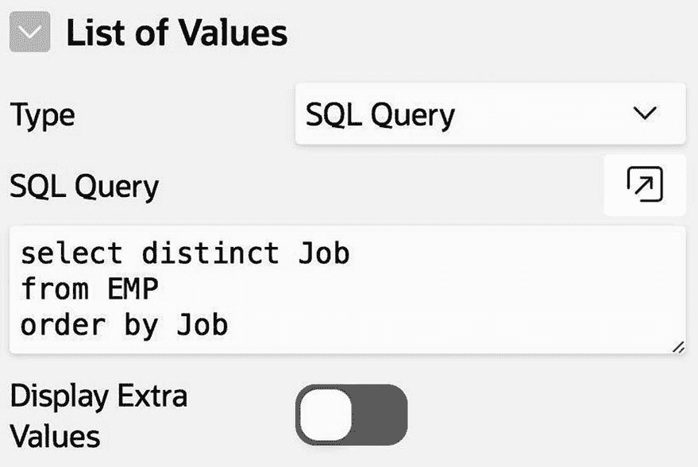

图 5-12 指定自动完成列表

有两种方式指定该列表。图 5-12 演示了第一种方式，即通过 SQL 查询。查询包含一列，其输出值构成列表。这种表达列表的方式是动态的，因为列表会随着数据库中职位标题的变化而变化。

指定值列表的另一种方式是使用静态值。为此，将图 5-12 中的 `Type` 属性设置为 `Static Values`。属性编辑器随后将显示一个名为 `Static Values` 的属性；点击它会弹出一个可以输入值的屏幕。图 5-13 显示了如果我使用静态值指定 `P8_JOB`，该屏幕的样子。`Sort at Runtime` 属性指定 APEX 是否应对多个匹配值进行排序呈现。

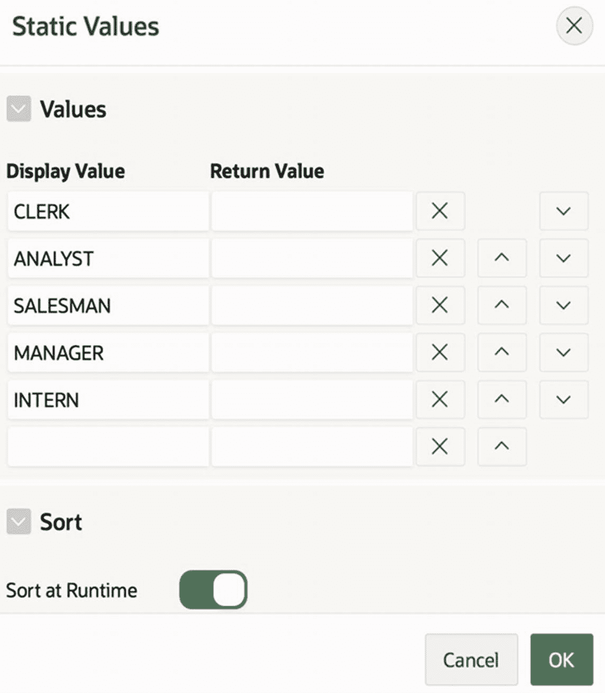

图 5-13 自动完成列表的静态规范

当值列表是固定且众所周知时，静态规范更可取。例如，在图 5-13 中，静态规范使得 `INTERN` 可以在列表上，即使当前没有具有该职位的员工。

你可能会从第 3 章回忆起，报表列可以具有 `Plain Text (based on List of Values)` 类型，它使用值列表将实际列值转换为其显示值。该值列表也是通过 SQL 查询在 `List of Values` 属性部分中指定的。该机制类似于如何指定自动完成值。例如，比较图 3-30 和图 5-12；唯一的区别是自动完成 SQL 查询有一个输出列，而不是两个。

这种相似性解释了为什么图 5-13 中的 `Static Values` 屏幕有一个用于显示值和返回值的列——该屏幕在定义执行转换的值列表时也会用到。值列表的后一种用法将在本章讨论基于列表的项类型时再次出现。

另一个相关的自动补全属性是 `Search`（搜索），它位于 `Settings`（设置）部分。此属性有如图 5-14 所示的四种可能设置。这些设置涵盖了两个问题：用户输入的文本是否区分大小写，以及用户输入的文本是否可以在建议值的任意位置匹配，还是必须从字符串开头匹配。图中显示了 `P8_JOB` 的设置，它被配置为不区分大小写，并且仅从开头匹配。

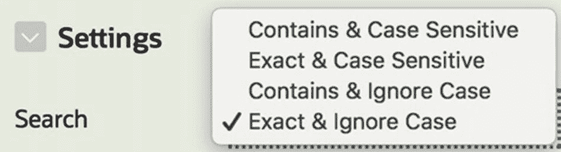

图 5-14：自动补全项的可能搜索值

## 颜色选择器

项目 `P8_COLOR` 的类型是 `Color Picker`（颜色选择器）。计算机上的颜色通常由其红、绿、蓝分量值表示，每个分量值的范围是 0 到 255。例如，在图 5-10 中，为 `P8_COLOR` 选择的值具有 (`50`, `53`, `235`) 的 (`red`, `green`, `blue`) 分量值。该颜色主要是蓝色，带有一点绿色和红色。

这些分量值可以紧凑地表示为一个十六进制数。因为一个两位的十六进制数可以表示 256 个不同的值，所以一个六位数可以表示所有可能的颜色。在图 5-10 中，该颜色由数字 `#3235EB` 表示。注意，`32` 是 50 的十六进制值，`35` 是 53 的十六进制值，`EB` 是 235 的十六进制值。

APEX 颜色选择器项允许您在已知颜色值时直接输入。或者，您可以点击滴管图标从颜色轮中选择所需的颜色，APEX 会在输入框中显示相应的数字值。颜色选择器下方的链接是 *快速选择*，稍后将进行讨论。

## 日期选择器

项目 `P8_HIREDATE` 的类型是 `Date Picker`（日期选择器）。日期选择器项由一个输入框和一个日历图标组成。与所有基于文本的项一样，用户可以自由地将所需日期输入到输入框中。但用户也可以点击图标调出日历，然后浏览日历选择一个日期，这会使日期的文本表示出现在输入框中。

日期选择器的相关属性出现在其 `Settings`（设置）部分。图 5-15 显示了 `P8_HIREDATE` 的这些值。

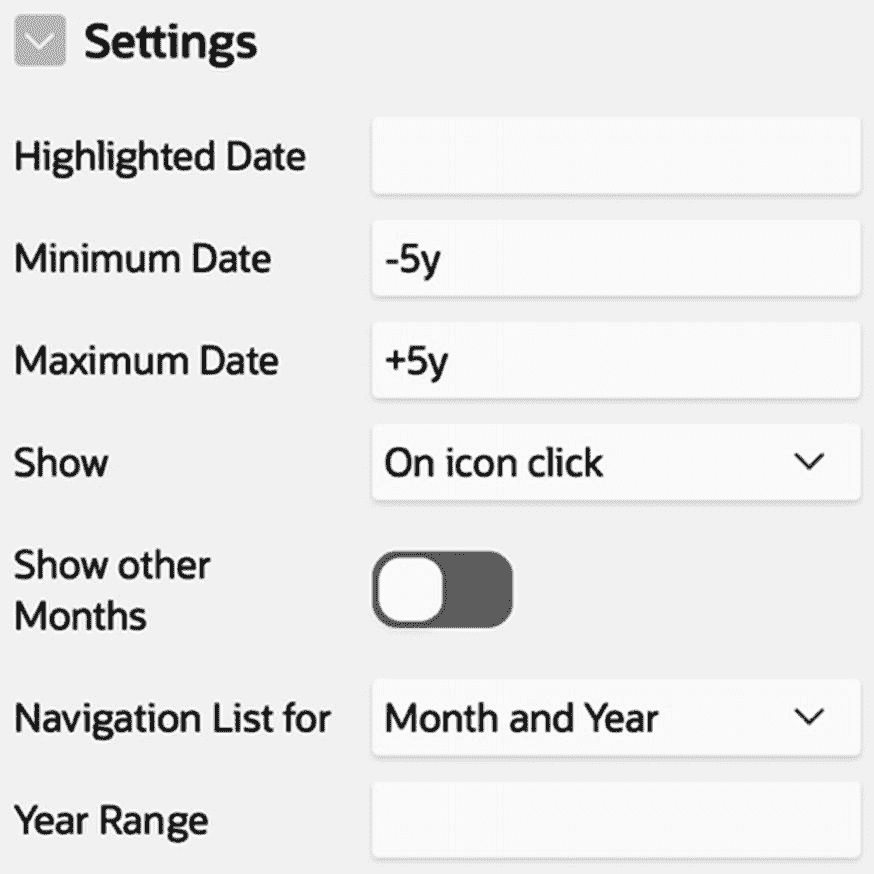

图 5-15：与日期选择器项相关的属性

`Highlighted Date`（高亮日期）属性指定日历初始选择的日期；默认情况下是当前日期。`Minimum Date`（最小日期）和 `Maximum Date`（最大日期）属性值可以通过多种方式指定。在图 5-15 中，值 `-5y` 和 `+5y` 分别指定 5 年前和 5 年后。`Show`（显示）属性允许您配置日历何时显示。日历可以在点击图标时显示（如图 5-10 所示），在鼠标悬停时显示，或始终在页面上显示。

`Navigation List for`（导航列表）属性允许您配置日历以便更快地访问日期。默认情况下，日历只有按钮可以导航到上一个月和下一个月。您可以设置该属性，以便还有直接跳转到指定月份、年份或两者的菜单。最后，`Year Range`（年份范围）属性是另一种指定最大和最小日期的方法，您可以在其中给出允许的年份范围。例如，输入值 `2018:2025` 将只允许 2018 至 2025 年之间的日期。

## 所有基于文本的项的通用属性

某些属性是所有基于文本的项所共有的，无论其类型如何。其中三个这样的属性是 `Width`（宽度）和 `Format Mask`（格式掩码）（均在 `Appearance`（外观）部分）以及 `Maximum Length`（最大长度）（在 `Validation`（验证）部分）。图 5-16 显示了项目 `P8_HIREDATE` 的这两个部分。

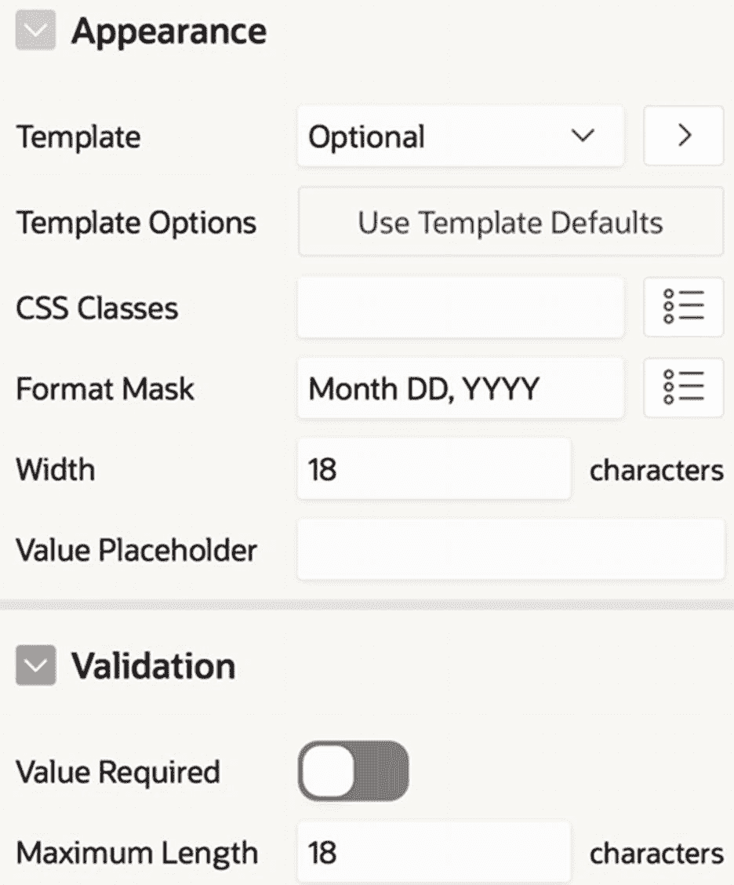

图 5-16：所有基于文本的项的通用属性

`Format Mask`（格式掩码）属性的工作方式与报表中相同。该属性的值是一个描述项值如何显示的表达式。在图 5-16 中，`Hire Date`（雇佣日期）项的格式掩码为 `Month DD, YYYY`。

`Width`（宽度）属性以字符为单位指定输入框的大小。`P8_HIREDATE` 的宽度为 18，因为这足以容纳所有日期。对于图 5-10 中的其他项，`P8_EMPNO` 和 `P8_SALARY` 的宽度为 6，`P8_JOB` 和 `P8_COLOR` 的宽度为 10。

`Maximum Length`（最大长度）属性指定用户可以输入到输入框中的最大字符数，而不考虑其宽度。项宽度和最大长度之间的区别如下。用户可以输入一个比输入框宽度更长的值——如果是这样，APEX 将在框内滚动该值。但如果用户试图输入一个比最大长度更长的值，那么 APEX 将拒绝接受额外的字符。

例如，在图 5-16 中，`P8_HIREDATE` 的 `Width`（宽度）和 `Maximum Length`（最大长度）值相同，这意味着用户无法输入比输入框大小更长的值。再举一个例子，尝试将 `P8_EMPNO` 的最大长度设置为 4；您会发现，即使输入框有空间，您也无法输入超过四个数字。

默认情况下，最大长度为空，表示没有上限。一个好的设计规则是为所有基于文本的项指定一个最大长度。在第 13 章中，您将看到没有最大长度（或不切实际的大长度）的项如何可能导致严重的安全漏洞。

基于文本的项的另一个通用部分是 `Quick Picks`（快速选择），它使您能够为该项指定常用值。例如，图 5-10 中的 `Favorite Color`（喜爱颜色）项有三个快速选择值，显示为该项下方的链接。其文本框中显示的值是我点击 `Royal Blue`（宝蓝）链接的结果。

图 5-17 显示了 `Favorite Color`（喜爱颜色）项的 `Quick Picks`（快速选择）部分。

启用 `Show Quick Picks`（显示快速选择）属性会显示标签/值文本框。请注意，您需要为每个选择指定两个值：链接中显示的值，以及点击链接时输入到文本框中的值。

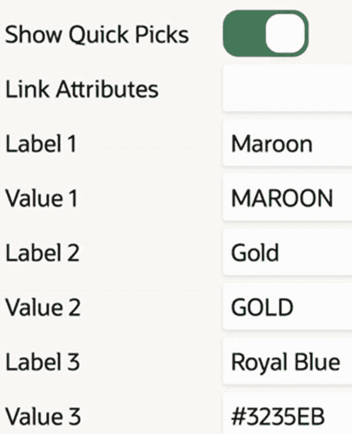

图 5-17：指定项的快速选择


快速选择项非常实用，因为它们能让用户快速输入项目值。事实上，APEX 界面中的许多项目都包含快速选择功能。例如，图 5-16 中的 `CSS Classes` 和 `Format Mask` 属性，其文本框右侧就有一个上下文菜单，图 5-5 中的 `Type` 属性也是如此。点击上下文菜单会显示该项目的快速选择值列表。遗憾的是，尽管 APEX 界面提供了多种实现快速选择的方式（如上下文菜单或链接），但使用 APEX 开发的应用程序却仅限于一种方式（即显示在项目下方的链接）。
具有快速选择功能的项目在理念上类似于自动完成项。两者都允许用户通过从建议值中选择来消除（或减少）输入。不同之处在于，自动完成菜单会随着用户的输入进行过滤，而快速选择则是一次性全部呈现给用户。因此，一个项目可以拥有任意多个自动完成值，而 APEX 将一个项目的快速选择限制为十个。

## 基于列表的项目
与基于文本的项目不同，基于列表的项目没有输入框。相反，它向用户呈现一个可供选择的可能性列表。此外，用户选择的值不一定是分配给该项目的值。也就是说，该项目向用户展示一个显示值列表；当用户选择一个显示值时，一个对应的返回值会被分配给该项目。

例如，考虑图 5-2 中 `单值列表项` 的三个子区域，这些区域在图 5-18 中重新打印。每个区域专用于三种常见的基于列表的项目类型之一——单选按钮组、选择列表和弹出列表——并且包含三个该类型的项目。虽然从图中无法看出，但这九个项目都具有相同的可能返回值集合，即部门编号集合 {10, 20, 30, 40}。此外，图中显示的选择使得每个项目的值都相同，即 30。

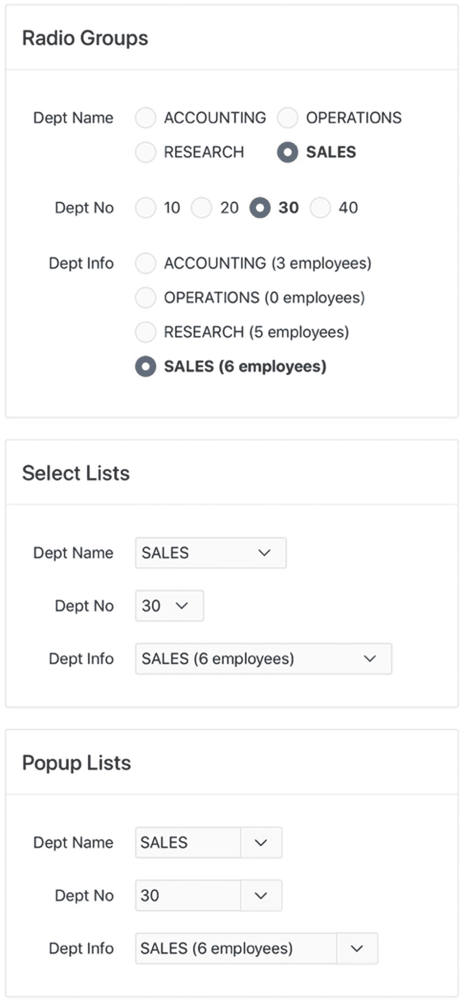
**图 5-18** 单值列表项

这九个项目具有相同的功能：用户选择一个部门，相应的部门编号就被分配给该项目。这些项目的区别仅在于其显示值是什么以及如何向用户呈现这些值。
首先考虑单选按钮组。在单选按钮组中，所有显示值都出现在页面上，用户通过点击来选择所需值。`单选按钮组` 区域中的每个单选按钮组都有不同的显示值：第一个组显示部门名称列表，第二个组显示部门编号列表，第三个组在括号中显示每个部门名称及其员工数量。
现在考虑选择列表。当用户点击选择列表时，会出现一个显示值菜单。第一个选择列表的显示值与第一个单选按钮组的显示值相同，另外两个选择列表也是如此。
最后，考虑弹出列表。当用户点击项目右侧的箭头时，会出现一个显示值菜单供用户选择。三个弹出列表的显示值与另外两个区域的相应显示值相同。
弹出列表与选择列表的不同之处在于它还有一个搜索框。用户可以在搜索框中输入所需值的前缀，然后点击放大镜；显示的值列表将被过滤，只包含具有该前缀的值。弹出列表使得从冗长的值列表中进行选择成为可能，而无需大量滚动。
单选按钮组项目的 `设置` 部分有一个 `列数` 属性。此属性指定单选按钮在页面上的排列方式。在图 5-18 中，你可以看到第一个单选按钮组有两列，第二个有四列，第三个有一列。
基于列表的项目最重要的问题是如何指定其显示值和返回值。你可以通过 SQL 查询动态指定这些值，或通过显式值静态指定。图 5-18 中的所有九个项目都是动态指定的，因此我将从这里开始讨论。

## 动态基于列表的项目
用于指定显示值和返回值之间对应关系的 SQL 查询应有两列：第一列给出显示值，第二列给出返回值。这些列的名称并不重要。

例如，考虑单选按钮组项目 `P8_RADIO_NAME`。它的查询应在第一列中包含部门名称，在第二列中包含部门编号。此外，项目 `P8_SELECT_NAME` 和 `P8_POPUP_NAME` 也将具有相同的显示值和返回值。因此，所有三个项目的值都可以通过以下查询指定：

```
select DName, DeptNo
from DEPT
order by DName
```

此查询在项目的 `值列表` 部分中指定。这与图 5-12 中指定自动完成文本项目的值列表的部分相同；唯一的区别是基于列表的项目需要一个两列查询。
现在你已经准备好配置项目 `P8_RADIO_NAME`、`P8_SELECT_NAME` 和 `P8_POPUP_NAME`。将它们的 `类型` 属性分别设置为 `单选按钮组`、`选择列表` 和 `弹出列表`，并将它们的 `值列表` 属性设置为前面的 SQL 查询。你还应该将 `P8_RADIO_NAME` 的 `列数` 属性设置为 `2`。


## 基于静态列表的项

现在考虑项 `P8_RADIO_NO`、`P8_SELECT_NO` 和 `P8_POPUP_NO` —— 也就是图 5-12 中每个区域的第二项。这些项具有相同的显示值和返回值。这里有趣的情况是显示值和返回值都是部门编号。如果你用直接的方式编写它们的 SQL 查询，那么两个输出列的名称将会相同，这在 SQL 中是非法的。为了使查询合法，你需要至少重命名其中一个列。查询应该类似于这样：

```sql
select DeptNo as DisplayVal, DeptNo as ReturnVal
from DEPT
order by DisplayVal
```

**注意**

列的名称可以是任何名称；SQL 只要求它们彼此不同。

你应该类似地配置项 `P8_RADIO_NO`、`P8_SELECT_NO` 和 `P8_POPUP_NO`，方式与前三个项相同。将它们的 `Type` 属性分别设置为 `Radio Group`、`Select List` 和 `Popup List`，并将它们的 `List of Values` 属性设置为前面的 SQL 查询。你还应该将 `P8_RADIO_NO` 的 `Number of Columns` 属性设置为 `4`。

项 `P8_RADIO_INFO`、`P8_SELECT_INFO` 和 `P8_POPUP_INFO` 的处理方式类似。它们的属性值与前几个项相同，只是查询不同。下面是该查询，它展示了如何创建复杂的显示值：

```sql
select d.DName || ' (' || count(e.EmpNo) || ' employees)' as Display,
d.DeptNo as ReturnVal
from DEPT d left join EMP e on d.DeptNo = e.DeptNo
group by d.DeptNo, d.DName
order by Display
```

查询中的左连接确保所有部门都被包含在内，即使是那些没有员工的部门。

## 多值列表项

当你使用查询来指定基于列表的项的值时，APEX 会在每次渲染页面时执行该查询。如果查询的输出永远不会改变，那么你可以使用静态表达式来避免数据库调用。

你指定静态表达式的方式与类型为 `Text Value with Autocomplete` 的项相同：首先，将 `List of Values` 部分中的 `Type` 属性设置为 `Static Values`；然后点击 `Static Values` 属性以调出“静态值”屏幕。接着，你可以为列表的每个成员输入显示值和返回值。图 5-19 展示了我如何为 `P8_RADIO_NAME`、`P8_SELECT_NAME` 和 `P8_POPUP_NAME` 填写值。

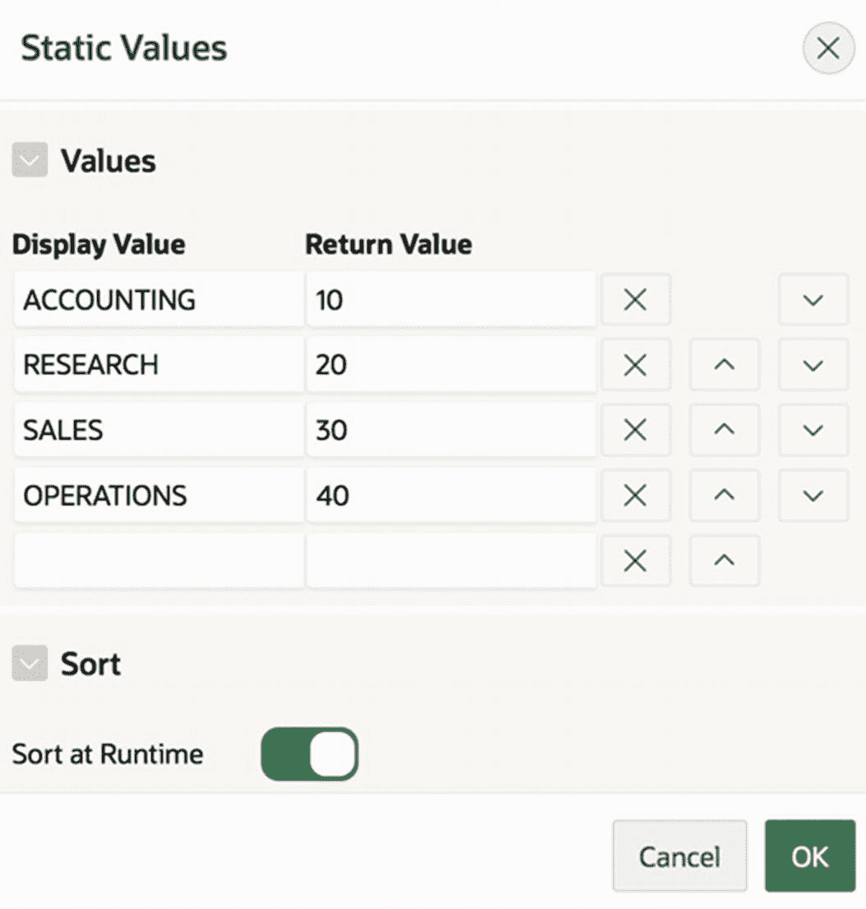
*图 5-19: 基于列表项的静态值*

基于列表的项只允许用户从其列表中选择一个值。多值列表项则允许用户从其列表中选择多个值。图 5-2 中的 `Multi-Value List Items` 区域包含四种类型的多值项，为清晰起见，该区域在图 5-20 中重新打印。此区域中的每个项都选择了其 `operations` 和 `sales` 部门。

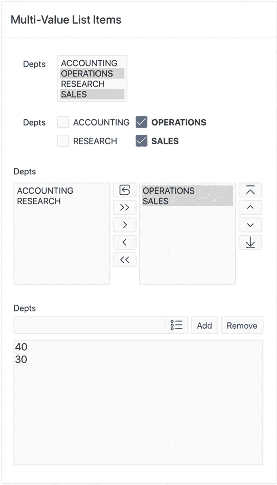
*图 5-20: 多值列表项*

多值列表项的配置方式与单值项相同。特别是，它们使用 SQL 查询或静态表达式来指明其显示值和返回值。例如，该区域中四个项的 SQL 查询是：

```sql
select DName, DeptNo
from DEPT
order by DName
```

主要问题是如何为一个选择了多个显示值的项分配单个返回值。APEX 使用约定：多值项的值是一个字符串，由所选的返回值用冒号分隔组成。如果没有选择显示值，则该项的值为 `null`。例如，图 5-20 中的所有项的值都是 `40:30`。

让我们看看这四种项类型。第一个项 `P8_M_SELECT` 是一个选择列表；也就是说，与 `Single-Value List` 区域中的项类型相同。要指定该项为多值选择列表，你需要将其 `Settings` 部分中的 `Allow Multi Selection` 属性设置为 `Yes`。其 `Appearance` 部分中的 `Height` 属性的值决定了显示多少行菜单。所有其他属性的配置方式相同。

请注意，多值选择列表 `P8_M_SELECT` 的外观和行为与单值选择列表 `P8_SELECT_NAME` 不同。多值列表始终在页面上显示菜单，而不是按需显示。（并且如果列表中的项目多于页面上可以显示的数量，会出现滚动条，以便用户滚动浏览这些值。）用户可以通过按住 Control 或 Command 键（取决于操作系统）并点击来从多值列表中选择其他菜单项。

该区域中的第二个项 `P8_CHECKBOX` 是一个复选框组。复选框组的配置与单选按钮组完全相同。复选框组与单选按钮组的不同之处在于可以选择多个复选框，并且点击一个框会切换其值。

第三个项 `P8_SHUTTLE` 是一个穿梭列表，它与多值选择列表非常相似，配置方式也相同。它们之间的区别是，多值选择列表通过高亮显示来表示选定的值，而穿梭列表则有单独的菜单来显示已选定和未选定的值。

第四个项 `P8_LIST` 是一个列表管理器，它是自动完成文本框和弹出列表的交叉产物。与自动完成类似，用户可以在输入框中输入任何值，然后点击 `Add` 按钮将其添加到选定值列表中。或者，用户可以点击弹出箭头以调出一个值菜单进行选择，选中的值会被添加到输入框中。然而，重要的是要注意，虽然弹出列表显示的是显示值，但它将返回值放入输入框。因此，图 5-20 显示选择了部门编号 `30` 和 `40`，尽管弹出列表显示的是部门名称。

## 是/否项

网页经常需要向用户请求是/否信息。图 5-2 中的 `Yes/No Items` 区域展示了执行此任务的四种不同方法，为清晰起见，该区域在图 5-21 中重新打印。该区域包含四个基于列表的项，每个都表示用户希望被联系。

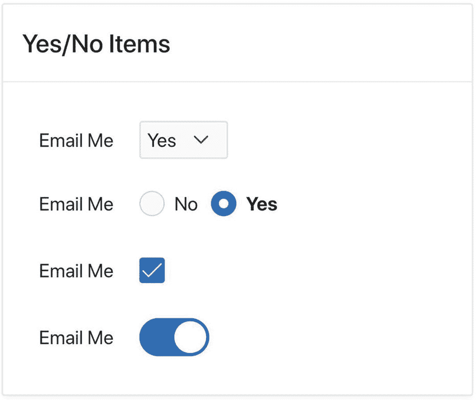
*图 5-21: 是/否项*

第一个项名为 `P8_YN_SELECT`，类型为 `Select List`，第二个项名为 `P8_YN_RADIO`，类型为 `Radio Group`。它们具有相同的值列表，即 {`No`, `Yes`}，并且它们的显示值与返回值相同。图 5-22 展示了它们的 `Static Values` 屏幕。请注意，当返回值与显示值相同时，你无需指定返回值。

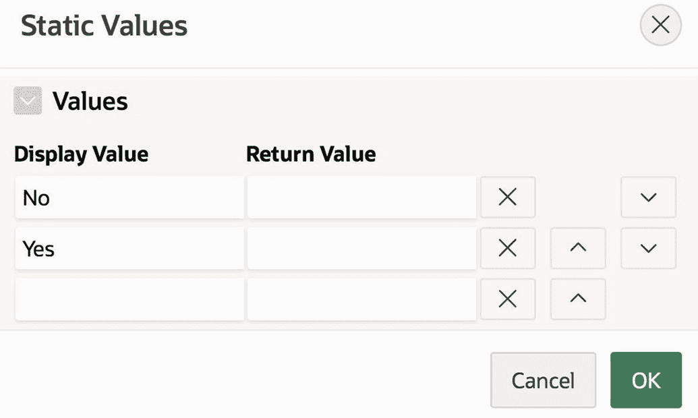
*图 5-22: 是/否选择列表和单选按钮的静态值*


第三个项目`P8_YN_CHECKBOX`，其类型为`Checkbox`。图 5-23 显示了其`静态值`屏幕。它包含一个条目，其显示值为空格，返回值为`Yes`。因此，如果选中该框，项目的值即为`Yes`；如果未选中（与所有多值项目一样），其值则为`null`。

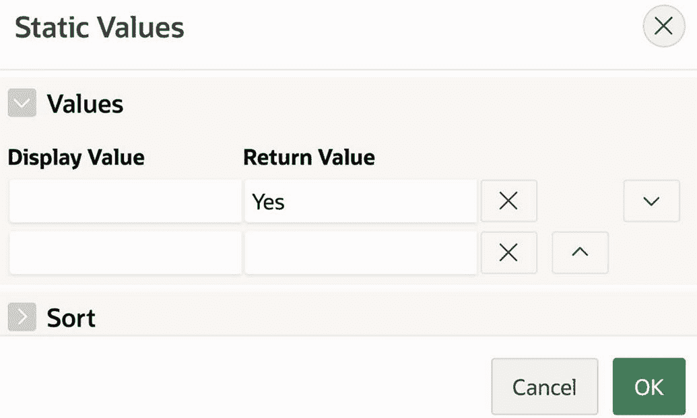

图 5-23
是/否复选框的静态值

第四个项目`P8_YN_SWITCH`，其类型为`Switch`。它不需要配置。默认情况下，它没有显示值，但有两个预定义的返回值：如果开关打开则为`Y`，如果关闭则为`N`。

## 基于显示的项目

还有另外两种有用的项目类型未出现在`项目示例器`页面中：`仅显示`项目和`隐藏`项目。这些项目与你已见过的其他项目不同，因为用户无法为它们赋值；它们的值只能由 APEX 服务器分配。一个仅显示的项目有一个标签和一个文本值，类似于文本字段；不同之处在于该值不在输入框中且不可编辑。例如，再次参考图 5-1；标有`模式`和`表`的字段就是仅显示的。隐藏项目不可见，用户不知道它们的存在。它们通常用于保存操作的值，以便另一个操作可以使用它。你将在第 6 章中看到此技术的示例。

## 项目的初始值

当 APEX 渲染一个页面时，它会为页面上的每个项目分配一个初始值。如果项目是基于文本的，APEX 会将该值放入该项目的输入框中；如果项目是基于列表的，APEX 会使用该值来确定相应的初始显示值。APEX 通过两种方式之一确定此初始值：它可以计算项目的`源表达式`，或者可以使用先前存储在会话状态中的值。由于尚未介绍会话状态的概念，现在假设会话状态值始终为`null`。

你在属性编辑器的`源`部分指定项目的源表达式。图 5-24 显示了此部分的两个重要属性`类型`和`用法`，以及它们的默认值。

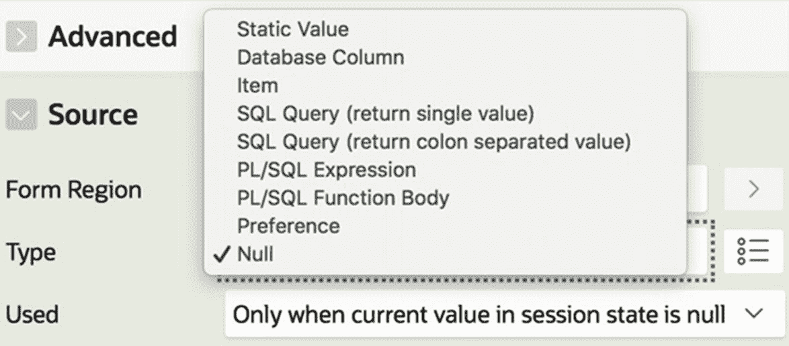

图 5-24
项目的源属性

`类型`属性指定了源表达式的类型；图 5-24 显示了所有可能的源类型。三个常见的选择是`Null`（默认值）、`静态值`和`SQL 查询（返回单个值）`。选择`Null`以外的类型将导致属性编辑器显示一个用于输入源表达式的区域。`用法`属性指定了源表达式适用的时间。默认选择（如图 5-24 所示）是：如果会话状态不为`null`则使用它，否则使用源表达式。另一个选择（图中未显示）是始终使用源表达式。这些选择将在第 6 章中讨论。

如果你使用 SQL 查询作为源类型，则该查询必须返回单行单列；项目的初始值即为该查询返回的值。例如，再次考虑`项目示例器`页面的基于文本的项目，如图 5-10 所示。假设你希望`P8_EMPNO`的初始值是总裁的员工编号。你可以将其源类型设置为`SQL 查询（返回单个值）`，并将其源查询设置为以下查询：

```sql
select EmpNo
from EMP
where Job = 'PRESIDENT'
```

再举一个例子，假设你希望图 5-18 中每个项目的初始值是按字母顺序排列的第一个部门（如果有多个部门名称相同，则使用部门编号最小的来打破平局）。你可以为每个项目分配以下源表达式：

```sql
select min(DeptNo)
from DEPT
where DName in (select min(DName) from DEPT)
```

类型为`静态值`的源表达式通常是一个常量。例如，假设你希望图 5-18 中项目的初始值是销售部门。只需将每个项目的源表达式设置为`30`。如果你希望图 5-20 中多值列表项目的初始值同时是运营部和销售部，请将这些项目的源表达式设置为`30:40`。列表类项目出现的一个问题是它们应如何响应不是其指定返回值之一的初始值。例如，假设你分配静态值`85`作为列表值项目的源。由于没有编号为 85 的部门，项目应显示什么？有两种选择：接受该值并（临时）将其添加到列表中，或者拒绝该值并显示列表中的一个任意值。此选择由`值列表`部分中的`显示额外值`属性指定，如图 5-12 所示。在大多数情况下，显示一个不是有效可选选项的值是没有意义的，因此通常应关闭`显示额外值`。

## 按钮

按钮在点击时执行一个`操作`。APEX 按钮有两种基本操作：它可以`重定向`或`提交`。`重定向`一词简单地意味着转到另一个网页。在这方面，按钮的作用类似于 HTML 链接。`提交`一词意味着让 Web 服务器处理当前页面。此处理可以涉及设置会话状态和在数据库上执行操作，以及移动到另一个页面。第 6 章到第 10 章将详细涵盖重定向和提交操作的用途。作为一个例子，让我们看看如何在`项目示例器`页面的`一些按钮`区域添加两个按钮：一个操作是`重定向到页面 8`的`取消`按钮和一个操作是`提交`的`提交`按钮。

在区域中创建按钮有两种方式。第一种方式是右键单击渲染树中区域的节点并选择`创建按钮`操作。或者，你可以将页面设计器库中的按钮图标拖放到区域中（类似于拖放项目的方式）。无论哪种情况，APEX 都将在其区域节点下名为`区域按钮`的子树中为按钮创建一个节点。图 5-25 显示了创建两个按钮后`项目示例器`的渲染树。

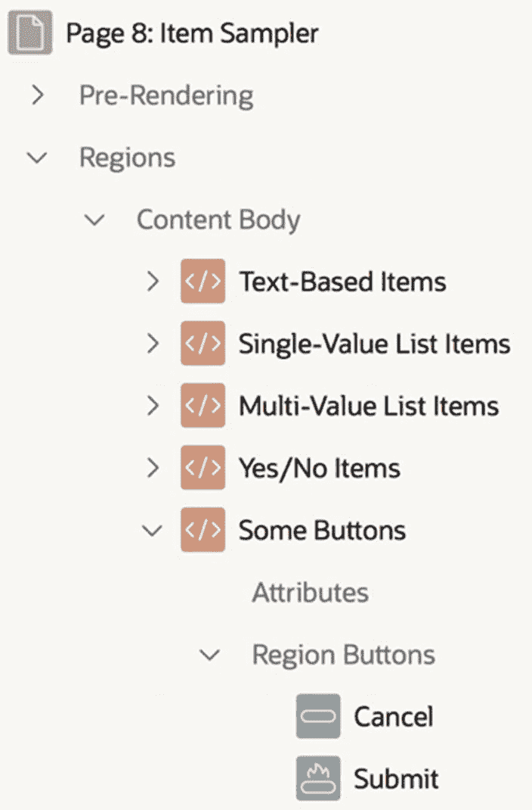

图 5-25
向渲染树添加按钮

要配置按钮，你需要指定四项内容：其名称、标签、操作和位置。按钮的名称和标签在`标识`部分指定；参见图 5-26。按钮的名称是 APEX 用于标识按钮的内部值，不能包含空格。按钮的标签是任意的 HTML 字符串，在页面渲染时随按钮一起显示。

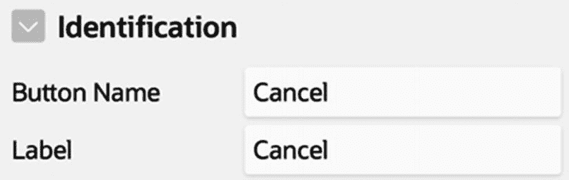

图 5-26
标识按钮


## 按钮行为与位置

按钮的动作在其 `Behavior` 部分中指定。`Action` 属性有五个可能的值，如图 5-27 所示。最常见的选项是 `Submit Page` 和 `Redirect to Page in this Application`。适用于重定向动作的 `Target` 属性允许您指定目标页面。

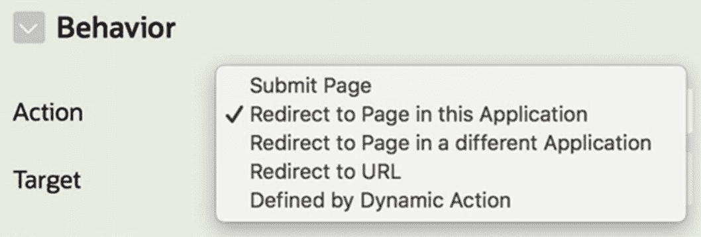
*图 5-27：可能的按钮动作*

按钮的位置由 `Layout` 部分中的 `Button Position` 属性决定。图 5-28 显示了可能的值。

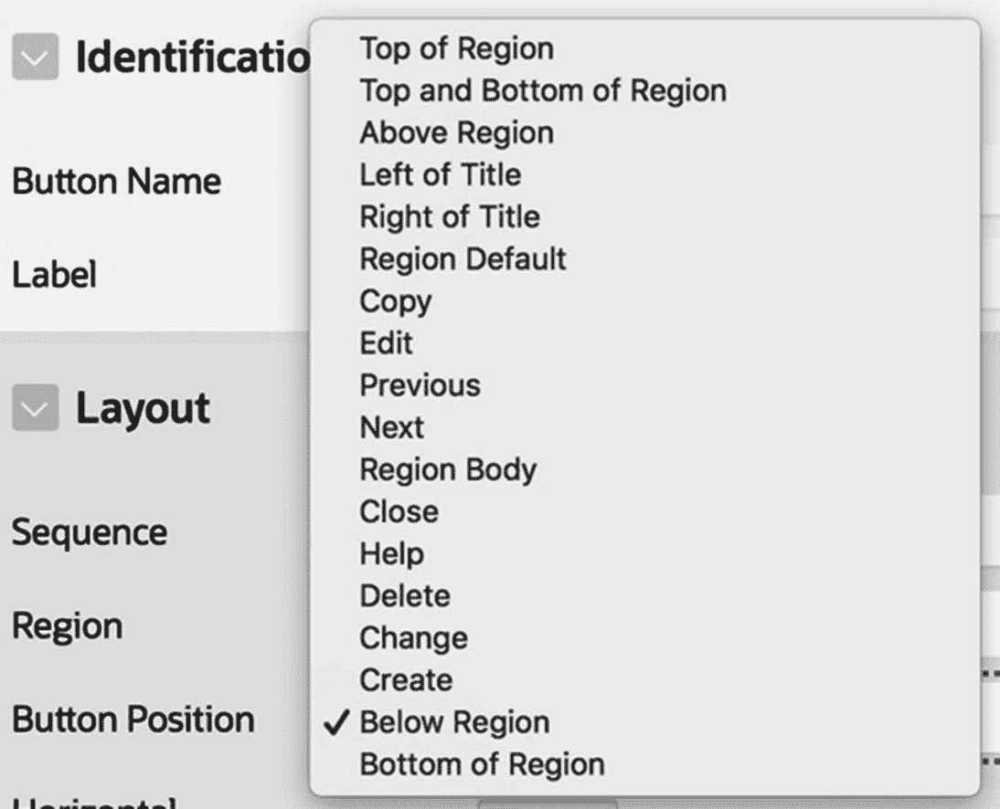
*图 5-28：可能的按钮位置*

尽管有多种可能的位置，但它们可分为四个基本类别：

*   在区域的标题中
*   在区域的顶部或底部
*   在区域的预定义位置
*   在区域体中

值 `Left of Title` 和 `Right of Title` 将按钮放置在区域的标题中，位于标题的左侧或右侧。如果多个按钮位于同一位置，它们的相对位置由它们的序号决定。

值 `Top of Region`、`Top and Bottom of Region`、`Above Region`、`Below Region` 和 `Bottom of Region` 将按钮显示在区域的顶部或底部。当您选择这些值之一时，属性编辑器会显示 `Horizontal Alignment` 属性，该属性允许您指定按钮应出现在区域的左侧还是右侧。图 5-2 中的按钮位于区域顶部，并向右对齐。

许多页面模板为某些按钮指定了特殊位置。其目的是确保跨多个区域通用的按钮位于这些区域中的相同位置。按钮位置 `Copy`、`Edit`、`Previous`、`Next`、`Close`、`Help`、`Delete`、`Change` 和 `Create` 对应于这些特殊用途的按钮，尽管您可以自由地将它们用于任何按钮。特别值得注意的是 `Copy` 和 `Edit` 位置，它们将按钮显示在标题的最右侧。

`Region Body` 位置与其他位置不同，因为它将按钮放置在区域的项目之中。当您选择此值时，会出现一个 `Layout` 部分，供您指定按钮相对于区域中其他项目的位置。此外，按钮在渲染树中的节点会出现在区域项目的子树中。

图 5-2 中的两个按钮颜色不同：`Cancel` 按钮与页面项目具有相同的颜色方案，而 `Submit` 按钮是蓝色的。`Submit` 按钮的颜色旨在吸引用户的注意；APEX 称其为 *热按钮*。按钮的 `Appearance` 部分有一个名为 `Hot` 的属性，可让您指定按钮是否为热按钮。图 5-29 显示了 `Submit` 按钮的这个部分。

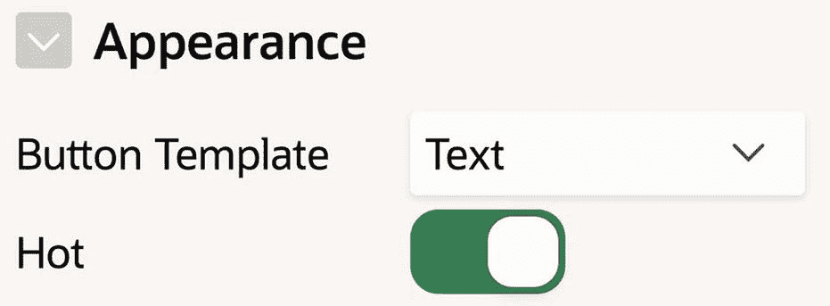
*图 5-29：指定热按钮*

## 总结：项目

项目是保存值的页面元素。有许多项目类型，它们在页面上显示值的方式以及帮助用户指定该值的方式上有所不同。最重要的是区分基于文本的项目和基于列表的项目。

基于文本的项目在其输入框中显示其值，用户可以通过在输入框中键入来指定值。基于文本的项目类型支持输入特殊值（如颜色和日期）、辅助数据输入（如自动完成）以及限制允许的值（如数字字段）。

基于列表的项目强制用户从给定的值列表中选择。该列表可以通过 SQL 查询动态定义，也可以通过显式值静态定义。在任何情况下，都存在显示值（呈现给用户的值）和返回值（项目实际持有的值）之间的区别。各种基于列表的项目类型主要区别在于它们如何在页面上呈现显示值。

项目的目的是允许用户向服务器发送一个值。第 6 章将研究这个问题，并提供展示项目在 Web 应用程序中典型用法的示例。

## 会话状态

用户与应用程序的交互称为 *会话*。一个会话可以包含多个页面请求。例如，在电子商务应用程序中，一个会话可能涉及浏览待售商品、将其中一些添加到购物车、输入付款和运输信息以及完成交易。

在会话期间，用户为页面项目赋值，可能涉及多个页面，并将这些值发送到服务器进行处理。给定会话的项目值构成其 *会话状态*。在本章中，您将研究应用程序可以修改和访问会话状态的各种方式，并了解一些利用此状态的常见页面设计技术。

## 会话 ID

在 Web 应用程序中构建会话功能是有问题的，因为浏览器请求是匿名的。服务器没有内置方法来知道两个浏览器请求是否属于同一个会话。APEX 通过为每个会话分配一个标识符来解决此问题。浏览器请求通过将会话 ID 添加到请求中来指示其会话。

回想一下，APEX URL 由字符串 `f?p=` 后跟冒号分隔的值字符串组成。前两个值是应用程序 ID 和页面 ID；第三个值是会话 ID。要查看实际操作中的会话 ID，请登录 APEX 并浏览其屏幕。查看与您访问的每个屏幕关联的 URL。您应该会发现每个 URL 都具有相同的会话 ID 值。现在从 APEX 注销。当您重新登录时，APEX 将为此次交互分配一个新的会话 ID。您访问的每个屏幕的 URL 现在都将具有这个新的会话 ID。

您也可以在您自己的应用程序中观察会话 ID。从 APEX 注销并运行您的 `Employee Demo` 应用程序。APEX 将分配一个会话 ID，该 ID 将出现在每个页面的 URL 中。您可以通过提交会话 ID 为 0 的请求来请求新的会话。（实际上，任何随机 ID 值都可以。）例如，我可以通过提交以下 URL 在新会话中查看我的应用程序的主页：

```
apex.oracle.com/pls/apex/f?p=91392:1:0
```

当页面加载时，URL 将包含一个新的会话 ID。


## 提交与重定向

假设你修改了网页上某个项目的值，可能是通过选择单选按钮或在文本字段中输入。你的浏览器知道如何直接显示这一更改，而无需请求服务器重新渲染页面。因此，服务器将对你对该值所做的更改一无所知，从而无法使用新值。

如果你希望应用程序知道页面上各项的值，你必须先将这些值上传到服务器。此操作称为 `提交`。服务器为你的应用程序的每个项目都持有一个变量。当你提交页面时，该页面上每个项目的值都会保存在对应的变量中。实际上，提交操作将会话状态与当前页面同步。

回顾一下，按钮的操作要么是 `提交`，要么是 `重定向`。这两种操作都会导致 APEX 服务器渲染一个目标页面并将其发送到浏览器。对于重定向，你在重定向操作中指定目标页面。对于提交，你通过单独的 `分支` 组件指定目标页面——如果未指定分支，则重新加载当前页面。分支在第 9 章中讨论，因此目前你可以假设提交操作总是重新加载当前页面。

提交和重定向的主要区别在于，提交会将页面的项目值上传到服务器，而重定向不会。如果用户更改了页面上某些项目的值，然后执行重定向，这些更改将会丢失——即使重定向到的是同一个页面。

为了看到这种差异的示例，考虑第 5 章中的 `项目采样器` 演示页面，如图 5-2 所示。回顾第 5 章，项目的初始值由其 `源` 属性决定。默认是使用会话状态值（如果它不为空）。这意味着如果你为项目分配一个非空值并提交，那么当页面重新加载时，该值将成为该项目的初始值。你可以通过更改页面上的一些值并点击 `取消` 按钮来验证这一事实。因为该按钮执行的是重定向，你的更改会丢失。现在再次修改这些值并点击 `提交` 按钮。项目值保持选择后的状态，因为提交操作将这些更改写入了会话状态，并在页面重新加载时检索了它们。如果你导航到不同的页面再返回，这些值仍然会存在。

回顾一下，当你在 APEX 中运行页面时，开发者工具栏会出现在屏幕底部。标记为 `会话` 的工具栏按钮显示当前的会话状态。点击它会打开一个窗口，显示所有项目及其当前的会话值。在调试页面时，这个窗口非常有用。在示例中，打开会话窗口并查看会话状态。然后更改一些项目并提交。再次打开会话窗口，验证项目值是否已更改。

重要的是要理解，指定项目的初始值会影响浏览器中的项目值，但绝不会改变其在会话状态中的值。你可以在 `项目采样器` 页面上进行一些实验来验证这一事实。转到属性编辑器，将项目 `P8_JOB` 的源设置为静态表达式 `CLERK`，并将其使用设置为 `始终，替换会话状态中的任何现有值`。运行页面，将项目的值更改为 `ANALYST`，然后点击 `提交` 按钮，检查每一步的会话状态。会话状态值在页面提交之前一直保持空白，在提交时变为 `ANALYST`。然而，当页面渲染时，浏览器会显示 `CLERK`。现在回到属性编辑器，将该项目的 `源使用` 属性更改为 `仅当会话状态中的当前值为空时` 并重复实验。（首先将项目值设为空白并点击 `提交` 按钮以清除会话状态。）你应该观察到会话状态值的行为与之前相同。然而，浏览器会显示 `CLERK`，直到你提交一个新值，之后它将显示该值。

## 使用项目提交页面

提交页面的主要方式是使用按钮。然而，某些项目类型也可以执行提交。文本字段或密码字段的 `设置` 部分有一个属性 `按下回车键时提交`。启用此属性会使该项目在用户按下 `Enter` 键时提交页面。

选择列表或单选按钮组的 `设置` 部分有一个属性 `选择时的页面操作`。该属性在图 6-1 中针对选择列表显示。该属性的默认值是 `无`。如果你将其设置为 `提交页面`，则每当用户更改项目值时，页面都会被提交。

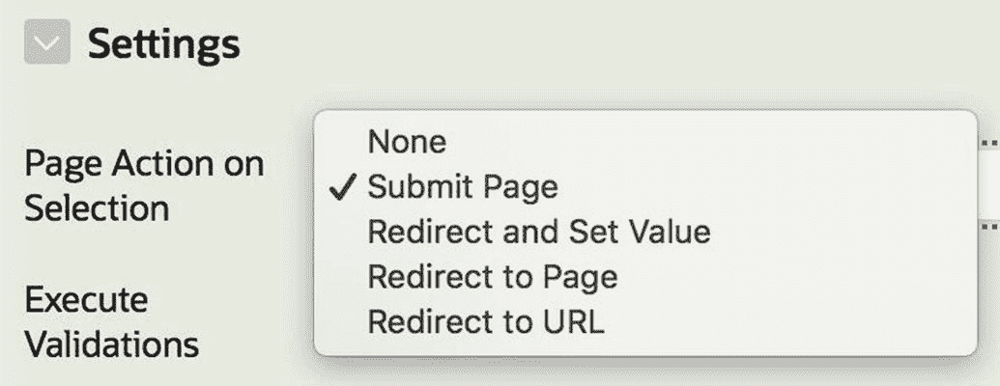

*图 6-1 选择列表可能的操作*

该图还显示了此属性的另外三个值。这些值对应于不同形式的重定向。`重定向并设置值` 选项将该项目的值保存在会话状态中，然后重定向到同一页面。也就是说，它的行为类似提交，但仅针对一个项目，而不是页面上的所有项目。

`重定向到页面` 和 `重定向到 URL` 选项具有不同的意图。`重定向到页面` 操作使项目充当导航列表——其值被解释为页码，选择一个值会导致 APEX 重定向到该页面。例如，考虑一个选择列表，其静态值如图 6-2 所示，且其操作为 `重定向到页面`。该项目显示三个选项（`主页`、`员工报告`、`图表`）；选择一个选项会重定向到相应的页码。

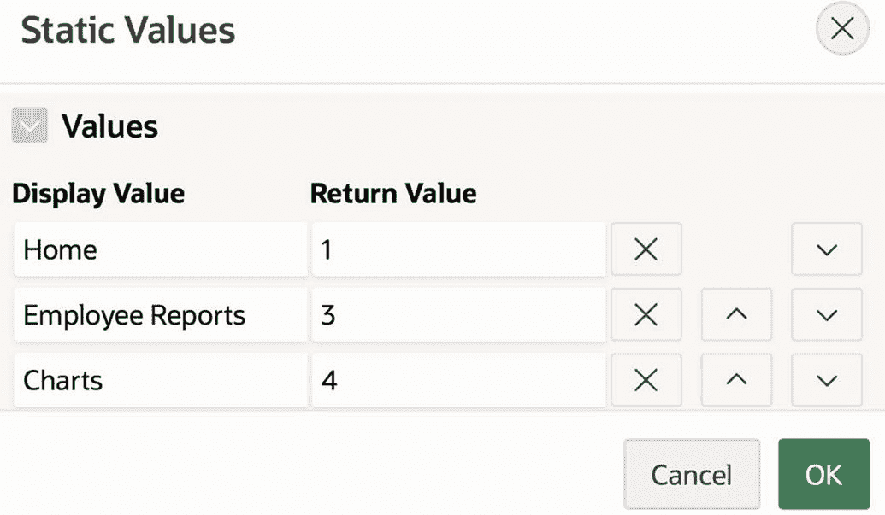

*图 6-2 用于重定向到页面操作的静态值*

`重定向到 URL` 选项类似，只是项目值被假定为 URL。这两个选项都不会改变会话状态。

## 重定向可以设置会话状态

考虑一个按钮的重定向操作。尽管该操作不提交页面，但它仍然可以修改会话状态。

当你将按钮的操作设置为 `重定向到此应用程序中的页面` 时，属性编辑器中会出现 `目标` 属性。点击该属性的输入框会弹出图 6-3 所示的 `链接构建器` 向导页面。

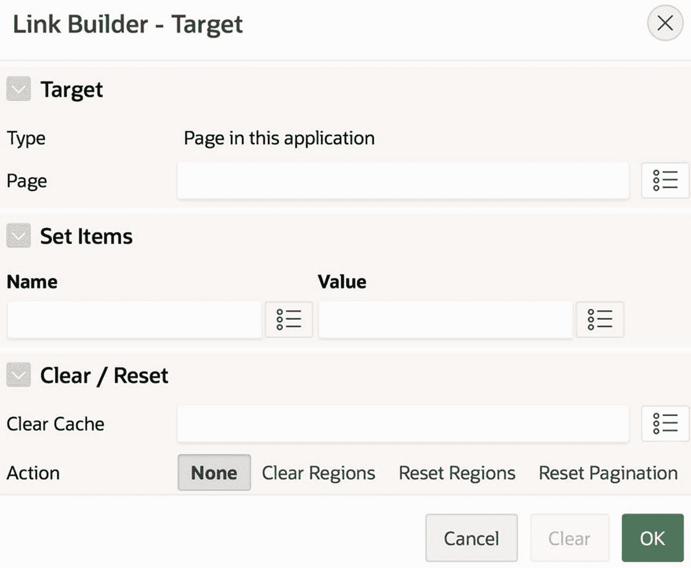

*图 6-3 链接构建器向导页面*

除了将 `页面` 属性设置为所需的目标外，你还可以使用 `设置项目` 部分来设置任意多个项目的值。在 `名称` 框中输入项目名称，在 `值` 框中输入其所需的会话状态值。每次你填完一行，就会出现另一行，从而允许你输入任意多的名称/值对。

例如，再次考虑图 5-2 的 `项目采样器` 页面。假设你希望 `取消` 按钮将项目 `P8_EMPNO` 的值设置为 `9999`，将 `P8_JOB` 的值设置为 `CLERK`，并清除 `P8_SALARY` 中的值。那么链接构建器的 `设置项目` 部分将如图 6-4 所示。

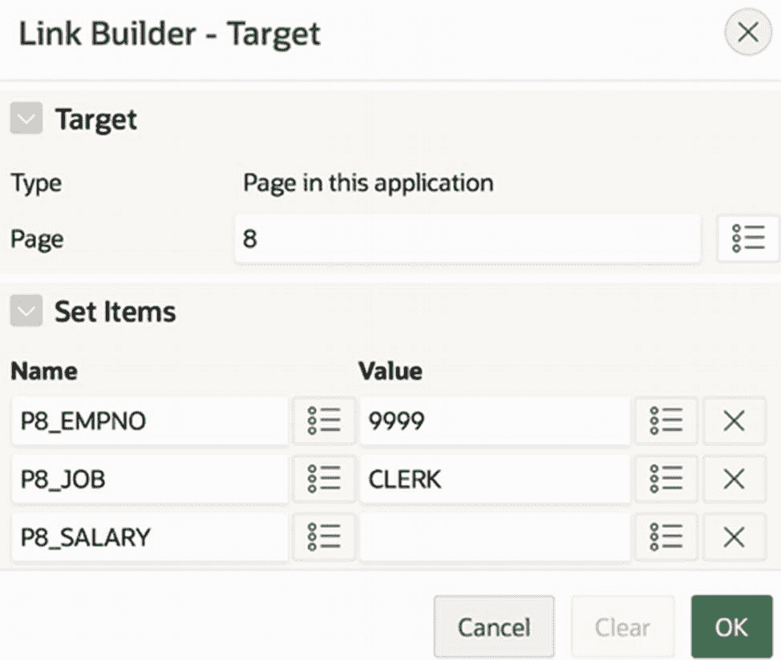

*图 6-4 在重定向时指定项目值*


假设你希望 `取消` 按钮能清除页面上所有项目的会话状态。APEX 将此称为 `清除缓存`，并在链接构建器中提供了 `清除缓存` 属性来实现此功能。例如，在图 6-3 中，向 `清除缓存` 输入框键入 `3,4,8` 将清除第 3、4 和 8 页上所有项目的会话状态。如果你还在 `设置项目` 部分指定了项目，APEX 将在清除缓存后为这些项目赋值。

请注意，这种修改会话状态的方式与提交操作完全不同，因为它不（且不能）使用浏览器中显示的值。也就是说，来自按钮的重定向可以将项目的会话状态值设置为常量或计算值，但无法将其设置为用户输入的浏览器值。

### 引用会话状态变量

既然你已了解如何设置会话状态变量的值，接下来需要知道如何让页面访问该值。主要有两种技术。如果你想在 SQL 代码中引用该变量，请在项目名称前加上冒号。这种引用称为 `绑定变量`。如果你想在 HTML 表达式中引用项目，请在项目名称前加上 `&` 符号，并在末尾加上句点。后一种引用称为 `替换字符串`，已在第 3 章介绍过。

例如，考虑 `Item Sampler` 页面上的项目 `P8_EMPNO`。要将其作为替换字符串引用，请写作 `&P8_EMPNO.`。要将其作为绑定变量引用，请写作 `:P8_EMPNO`。

在本书中，你已经看到了 SQL 查询的几种用途，例如作为报表或图表的源、项目的初始值，以及基于列表的项目的值定义。你也看到了 HTML 表达式的几种用途，例如页面或区域的标题，以及项目的标签。本章剩余部分将举例说明如何通过在这些 SQL 查询和 HTML 表达式中使用项目引用，来极大增强页面的功能。

在构建本章的任何页面之前，你可能需要转到 `桌面导航菜单` 的 `列表详情` 页面（如图 4-21 所示），并添加一个名为 `会话状态` 的根条目。然后，每次创建页面时，你都可以将其导航菜单条目的父项设置为 `会话状态`。

## 自定义报表

`自定义报表` 是其内容受一个或多个项目值影响的报表。用户在页面上为某些项目输入值并点击 `提交` 按钮。然后，页面将根据这些输入值显示一个报表。在本节中，你将构建三个自定义报表页面来阐述此技术。

### 按职位和部门筛选页面

第一个页面名为 `按职位和部门筛选`，是演示应用的第 9 页，见图 6-5。其思路是用户为 `职位` 和 `部门` 项目选择值，然后点击 `提交` 按钮。随后，报表将显示具有所选职位且属于所选部门的员工。例如，图 6-5 显示了研究部门中的办事员。

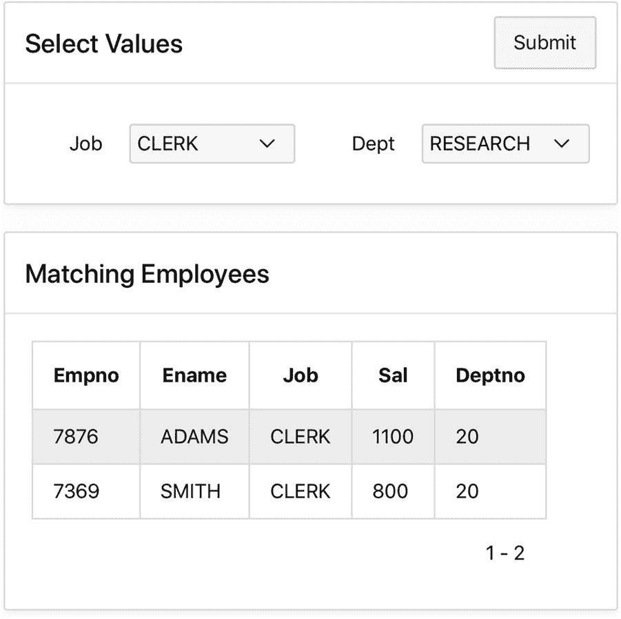

图 6-5 按职位和部门筛选页面

此页面有两个区域：`选择值` 和 `匹配的员工`。`选择值` 区域是一个静态内容区域，包含两个选择列表 `P9_JOB` 和 `P9_DEPTNO`，它们的值都由 SQL 查询定义。`P9_JOB` 的值列表查询如下：

```sql
select distinct Job as DisplayVal, Job as ResultVal
from EMP
order by DisplayVal
```

`P9_DEPTNO` 的值列表查询如下：

```sql
select DName, DeptNo
from DEPT
order by DName
```

按钮的操作是 `提交`，其位置为 `编辑`。

`匹配的员工` 区域是一个报表区域。为了让报表显示具有所选职位和部门编号的 `EMP` 记录，其源查询需要引用两个项目的值。以下查询实现了这一点；请注意它如何使用绑定变量语法来引用这两个项目。

```sql
select EmpNo, EName, Job, Sal, DeptNo
from EMP
where Job = :P9_JOB  and  DeptNo = :P9_DEPTNO
order by EName
```

你可以通过允许用户为 `P9_JOB` 或 `P9_DEPTNO` 选择 `空` 值来增强此区域的功能。意图是，`P9_JOB`（或 `P9_DEPTNO`）的 `空` 值应表示查询不会使用该项目进行筛选。例如，如果两个项目都是 `空`，报表将显示所有员工。要实现此功能，请修改源查询以显式测试 `空` 项目值，如下所示：

```sql
select EmpNo, EName, Job, Sal, DeptNo
from EMP
where (:P9_JOB is null  or  Job = :P9_JOB)
and   (:P9_DEPTNO is null  or  DeptNo = :P9_DEPTNO)
order by EName
```

我想指出，此页面并非必须使用两个区域。事实上，很容易修改此页面以使用单个区域。首先，转到项目 `P9_JOB` 的 `布局` 部分，将其 `区域` 属性更改为 `匹配的员工`。然后对 `P9_DEPTNO` 和 `提交` 按钮执行相同操作。最后，转到 `匹配的员工` 的 `外观` 部分，将其 `项目显示位置` 属性设置为 `内容上方`，以便这两个项目显示在报表上方。（你也可以根据需要删除 `选择值` 区域。）现在运行该页面。你会发现其行为没有改变。也就是说，使用一个还是两个（甚至三个！）区域的决定纯粹基于美观。

### 按可能部门筛选页面

第二个自定义报表页面名为 `按可能部门筛选`，是演示应用的第 10 页，见图 6-6。此页面的结构与上一个类似。顶部区域用于输入——用户从一个复选框项目中选择部门，然后点击 `提交` 按钮。底部区域显示所选部门中员工的报表。例如，在图 6-6 中，`会计` 和 `研究` 框被选中，这意味着报表列出了会计或研究部门的员工。如果没有选中任何框，报表将不显示任何记录。

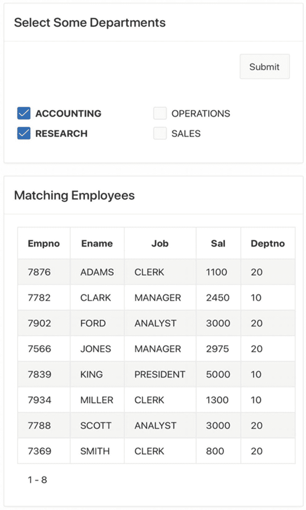

图 6-6 按可能部门筛选页面

`选择一些部门` 区域是一个静态内容区域，包含一个复选框项目和一个按钮。复选框项目名为 `P10_DEPTNO`，其模板是 `隐藏`，其值由查询定义：

```sql
select DName, DeptNo
from DEPT
order by DName
```

回想一下，多值项目的值是一个字符串，其中包含用冒号分隔的所选复选框值。例如，在图 6-5 中，`P10_DEPTNO` 的值是 `10:30`。如果选中所有四个部门，值将为 `10:40:20:30`。（字符串中所选值的顺序基于项目值列表查询的排序顺序，在本例中是按部门名称排序。）

`匹配的员工` 区域是一个经典报表。任务是为报表设计一个源查询，该查询将根据此项目值筛选记录。一种方法是测试每条 `EMP` 记录，看其 `DeptNo` 值是否是 `P10_DEPTNO` 的子字符串。这种方法会产生以下查询，它几乎可以工作：

```sql
select EmpNo, EName, Job, Sal, DeptNo
from EMP
where InStr(:P10_DEPTNO,  DeptNo) > 0
order by EName
```


## 按薪资范围筛选页面

第三个定制的报表页面名为 `Filter by Salary Range`，在演示应用中是第 11 页，如图 6-7 所示。用户输入最低和最高薪资值，然后点击 `Submit` 按钮。页面随后会为指定薪资范围内的员工定制一个按职位分类的员工图表。

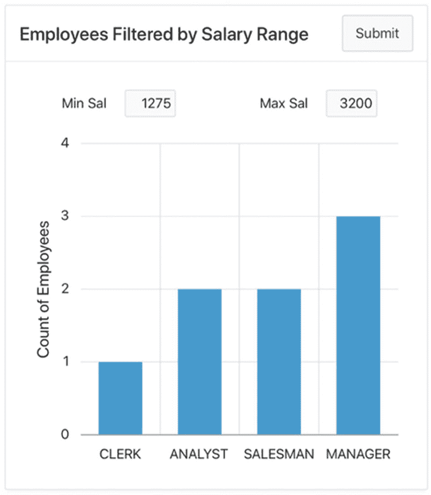

图 6-7 “按薪资范围筛选”页面

该页面包含一个类型为 `chart` 的区域。该区域的 `Item Display Position` 属性（在其 `Appearance` 部分中）值为 `Above Contents`，这就是为什么两个项目项和 `Submit` 按钮位于图表上方。这两个名为 `P11_MINSAL` 和 `P11_MAXSAL` 的项目项是数字字段，其 `Width` 值为 `5`。按钮的位置是 `Edit`。

当然，此页面定制的是图表而非报表，但技术完全相同。回顾第 3 章，该图表的源查询将有两个输出列：一个标签（此处为 `Job` 的值）和一个系列值（此处为该职位的记录数）。要定制图表以仅考虑指定薪资范围内的员工，只需将该限制添加到查询的 `where` 子句中。源查询变为：

```
select Job, count(*) as EmpCount
from EMP
where (:P11_MINSAL is null  or  :P11_MINSAL = Sal)
group by Job
order by EmpCount
```

与“按职位和部门筛选”页面一样，此查询确保 `null` 项目项值不会参与筛选。您也应该清楚，如果您决定将两个项目项和按钮移到单独的区域中，图表的源查询将是相同的。如果不清楚，可以尝试一下看看效果。

## 主从报表

主从报表由两份报表组成。这两份报表是*链接*的，意味着明细报表的每一行在主报表中都有关联行。用户通过选择主报表中的一行来进行交互；明细报表则通过仅显示与所选主记录关联的明细行来响应。

在本节中，您将构建一个名为 `Employees by Department` 的主从页面，它是 `Employee Demo` 应用程序的第 12 页。其主报表包含每个部门的一行。单击某个部门行会导致明细报表显示该部门的员工列表。图 6-8 显示了单击会计部门链接后的页面。


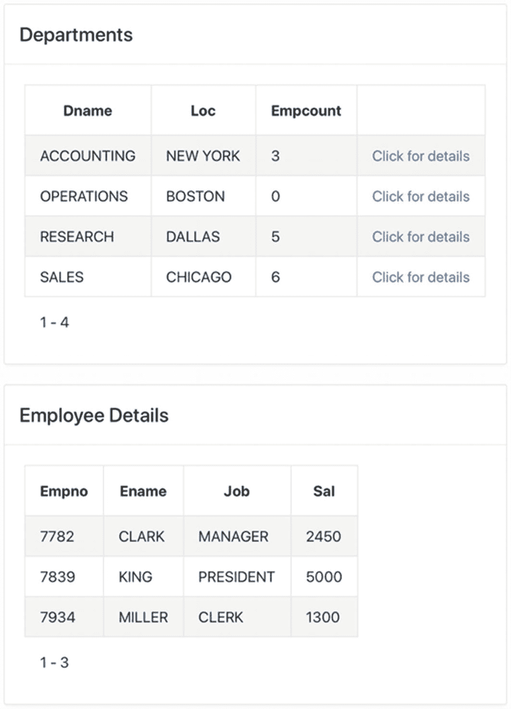

图 6-8
按部门查看员工页面

思考如何实现此页面。主要问题在于，主报表需要让明细报表知道选择了哪一行。标准技术是使用一个隐藏项，其值就是所选行的键值。我们将此项命名为 `P12_DEPTNO`。主报表会将选中行的 `DeptNo` 值赋给 `P12_DEPTNO`。然后明细报表将使用此值来自行定制显示内容。

实现定制的明细报表很直接，其源查询如下：

```
select EmpNo, EName, Job, Sal
from EMP
where DeptNo = :P12_DEPTNO
order by EName
```

难点在于实现主报表。你需要回答三个问题：报表的源查询是什么？如何让它的第四列显示一个链接？以及如何将合适的值赋给 `P12_DEPTNO`？

主报表有四列。前三列是部门名称、位置和员工数；第四列包含指向明细表的链接。由于链接的目的是选择一个部门编号，因此该列的值为 `DeptNo` 是合理的。因此，你有以下源查询（这是一个右连接，以便主报表能显示没有员工的部门）：

```
select d.DName, d.Loc, count(e.EmpNo) as EmpCount, d.DeptNo
from EMP e right join DEPT d
on  e.DeptNo = d.DeptNo
group by d.DeptNo, d.DName, d.Loc
order by DName
```

第 3 章描述了如何为报表列指定链接。回顾一下，转到页面设计器并单击渲染树中的 `DEPTNO` 列。将列的类型设置为 `Link`。在属性编辑器中找到 `Link` 部分（参见第 3 章中的图 3-35），并将链接文本设置为 `Click for details`。单击 `Target` 框将进入 `Link Builder` 页面，你可以在其中将目标设置为第 12 页（当前页）。

等等。重定向到当前页面没有任何作用，那么链接的意义何在？它的真正目的是更改会话状态。回想一下，`Link Builder` 页面还有一个 `Set Items` 部分，你可以在其中将隐藏项 `P12_DEPTNO` 设置为所选的部门编号。回顾第 3 章，要引用当前行中列 `X` 的值，需写作 `#X#`。因此，你应该将 `P12_DEPTNO` 设置为 `#DEPTNO#`，如图 6-9 所示。

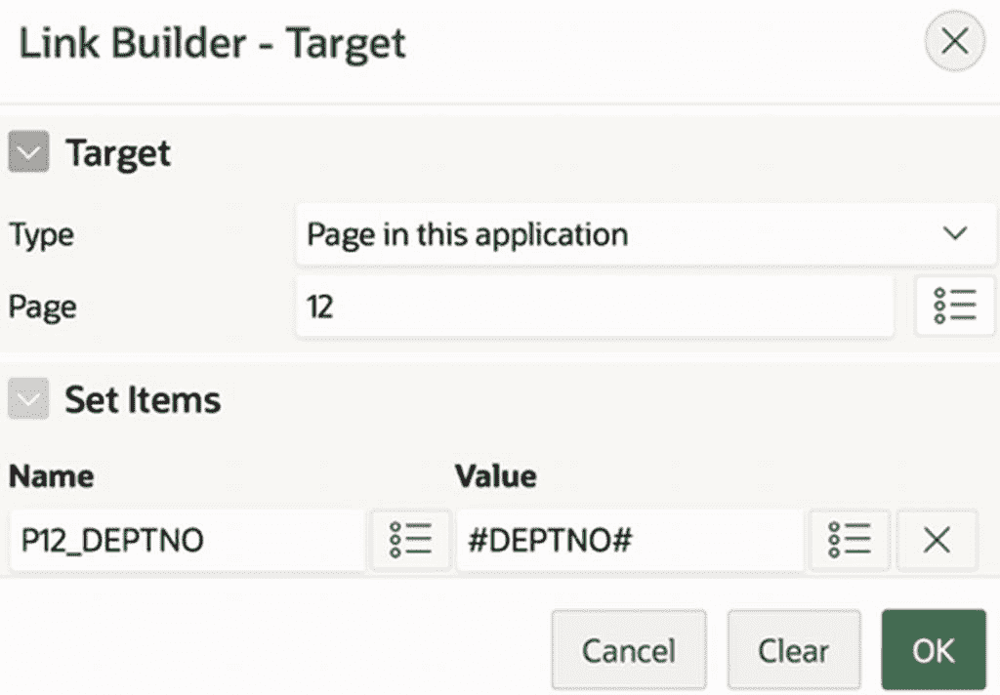

图 6-9
配置主报表的列链接

最后，你必须实际创建项目 `P12_DEPTNO`。你知道它应该是一个隐藏类型，但它应该放在哪里？因为该项目是隐藏的，所以它放在页面上的哪个区域并不重要。我选择将其放在主区域中，因为那是它的值被赋值的地方。

## 图表钻取

下一页 `Employees by Job` 是 `Employee Demo` 应用的第 13 页，如图 6-10 所示。该页面有两个区域：一个饼图和一个员工报表。该图表给出了每个职位的员工数量。单击饼图的一个部分会定制报表，以显示具有该职位的员工。图 6-10 显示了单击 `MANAGER` 切片后的页面。

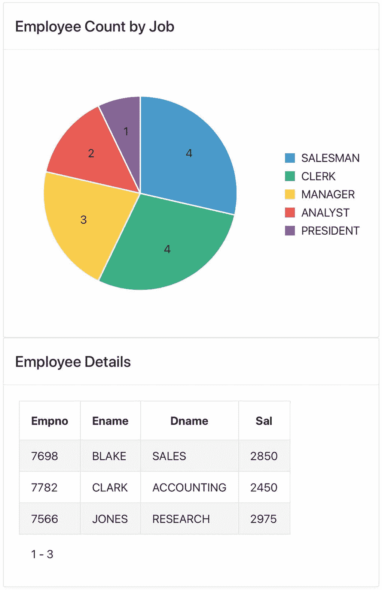

图 6-10
按职位查看员工页面

这种点击图表以查看更多细节的技术称为 `chart drill down`（图表钻取）。在这里，点击图表会选择一个类别值，然后用于定制报表。


## 图表下钻

图表下钻与主从关系非常相似。图表是主项，报表是从项。实际上，其实现策略与主从报表的本质相同：

1.  创建一个隐藏项，此处名为 `P13_JOB`。
2.  创建由该隐藏项定制的明细报表。
3.  创建图表，并配置其在被点击时将所选职位分配给该隐藏项。

明细报表的源查询与 `按部门查看员工` 中的查询本质相同。唯一的区别是该查询执行了一个连接（join），以便报表能够显示部门名称。SQL 代码如下：

```sql
select e.EmpNo, e.EName, d.DName, e.Sal
from EMP e join DEPT d
on    e.DeptNo = d.DeptNo
where e.Job = :P13_JOB
order by EName
```

饼图的源代码是一个具有两个输出列的 SQL 查询。以下查询为每个职位创建一个饼图扇区，其值是拥有该职位的员工数量：

```sql
select Job, count(*) as EmpCount
from EMP
group by Job
order by EmpCount desc
```

剩下的唯一问题是如何指定图表被点击时的行为。此行为由图表系列的 `链接` 属性决定；参见图 6-11。

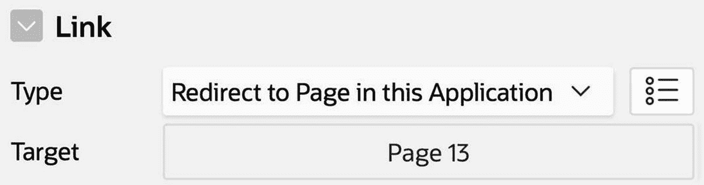

图 6-11：图表系列的链接属性

`类型` 属性的值为 `链接到此应用程序中的页面`。选择它会显示 `目标` 属性，你可以使用 `链接生成器` 屏幕来指定目标页面。图 6-12 显示了为该图表配置时的屏幕。你使用与图 6-9 的主报表相同的技术：选择目标为当前页面，并设置隐藏项的值。唯一的区别在于你如何引用所选值。当该值来自报表的 `X` 列时，你写 `#X#`。当它来自图表的 `X` 列时，你写 `&X.`——即将列名作为替换字符串引用。

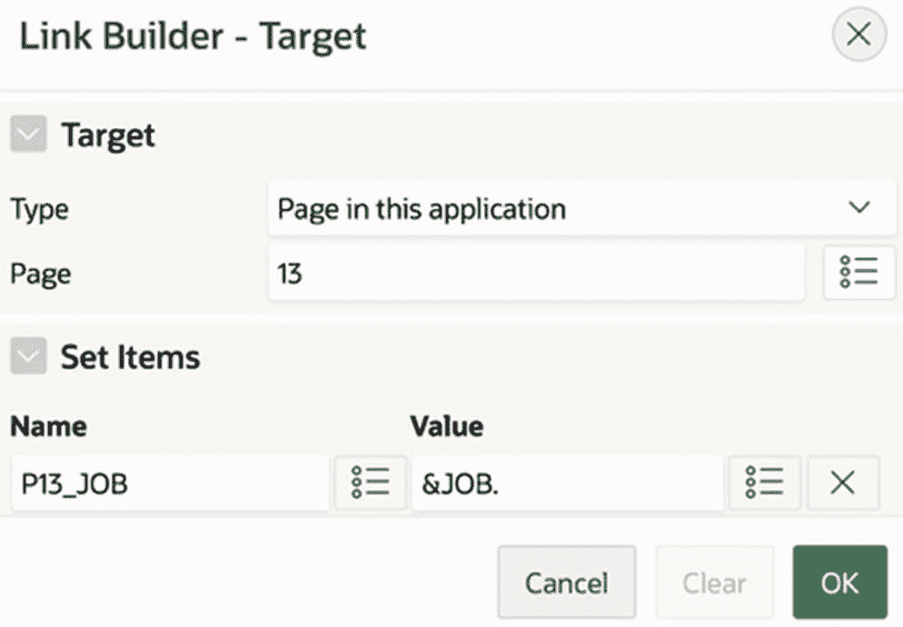

图 6-12：为下钻配置图表

## 自定义标题和标签

在第 3 章中，你了解了如何使用 HTML 标签来设置区域标题的格式。实际上，你可以使用 HTML 标签来设置任何在页面上显示其值的属性的格式，例如页面和区域标题、项目标签以及按钮文本。此外，这些属性也可以通过项目值来自定义。

例如，回顾主从关系和图表下钻页面，我注意到一个小问题：明细报表没有指明选择了哪个主记录（或图表扇区）。解决这个问题的一个好方法是自定义明细区域的标题。例如，图 6-13 显示了 `按部门查看员工` 页面修订后的明细区域。请注意，区域标题包含了所选部门的名称。

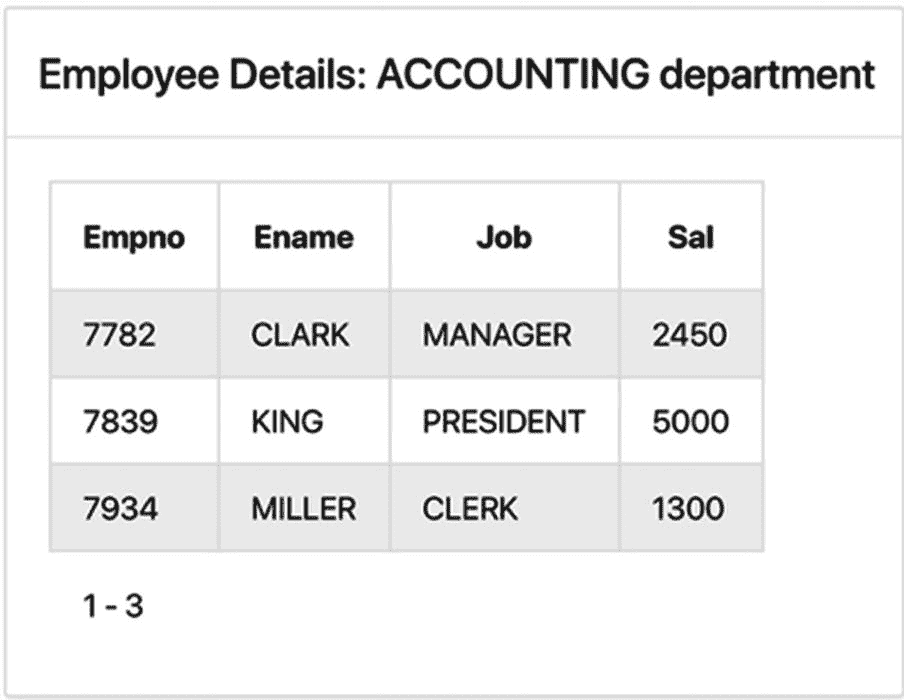

图 6-13：带有自定义标题栏的员工明细报表

类似地，图 6-14 显示了 `按职位查看员工` 页面修订后的明细区域。它的标题栏显示了所选职位。

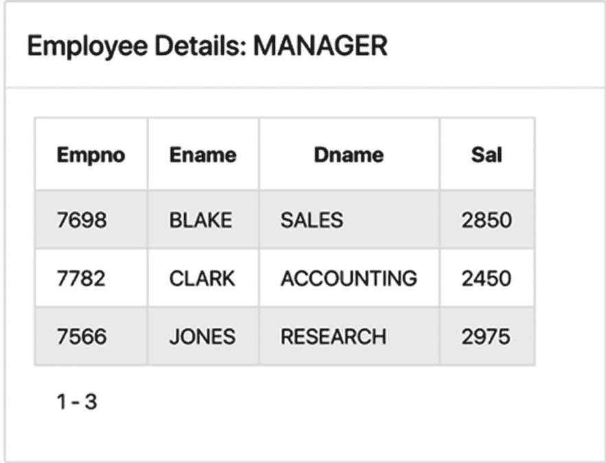

图 6-14：另一个自定义标题栏

实现这些标题栏的技术相对简单。让我们从图 6-14 开始，它涉及对 `按职位统计员工数` 页面的修改。该区域的 `标题` 属性只需更改为以下表达式：

```
员工详情: &P13_JOB.
```


就这样！你已经完成了。请注意，你使用了替换字符串表示法，因为标题是一个 HTML 表达式。

现在考虑图 6-13，它是 `按部门查看员工` 页面的一部分。该区域的 `标题` 属性具有以下表达式：

```
Employee Details: &P12_DNAME. department
```

这个表达式只有一个问题：当前页面没有名为 `P12_DNAME` 的项。为了使这个表达式有意义，你必须创建该项并将所选的部门名称分配给它。幸运的是，你已经知道如何做这些事情了。首先，创建一个隐藏项 `P12_DNAME`。然后，回到主报表，进入 `部门编号` 列的链接生成器，并在 `设置项` 属性中添加一行。参见图 6-15。

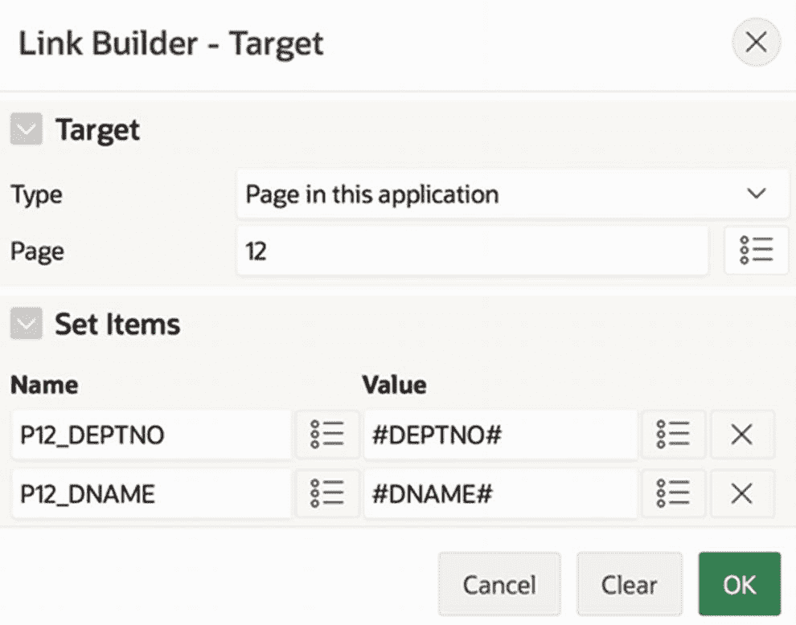

图 6-15：在链接生成器中设置两个隐藏项的值

## 级联列表

下一个任务是构建一个页面，使用户能够从选择列表中选择员工姓名，然后显示包含该员工信息的报表。该页面名为 `级联列表`，是 `员工演示` 应用的第 14 页，如图 6-16 所示。该页面有两个区域，每个区域都提供了一种解决方案。

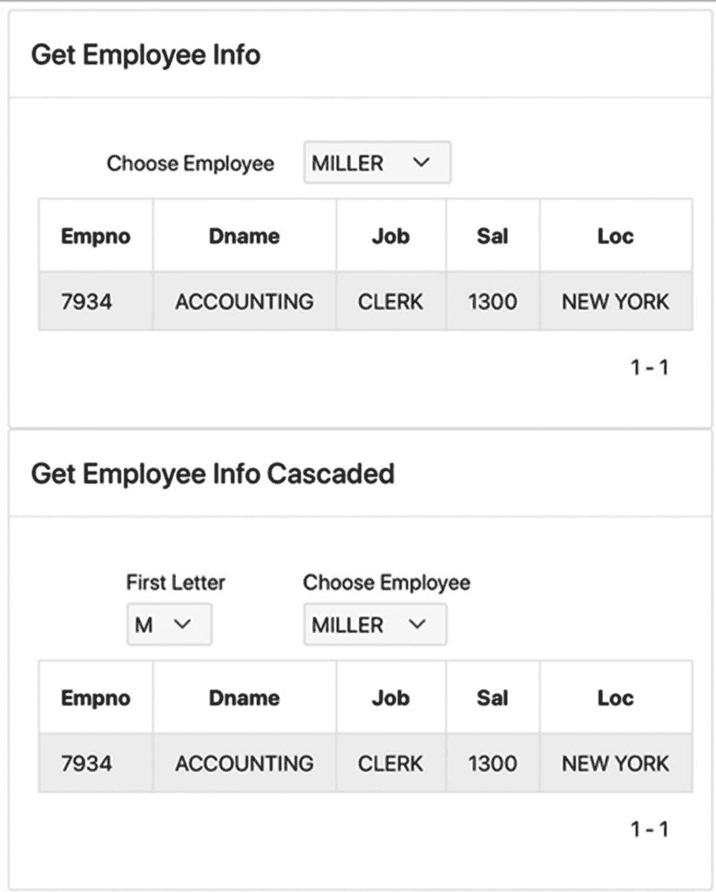

图 6-16：级联列表

### 顶部区域

顶部区域有一个名为 `P14_EMPNO` 的项。这是一个选择列表，显示所有员工的姓名，并将员工编号作为结果值。也就是说，它的值列表查询如下：

```
select EName, EmpNo
from EMP
order by EName
```

顶部区域没有按钮。相反，选择列表的操作是 `重定向并设置值`，这意味着从选择列表中选择一个员工姓名会导致该项的值在会话状态中被更改。

顶部区域的类型是 `经典报表`。它的源查询由 `P14_EMPNO` 的值定制，如下所示：

```
select e.EmpNo, d.DName, e.Job, e.Sal, d.Loc
from EMP e join DEPT d
on    e.DeptNo = d.DeptNo
where e.EmpNo = :P14_EMPNO
order by EmpNo
```

如果你尝试这个区域，你应该会发现，由于员工数量较少，浏览姓名列表很容易。然而，假设 `EMP` 表很大，有数千名员工可供选择。即使姓名已排序，滚动浏览选择列表也会很麻烦且耗时。解决此问题的常见方法是让用户通过一系列选择列表分步选择姓名。

### 底部区域

图 6-16 的底部区域使用两个选择列表来选择一名员工。第一个选择列表显示每个员工姓名的首字母，第二个选择列表显示姓名以该字母开头的员工姓名。这种技术称为 *级联列表*，其中第二个选择列表的显示值会根据为第一个列表选择的值而变化。这种技术可以扩展到多个选择列表——除第一个之外的每个选择列表的值都会根据其前面选择列表的值而变化。这种方法的优点是用户可以滚动浏览几个小的选择列表，而不是一个大列表。

底部区域中的两个选择列表名为 `P14_FIRST_LETTER` 和 `P14_EMPNO_CASCADE`。它们的定义如下。

选择列表 `P14_FIRST_LETTER` 不依赖于任何其他项，因此其查询很简单：

```
select FirstLetter as DisplayVal, FirstLetter as ResultVal
from  (select distinct substr(EName, 1, 1) as FirstLetter
from EMP)
order by DisplayVal
```

列表 `P14_EMPNO_CASCADE` 依赖于 `P14_FIRST_LETTER` 的值，其查询如下：

```
select EName, EmpNo
from EMP
where substr(EName, 1, 1) = :P14_FIRST_LETTER
order by EName
```

底部报表的源与顶部报表完全相同，只是 `P14_EMPNO` 被 `P14_EMPNO_CASCADE` 取代。如果你将这两个选择列表的操作都设置为 `重定向并设置值`，那么选择首字母会导致姓名列表更新，而选择姓名会导致报表更新。

### 在 APEX 中实现级联列表

级联列表的概念非常普遍，因此 APEX 有一个特定的属性来处理它，称为 `父项`，它位于选择列表的 `级联值列表` 部分。图 6-17 显示了 `P14_EMPNO_CASCADE` 列表的规范。

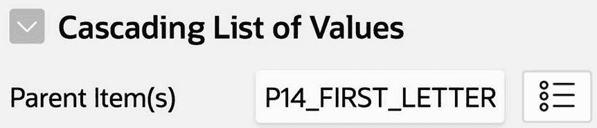

图 6-17：指定级联父项

此图指定 `P14_EMPNO_CASCADE` 依赖于 `P14_FIRST_LETTER` 的值；也就是说，它监视 `P14_FIRST_LETTER` 的行为，并在 `P14_FIRST_LETTER` 的值发生变化时刷新自身。因此，`P14_FIRST_LETTER` 的操作现在应设置为 `无`。`P14_EMPNO_CASCADE` 的操作应像以前一样设置为 `重定向并设置值`。`级联值列表` 属性使 APEX 能够使用 JavaScript 和 Ajax 刷新选择列表，而无需重新渲染整个页面。这是实现级联最有效的方法。

## 条件渲染

在使用应用程序构建器的过程中，你遇到过无数次这样的情况：在属性编辑器中选择一个特定值会导致编辑器突然显示其他属性。图 6-15 所示的 `链接生成器` 页面就是一个例子——如果你选择目标类型 `URL`，那么 `设置项` 属性会突然消失，如果你将其值改回 `此应用程序中的页面`，那么那些项会重新出现。这是怎么回事？

虽然看起来这些项是当场创建和删除的，但事实并非如此；相反，这些项始终存在。当你在链接生成器中并选择值 `此应用程序中的页面` 时，APEX 会显示额外的项；当你选择值 `URL` 时，APEX 会隐藏它们。这种动态显示或隐藏项的能力称为 *条件渲染*。

可以为项、按钮和区域定义条件渲染。每个在属性编辑器中都有一个 `服务器端条件` 部分，让你可以从选择列表中选择一个条件类型。尽管有许多条件类型，但这里的重点是 `SQL 表达式` 类型。该类型的值是一个返回 `true`/`false` 的 SQL 表达式。表达式的值决定了项、按钮或区域是否被渲染。

### 示例 1：员工详情区域

举个例子，让我们回到图 6-8 所示的 `按部门查看员工` 页面。请注意，在从主报表中选择一个值之前，详细报表区域将是空的。如果你不希望页面显示一个空的报表区域，那么你可以使用条件渲染，仅当项 `P12_DEPTNO` 不为 `null` 时才显示该区域。该区域的条件 SQL 表达式如图 6-18 所示。

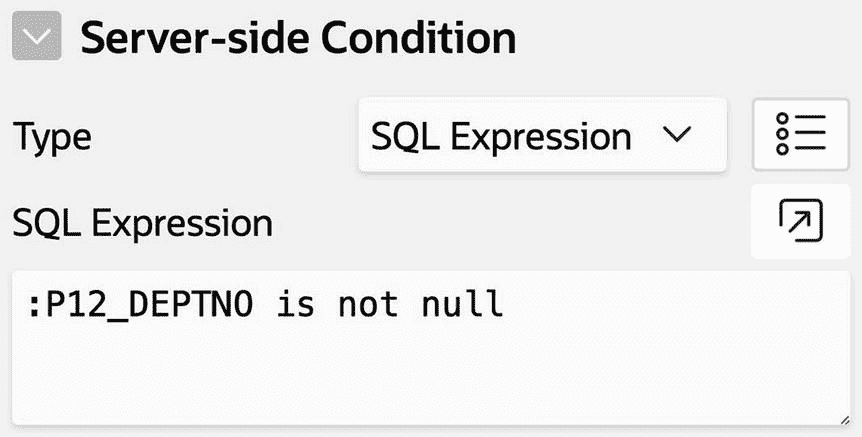

图 6-18：有条件地显示员工详情区域

### 示例 2：显示表页面

再举一个例子，考虑图 6-19 所示的 `显示表` 页面，它将是 `员工演示` 应用的第 15 页。`选择表` 区域包含两个复选框和一个按钮。单击按钮会导致显示已勾选的表。

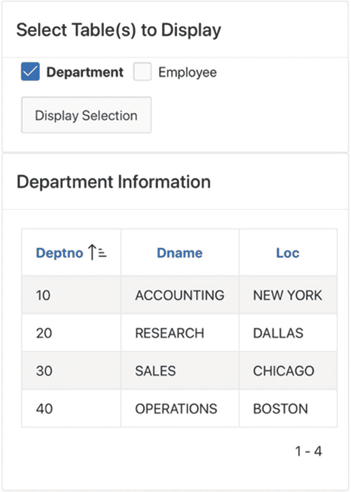

图 6-19：条件区域渲染


## 实现 `选择表` 区域

实现 `选择表` 区域很简单。其复选框项名为 `P15_CHOICE`，包含图 6-20 所示的两个静态值。按钮执行的是 `提交` 操作。

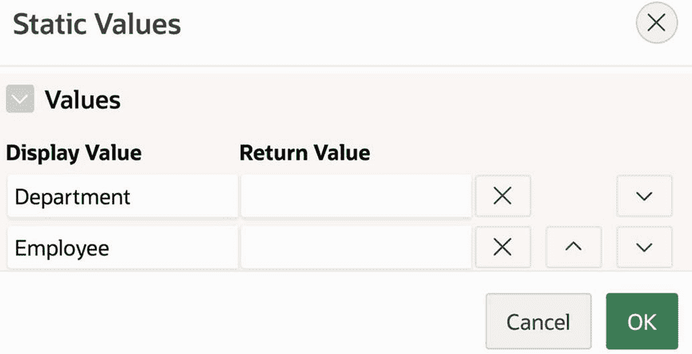
图 6-20 `P15_CHOICE` 的静态值

该页面还包含另外两个区域，均为 `经典报表` 类型。`员工信息` 区域具有以下数据源：

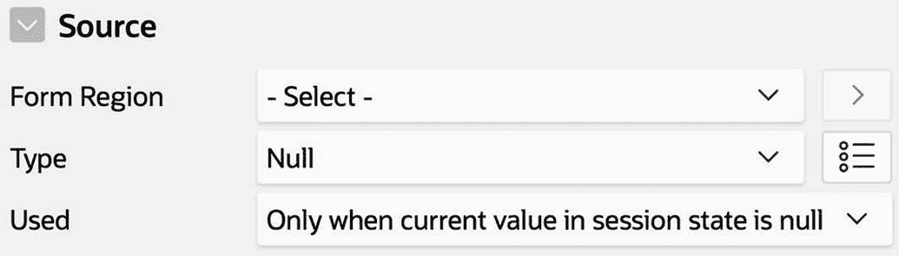
图 6-21 `P15_CHOICE` 的数据源属性

*   而 `部门信息` 区域具有以下数据源：
    ```
    select * from DEPT
    ```
*   这两个区域都是条件显示的，具体取决于 `P15_CHOICE` 的值。`员工信息` 的显示条件是以下 SQL 表达式：
    ```
    InStr(:P15_CHOICE, 'Employee') > 0
    ```
*   `部门信息` 的显示条件是以下 SQL 表达式：
    ```
    InStr(:P15_CHOICE, 'Department') > 0
    ```
*   当按钮被点击时，APEX 会创建一个包含已勾选复选框值的、以冒号分隔的字符串，并将其保存在会话状态中。然后当页面重新渲染时，APEX 会使用该会话状态值来初始化 `P15_CHOICE`，并评估每个条件表达式以确定要显示的区域。因此，必须如图 6-21 所示，指定 `P15_CHOICE` 的 `数据源` 属性。
    ```
    select * from EMP
    ```

## 区域显示选择器

回顾第 2 章（以及图 2-6），`应用程序属性` 屏幕允许你管理应用程序范围内的属性，例如应用程序徽标和导航菜单位置。图 6-22 显示了该屏幕的上半部分。


图 6-22 `应用程序属性` 屏幕的一部分

请特别注意标题下方的选项卡栏，其选项卡标记为 `显示全部`、`名称`、`属性` 等。此栏就是一个 *区域显示选择器*。如果你点击 `显示全部` 选项卡，页面将显示其所有区域；如果你点击任何其他选项卡，页面将仅显示所选区域。

你可以向应用程序添加一个区域显示选择器。让我们构建一个类似于图 6-19 中 `显示表` 页面的页面，但使用区域显示选择器代替单选按钮组。这个名为 `选择区域` 的页面将是 `员工演示` 应用程序的第 16 页。图 6-23 显示了选中 `部门信息` 选项卡时的页面。

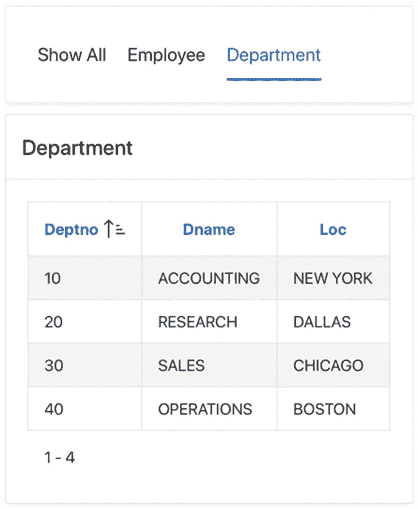
图 6-23 使用区域显示选择器区域

此页面由两个经典报表区域组成，分别对应 `EMP` 和 `DEPT` 表。其上方是一个 `区域显示选择器` 区域。要创建此显示选择器区域，只需在页面设计器中创建一个区域，然后将其类型更改为 `区域显示选择器`。与你迄今为止遇到的所有其他区域不同，该区域没有数据源；其唯一目的是为页面的区域显示一个选项卡栏。
图 6-23 中的区域显示选择器被放置在 `内容正文` 位置，并设置了一个较小的序列号，以便它首先显示。其模板是 `按钮容器`，该模板格式化区域时不显示标题。
默认情况下，区域显示选择器会为页面上的每个区域显示一个选项卡（前提是需要显示的区域多于一个）。如果你想排除某个区域，请使用其 `区域显示选择器` 属性，该属性位于 `高级` 部分。关闭此属性会将该区域从显示选择器中排除。

#### 小结

APEX 服务器维护着每个用户会话的数据；这些数据被称为 *会话状态*。在本章中，你了解了会话状态如何被修改，并探讨了应用程序开发者利用它的几种方式。
会话状态为应用程序中的每个项都维护一个变量。这些变量的值会因为提交或重定向操作而被修改。
当页面被提交时，页面上所有项的值都将在会话状态中得到更新。当页面重定向到目标页面时，重定向操作可以为特定项赋值。特别是，当你配置按钮、报表链接或图表进行重定向时，属性编辑器将显示 `链接构建器` 向导，其中包含一个用于指定会话状态值的部分。
会话状态的一个常见用途是使用户能够自定义报表。其思路是用户指定一些值，这些值会影响报表显示哪些记录。你看到了用户指定这些值的几种方式示例：

*   用户可以直接将值输入到页面上的项中。
*   用户可以从主报表中选择一行。
*   用户可以通过图表向下钻取来选择一个值。

本章还探讨了会话状态的其他用途，例如 *级联列表*（其中为一个选择列表选择的值决定了另一个列表显示的值）和 *条件渲染*（其中一项的值决定了某个区域应该显示还是隐藏）。
会话状态是 APEX 中极其重要的一个方面。本书余下部分的大部分示例都将运用本章提到的技术。

## 7. 进程

正如你所见，仅使用项、报表和图表就可以编写功能强大的网页。但要实现更复杂的功能，你必须能够执行计算并与数据库进行更一般化的交互。*进程* 这个概念正是为了解决这两个问题。
本章将探讨一些需要使用进程的典型情况，并介绍 PL/SQL 的基础知识，以便你可以编写自己的代码来实现这些进程。本章还将探讨编写 PL/SQL 代码时可能遇到的陷阱，例如丢失更新的可能性。

### 提交操作的阶段

回想一下，页面设计器的左侧面板包含四个选项卡。到目前为止，本书主要关注的是 `渲染` 选项卡；现在是时候转向 `处理` 选项卡了。要进入此选项卡，请点击面板顶部从左数第三个圆形箭头图标。图 7-1 显示了该选项卡的界面。

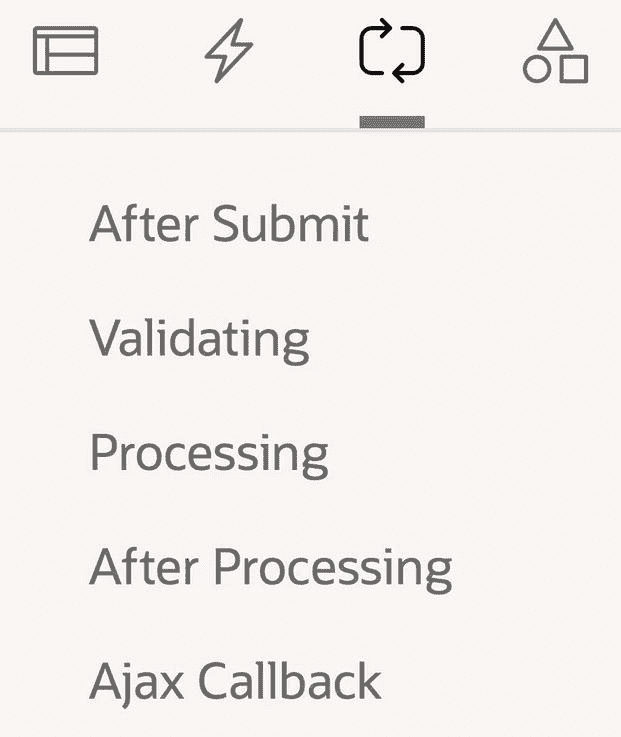
图 7-1 页面设计器的处理选项卡


## APEX 执行点与进程创建

图中显示了五个节点。前四个对应于提交操作期间可能发生的四种活动阶段；APEX 将这些阶段称为 **执行点**。这些阶段具有以下目的：

*   在 **提交后** 阶段，服务器计算额外的会话状态值，为主要处理活动做准备。这种计算偶尔有用，在第 10 章中有简要讨论。

*   在 **验证** 阶段，服务器运行验证检查，以确保提交请求是使用适当的数据调用的。如果检测到问题，服务器将中止进一步处理。验证是第 8 章的主题。

*   在 **处理** 阶段，服务器执行与提交请求相关联的进程。这些进程的定义和使用是本章及第 10 章的主题。

*   在 **处理后** 阶段，服务器使用分支来决定将哪个页面发送到浏览器。分支是第 9 章的主题。

图 7-1 中的第五个节点名为 `Ajax Callback`，它不是一个执行点；其目的是保存可以从 JavaScript 函数调用的代码。由于 APEX 中 JavaScript 的使用超出了本书的范围，我将不再进一步提及此节点。

### 创建进程

本节使用员工演示应用中的 `Item Sampler` 页面（第 8 页）快速介绍 APEX 进程。转到其页面编辑器并点击 `Processing` 选项卡；您应该看到图 7-1 的屏幕。要创建新进程，请右键单击 `Processing` 节点并选择 `Create Process`。应用构建器将创建一个标题为 `New` 的进程，并将其节点添加到 `Processing` 子树中，如图 7-2 所示。请注意，新节点的父节点是 `Processes` 节点，而后者又是 `Processing` 的子节点。`Processes` 节点的目的是将所有与 `Processing` 执行点关联的进程组件分组。

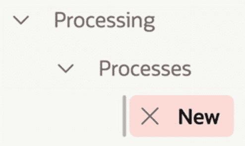

图 7-2 处理组件树

单击新进程的节点并查看其属性。`Identification` 部分指定了进程的名称和类型。默认情况下，新创建的进程名称为 `New`，类型为 `PL/SQL Code`。图 7-3 显示我将进程重命名为 `SampleProcess` 并保留了默认的类型值。

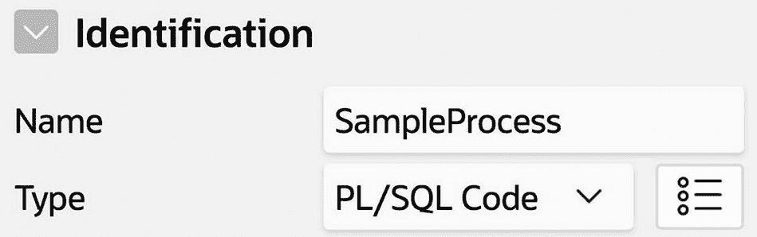

图 7-3 指定进程的名称和类型

单击“类型”属性的选择列表，查看可用的其他进程类型。这些类型便于特殊用途的操作，例如修改表、发送电子邮件或清除会话状态，是第 10 章的主题。本章专门关注 `PL/SQL Code` 进程类型，它使您能够编写自己的通用操作。

PL/SQL 进程的代码在其 `Source` 部分由 `PL/SQL Code` 属性指定。查看新进程的 `Source` 部分——您会看到它没有代码，这就是为什么图 7-2 中的节点被标记为有错误。让我们来修复它。

PL/SQL 代码块最基本的形式是由关键字 `begin` 和 `end` 包围的一条或多条语句。例如，图 7-4 显示了包含最简单可能的 PL/SQL 块的 `Source` 部分。执行它会运行 `null` 语句，该语句（正如您可能想象的那样）绝对什么也不做。

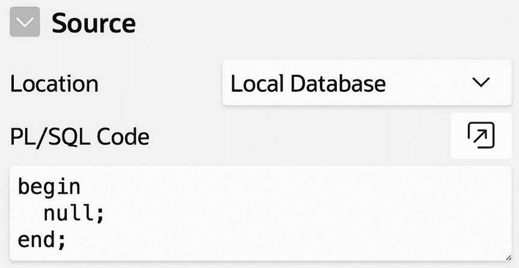

图 7-4 一个什么也不做的 PL/SQL 代码块

注意分号。每条语句后必须跟一个分号，`end` 关键字后也必须跟一个分号。如果您忘记了这样做（您可能在某个时候会忘记），APEX 将显示错误消息。如有疑问，请检查是否遗漏了分号。

将此代码添加到您的进程中将移除错误标志。当您运行页面时，每次单击 `Submit` 按钮都会执行该进程。当然，您无法知道这一点，因为代码什么也没做。本章的其余部分将探讨如何为进程添加有意义的内容。

### 使用 PL/SQL 访问数据库

PL/SQL 进程通常用于访问数据库。SQL 数据修改命令可以用作 PL/SQL 语句，这意味着修改数据库的进程可以仅由那一条语句组成。例如，以下 PL/SQL 块将部门 10 中每个人的工资增加 100。

```
begin
update EMP
set Sal = Sal + 100
where DeptNo = 10;
end;
```

对于一个更全面的示例，考虑图 7-5 中显示的 `Employee Data Entry` 页面，它是 `Employee Demo` 应用的第 17 页。此页面说明了 PL/SQL 修改数据库的能力。它包含用于删除指定员工、插入新员工和更新指定员工列的区域。这些区域上方是一个报表区域，显示员工表，因此您可以看到修改的效果。

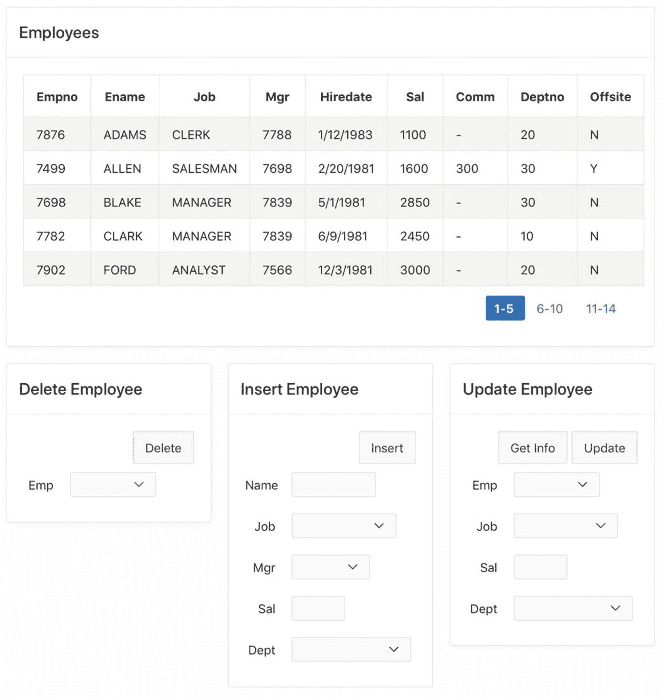

图 7-5 员工数据录入页面

要创建此页面，首先创建一个空白页面和四个区域。`Employees` 区域是一个经典报表区域，其数据源是整个 `EMP` 表。其他三个区域是静态内容区域，位置如下：`Delete Employee` 开始新的一行，其余两个区域开始该行的新列。以下小节讨论这三个区域的内容。

#### 删除员工区域

`Delete Employee` 区域包含一个选择列表和一个按钮。选择列表名为 `P17_DELETE_EMPNO`，在选择时执行无操作，其值由以下查询定义：

```
select EName, EmpNo
from EMP
order by EName
```

按钮名为 `Delete`，其操作是 `Submit`。其想法是用户从列表中选择一名员工，然后单击 `Delete` 按钮提交页面；在提交期间，APEX 服务器将执行一个进程来删除该员工的记录。以下步骤说明了如何创建此进程并将其与按钮关联。

首先，转到页面设计器的 `Processing` 选项卡，右键单击 `Processes` 节点，然后选择 `Create Process`。给新进程一个名称，例如 `DeleteEmp`。

其次，转到 `Source` 属性部分，在其 `PL/SQL Code` 区域中输入清单 7-1 中所示的 PL/SQL 块。注意代码如何使用绑定变量语法来引用所选的员工编号。

```
begin
delete from EMP
where EmpNo = :P17_DELETE_EMPNO;
end;
```
清单 7-1 DeleteEmp 进程的 PL/SQL 代码


第三，更改流程的`Server-side Condition`部分中的`When Button Pressed`属性，如图 7-6 所示。这样做指定了流程仅在按下`Delete`按钮时才会执行。否则，每次发生提交操作时，该流程都会执行，而不管提交是如何发生的。这对于`Employee Data Entry`页面来说将是一个问题，因为它有四个按钮，全部执行提交操作。你希望`DeleteEmp`流程仅在按下`Delete`按钮时执行，这正是`When Button Pressed`属性的用途。

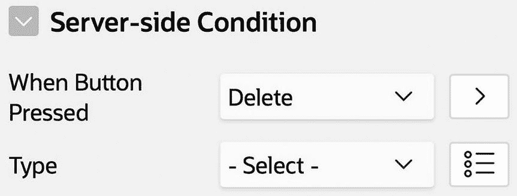
图 7-6：设置 When Button Pressed 属性

### 插入员工区域

`Insert Employee`区域包含五个项目和一个按钮。这些项目对应于`EMP`表的列，名称分别为`P17_INSERT_ENAME`、`P17_INSERT_JOB`等。项目`P17_INSERT_ENAME`是一个文本字段，`P17_INSERT_SAL`是一个数字字段。另外三个项目是选择列表，其值通过以下值列表查询定义。

`P17_INSERT_JOB`的值由以下查询定义：
```sql
select distinct Job as DisplayVal, Job as ResultVal
from EMP
```

`P17_INSERT_MGR`的值由以下查询定义：
```sql
select EName, EmpNo
from EMP
where Job = 'MANAGER'
```

`P17_INSERT_DEPTNO`的值由以下查询定义：
```sql
select DName, DeptNo
from DEPT
```

该按钮名为`Insert`，其操作为`Submit`。用户输入各项的值并单击`Insert`按钮。然后，与该按钮关联的流程将使用指定的项目值作为五列的值，并为其他四列计算以下值，将一条新记录插入到`EMP`表中：
*   `EmpNo`自动获取由`EMP`的内置插入触发器确定的序列中的下一个值。
*   `HireDate`获取当前日期。
*   `Comm`获取`0`。
*   `Offsite`获取`'N'`。

创建此流程的步骤与`DeleteEmp`流程相同。将该流程命名为`InsertEmp`。其`When Button Pressed`属性的值应为`Insert`。其 PL/SQL 代码由清单 7-2 中显示的单个 SQL 命令组成。
```sql
begin
insert into EMP (EName, Job, Mgr, Sal, DeptNo,
HireDate, Comm, Offsite)
values (:P17_INSERT_ENAME,
:P17_INSERT_JOB,
:P17_INSERT_MGR,
:P17_INSERT_SAL,
:P17_INSERT_DEPTNO,
current_date,  0,  'N');
end;
```
*清单 7-2：InsertEmp 流程的 PL/SQL 代码*

此时，你可能想要测试当前页面的状态。插入一条记录并确保它在报表中正确显示。然后删除它，并观察报表恢复到其原始状态。

### 更新员工区域

`Update Employee`区域有四个项目和两个按钮。项目名为`P17_UPDATE_EMPNO`、`P17_UPDATE_JOB`等。选择列表值的定义方式与其他区域相同。按钮名为`GetInfo`和`Update`，两者操作均为`Submit`。

使用此区域需要两个步骤。首先，用户从`P17_UPDATE_EMPNO`中选择所需的员工并单击`GetInfo`按钮。与此按钮关联的流程使用该员工的`EMP`记录中的相应值填充项目`P17_UPDATE_JOB`、`P17_UPDATE_SAL`和`P17_UPDATE_DEPTNO`。然后用户根据需要更改这些项目。当用户单击`Update`按钮时，与该按钮关联的流程会使用新值更新记录。

每个按钮都将有自己的流程。`Update`按钮的流程名为`UpdateEmp`。其 PL/SQL 代码如清单 7-3 所示，其`When Button Pressed`属性的值为`Update`。
```sql
begin
update EMP
set Job    =  :P17_UPDATE_JOB,
Sal    =  :P17_UPDATE_SAL,
DeptNo =  :P17_UPDATE_DEPTNO
where EmpNo  =  :P17_UPDATE_EMPNO;
end;
```
*清单 7-3：UpdateEmp 流程的 PL/SQL 代码*

`GetInfo`按钮的流程名为`GetEmpInfo`。它与页面上其他流程的不同之处在于，它从数据库读取数据而不是写入数据。该技术是编写一个 SQL 查询，将其输出直接放入页面上的项目中。清单 7-4 中的 PL/SQL 代码正是这样做的。
```sql
begin
select Job, Sal, DeptNo
into :P17_UPDATE_JOB, :P17_UPDATE_SAL, :P17_UPDATE_DEPTNO
from EMP
where EmpNo = :P17_UPDATE_EMPNO;
end;
```
*清单 7-4：GetEmpInfo 流程的 PL/SQL 代码*

该查询的关键部分是关键字`into`开头的子句。该子句表明查询的三个输出值将被放入三个指定的项目中。换句话说，`into`子句将 SQL 查询转换为一个 PL/SQL 语句，该语句从数据库中提取值并将它们分配给项目。请注意，`into`子句仅在 SQL 查询恰好返回一行时才有意义。执行多行 SQL 查询的流程需要对查询输出进行完全不同的处理，正如你将在下一节中看到的那样。

### 用于计算值的 PL/SQL

本节探讨 PL/SQL 的编程语言方面。PL/SQL 的核心是一种传统的编程语言，具有变量、赋值语句、条件语句和循环。在这方面，它与 C、Java、Python 和类似语言没有太大区别。如果你有使用这些语言中的任何一种的经验，那么编写 PL/SQL 代码最困难的部分可能是找出合适的语法。

例如，让我们构建如图 7-7 所示的`Sales Commission`页面，这将是`Employee Demo`应用程序的第 18 页。

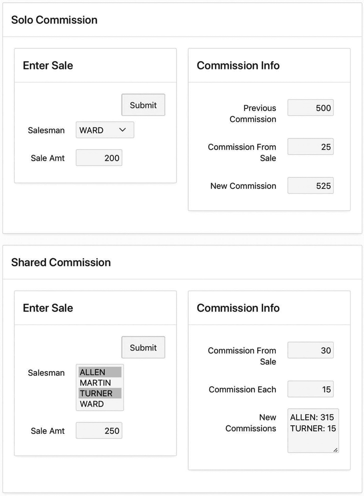
图 7-7：用于计算销售佣金的页面

每次销售人员完成销售时都会使用此页面。假设销售人员在销售额的前 100 美元获得 15%的佣金，在剩余金额上获得 10%的佣金；如果多名销售人员合作完成一笔销售，他们平均分配佣金。该页面有两个外部区域。顶部区域名为`Solo Commission`，用于输入个人销售。底部区域名为`Shared Commission`，用于输入协作销售。

`Solo Commission`区域的工作方式如下：用户选择销售人员的姓名，并将销售金额输入到`Enter Sale`区域。单击`Submit`按钮提交页面并导致流程执行。该流程执行多项操作：它根据销售额计算佣金，从`EMP`表中检索该销售人员之前的佣金，通过将两个值相加来计算新的佣金金额，并将这三个值放入`Commission Info`区域的三个相应项目中。它还用新的佣金值更新`EMP`表。

`Shared Commission`区域的工作方式类似，只是可以从选择列表中选择多名销售人员。其流程计算销售的总佣金和按比例分配的金额，更新`EMP`表，并将合作销售人员的新佣金写入文本区域。

本节考虑`Solo Commission`区域的实现。（`Shared Commission`区域将在“处理多行 SQL 查询”一节中讨论。）`Enter Sale Info`区域中的两个项目名为`P18_SOLO_SALESMAN`和`P18_SOLO_AMOUNT`。项目`P18_SOLO_AMOUNT`是一个数字字段，`P18_SOLO_SALESMAN`是一个选择列表，其值由以下 SQL 查询定义：
```sql
select EName, EmpNo
from EMP
where Job = 'SALESMAN'
```


`Commission Info`区域中的项被命名为 `P18_SOLO_PREV_COMMISSION`、`P18_SOLO_SALE_COMMISSION` 和 `P18_SOLO_NEW_COMMISSION`。清单 7-5 包含了当点击 `Submit` 按钮时执行的 PL/SQL 代码。此代码阐释了 PL/SQL 的几个方面，将在以下小节中描述。

```
declare
v_amount int := :P18_SOLO_AMOUNT;
v_saleCommission number(7,2);
v_prevCommission number(7,2);
v_newCommission  number(7,2);
begin
-- 步骤 1：计算新佣金，前 100 美元按 15%计算，
-- 剩余销售价格按 10%计算。
if v_amount > 100 then
v_amount := v_amount - 100;
v_saleCommission := 15 + (v_amount * 0.1);
else
v_saleCommission := v_amount * 0.15;
end if;
-- 步骤 2：从 EMP 表中检索之前的佣金
-- 并计算新的佣金。
select Comm into v_prevCommission
from EMP
where EmpNo = :P18_SOLO_SALESMAN;
v_newCommission := v_prevCommission + v_saleCommission;
-- 步骤 3：更新员工记录。
update EMP
set Comm = v_newCommission
where EmpNo = :P18_SOLO_SALESMAN;
-- 步骤 4：计算各项的值。
:P18_SOLO_SALE_COMMISSION := v_saleCommission;
:P18_SOLO_PREV_COMMISSION := v_prevCommission;
:P18_SOLO_NEW_COMMISSION  := v_newCommission;
end;
```
清单 7-5 处理单独佣金的 PL/SQL 代码

### 局部变量
PL/SQL 块可以在 `begin` 关键字之前有一个 `变量声明部分`。声明部分以关键字 `declare` 开头，后跟一系列变量声明。清单 7-5 的代码声明了四个局部变量：`v_amount`、`v_saleCommission`、`v_prevCommission` 和 `v_newCommission`。每个声明的语法类似于 SQL 中声明表列的语法，可能的变量类型也相同。例如，后三个变量的类型为 `number(7,2)`，这与 `EMP` 表中 `Comm` 列的类型相同。
局部变量和项引用可以在 PL/SQL 块中互换使用。区别在于，局部变量按原样引用，而项引用需要前置冒号。例如，步骤 3 中的 SQL `update` 命令同时引用了局部变量 `v_newCommission` 和项 `P18_SOLO_SALESMAN`。
由于项是使用绑定变量语法引用的，因此很容易识别。但是，SQL 命令中的局部变量引用很难与列名或函数调用区分开来。为避免混淆，应始终为局部变量命名，以便人们知道它们是变量。这里采用的一个常见约定是，每个局部变量名以 `v_` 开头。

### 注释
与 SQL 一样，PL/SQL 用两个连续的减号表示注释。跟在两个减号之后的所有字符直到行尾都会被忽略。

### 赋值语句
PL/SQL 中的赋值语句使用 `:=` 作为赋值运算符。赋值也可以在 `declare` 部分中使用，以为局部变量分配初始值。

### 条件语句
PL/SQL 支持多种形式的条件语句；清单 7-5 步骤 1 中出现的形式适用于通用目的。请注意，关键字充当部分边界：条件表达式出现在 `if` 和 `then` 之间，当条件为 `true` 时要执行的语句出现在 `then` 和 `else` 之间，当条件为 `false` 时要执行的语句出现在 `else` 和 `end if` 之间。通常，如果在 `else` 和 `end if` 关键字之间没有语句，则可以省略 `else` 关键字。

### 处理多行 SQL 查询
现在让我们看看如何构建 `Shared Commission` 区域。其 `Enter Sale` 区域与 `Solo Commission` 区域基本相同。它的项名称是 `P18_SHARED_SALESMAN` 和 `P18_SHARED_AMOUNT`。
`Commission Info` 区域中的项被命名为 `P18_SHARED_SALE_COMMISSION`、`P18_SHARED_COMMISSION_EACH` 和 `P18_SHARED_NEW_COMMISSIONS`。
选择列表 `P18_SHARED_SALESMAN` 的属性值与 `P18_SOLO_SALESMAN` 相同；不同之处在于其 `Allow Multi Selection` 属性设置为 `Yes`，`Height` 值为 `4`。回顾第 5 章，此类项的值是一个字符串，其中包含以冒号分隔的返回值。例如，如果从多值选择列表 `P18_SHARED_SALESMAN` 中选择了 `ALLEN` 和 `TURNER`。由于他们对应的员工编号是 7499 和 7844，因此该项的值是字符串 `"7499:7844"`。
从该字符串中提取所需信息并不特别容易，因此需要一些巧妙的方法。你需要做两件事：确定所选员工的数量，并从 `EMP` 表中提取他们的记录。
请注意，所选员工的数量比字符串中的冒号数量多一。你可以通过使用 SQL `replace` 函数创建一个新字符串（其中冒号被替换为空字符串，从而有效地移除了冒号），然后比较两个字符串的长度，来确定冒号的数量。也就是说，如果 `P18_SHARED_SALESMAN` 包含该字符串，则员工数量由以下表达式给出：
```
1 + length(:P18_SHARED_SALESMAN) - length(replace(:P18_SHARED_SALESMAN, ':', ''))
```
要提取每个所选员工的记录，请使用 `instr` 函数，就像你为 `Filter by Possible Department` 页面所做的那样。以下查询将检索所有选定员工的 `EMP` 记录：
```
select *
from EMP
where instr( ':'|| :P18_SHARED_SALESMAN||':',  ':'||EmpNo||':' ) > 0
```
解决了这些问题后，你现在可以为该区域的 `Submit` 按钮编写处理过程。PL/SQL 代码如清单 7-6 所示。
```
declare
v_saleCommission number(7,2);
v_amount         int := :P18_SHARED_AMOUNT;
v_empCount       int;
v_commissionEach number(7,2);
v_empInfo        varchar2(25);
v_output         varchar2(250) := '';
begin
-- 步骤 1：计算新佣金，前 100 美元按 15%计算，
-- 剩余销售价格按 10%计算。
if v_amount > 100 then
v_amount := v_amount - 100;
v_saleCommission := 15 + (v_amount * 0.1);
else
v_saleCommission := v_amount * 0.15;
end if;
-- 步骤 2：确定共享佣金。
v_empcount := 1 + length(:P18_SHARED_SALESMAN) - length(replace(:P18_SHARED_SALESMAN, ':', '' ));
v_commissionEach := v_saleCommission / v_empcount;
-- 步骤 3：更新 EMP 表。
update EMP
set Comm = Comm + v_commissionEach
where instr( ':'||:P18_SHARED_SALESMAN||':',  ':'||EmpNo||':' ) > 0;
-- 步骤 4：使用循环收集员工信息。
for row in (
select EName, Comm
from EMP
where instr( ':'||:P18_EMPNO_SHARED||':',  ':'||EmpNo||':' ) > 0 )
loop
v_empInfo := row.EName || ': ' || row.Comm || chr(13);
v_output  := v_output || v_empInfo;
end loop;
-- 步骤 5：写入项值。
:P18_SHARED_SALE_COMMISSION  := v_saleCommission;
:P18_SHARED_COMMISSION_EACH  := v_commissionEach;
:P18_SHARED_NEW_COMMISSIONS  := v_output;
end;
```
清单 7-6 处理共享佣金的 PL/SQL 代码


## 并发数据库更新

### 丢失更新问题

步骤 1 计算销售佣金，与之前相同。步骤 2 计算每位员工的按比例佣金，即用佣金总额除以员工数量。步骤 3 更新所选员工的记录。步骤 5 将一个值写入`Commission`区域的每个项目。

最有趣的代码出现在步骤 4 中，您在此处理每个所选员工。问题在于，检索员工信息的 SQL 查询会返回多行，因此您不能像之前那样使用`into`子句。取而代之的技术是遍历查询中的记录，每次循环处理一行。

循环的基本结构如下：

```
for r in (  )
loop
-- 用于处理行 r 的语句
end loop;
```

变量`r`无需声明。每次循环时，它将保存查询的下一行。如果`C`是查询的一个输出列，那么表达式`r.C`将返回当前行的`C`值。例如，在清单 7-6 中，行变量名为`row`，查询的两个输出列是`EName`和`Comm`。因此，循环代码引用的是`row.EName`和`row.Comm`。

循环体处理每个所选员工。其任务是构建一个字符串，总结该员工的新佣金。代码通过将员工姓名与新的佣金值拼接来创建摘要字符串。表达式`chr(13)`表示一个换行符。

一个经常遇到的情况称为*丢失更新问题*。当两个用户在大约相同的时间更新同一条数据库记录，并且更新的时序导致数据库系统丢失了其中一个更新时，就会出现此问题。以下两种场景说明了该问题。

对于第一种场景，考虑图 7-5 的`员工数据录入`页面。假设两个用户使用`更新员工`区域来更新 Allen 的记录——用户 A 希望将工资改为`1800`，用户 B 希望将职位改为`ANALYST`。如果两个用户大约同时点击`GetInfo`按钮，那么他们都将从`EMP`表中检索到相同的记录，该记录显示 Allen 是一名工资为 1600 的销售员。当用户 A 更改工资并点击`Update`按钮时，该记录将被替换为一条记录，显示 Allen 是一名工资为 1800 的销售员。然而，用户 B 看不到更新后的工资。当用户 B 更改职位并点击`Update`按钮时，该记录将被替换为一条记录，显示 Allen 是一名分析师，工资为 1600。

无论谁先写入，此场景都会出现问题。如果用户 A 先修改，用户 B 将用其先前值覆盖新工资；如果用户 B 先修改，用户 A 将用其先前值覆盖新职位。无论发生什么，数据库系统都会丢失其中一个更新。

您可以自行验证此场景。在两个私密浏览器窗口中打开`员工数据录入`页面（使用私密窗口可防止 APEX 识别出两个窗口都属于您）。在每个窗口中选择同一个员工并点击`GetInfo`按钮。然后在每个窗口中进行一次更新并点击其`Update`按钮。现在查看报告中修改后的记录——您会发现您的第一次更新丢失了。

对于第二种场景，考虑图 7-7 的`销售佣金`页面。假设 Allen 独立销售了 100 美元和 200 美元，分别获得 15 美元和 25 美元的佣金。用户 A 和用户 B 各自将其中一笔销售输入页面的`单独佣金`区域，并同时点击其`提交`按钮。假设他们的 PL/SQL 进程执行几乎同时到达清单 7-5 的步骤 2，这意味着两个进程都会看到当前佣金为 300 美元。用户 A 的进程将在步骤 3 计算出 315 美元的新佣金，用户 B 的进程将计算出 325 美元的新佣金。后更新的进程将覆盖先更新进程的佣金。被覆盖的更新将会丢失。

您也可以自行验证此场景。这次，在您的两个私密浏览器窗口中打开`销售佣金`页面。在每个窗口中，选择同一个销售员，选择不同的销售额，然后点击`提交`按钮。很可能，两个更新都不会丢失。原因是，丢失更新场景只有在 APEX 服务器恰好在步骤 2 之后立即推迟执行第一个进程时才会发生，这种情况可能发生但概率较低。您可以通过在步骤 2 之后立即向进程中引入一条*休眠*语句来大幅提高概率，如下所示：

```
...
v_newCommission := v_prevCommission + v_saleCommission;
dbms_session.sleep(10);
-- 步骤 3：更新员工记录。
...
```

此语句使进程在开始步骤 3 之前休眠 10 秒。现在重复实验。如果您在 10 秒内点击两个`提交`按钮，则会出现问题场景，并且您提交的第一个佣金将会丢失。

在这两种场景中，丢失更新的发生完全取决于用户请求的时序。这种对时序的依赖意味着丢失更新往往在看似随机的时间点发生。例如，一个应用程序很可能运行数月（或数年）而没有发生丢失更新，然后却在短时间内连续发生几次。

丢失更新显然是非常糟糕的事情。丢失更新可能在发生很久后才被发现，到那时可能为时已晚。应用程序开发人员必须确保它们永远不会发生。其不可预测的性质使得通过测试难以发现问题。因此，任何更新数据库的 PL/SQL 进程都必须专门编写以避免丢失更新。

### 避免丢失更新

当两个并发进程读取相同数据然后对其进行冲突更新时，就会发生丢失更新。避免此问题的方法是强制冲突进程按顺序交互，以便第二个进程读取第一个进程写入的数据。

Oracle 数据库系统使用*写锁*来确保这种顺序性。您通过向 SQL 查询添加`for update`子句来指定写锁。当您的进程执行包含该子句的查询时，数据库系统会锁定该查询的输出记录，使其不能被任何其他进程读取或修改。然后，您的进程可以安全地修改这些记录而无需担心冲突。当您的进程完成时，数据库系统会释放锁。

例如，考虑前面的第二种场景，其中两个用户并发地更新`单独佣金`区域。清单 7-5 的步骤 2 包含有问题的 SQL 查询：

```
select Comm into v_prevCommission
from EMP
where EmpNo = :P18_EMPNO;
```

此查询的输出是指定`EMP`记录的`Comm`值，该值将在步骤 3 中稍后修改。为防止其他进程访问此记录，您可以通过将查询更改为以下形式来锁定它：

```
select Comm into v_prevCommission
from EMP
where EmpNo = :P18_EMPNO for update;
```


如果另一个进程试图访问此记录，而该记录已被锁定，数据库系统将延迟该进程，直到您的进程完成。因此，您进程的第 3 步可以修改该记录，确信不会覆盖另一个进程的修改。

转到`Employee Demo`应用程序的第 18 页，按此策略修改`Solo Commission`区域的进程。然后使用两个私密浏览器窗口验证其是否有效，如前一节所述。即使在进程的第 3 步之前添加`sleep`语句，页面也应永远不会丢失已更新的佣金。

### 并发更新场景

现在考虑第一个场景，即两个用户同时更新一个员工记录。在此场景中，更新记录的活动需要两个进程：`GetEmpInfo`进程从指定记录读取值，而`UpdateEmp`进程修改该记录。仅让`GetEmpInfo`锁定其记录是不够的，因为锁会在`GetEmpInfo`完成时释放（因此，在`UpdateEmp`开始之前）。

因此，这两个进程之间需要显式的协作。以下是一个好的策略：

`GetEmpInfo`进程读取所选记录的值，在页面上显示它们，并保存原始值以备将来参考。`UpdateEmp`进程从数据库重新读取值，并将其与保存的值进行比较。如果它们匹配，则进程可以执行更新。如果不匹配，则必定有另一个进程更新了该记录，这意味着`UpdateEmp`必须拒绝执行更新。

`Employee Demo`应用程序的第 19 页名为`Revised Employee Data Entry`，包含此策略的实现。它看起来与第 17 页相同，行为也相同。唯一的（目前）区别是其`GetEmpInfo`和`UpdateEmp`进程已修订，因此它们不会丢失更新。

### 创建修订页面

由于此页面与第 17 页基本相同，实现它的最佳方式是从第 17 页的副本开始。为此，转到任意页面的设计者视图，在其顶行找到`insert`图标（标有`+`的图标）。然后选择其`Page as Copy`菜单项，如图 7-8 所示。

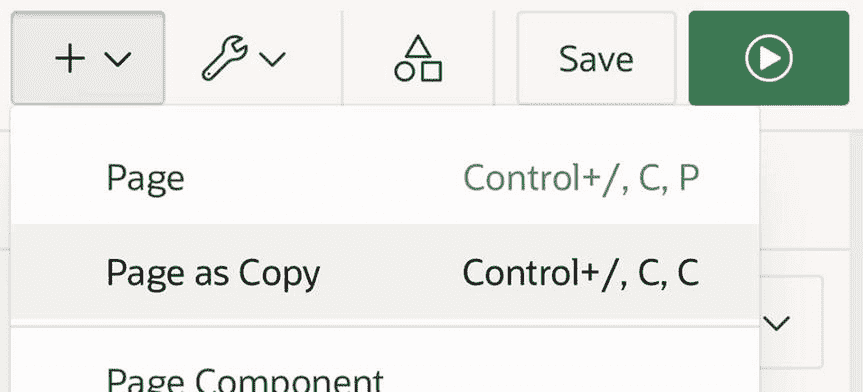

图 7-8 选择“页面作为副本”向导

此项目将打开 APEX 页面复制向导。其第一个屏幕询问要复制的页面位置；选择`Page in this application`。第二个屏幕要求您指定源页面和目标页面；图 7-9 显示了我如何填写。在第三个屏幕上，您应以通常的方式设置导航菜单项。第四个屏幕告知您复制页面组件是否存在困难；忽略该屏幕并点击`Create`按钮。

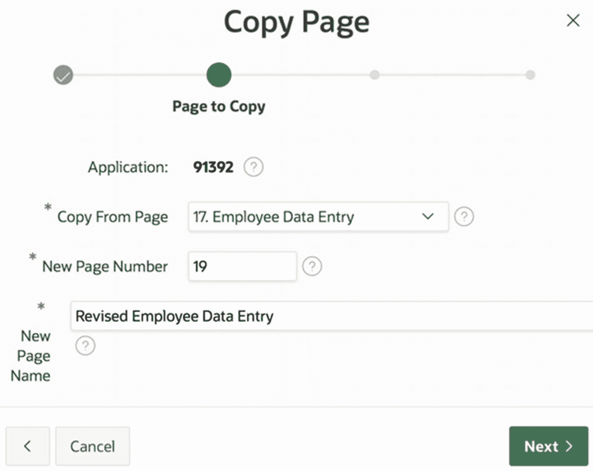

图 7-9 复制页面

### 修订 GetEmpInfo 进程

清单 7-7 展示了清单 7-4 中`GetEmpInfo`进程的一个修订版（粗体行是新的）。在检索到指定员工的值后，它将这些值保存在新的隐藏项`P19_ORIGINAL_JOB`、`P19_ORIGINAL_SAL`和`P19_ORIGINAL_DEPTNO`中（您应该创建这些项）。

```
begin
-- First retrieve the data.
select Job, Sal, DeptNo
into :P19_UPDATE_JOB, :P19_UPDATE_SAL, :P19_UPDATE_DEPTNO
from EMP
where EmpNo = :P19_UPDATE_EMPNO;
-- Then use hidden items to save a copy of the data.
:P19_ORIGINAL_JOB  := :P19_UPDATE_JOB;
:P19_ORIGINAL_SAL  := :P19_UPDATE_SAL;
:P19_ORIGINAL_DEPTNO := :P19_UPDATE_DEPTNO;
end;
```

清单 7-7 修订清单 7-4 中的 GetEmpInfo 代码

### 修订 UpdateEmp 进程

清单 7-8 展示了清单 7-3 中`UpdateEmp`进程的相应修订（粗体行是新的）。该代码从数据库重新读取值，并将其与隐藏项中的原始值进行比较。

```
declare
v_newjob  varchar2(9);
v_newsal  number(7,2);
v_newdept number(4,0);
begin
-- First re-read the data.
select Job, Sal, DeptNo
into v_newjob, v_newsal, v_newdept
from EMP
where EmpNo = :P19_UPDATE_EMPNO for update;
-- Then compare it with the original data.
if :P19_ORIGINAL_JOB = v_newjob and
:P19_ORIGINAL_SAL  = v_newsal and
:P19_ORIGINAL_DEPTNO = v_newdept
then
-- The record hasn't changed, so update it.
update EMP
set Job    = :P19_UPDATE_JOB,
Sal    = :P19_UPDATE_SAL,
DeptNo = :P19_UPDATE_DEPTNO
where EmpNo = :P19_UPDATE_EMPNO;
else
-- The record has changed, so abort.
raise_application_error(-20000,
'The record is out of date. Get it again.');
end if;
end;
```

清单 7-8 修订清单 7-3 中的 UpdateEmp 代码

中止进程的代码需要解释。`raise_application_error`函数使 APEX 中止进程并在页面上显示错误消息。该函数接受两个参数：第一个参数是错误代码，可以是–20,000 到–20,999 之间的任何数字；第二个参数是错误消息。

请注意，查询包含`for update`子句。该进程需要锁定指定的 EMP 记录，直到它可以执行`update`语句，以确保在此期间记录无法被修改。

### 测试修订后的代码

您可以像上一节那样测试此代码，从两个私密浏览器窗口运行该页面。在每个窗口中，选择相同的员工并点击`GetInfo`按钮。然后修改每个窗口中的项值，并点击`Update`按钮。第二次更新操作将不起作用；相反，APEX 将显示如图 7-10 所示的错误消息。


图 7-10 避免丢失更新时出现的错误消息

### 使用哈希函数

尽管此修订代码有效，但该技术扩展性不佳。需要保存和比较所有原始值很繁琐，并且随着保存值数量的增加会变得更加繁琐。一种更简单的方法是将所有原始值组合成一个值；然后您可以保存并比较该单一值。首选技术是使用`hash function`，它将一组值转换为一个单一的固定长度值，称为`checksum`。哈希函数还会混淆其输入，这使其可用于编码用户密码——如第 13 章将看到的。

APEX 有一个内置的哈希函数，名为`apex_util.get_hash`。该函数的输入是一个包含您想要哈希的值的集合。您应该使用 APEX 内置类型`apex_t_varchar2`来保存此集合。作为一个说明性示例，考虑以下代码：

```
v_vals   apex_t_varchar2 := apex_t_varchar2('CLERK', 20);
v_result varchar2(1000)  := apex_util.get_hash(v_vals);
```

代码的第一行声明了一个类型为`apex_t_varchar2`的变量`v_vals`，并为其分配了由该类型的构造函数函数（也称为`apex_t_varchar2`）创建的集合。构造函数函数的参数是值`'CLERK'`和`20`。代码的第二行声明了一个类型为`varchar2(1000)`的变量`v_result`，并为其分配了`apex_util.get_hash`函数的结果。换句话说，变量`v_result`将包含值['CLERK', 20]的哈希值。


### 使用哈希函数增强数据完整性

您应该使用此哈希函数来修订 `GetEmpInfo` 进程的代码，以便将三个可更新的值编码为单个哈希值。此哈希值随后保存在隐藏项 `P19_HASH`（您需要创建此项）中。此代码出现在清单 7-9 中（粗体行是新增的）。

```sql
declare
  v_valuesToHash apex_t_varchar2;
begin
  -- 首先检索数据。
  select Job, Sal, DeptNo
  into :P19_UPDATE_JOB,
       :P19_UPDATE_SAL,
       :P19_UPDATE_DEPTNO
  from EMP
  where EmpNo = :P19_UPDATE_EMPNO;

  -- 然后保存这些值的哈希值。
  v_valuesToHash := apex_t_varchar2(:P19_UPDATE_JOB,
                                    :P19_UPDATE_SAL,
                                    :P19_UPDATE_DEPTNO);
  :P19_HASH := apex_util.get_hash(v_valuesToHash);
end;
```
清单 7-9 清单 7-4 的 `GetEmpInfo` 进程的第二次修订

`UpdateEmp` 进程的代码也应进行重新修订，使其重新从数据库读取可更新值，计算其哈希值，并将该哈希值与保存的哈希值进行比较。此代码出现在清单 7-10 中（粗体行是新增的）。

```sql
declare
  v_valuesToHash apex_t_varchar2;
begin
  -- 首先重新读取数据。
  select apex_t_varchar2(Job, Sal, DeptNo)
  into v_valuesToHash
  from EMP
  where EmpNo = :P19_UPDATE_EMPNO for update;

  -- 然后将其与原始数据进行比较。
  if :P19_HASH = apex_util.get_hash(v_valuesToHash)
  then
    -- 记录未更改，因此进行更新。
    update EMP
    set    Job    = :P19_UPDATE_JOB,
           Sal    = :P19_UPDATE_SAL,
           DeptNo = :P19_UPDATE_DEPTNO
    where  EmpNo = :P19_UPDATE_EMPNO;
  else
    -- 记录已更改，因此中止。
    raise_application_error(-20000,
                            '记录已过期。请重新获取。');
  end if;
end;
```
清单 7-10 清单 7-3 的更新代码的第二次修订

尽管此代码实现了所需的功能，但它有些笨拙。本章末尾将重新审视此代码，届时您将看到如何使用验证来改进它。

### 成功与错误消息

更改数据库的进程应显示一条指示发生了什么的消息。再次考虑“修订后的员工数据录入”页面。如果员工报表仅包含少量记录，用户可以通过查看报表的变化来验证更新是否成功。但是，如果报表包含数千条记录，确定发生了什么就会困难得多。最好让进程显示诸如 **您的记录已被删除** 之类的消息。APEX 进程具有 `成功消息` 和 `错误消息` 属性，正是用于此目的。图 7-11 显示了 `Delete` 进程的这些属性值。

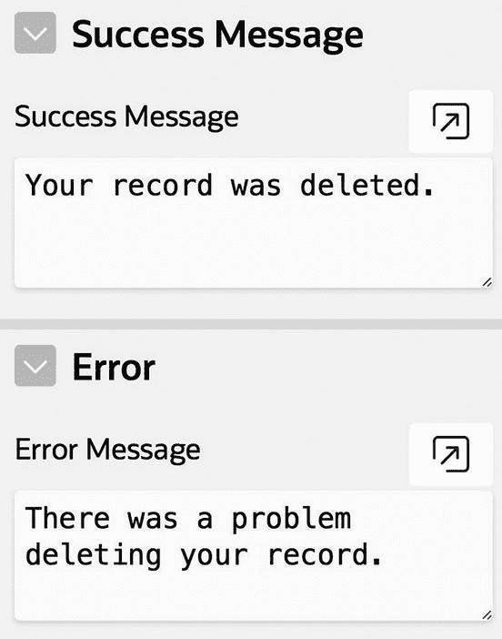

图 7-11 成功和错误消息属性

转到属性编辑器，为您的“销售佣金”和“修订后的员工数据录入”页面中的进程添加成功和错误消息。运行一个页面并进行一些更改。当页面重新呈现时，您指定的成功消息将被显示。（如果您有兴趣查看错误消息的实际效果，请修改进程的 PL/SQL 代码，使其引用一个不存在的表。）

成功和错误消息可以包含 HTML 代码和项目引用。例如，假设您希望图 7-11 中的成功消息像 APEX SQL 工作室中的 SQL 命令窗口那样，指明受影响的记录数。如何将受影响的记录数放入进程的成功消息中？

解决方案是使用内置的 PL/SQL 函数 `SQL%RowCount`。如果您在执行 SQL 命令后调用此函数，它将返回受影响的记录数。因此，您应该修改 `DeleteEmp` 进程，将该值分配给一个隐藏项（称之为 `P19_DELETE_COUNT`），然后在消息正文中引用该项。`DeleteEmp` 进程修订后的 PL/SQL 代码如清单 7-11 所示（粗体行是新增的）。

```sql
begin
  delete from EMP
  where  EmpNo = :P19_DELETE_EMPNO;

  :P19_DELETE_COUNT := SQL%RowCount;
end;
```
清单 7-11 修订清单 7-1 的 `DeleteEmp` 进程

然后，您可以将图 7-11 中的成功消息文本更改为：

```
已删除 &P19_DELETE_COUNT. 条记录。
```

请注意，对 `P19_DELETE_COUNT` 的引用在 PL/SQL 进程中使用了绑定变量语法，而在 HTML 消息中使用了替换字符串语法。

### 条件进程

到目前为止，您编写的每个进程都有一个关联的按钮，您使用其 `按下按钮时` 属性来指定进程与其按钮之间的关联。这是使用进程的自然且典型的方式，通常也是您所需要的。

有两种情况下 `按下按钮时` 属性是不够的：当提交操作不是由按钮引起时，以及当进程与多个按钮相关时。以下小节将考虑这些情况。

#### 通过项目提交

回想一下，某些类型的项目（即，单选组、选择列表、文本字段和密码字段）可以配置为执行提交操作。此类项目应该能够拥有一个关联的进程。问题在于，`按下按钮时` 属性没有提供选择项目的选项。

解决此难题的方法是放弃 `服务器端条件` 部分中的 `按下按钮时` 属性，转而使用其下方名为 `类型` 的属性（请参阅图 7-6）。该属性允许您显式指定进程应何时执行的条件。其选项与条件渲染的选项相同，在第 6 章中描述。

例如，让我们更改“修订后的员工数据录入”页面的“更新员工”区域，使其不再使用 `GetInfo` 按钮。图 7-12 显示了新区域的外观。现在，只需从选择列表中选择一名员工，就足以使所选员工的职位、薪水和部门自动显示。

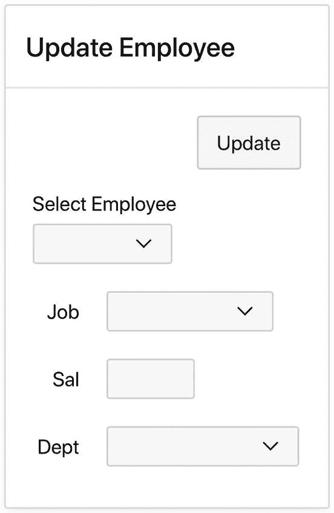

图 7-12 使用选择列表调用 `GetEmpInfo` 进程

实现此行为的方法是首先修改选择列表，使其在更改时提交页面，然后修改 `GetEmpInfo` 进程，使其在该提交发生时执行。对于第一个任务，将选择列表 `P19_UPDATE_EMPNO` 的操作修改为 `提交页面`，如图 7-13 所示。

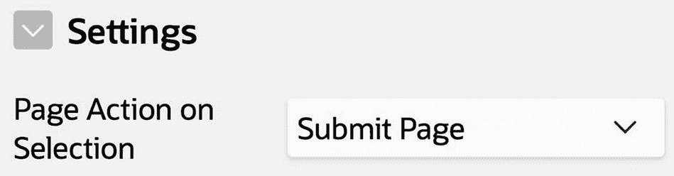

图 7-13 选择列表现在在更改时提交

对于第二个任务，如图 7-14 所示，更改 `GetEmpInfo` 进程的 `服务器端条件` 属性。请注意，其 SQL 表达式利用了 APEX 变量 `REQUEST`，该变量保存执行提交操作的项目的名称。因为表达式是 SQL 表达式，所以它使用绑定变量符号引用该变量。该表达式将变量值与字符串 `'P19_UPDATE_EMPNO'`（不带冒号）进行比较，因为表达式感兴趣的是该项的*名称*，而不是它所持有的*值*。


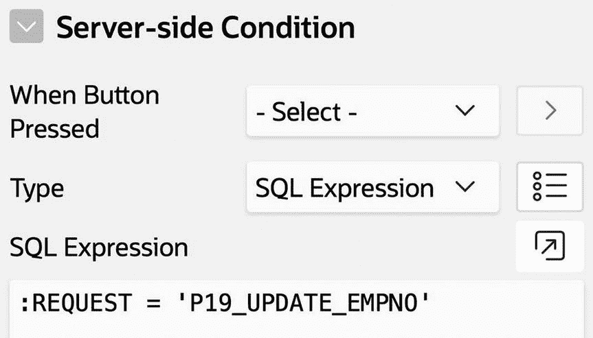

#### 图 7-14
`GetEmpInfo` 进程的修订后条件

完成后，您可以从页面中删除 `GetInfo` 按钮。

### 多用途进程
无法利用 `按下按钮时` 属性的另一种情况是，一个进程适用于多个按钮时。本节包含两个与 `修订后的员工数据录入` 页面相关的示例。

对于第一个示例，假设您想要记录对 `EMP` 表所做的所有更改。具体而言，每次点击 `删除`、`插入` 或 `更新` 按钮时，都应向名为 `EMPLOG` 的表中插入一条相应的记录。

用于创建 `EMPLOG` 的 SQL 语句出现在代码清单 7-12 中。您应该通过转到 SQL 工作坊并提交该语句来创建此表。请注意，表中的记录将描述更改请求、提出请求者以及请求时间。

```
create table EMPLOG(Request varchar2(20),
UserName varchar2(20),
RequestDate Date)
```
代码清单 7-12
用于创建 `EMPLOG` 表的 SQL 代码

设 `LogChanges` 为向 `EMPLOG` 插入记录的进程的名称。您应在 `修订后的员工数据录入` 页面中创建此进程，并为其提供代码清单 7-13 中的 PL/SQL 代码。

```
begin
insert into EMPLOG (Request, UserName, RequestDate)
values (:REQUEST, :APP_USER, sysdate);
end;
```
代码清单 7-13
`LogChanges` 进程的 PL/SQL 代码

此代码引用了内置变量 `APP_USER` 和 `REQUEST`，这两个变量您之前都见过。变量 `APP_USER` 保存已登录用户的名称，而 `REQUEST` 保存执行提交操作的按钮或项的名称。因此，`LogChanges` 进程向 `EMPLOG` 表插入一条记录，其中包含提交操作的来源、执行该操作的用户以及操作发生的日期。

每次点击 `插入`、`删除` 或 `更新` 按钮时，此进程都需要执行，但从项 `P19_UPDATE_EMPNO` 中选择值时则不需要执行。显然，`按下按钮时` 属性在这里毫无用处，因为它只允许您选择单个按钮。

解决方案是将进程的服务器端条件设置为图 7-15 所示的 SQL 表达式。此表达式确保仅当点击名为 `插入`、`删除` 或 `更新` 的按钮时，进程才会触发。由于这些按钮中的每一个也都有自己的专用进程，因此点击其中任何一个按钮都将导致两个进程执行。进程将按其序列号顺序执行。

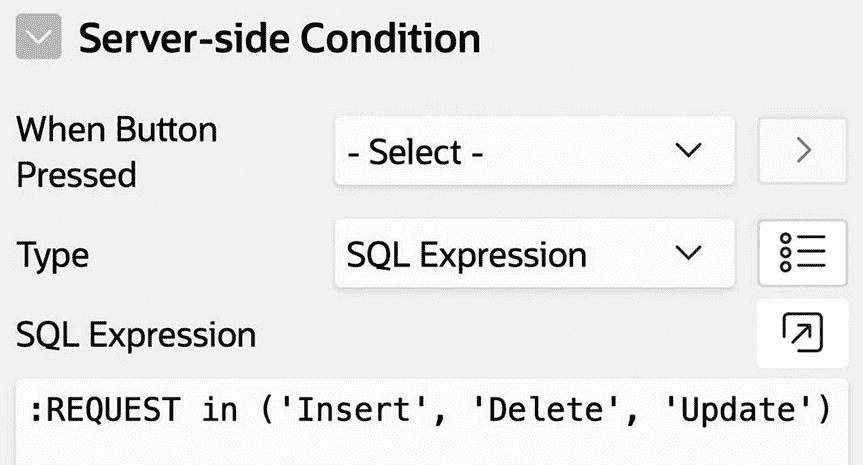

#### 图 7-15
`LogChanges` 进程的条件部分

您可能在想，不需要一个单独的进程来执行日志记录；相反，您可以将日志记录代码附加到每个按钮的专用进程中。此策略有效，但不建议采用。问题在于这样做会复制日志记录代码，这意味着如果您想更改日志记录的工作方式（例如，向 `EMPLOG` 表添加新列或将 `RequestDate` 列更改为同时保存时间和日期），您将需要在三个地方进行更新。此外，如果您决定向页面添加新按钮，则必须记住从现有按钮中提取此日志记录代码，并将其添加到新按钮的进程中。采用一个可由多个按钮调用的独立进程要优雅和实用得多。

无法利用 `按下按钮时` 属性的进程的第二个示例涉及发送电子邮件。具体来说，假设您希望 `修订后的员工数据录入` 页面在检测到可疑修改时向数据库管理员发送电子邮件。让我们将可疑修改定义为在正常工作时间上午 9 点至下午 5 点之外发生的删除或更新。要实现此功能，您需要做两件事：创建一个进程（称其为 `SendSuspiciousEmail`）来发送电子邮件，并指定其触发条件。

要创建该进程，您可以使用 APEX 的电子邮件发送函数 `apex_mail.send`。此函数可以接受多个参数，分别表示（除其他外）发件人和收件人地址、主题和邮件正文。进程的代码只需计算这些参数值并调用该函数。代码清单 7-14 显示了我的代码。（当然，如果您想亲自尝试此代码，应将收件人更改为您自己的电子邮件地址。）

```
declare
v_action varchar2(40);
begin
if :REQUEST = 'Delete' then
v_action := ' deleted the record for emp '  || :P19_DELETE_EMPNO;
else
v_action := ' modified the record for emp ' || :P19_UPDATE_EMPNO;
end if;
apex_mail.send(
p_from => 'EmployeeDemo@MyCompany.com',
p_to   => 'dba@MyCompany.com',
p_subj => 'Suspicious changes to EMP',
p_body => :APP_USER || v_action);
end;
```
代码清单 7-14
`SendSuspiciousEmail` 进程的代码

此代码唯一值得注意的部分是它使用 `REQUEST` 变量来定制邮件正文，以提及执行的操作和受影响的员工记录。例如，如果用户 `boris@secret.org` 修改了总裁 `KING` 的记录内容，邮件正文将显示：

```
boris@secret.org modified the record for emp 7839
```

当点击 `删除` 或 `更新` 按钮，并且当前时间（由 `current_timestamp` 函数确定）早于上午 9 点或晚于下午 5 点时，此代码应执行。图 7-16 显示了此条件的 SQL 表达式。

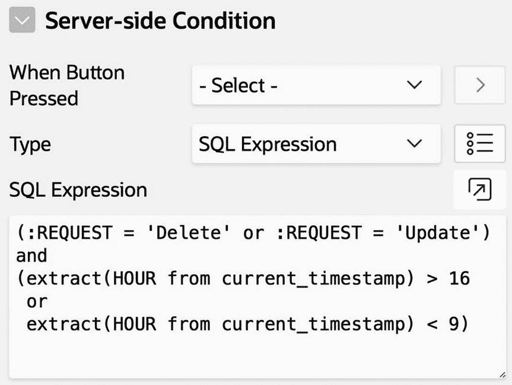

#### 图 7-16
`SendSuspiciousEmail` 进程的条件

### 页面渲染进程
到目前为止，本章中的所有进程都是在提交时执行的。本章的剩余部分将考虑在页面渲染期间执行的进程。当页面使用重定向而不是提交时，这种情况经常出现，例如从报告的行进行链接时。

例如，回顾第 3 章，交互式报告可以有一个链接列，点击行的链接列会在 `单行视图` 中显示该行的值（请参阅图 3-66 和 3-67）。`单行视图` 具有用于移动到表中上一行和下一行的按钮，以及另一个用于返回到报告视图的按钮。


## 单行视图页面

员工演示应用程序的第 20 页被称为 `Single Row View`，如图 7-17 所示。该页面包含两个区域，其工作方式类似于交互式报表的单行视图。`Employees` 区域是 `EMP` 记录的经典报表。用户可以通过点击其第一列中的链接来选择一行；APEX 会将该行的值放入 `Emp Info` 区域的项中。`Emp Info` 区域有三个按钮：底部的箭头按钮选择上一个或下一个记录，顶部的 `Report View` 按钮将控制权传回报表。

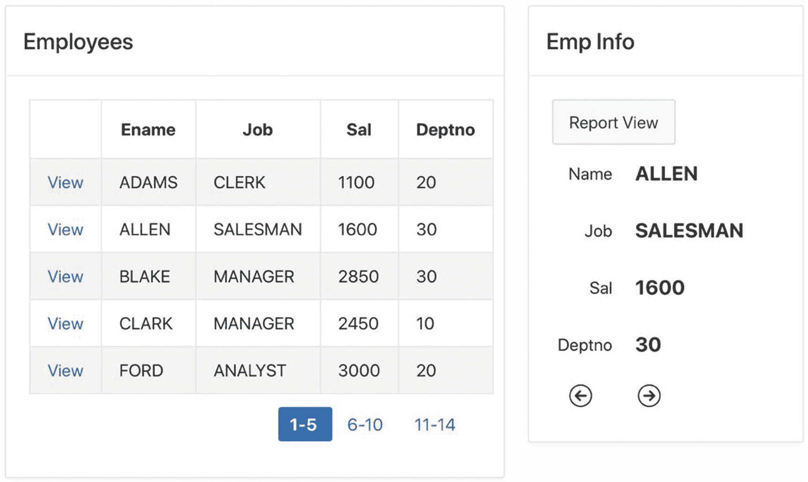

图 7-17 单行视图页面

尽管图 7-17 同时显示了 `Employees` 和 `Emp Info` 区域，但它们实际上永远不会以这种方式显示。`Employees` 区域仅在没有选定记录时显示，而 `Emp Info` 区域仅在有选定记录时显示。

当您尝试实现此页面时，会出现几个问题：`Emp Info` 区域中的项如何获取其值？页面如何知道是显示 `Employees` 区域还是 `Emp Info` 区域？箭头按钮是如何实现的？这些问题将在以下各节中讨论。

### 无需提交即可执行进程

让我们首先考虑如何构建 `Employees` 区域。它是一个经典报表区域，具有以下源查询：

```sql
select EmpNo, EName, Job, Sal, DeptNo
from EMP
order by EName
```

您应将 `EmpNo` 列的类型设置为 `Link`。要配置此链接，请单击该列的 `Target` 属性以调出 `Link Builder` 向导屏幕。图 7-18 显示了我填写后的屏幕。它指定当选择链接时，APEX 将把名为 `P20_EMPNO` 的项设置为选定的员工编号，并重定向到同一页面。为此，您当然需要将 `P20_EMPNO` 创建为隐藏项。

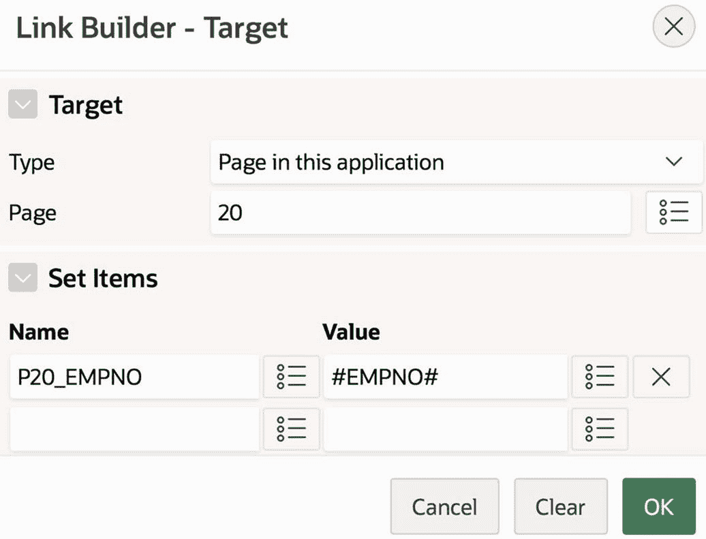

图 7-18 为 EmpNo 列配置链接

现在考虑 `Emp Info` 区域。它应该有四个项和三个按钮。这些项命名为 `P20_ENAME`、`P20_JOB`、`P20_SAL` 和 `P20_DEPTNO`。它们的类型均为 `Display Only`，因此无法修改。按钮命名为 `ReportView`、`Previous` 和 `Next`。`ReportView` 定位在 `Above Region`，而 `Previous` 和 `Next` 定位在 `Below Region`；所有三个按钮都左对齐。

`Previous` 和 `Next` 按钮使用与交互式报表的单行模式中使用的按钮相同的图标。我选择在本区域中使用它们只是为了说明如何实现。图 7-19 显示了 `Previous` 按钮的 `Appearance` 属性。

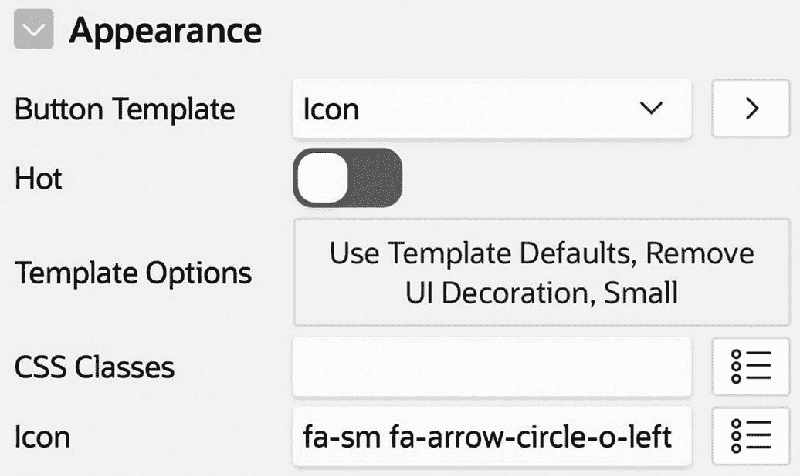

图 7-19 “上一个”按钮的外观部分

要指定按钮应显示为图标，您可以将 `Button Template` 属性的值设置为 `Icon`，并将 `Icon` 属性的值设置为所需图标文件的名称。您可以通过单击 `Icon` 属性右侧的快速选择符号并从显示的大量图标中选择来获取此文件名。单击 `Template Options` 属性可以让您自定义按钮的外观。特别是，将 `Style` 属性设置为 `Remove UI Decoration` 会显示没有通常围绕按钮的矩形的图标。`Next` 按钮的属性设置与 `Previous` 按钮相同，只是图标是向右的箭头。

一旦构建了 `Emp Info` 区域，下一步就是编写一个进程来检索 `P20_EMPNO` 中指定的员工的值，并将它们放入 `Emp Info` 的项中。转到页面编辑器的 `Processing` 选项卡，创建一个名为 `FetchRow` 的进程，其 PL/SQL 代码如清单 7-15 所示。此代码类似于清单 7-4，即 `Employee Data Entry` 页面上 `GetEmpInfo` 按钮关联的代码。

```sql
begin
if :P20_EMPNO is not null then
select EName, Job, Sal, DeptNo
into :P20_ENAME, :P20_JOB, :P20_SAL, :P20_DEPTNO
from EMP
where EmpNo = :P20_EMPNO;
end if;
end;
```

清单 7-15 FetchRow 进程的 PL/SQL 代码

尽管此进程代码正确，但它的执行点错误。`Processing` 执行点意味着进程在发生提交操作时执行。但 `Employees` 区域不执行提交；而是调用链接，而链接执行重定向。您需要的是进程在重定向发生后执行——即在页面渲染期间。

在页面设计器中单击 `FetchRow` 的节点，并查看其 `Execution Options` 部分。`Point` 属性指定了进程的执行点。图 7-20 向您展示了可能的值。

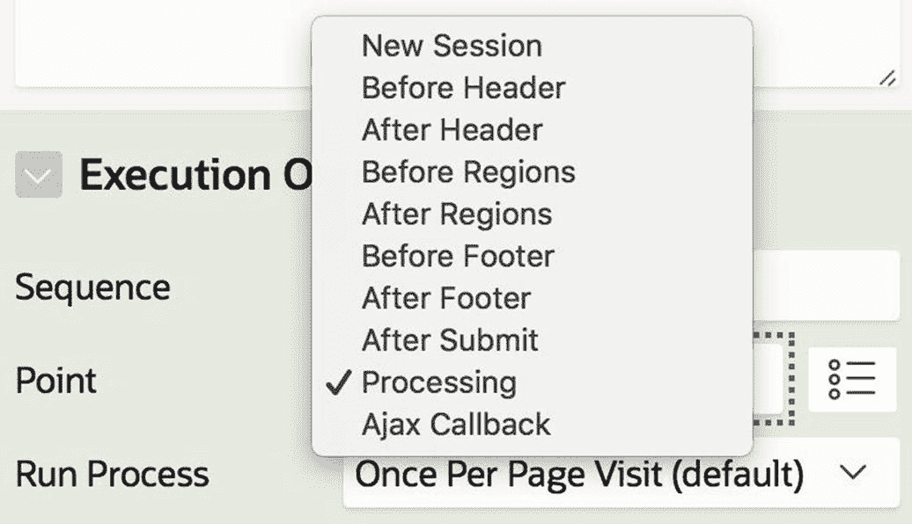

图 7-20 可能的进程执行点

如果一个进程的执行点是 `New Session`，它只会在会话开始时执行。从 `Before Header` 到 `After Footer` 的执行点表示页面渲染的六个阶段；分配到其中一个点的进程将在指定的渲染阶段执行。执行点 `After Submit` 和 `Processing` 是提交操作的两个阶段。如果您希望进程在验证阶段之前执行，则将其分配给 `After Submit` 点；如果您希望它在验证之后执行，则分配给 `Processing`。

尽管这些选项对于高级应用程序很有用，但许多执行点之间的差异很微妙，并且在大多数情况下无关紧要。就我们的目的而言，唯一有趣的区别在于在提交期间执行的进程和在渲染期间执行的进程之间。特别是，本书中的所有进程在页面渲染期间执行时都具有 `After Header` 执行点，而在提交期间执行时具有 `Processing` 执行点。

现在将注意力转回 `FetchRow` 进程，并将其执行点更改为 `After Header`。您应该观察到该进程的节点将从处理树中消失并重新出现在渲染树中，如图 7-21 所示。这是合理的，因为渲染树包含页面渲染期间发生的所有内容，其中包括进程。此图还显示 `After Header` 执行点是一个**预渲染**点——也就是说，它在区域渲染之前发生。这很重要，因为它确保 `FetchRow` 将在页面项被渲染之前为它们赋值。

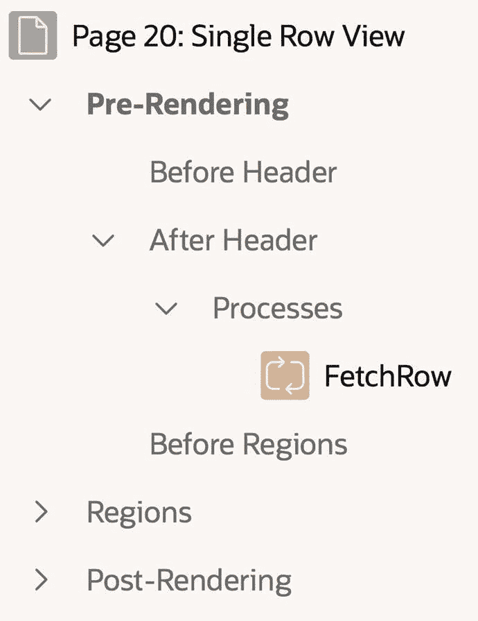

图 7-21 FetchRow 现在是一个渲染进程


`FetchRow` 进程会在页面每次渲染时被调用。但是，除非用户已选择了一行，否则让它去查询数据库是没有意义的——也就是说，它应该仅当 `P20_EMPNO` 非空时才执行其 SQL 语句。这正是清单 7-15 中 if 语句的目的。（一个同样好的等效解决方案是移除 if 语句，并更改进程的 `服务器端条件` 属性，使其仅在 `P20_EMPNO` 不为空时执行。）
与其将 `FetchRow` 创建为提交进程然后再更改其执行点，不如直接将其创建为渲染进程更为简便。你只需在渲染树中右键单击 `After Header` 节点，然后选择 `创建进程`。

### 在区域间切换
在你应用程序的这个阶段，你应该验证点击 `Employees` 报表上的链接是否能正确地将所选员工的值放入 `Emp Info` 的各项中。接下来的问题是要制定一个计划，让这些区域如何能“轮流”渲染自身。
关键思路是认识到 `P20_EMPNO` 的非 `空` 值表示已选择了一行。因此，要“取消选择”一行，自然地应该将 `空` 值放入 `P20_EMPNO`。这样，两个区域便可以利用该项的值来决定它们的条件渲染——当该项值为 `空` 时，`Employees` 区域应可见；当值不为 `空` 时，`Emp Info` 区域应可见。换句话说，`P20_EMPNO` 的值决定了页面是处于 *报表模式* 还是 *单行模式*。
这一思路也引出了实现 `ReportView` 按钮的自然方式。它应该简单地重定向到同一页面，并将 `P20_EMPNO` 设置为 `空`。进行这些更改，并再次测试你的页面。点击报表中的一行应显示该员工的 `Emp Info` 区域，而点击 `Report View` 按钮应再次显示报表。

### 查找上一条和下一条记录
最后一个问题是实现 `Previous` 和 `Next` 按钮，使得点击它们时，区域会显示报表中的上一条（或下一条）记录。本节考虑两种不同的实现此功能的方法。第一种方法更容易理解，但有一些局限性。第二种方法理解起来稍难一些，但优雅得多。

#### 方法一：分别为上一条和下一条使用不同进程
考虑 `Previous` 按钮，它需要选择上一条记录。我们暂时假设“上一条记录”意味着拥有次低员工编号的记录。清单 7-16 中的 PL/SQL 代码可以完成这项工作。

```sql
declare
  v_prevEmp number(4,0);
begin
  select max(EmpNo) into v_prevEmp
  from EMP
  where EmpNo < :P20_EMPNO;
  if v_prevEmp is not null then
    :P20_EMPNO := v_prevEmp;
  end if;
end;
```
*清单 7-16 方法一的“上一条”按钮简化代码*

if 语句对于处理尝试获取第一个员工的上一条记录的情况是必需的。在这种情况下，查询将返回一个 `空` 值。如果没有 if 语句，按钮会将该 `空` 值放入 `P20_EMPNO`，这会导致取消选择行并返回到报表模式。通过使用 if 语句，从第一行点击 `Previous` 按钮将不会有任何效果。

现在假设你想使用不同的列来确定上一条记录，例如 `EName`。前面的查询不容易扩展到这种情况。相反，你应该使用 SQL 分析函数 `lag`，它根据指定的排序顺序查找前一个值。清单 7-17 给出了相应的 PL/SQL 代码。

```sql
declare
  v_prevEmp number(4,0);
begin
  select PrevEmp into v_prevEmp
  from (select EmpNo, lag(EmpNo) over (order by EName) as PrevEmp
        from EMP)
  where EmpNo = :P20_EMPNO;
  if v_prevEmp is not null then
    :P20_EMPNO := v_prevEmp;
  end if;
end;
```
*清单 7-17 方法一的“上一条”按钮 PL/SQL 代码*

内部查询创建了一个包含两列员工编号的表，其中每个员工都与排序中紧接在其前面的员工配对。外部查询然后从该表中选择 `EmpNo` 值等于 `P20_EMPNO` 的行，并返回该记录的 `PrevEmp` 值。
除了 `lag` 函数，SQL 还有 `lead` 函数，其行为方式相同，只是它返回排序顺序中的下一个更高值。此函数可用于实现 `Next` 按钮，其 PL/SQL 代码与清单 7-17 类似（因此省略）。
因为 `Previous` 和 `Next` 按钮各自有自己的进程，你应该将它们的动作设置为 `提交`。你还应将每个进程配置为根据其按钮有条件地执行。虽然这不是此问题的最佳解决方案，但它运行良好，值得实现以查看其实际效果。

#### 方法二：统一的“上一条/下一条”进程
方法一的缺点是，当 `Previous` 和 `Next` 按钮到达第一条或最后一条记录时，它们没有任何可见效果；对用户来说，它们似乎停止工作了。另一个想法是在按钮不适用时将其隐藏。为此，页面需要“向前查看”。也就是说，除了跟踪当前员工编号外，页面还需要跟踪上一个和下一个值。这样，如果上一个值为 `空`，它就可以隐藏 `Previous` 按钮，对 `Next` 按钮同理。

要实现此方法，创建隐藏项 `P20_PREV` 和 `P20_NEXT` 来保存上一个和下一个员工编号。然后，每当选择一条记录时，一个进程可以“向前查看”并将适当的值赋给这些项。这个名为 `FindPreviousNext` 的进程如清单 7-18 所示。

```sql
begin
  if :P20_EMPNO is not null then
    select PrevEmp, NextEmp
      into :P20_PREV, :P20_NEXT
      from (select EmpNo,
                   lag(EmpNo)  over (order by EName) as PrevEmp,
                   lead(EmpNo) over (order by EName) as NextEmp
              from EMP)
     where EmpNo = :P20_EMPNO;
  end if;
end;
```
*清单 7-18 用于查找上一条和下一条值的 PL/SQL 代码*

此代码与清单 7-17 中的代码相似，区别在于它不特定于任何特定按钮。实际上，它必须在选择一行时执行，无论该选择是通过报表中的链接还是通过 `Previous` 或 `Next` 按钮之一进行的。换句话说，`FindPreviousNext` 进程应该在页面渲染期间执行，就像 `FetchRow` 进程一样。

因此，`Previous` 和 `Next` 按钮的配置可以简单得多。考虑 `Previous` 按钮（`Next` 按钮类似）。因为 `P20_PREV` 保存着上一条记录的 `EmpNo`，你可以将按钮配置为在被点击时重定向，将 `P20_PREV` 的值放入 `P20_EMPNO`。参见图 7-22。

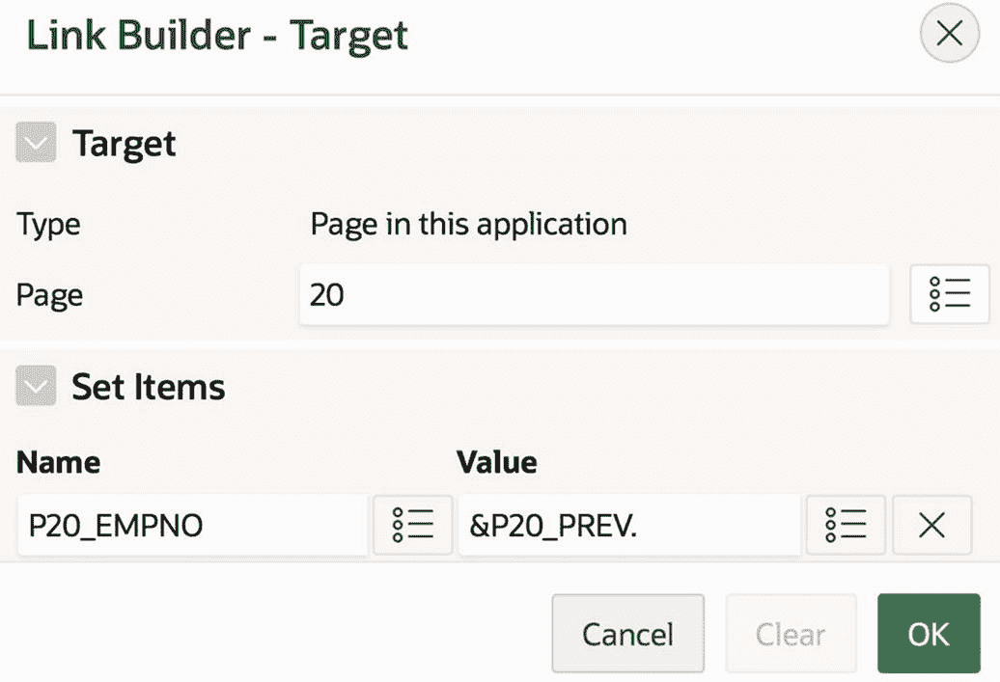
*图 7-22 配置“上一条”按钮的动作*

你也可以使用 `P20_PREV` 和 `P20_NEXT` 来自定义何时显示 `Previous` 和 `Next` 按钮。具体来说，当 `P20_PREV` 不为空时应显示 `Previous` 按钮，当 `P20_NEXT` 不为空时应显示 `Next` 按钮。这些条件可以使用条件渲染来表达。例如，图 7-23 显示了 `Previous` 按钮的 `服务器端条件` 部分。


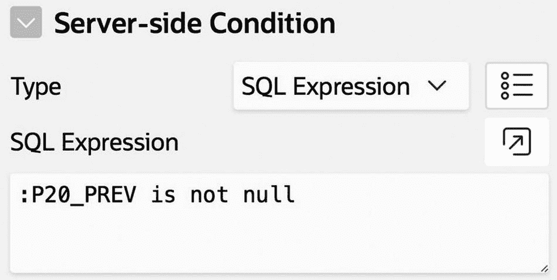

**图 7-23**
自定义“上一个”按钮的显示时机

### 方案总结

总结来说，方案 2 的实现“上一个/下一个”功能的方式如下：首先创建隐藏项 `P20_PREV` 和 `P20_NEXT`。然后创建名为 `FindPreviousNext` 的过程，它使用清单 7-18 的代码计算这两个项的值，并在页面呈现时执行。

最后，配置 `Previous` 和 `Next` 按钮，使其重定向到当前页面，并为 `P20_EMPNO` 赋值。`Previous` 按钮使用 `P20_PREV` 的值，而 `Next` 按钮使用 `P20_NEXT` 的值。每个按钮都使用条件渲染，仅当其关联的项值不为 `null` 时才显示。

结果是，整个页面由两个相对较小的过程组成：一个获取所选行的值，另一个计算上一条和下一条记录的雇员号。两个过程都在页面呈现时执行。用户可以通过点击报表链接或 `Previous`/`Next` 按钮来选择一行。无论哪种情况，页面都会确定所选记录的雇员号，将其保存到项 `P20_EMPNO` 中，并进行重定向，从而触发这两个过程的执行。整个过程无需任何提交操作。

## 单行更新

报表模式/单行模式思想的另一个用途是支持数据录入。`Single Row Update` 页面阐述了这一思想。它是示例应用程序的第 21 页，如图 7-24 所示。图中的三个区域是同时显示的，但实际上一次只显示一个区域。根据可见区域的不同，页面将处于报表模式、更新模式或插入模式。

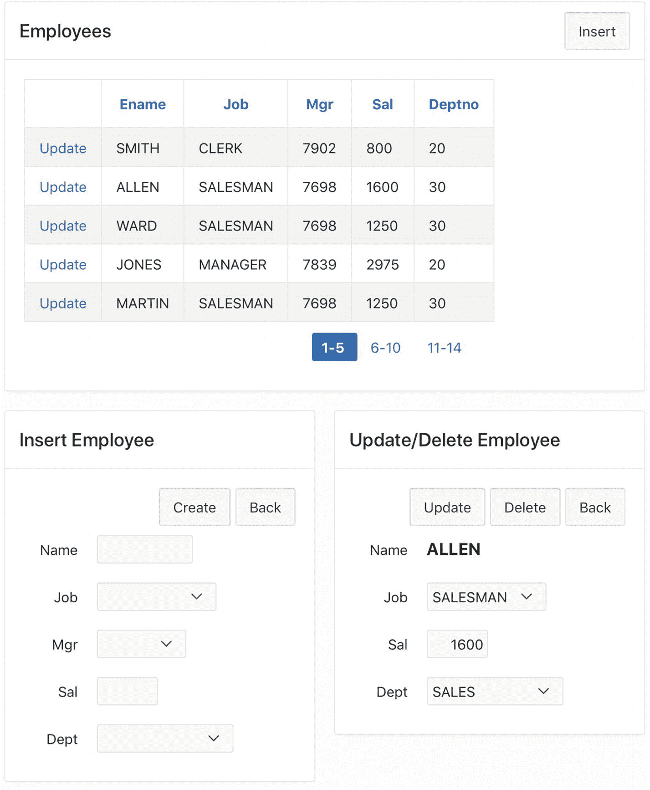

**图 7-24**
单行更新页面

最初，页面以报表模式显示 `Employees` 区域。从那里，用户可以点击 `Insert` 按钮进入插入模式，或者点击某个 `Edit` 链接进入更新模式。

在插入模式下，页面显示 `Insert Employee` 区域。该区域与 `Employee Data Entry` 页面中的相应区域基本相同。它的 `Create` 按钮创建一个具有指定值的新 `EMP` 记录，然后清除各项的值，为下一次插入做准备。`Cancel` 按钮返回到报表模式。

在更新模式下，页面显示 `Update/Delete Employee` 区域。该区域的各项最初填充了所选雇员的信息。用户可以更改区域中的项值，然后点击 `Update` 按钮来更新数据库。或者，点击 `Delete` 按钮会删除所选记录。删除记录后也会返回到报表模式，因为没有记录可再显示。点击 `Cancel` 按钮只是简单地返回到报表模式。

现在你了解了页面的工作原理，可以考虑如何实现每个区域了。以下小节将探讨这些问题。

### 实现报表区域

报表区域的实现与图 7-17 的 `Single Row View` 页面基本相同。一个区别是它还有一个名为 `P21_MODE` 的隐藏项，用于区分三种模式。该项的值将是 `Report`、`Insert` 和 `Update`（视情况而定），`null` 值表示报表模式。

`EmpNo` 列被实现为一个链接。该链接重定向到第 21 页，并在重定向时设置两个项的值：`P21_EMPNO` 设置为所选雇员号，`P21_MODE` 设置为 `Update`。`Insert` 按钮也会进行重定向，将 `P21_MODE` 设置为 `Insert`。该区域根据以下 SQL 表达式进行条件渲染：

```
:P21_MODE = ‘Report’ or :P21_MODE is null
```

### 实现插入区域

一条新的 `EMP` 记录有九个值，但用户只需指定其中五个。`Insert Employee` 区域为这五个值各设置了一个项。这些项被命名为 `P21_INSERT_ENAME`、`P21_INSERT_JOB` 等。该区域还有两个按钮，分别名为 `Create` 和 `CancelInsert`。区域根据以下 SQL 表达式进行条件渲染：

```
:P21_MODE = 'Insert'
```

`Create` 按钮执行提交操作。它有一个关联的过程，名为 `InsertEmp`，该过程执行两件事：执行一条 SQL 插入命令，并将其项设置为 `null`。它对 `HireDate`、`Comm` 和 `Office` 使用默认值。其代码见清单 7-19。

```
begin
insert into EMP(EName, Job, Mgr, Sal, DeptNo, HireDate, Comm, Offsite)
values (:P21_INSERT_ENAME,
:P21_INSERT_JOB,
:P21_INSERT_MGR,
:P21_INSERT_SAL,
:P21_INSERT_DEPTNO,
current_date,  0,  'N');
-- Clear the region's visible items.
:P21_INSERT_ENAME   := null;
:P21_INSERT_JOB     := null;
:P21_INSERT_MGR     := null;
:P21_INSERT_SAL     := null;
:P21_INSERT_DEPTNO  := null;
-- But do not change the mode.
end;
```
**清单 7-19**
InsertEmp 过程的 PL/SQL 代码

`CancelInsert` 按钮进行重定向，将 `P21_MODE` 设置为 `Report`。

### 实现更新/删除区域

`Update/Delete Employee` 区域中的各项由一个名为 `FetchRowForUpdate` 的过程填充，该过程在页面呈现时执行，并基于 SQL 表达式进行条件判断。

```
:P21_MODE = 'Update'
```

该过程的代码见清单 7-20。该代码与清单 7-15 中的 `FetchRow` 过程基本相同，只是它还处理了丢失更新的问题。（此问题与 `Single Row View` 页面无关，因为该页面不执行任何更新。）它计算三个可修改项的哈希值，并将其保存在隐藏项 `P21_HASH` 中。

```
declare
v_valuesToHash apex_t_varchar2;
begin
if :P21_EMPNO is not null then
-- First, fetch the employee record and save its values.
select EName, Job, Sal, DeptNo
into :P21_UPDATE_ENAME,
:P21_UPDATE_JOB,
:P21_UPDATE_SAL,
:P21_UPDATE_DEPTNO
from EMP
where EmpNo = :P21_EMPNO;
-- Then save the hash of the updatable values.
v_valuesToHash := apex_t_varchar2(:P21_UPDATE_JOB,
:P21_UPDATE_SAL, :P21_UPDATE_DEPTNO);
:P21_HASH := apex_util.get_hash(v_valuesToHash);
end if;
end;
```
**清单 7-20**
FetchRowForUpdate 过程的 PL/SQL 代码

该区域的 `Delete` 按钮的 PL/SQL 代码名为 `DeleteEmp`。它执行一条 SQL `delete` 命令，类似于清单 7-1，然后返回到报表模式。其代码见清单 7-21。

```
begin
-- First, delete the record.
delete from EMP
where EmpNo = :P21_EMPNO;
-- Then return to report mode.
:P21_EMPNO := null;
:P21_MODE  := 'Report';
end;
```
**清单 7-21**
DeleteEmp 过程的代码

`Update` 按钮的代码名为 `UpdateEmp`。它在确保没有丢失更新后，执行一条 SQL `update` 命令。该代码与 `Revised Employee Data Entry` 页面的更新代码基本相同（参考清单 7-10）。代码见清单 7-22。


```
declare
v_valuesToHash apex_t_varchar2;
begin
-- 首先重新读取数据。
select apex_t_varchar2(Job, Sal, DeptNo)
into v_valuesToHash
from EMP
where EmpNo = :P21_EMPNO for update;
-- 然后与原始数据进行比较。
if :P21_HASH = apex_util.get_hash(v_valuesToHash) then
-- 记录未更改，因此进行更新。
update EMP
set Job    = :P21_UPDATE_JOB,
Sal    = :P21_UPDATE_SAL,
DeptNo = :P21_UPDATE_DEPTNO
where EmpNo = :P21_EMPNO;
else
-- 记录已更改，因此中止。
raise_application_error(-20000,
'记录已过期。请重新获取。');
end if;
end;
清单 7-22
UpdateEmp 过程的代码
```

总而言之，“单行更新”页面包含四个过程。其中三个过程在提交时执行；它们的职责是运行各自的插入、删除和更新 SQL 语句。第四个过程负责运行 SQL 查询以初始化区域的项；它在页面呈现时执行。

## 总结

过程是一种页面组件，它使您能够访问数据库并执行计算。本章探讨了过程在应用程序中所扮演的角色。例如，执行提交操作的按钮通常有一个关联的过程，该过程将在按钮被点击时执行。过程也可以配置为在页面呈现时执行，并计算项的初始值。

本章完全集中于 PL/SQL 过程。要指定 PL/SQL 过程的行为，您需要编写 PL/SQL 代码。PL/SQL 将 SQL 命令直接集成到通用编程语言中，这使得编写数据库感知代码变得容易。第 10 章将探讨其他过程类型。

尽管 PL/SQL 过程可能非常有用，但它们需要谨慎编码。本章探讨了一个常见的陷阱，称为**丢失更新问题**。您学习了如何识别该问题以及如何编写必要的 PL/SQL 代码来避免它。

