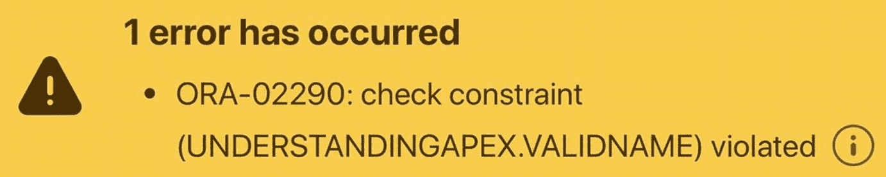
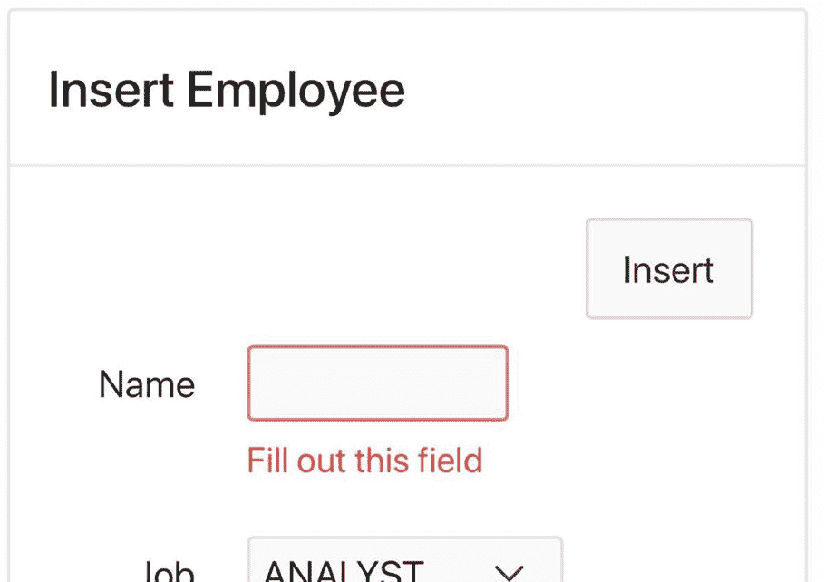
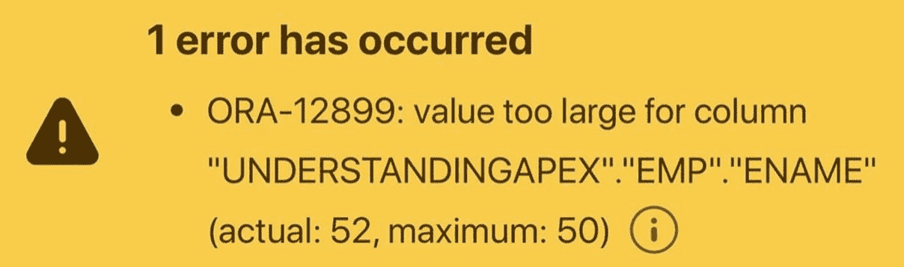
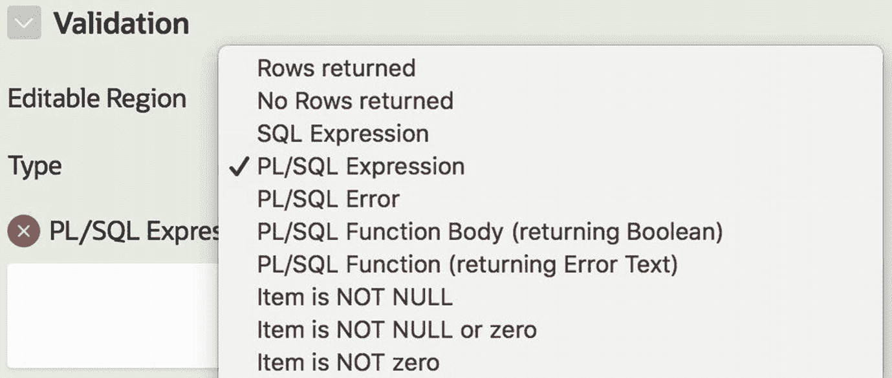
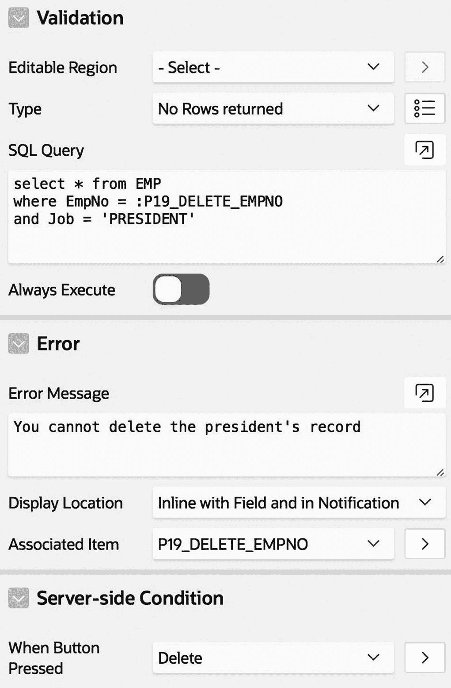
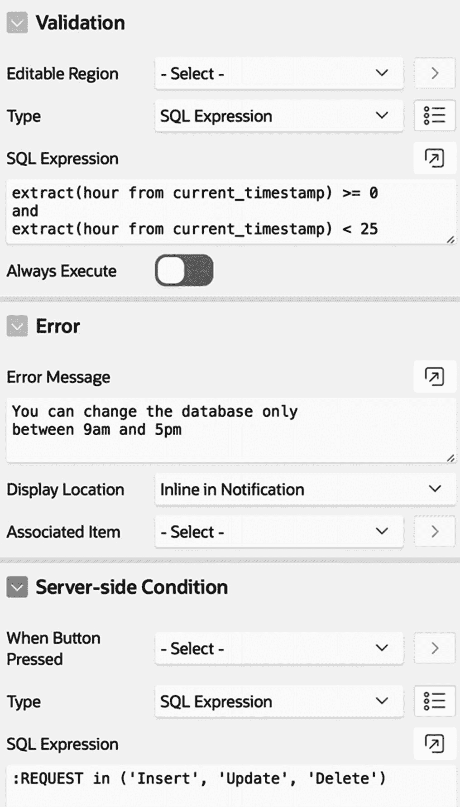
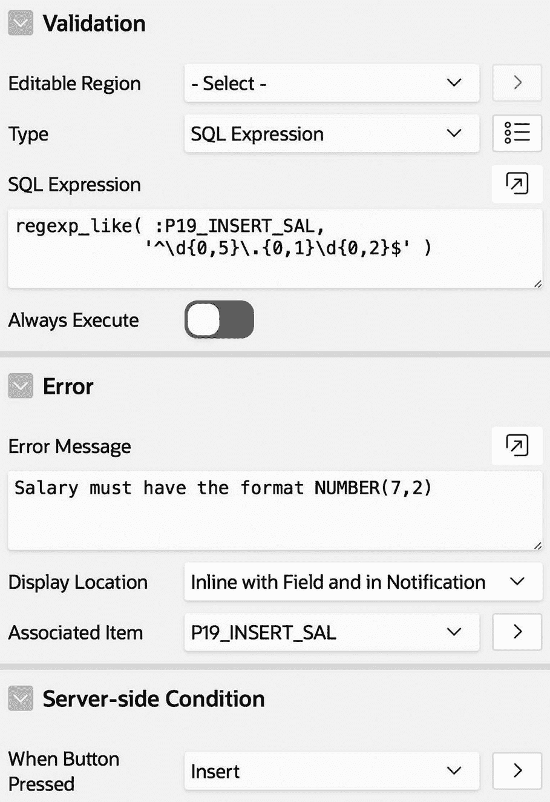
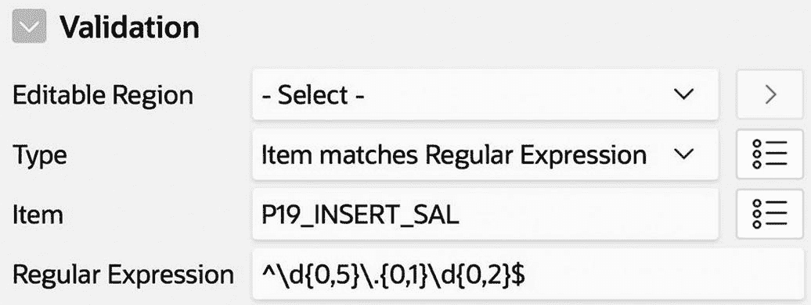

# 8. 数据验证

当一个过程写入数据库时，它通常从会话状态中获取其值。因此，应用程序开发人员必须验证会话状态值是否有效，以确保过程被适当使用并保持数据库的完整性。本章探讨了有效会话状态的三个方面——约束保持、输入验证和过程验证——并展示了如何在 APEX 应用程序中实现它们。

## 约束保持

数据库的完整性很重要。不正确记录的存在不仅会降低涉及该记录的任何查询的价值；它还会降低整个数据库的价值——因为如果一个记录是错误的，用户会怀疑其他记录可能也是错误的。这样的数据库可能很快变得毫无用处。

数据库系统用来保护自身的主要机制是约束。数据库管理员通常在创建表时指定约束。例如，`EMP` 表为其定义了以下四个约束：

*   `EmpNo` 列是一个键，这确保没有两个员工具有相同的 `EmpNo` 值。
*   `DeptNo` 列是 `DEPT` 的外键，这确保 `DeptNo` 的每个非 `null` 值都对应一个现有的 `DEPT` 记录。
*   `Mgr` 列是 `EMP` 的外键，这确保 `Mgr` 的每个非 `null` 值都对应一个现有的 `EMP` 记录。
*   `EmpNo` 值不能为空，这确保每个员工都有一个编号。

让我们向数据库再添加两个约束：

*   `EName` 值不能为空，这确保每个员工都有一个名字。
*   `Sal` 值必须至少为 0，这可以防止出现无意义的薪资。

您可以通过在 APEX SQL 工作坊中分别执行清单 8-1 中的两条 SQL 命令来定义这些约束。

```
alter table EMP
add constraint ValidName
check (EName is not null)
alter table EMP
add constraint ValidSalary
check (Sal >= 0)
清单 8-1
EMP 表的两个附加约束
```

每当您编写一个更新数据库的 APEX 页面时，都必须注意其约束。为了研究这些问题，本章将使用“修订版员工数据录入”页面作为一个贯穿始终的例子。该页面在第 7 章讨论过，是“员工演示”应用程序的第 19 页。

使用此页面，尝试插入一个没有 `EName` 值的新员工。您将无法做到——数据库将拒绝插入，因为新记录将违反 `null` 值约束。APEX 会显示如图 8-1 所示的错误消息。



图 8-1
尝试违反约束的结果

尽管数据库能够强制执行约束，但其错误消息并不令人满意。该消息没有帮助，给出了关于哪里出错的晦涩的系统级细节。它也没有告诉您是什么导致了错误或如何修复它。实际上，该消息留下了问题可能是由于系统错误（您无法控制）造成的可能性。

因此，APEX 页面应始终预见到可能的约束违反尝试并自行处理。理想情况下，数据库永远不需要抛出其晦涩的约束违反消息，因为 APEX 会首先检测并处理违规。APEX 有几个功能可以在这方面帮助您。让我们看看它们如何应用于前面的每个约束。

如果允许用户为新员工选择 `EmpNo` 值，则可能发生对键约束的违反。处理此约束的最佳方法是不给用户这种选择。例如，“修订版员工数据录入”页面没有供用户输入员工编号的地方。相反，SQL 插入命令从插入触发器自动获取新的 `EmpNo` 值，从而保证选择一个唯一的值。

如果用户能够为 `DeptNo` 或 `Mgr` 输入不适当的值，则可能发生对外键约束的违反。“修订版员工数据录入”页面采用的解决方案是使用基于列表的项。基于列表的项的优势在于，您可以用您想要的确切值填充它，这意味着用户无法选择不合适的值。（注意：此说法适用于得到适当保护的应用程序。第 13 章讨论了恶意用户如何从未受保护的基于列表的项中选择任意值。）

如果用户没有向项 `P19_INSERT_ENAME` 中输入值，则可能发生对 `EName` 的 `null` 值约束的违反。此问题的解决方案是使用该项的 `值必需` 属性，该属性位于其 `验证` 部分。如果您将此属性设置为 `开`，那么只要该项值为 `null`，APEX 就会拒绝提交页面。相反，APEX 将重新显示页面，并在该项下方显示错误消息，如图 8-2 所示。此错误消息比图 8-1 中的好得多。



图 8-2
处理尝试违反约束的更好方式

最后，考虑 `Sal` 上的约束。项 `P19_INSERT_SAL` 是一个数字字段，其 `设置` 部分具有 `最小值` 和 `最大值` 属性。将最小值设置为 `0`，并尝试插入一个薪资为负数的记录。APEX 将显示如图 8-3 所示的错误消息。


## 图片说明与约束错误


### 图 8-3
尝试违反数值约束的结果

请注意，应用程序开发者无法指定这些错误消息。相反，APEX 使用一条标准消息，通过其标签引用有问题的项目。要指定你自己的错误消息，你可以使用验证，这将在下一节中讨论。

除了显式约束外，数据库还有从每列类型产生的隐式约束。例如，`EName` 列的类型为 `varchar2(50)`，这意味着如果用户尝试存储一个超过 50 个字符的名字，就会发生约束违反。图 8-4 显示了尝试插入一个具有 52 个字符名字的新员工时产生的错误消息。



### 图 8-4
向列值中塞入过多字符的结果

同样，这样的错误消息是向用户提供反馈的一种不令人满意的方式。黑客经常尝试生成约束违反，并非因为他们期望它奏效，而是因为他们对错误消息感兴趣。图 8-4 中的消息泄露了存在一个 `EMP` 表，该表有一个类型为 `varchar2(50)` 的 `ENAME` 列。

幸运的是，有一个简单的方法可以避免这个问题。通过将文本字段的 `Maximum Length` 属性设置为 `50`，你可以保证文本字段无法容纳超过 50 个字符。如果用户尝试在文本字段中输入过多字符，APEX 将忽略多余的字符。

类似地，如果用户尝试为 `Sal` 或 `Comm` 插入非数值，也会发生约束违反。这个问题可以通过将它们实现为数字字段来避免。如果在页面提交时数字字段包含非数值，APEX 将捕获错误并生成错误消息，而不是由数据库生成。图 8-5 和 8-6 显示了尝试插入具有非数字薪水的新记录时产生的错误消息。在图 8-5 中，我将项目 `P19_INSERT_SAL` 更改为文本字段，因此约束错误由数据库捕获。在图 8-6 中，项目是一个数字字段，这允许 APEX 捕获错误。请注意，APEX 生成的错误消息要好得多。


### 图 8-6
APEX 为无效数字输入生成的错误消息


### 图 8-5
数据库为无效数字输入生成的错误消息

虽然数字字段可以检查非数字输入，但它无法检查特定类型的数字。原因是 SQL 对于不准确的数字输入非常宽容。例如，清单 8-2 中的 SQL 命令是完全合法的。

```sql
insert into EMP (EmpNo, DeptNo, Sal,
EName, Job, Mgr, HireDate, Comm,  Offsite)
values (8090.4, 29.6, 130.678,
'FRANK', 'SALES', 7839, current_date, 0, 'N')
```
**清单 8-2**
不合适但合法的 SQL 命令

`EmpNo`、`DeptNo` 和 `Sal`（加粗）的指定值是有问题的，因为 `EmpNo` 和 `DeptNo` 列被定义为整数，而 `Sal` 被定义为小数点后最多两位数字。然而，当 Oracle 被要求将一个值存储到超过该列精度的数值列时，它会先将该值四舍五入到最近的合法值，然后再保存。（一些数据库系统改为截断该值。）因此，前面的插入命令创建了一个新员工，员工号为 8090，部门为 30，薪水为 130.68。同样，在 `Revised Employee Data Entry` 页面中，如果用户输入 `130.678` 作为新记录的薪水值，APEX 将顺利处理输入，而不会产生约束错误。

## 输入验证

让我们重新思考 APEX 处理数字输入的方式。它的行为在技术上是正确的，但相当误导人。很可能用户输入带有小数点后超过两位数字的薪水，要么是打错了字（比如输入了 `130.678` 而不是 `1306.78`），要么是不理解该字段的目的。无论哪种情况，如果 APEX 告知用户问题所在，而不是做出可能不正确的假设，那将会更好。

通常，你希望 APEX 阻止用户输入不合适的值，即使它们是合法的。这里是 `Revised Employee Data Entry` 页面的三个更多例子：

*   用户不应能够删除或修改职位为 `PRESIDENT` 的员工的记录。（假设此功能以其他方式执行。）
*   用户不应能够输入高于总裁薪水的工资。
*   对数据库的更改只应在上午 9 点到下午 5 点之间进行。

APEX 应拒绝违反这些条件的请求，并告知用户该请求为何不合适。

强制执行这些有效性检查的方法是在 APEX 中创建一个 *验证*。验证是在页面提交时执行的代码。如果验证失败，提交处理将停止，并且页面会重新显示，每个失败的验证都会有一条错误消息。如果所有验证都成功，则提交处理正常继续。

要创建验证，请转到页面设计器的 `Processing` 选项卡，右键单击 `Validating` 节点，然后选择 `Create Validation`。APEX 将创建一个名为 `New` 的默认验证，类型为 `PL/SQL Expression`。

图 8-7 显示了一些可能的验证类型。`PL/SQL Expression` 验证在指定的 PL/SQL 表达式返回 `true` 时成功，`SQL Expression` 验证同样如此。另外两个有用的验证类型是 `Rows returned` 和 `No Rows returned`。你通过一个 SQL 查询来指定这些验证。`Rows returned` 验证在查询至少返回一行时成功；`No Rows returned` 验证在查询不返回任何行时成功。



### 图 8-7
一些验证类型


## 验证

无论您选择哪种验证类型，属性编辑器都会显示指定验证所需的属性。例如，`PL/SQL Expression` 类型有一个对应的文本区域用于输入表达式，这在图 8-7 中可以部分看到。`Rows returned` 或 `No Rows returned` 验证有一个用于指定查询的文本区域。验证可以有条件地执行，这由其 `Server-side Condition` 属性决定。通常，验证以按钮为条件，因此您可以使用 `When Button Pressed` 属性，但也可以通过选择 `Type` 属性来指定任意条件。

每个验证都必须有一个指定的错误消息。`Error` 部分包含相关属性。`Error Message` 属性包含错误消息的文本。`Display Location` 指定消息将显示的位置：在错误通知中、在指定项目下方，或两者兼而有之。

为了说明这些概念，让我们为本节开头提到的问题编写验证。图 8-8 显示了名为 `DontDeleteThePresident` 的验证的属性，该验证用于验证总统记录不被删除。此验证的类型为 `No Rows returned`，其查询为：

```sql
select * from EMP
where EmpNo = :P19_DELETE_EMPNO
and Job = 'PRESIDENT'
```

此查询仅在所选员工的工作为 `PRESIDENT` 时才会返回一条记录，这意味着如果所选员工的工作不是 `PRESIDENT`，则验证将成功。



图 8-8 DontDeleteThePresident 验证

类似地，您可以使用以下 `No Rows returned` 查询来编写验证 `InsertedSalaryNotTooLarge`，该验证确保 `P19_INSERT_SAL` 中的值不大于总统的薪水：

```sql
select * from EMP
where Job = 'PRESIDENT' and :P19_INSERT_SAL > Sal
```

`DontDeleteThePresident` 验证应用于 `DELETE` 请求，而 `InsertedSalaryNotTooLarge` 应用于 `INSERT` 请求。您还应该为 `UPDATE` 请求创建两个类似的验证，分别称为 `DontUpdateThePresident` 和 `UpdatedSalaryNotTooLarge`。这些验证的代码被省略了。

为了验证数据库的更改只在标准工作时间内发生，您可以创建验证 `WorkingHoursOnly`，如图 8-9 所示。



图 8-9 WorkingHoursOnly 验证

此验证使用 SQL 表达式来计算所需的时间间隔。请注意，此表达式独立于会话状态，因此错误消息将仅随通知一起显示。该验证以 `Insert`、`Delete` 和 `Update` 按钮为条件。

本节的最后一个示例涉及如何强制特定的数字格式。例如，`Sal` 列被定义为 `NUMBER(7,2)` 类型，这意味着工资值总共不超过七位数字，小数点右侧不超过两位数字。验证此条件的最佳方法是使用*正则表达式*，这是一种表示合法值集合的模式。在这种情况下，以下正则表达式将起作用：

```regex
^\d{0,5}\.{0,1}\d{0,2}$
```

这里不深入探讨正则表达式，您应该知道字符 `^` 匹配字符串的开头，`\d` 匹配任何数字字符，`\.` 匹配小数点，`$` 匹配字符串的结尾。符号 `{m,n}` 表示至少匹配 *m* 次、最多匹配 *n* 次前面的模式。因此，该正则表达式匹配最多 5 位数字，后跟 0 或 1 个小数点，再后跟 0 到 2 位数字。

Oracle SQL 有内置函数 `regexp_like`，如果值匹配正则表达式，则返回 `true`。因此，验证可以通过图 8-10 中所示的 SQL 表达式来定义。



图 8-10 表达正则表达式验证的一种方式

APEX 也有 `regular expression` 验证类型，它提供了一个直接输入正则表达式的地方。图 8-11 展示了它的用法。



图 8-11 表达正则表达式验证的另一种方式

## 约束验证

本章开头讨论了 APEX 属性如何帮助强制执行约束。然而，在有些情况下这些属性并不足够。例如，图 8-2 展示了如何使用项目的 `Value Required` 属性来强制执行 `null` 值约束。但是，如果页面包含多个区域，每个区域都有自己的提交按钮，则此技术将无法正常工作。`Revised Employee Data Entry` 页面就是一个例子。如果 `P19_INSERT_ENAME` 的 `Value Required` 值为 `Yes`，那么即使点击 `Delete` 或 `Update` 按钮，该限制也会被执行。因此，您将无法在不向 `P19_INSERT_ENAME` 输入虚拟值的情况下删除或更新记录。

这个问题可以通过使用验证来强制执行 `null` 值约束来解决。该验证将以 `Insert` 按钮为条件，并具有以下 SQL 表达式：

```sql
:P19_INSERT_ENAME is not null
```

您还可以使用验证来验证外键约束。例如，`Revised Employee Data Entry` 页面使用选择列表来限制新员工的可能部门。假设相反，您希望用户在数字字段中输入部门编号。为了强制执行外键约束，您只需确保指定的数字在 `DEPT` 表中。解决方案是创建一个具有以下 `Rows returned` 查询的验证，该查询以 `Insert` 按钮为条件：

```sql
select * from DEPTNO
where DeptNo = :P19_INSERT_DEPTNO
```

最后，每当您希望 APEX 显示自定义错误消息时，都应该使用验证。例如，当您尝试为 `EName` 插入 `null` 值时，APEX 会显示标准错误消息“`Fill out this field`”，如图 8-2 所示。如果您使用验证来测试约束，它可以显示您想要的任何错误消息，例如“`An employee must have a name`”。

## 过程验证

第 7 章研究了以下避免丢失数据库更新的算法：在更新操作更改数据库之前，它首先检查相关值是否已更改；如果是，则操作中止。该部分开发的代码通过调用函数 `raise_application_error` 来中止操作，该函数显示了图 7-10 中的错误消息。鉴于验证提供了一种更简洁的方式来处理错误场景，很自然会想验证是否也可以在这种情况下使用。答案是肯定的。

回想一下清单 7-10 中 `Update` 按钮的代码。该代码可以分为两部分：第一部分重新读取数据并与原始值进行比较，第二部分根据比较结果执行更新或中止。第一部分本质上是一个验证。第二部分中的更新是一个以验证成功为条件的过程。


因此，您可以重写 `更新` 过程的代码，将第一部分移至验证中。该过程的代码就变成一个简单的更新，如同最初在 清单 7-3 中编写的那样：

```
begin
update EMP
set Job    = :P19_UPDATE_JOB,
Sal    = :P19_UPDATE_SAL,
DeptNo = :P19_UPDATE_DEPTNO
where EmpNo = :P19_UPDATE_EMPNO;
end;
```

然后，您创建一个验证来体现前半部分代码。由于该验证需要执行 PL/SQL 代码，其类型需要是 `PL/SQL 函数体（返回布尔值）` —— 即，返回 `TRUE` 或 `FALSE` 的 PL/SQL 代码。此代码出现在 清单 8-3 中。

```
declare
v_valuesToHash apex_t_varchar2;
begin
-- first re-read the data
select apex_t_varchar2(Job, Sal, DeptNo)
into v_valuesToHash
from EMP
where EmpNo = :P19_UPDATE_EMPNO for update;
-- then compare it with the original data
if :P19_HASH = apex_util.get_hash(v_valuesToHash) then
return TRUE;
else
return FALSE;
end if;
end;
清单 8-3
用于检测丢失更新的验证代码
```

该验证以 `更新` 按钮为条件，其错误消息是 “`记录已过期。请重新获取`”。结果是，只有当验证成功时，`更新` 过程才会执行。如果验证失败，错误消息将显示在 `员工数据录入` 页面上。

## 总结

本章探讨了防止用户无意中误用 Web 应用程序的方法。首先考虑了数据库约束。您看到了如何通过适当选择的项类型来避免潜在问题。例如，基于列表的项类型可以避免外键约束违规。您还研究了诸如必填值、最小/最大数值等项属性，这些可以避免或检测约束违规。
接着，本章讨论了 APEX 验证的使用。验证是一种 APEX 组件，其目的是中止不适当的提交操作。验证提供了一种灵活、通用的约束处理方式。它们可以为约束违规显示自定义错误消息，并可用于有选择地检查约束违规。除了约束违规检查外，它们还可用于检查不适当的用户活动。
最后，本章重新审视了 第 7 章中用于检查潜在丢失更新的代码。您看到了如何使用验证将丢失更新测试代码与更新数据库的代码分离开来，这带来了更清晰的设计和更好的错误处理。

