# 9. 分支

当 APEX 服务器从浏览器接收到提交请求时，它会执行与该请求关联的验证和处理。其最终任务是选择要发送到浏览器的目标页面。默认情况下，APEX 选择被提交的页面，但也可以通过创建 *分支* 来指定另一个页面。
到目前为止，您在不使用分支的情况下就能完成本书的学习，是因为在页面上创建多个区域非常容易，并且这些区域可以有条件地渲染，从而产生多个页面的效果。但在许多情况下，应用程序将使用多个页面来实现用户活动。本章将研究使用分支来支持这些情况。

## 将输入与输出分离

一种常见的应用程序设计技术是为输入和输出使用单独的页面。用户在一个页面上输入内容并单击按钮；然后应用程序分支到另一个显示输出的页面。
作为此技术的示例，考虑图 9-1 和 9-2 所示的两个页面。这两个页面各有一个区域，其工作方式类似于第 6 章中的双区域 `按职位和部门筛选` 页面。具体来说，用户从图 9-1 所示的 `筛选与分支` 页面开始，从选择列表中选择职位和部门，然后单击按钮。系统随后分支到图 9-2 的 `筛选后的员工` 页面，该页面显示具有该职位且属于该部门的员工报告。

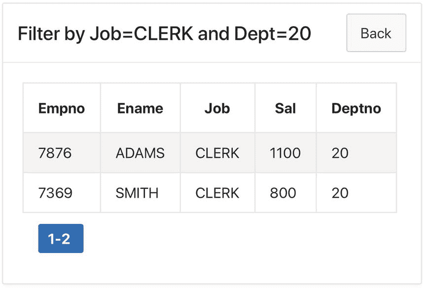

图 9-2
筛选后的员工页面

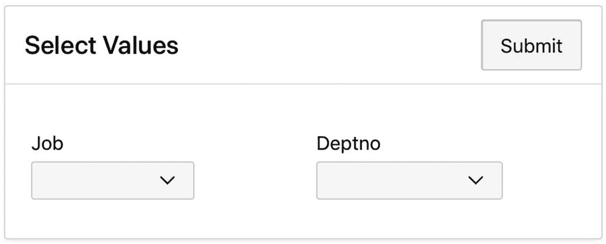

图 9-1
筛选与分支页面

让我们研究如何实现这些页面。`筛选与分支` 页面将是 `员工演示` 应用程序的第 22 页。其区域标题为 `选择值`，类型为 `静态内容`。它有两个选择列表，分别名为 `P22_JOB` 和 `P22_DEPTNO`。这些选择列表的值列表由与第 6 章相同的 SQL 查询指定。具体来说，`P22_JOB` 的查询是

```
select distinct Job as DisplayVal, Job as ResultVal
from EMP
order by DisplayVal
```

而 `P22_DEPTNO` 的查询是

```
select DName, DeptNo
from DEPT
order by DName
```

`筛选后的员工` 页面是演示的第 23 页，其区域是一个经典报告。其源查询（与您在 第 6 章看到的也相似）如下：

```
select EmpNo, EName, Job, Sal, DeptNo
from EMP
where (:P22_JOB is null  or  Job = :P22_JOB)
and   (:P22_DEPTNO is null  or  DeptNo = :P22_DEPTNO)
order by EName
```

每个页面都有一个按钮。`筛选与分支` 页面上的 `提交` 按钮将执行提交操作，以将其两个项值保存在会话状态中。`筛选后的员工` 页面上的 `返回` 按钮可以直接重定向回第 22 页，因为它不需要提交。
`筛选与分支` 页面将在导航菜单中有一个条目。而 `筛选后的员工` 页面则不会，因为访问该页面的唯一方式应该是通过 `筛选与分支` 页面。这种情况是普遍存在的——当一个交互被分解到多个页面时，通常只有交互的第一页可以从导航菜单访问。
还有两个尚未讨论的实现问题：如何自定义 `筛选后的员工` 页面的区域标题，以及如何让第 22 页在提交时重定向到第 23 页？每个问题将依次讨论。
首先考虑 `筛选后的员工` 区域。使用单独页面进行输出的一个缺点是输入不再可见。图 9-2 中的设计策略是在区域的标题栏中重述输入。让我们研究如何实现此功能。
回想一下，区域的 `标题` 属性是 HTML 代码。虽然 HTML 代码无法执行计算，但它可以引用项的值。因此，技术是编写一个过程来计算区域标题并将其保存在一个隐藏项中。清单 9-1 给出了该过程的代码。此代码考虑了两个项为空或不为空的四种情况，适当地计算区域标题，并将其保存在隐藏项 `P23_REGION_TITLE` 中。


## 9.1 分支

## 代码清单 9-1
自定义“筛选的员工”区域的标题

```
declare
v_title varchar(100);
begin
if :P22_JOB is not null and :P22_DEPTNO is not null
then
v_title := 'Job=' || :P22_JOB  || ' and Dept=' || :P22_DEPTNO;
elsif :P22_JOB is not null then
v_title := 'Job=' || :P22_JOB;
elsif :P22_DEPTNO is not null then
v_title := 'Dept=' || :P22_DEPTNO;
else
v_title := 'All Employees';
end if;
:P23_REGION_TITLE := 'Filter by ' ||  v_title;
end;
```

这个过程属于页面 22，并且取决于`Submit`按钮。`Filtered Employees`区域的 HTML 表达式随后变为对那个隐藏项目的引用。具体来说，区域标题是 HTML 表达式“`&P23_REGION_TITLE.`”。注意，该表达式使用替换字符串语法来引用该项目。

## 创建分支

要让页面 22 重定向到页面 23，你需要创建一个*分支*对象。分支对象类似于过程，因为它也是响应提交而执行操作。区别在于过程执行代码，而分支重定向到某个页面。分支通常在所有过程执行完毕后最后执行。

创建分支与创建过程类似。首先转到页面设计器的`Processing`选项卡。右键单击标记为`After Processing`的节点，然后选择`Create Branch`。APEX 将创建一个未命名的分支，其属性如图 9-3 所示。

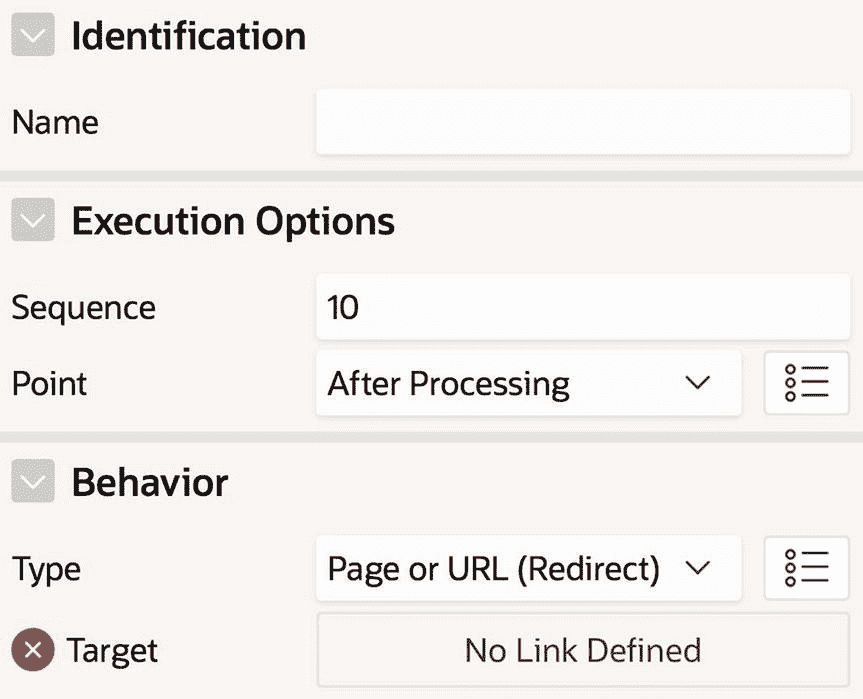
图 9-3
新创建分支的属性

你应该为分支命名。但还需要做什么呢？图 9-3 中显示的两个重要属性是`Point`和`Type`；它们的默认值指定该分支将在所有进程之后执行，并重定向到指定的页面或 URL。这些默认值几乎总是你想要的，你应该保持它们不变。

唯一需要你关注的属性是`Target`。此属性显示错误，表明你需要指定分支的目标。点击该属性的`Target`属性会打开`Link Builder`向导。图 9-4 显示了该向导，配置为重定向到页面 23。

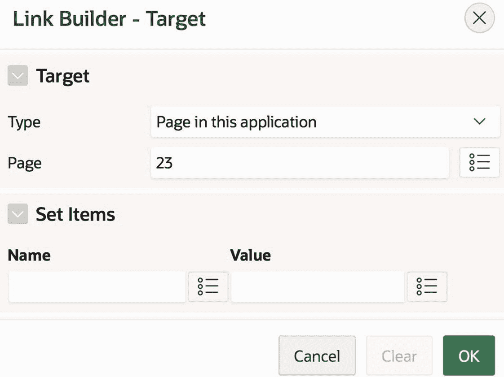
图 9-4
使用链接构建器指定分支目标

分支还有一个`Server-side Condition`部分，用于指定何时执行分支。与过程类似，每个分支通常关联一个按钮，你在`When Button Pressed`属性中指定该按钮。`Filter and Branch`演示页面中的分支应该与`Submit`按钮关联，并且没有其他条件。

## 条件分支

在第 7 章中，你创建了`Employee Data Entry`页面（如图 7-5 所示）和`Single Row Update`页面（如图 7-24 所示）。这些页面具有相似的功能——它们都允许用户插入、删除和更新`EMP`表——但它们使用截然不同的界面来实现。特别是，`Employee Data Entry`页面非常宽泛；它同时显示所有报告和更新区域。另一方面，`Single Row Update`页面很紧凑，一次只显示一个区域。

让我们构建一个帮助用户决定使用哪个页面的页面。这个页面称为`Preference Chooser`，是演示应用程序的第 24 页，如图 9-5 所示。该页面有一个区域，向用户提出两个问题。用户回答这些问题并点击按钮；如果第一个答案是`No`或第二个答案是`Yes`，按钮将分支到页面 17（`Employee Data Entry`页面），否则分支到页面 21（`Single Row Update`页面）。

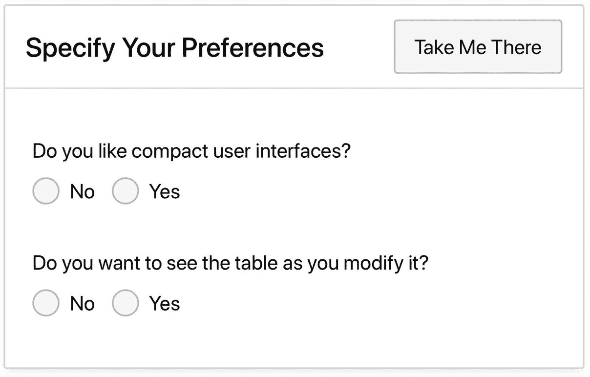
图 9-5
带有条件分支的页面

你可以如下实现此页面：两个单选按钮组名为`P24_COMPACT`和`P24_SEE_TABLE`，具有静态值列表{`No`, `Yes`}。

该按钮执行提交操作。直观上，你可能会认为按钮决定分支到哪个页面。但分支的工作方式并非如此；相反，你需要创建两个分支对象，每个对象都以该按钮为条件。每个分支还将有一个额外的条件。重定向到页面 17 的分支对象具有以下条件：

```
:P24_COMPACT = 'No' or :P24_SEE_TABLE = 'Yes'
```

重定向到页面 21 的分支对象具有以下条件：

```
:P24_COMPACT = 'Yes' and :P24_SEE_TABLE = 'No'
```

当按钮执行提交时，只有一个条件会被满足。满足条件的分支将执行其重定向。

## 向导式界面

分支的最后一个例子也与数据输入问题相关。在第 7 章的每个数据输入页面中，用户通过在某些项目中输入所需值然后点击插入按钮来创建新记录。这样的设计假设用户手头有这些值。另一种设计是创建一系列页面，引导用户完成数据输入过程，就像 APEX 中的向导一样。该设计将包含四个页面。

用户将从`Basic Info`页面开始（参见图 9-6），输入新员工的姓名、职位、部门和工资。最常见的情况是员工在当天被雇用，因此有一个针对该情况的复选框。然后用户点击`Continue`按钮提交页面。

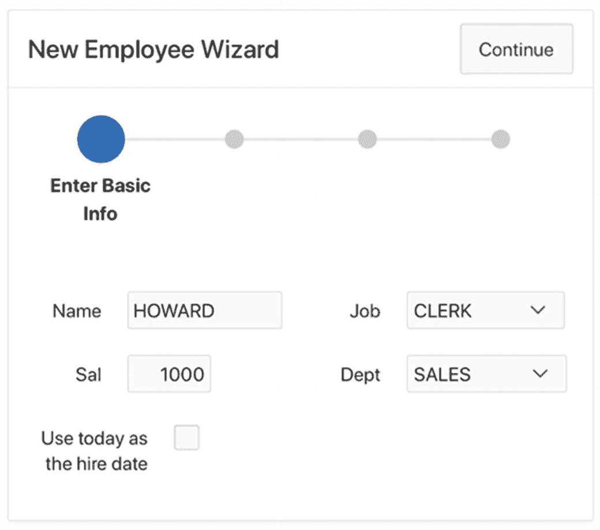
图 9-6
输入基本信息

下一步是确定员工的经理。假设公司按如下方式为员工分配经理：总裁没有经理，职位为`MANAGER`的员工向总裁汇报，其他员工（职员除外）向其部门的经理汇报。例外情况是职员。职员的经理可以是同一部门中除另一名职员外的任何员工，因此用户需要明确指定新职员的经理。

如果新员工是职员，点击`Continue`按钮将分支到`Manager Info`页面（参见图 9-7），用户在其中从选择列表中选择员工的经理。

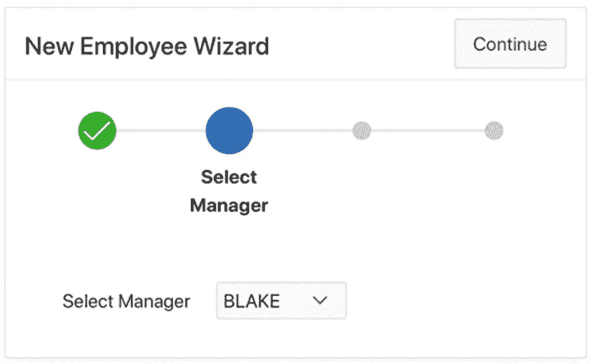
图 9-7
选择经理

如果`Basic Info`页面上的`hiredate`复选框未选中，应用程序将分支到`Hiredate Info`页面（参见图 9-8），让用户选择一个日期。此分支可能来自`Manager Info`页面或`Basic Info`页面，具体取决于员工是否是职员。选择日期后，用户点击`Continue`按钮。

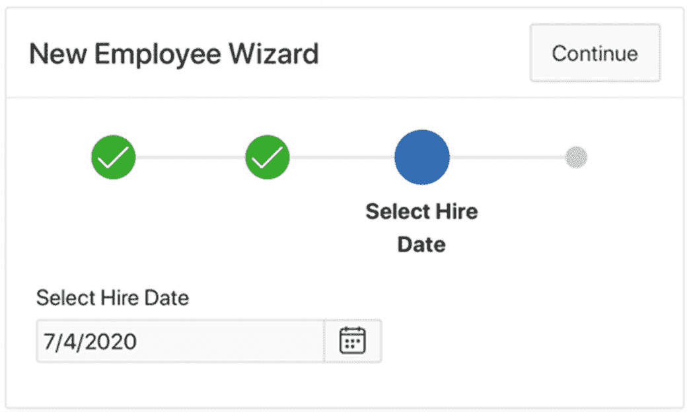
图 9-8
选择员工的雇佣日期


## 向导的最终页面是 `确认员工信息` 页面（见图 9-9），用于显示为新员工选择的值。当所有必要值都已知时，向导将分支到此页面。这个分支可能来自之前三个向导页面中的任何一个。如果新员工不是职员且选中了雇佣日期复选框，`基本信息` 页面可以直接分支到确认页面；如果选中了复选框，`经理信息` 页面可以直接分支到确认页面；而 `雇佣日期信息` 页面总是分支到确认页面。

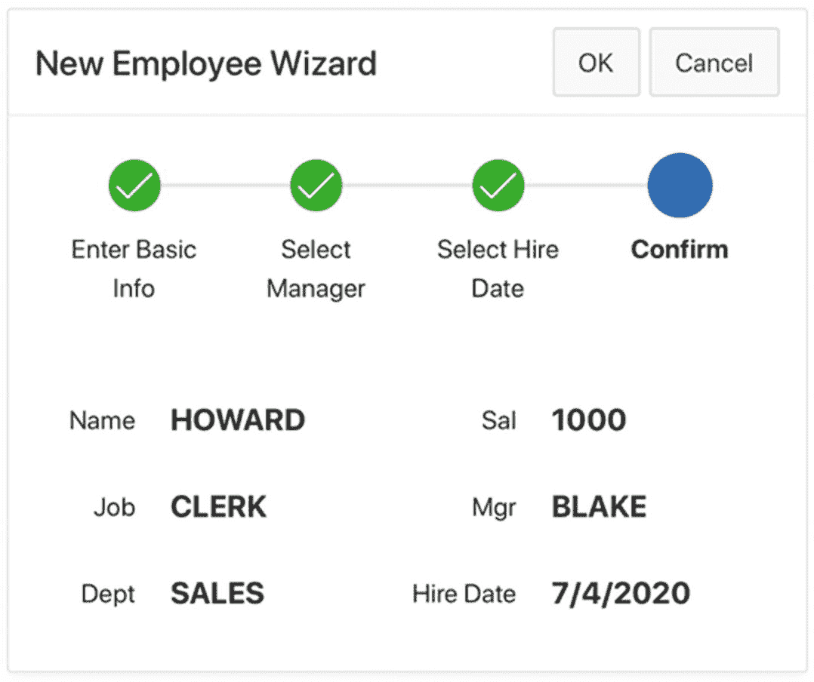

**图 9-9** 确认员工的信息

`确认员工信息` 页面有标为 `确定` 和 `取消` 的按钮。点击 `取消` 按钮将重定向到 `基本信息` 页面，并清除每个向导页面的会话状态。点击 `确定` 按钮会将新记录插入 `EMP` 表，清除每个页面的会话状态，并分支到 `基本信息` 页面。现在您已经了解了向导中的控制流，让我们来看看如何实现其各个页面。以下小节将讨论相关问题。

## 实现进度条

向导页面顶部包含彩色圆圈的区域称为进度条。进度条区域只是显示页面编号列表的一种花哨方式。这些向导页面中的每一个进度条都显示相同的列表，即包含页面编号 [25, 26, 27, 28] 的列表。进度条中的步骤名称是与这些页面编号关联的标签。

要在 `新员工向导` 页面中创建进度条，您首先需要创建它们的公共列表。然后可以在每个页面上创建一个进度条区域。将该列表命名为 `新员工向导`；要创建它，请使用您在第 4 章学到的技术。该列表将为四个（尚未创建的）向导页面各包含一个条目，如图 9-10 所示。

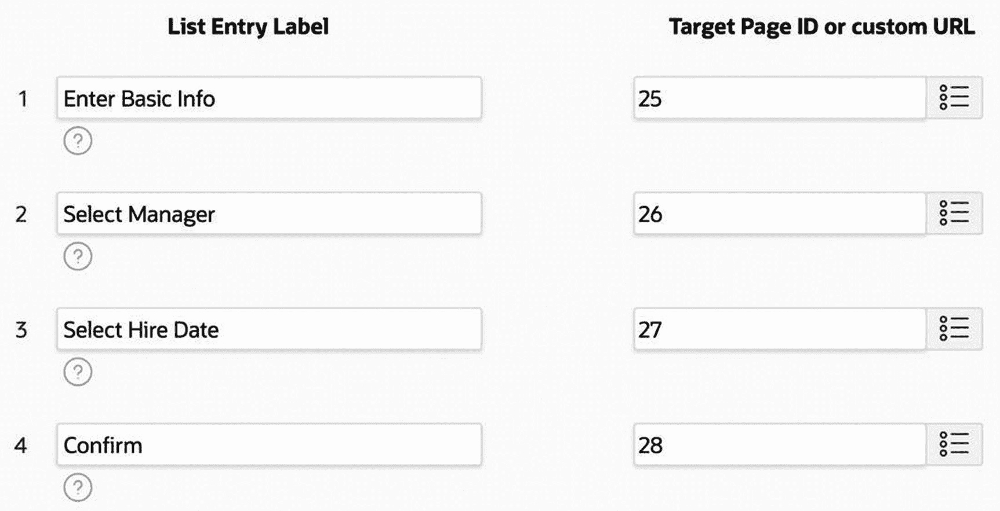

**图 9-10** 新员工向导列表的条目

然后创建向导页面。首先创建四个编号为 25–28 的空白页面。然后为每个页面创建一个类型为 `列表` 的区域，其源是列表 `新员工向导`。图 9-11 显示了该区域的 `属性` 属性。特别是，要将列表区域显示为进度条，您只需将其 `列表模板` 属性设置为 `向导进度`。

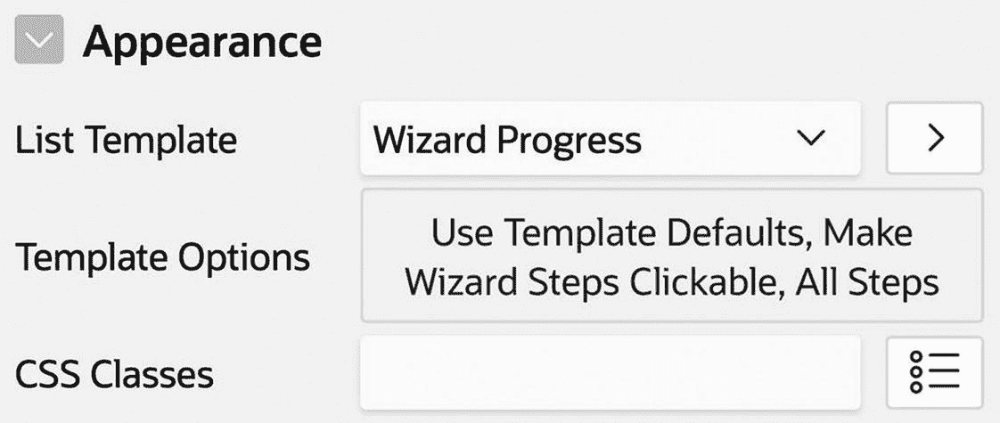

**图 9-11** 列表区域属性

将列表区域添加到所有四个页面后，从页面编辑器单独运行每个页面。您应该会观察到，根据页面在列表中的位置，页面显示进度条的方式会有所不同。

### 自定义进度条

您可以通过点击图 9-11 中的 `模板选项` 属性来自定义向导进度条的外观。图 9-12 显示了生成的对话框。`使向导步骤可点击` 复选框配置进度条，使其每个圆圈都是一个链接——点击圆圈将分支到与其步骤对应的页面。另一个选项是 `标签显示`，它允许您指定进度条是应显示所有步骤的标签还是仅当前步骤的标签（或不显示标签）。例如，图 9-6 到 9-8 中的进度条仅显示当前步骤，而图 9-9 显示了所有步骤。默认情况下，进度条显示所有步骤，如图 9-12 所示。

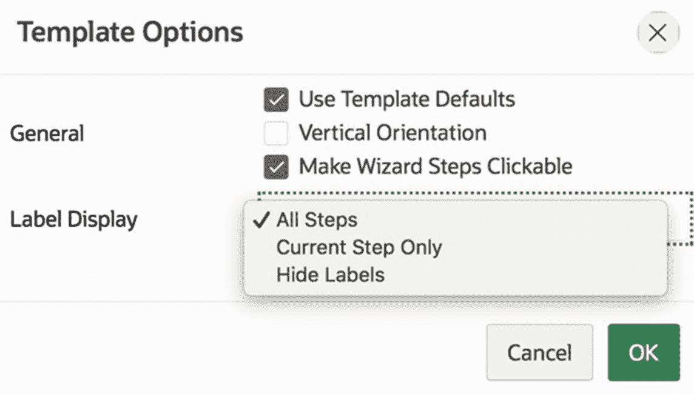

**图 9-12** 进度列表的模板选项

### 基本信息页面

`基本信息` 页面有五个项目：`P25_NAME` 是文本字段，`P25_SAL` 是数字字段，`P25_JOB` 和 `P25_DEPTNO` 是选择列表。这些选择列表的值列表查询与之前的页面相同：`P25_JOB` 的列表是

```sql
select distinct Job as DisplayVal, Job as ResultVal
from EMP
order by DisplayVal
```

而 `P25_DEPTNO` 的列表是

```sql
select DName, DeptNo
from DEPT
order by DName
```

项目 `P25_HIRED_TODAY` 是一个复选框组，具有单一静态值 [, `Yes`]。也就是说，显示值是一个空格，返回值是 `Yes`。回想一下，复选框组是一个多值项目，因此如果选中，其值将为 `Yes`，否则为 `null`。

`继续` 按钮执行提交操作。在此提交过程中，需要发生几件事：

*   如果新员工不是职员，页面需要计算该员工的经理。
*   如果雇佣日期复选框被选中，页面需要将员工的雇佣日期设置为今天。
*   页面需要确定它应该分支到其他三个向导页面中的哪一个。

#### 计算经理（ComputeManager 进程）

第一个要点要求您编写一个进程来计算非职员的经理。将此进程命名为 `ComputeManager`。其 PL/SQL 代码如清单 9-2 所示。

```plsql
begin
case :P25_JOB
when 'PRESIDENT' then   -- the president has no manager
    :P26_MGR := null;
when 'MANAGER' then   -- a manager's manager is the president
    select EmpNo into :P26_MGR
    from EMP
    where Job = 'PRESIDENT';
else   -- the employee's manager is the manager of the dept
    select EmpNo into :P26_MGR
    from EMP
    where DeptNo = :P25_DEPTNO and Job = 'MANAGER';
end case;
end;
```

**清单 9-2** ComputeManager 进程的 PL/SQL 代码

`ComputeManager` 进程根据 `P25_JOB` 的值以三种方式之一计算其值。在每种情况下，它都将计算出的值赋给 `P26_MGR`，这将是 `经理信息` 页面上的一个项目。换句话说，此进程将值赋给 `经理信息` 页面上的项目，这样用户就不必手动输入。（编写引用尚不存在的项目的代码是可以的；您只是在该物品存在之前无法运行它。）

`ComputeManager` 进程与 `继续` 按钮相关联，并且应仅在新员工不是职员时执行。也就是说，该进程基于以下 SQL 表达式是有条件的：

```sql
:P25_JOB != 'CLERK'
```

#### 计算雇佣日期（ComputeHiredate 进程）

第二个要点也要求您编写一个进程；称其为 `ComputeHiredate`。此进程需要计算当前日期并将其赋给项目 `P27_HIREDATE`，该项目将位于 `雇佣日期信息` 页面。其 PL/SQL 代码使用 Oracle 的内置函数 `sysdate`，如清单 9-3 所示。

```plsql
begin
:P27_HIREDATE := sysdate;
end;
```

**清单 9-3** ComputeHiredate 进程的 PL/SQL 代码


## 分支对象与表单区域

### ComputeHiredate 进程与分支逻辑

`ComputeHiredate`进程也与`Continue`按钮关联。它应仅在`P25_HIRED_TODAY`框被选中时执行。也就是说，它依赖于以下 SQL 表达式的条件：

```sql
:P25_HIRED_TODAY = 'Yes'
```

第三点要求您创建三个分支对象，每个对应一个可能的目标。将这些分支命名为`GoToPage26`、`GoToPage27`和`GoToPage28`。每个分支的目标设定都很直接：目标页面分别是第 26、27 和 28 页。每个分支也与`Continue`按钮相关联。唯一的难点在于指定它们各自的条件。

`GoToPage26`分支应在用户需要选择经理时触发，因此其条件是这个 SQL 表达式：

```sql
:P25_JOB = 'CLERK'
```

`GoToPage27`分支应在用户不需要选择经理但需要选择雇佣日期时触发；因此，它的条件是这个 SQL 表达式：

```sql
:P25_JOB <> 'CLERK' and :P25_HIRED_TODAY is null
```

最后，`GoToPage28`分支应在既不需要选择经理也不需要选择雇佣日期时触发；因此，它的条件是这个 SQL 表达式：

```sql
:P25_JOB <> 'CLERK' and :P25_HIRED_TODAY = 'Yes'
```

### Manager Info 页面

现在考虑`Manager Info`页面，它有一个单独的项目`P26_MGR`。这个项目是一个选择列表，其值表示所有有资格管理文员的员工。假设文员的经理必须在同一个部门且不能是另一个文员，该项目的值列表将由以下查询定义：

```sql
select EName, EmpNo
from EMP
where DeptNo = :P25_DEPTNO and Job <> 'CLERK'
```

该页面还有一个操作是提交的`Continue`按钮。此页面不需要计算任何值，因此无需进程。但它需要决定是分支到`Hiredate Info`页面还是确认页面。因此，您需要两个分支对象，称为`GoToPage27`和`GoToPage28`。这些分支都与`Continue`按钮关联。

`GoToPage27`分支应在`P25_HIREDATE`未被选中时触发；因此，它的条件是这个 SQL 表达式：

```sql
:P25_HIRED_TODAY is null
```

反之，`GoToPage28`分支应在`P25_HIREDATE`被选中时触发；因此，它的条件是这个 SQL 表达式：

```sql
:P25_HIRED_TODAY = 'Yes'
```

### Hiredate Info 页面

现在考虑`Hiredate Info`页面。它有一个名为`P27_HIREDATE`的`Date-Picker`项目用于存放雇佣日期，一个操作是提交的`Continue`按钮，以及一个基于该按钮条件的指向`Confirm Employee Info`页面的分支。提交页面会使 APEX 将所选日期保存在会话状态中并执行分支。

### Confirm Employee Info 页面

最后，考虑`Confirm Employee Info`页面。它的六个项目都是`Display Only`类型，其值只是从其他页面的项目中复制而来。例如，考虑员工的姓名，它位于项目`P28_NAME`中。其源类型是`PL/SQL Expression`，并具有以下值：

```sql
:P25_NAME
```

项目`P28_SAL`和`P28_JOB`的源表达式类似。`P28_HIREDATE`的源表达式是

```sql
:P27_HIREDATE
```

指定`P28_MGR`和`P28_DEPTNO`的源表达式需要多做一点工作。考虑`P28_MGR`。如果它的源仅仅是`P26_MGR`的值，页面将显示经理的员工编号。然而，回顾图 9-9，可以看到页面显示的是经理的姓名，这对用户来说更容易理解。类似地，`P28_DEPTNO`显示部门名称，尽管`P25_DEPTNO`的值是部门编号。

要使`P28_MGR`显示经理的姓名，请将其源设置为`SQL query (return single value)`，并使用以下查询：

```sql
select EName
from EMP
where EmpNo = :P26_MGR
```

类似地，`P28_DEPTNO`的源是这个 SQL 查询：

```sql
select DName
from DEPT
where DeptNo = :P25_DEPTNO
```

#### 按钮与 InsertRecord 进程

`Confirm Employee Info`页面有两个按钮。`Cancel`按钮重定向到`Basic Info`页面并清除四个向导页面的缓存。点击该按钮的 Target 属性会打开链接构建器，您可以在其中指定重定向的详细信息。图 9-13 显示了我的`Cancel`按钮的链接构建器值。`Clear Cache`属性包含应清除其项目值的那些页面的页面编号。

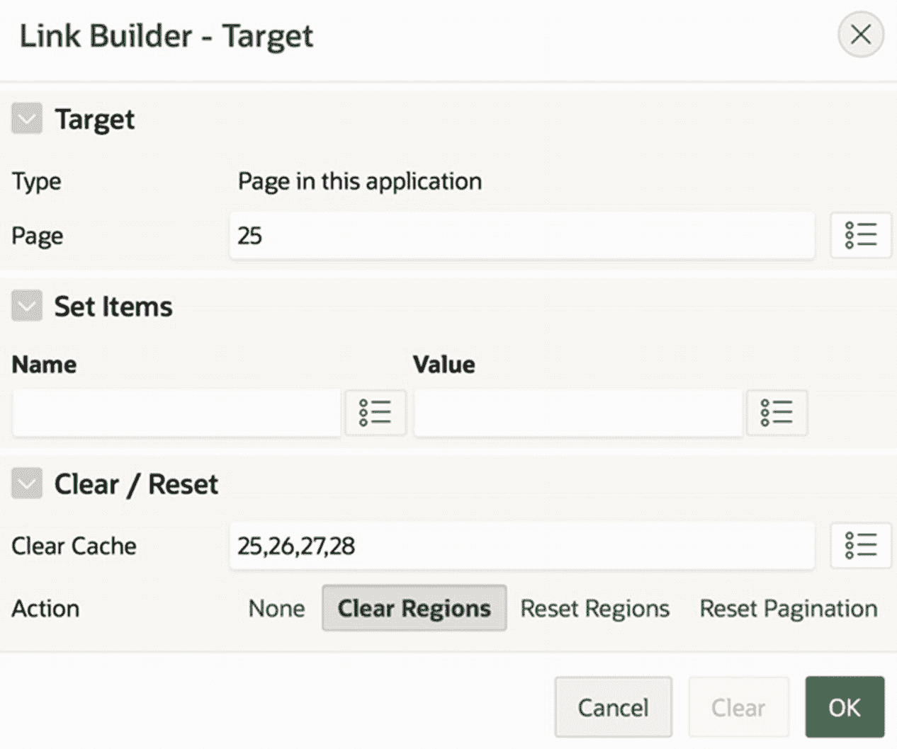
*图 9-13 取消按钮的链接构建器值*

`Continue`按钮执行提交操作。该按钮有一个关联的进程，称为`InsertRecord`，它将把新的员工记录插入到`EMP`表中。此进程的代码与第 7 章的代码类似，并出现在清单 9-4 中。

```plsql
begin
insert into EMP (EName, Job, Sal, DeptNo,
Mgr, HireDate, Comm, Offsite)
values (:P25_NAME, :P25_JOB, :P25_SAL, :P25_DEPTNO,
:P26_MGR, :P27_HIREDATE, 0, 'N');
end;
```
*清单 9-4 InsertRecord 进程的 PL/SQL 代码*

回想一下，插入发生后，页面应清除这四个向导页面并重定向到第一个页面。为此，创建一个名为`GoToPage25`的分支对象，它以`OK`按钮为条件。使用链接构建器指定分支的操作，其外观将与图 9-13 完全相同。

## 总结

本章探讨了分支对象并给出了一些使用示例。分支在提交操作期间执行，在验证和进程之后。分支有两个重要组成部分：其目标和条件。

分支的目标指定要重定向到的页面（或 URL）。您使用链接构建器指定目标，就像为按钮或链接配置重定向一样。因此，分支也可以将会话状态中的项目值赋给页面上的项目，或清除页面上的项目值。

分支的条件指定分支何时相关。一个页面根据其会话状态可能有几个目标页面。您通过为每个目标页面创建一个分支并为每个分支分配一个条件来处理这种情况。分支条件应该是非重叠的，以便在任何提交操作期间最多只有一个分支能够触发。

