# 10. 表单

第 7 章中的许多进程都涉及某些基本任务，例如根据键检索单条记录的值、查找给定记录的前后记录、更新表中的记录以及修改会话状态。

APEX 有一个区域类型，称为`Form`，它使得无需任何 PL/SQL 编程即可执行这些任务。表单区域包含两个通用进程——一个在渲染期间执行，一个在处理期间执行——您可以配置它们以满足您的许多需求。

本章探讨表单区域的使用、其进程以及 APEX 内置的一些相关进程。它还评估了一些用于创建基于表单的页面的 APEX 向导。了解如何以及何时使用 APEX 表单区域和向导，可以免除您为更常见的页面开发任务编写 PL/SQL 代码的需要。


## 表单区域

表单区域与报表区域类似，两者都有一个源查询。它们的区别在于输出记录的显示方式。报表以表格形式一次显示多条输出记录，而表单一次只显示一条记录，每个值位于一个项中。报表是只读的，但表单可以修改数据库。

回顾第 7 章，`单行视图`页面的`员工信息`区域（参考图 7-17）被用作表单，`单行更新`页面的`插入员工`和`更新/删除员工`区域（参考图 7-24）也是如此。这些区域当时的类型是`静态内容`，并使用 PL/SQL 代码来实现其功能。本节将介绍`表单`区域类型，并展示如何无需任何 PL/SQL 编码即可实现相同的功能。

图 10-1 显示了`员工演示`应用程序的第 29 页，标题为`表单视图`。该页面有一个名为`浏览员工`的区域，允许用户一次一条记录地浏览`EMP`表。该区域包含五个项。前四个项显示一个`EMP`记录的四个字段值。选择一个员工姓名会用选定记录中的值填充其他三个项。单击`上一条`（或`下一条`）按钮会移动到表中的上一条（或下一条）记录。第五个项显示字符串`6 of 14`，指示该记录在表中的位置。

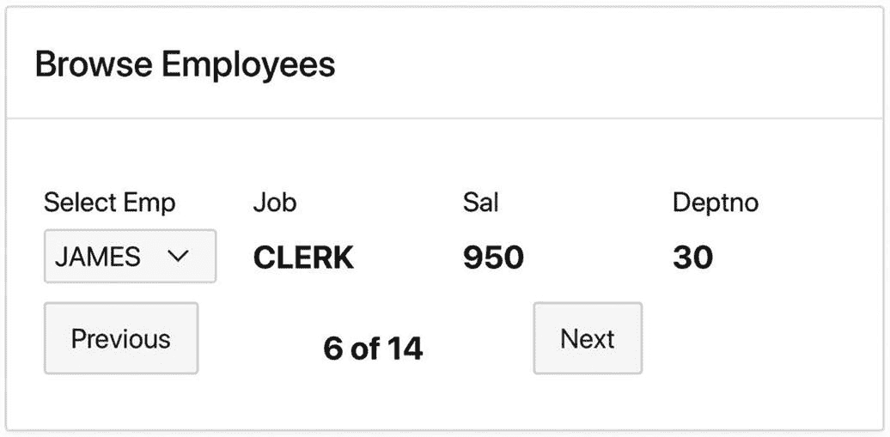

图 10-1 表单视图页面

要构建此页面，请创建一个新的空白页面，标题为`表单视图`。然后创建一个名为`浏览员工`的区域，将其类型指定为`表单`，并赋予其如图 10-2 所示的源查询。

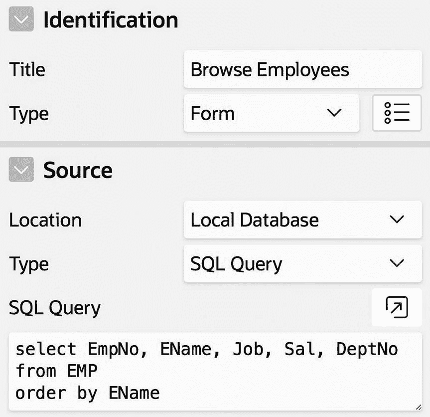

图 10-2 浏览员工区域的源

当您创建`表单`区域时，APEX 会自动为其创建一个关联的渲染过程，并为源查询中的每一列创建一个项。图 10-3 显示了创建`浏览员工`区域并设置其源之后的渲染树。

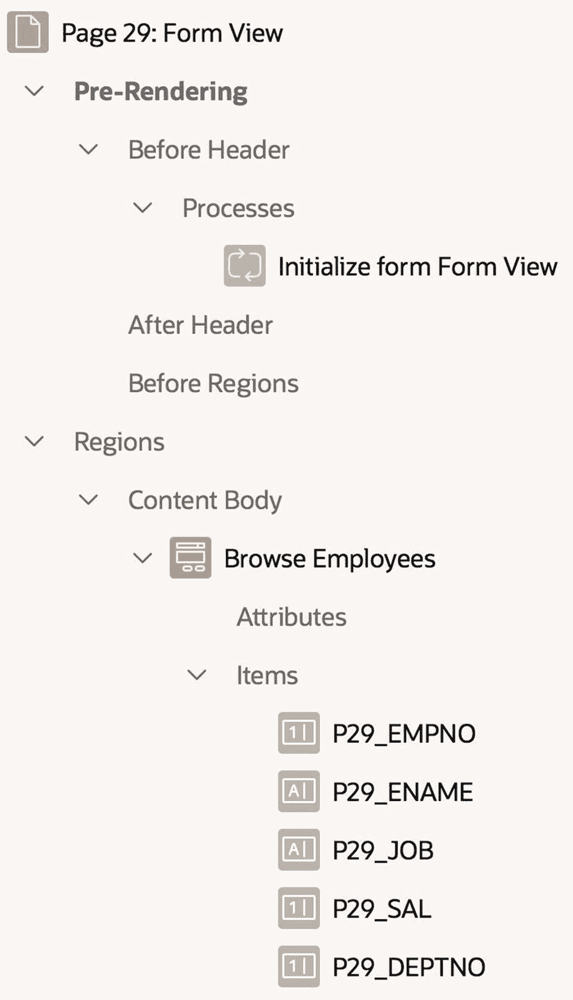

图 10-3 表单区域的渲染树

每个项的名称和类型取自相应的列定义。例如，对应于列`EmpNo`的项被命名为`P29_EMPNO`，其类型为`数字字段`。字符字段的项类型为`文本字段`，日期字段的类型为`日期选择器`，依此类推。

项的`源`部分包含指定项与其列之间对应关系的属性。图 10-4 显示了`P29_EMPNO`的`源`部分。

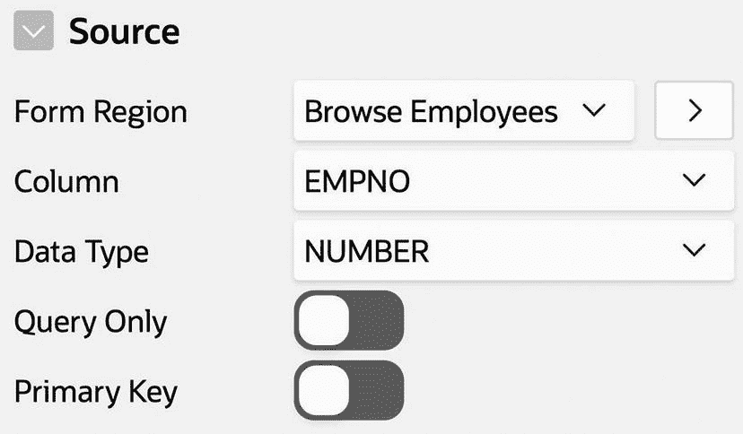

图 10-4 表单项的源属性

这些项及其属性值是在您指定表单区域的源时为您创建的。但是，有一个属性值您必须自己指定，那就是图 10-4 中显示的`主键`属性。随表单提供的渲染过程需要知道哪个项对应于主键。因此，您应该为`P29_EMPNO`开启`主键`属性。如果您忘记指定主键项，APEX 将显示错误消息提醒您。

现在您可以运行该页面了。图 10-5 显示了显示的内容。诚然，这并不十分令人印象深刻。要使此表单能够执行任何操作，您需要利用其渲染过程。

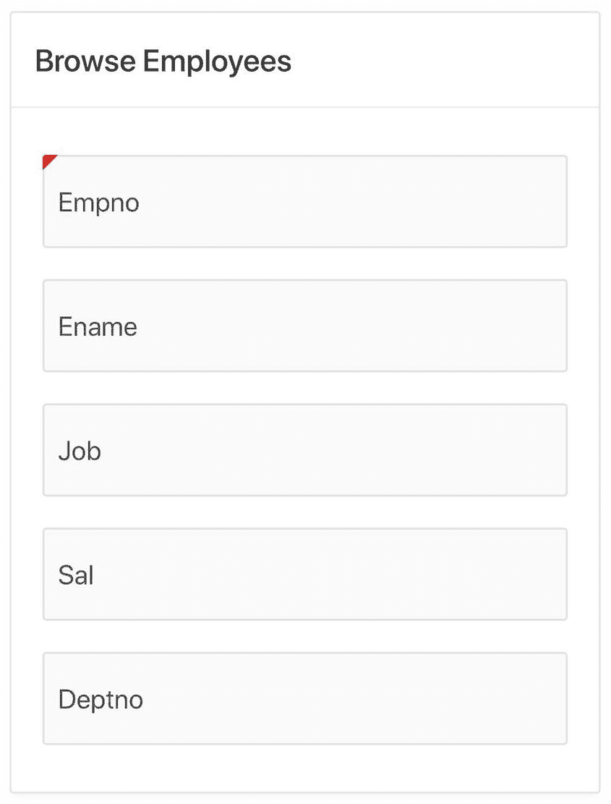

图 10-5 默认表单区域

图 10-6 显示了该渲染过程的`标识`部分。该过程的默认名称是`初始化表单 P`，其中`P`是页面名称。该过程的类型是`表单初始化`，这表明其目的是初始化表单的项。实际上，初始化过程的功能类似于清单 7-9 中的`GetEmpInfo`过程。如果页面渲染时`P29_EMPNO`的会话状态值不为空，则该过程将获取具有该员工编号的 EMP 记录，并用其初始化其他项。

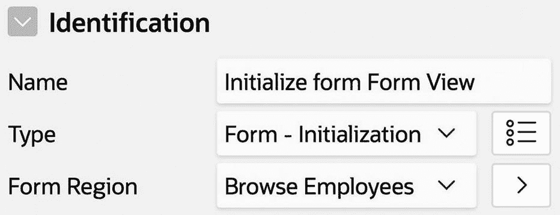

图 10-6 初始化过程的标识属性

然而，表单区域没有为您提供将`P29_EMPNO`的值放入会话状态的方法；您需要自己实现一种方法。我采用的方法是，将`P29_EMPNO`的类型更改为选择列表，其值列表查询是：

```
select EName, EmpNo
from EMP
order by EName
```

然后，我将选择列表的操作设置为`重定向并设置值`。因此，当从列表中选择员工姓名时，相应的员工编号将被分配给项`P29_EMPNO`。您应在您的页面中验证这一点。从列表中选择一个员工姓名，观察相应的员工值出现在各个项中。

初始化过程还包含上一条/下一条功能。其工作原理与图 7-18 中的`FindPreviousNext`过程相同，并增加了跟踪记录在表中位置的功能。要配置它，您需要执行以下步骤：

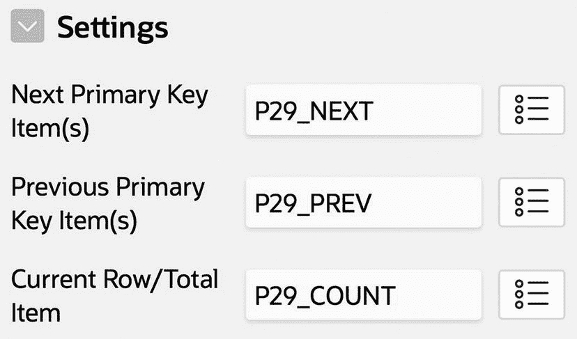

图 10-7 配置表单的初始化过程

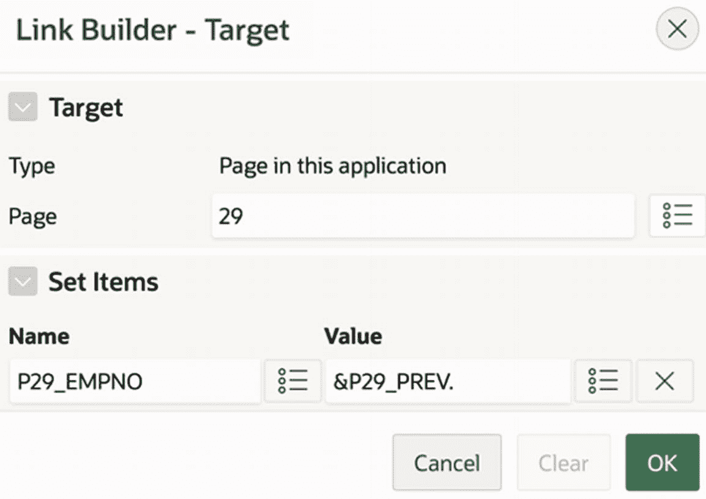

图 10-8 配置“上一条”按钮的操作

*   创建两个隐藏项来保存上一个和下一个员工编号。我将这些项命名为`P29_PREV`和`P29_NEXT`。
*   创建一个文本字段项来保存显示当前记录位置的字符串。我将此项命名为`P29_COUNT`。
*   转到初始化过程的`设置`部分，并如图 10-7 所示设置其`下一个主键项`、`上一个主键项`和`当前行/总计项`属性。
*   创建两个按钮，分别称为`上一条`和`下一条`。`上一条`按钮应重定向，将`P29_EMPNO`的值设置为`&P29_PREV.`，如图 10-8 所示。类似地配置`下一条`按钮。
*   （可选）转到`上一条`按钮的`服务器端条件`部分，并将其条件设置为 SQL 表达式`：P29_PREV is not null`。类似地配置`下一条`按钮。这会使按钮仅在适当的时候被渲染。

至此，您的页面应该已完全可用。但是，如果您像我一样，您会希望更改它的外观。这时第 5 章的技术就派上用场了。我邀请您探索不同的项类型、布局和外观属性。以下是我为达到图 10-1 效果所做的工作：


## 表单更新

表单同样可以利用其项值来修改数据库。`Employee Demo`应用程序的第 30 页将阐述相关主题。该页面名为**表单更新**，如图 10-9 所示。此页面包含两个表单区域：一个用于删除/修改现有记录，另一个用于插入新记录。以下小节将分别讨论这两个区域。

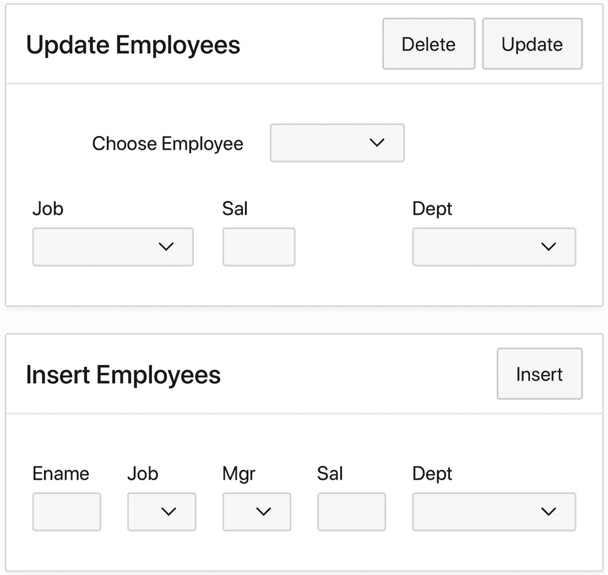

图 10-9  “表单更新”页面

### 更新记录

`更新员工`区域的工作原理如下：用户从选择列表中选取一名员工。该员工的`EMP`记录将被提取，其值用于初始化该区域的各项。随后，用户可以根据需要修改项值。点击`更新`按钮将使用这些值修改该记录。点击`删除`按钮将删除该记录。

要创建此区域，首先创建一个新的空白页面，命名为`表单更新`，页面编号为 30。然后创建一个类型为`表单`的新区域，并将其命名为`更新员工`。将数据源设置为 SQL 查询：

```sql
select EmpNo, Job, Sal, DeptNo
from EMP
```

查看生成的渲染树。APEX 已为查询中的每个字段创建了一个项，以及一个初始化过程。这与你在`表单视图`页面中遇到的情况相同。趁还未忘记，请转到`P30_EMPNO`的`数据源`属性（如图 10-4 所示），并开启其`主键`属性。

现在，你需要自定义表单以匹配图 10-9。具体而言，将`P30_EMPNO`的模板更改为`可选`，将其他三个项的模板更改为`可选-上方`。将`P30_EMPNO`、`P30_JOB`和`P30_DEPTNO`的类型更改为`选择列表`。`P30_EMPNO`的值列表查询应为：

```sql
select EName, EmpNo
from EMP
```

`P30_JOB`的查询应为：

```sql
select distinct Job as DisplayVal, Job as ResultVal
from EMP
```

而`P30_DEPTNO`的查询应为：

```sql
select DName, DeptNo
from DEPT
```

你还需要创建两个按钮，分别命名为`删除`和`更新`。它们的位置是`编辑`，操作是`提交`。此时，你的表单应能成功检索所选员工的信息。你剩下的任务是让按钮执行预期的数据库修改操作。这个结果出乎意料地简单。

表单区域修改数据库的能力默认是禁用的。要启用它，请转到表单区域的渲染树，点击其`属性`节点，并查看`编辑`部分中的`启用`属性。默认情况下，此属性是关闭的。当你开启它时，将显示其他属性，如图 10-10 所示。这些复选框允许你指定该区域应允许哪些编辑操作。`更新员工`区域执行更新和删除操作，因此你应确保只勾选了`更新行`和`删除行`。

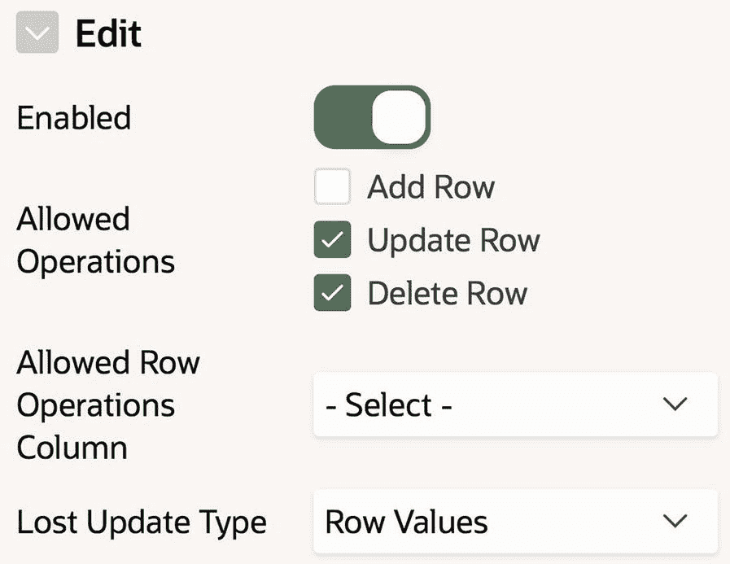

图 10-10 表单区域的编辑属性

顺便提一下，请注意图 10-10 底部的`丢失更新类型`属性。此属性允许你指定进程应如何实现丢失更新检测。其默认值为`行值`，这对应于清单 7-10 中的丢失更新检测算法。

当你在表单区域中启用编辑时，APEX 会在`处理`选项卡中添加一个进程。此进程的类型为`表单-自动行处理 (DML)`，被称为*ARP 进程*。该进程的默认名称是`处理表单 R`，其中`R`是表单区域的名称。图 10-11 显示了`更新员工`进程的`标识`属性。

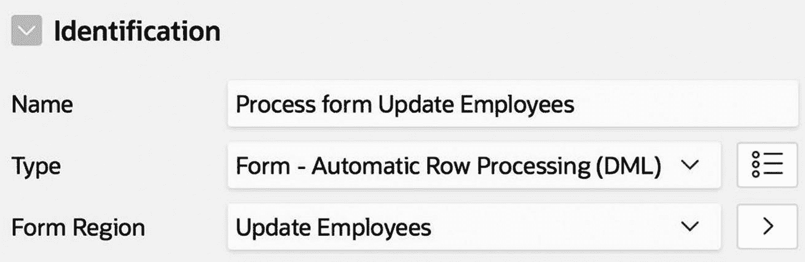

图 10-11 ARP 进程属性

ARP 进程可以响应提交操作执行插入、删除或更新操作。但给定一个特定的提交请求，它如何知道要执行哪个操作呢？

期望的操作是由发出请求的按钮的`行为`属性决定的。图 10-12 显示了`更新`按钮的这些属性。`数据库操作`属性指定了要执行三个操作中的哪一个。在图中，该值是`SQL UPDATE 操作`。`删除`按钮的设置类似——其`操作`值应为`提交页面`，其`数据库操作`值应为`SQL DELETE 操作`。

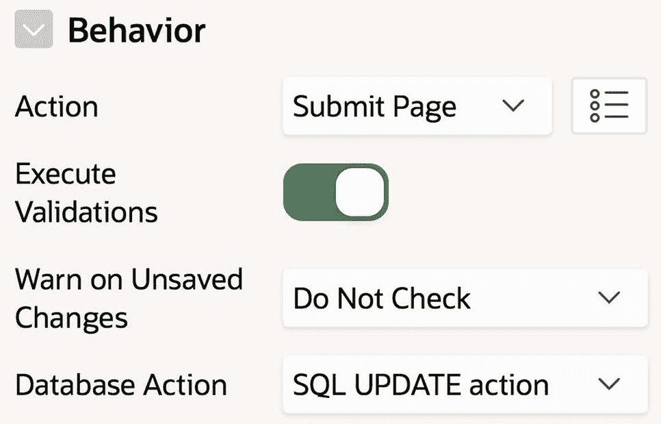

图 10-12 配置“更新”按钮的行为

ARP 进程可以有条件地执行，就像任何其他进程一样。`更新员工`区域的 ARP 进程应在点击`更新`或`删除`按钮时触发。图 10-13 显示了其`服务器端条件`属性，其中指定的 SQL 表达式是：

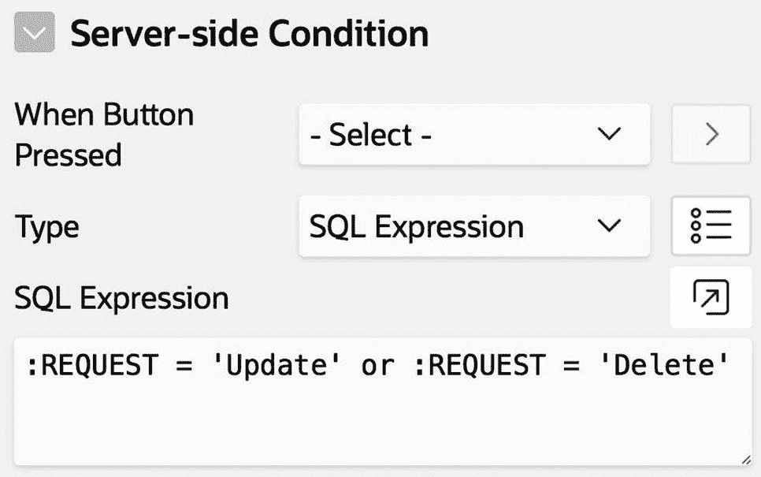

图 10-13 指定进程的条件

```sql
:REQUEST = 'Update' or :REQUEST = 'Delete'
```


## 清除会话状态

花些时间运行你的 `Form Update` 页面。选择一条记录，修改其值，然后点击 `Update` 按钮。一切应该正常工作。但是，你将发现 `Delete` 按钮存在一个问题。当你点击它时，APEX 会显示一条错误信息。问题在于删除操作后，项 `P30_EMPNO` 仍然包含被删除的员工编号。因此，在页面渲染期间，初始化过程将尝试从该不存在的记录中获取值，从而产生错误。解决方案是在删除操作发生后将 `P30_EMPNO` 设置为 null。事实上，这正是你在 Listing 7-21 所示的 `DeleteEmp` 过程的 PL/SQL 代码中所做的。

但是如何让第 30 页上的 `Delete` 按钮设置一个项的值呢？由于你无法触及内置的 ARP 进程，你唯一的选择是创建另一个进程，该进程将在删除操作发生后执行。我们称这个进程为 `ClearEmpNo`。

实现 `ClearEmpNo` 的一种方法是使用以下代码作为 PL/SQL 进程：

```
begin
:P30_EMPNO := null;
end;
```

我们这些熟悉 PL/SQL 编码的人意识到这是一个直接、简单的解决方案。但 APEX 为那些不熟悉 PL/SQL 的人提供了另一种解决方案，即 `Clear Session State` 进程类型。以下是使用方法。

将你的进程 `ClearEmpNo` 的类型更改为 `Clear Session State`。图 10-14 显示了其初始属性。`Settings` 部分的 `Type` 属性指定要清除哪些项。默认情况下，其值为 `Clear all items on the Current Page`。该属性的其他值允许你清除单个项、指定页面上的所有项或所有页面上的所有项。

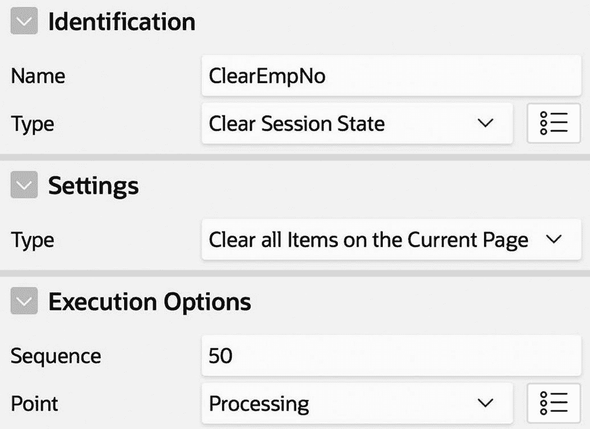

图 10-14：清除会话状态进程的属性

虽然默认值完全没问题，但将类型更改为 `Clear Items` 也是合理的。如果你这样做，那么你将能够为 `Item(s)` 属性输入明确的项名称，如图 10-15 所示。

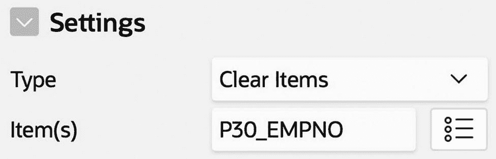

图 10-15：配置进程以清除 P30_EMPNO

无论你如何创建 `ClearEmpNo` 进程，你必须执行以下两个步骤以确保它仅在删除操作后执行：

*   你必须将其 `When Button Pressed` 属性的值设置为 `Delete`。
*   你必须将其序列值（如图 10-14 所示）设置为大于 ARP 进程的值。

## 插入记录

图 10-9 中 `Form Update` 页面的第二个区域称为 `Insert Employees`。其工作方式如下：用户将值输入到该区域的五个项中，然后点击 `Insert` 按钮。APEX 随后会将一条记录插入到 EMP 表中，对于未提及的字段使用默认值。

一个 ARP 进程只能插入出现在页面项中的值。因此，重要的是 `Insert Employees` 区域要为 `EMP` 的每个字段都有一个项。换句话说，表单的数据源应该是查询 `select * from EMP`。然后你可以隐藏那些将接收默认值的项。

当你创建具有前述数据源的表单区域时，APEX 会立即通知你一个问题。问题是其生成的几个项名称重复。生成的项的名称完全基于其对应字段的名称，因此出现在页面上多个表单中的字段名将会有多个同名的项。

幸运的是，解决方案很简单；只需重命名有问题的项。图 10-16 显示了我的策略，即为 `Insert Employees` 区域中的所有项（无论是否重复）添加“`INSERT`”。

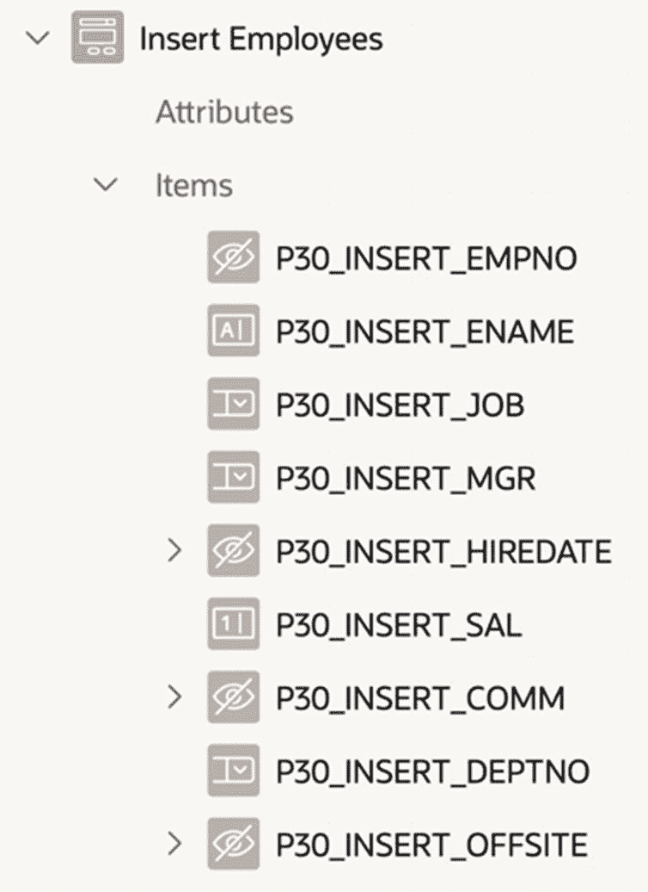

图 10-16：重命名重复项

两个初始化进程也有重复的名称。为了解决这个问题，我将每个进程重命名为其区域的名称，如图 10-17 所示。

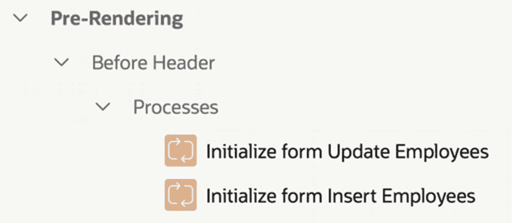

图 10-17：重命名重复的初始化进程

你现在已解决了该区域的所有问题，因此 APEX 最终将允许你保存更改。你剩余的任务与你对 `Update Employees` 表单所做的类似：

*   在 `P30_INSERT_EMPNO` 的 `Source` 部分打开 `Primary Key` 属性。
*   在 `Insert Employee Attributes` 的 `Edit` 部分打开 `Enabled` 属性。然后确保只勾选了 `Add Row` 操作。
*   创建一个名为 `Insert` 的按钮。将其 `Action` 属性配置为 `Submit Page`，并将其 `Database Action` 属性配置为 `SQL INSERT action`。
*   转到名为 `Process form Insert Employees` 的 ARP 进程的属性编辑器，并将其 `When Button Pressed` 属性的值设为 `Insert`。
*   根据你的喜好设置项的格式和布局。

如果你尝试使用新的区域，你将发现另一个问题，即表单期望你始终为 `P30_EMPNO` 和 `P30_INSERT_EMPNO` 提供值。当 `Update Employees` 是唯一区域时，这个要求是合适的，因为没有员工编号，`Delete` 和 `Update` 操作没有意义。但当按下 `Insert` 按钮时，`P30_EMPNO` 可以（也应该）是 `null`。同样，当按下 `Delete` 和 `Update` 按钮时，`P30_INSERT_EMPNO` 应该为 null。因此，你需要禁用这两个项在 `Validation` 部分的 `Value Required` 属性。

`Insert` 操作将新员工编号放入 `P30_INSERT_EMPNO`。尽管该项是隐藏的，但其值可以作为 ARP 进程的 `Success Message` 属性的一部分，如图 10-18 所示。

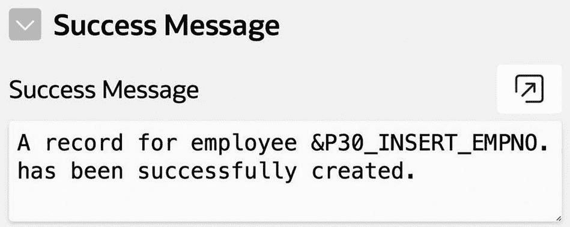

图 10-18：改进 Insert 按钮的成功消息

## 计算

图 10-9 所示的 `Insert Employees` 区域仅显示 `EName`、`Job`、`Salary` 和 `DeptNo` 列的项；`HireDate`、`Comm` 和 `Offsite` 的项是隐藏的。其想法是这些隐藏项将包含默认值——特别是，`P30_INSERT_HIREDATE` 将包含当前日期，`P30_INSERT_COMM` 将为 `0`，`P30_INSERT_OFFSITE` 将为 `'N'`。ARP 进程在执行插入操作时将使用这些项的值。

那么，问题是如何将默认值放入隐藏项中。答案是使用 APEX *计算*。计算是一种页面组件，它为某个项赋值。其思路是为每个需要默认值的项创建一个计算，并安排这些计算在 ARP 进程执行之前执行。这样，计算出的值将成为会话状态的一部分，ARP 进程在创建新记录时将使用它们。


### Form Update 页面的计算

`Form Update` 页面对三个需要默认值的项分别进行了计算。图 10-19 展示了页面设计器中的 `Processing` 选项卡，其中列出了这三项计算。请注意，计算的执行点是 `After Submit`，这意味着它们将在任何其他过程之前执行。
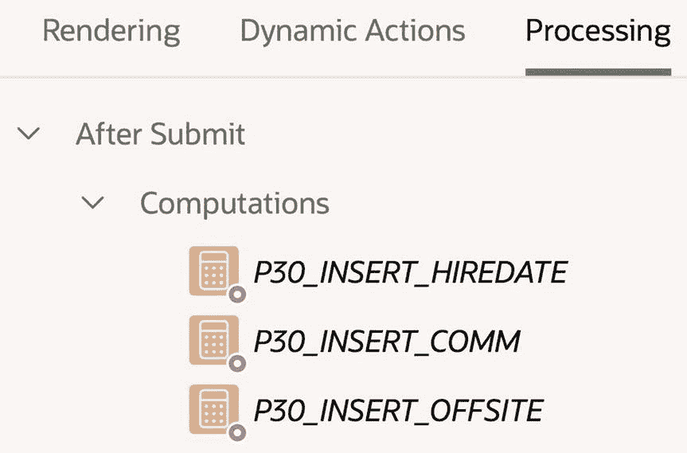
图 10-19 为 Form Update 页面添加三项计算

要创建新计算，请右键单击图 10-19 中的 `After Submit` 节点，然后选择 `Create Computation`。接着，您需要为其 `Identification` 和 `Computation` 部分指定属性。图 10-20 展示了 `P30_INSERT_HIREDATE` 计算的属性值。`Identification` 部分包含属性 `Item Name`，您需要在此指定目标项。`Computation` 部分包含属性 `Type`，您需要在此指定如何计算项的值。在图 10-20 中，类型是 `SQL Expression`，而表达式仅仅是调用了 SQL 函数 `current_date`。
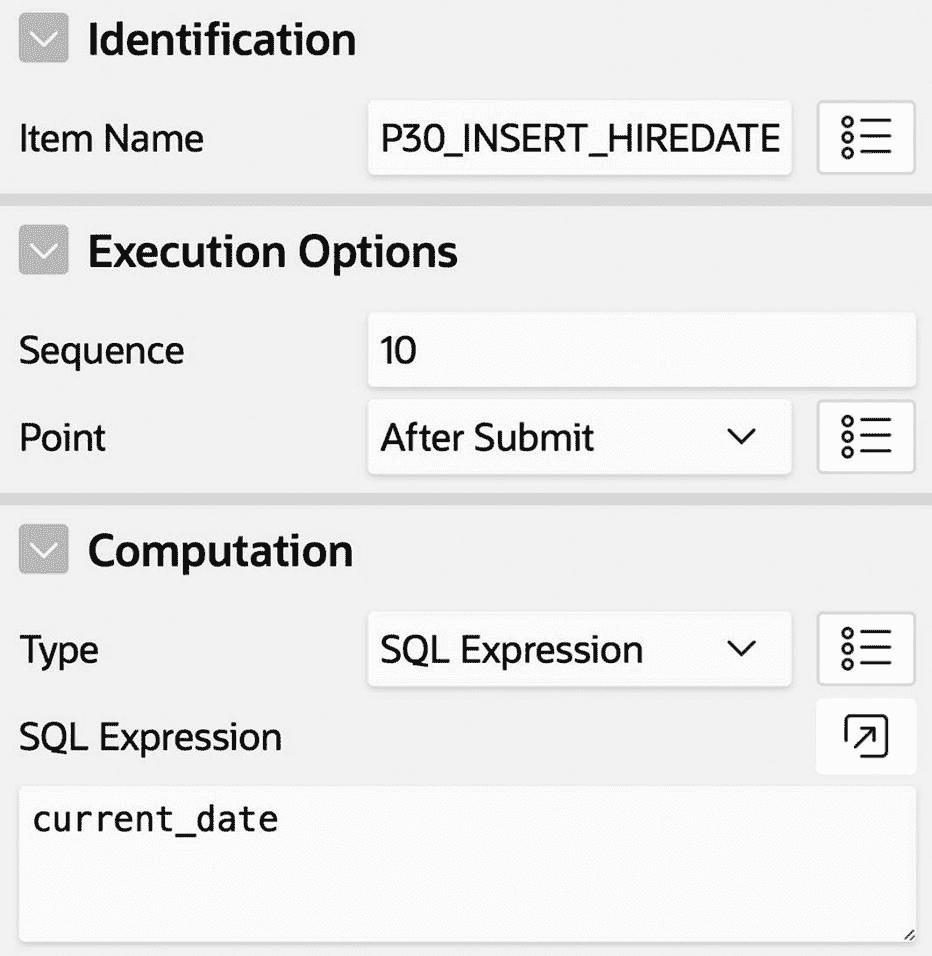
图 10-20 HireDate 计算的属性

另外两项计算的创建方式类似。指定常量的最简单方法是使用 `Static Value` 类型，但您也可以使用 SQL 表达式来指定。

除了创建三项计算，您也可以通过一个 PL/SQL 过程实现相同的效果，如代码清单 10-1 所示。该过程的执行点与计算一样，都是 `After Submit`。
```
begin
P30_INSERT_HIREDATE := current_date;
P30_INSERT_COMM := 0;
P30_INSERT_OFFSITE := 'N';
end;
```
代码清单 10-1 等同于三项计算的 PL/SQL 代码

我特意在图 10-9 中隐藏了项 `P30_INSERT_HIREDATE`、`P30_INSERT_COMM` 和 `P30_INSERT_OFFSITE`，以防止用户更改其默认值。另一种设计选项是显示这些项，并已填入默认值。用户可以将这些值视为建议，如果需要可以进行修改。此选项意味着计算值应在页面渲染期间分配给这些项，而不是在提交之后。实现此选项非常简单。您只需取消隐藏这些项，并将三项计算（或其等效的 PL/SQL 过程）的执行点更改为 `After Header`。

### 发送电子邮件

回顾第 7 章，`Revised Employee Data Entry` 页面有一个名为 `SendSuspiciousEmail` 的过程，其作用是在发生可疑的数据库删除和更新时发送电子邮件。该过程的代码出现在代码清单 7-14 中。它是用 PL/SQL 编写的，并利用了 `apex_mail.send` 库函数。
APEX 提供了 `Send E-Mail` 过程类型，使您无需编写 PL/SQL 代码即可发送电子邮件。本节将展示如何使用此过程实现与代码清单 7-14 相同的功能。

为页面 30 创建一个新过程。将其命名为 `SendSuspiciousEmail`，类型设置为 `Send E-Mail`。在属性编辑器中，找到 `Settings` 部分。您需要为属性 `From`、`To`、`Subject` 和 `Body Plain Text` 指定值。图 10-21 展示了我如何输入这些值。（如果您想测试该过程，请务必使用您自己的电子邮件地址作为收件人。）
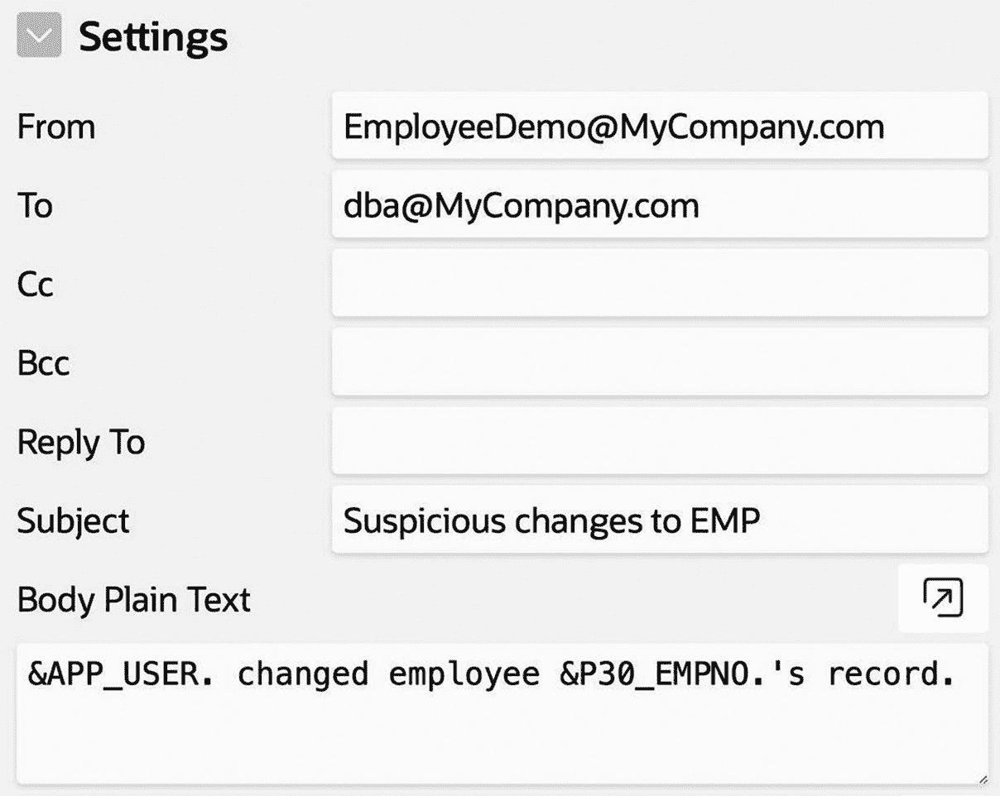
图 10-21 Send E-Mail 过程的属性

正文文本利用了 `APP_USER` 变量和项 `P30_EMPNO` 来标识用户和受影响的员工编号。此行为与代码清单 7-14 中的相同，除了一点——邮件正文没有指明操作是删除还是更新。代码清单 7-14 通过 PL/SQL 代码内的 if 语句实现了此功能。当您使用 `Send E-Mail` 类型的过程时，如何实现相同的功能呢？

技巧是首先创建一个隐藏项来保存您需要计算的值，然后为其创建一个计算。例如，我的隐藏项名为 `P30_EMAIL_OP`。图 10-22 展示了其计算的相关属性。然后，我将 `SendSuspiciousEmail` 过程中的 `Body Plain Text` 属性的值更改为以下表达式：
```
&APP_USER. &P30_EMAIL_OP. employee &P30_EMPNO.'s record.
```
例如，由此表达式可能生成的电子邮件消息可能是
```
boris@secret.org deleted employee 7839's record.
```
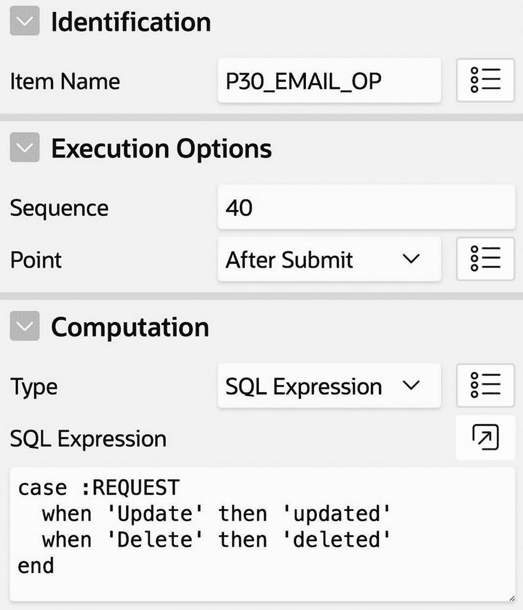
图 10-22 用于识别请求的计算

最后，您需要指定 `SendSuspiciousEmail` 过程何时执行。其服务器端条件应指定何谓对数据库的“可疑”更改。我选择使用与图 7-16 所示的相同条件。此外，必须选择该过程的序列号，使其在数据库操作之后执行，但在 `ClearEmpNo` 过程从 `P30_EMPNO` 中清除已删除的员工编号之前执行。

## 包含表单的报表页面

APEX 的 `Form` 区域自动为您生成项，并提供了两个强大的内置过程，这比您必须编写可比的项和 PL/SQL 过程节省时间。然而，您仍然需要创建和配置额外的按钮和项。为了进一步简化您的工作，APEX 提供了用于创建预制表单页面的向导。您将信息输入向导，它会创建必要的区域、项、按钮和过程。如果您需要这些向导生成的内容，它们可以成为有效的捷径。

这些向导的列表可以从图 2-9 的初始 `Create Page` 屏幕开始找到。不要点击通常的 `Blank Page` 图标，而是选择 `Form` 图标。APEX 将显示如图 10-23 所示的屏幕，其中包含与表单相关的向导图标。`Report with Form` 向导是一个很好的说明性示例，所以我们从它开始。
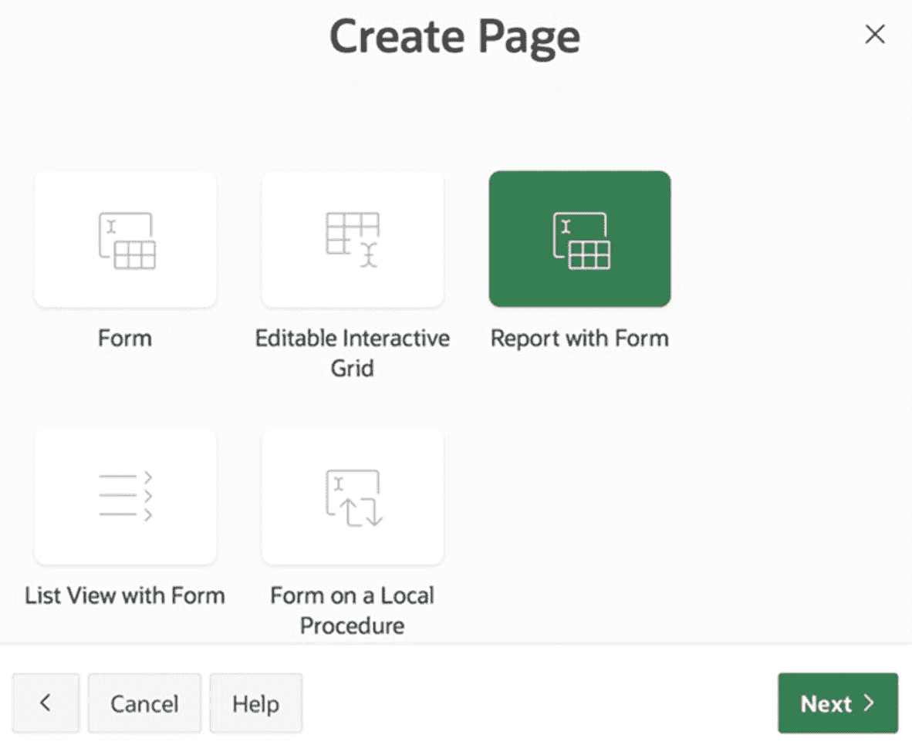
图 10-23 用于创建表单页面的 APEX 向导

一个 `Report with Form` 页面实际上是两个页面——一个报表页面和一个表单页面。它的工作方式类似于图 7-24 中的 `Single Row Update` 页面，但报表和表单位于两个单独的页面上，而不是位于同一页面的不同区域中。


## 使用报表与表单向导

### 向导界面

点击图 10-23 中的 `Next` 按钮，将显示第一个 `Report with Form` 向导屏幕，如图 10-24 所示。`Report Type` 属性要求您指定报表应为交互式报表、交互式网格（将在第 11 章讨论）还是经典报表；我选择了 `Classic Report`。

接下来的四个属性要求您提供报表页面和表单页面的页码和名称。在我的应用程序中，报表在第 31 页，表单在第 32 页。最后，您需要指定表单页面是正常显示还是作为模态对话框显示。（模态页面在第 2 章末尾讨论过；参见图 2-15。）我在图中选择了 `Normal`，但 `Modal Dialog` 也很有趣且值得尝试。

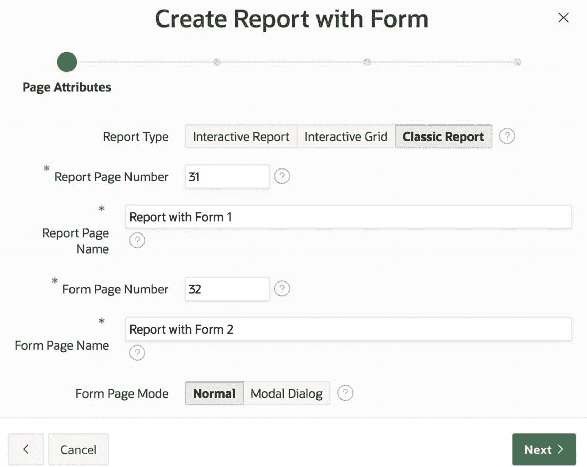

**图 10-24 创建包含表单页面的报表**

点击 `Next` 按钮将带您进入第二个向导屏幕，如图 10-25 所示。此屏幕要求您提供一个同时用于报表和表单的数据源。如果您打算使用表单进行插入，那么源将需要包含整个表，如图所示。在这种情况下，向导屏幕还允许您指定要在报表中显示的列。

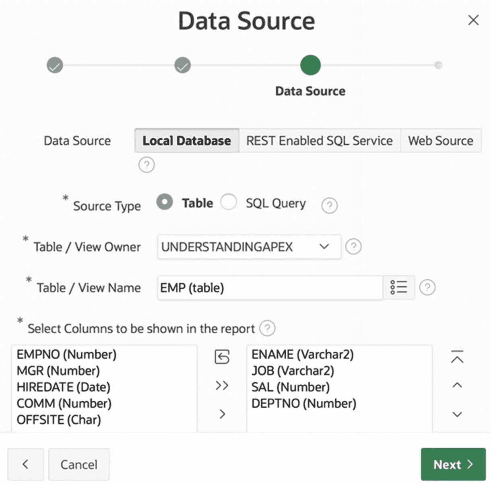

**图 10-25 输入报表和表单的源查询**

第三个屏幕（未显示）是您指定报表页面的导航菜单项的地方。请注意，表单页面没有菜单项，因为它应该只能通过其报表页面访问。

第四个屏幕，如图 10-26 所示，允许您指定要在表单中显示的源列。它还强制您指定主键列。

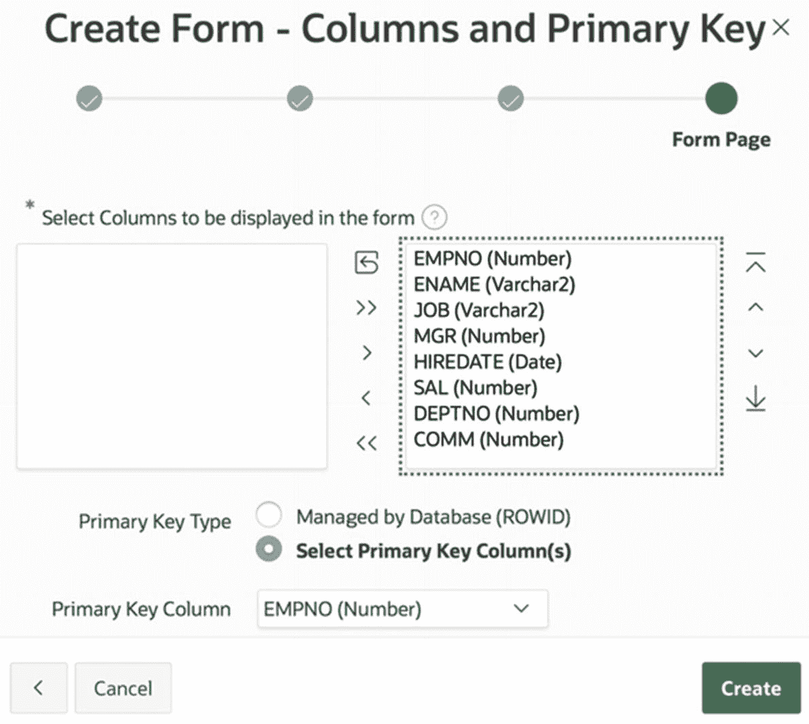

**图 10-26 指定主键列**

当您最终点击 `Create` 按钮时，APEX 将创建两个功能齐全的页面。图 10-27 显示了运行报表页面的结果。（我截掉了底部以节省空间。）

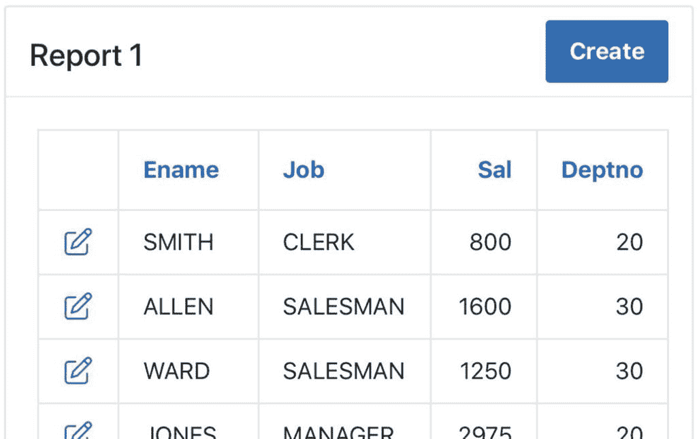

**图 10-27 报表与表单的报表页面**

有两种方式可以从报表页面转到表单页面。点击 `CREATE` 按钮会以插入模式打开表单页面，如图 10-28 所示。或者，点击行开头的链接会以更新/删除模式打开表单页面，并填充所选员工的值。图 10-29 显示了点击 `WARD` 的链接后的表单页面。

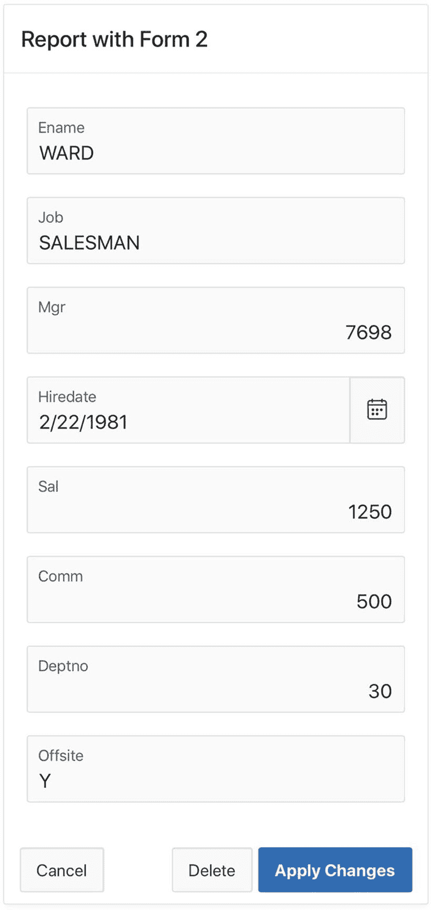

**图 10-29 处于更新/删除模式的表单页面**

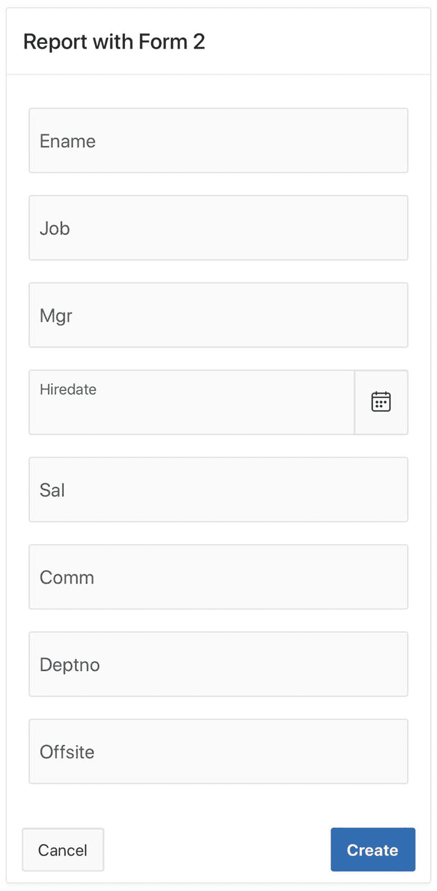

**图 10-28 处于插入模式的表单页面**

请注意，表单页面上的按钮根据其模式而不同。在插入模式下，页面显示一个 `Create` 按钮，它向 `EMP` 表插入一条新记录。在更新/删除模式下，`Delete` 按钮删除所选记录，`Apply Changes` 按钮更新它。所有三个按钮在更改表后都会返回到报表页面。`Cancel` 按钮在两种模式下都通用；它只是不改变表而直接返回到报表页面。

以下小节探讨了向导是如何实现这些页面的。

### 报表页面

报表页面（图 10-27）有一个区域，我选择将其设置为经典报表。它的实现完全 straightforward。唯一有趣的特性是 `EMPNO` 列，其类型为 `Link`（如第 3 章所述）。图 10-30 显示了它的 `Link Builder` 屏幕。它指定链接将重定向到第 32 页（表单页面），并将 `P32_EMPNO` 项设置为所选行的员工编号。

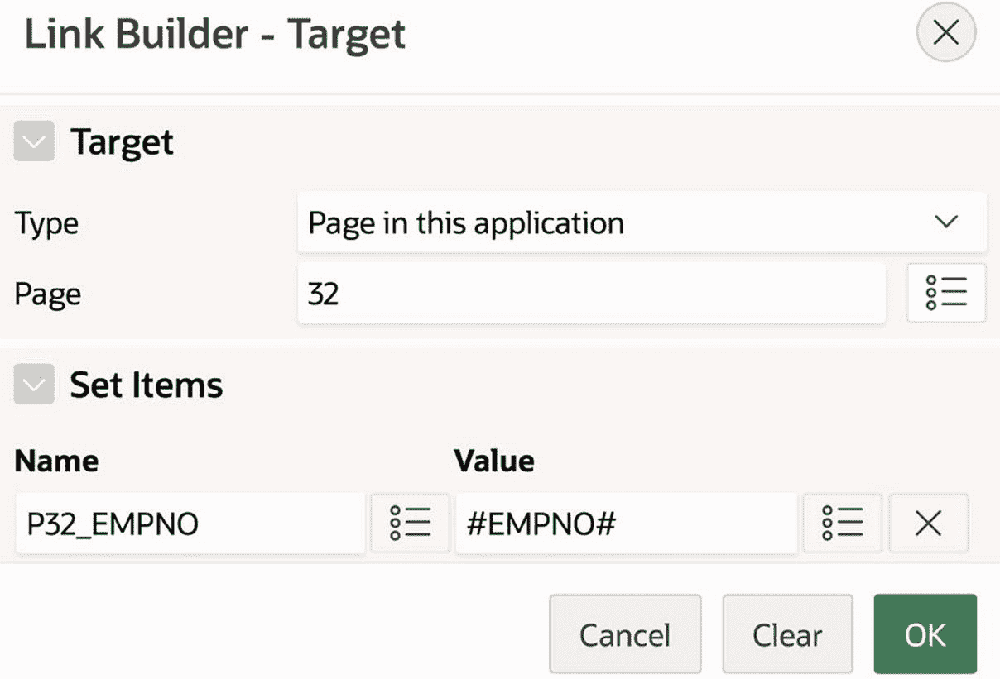

**图 10-30 EMPNO 列的 Link Builder 屏幕**

`Create` 按钮的操作是重定向到表单页面并清除其会话状态，如图 10-31 的 `Link Builder` 屏幕所示。比较这两张图。它们都重定向到表单页面；它们的区别在于，行链接为 `P32_EMPNO` 分配一个值，而 `Create` 按钮则清除 `P32_EMPNO`（以及页面上所有其他项）的值。

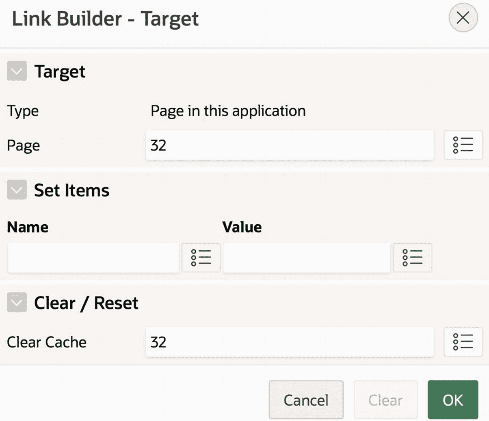

**图 10-31 Create 按钮的 Link Builder 屏幕。**

`P32_EMPNO` 的值因此决定了表单页面是处于插入模式还是更新/删除模式。在插入模式下，页面项的值都将为 `null`，因为 `Create` 按钮清除了它们。在删除模式下，页面项的值都将有一个值，这是由初始化过程的操作决定的。

`Create` 按钮被渲染为蓝色，以表明它是一个“热”按钮。相关属性名为 `Hot`，位于按钮的 `Appearance` 部分，如图 5-29 所示。

### 表单页面

表单页面（图 10-28 和 10-29）有一个区域，类型为 `Form`。图 10-32 显示了它的渲染树。与所有表单区域一样，它有一个初始化过程，以及每个源值对应的项。（为了节省空间，图中未显示这些项。）与标准表单区域的主要区别在于它还有四个按钮。`CANCEL` 按钮重定向到报表页面。另外三个按钮被配置为具有 `Database Action` 值，分别为 `SQL INSERT action`、`SQL DELETE action` 和 `SQL UPDATE action`。

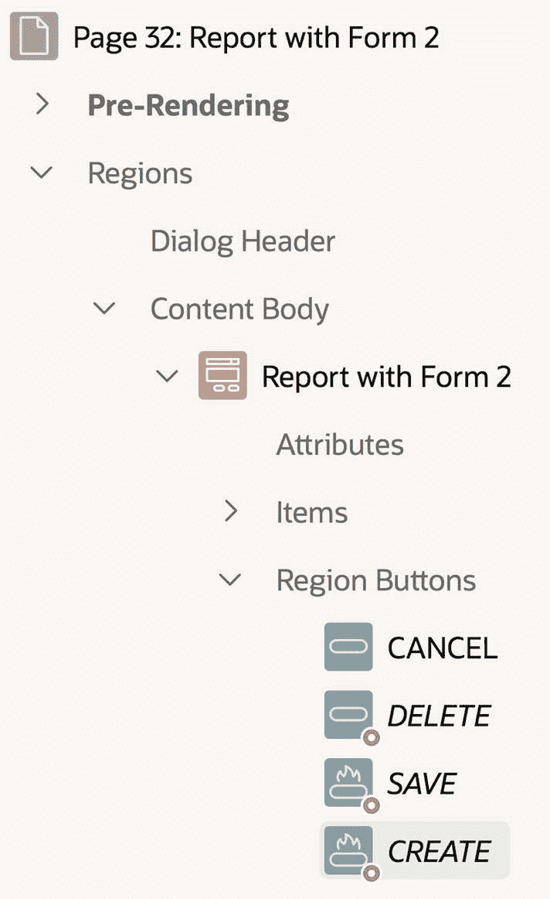

**图 10-32 表单页面的渲染树**

回顾一下，`DELETE` 和 `SAVE` 按钮仅在页面处于更新/删除模式时才呈现，而 `CREATE` 按钮仅在插入模式下才呈现。表单使用 `P32_EMPNO` 的值来决定条件渲染。如果它是 `null`，则渲染 `CREATE`；否则，渲染 `DELETE` 和 `SAVE`。

表单页面还包含一个分支，在提交处理完成后重定向到报表页面。

`CREATE` 和 `SAVE` 按钮的操作是 `Submit Page`。有趣的是，`DELETE` 按钮的操作是 `Redirect to URL`，其中 URL 是：

```
javascript:apex.confirm(htmldb_delete_message,'DELETE');
```


图 10-33 展示了此操作的`Link Builder`界面。JavaScript 函数`apex.confirm`会显示一个确认窗口；点击`Yes`将使用名为`DELETE`的请求提交页面。换句话说，`DELETE`按钮实际上确实执行了提交操作，尽管是通过 JavaScript 间接完成的。

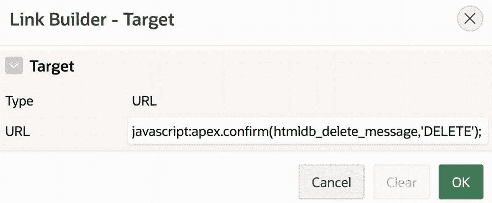

图 10-33
DELETE 按钮的链接构建器界面

表单页面的`Processing`选项卡包含两个组件：所有表单区域共有的 ARP 进程和一个分支。当点击 CREATE、SAVE 或 DELETE 按钮时，该进程会触发。由于这些按钮是页面上唯一执行提交操作的组件，因此该进程不需要设置为条件执行。该分支在提交处理后无条件重定向到报表页面，这就解释了为什么从表单页面每次点击按钮都会返回到报表页面。

## 自定义报表和表单

尽管`Report with Form`向导能生成功能完整的页面，但这些页面是原始且未加修饰的。在实际应用中，你不太可能直接使用它们。相反，你应该将其视为构建更广阔、可定制化应用的基础。这些定制化主要分为三类：外观定制、功能定制和组织结构定制。

外观定制可改善应用的外观和布局。例如，你可以使用第 3 章的技术来改进报表及其列的格式，以及使用第 5 章的技术来优化按钮和项的外观与布局。你还可以更改默认的区域标题、按钮文本和项标签。

另一个外观问题涉及表单项的可见性。回想图 10-25，`Report with Form`向导要求你指定应在表单页面中显示的项。问题在于，表单页面同时用于插入和更新操作，而这两种操作有不同的需求。例如，插入操作需要为所有列设置项，但你可能希望隐藏那些接收默认值的列的项。此外，更新操作应仅显示可更新列的项。因此，为每个项提供一个`Server-side Condition`表达式，指定该项何时可见，将是一个好主意。

或者，你可以选择禁用项而不是隐藏它。每个项都有一个`Read Only`属性部分，你可以像`Server-side Condition`部分那样指定一个条件。`Server-side Condition`会隐藏项，而`Read Only`则使其不可修改。因此，例如，在更新模式下，显示整个记录但将不可修改的项（如`EName`）格式化为只读，可能是一个好主意。

功能定制为向导生成的页面添加功能。例如，你可以向表单页面添加`Previous`和`Next`按钮。你也可以修改插入和更新操作，使其在更改数据库后保留在表单页面，如图 7-24 的`Single Row Update`页面所示。

与组织结构相关的定制涉及添加或删除页面和区域，以及在它们之间移动现有的页面组件。例如，可以将报表和表单区域移动到同一个页面。或者，你可以将表单区域拆分为两个区域——一个用于插入，一个用于更新/删除——如`Single Row Update`页面所示。你甚至可以有三个表单区域，如图 7-5 的`Employee Data Entry`页面所示。

### 表单页面

`Report with Form`向导创建的两个页面连接非常松散。它们唯一的交互是当点击报表页面上的链接或其`Create`按钮时，这两者都会设置表单页面上`P32_EMPNO`项的值。因此，表单页面可以与其他类型的页面结合使用，唯一的前提是其他页面能向表单页面提供员工编号。

在本节中，我不打算将报表与表单连接，而是想将树与表单连接。树以层次结构描绘表中的记录，当表中存在可以作为层次结构基础的字段时，这是可能的。例如，`EMP`表的`Mgr`字段确定了一个层次结构，在商业中称为管理层次结构。没有经理的总裁是层次结构的根。其他每个员工都是其经理的子节点。

`Employee Demo`应用程序的第 33 页以树形显示员工记录。该页面名为`Management Hierarchy Tree`，如图 10-34 所示。树的每个节点显示一个员工姓名。点击姓名会重定向到一个名为`Management Hierarchy Form`的表单页面，该页面显示该员工的其他值，并提供更新这些值或删除员工记录的机会。图 10-35 显示了点击`ADAMS`后得到的表单页面。

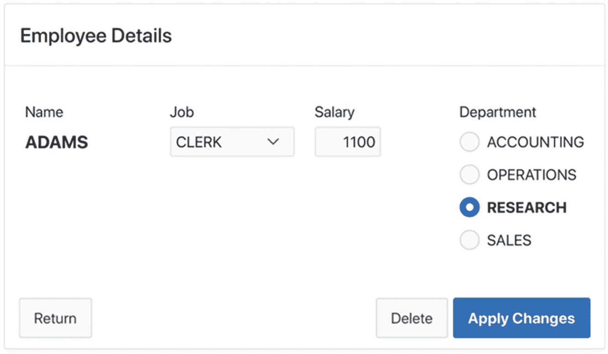

图 10-35
管理层次结构表单页面

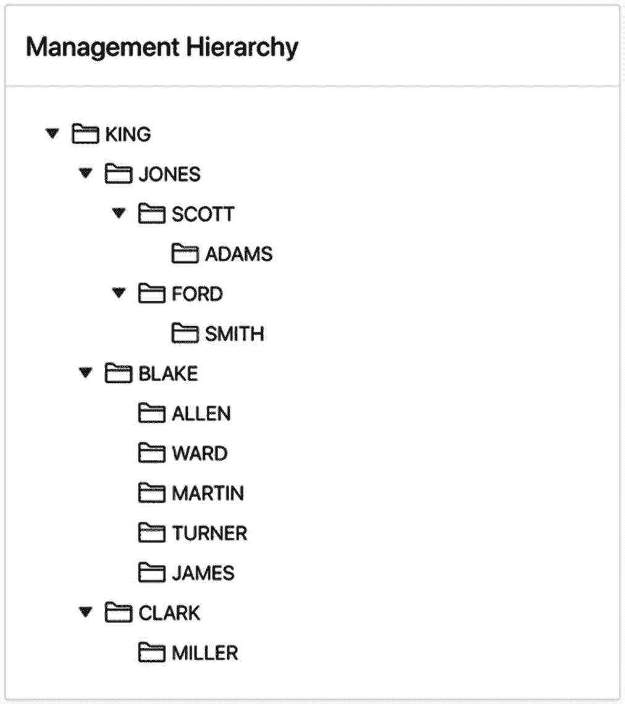

图 10-34
管理层次结构树页面

#### 实现树页面

尽管 APEX 有一个页面向导来创建树，但自己创建页面更具指导性（也更简单！）。因此，将第 33 页创建为一个名为`Management Hierarchy Tree`的空白页面，并创建一个类型为`Tree`的区域。其数据源应为`EMP`表。

配置树的属性位于该区域的`Settings`部分，你可以从渲染树中的`Attributes`节点进入。图 10-36 显示了图 10-34 中树的`Settings`属性。

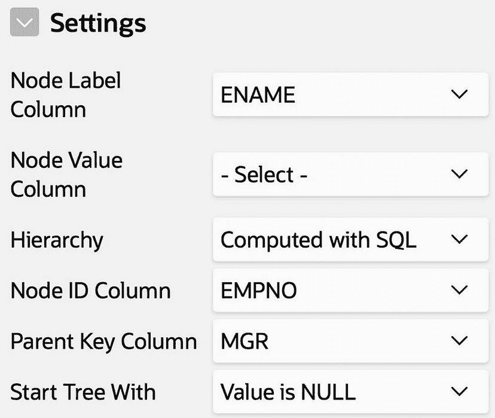

图 10-36
树区域设置

名为`Hierarchy`的属性应设置为`Computed with SQL`，这指示 APEX 根据以下设置计算层次结构：

*   `Node Label Column`是其值作为树节点标签的字段。
*   `Node Id Column`是主键字段。
*   `Parent Key Column`是定义层次结构的字段。记录的此字段值指定其父记录的主键。
*   `Start Tree With`指定层次结构的根。设置`Value is NULL`断言层次结构的根是父键列值为`null`的记录。

此时运行你的页面，并探索树。如果一个节点有子节点，其左侧将有一个箭头。点击这些箭头将展开或收缩其子节点列表。

最后的配置步骤是指定当用户点击树中的节点时发生什么。你需要的属性是`Link`，它位于`Settings`部分更靠下的位置。点击其框会弹出`Link Builder`向导。图 10-37 显示了我如何配置该链接。它指定点击节点将重定向到第 34 页，并将`P34_EMPNO`的值设置为该节点的`EMPNO`值。请注意，这里使用了替换字符串语法来引用节点字段的值。

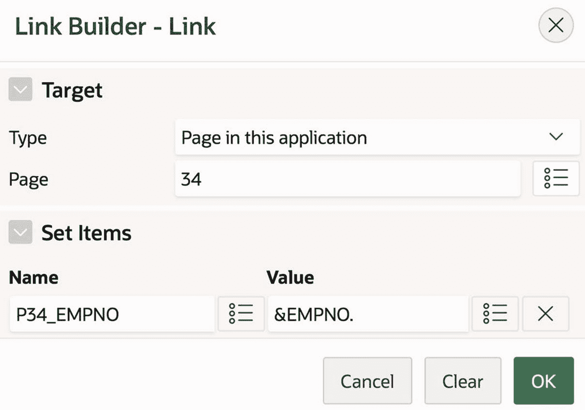


## 实现表单页面

`Employee Demo` 应用的第 34 页是如图 10-35 所示的表单页面。通过创建一个空白页面并向其添加一个 `表单` 区域，实现起来已经足够简单。然而，使用向导来创建表单页面本身则更加容易。

回顾图 10-23 的 `创建页面` 屏幕，你可以看到一个名为 `Form` 的向导图标。点击它会弹出图 10-38 的 `创建表单` 屏幕。

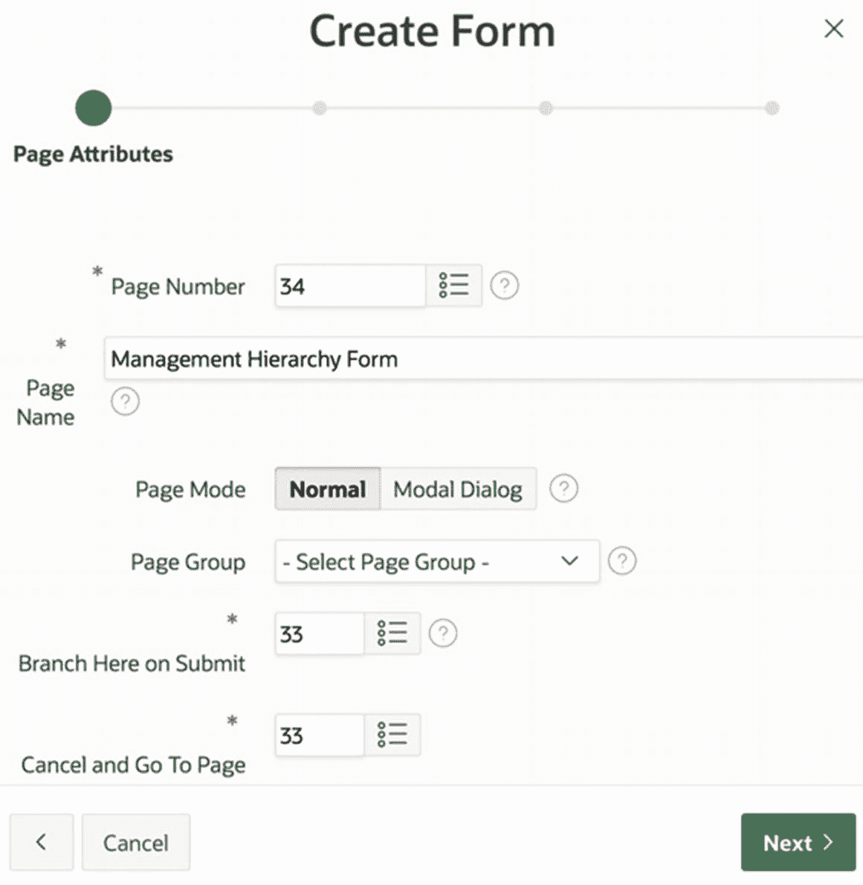

图 10-38
创建表单向导的第一个屏幕

在询问了页面编号和名称之后，向导会要求提供两样东西：表单在提交后（即 `删除` 和 `应用更改` 按钮）应跳转到的页面，以及重定向后（即 `取消` 按钮）应跳转到的页面。其余的屏幕与你之前见过的类似——一个屏幕询问导航菜单，一个屏幕请求数据源，以及最后一个屏幕请求主键。

向导生成的表单页面应该能与树页面无缝协作，无需你进行任何额外的配置——当点击树节点时，树会重定向到表单；当点击按钮时，表单会重定向到树。图 10-35 中我的表单页面，仅仅是更改了向导生成的项的类型和布局后的结果。

我想强调一点，由 `Form` 向导生成的表单页面与由 `Report with Form` 向导生成的表单页面完全相同——这两个向导之间的唯一区别是，`Report with Form` 还会生成一个包含 `创建` 按钮和报表的页面。此外，由 `Form` 向导生成的页面与一个带有 `表单` 区域的空白页面加上几个按钮和属性设置也完全相同。图 10-23 中的其他基于表单的向导与 `Report with Form` 类似。了解这一点可以帮助你决定，对于任何给定的任务，是使用其中一个向导还是自己编写页面。

### 主从表单

第 6 章讨论了主从报表的创建。在主从报表中，两个报表是链接的，当选择主报表中的一行时，从报表只显示与所选主行关联的行。例如，图 6-8 中的 `按部门查看员工` 页面显示了一个与主 `DEPT` 报表链接的 `EMP` 报表；点击一个 `DEPT` 记录会使 `EMP` 报表仅显示所选部门中的员工。

在本节中，我想考虑如何扩展主从报表以包含更新功能。一个直接的方法是创建两套 `带表单的报表` 页面，一套用于 `DEPT`，一套用于 `EMP`，然后像第 6 章那样链接 `DEPT` 和 `EMP` 报表。让我们看看这需要多少工作量。

首先，使用 `带表单的报表` 向导为 `DEPT` 创建报表和表单页面。报表页面命名为 `主报表`，页码为 35；表单页面命名为 `主表单`，页码为 36。页面数据源是 `select * from DEPT`。

然后使用向导为 `EMP` 创建报表和表单页面。页码为 37 和 38；报表页面命名为 `从报表`，表单页面命名为 `从表单`。它们的数据源是 `select * from EMP`。

此时，你有两套互不关联的页面。它们的报表页面需要按如下方式关联起来：

*   主报表需要一个链接列，带你跳转到从报表。
*   从报表需要仅显示与所选从行关联的记录。
*   从报表需要一个按钮，带你返回主报表。

图 10-39 和 10-40 展示了这两个报表。图 10-40 显示了为 `ACCOUNTING` 部门点击“查看员工”后的结果。请注意，我修改了两个页面上向导生成的区域标题。特别是，从区域的标题是用部门名称自定义的。

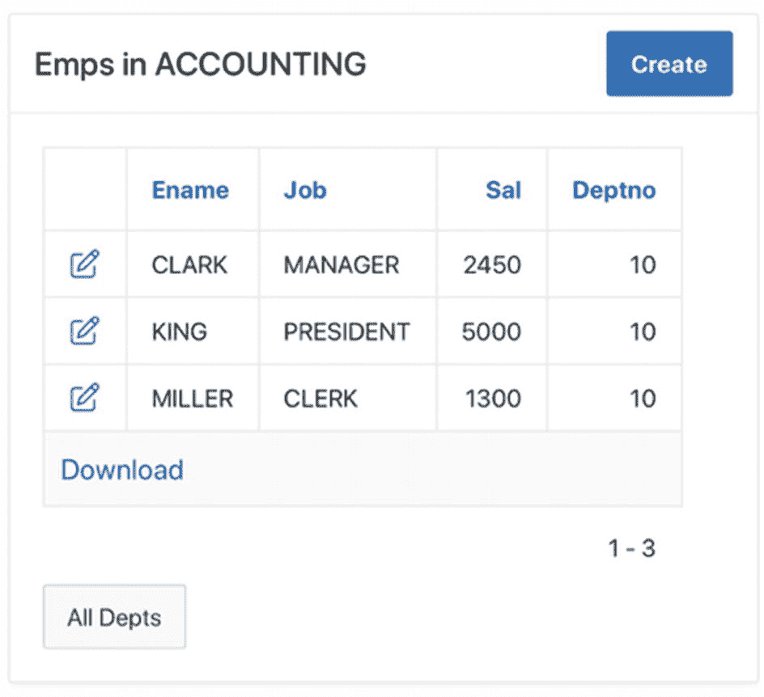

图 10-40
从报表

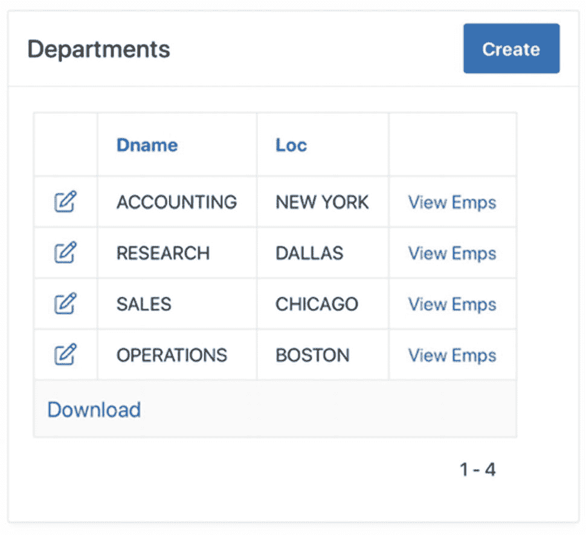

图 10-39
主报表

你需要对主报表做的唯一改动是创建额外的“查看员工”列。为此，你应该为报表创建并配置一个 *虚拟列*，步骤如下：

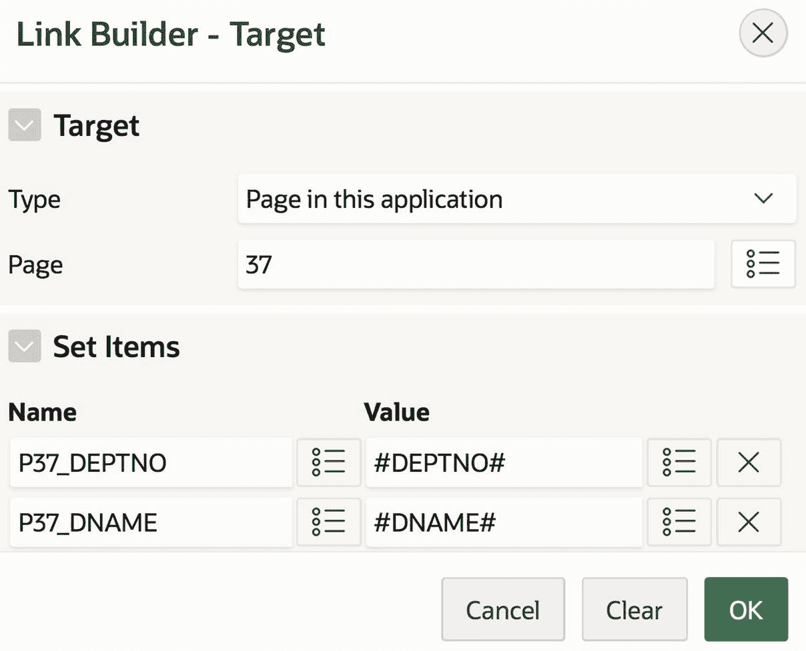

图 10-41
查看员工链接的链接构造器

*   右键单击渲染树的 `列` 节点，然后选择 *创建虚拟列* 菜单项。APEX 会向报表添加一个名为 `DERIVED$01` 的列。
*   将此列的类型设置为 `链接`。
*   转到 `设置` 部分，点击 `目标` 属性的选框。这会打开链接构造器。
*   如图 10-41 所示配置链接构造器。
*   将该列的链接文本属性设置为 `查看员工`。

然后你需要对 `从报表` 页面进行以下更改。

*   创建隐藏项 `P37_DEPTNO` 和 `P37_DNAME`。
*   将区域的数据源更改为
    ```
    select * from EMP
    where DeptNo = :P37_DEPTNO
    ```
*   将区域的标题更改为
    ```
    &P37_DNAME. 中的员工
    ```
*   创建一个标签为 `所有部门` 并重定向到第 35 页的按钮。

就是这样！使用页面向导的优势在于，你可以快速构建功能齐全的网页。你可能需要配置区域的外观和感觉，但这应该不会太麻烦。

使用页面向导的唯一问题是，它迫使你采用特定的页面架构——在本例中，是使用四个单区域页面。其实还有许多其他可能的设计。事实上，APEX 有一个 `创建页面` 向导，它构建主从表单的方式非常不同。图 10-42 显示了它的主页面。

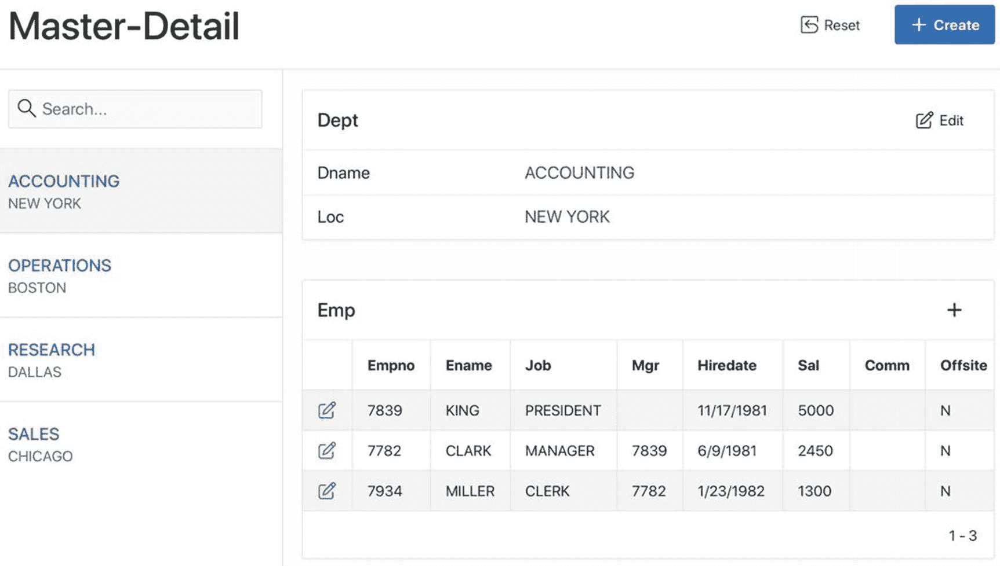

图 10-42
组合式主从页面

该页面有五个区域：一个横跨顶部的区域，名为 `主-从`，包含两个按钮；左侧列中的一个区域包含搜索栏；左侧列中的一个报表区域列出主行；顶部的一个报表区域（名为 `部门`）列出所选的主行；以及底部的一个报表区域（名为 `员工`）列出关联的从行。

左侧列中主区域的行是链接。当你点击一行时，它会成为选定行，其右侧的两个区域会相应地调整。

用户可以通过四种方式编辑此页面：

*   `主-从` 区域中的 `创建` 按钮向主表插入一个新行。
*   `部门` 区域中的 `编辑` 按钮编辑当前的主行。
*   `员工` 区域中的 “`+`” 按钮向从表插入一个新行。
*   从报表中的编辑链接编辑所选的从行。


### 交互式网格

单击按钮或链接会在模态对话框页面中显示一个表单。例如，图 10-43 显示了单击 `Edit` 按钮后的结果。用户可以修改主记录、删除它，或者在不执行任何操作的情况下返回到主从页面。

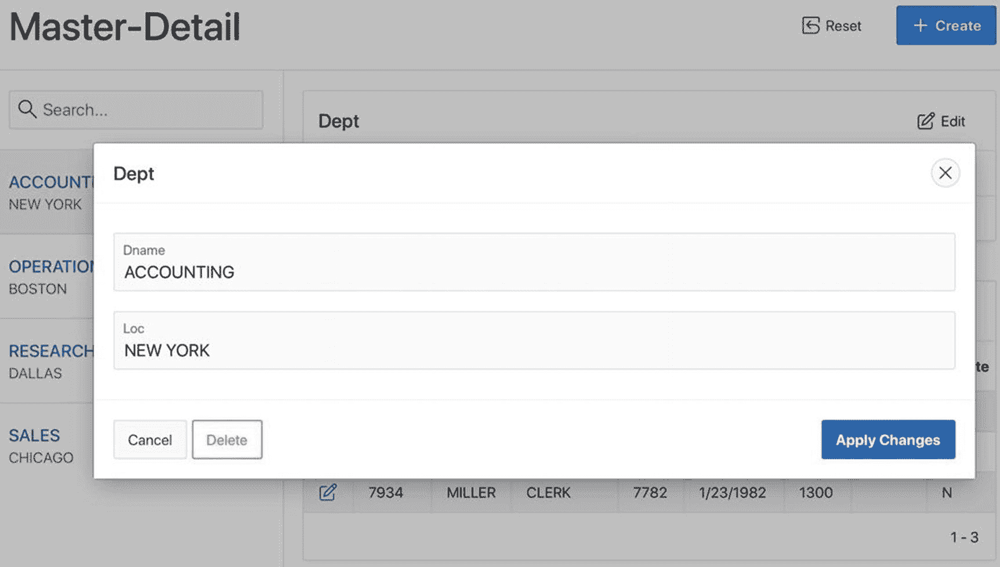

图 10-43 编辑当前主记录

从设计角度来看，将此主从页面与之前的解决方案进行比较是值得的。此页面在同一页面上显示主报表和明细报表，类似于图 6-8 中的 `Employees by Department` 页面。此页面是主要的，用户永远不会与它失去联系。当需要编辑时，会以模态方式显示相应的表单，编辑完成后该表单便会消失。相比之下，之前的解决方案由四个页面组成。用户根据手头的任务（“查看主报表”、“编辑主行”、“查看明细报表”或“编辑明细行”）从一个页面切换到另一个页面，并且没有哪个页面比其他页面更重要。
关键点不在于一种方法比另一种更好，而在于解决问题的方法有很多种。你需要足够熟练地使用 APEX 来构建你设想中的页面，而不是被迫根据向导生成的页面进行设计。

考虑到这一点，让我们使用向导来创建这些主从页面，然后检查它们的实现。从图 2-9 中的初始 `Create Page` 屏幕开始。单击 `Master Detail` 图标时，APEX 会显示图 10-44 所示的屏幕。从那里，单击 `Side by Side` 图标将得到图 10-45 所示的屏幕。

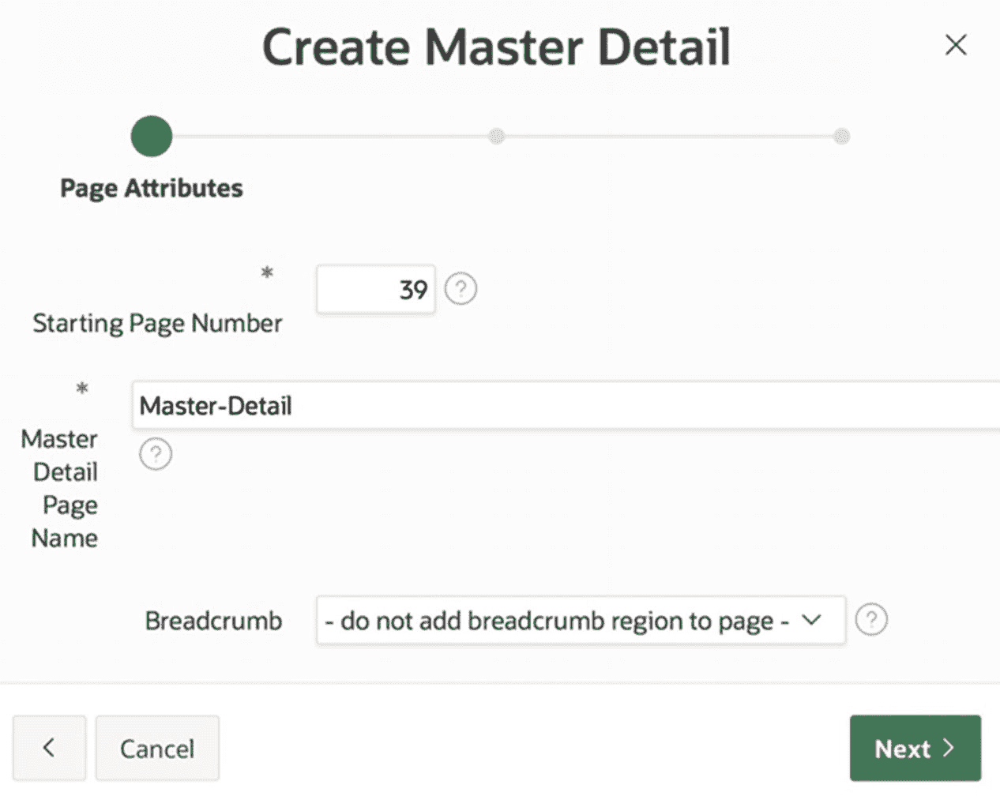

图 10-45 第一个主从屏幕

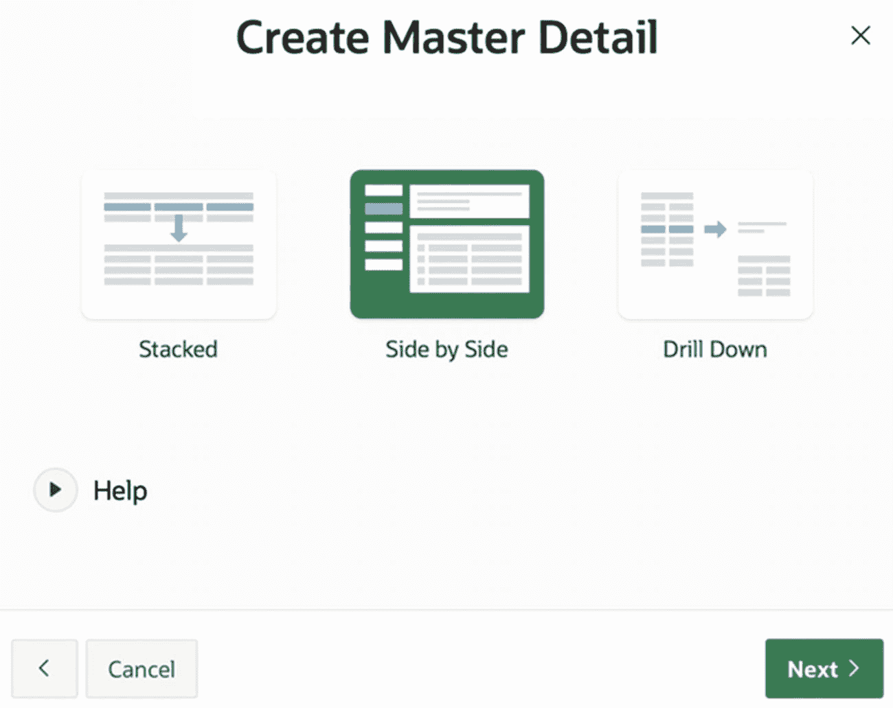

图 10-44 选择所需的主从向导

此屏幕要求您输入主页面（即图 10-42 中显示的页面）的名称和页码。向导还将创建另外两个页面来存放主表单和明细表单，但您无法选择它们的页码。单击 `Next` 按钮将带您进入指定导航菜单项的屏幕。您之前已经见过此屏幕，因此这里省略了。最后一个屏幕（如图 10-46 所示）要求您提供主表和明细表。`Primary Display Column` 和 `Secondary Display Column` 属性表示要在主记录中显示的两个值。单击 `Create` 按钮会生成功能完整的三个页面。在我的应用程序中，这些页面是 39、40 和 41。

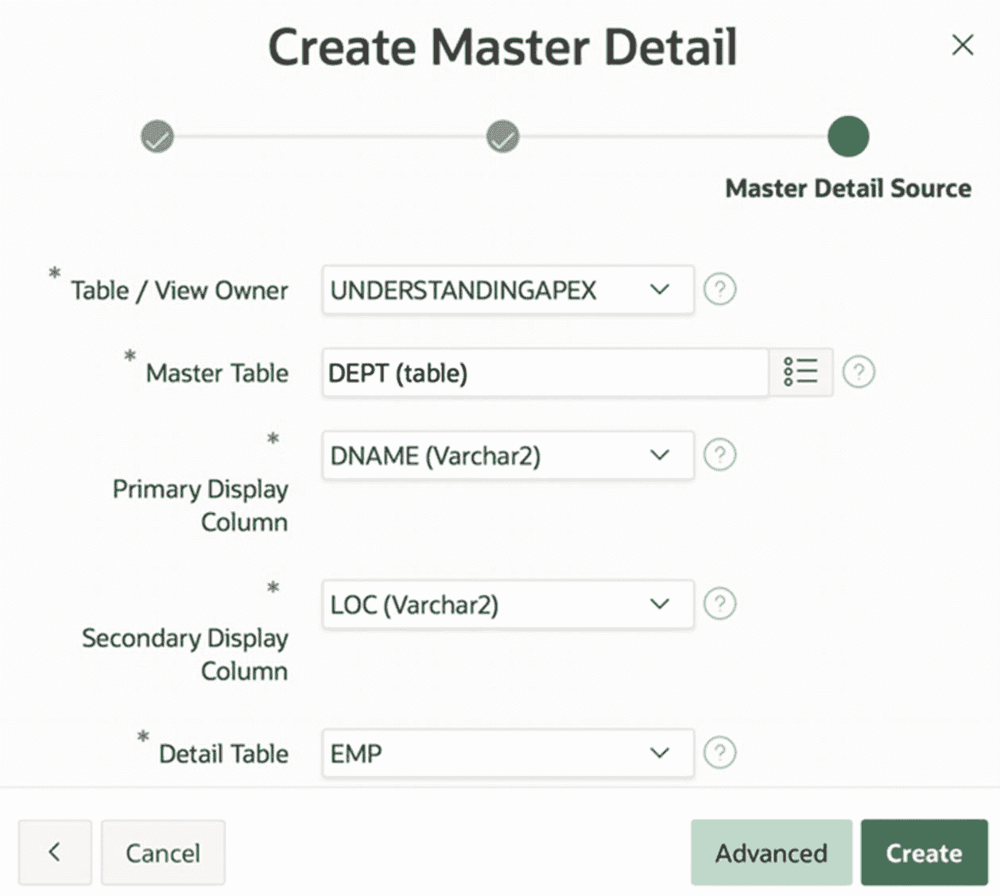

图 10-46 第三个主从屏幕

页面 40 和 41 是表单页面，与您通过调用 `Create Form` 向导获得的结果相同。因此，主要问题是如何实现报表页面。

这三个报表区域，也许令人惊讶，是 `Classic Report` 区域。它们外观不同是因为使用了不同的区域模板。主报表模板是 `Media List`。此模板显示两个值，分别称为 `List_Title` 和 `List_Text`。如果您希望报表行成为链接，则源查询还必须有一个 Link 字段，其值是要重定向到的 URL。向导生成的源查询很复杂，但其本质如下：

```sql
select DeptNo, DName as List_Title, Loc as List_Text,
apex_page.get_url(p_items  => 'P39_DEPTNO',
p_values => DEPTNO) as Link
from DEPT
```

函数 `apex_page.get_url` 返回一个指向 APEX 页面的 URL。默认情况下，URL 会重定向到当前页面。参数 `p_items` 和 `p_values` 指定了应如何更改会话状态。
图 10-42 中标题为 `Dept` 的区域使用了模板 `Value Attribute Pairs – Column`。此模板将每个值显示在其自己的行上，并在前面加上列名。在图中，该区域的源有一行两列，因此其报告显示两行。
标题为 `Emp` 的区域使用了 `Standard` 模板，因此其报告以标准方式显示。
除了外观不同，`Dept` 和 `Emp` 报表以通常的方式与其表单页面交互，即通过让它们的按钮和链接重定向到相应的表单页面。
底线是，即使是像 `Master-Detail` 这样复杂的向导，也只是创建了一个包含三个报表区域的页面，其中两个区域链接到表单页面。如果您愿意，可以自定义这些区域以满足您的需求。

#### 小结

本章的第一部分探讨了 APEX 表单区域。一个表单区域包含两个进程——一个初始化进程和一个 ARP 进程——它们允许您的页面访问数据库，而无需编写 PL/SQL 代码。APEX 还为一些常见任务提供了内置进程，这些进程与两个表单进程配合使用。几个例子展示了这些进程相对于相应 PL/SQL 进程的优点和局限性。
本章的第二部分探讨了一些创建表单的 APEX 页面创建向导。这些向导各不相同，从创建旨在与其他页面结合使用的单页面的 `Form` 向导，到将 `Form` 页面与简单报表页面配对的 `Report with Form` 向导，再到将两个 `Form` 页面与一个包含三个报表区域的页面匹配的复杂 `Master-Detail` 向导。在每种情况下，重点都是揭开这些向导的神秘面纱，使您能够自信地创建所需的页面，无论是否使用它们。

## 11. 交互式网格

报表是只读的。如果您正在查看报表并想要更改其内容，则必须使用表单。例如，考虑图 10-27 中的 `Report with Form 1` 页面。假设用户想要修改员工报表中的一行。会发生以下步骤：
*   用户单击所需行的链接，这会重定向到 `Report with Form 2` 页面（图 10-29），并将选定的员工号放入该页面的一个项中。
*   然后，表单的初始化进程从数据库中检索该员工的信息，并将其存储在相应的项中。
*   然后用户修改这些项的内容，并单击 `Apply Changes` 按钮执行更新。

这些步骤的奇特之处在于，第二步没有利用员工报表。相反，初始化进程重新从数据库中检索所需的员工记录，即使这些值就在报表中。
*交互式网格* 的概念通过允许用户直接更新报表值来解决这种情况。交互式网格本质上是一个“可更新的报表”，在一个区域中结合了报表和表单的功能。本章探讨了构建和自定义交互式网格所需的技术。


## 只读交互网格

APEX 交互式网格本质上是一个可以像表单一样编辑的交互式报表。本节将探讨交互式网格的类报表特性；本章的后续部分将涵盖与表单相关的问题。`Employee Demo` 应用程序的第 42 页名为 `Interactive Grids`，将在本章中作为一个贯穿使用的示例。

### 创建交互式网格区域

要创建此页面，首先创建一个空白页面。添加一个名为 `Departments` 的区域，并将其类型设置为 `Interactive Grid`。系统会要求你提供一个数据源，这里应该是查询语句 `select * from DEPT`。图 11-1 展示了 APEX 生成的渲染树及其相关属性。你应该注意到它与任何报表区域看起来没什么不同。

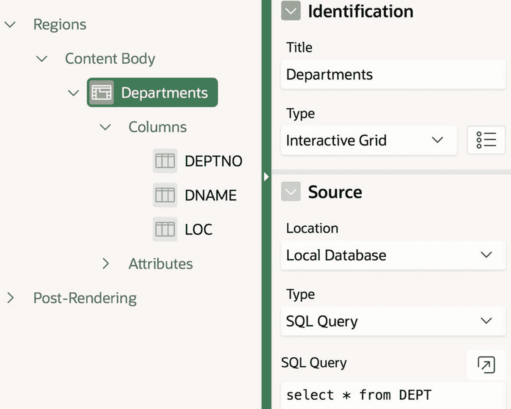

**图 11-1** 创建交互式网格区域

图 11-2 展示了生成的区域。请注意报表上方的工具栏，其中包含搜索字段和操作菜单。这个工具栏与交互式报表中的相同，并且功能几乎一样。例如，交互式网格的操作菜单允许你隐藏和重排序列、创建图表、过滤记录等等，就像交互式报表一样。交互式网格还提供诸如调整列宽和冻结列等操作，并对操作菜单进行了一些重组。`Reset` 按钮将报表恢复为其默认设置。

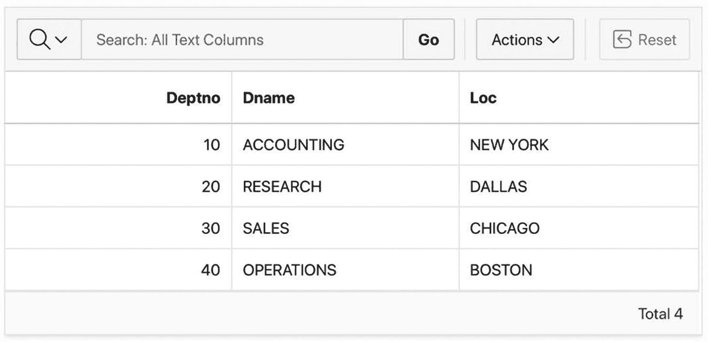

**图 11-2** 一个交互式网格区域

要自定义交互式网格的工具栏，你使用与自定义交互式报表相同的属性；参见图 11-3。一个区别是交互式网格没有用于自定义操作菜单的属性。

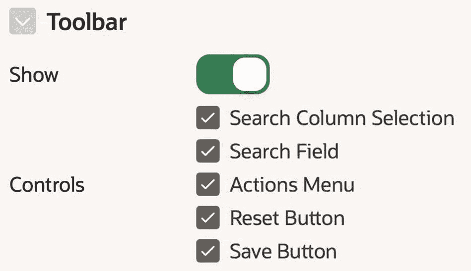

**图 11-3** 用于自定义工具栏的属性

### 创建主从关系

与交互式报表不同，交互式网格具有属性，可以在两个网格之间创建主从关系。要在你的 `Interactive Grids` 页面中实现此功能，请遵循以下步骤：


**图 11-4** “主从关系”属性部分

1.  创建一个新的交互式网格区域，命名为 `Employees`，其数据源为 `select * from EMP`。
2.  在 `Departments` 区域中，点击渲染树中的 `DEPTNO` 节点，并在属性编辑器中找到其 `Source` 部分（如图 10-4 所示）。打开 `Primary Key` 属性。
3.  在你的新 `Employees` 区域中，转到 `DEPTNO` 列的 `Master Detail` 属性部分，并将其 `Master Column` 属性设置为 `DEPTNO`，如图 11-4 所示。

最后两步在两个网格之间建立了键-外键关系。`Departments` 网格中的 `DEPTNO` 列是主键，而 `Employees` 网格中的 `DEPTNO` 列是外键。APEX 将确保每当用户从 `Departments` 网格中选择一行时，`Employees` 网格将只显示具有相应 `DEPTNO` 值的行。

图 11-5 展示了生成的主从网格。花些时间探索它们在你的应用程序中的行为。你应该观察到每次选择另一个主行时，明细网格是如何变化的。同时注意 `Employees` 网格不再显示 `DeptNo` 列，因为它的值可以从所选的 `Departments` 行中推断出来。

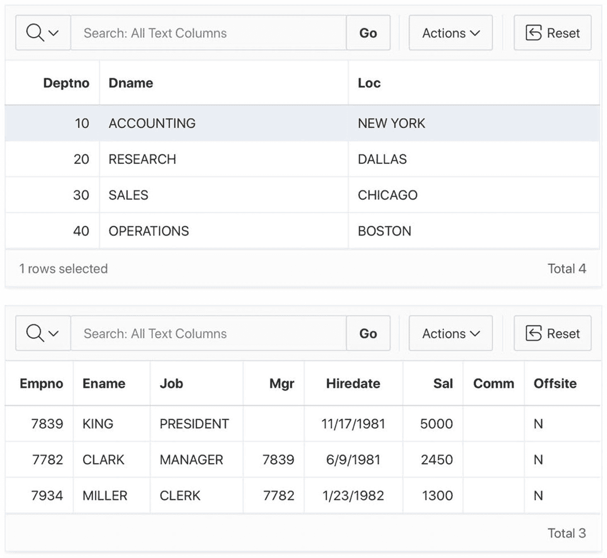


## 编辑交互式网格

### 图 11-5：主-详细信息交互式网格

除了能像报表一样运行外，交互式网格还能像表单一样运行。在交互式网格中启用编辑功能的方式与在表单中相同。具体来说，转到交互式网格区域的渲染树，点击其 `Attributes` 节点，查看 `Edit` 部分中的 `Enabled` 属性。默认情况下，此属性是关闭的。当您将其开启时，会显示其他属性，如图 10-10 所示。这些复选框允许您指定该区域应允许哪些编辑操作。

与表单一样，在您指定其主键列之前，将无法编辑交互式网格。在 `Sample Interactive Grids` 页面中，您已经为 `Departments` 网格指定了主键列（以支持主-详细信息链接）；现在您应该指定 `EMPNO` 是 `Employees` 网格的主键列。您还应该关闭这些关键列的 `Value Required` 属性；否则，APEX 将无法为新插入的记录生成关键值。

### 编辑操作

图 11-6 显示了为 `Departments` 区域启用编辑功能的交互式网格。（为节省空间，我隐藏了搜索菜单和文本框。）当我启用编辑时，APEX 在网格左侧添加了两列：一列复选框列（名为 `APEX$ROW_SELECTOR`）和一列菜单列（名为 `APEX$ROW_ACTION`）。工具栏还包含标记为 `Edit`、`Save` 和 `Add Row` 的新按钮。

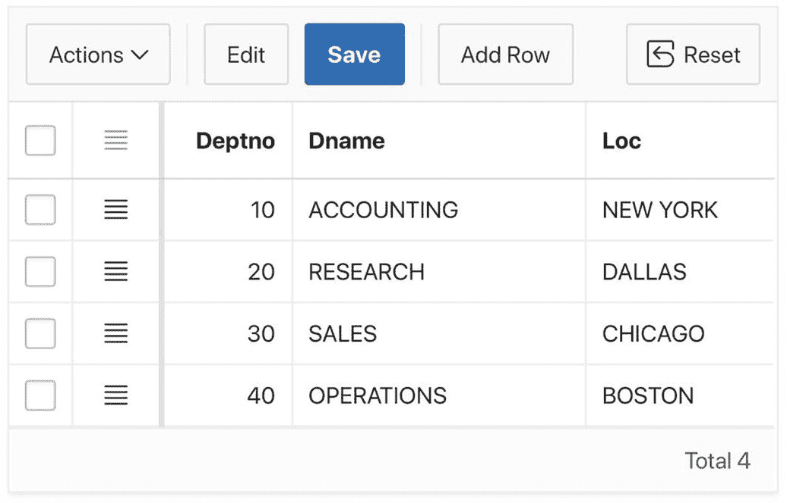
*图 11-6：已启用编辑功能的交互式网格*

您按如下方式编辑交互式网格：`Edit` 按钮在视图模式和编辑模式之间切换。最初按钮为白色，如图 11-6 所示，表示视图模式。点击它会使按钮变为灰色，表示编辑模式。在编辑模式下，您可以修改单元格的值。APEX 通过在单元格的右上角放置一个蓝色小三角形来表示已修改的单元格。

点击 `Add Row` 按钮会向网格添加一个新行。其主键的初始值是一个占位符。您可以将其替换为所需的值，也可以保持原样。如果您保持原样，那么 APEX 将用生成的值覆盖它。

### 行操作菜单

点击行的 `APEX$ROW_ACTION` 图标会弹出一个菜单，包含可对该行执行的操作。例如，图 11-7 显示了会计部门所在行的行操作菜单。特别是，从此菜单中选择 `Delete Row` 项将删除该行。

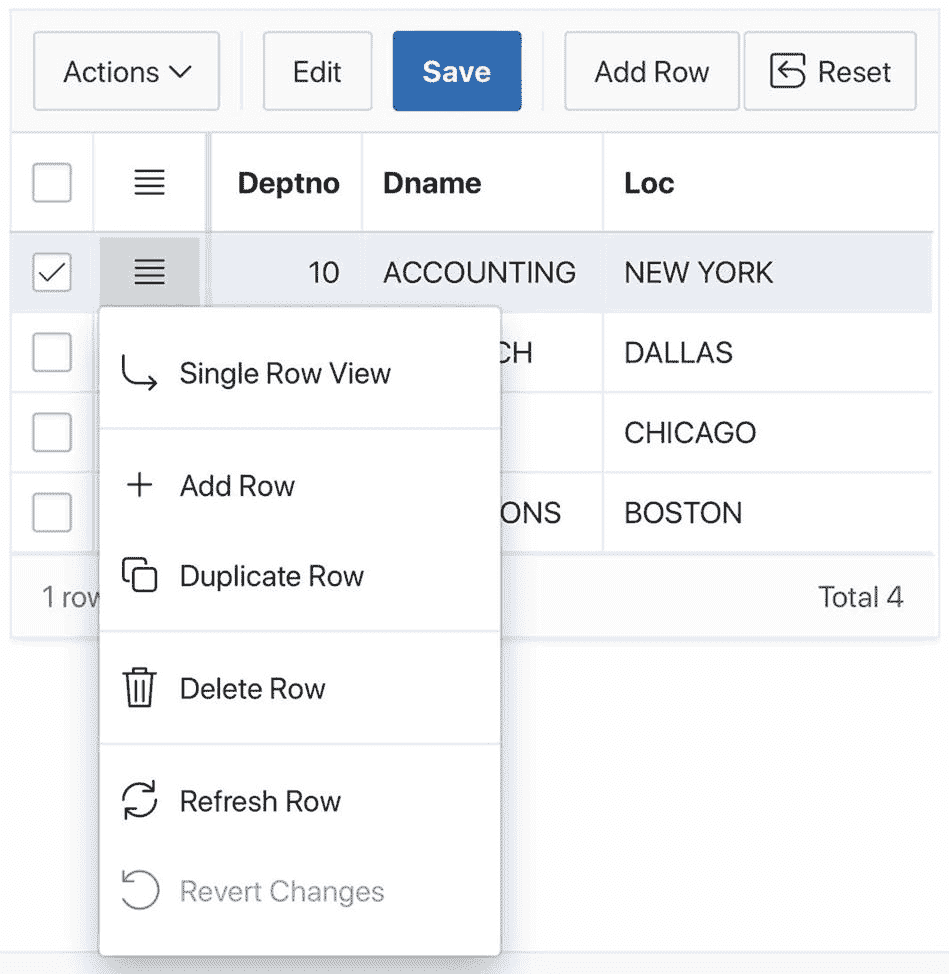
*图 11-7：APEX 行操作菜单*

图 11-8 显示了执行三个操作后的交互式网格：我将部门 20 的名称从 `RESEARCH` 更改为 `OUTREACH`，删除了 `SALES` 部门，并为 `FINANCE` 部门插入了一条新记录。APEX 使用颜色编码来指示这些更改——已编辑的行为蓝色，删除的行为灰色，新增的行为绿色。

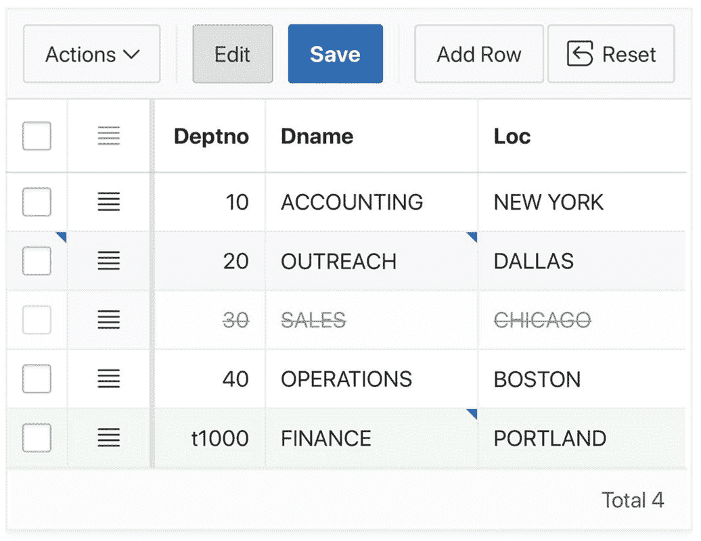
*图 11-8：对交互式网格的更改*

在点击 `Save` 按钮之前，这些操作都不是永久的。在此之前，您可以通过从行操作菜单中选择 `Revert Changes` 项来撤销对某一行的更改（如图 11-7 所示）。

网格的行选择列是最左侧包含复选框的列。此列不用于基本编辑操作。例如，点击图 11-8 中的 `Save` 按钮将保存三行更改的行，即使它们的行选择框未被勾选。

行选择列的目的是支持批量操作，例如删除。要使用它，首先选择多条记录。然后，转到网格标题中的行操作菜单，如图 11-9 所示。选择 `Delete Rows` 菜单项将把选定的记录标记为待删除。要最终确定删除操作，您必须接着点击 `Save` 按钮。

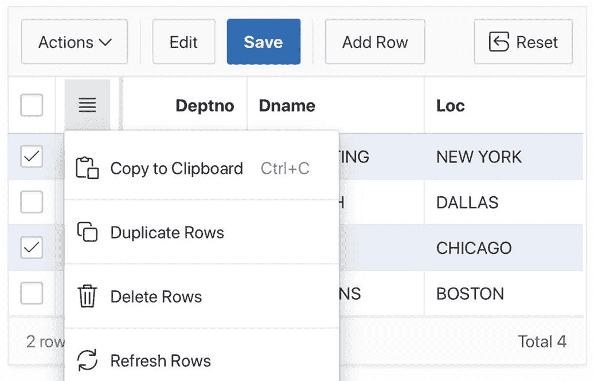
*图 11-9：批量删除记录*

执行批量操作的另一种方式是使用网格上方工具栏中的 `Actions` 按钮。它有一个名为 `Selection` 的子菜单，其菜单项与标题行的操作菜单相同。

### 单行视图

每行的操作菜单中都有 `Single Row View` 项，您可以在图 11-7 中看到。点击它会以类似表单的方式显示所选行。图 11-10 显示了 `ACCOUNTING` 部门的单行视图。您可以看到用于导航到下一行和上一行的按钮，以及一个返回到报表的按钮。其他按钮的工作方式与网格视图相同。

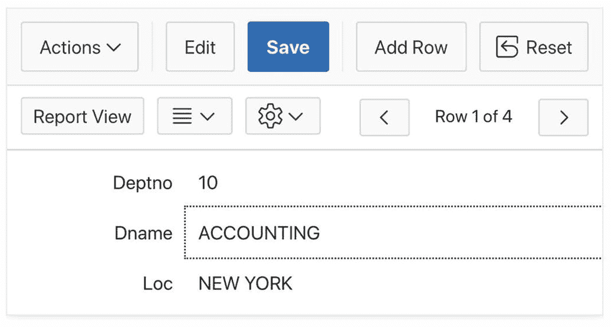
*图 11-10：单行视图*

### 单元格类型和默认值

网格中的单元格具有双重存在形式。通常，它像在报表中一样以文本形式显示其值。但是当该单元格在编辑模式下被选中时，它就变成了一个项。该项的类型由该单元格所在列的 `Type` 属性决定。例如，在 `Employees` 网格中，将 `Job` 和 `Mgr` 的类型设置为 `Select List`，将 `Hiredate` 的类型设置为 `Date Picker`，将 `Offsite` 的类型设置为 `Radio Group`。图 11-11 显示了点击员工 `MILLER` 的 `Job` 单元格后弹出的列表。

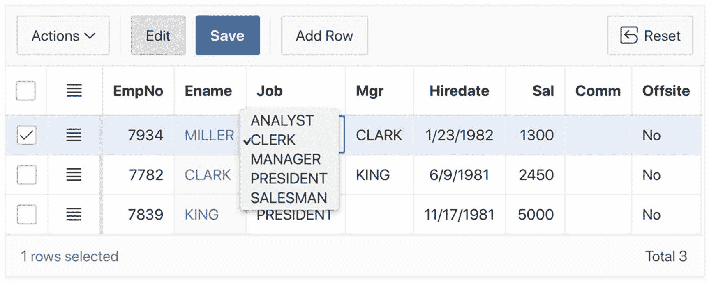
*图 11-11：格式化为选择列表的 JOB*

请注意，未选中的单元格看起来像文本字段，无论其类型如何。例如，您无法从图中看出每个 `Mgr` 单元格是一个选择列表，每个 `Offsite` 单元格是一个单选按钮组。但是，您可以看到 `Mgr` 单元格显示的是该列的显示值（经理的姓名），而不是返回值（经理的员工编号）。同样，`Offsite` 单元格显示的是该列的显示值（'`No`'），而不是返回值（'`N`'）。了解不同单元格类型的最好方法是亲自尝试它们。

每列都有一个名为 `Default` 的属性部分，您可以在其中为新记录指定默认值。在 `Employees` 区域中，您应该为 `HIREDATE`、`COMM` 和 `OFFSITE` 列指定默认值。图 11-12 显示了对 `HIREDATE` 的指定，它只是对 SQL 函数 `current_date` 的调用。这些默认值将出现在插入行中，用户可以在点击 `Save` 按钮之前修改它们。

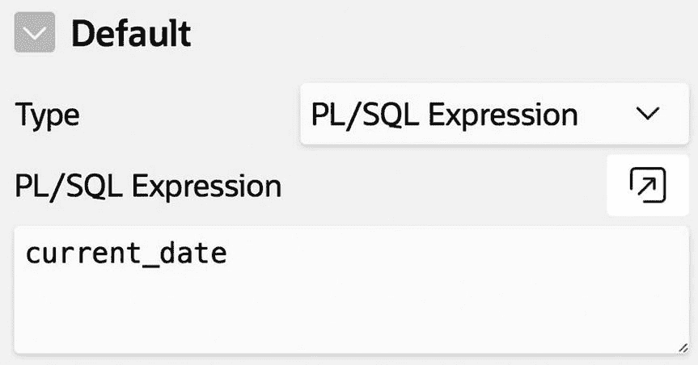
*图 11-12：指定列的默认值*


我想向您展示如何对页面的外观和感觉进行最终改进。目前，页面包含两个网格区域，每个区域都有自己的按钮。`编辑`和`添加行`按钮只影响它们各自的网格。然而，`保存`按钮是冗余的——每个按钮都会保存两个网格的更改。这种行为有些出乎意料，可能会让用户感到困惑。

解决方案是认识到`保存`按钮并没有特殊功能——它们的操作等同于一个全页面的`提交操作`。因此，您可以创建自己的`保存`按钮，并将其显示在页面上任何您想要的位置。我的选择是创建一个新的静态内容区域，标题为`按部门查看员工`，作为那两个交互式网格区域的父级。然后，我在新区域中创建了一个标记为`保存`的按钮，将其位置设置为`编辑`，打开其`热键`属性（以便以蓝色显示），并为其分配`提交页面`操作。您也应该这样做。

在验证按钮有效后，您可以隐藏区域工具栏上的`保存`按钮。转到`部门`区域的渲染子树，单击`属性`节点，并在属性编辑器中找到`工具栏`部分（如图 11-3 所示）。取消勾选`保存按钮`条目。然后对`员工`区域重复此过程。图 11-13 显示了最终的页面效果。

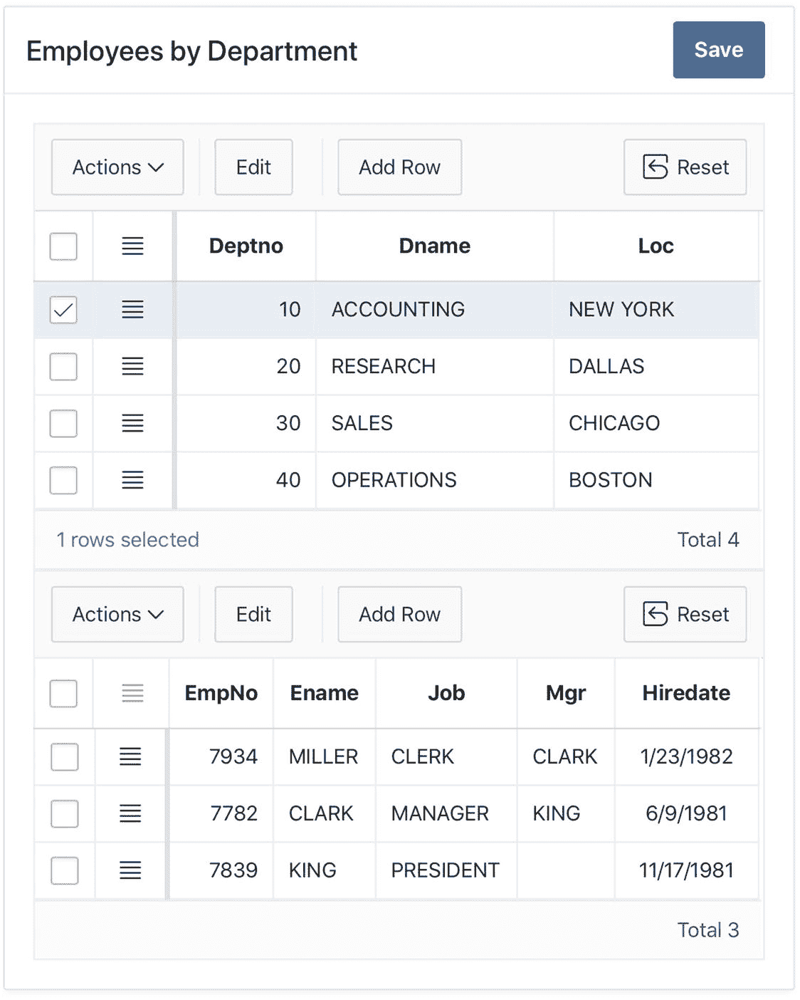

图 11-13
完成的交互式网格页面

### 确保一致性
第 8 章讨论了页面如何保持数据一致性的方法。一种方法是使用验证来检查不合适的项值；另一种方法是限制可输入的值。以下小节展示了如何将这些解决方案应用于交互式网格。

#### 网格验证
交互式网格中的验证是一个必须对网格的每一行都为真的断言。您定义交互式网格验证的方式与定义基于项的验证相同；唯一的区别是它将应用于网格中的每一行，而不仅仅是一行。

例如，考虑如何创建一个验证，以确保员工的经理要么是总裁，要么是同一部门的员工。要创建此验证，请转到页面编辑器的`处理`选项卡，右键单击`验证`节点，然后选择`创建验证`。图 11-14 显示了您应该指定的相关属性值：

*   将验证名称设置为`同一部门经理`。
*   将可编辑区域设置为`员工`。
*   将验证类型设置为`返回的行`，查询为

```
select * from EMP
where EmpNo = :MGR
and (DeptNo = :DEPTNO or Job = 'PRESIDENT')
```

*   给出适当的错误消息。

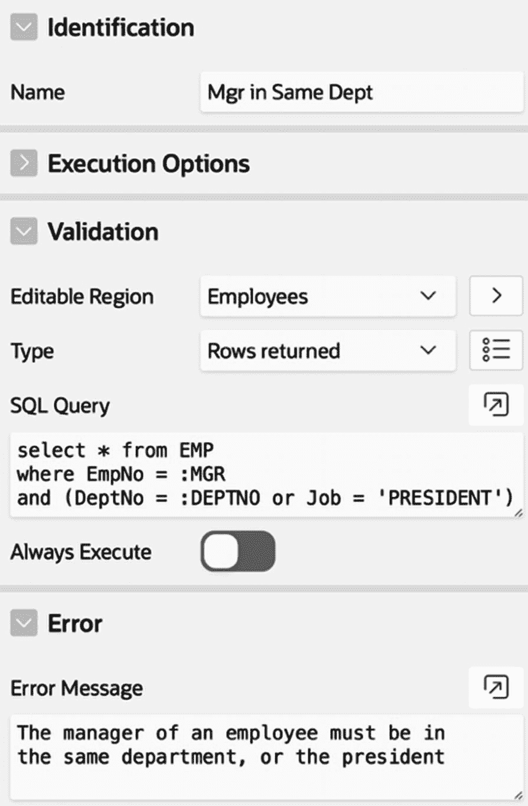

图 11-14
网格验证的属性

这里的`可编辑区域`属性至关重要。通过为此属性提供值，您指定了这是一个交互式网格验证，而不是基于项的验证。因此，当发生提交操作时（例如通过单击`保存`按钮），APEX 将对网格的每个已更改行应用该验证。
给定一个员工行，如果经理是总裁或与该员工在同一部门，验证查询会返回该员工的经理。换句话说，如果存在输出记录，则该行有一个合适的经理，从而满足`返回的行`验证类型。请注意，该查询使用绑定变量语法引用修改行的值；也就是说，它将修改行的单元格视为项。

#### 限制交互式网格输入
使用交互式网格进行更新的一个问题是，您可能希望某个单元格对于某些操作是可更新的，而对于其他操作则不可更新。例如，考虑`员工`网格中的`员工姓名`列。假设用户应该能够在插入时输入员工姓名，但随后不应能够编辑它。如何强制执行此限制？

想法是利用该列的`只读`属性。特别是，您需要指定该列的单元格对于除更新行之外的所有行都是只读的。要表达此规范，您需要知道每行的更新状态。

APEX 有一个名为`APEX$ROW_STATUS`的内置变量用于此目的。它对网格的每一行都有一个值，该值可以是四个值之一：

*   如果该行已被编辑，则状态为‘`U`’。
*   如果该行是插入行，则状态为‘`C`’（表示“已创建”）。
*   如果该行被标记为删除，则状态为‘`D`’。
*   如果该行未被更改，则状态为`null`。

图 11-15 展示了如何使用`APEX$ROW_STATUS`来指定`员工姓名`列的`只读` SQL 表达式。另请注意，`执行`属性的值为`每一行`，这告诉 APEX 将此表达式应用于网格中的每一行。

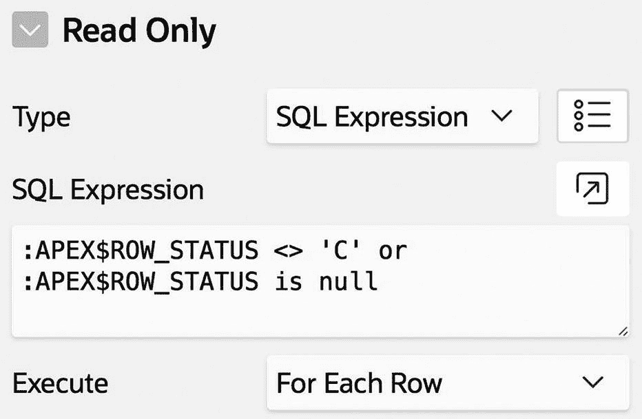

图 11-15
指定何时可以输入员工姓名值

前面的示例展示了如何保护列值。下一个示例展示了如何保护行值。假设您希望此页面的用户不能删除经理，并且不能编辑或删除总裁。这里的想法是利用网格的`允许的行操作列`属性。此属性出现在网格区域的`编辑`部分，如图 11-16 所示。

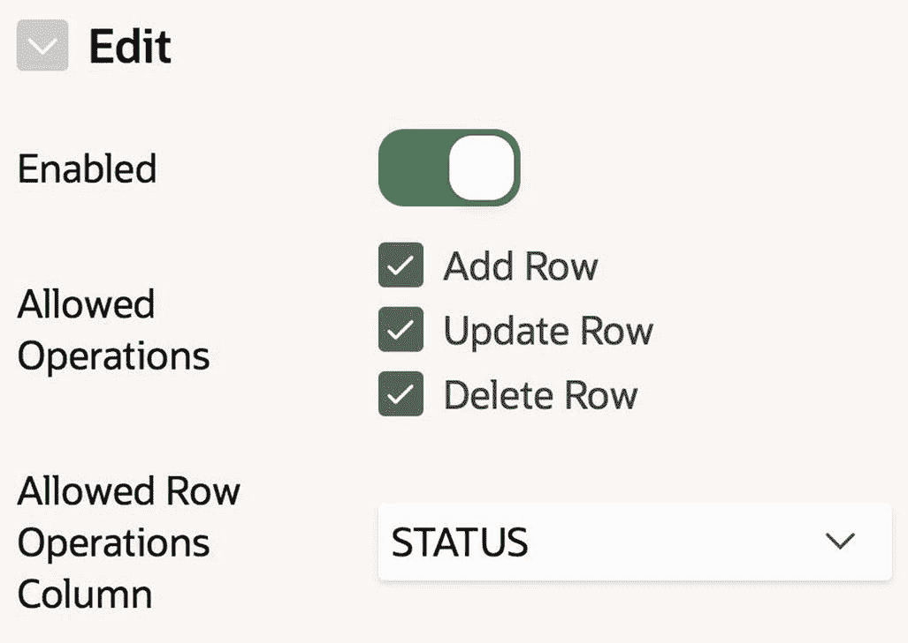

图 11-16
启用特定行的更新和删除

此属性也存在于表单中（例如，参见图 10-2），但到目前为止，您创建的页面都不需要它。它的目的是指示源查询中其值表示允许的行操作的列（如果存在的话）。在这样的列中，值‘`U`’表示该行只能更新，‘`D`’表示只能删除，‘`UD`’表示更新和删除都允许。任何其他值都表示该行不允许任何操作。例如，这是我为员工区域修订后的源查询：

```
select EMP.*,
case Job
when 'PRESIDENT' then ''
when 'MANAGER' then 'U'
else 'UD'
end as Status
from EMP
```

`状态`列的值由员工的工作决定。总裁的值将为空字符串，表示其无法更改；经理的值将为'U'，表示经理只能被更新；所有其他员工的值将为'UD'，表示允许更新和删除。图 11-17 显示了该区域修订后的`源`部分。

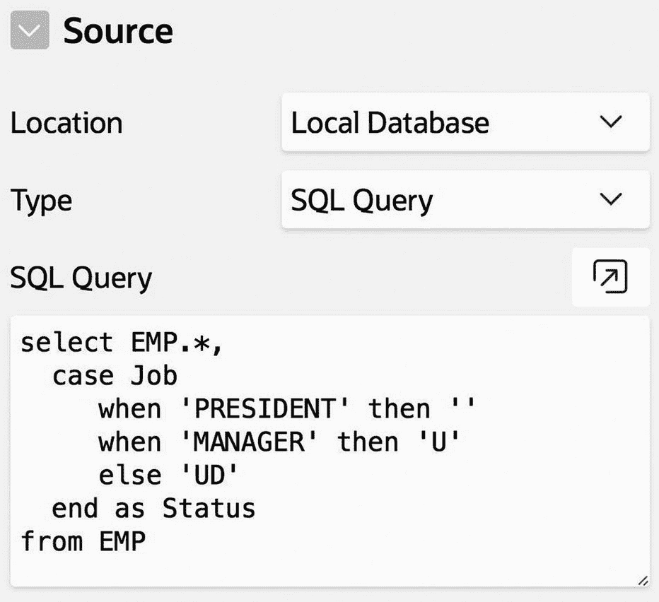

图 11-17
向网格的源添加一个行操作列

默认情况下，这个新的源列将在网格中显示为文本字段。此列可以作为一个有用的调试辅助工具。但最终，您需要将其类型设置为`隐藏`。


### 行保护实战

图 11-18 展示了页面的运行结果。可以看到，`president`（总裁）所在的行变为灰色，表明这些单元格不可编辑。（`Ename`列的单元格变灰是因为图 11-15 所示的只读规范。）图中未显示`CLARK`和`KING`的行操作菜单，其中`Delete Row`（删除行）菜单项是灰色的。

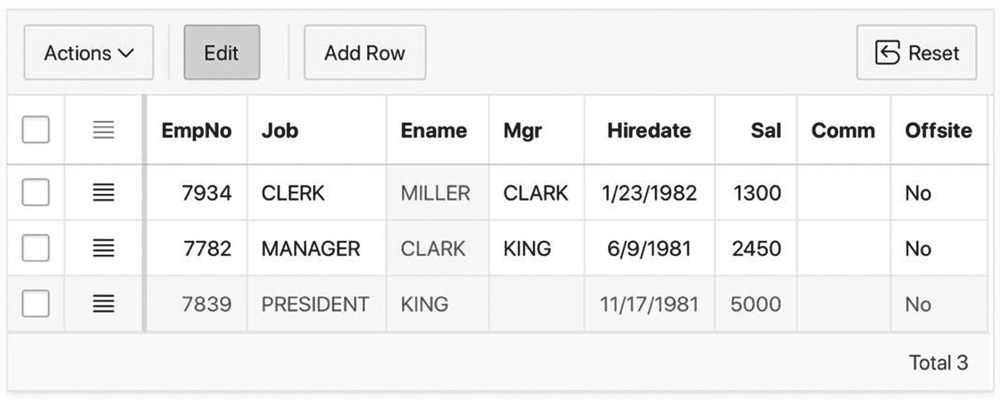

**图 11-18** 行保护实战

### 网格进程

每个网格区域都有自己的 ARP 进程，该进程为该区域实现数据库修改操作。如果你希望网格具备额外功能，则需要为其创建额外的进程。

第 7 章和第 10 章讨论的进程在每次提交请求时执行一次。然而，交互式网格的进程需要针对网格中每一行被修改的行执行一次。举个例子，考虑代码清单 7-13 中的`LogChanges`进程。该进程用于`修订后的员工数据录入`页面——每当用户单击`Delete`（删除）、`Insert`（插入）或`Update`（更新）按钮时，该进程就会向`EMPLOG`表中插入一条记录，标明请求、用户和日期。

### 修订 LogChanges 进程

你可以轻松地为`交互式网格`页面重新创建此进程。图 11-19 显示了相关的进程属性。除了一个属性外，这些属性值与第 7 章的进程完全相同——`可编辑区域`属性的值现在是`Employees`（员工）。这个值告诉 APEX，当进程执行时，其代码应应用于`Employees`网格中每个被更改的行。

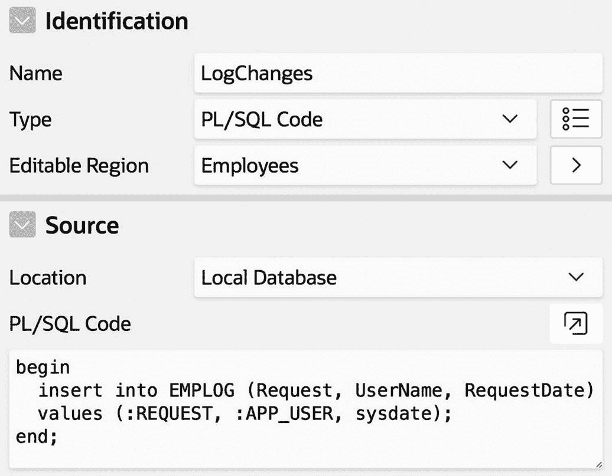

**图 11-19** LogChanges 进程

通过修改`Employees`网格的一些数据，然后查看 SQL Workshop 中的`EMPLOG`表来测试你的进程。该表应该为你所做的每次修改都有一条记录。不幸的是，所有记录看起来都一样——`Request`（请求）值要么是`APEX_AJAX_DISPATCH`（如果你使用了工具栏上的内置`SAVE`按钮），要么是`SAVE`（如果你使用了为图 11-13 编写的`SAVE`按钮）。这还不够好；`Request`字段的值应该更具信息性。

因此，让我们修改进程代码，使得`Request`字段的值包含行状态和被修改行的`EmpNo`值，例如"`update of 8830`"（8830 的更新）或"`insertion of 8200.`"（8200 的插入）。代码清单 11-1 包含了修订后的代码。注意，它使用`APEX$ROW_STATUS`来确定发生了哪种操作。

```sql
declare
  v_request varchar(20);
begin
  case :APEX$ROW_STATUS
    when 'U' then v_request := 'Update ';
    when 'C' then v_request := 'Insert ';
    when 'D' then v_request := 'Delete ';
  end case;
  v_request := v_request || :EMPNO;
  insert into EMPLOG (Request, UserName, RequestDate)
  values (v_request, :APP_USER, sysdate);
end;
```
*代码清单 11-1 修订后的 LogChange 进程的 PL/SQL 代码*

### 网格的自定义插入

你可能遇到的另一种情况是，网格内置的数据库修改代码不能满足你的需求。在这种情况下，APEX 允许你编写自己的 PL/SQL 代码来替换它。

举个简单的例子，考虑向一个不包含表所有字段的网格中插入新行的问题。内置的插入进程会给缺失的字段赋空值。但如果这还不够好呢？如果新记录需要非空的默认值怎么办？

要探索这个问题，请在`交互式网格`页面中创建一个新区域。将其命名为`CustomEmps`，类型设置为`交互式网格`，并将其模板设置为`标准`（以便与其上方的`按部门划分的员工`区域匹配）。其源应为：

```sql
select EmpNo, EName, Job, Sal, DeptNo
from EMP
```

别忘了打开`EMPNO`列的`主键`属性，并关闭其`需要验证`属性。然后转到`属性`节点的`编辑`部分并启用编辑。图 11-20 显示了生成区域的顶部。

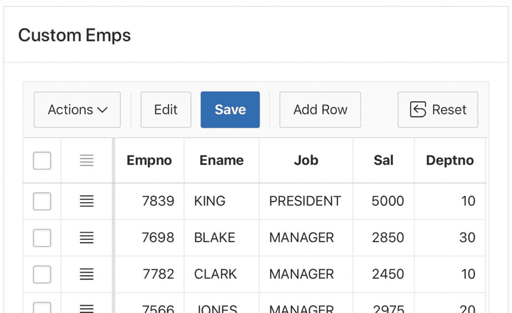

**图 11-20** Custom Emps 网格区域

手头的任务是修改该区域的插入代码，以便将默认值放入缺失的字段中。操作方法如下。

转到页面编辑器的`处理`选项卡，选择名为`Custom Emps-Save Interactive Grid Data`的进程节点。这是`Custom Emps`网格区域的内置 ARP 进程。图 11-21 显示了其`标识`和`设置`属性。这里的关键属性是`设置`部分中的`目标类型`。默认值`区域源`告诉 APEX 使用内置的修改进程。要将其替换为你的代码，请将该属性值更改为`PL/SQL 代码`。属性编辑器将显示一个文本框，你可以在其中输入代码。

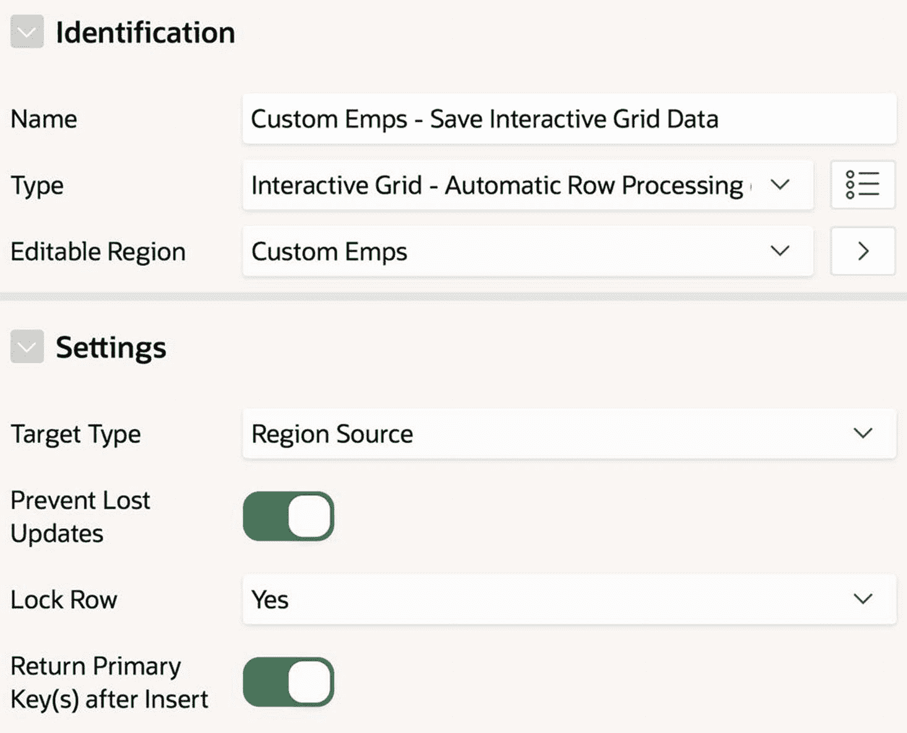

**图 11-21** 网格 ARP 进程的属性设置

你的自定义 PL/SQL 代码必须处理所有三种修改操作，即使你只更改了插入操作。代码清单 11-2 展示了我的代码。它使用 case 语句来确定需要执行的操作。删除和更新的代码是直接的 SQL 命令，与 ARP 进程的操作没有不同。插入的代码为四个缺失的列确定默认值：新员工的经理是总裁，雇佣日期是今天，初始佣金为 0，且员工不在外地工作。`insert`语句末尾的`returning`子句导致新生成的员工编号被保存在网格的会话状态中。

请注意，你的进程只需要处理单行。APEX 将遍历网格，为每个更改的行调用你的代码，并处理丢失的更新检测。

```sql
begin
  case :APEX$ROW_STATUS
    when 'C' then
      insert into EMP(EName, Job, Sal, DeptNo,
                      Mgr, HireDate, Comm, Offsite)
      values (:ENAME, :JOB, :SAL, :DEPTNO,
              7839, sysdate, 0, 'N')
      returning EmpNo into :EMPNO;
    when 'U' then
      update emp
      set EName  = :ENAME,
          Job    = :JOB,
          Sal    = :SAL,
          DeptNo = :DEPTNO
      where EmpNo  = :EMPNO;
    when 'D' then
      delete emp
      where EmpNo = :EMPNO;
  end case;
end;
```
*代码清单 11-2 自定义交互式网格修改代码*


## 总结

本章重点介绍了交互式网格——它们是什么、能做什么以及如何构建。首先探讨了其类报表的特性。在这方面，它们的外观和行为与交互式报表非常相似。交互式网格还具有一些额外的功能，最重要的是能够将两个网格区域链接成主从关系。

随后，本章讨论了如何使用交互式网格来更新数据库的问题。交互式网格拥有一个复杂且易于使用的界面，你可以在其中临时就地编辑值、添加行并初始化其值、删除现有行，然后根据需要撤销或保存这些更改。

交互式网格具有验证功能，以确保用户输入的适当性。你指定这些验证的方式与第 8 章相同。区别在于，APEX 会将验证代码应用于网格的每一行已修改行。你还可以使用网格的 `只读` 属性来限制用户更改指定行或列的值。

每个交互式网格都有一个内置进程来处理数据库的插入、删除和更新操作。如果你需要额外的功能，可以编写自己的进程。与验证类似，进程的代码仅引用网格中的一行；APEX 会将该进程应用于网格的每一行已修改行。实际上，你甚至可以替换掉默认的数据库处理代码，用自己的代码来代替。

