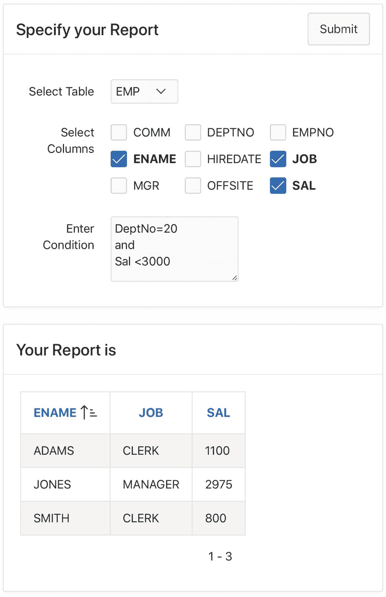
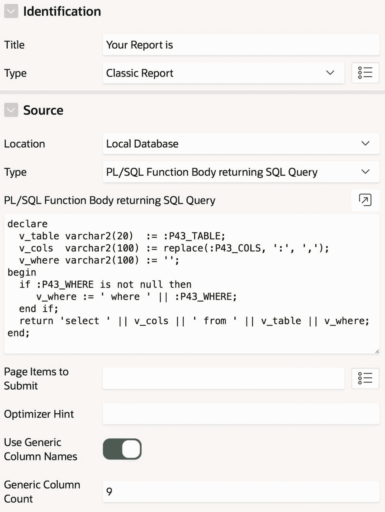
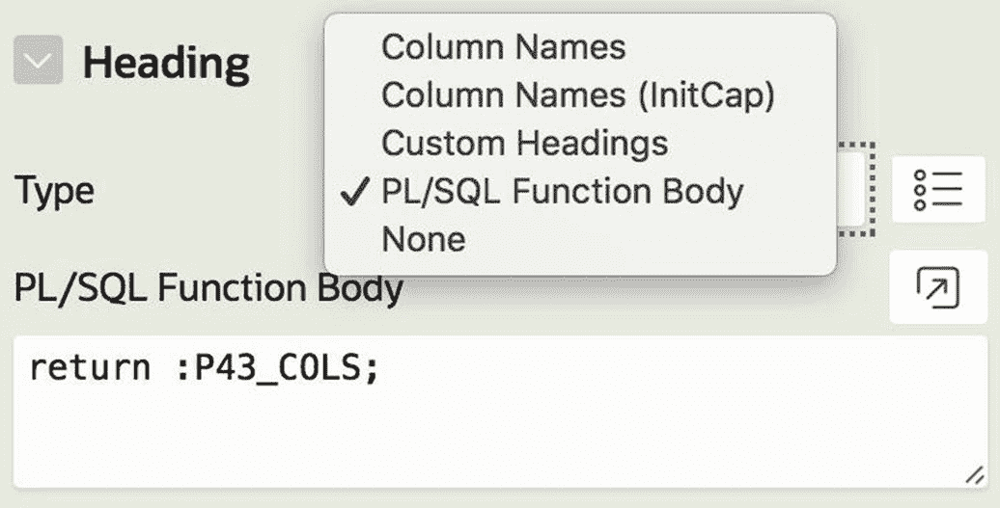
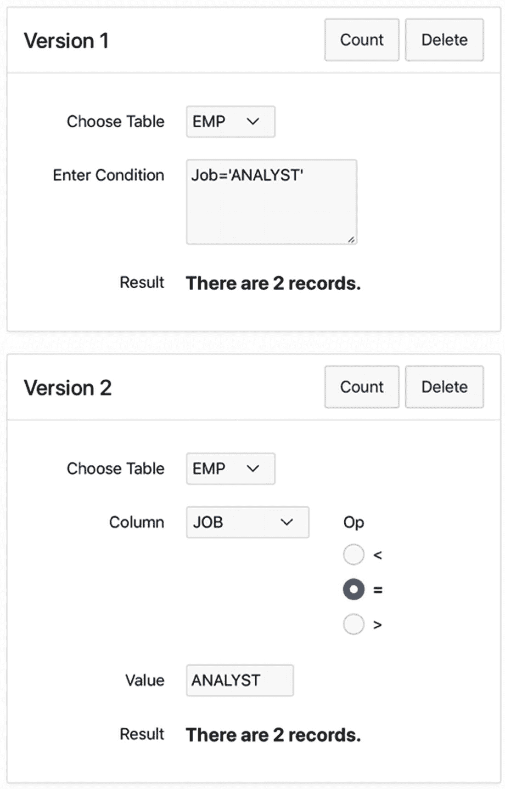
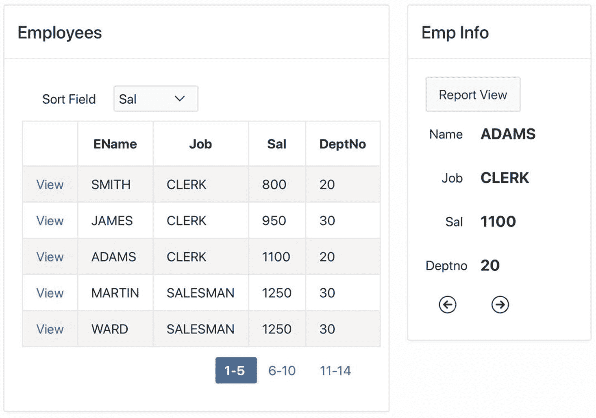
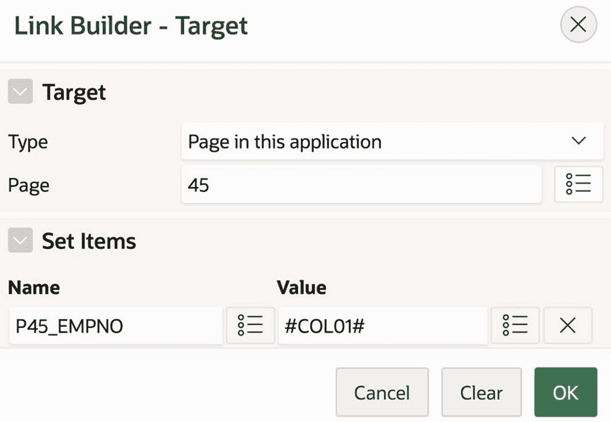

# 12. 动态 SQL

在本书中，你已经看到了许多使用会话状态值来定制页面的方法。例如，报表的 SQL 源查询是定制的一个很好的候选对象，访问数据库的进程中的 SQL 语句也是如此。这种定制大部分涉及 SQL 语句中的绑定变量引用。

然而，可以定制的内容是有限制的。对会话状态变量的引用可以替换 SQL 查询中的常量，但不允许替换表名或列名。本章探讨一种称为 `动态 SQL` 的技术，它通过使用 PL/SQL 代码在运行时构建并执行 SQL 语句来克服这一限制。你将学习如何将 `动态 SQL` 用作报表的来源或进程的内容，并查看三个需要 `动态 SQL` 的示例。

## 动态报表

考虑图 12-1 所示的 `报表构建器` 页面，这是 `员工演示` 应用程序的第 43 页。顶部区域中的项目使用户能够指定一个报表。用户选择所需的表，选择要显示的列，然后输入筛选条件的文本。点击提交按钮将在底部区域显示报表。


*图 12-1 报表构建器页面*

实现这两个区域需要什么？`指定您的报表` 区域相对简单。该区域有三个项目和一个按钮。`选择表` 项目名为 `P43_TABLE`。它是一个选择列表，显示相关表的名称，选中时不执行任何操作。在构建页面时，我将表名列表指定为静态值 `[EMP, DEPT]`。另一种可能性是通过以下查询指定列表，该查询利用了 Oracle 的 `User_Tables` 表：

```sql
select Table_Name as DisplayVal, Table_Name as ResultVal
from User_Tables
order by DisplayVal
```

`选择列` 项目名为 `P43_COLS`。它是一个复选框组，为所选表的每一列显示一个复选框。其值由以下查询定义，该查询利用了 Oracle 的 `User_Tab_Cols` 表：

```sql
select Column_Name as DisplayVal, Column_Name as ResultVal
from User_Tab_Cols
where Table_Name = :P43_TABLE
order by DisplayVal
```

此查询引用了 `P43_TABLE`，这意味着其显示的列列表将根据所选的表而变化。为了在 `P43_TABLE` 更改时更新此列表，请使用第 6 章的级联列表技术。也就是说，转到 `P43_COLS` 的 `值的级联列表` 部分，并将其 `父项` 属性设置为 `P43_TABLE`。

项目 `P43_WHERE` 是一个文本区域，用户可在其中输入筛选条件。此条件将用作报表源查询的 `where` 子句。

最后，`指定您的报表` 区域中的按钮在按下时执行提交操作。此操作会将这三个项目的值保存在会话状态中。

`您的报表是` 区域显示一个由这些项目的值定制的报表。实现该区域不那么直接。假设你尝试将其创建为经典报表；其源查询将类似于：

```sql
select :P43_COLS
from   :P43_TABLE
where  :P43_WHERE
```

问题在于这样的查询在语法上是不合法的。规则是绑定变量只能用于引用常量，而此查询试图引用列、表和 SQL 代码。为了解决这个问题，请将报表的源类型设置为 `返回 SQL 查询的 PL/SQL 函数体`。此类报表的源是一个 PL/SQL 函数，它计算所需的 SQL 查询并将其作为字符串返回。代码清单 12-1 显示了 `您的报表是` 报表的代码。

```sql
declare
  v_table varchar2(20)  := :P43_TABLE;
  v_cols  varchar2(100) := replace(:P43_COLS, ':', ',');
  v_where varchar2(100) := '';
begin
  if :P43_WHERE is not null then
    v_where := ' where ' || :P43_WHERE;
  end if;
  return 'select ' || v_cols || ' from ' || v_table || v_where;
end;
```
*代码清单 12-1 用于生成 SQL 查询的 PL/SQL 代码*

此代码逐段构建所需的 SQL 查询字符串。列列表的构建可能是唯一不那么直观的部分。回想一下，`P43_COLS` 是一个多值列表项，这意味着其值将是一个包含以冒号分隔的所选列名的字符串。然而，在查询中，列名需要用逗号分隔。因此，你需要做的就是使用 `replace` 函数将每个冒号替换为逗号，然后将该字符串赋值给变量 `v_cols`。

使用代码构建源查询的技术被称为 `动态 SQL`，因为查询是在运行时动态计算的。只要源查询的变化超出了简单的常量定制范围，`动态 SQL` 就是合适的。图 12-2 描绘了 `您的报表是` 区域的 `标识` 和 `源` 属性。


*图 12-2 实现报表构建器报表区域*

使用 `动态 SQL` 的后果之一是，报表的列可能直到运行时才知晓。在这种情况下，你必须告诉 APEX 为报表定义 `通用` 列名。你可以通过属性 `使用通用列名` 来实现，该属性可在图 12-2 的底部看到。启用该属性后，会出现 `通用列数` 属性，供你指定要创建的通用列数。图 12-2 指定了列数为 9，这意味着 APEX 将为报表生成 9 列。这些列的名称将是 `COL01`、`COL02`，一直到 `COL09`。此指定的计数是最大值；如果报表恰好使用了更少的列（如图 12-1 所示），则其他列将被忽略。


回顾一下，列的默认标题是其名称。因此，你应该为每个通用列赋予一个更合适的标题。通常，你会直接在列的 `Heading` 部分指定其标题。但由于你只有在运行时才能知道每一列的含义，因此需要使用不同的方法。这正是报表的 `Heading` 部分的用途。该部分可以在报表渲染树的 `Attributes` 节点中找到。图 12-3 展示了五种可能的标题类型。前三种类型基于列名创建标题，这在这里不合适；最后一种类型不指定任何标题。因此，处理通用列的最佳选择是使用 `PL/SQL Function Body` 这种标题类型。



**图 12-3**
为通用列指定标题

当你选择该标题类型时，APEX 将显示一个用于输入 PL/SQL 代码的文本区域；该代码应返回一个包含以冒号分隔的列标题列表的字符串。在此示例中，复选框组 `P43_COLS` 恰好包含你需要的内容，因此你的代码可以简单地返回其值，如图 12-3 底部所示。在更复杂的情况下，你可以编写一个 PL/SQL 块来计算所需的字符串。

当你运行页面时，在你至少选择一列之前，报表将显示以下错误信息：

```
failed to parse SQL query: ORA-00936: missing expression
```

原因是当 `P43_COLS` 为空时，图 12-2 中生成的 SQL 字符串以“`select from ...`”开头，这不是合法的 SQL。避免这种情况的一个好方法是条件渲染报表区域。具体来说，将其 `Condition Type` 属性设置为：

```
P43_COLS is not null
```

## 动态进程

第 7 章演示了从 PL/SQL 块执行 SQL 语句是多么简单：你只需将该语句直接放在块内，并使用绑定变量对其进行参数化。然而，该语法对于动态 SQL 来说并不足够。本节将探讨相关问题及其解决方案。

以图 12-4 所示的 `Count and Delete` 页面为例，它是 `Employee Demo` 应用的第 44 页。此页面包含两个功能基本相同的区域。在每种情况下，用户选择一个表并为其指定一个过滤条件。每个区域都有两个相同的按钮：`Count` 按钮显示满足条件的记录数量的消息，`Delete` 按钮从表中删除这些记录。图 12-4 显示了在两个区域中单击 `Count` 按钮后的结果。



**图 12-4**
Count and Delete 页面

图 12-4 中的两个区域显示了相同的过滤条件：职位是分析师的员工。这两个区域仅在用户指定条件的方式上有所不同。在 `Version 1` 区域中，用户可以输入任意条件，类似于 `Report Builder` 页面。在 `Version 2` 区域中，用户通过选择特定列、运算符和值来组合条件。这第二种指定条件的方式不需要 SQL 语法知识，可能对用户更友好，但它限制了可以表达的条件类型。

此页面上的项目和按钮的创建是直截了当的。`Version 1` 区域有三个项目：项目 `P44_TABLE1` 是一个选择列表，具有静态值 [`DEPT, EMP]`；项目 `P44_WHERE1` 是一个文本区域；`P44_RESULT1` 是只读显示项。其按钮名为 `Count1` 和 `Delete1`，它们的操作是 `Submit Page`。

`Version 2` 区域有五个项目。项目 `P44_TABLE2` 的定义与 `P44_TABLE1` 相同。项目 `P44_COLUMN2` 是一个选择列表，其级联父项为 `P44_TABLE2`；其值由此 SQL 查询定义：

```
select Column_Name as DisplayVal, Column_Name as ResultVal
from User_Tab_Cols
where Table_Name = :P44_TABLE2
order by DisplayVal
```

项目 `P44_VALUE2` 是一个文本字段，`P44_RESULT2` 是一个只读显示项。项目 `P44_OP2` 是一个单选按钮组，具有三个静态值 `[<, =, >]`。其 `Template` 属性是 `Optional-Above`，以便标签可以显示在单选按钮组上方。该区域的按钮名为 `Count2` 和 `Delete2`，它们的操作是 `Submit Page`。

此页面最有趣的方面是如何为四个按钮编写进程。每个进程执行相同的三个任务：

*   它构建一个包含适当 SQL 命令的字符串。
*   它执行该字符串。
*   它使用执行结果来制定输出消息。

动态报表的源代码只需要执行第一项任务，因为 APEX 在渲染报表时会执行查询字符串。而进程则没有这种便利，它必须显式地执行 SQL 字符串。

执行 SQL 字符串的 PL/SQL 命令称为 `execute immediate`。该命令的使用有些复杂——事实上，四个按钮进程中的每一个使用它的方式都略有不同。让我们依次检查每个进程。

首先，考虑按钮 `Delete1`。它的进程也名为 `Delete1`，需要执行一个 SQL 删除命令。大多数时候，你可以直接将命令写为 PL/SQL 语句；但在这种情况下，你直到运行时才会知道表及其 `where` 子句。因此，你需要使用 `execute immediate` 命令，如清单 12-2 所示。

```
declare
  v_cmd varchar2(100);
begin
  v_cmd := 'delete from ' || :P44_TABLE1 || ' where ' || :P44_WHERE1;
  execute immediate v_cmd;
  :P44_RESULT1 := SQL%rowcount || ' records were deleted.';
end;
```
**清单 12-2**
Delete1 进程的代码

第一条语句使用所选表和指定条件将 SQL 删除命令构建为一个字符串。第二条语句以最基本的形式使用 `execute immediate` 命令：你只需将 SQL 字符串传递给它。第三条语句通过使用 `SQL%rowcount` 函数（在清单 7-11 中介绍过）为结果项目赋值。

现在考虑按钮 `Count1`。它的进程名为 `Count1`，需要执行一个查询来计算记录数，并将检索到的值保存在一个变量中。清单 7-4 展示了如何使用 SQL 查询的 `into` 子句来实现此目的。例如，如果你不必使用动态 SQL，你可以像这样编写对应于图 12-4 的查询：

```
select count(*) into v_count
from EMP
where Job = 'ANALYST'
```


然而，在动态 SQL 中，`into` 子句是与 `execute immediate` 命令关联的，而不是与 SQL 查询关联。清单 12-3 展示了正确的代码。

```sql
declare
  v_query varchar2(100);
  v_count integer;
begin
  v_query := 'select count(*) from ' || :P44_TABLE1 ||
             ' where ' || :P44_WHERE1;
  execute immediate v_query
    into v_count;
  :P44_RESULT1 := 'There are ' || v_count || ' records.';
end;
Listing 12-3
Count1 进程的代码
```

现在考虑按钮 `Delete2`（进程也命名为 `Delete2`）的处理过程。编写此进程的主要问题在于如何处理字符串常量。请注意，图 12-4 中的值 `ANALYST` 没有加引号。因此，如清单 12-4 所示的简单方法将不起作用。

```sql
declare
  v_cmd varchar2(100);
begin
  v_cmd := 'delete from ' || :P44_TABLE2 ||
           ' where ' || :P44_COLUMN2 || :P44_OP2 || :P44_VALUE2;
  execute immediate v_cmd;
end;
Listing 12-4
Delete2 进程的不正确代码
```

问题在于，如何让查询在值是字符串时给它加上引号，而在值是数字时不加。解决方案（正如你在第 3 章看到的）是使用绑定变量引用。例如，你希望为 `Delete2` 进程生成的查询应该像这样：

```sql
select count(*) from EMP into v_count
where Job = :P44_VALUE
```

然而，`execute immediate` 命令对绑定变量很挑剔。具体来说，该命令不允许在生成的查询中使用绑定变量；相反，它专门为此目的提供了一个 `using` 子句。清单 12-5 给出了 `Delete2` 进程的正确代码。

```sql
declare
  v_cmd varchar2(100);
begin
  v_cmd := 'delete from ' || :P44_TABLE2 ||
           ' where ' || :P44_COLUMN2 || :P44_OP2 || ' :1';
  execute immediate v_cmd
    using :P44_VALUE2;
  :P44_RESULT2 := SQL%rowcount || ' records were deleted.';
end;
Listing 12-5
Delete2 进程的正确代码
```

请注意，生成的查询中，绑定变量所在的位置是表达式 "`:1`"。这个表达式是一个占位符。当 `execute immediate` 命令运行时，它将用其 `using` 子句中的值替换这个占位符。如果查询需要多个绑定变量，则使用多个占位符，`using` 子句中的绑定变量用逗号分隔。

在清单 12-5 中，只有一个占位符 `:1`。占位符的功能与过程的形式参数相同。实际上，`execute immediate` 语句“调用”了 SQL 语句，并向其传递每个绑定变量引用的值。占位符的名称无关紧要。APEX 会按照占位符在 SQL 语句中出现的顺序，将 `using` 子句中的值分配给它们。

最后，按钮 `Count2`（进程也命名为 `Count2`）的处理过程如清单 12-6 所示。请注意，构造的字符串是一个查询并使用了绑定变量；因此，`execute immediate` 命令将同时使用 `into` 和 `using` 子句。

```sql
declare
  v_query varchar2(100);
  v_count int;
begin
  v_query := 'select count(*) from ' || :P44_TABLE2 ||
             ' where ' || :P44_COLUMN2 || :P44_OP2 || ' :1';
  execute immediate v_query
    into v_count
    using :P44_VALUE2;
  :P44_RESULT2 := 'There are ' || v_count || ' records.';
end;
Listing 12-6
Count2 进程的代码
```

## 结合动态报表和进程

作为最后一个例子，我想重新考虑图 7-17 中的 `单行视图` 页面，它是 `员工演示` 应用的第 20 页。回想一下，该页面显示一个所有员工的报表，按 `EName` 排序。当用户选择一名员工时，页面切换到单行模式，显示所选行的数据，并提供按钮以按排序顺序导航到上一行和下一行。

任务是修改此页面，使用户能够动态更改行的排序顺序。图 12-5 展示了名为 `可排序单行视图` 的新页面，它是演示应用的第 45 页。该页面与单行视图页面相同，只是多了一个用于指定所需排序字段的选择列表。选择排序字段将导致报表按该顺序重新显示；此外，点击 `上一个` 或 `下一个` 按钮将使用该排序顺序来确定新的当前行。



图 12-5
可排序单行视图页面

与图 7-17 一样，图 12-5 同时显示了 `员工` 和 `员工信息` 区域，尽管一次只显示其中一个。

创建此页面的最简单方法是复制第 20 页。此操作在第 7 章讨论过（见图 7-8）。回顾一下，转到任意页面的页面设计器，点击顶部的 **+** 图标，然后选择 `复制页面` 以启动 `页面复制` 向导。如果操作向导有困难，请回顾第 7 章。

复制页面时，必须确保更新其各种项目引用。事实证明，PL/SQL 代码内的项目引用会被更新，但由链接生成器产生的引用不会。因此，`EMPNO` 列的链接目标会错误地重定向到第 20 页并设置 `P20_EMPNO` 的值。通常，你应该更正这些值，但在这种情况下没有必要，因为你即将用新列替换它们。

成功复制页面后，就可以对其进行修改。第一个修改是在 `员工` 区域添加一个选择列表，以便用户可以选择排序字段。此选择列表命名为 `P45_SORTFIELD`，其静态值为 `[EName, Job, Sal, DeptNo]`。其操作应设置为 `重定向并设置值`。

可更改的排序字段会影响页面的两个部分：报表的源查询和在单记录模式下计算下一条/上一条记录的进程。在这两种情况下，你都需要使用动态 SQL。报表的源查询由清单 12-7 的 PL/SQL 代码生成。

```sql
declare
  v_sort varchar2(20);
begin
  if :P45_SORTFIELD is null then
    v_sort := 'EName';
  else
    v_sort := :P45_SORTFIELD;
  end if;
  return 'select EmpNo, EName, Job, Sal, DeptNo from EMP ' ||
         'order by ' || v_sort;
end;
Listing 12-7
员工报表的 PL/SQL 源代码
```

此查询使用动态 SQL 根据所选的排序字段构建适当的查询。如果未选择排序字段，则默认为 `EName`。由于使用了动态 SQL，你应该启用 `使用通用列名` 属性，并将 `通用列数` 指定为 `5`。APEX 将创建五个列，命名为 `COL01` 到 `COL05`。由于无论排序字段如何，此报表中的列标题都相同，你可以将它们硬编码到报表的 `标题` 部分。具体来说，`PL/SQL 函数体` 属性的值将为：

```sql
return ':EName:Job:Sal:DeptNo';
```

此字符串以冒号开头，因为第一列的标题为空。


你还需要为第一列指定链接。回想一下，它的名称是`COL01`，即使它包含的是`EmpNo`值。因此，从渲染树中选择`COL01`，并将其类型设置为`Link`。点击它的`Link Target`属性，并按照图 12-6 所示配置`Link Builder`向导。然后，将该列的`Link Text`属性设置为`View`。



图 12-6
指定列链接的行为

你还需要配置报表列的可排序性。回顾第 3 章，经典报表中的每个列都有一个名为`Sortable`的属性——将其值开启可使用户通过点击列标题对该列进行排序，关闭则会禁用对该列的排序。问题在于，当源查询也有`order by`子句时，APEX 应如何处理可排序性。APEX 对此问题的解决方案因列是否为通用列而异。如果列不是通用的，那么`order by`子句优先——每个列的`Sortable`属性将被关闭且无法开启。另一方面，如果列是通用的，那么它们的`Sortable`属性优先——默认情况下是开启的，并且源查询的`order by`子句会被忽略。APEX 仅在每个列的`Sortable`属性被关闭时才会识别`order by`子句。换句话说，如果你希望报表按照`P45_SORTFIELD`的值排序，那么你必须关闭`Employees`报表中五个通用列的`Sortable`属性。

现在你应该拥有一个可以工作的可排序报表了。测试一下。选择一个排序字段应会导致报表以新的排序顺序重新渲染，点击某一行的链接应显示所选行的`Emp Info`区域。

剩下的问题是`Previous`和`Next`按钮仍在使用`EName`作为排序字段。你需要修改支撑这些按钮的过程，使其引用`P45_SORTFIELD`而不是`EName`。这个过程在第 7 章中被称为`FindPreviousNext`，其代码出现在清单 7-18 中。作为参考，清单 12-8 重新打印了该代码。

```
begin
if :P20_EMPNO is not null then
select PrevEmp, NextEmp
into :P20_PREV, :P20_NEXT
from (select EmpNo, lag(EmpNo)  over (order by EName) as PrevEmp,
lead(EmpNo) over (order by EName) as NextEmp
from EMP)
where EmpNo = :P20_EMPNO;
end if;
end;
```

清单 12-8
FindPreviousNext 过程的原始代码

修改后的代码出现在清单 12-9 中。尽管这段代码看起来很复杂，但它本质上是将原始代码拆分成片段并转化为动态 SQL。初始的 if 语句处理了未选择排序字段的情况。

```
declare
v_subquery varchar2(200);
v_query    varchar2(250);
v_sort     varchar2(20);
begin
if :P45_EMPNO is not null then
if :P45_SORTFIELD is null then
v_sort := 'EName';
else
v_sort := :P45_SORTFIELD;
end if;
v_subquery :=
'select EmpNo, ' ||
'lag(EmpNo)  over (order by ' || v_sort || ') as PrevEmp, ' ||
'lead(EmpNo) over (order by ' || v_sort || ') as NextEmp ' ||
'from EMP';
v_query := 'select PrevEmp, NextEmp ' ||
'from (' || v_subquery || ') ' ||
'where EmpNo = :1';
execute immediate v_query
into :P45_PREV, :P45_NEXT
using :P45_EMPNO;
end if;
end;
```

清单 12-9
FindPreviousNext 过程的修订代码

## 总结
本章探讨了一些需要在 SQL 查询中自定义表名和列名的情况。你学习了如何使用动态 SQL 在运行时构造并执行 SQL 查询字符串来处理此类情况。在自定义报表的案例中，你学习了如何使用 PL/SQL 函数生成报表的源。在自定义 PL/SQL 过程的案例中，你学习了如何使用其 `execute immediate` 命令。动态 SQL 迫使 APEX 在运行时验证和处理查询字符串；这种额外的开销增加了处理页面的时间。此外，在下一章中，你将看到动态 SQL 的使用可能为潜在的安全漏洞打开一扇窗。因此，动态 SQL 应仅在必要时使用。这种情况很少发生，但了解如何处理它们是好的。

