# 13. 安全
当你创建 `Employee Demo` 应用程序时，你选择将访问权限限制为那些在你工作区拥有账户的人。此限制是 APEX 用于限制访问的几种功能之一。这些功能可分为 *认证* 和 *授权*：认证用于识别合法用户，授权则指定每个合法用户被允许查看哪些信息。本章将探讨这些功能，以及如何保护数据免受恶意用户侵害的相关问题。

## 认证
认证是识别应用程序当前用户的能力。APEX 用户通过提供用户名和密码来表明身份。APEX 支持几种可能的 *认证方案*，它们以不同的方式并在不同的组织级别维护用户/密码列表。

以下是四种常见的认证方案，从最通用到最不通用排序：

*   *LDAP 目录方案*：用户/密码列表在组织的 LDAP 目录中维护。此方案允许组织为每个人分配一个账户，用于该组织维护的所有系统。由此带来的管理便利性通常使 LDAP 成为许多组织的首选认证方案。
*   *数据库账户方案*：用户/密码列表在 Oracle 数据库系统中维护。此方案允许用户为多个基于 Oracle 的系统（包括 APEX 应用程序）使用一个账户。此方案的缺点是用户也将拥有直接访问 Oracle 数据库的权限，这可能不是期望的。
*   *Application Express 账户方案*：这是当前 `Employee Demo` 应用程序的授权方案。用户/密码列表在应用程序的工作区内维护。工作区的 APEX 管理员管理该列表。如果一个人需要访问不同工作区的应用程序，则需要为每个工作区拥有一个账户。
*   *自定义方案*：应用程序所有者维护用户/密码列表。每个人需要为每个此类应用程序拥有一个独立的账户。自定义方案常用于允许人们创建和管理自己账户的应用程序。

此外，还有一种方案是应用程序不执行任何认证。APEX 将其视为 *无认证* 认证方案。

### 管理认证方案
一个 APEX 应用程序可以包含多个认证方案，但一次只能有一个方案是当前的。要创建一个方案，请转到应用程序的主页，点击 `Shared Components` 按钮，找到 `Security` 部分，并选择 `Authentication Schemes`。

你将进入一个屏幕，其中列出了为你的应用程序创建的认证方案。你应该看到列出了一个方案，即你在创建应用程序时选择的方案；参见图 13-1。


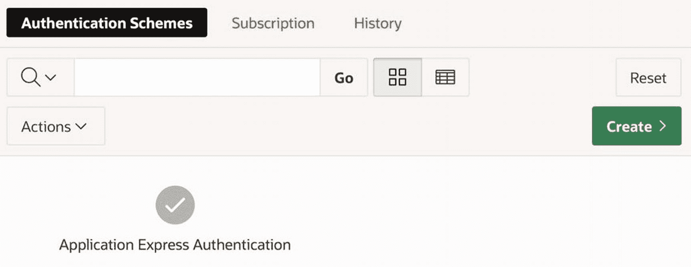
图 13-1 认证方案屏幕

要创建其他方案，请单击 `Create` 按钮。创建向导的第一个屏幕如图 13-2 所示。

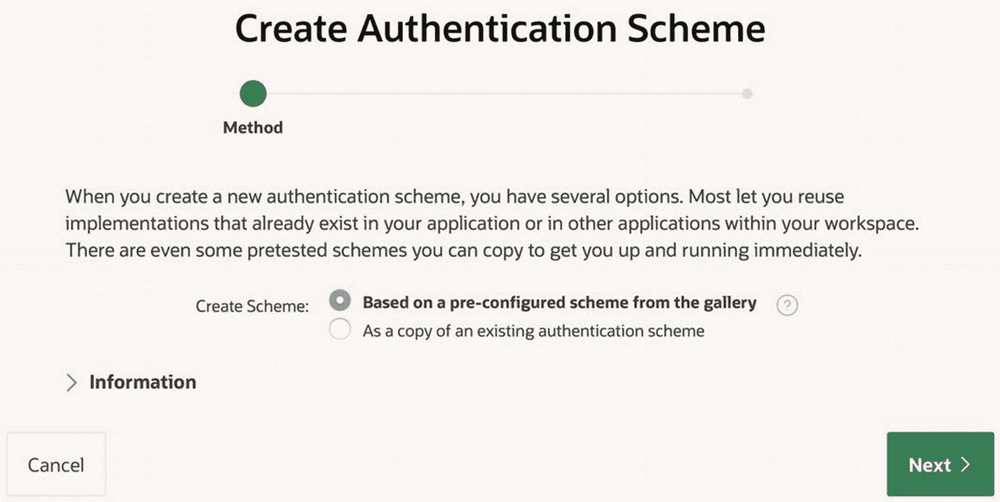
图 13-2 第一个“创建认证”向导屏幕

选择选项 `Based on a pre-configured scheme from the gallery` 并单击 `Next`，进入第二个向导屏幕，如图 13-3 所示。该屏幕要求您为新方案命名并选择方案类型。根据类型的不同，您可能需要填写其他信息。然后单击 `Create Authentication Scheme` 按钮来创建方案。

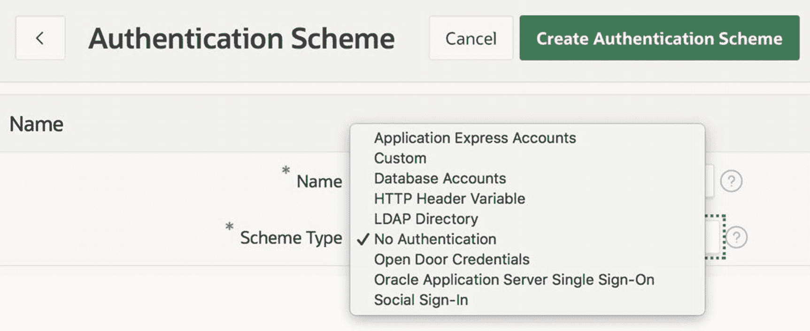
图 13-3 第二个“创建认证”向导屏幕

每次创建新的认证方案时，APEX 都会使其成为当前方案。如果您想切换到不同的方案，请返回方案列表，单击与方案对应的图标，然后单击 `Make Current Scheme` 按钮。如果您想删除一个方案，请确保它不是当前方案，单击其图标，然后单击 `Delete` 按钮。为了体验一下，创建一个 `No Authentication` 方案并将其设为当前方案。当您运行应用程序时，您将直接进入第一个页面，而无需经过 `Login` 页面。如果您有 Oracle 数据库账户，请创建一个 `Database Accounts` 方案，将其设为当前方案，并以这种方式登录。如果您可以访问 LDAP 服务器，可以尝试创建一个 `LDAP Directory` 方案。您需要将必要的配置信息（例如 LDAP 服务器的主机名和可分辨名称字符串）输入到创建屏幕中。但请注意，LDAP 服务器通常位于防火墙内部。如果 APEX 服务器运行在与 LDAP 服务器不同的域中，您可能会遇到防火墙问题，导致此方案无法使用。

最后，创建一个 `Custom` 认证方案。当您在图 13-3 中选择方案类型 `Custom` 时，向导将显示名为 `Settings` 和 `Source` 的附加部分。图 13-4 显示了这些部分，并填写了关键属性。

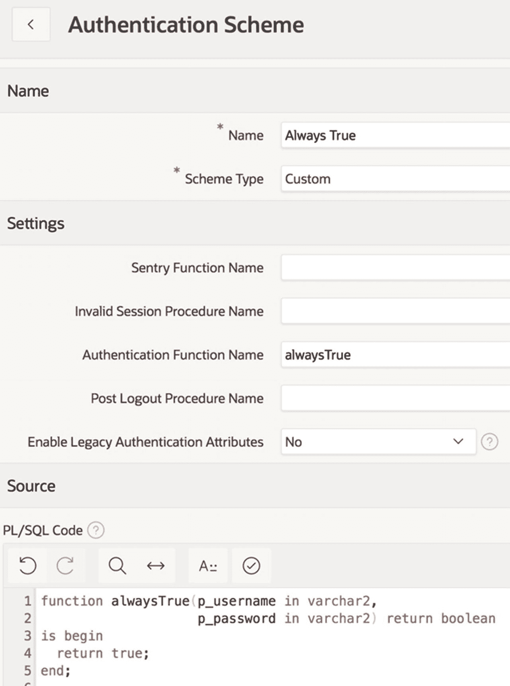
图 13-4 自定义认证方案的属性

`Settings` 部分允许您指定四个函数，但通常只使用 `Authentication Function Name` 属性。每次尝试登录时都会调用认证函数。其返回值将为 `true` 或 `false`，指示登录是否应成功。`Settings` 部分只要求提供函数的名称；APEX 期望该函数在其他地方定义。通常，该函数将作为存储过程在数据库中定义，但如果不是，`Source` 部分提供了一个位置供您输入所需的代码。认证函数必须具有名为 `p_username` 和 `p_password` 的参数。当用户提交 `Login` 页面时，APEX 会调用认证函数，并将指定的用户名和密码分配给这些参数。图 13-4 中给出的认证函数是最简单的认证函数——它忽略用户名和密码，并始终返回 true。您可以自己尝试一下。创建一个具有 `alwaysTrue` 认证函数的自定义认证方案，并使其成为当前的认证方案。当您运行应用程序时，`Login` 页面会要求您输入用户名和密码，但会接受您输入的任何内容。

### 编写认证函数

既然您了解了自定义认证的工作原理，是时候实现一个更有用的认证函数了。以下部分讨论了三个重要问题：如何存储用户名和密码信息、如何管理用户账户以及如何对用户进行认证。

#### 存储用户名/密码信息

存储用户名/密码信息的标准方法是创建一个表；我们称这个表为 `USERS`。`USERS` 表将有三列：`UserName`、`Password` 和 `IsAdministrator`。这第三列指示用户是否具有管理权限。此外，您应该创建两个“内置”用户：一个用户 `ADMIN`，他是密码为 `1234` 的管理员；以及一个用户 `GUEST`，他不是管理员且密码为 `null`。这些任务都可以在 SQL 命令工具中执行。代码清单 13-1 给出了相应的 SQL 语句，应单独执行。

```
create table USERS (UserName varchar2(12), Password varchar2(1000),
IsAdministrator char(1));
insert into USERS (UserName, Password, IsAdministrator)
values ('ADMIN',
apex_util.get_hash(apex_t_varchar2('ADMIN','1234'), null),
'Y');
insert into USERS (UserName, Password, IsAdministrator)
values ('GUEST',
apex_util.get_hash(apex_t_varchar2('GUEST',null), null),
'N');
```
代码清单 13-1 USERS 表的 SQL 语句


## 密码处理

密码的处理方式需要一些说明。出于安全考虑，密码应始终以编码形式存储，而非明文。清单 13-1 使用了函数 `apex_util.get_hash` 来执行编码。该函数在第 7 章中介绍，并曾用于丢失更新检测。回想一下，该函数接受一个值集合作为输入，并生成一个字符串作为输出。构造函数 `apex_t_varchar2` 从其参数创建值集合。例如，`ADMIN` 的编码密码是调用哈希函数时以集合 `['ADMIN','1234']` 作为输入的输出结果。

使用哈希函数进行密码编码的原因在于它能混淆输入值——仅凭函数的输出，他人实际上无法确定其输入。因此，您可以放心，即使数据库系统遭到入侵（例如，硬盘被盗），入侵者也无法轻易利用已编码的密码信息。

清单 13-1 中的哈希密码将用户名作为哈希值的一部分。这种技术通过挫败以下攻击，在一定程度上提高了安全性：入侵者创建一个账户，然后为其创建一系列密码，并记下每个密码的哈希值。然后，入侵者可以将这些哈希密码与从 `USERS` 表中窃取的密码进行比较。假设检测到匹配项。如果用户名不是哈希值的一部分，那么入侵者很可能发现了某个用户的密码。但是，如果用户名是哈希值的一部分，那么检测到匹配项对入侵者来说毫无意义。

`apex_util.get_hash` 函数有两个参数：第一个是要哈希的值集合，第二个参数是一个布尔值。清单 13-1 中的第二个参数是 `null`，这被视为 `false`。在第 7 章中，该函数仅使用一个参数调用，这意味着第二个参数值为 `true`。第二个参数指示函数是否应将会话 ID 添加到输入值中。如果哈希值包含会话 ID，安全性会更高，但这样它就只能在该会话的范围内使用。因为丢失更新检测发生在一个会话内，所以使用 `true` 作为第二个参数是合理的，这正是第 7 章中的情况。然而，密码编码是跨会话的，因此必须使用 `false`（或 `null`）作为第二个参数。

## 添加用户账户

您的 `Employee Demo` 应用程序需要一种方法向 `USERS` 表添加其他行。图 13-5 展示了一个名为 `管理用户` 的页面，用于此目的；它将是应用程序的第 46 页。该页面有两个区域：`所有用户` 区域列出来自 `USERS` 的记录，而 `创建用户` 区域允许您向该表添加用户。（请注意，截图截断了 `所有用户` 区域中的密码值以节省空间。）

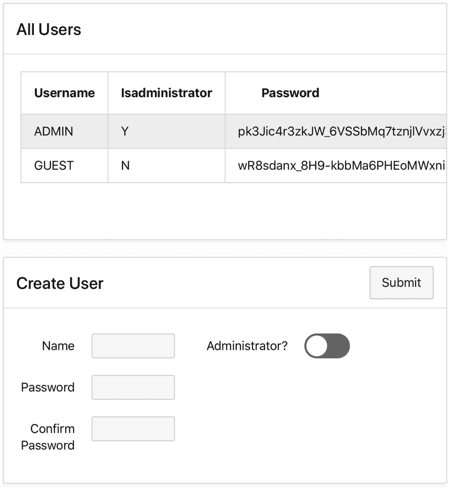
*图 13-5 演示应用程序的管理用户页面*

`所有用户` 区域是一个经典报表，其数据源是 SQL 查询：

```sql
select UserName, IsAdministrator, Password
from USERS
```

我将编码后的密码放在报表中仅用于演示目的。在真实的应用程序中，不应显示编码后的密码——这些值没有有用的管理用途，显示它们会增加密码被破解的可能性。

`创建用户` 区域包含四个项目和一个提交按钮。这些项目定义如下：

*   `P46_NAME` 的类型为 `纯文本`。
*   `P46_ADMIN` 的类型为 `开关`。
*   `P46_PASSWORD` 和 `P46_CONFIRM` 的类型为 `密码`。

图 13-5 显示了在添加名为 `JOE` 的非管理员用户（密码为“`joe`”）之前此页面的内容。虽然此用户名是以小写输入的，但为了确保用户名不区分大小写，它将在表中以大写保存。当然，密码将使用哈希函数保存为编码字符串。

当您点击提交按钮创建新用户账户时，将执行两项验证和一个处理过程。一项验证确保所选用户名尚未出现在 `USERS` 表中。此验证的类型为 `未返回行`，并由以下查询定义：

```sql
select * from USERS
where UserName = upper(:P46_NAME)
```

另一项验证确保两个密码相同。此验证的类型为 `SQL 表达式`，并由以下代码定义：

```sql
(:P46_PASSWORD = :P46_CONFIRM) or
(:P46_PASSWORD is null and :P46_CONFIRM is null)
```

验证的第二行考虑了密码可能为 `null` 的情况。

该处理过程将用户名转换为大写，对密码进行哈希处理，然后向 `USERS` 表插入一条记录。其代码见清单 13-2。

```sql
declare
    v_username     varchar2(20) := upper(:P46_NAME);
    v_valuesToHash apex_t_varchar2 :=
        apex_t_varchar2(v_username, :P46_PASSWORD);
begin
    insert into USERS (UserName, Password, IsAdministrator)
    values (v_username,
            apex_util.get_hash(v_valuesToHash, null),
            :P46_ADMIN);
end;
```
*清单 13-2 用于创建新用户的代码*

## 用户身份验证

既然您有了创建用户的方法，就需要创建一个方案来对他们进行身份验证。返回到应用程序的 `身份验证方案` 屏幕，创建一个新的 `自定义` 方案，其身份验证函数如清单 13-3 所示。

```sql
function custom_authentication (p_username in varchar2,
                                p_password in varchar2) return boolean
is
    v_userName     varchar2(20) := upper(p_username);
    v_valuesToHash apex_t_varchar2 :=
        apex_t_varchar2(v_username, p_password);
    v_userCount    int;
begin
    select count(*) into v_userCount
    from USERS
    where UserName = v_userName
    and   Password = apex_util.get_hash(v_valuesToHash, null);
    return v_userCount = 1;
end;
```
*清单 13-3 自定义身份验证函数*

此身份验证函数将提供的用户名转换为大写，以确保用户名不区分大小写。然后它执行一个查询，检查 `USERS` 表中是否存在具有该用户名和编码密码的记录。如果存在，则返回 `true`。创建此身份验证方案后，请将其设为当前方案。然后运行您的应用程序。练习以 `ADMIN`、`GUEST` 和 `JOE` 的身份登录。转到 `管理用户` 页面创建另一个用户，然后注销并以该用户身份重新登录。

## 公开页面

考虑一个身份验证方案不是 `无身份验证` 的应用程序。当未经身份验证的用户尝试访问应用程序的任何页面时，该用户将被定向到 `登录` 页面，并且在通过身份验证之前不允许继续。然而，Web 应用程序通常包含无需身份验证的公开页面，以及需要身份验证的私有页面。APEX 属性 `身份验证` 允许您指定哪些页面应为公开页面。

例如，假设您希望 `Employee Demo` 应用程序的主页是公开的。转到该页面的属性编辑器，向下滚动直到找到 `安全` 部分。其 `身份验证` 属性有两个值：`页面需要身份验证`（默认值）和 `页面是公开的`。参见图 13-6。

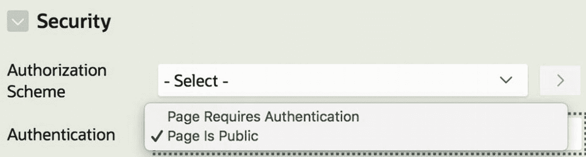
*图 13-6 指定公开页面*


将值更改为`Page is Public`并保存页面。要测试更改，请注销应用程序。你会发现 APEX 允许你访问应用程序的主页，但如果你尝试访问任何其他页面，系统将要求你登录。

## 授权

认证方案规定了哪些用户被允许访问应用程序的非公开页面。这是一个良好的开端，但往往还不够。一个 Web 应用程序可以有多种类型的用户，而某些页面（或页面的部分内容）只适合特定类型的用户。因此，你需要一种方法来指定哪些用户可以访问什么信息。安全的这一方面被称为`授权`。

APEX 通过允许每个页面或页面组件关联一个`授权方案`来实现授权，该方案指定了一组允许的用户。如果一个页面（或组件）有关联的授权方案，那么它将只对方案指定的用户可见。

## 创建授权方案

回想一下，内置变量`APP_USER`保存着当前用户的用户名。一个 APEX 授权方案由一个布尔表达式定义，通常涉及`APP_USER`的值；当表达式返回`true`时，用户即被授权。

授权表达式与验证表达式类似，它们的类型也相似。例如，`Exists SQL Query`类型在查询输出至少包含一条记录时返回`true`。`PL/SQL function returning Boolean`类型是明确返回`true`或`false`的 PL/SQL 代码。

举个例子，让我们为`Employee Demo`应用程序创建三个授权方案：

*   `Administrators`，如果当前用户拥有管理权限则返回`true`。
*   `Guests`，如果当前用户名为`GUEST`则返回`true`。
*   `Built-in Users`，如果当前用户名为`GUEST`或`ADMIN`则返回`true`。

`Administrators`方案可以通过以下`Exists SQL`查询定义：

```sql
select *
from USERS
where UserName = :APP_USER and IsAdministrator = 'Y'
```

`Guests`方案可以通过以下 PL/SQL 函数定义：

```sql
return :APP_USER = 'GUEST';
```

`Built-in Users`方案可以通过以下 PL/SQL 函数定义：

```sql
return :APP_USER = 'GUEST' or :APP_USER = 'ADMIN';
```

要创建一个授权方案，请转到应用程序的主页，点击`Shared Components`按钮，然后从`Security`部分选择`Authorization Schemes`。你将进入一个列出了为你的应用程序创建的授权方案的屏幕；我的初始屏幕如图 13-7 所示。我的 APEX 服务器会自动为我创建的每个应用程序创建`Administration Rights`方案。我的`Employee Demo`应用程序不需要它，所以我选择删除它。如果你的应用程序也有一个，请随意删除你的。

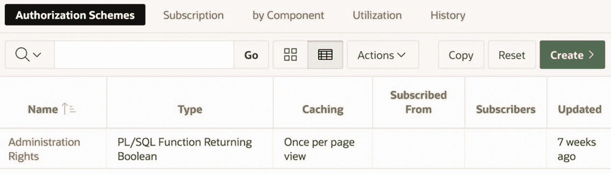

*图 13-7 初始的授权方案屏幕*

点击`Create`按钮会打开授权方案向导的第一个屏幕，如图 13-8 所示。指定你想“从头开始”创建方案。点击`Next`按钮将打开向导的第二页。在此屏幕上，给方案命名，选择其类型，并在适当的框中输入规范；图 13-9 展示了`Administrators`方案的这些规范。

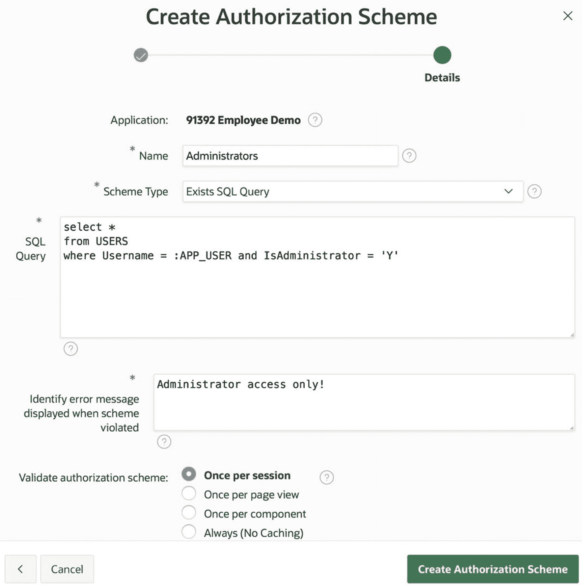

*图 13-9 创建授权向导的第二个屏幕*

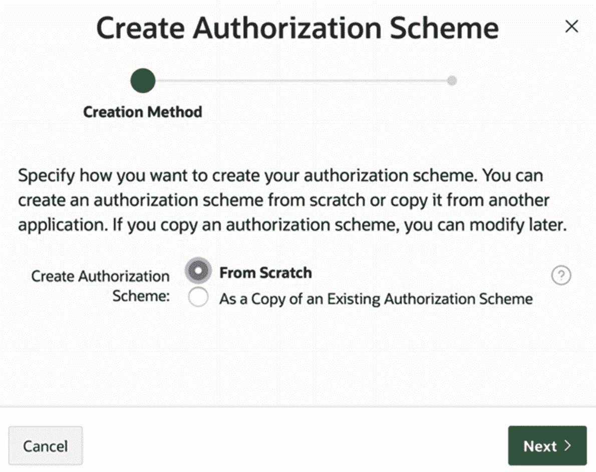

*图 13-8 创建授权向导的第一个屏幕*

向导的第二个屏幕还要求你提供一条错误消息（例如`Administrator access only`）并指定授权方案应多久验证一次。两个常见的选择是`Once per session`和`Once per page view`。每个会话评估一次方案效率要高得多，并且是默认设置。只有当授权条件可能在会话期间发生变化时，你才会选择每次页面视图评估一次。

例如，考虑由以下 PL/SQL 函数定义的授权方案：

```sql
return :APP_USER = 'ADMIN'
and extract(hour from current_timestamp) >= 9
and extract(hour from current_timestamp) < 17;
```

此方案仅对`ADMIN`用户返回`true`，且仅在上午 9 点到下午 5 点之间。如果授权方案的目的是将访问限制在这些时间，其评估点需要设置为`Once per page view`。

创建了`Administrator`授权方案后，你还应使用前面描述的条件为`Guest`和`Built-In Users`创建授权方案。假设你删除了预先构建的管理员权限方案，你的`Authorization Schemes`屏幕现在应该如图 13-10 所示。

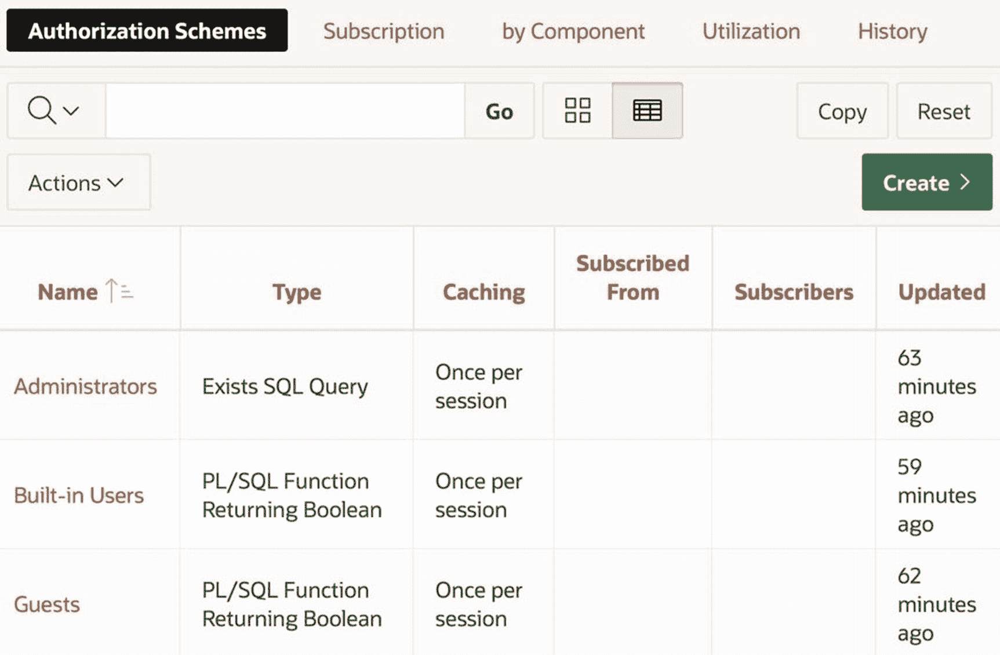

*图 13-10 当前的授权方案屏幕*

## 组件授权

每个页面组件都有一个属性`Authorization Scheme`，它出现在其`Security`部分。你通过从一个选择列表中选择来为组件分配授权方案。图 13-11 描绘了我的`Employee Demo`应用程序的这个选择列表。

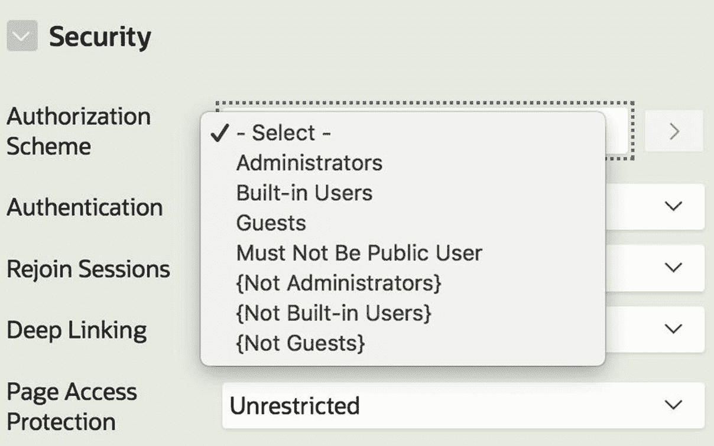

*图 13-11 为组件分配授权方案*


## 授权方案选项与应用

第一个选项是`–Select–`，表示不需要授权。接下来的三个选项是我创建的三种授权方案。最后三个是它们的否定形式，由 APEX 自动生成。`Must Not Be Public User`方案是 APEX 内置的，将在后面讨论。

例如，考虑图 7-5 中的`Employee Data Entry`页面。回想一下，这个页面有四个区域：一个显示`EMP`表报告的区域，以及用于删除、插入和更新表行的区域。假设任何人都可以查看员工报告，但不允许访客修改。在这种情况下，你会将授权方案`Not Guests`分配给删除、插入和更新区域，并将`–Select–`分配给报告区域。结果是，以`GUEST`身份验证的用户将只看到报告区域；其他三个区域对他们将是隐藏的。

再举一个例子，再次考虑图 13-5 中的`Manage Users`页面。如果你希望页面上的两个区域只能由管理员访问，请为每个区域分配授权方案`Administrators`。结果是，管理员将看到如图所示的页面；非管理员将看到一个只有导航栏和菜单但没有内容的页面。

因为向用户显示一个基本空白的页面是尴尬的，所以页面应该向非管理员显示一些内容。一个解决方案是创建一个显示消息“此页面仅供管理员使用”的区域，并为其分配授权方案`Not Administrators`。另一个解决方案是将授权方案分配给整个页面，稍后讨论。

将授权方案分配给组件会导致该组件根据当前用户显示或隐藏。这种行为与你在第 6 章研究的条件渲染非常相似。所以问题是：为什么要使用组件授权——为什么不使用条件渲染来完成所有操作？

答案是，是的，可以使用条件渲染来执行授权。如果你创建一个与授权方案定义相同的条件，该区域的行为将完全相同。然而，使用显式授权有三个更好的理由：

*   一个授权方案可以用于多个组件，确保一致性。
*   每个授权方案都有一个名称，这使应用程序开发人员更容易理解授权条件的效果。
*   授权和条件渲染在应用程序中有着完全不同的目的，将它们分开会更清晰。

### 页面授权

你可以将授权方案分配给页面本身，而不是分配给页面的组件。每个页面在其`Security`部分都有属性`Authorization Scheme`，其选项与图 13-11 中的相同。

例如，让我们构建一个名为`Change Password`的页面，允许用户更改自己的密码。此页面如图 13-12 所示，将是`Employee Demo`的第 47 页。

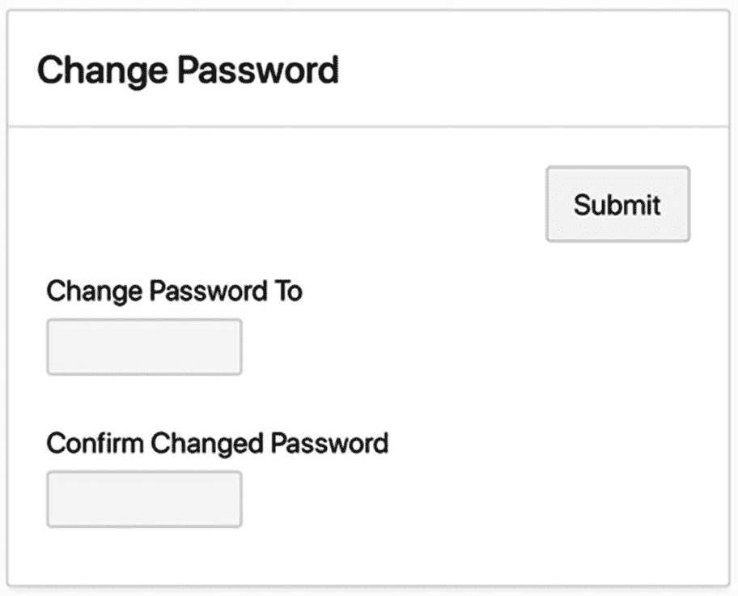

**图 13-12 更改密码页面**

此页面由一个静态内容区域组成，包含两个`Password`类型的项目：`P47_PASSWORD`和`P47_CONFIRM`。点击提交按钮会调用一个验证和一个过程。验证使用以下 SQL 表达式确保输入的两个密码相同：

```
:P47_PASSWORD = :P47_CONFIRM
```

该过程通过以下 PL/SQL 代码更新`USERS`表：

```
declare
v_valuesToHash apex_t_varchar2 :=
apex_t_varchar2(:APP_USER, :P47_PASSWORD);
begin
update USERS
set Password = apex_util.get_hash(v_valuesToHash, null)
where UserName = :APP_USER;
end;
```

这个页面应该如何授权？假设除了内置用户`GUEST`和`ADMIN`之外，每个人都应该被允许更改自己的密码。因此，页面的授权方案应该是`Not Built-In Users`。

将授权方案分配给页面会使未经授权的用户无法访问该页面。特别是，如果未经授权的用户尝试呈现该页面，APEX 将显示错误消息。图 13-13 显示了当内置用户尝试访问`Change Password`页面时出现的错误消息。点击消息上的“确定”按钮将用户返回到上一页。

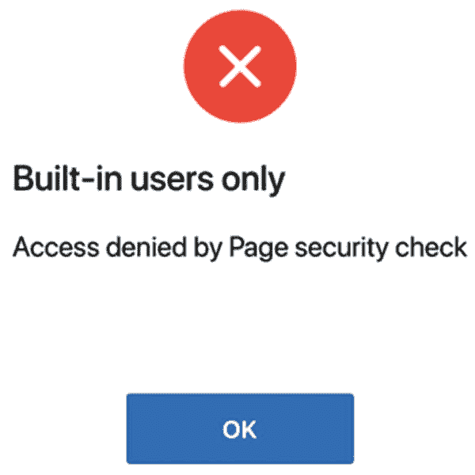

**图 13-13 未经授权访问页面的结果**

这个错误消息完成了任务，但不是很好。错误消息有些生硬。（事实上，消息是反的——APEX 使用为`Built-in Users`方案定义的错误消息，因为被否定的方案是自动生成的，没有错误消息。）一个更用户友好的方法是简单地向未经授权的用户隐藏页面。对于`Change Password`页面，这相当于不向未经授权的用户显示其导航菜单条目。这可以通过更改列表条目的`Authorization Scheme`属性轻松完成。

要找到该属性，请从应用程序的`Shared Components`屏幕开始，导航到`Desktop Navigation Menu`列表，如图 4-2 所示。向下滚动到其`Change Password`条目；点击该条目将调出如图 4-3 所示的`List Entry`屏幕。你要的属性在`Authorization`部分；选择`Not Built-in Users`授权方案，然后点击`Apply Changes`按钮。

然后运行你的应用程序。请注意，如果你以`ADMIN`或`GUEST`身份登录，导航菜单中将缺少`Change Password`页面的条目。一个好的经验法则是：如果一个页面有授权方案，其关联的导航菜单条目应该具有相同的授权方案。

### 非公共用户方案

授权方案`Not Public User`是 APEX 内置的。它对任何已登录用户返回`true`，如果用户未登录则返回`false`。它的主要用途是有选择地隐藏公共页面上的组件。

例如，假设你应用程序的主页是一个公共页面。然而，并非页面的所有部分都应该是公共的；特别是，`Quick Link`区域应该只对登录用户可见。这种情况可以通过将该区域的授权设置为`Not Public User`来处理。


### 避免恶意使用

一个 Web 应用的认证和授权方案详细规定了谁被允许访问哪些页面的哪些组件。每个经过认证的用户都对数据拥有一个明确定义的、有限的接口——当然，前提是用户以预期的方式访问页面。

问题在于，用户有各种方式来破坏 Web 应用的预期功能。本节重点介绍三种此类技术：SQL 注入、跨站脚本攻击和 URL 篡改。在**SQL 注入**中，用户提交一个伪装成输入数据的 SQL 代码片段，并更改正在处理这个伪造“数据”的查询。在**跨站脚本攻击**中，用户将恶意的 JavaScript 代码片段保存为表数据值的一部分；当另一个用户随后显示该值时，JavaScript 代码也会执行。在**URL 篡改**中，用户以服务器期望的形式向服务器发送一个 URL；然而，该 URL 请求的操作是用户本不应执行的。

APEX 具有若干特性，可帮助你防范恶意使用。事实上，利用这些特性构建一个防篡改的应用程序相对简单。但要利用它们，你需要了解威胁是什么以及 APEX 如何防范它们。

## SQL 注入

回顾图 12-1 中的`Report Builder`演示页面。此页面的意图是根据输入到`Enter Condition`文本区域的条件，显示`EMP`表或`DEPT`表的子集。然而，恶意用户可能输入一个条件，导致页面以相当意外的方式显示其他表中的数据。例如，图 13-14 显示了一个显示`USERS`表内容的条件。

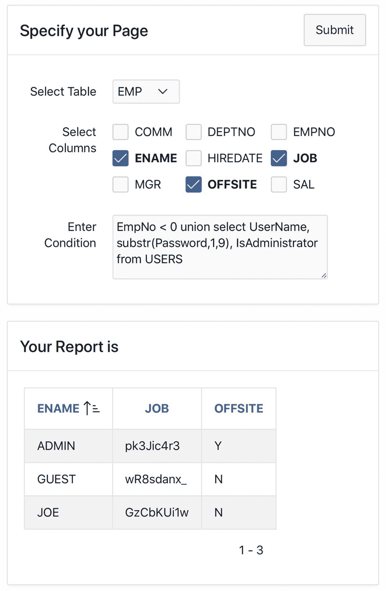

图 13-14 Report Builder 页面的意外使用

请注意，输入到`Enter Condition`项中的字符串不是一个合法的 SQL 条件。相反，它由一个合法条件`EmpNo<0`加上一些额外的 SQL 代码组成。要理解输入的目的，你必须了解清单 12-1 中的 PL/SQL 函数如何构建报告的源查询。回想一下，该代码生成了一个针对`EMP`的查询开头，然后将指定的条件附加到其末尾。因此，为图 13-14 生成的源查询变成如下形式：

```sql
select EName, Job, Offsite
from EMP where EmpNo < 0
union
select UserName, substr(Password,1,9), IsAdministrator
from USERS
```

请注意，用户利用了`union`关键字来扩大查询的范围。原本针对`EMP`表的预期查询现在只是整个查询的一个子查询。此外，条件`EmpNo<0`导致该子查询不返回任何记录，这意味着整个查询的输出完全来自第二个子查询。

第二个子查询可以是任意的，但受限于它必须与第一个子查询具有相同的列数，并且每个输出值必须匹配第一个子查询对应列的类型。这一限制解释了为什么第二个子查询只提取密码的前九个字符——`Job`列被定义为`varchar2(9)`，因此尝试选择更多字符会产生 SQL 错误。

恶意用户可能利用此漏洞获取用户的编码密码，以便随后破解它们并获得对应用的未授权访问。当然，仅拥有编码密码的前九个字符是不够的。然而，恶意用户可以多次运行此漏洞，每次获取密码的接下来九个字符，从而发现剩余字符。

这种技术被称为**SQL 注入**。当恶意用户在基于文本的项中输入 SQL 以改变查询的预期目的时，就发生了 SQL 注入。前面的例子表明 SQL 注入可能产生严重后果。因此，应用程序开发者必须意识到 SQL 注入的可能性，并不惜一切代价避免它。

从某种意义上说，`Report Builder`页面是在自找麻烦，因为`Enter Condition`项期望 SQL 代码。SQL 注入的真正危害在于，即使一个项期望一个值，它也可能成功。例如，让我们构建一个名为`SQL Injection`的页面，它将是`Employee Demo`的第 48 页。图 13-15 显示了此页面的预期用途。

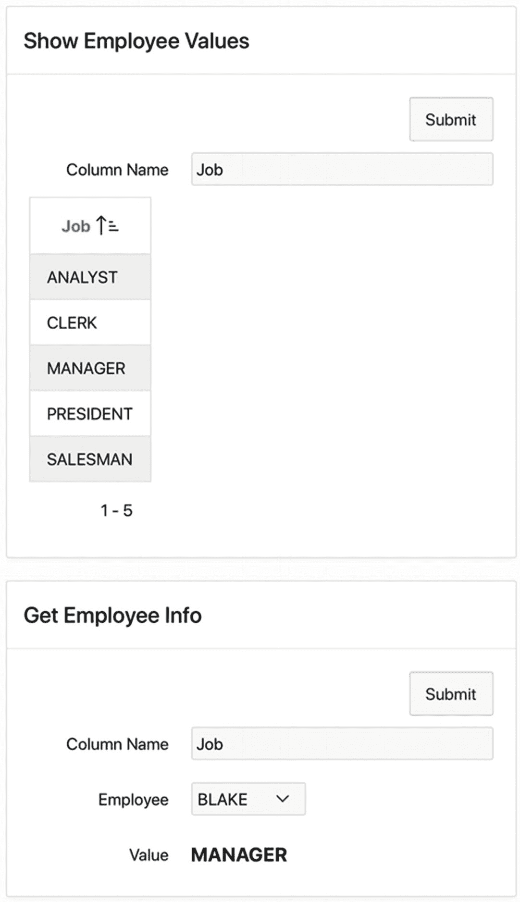

图 13-15 SQL Injection 页面的预期用途

该页面包含两个区域。`Show Employee Values`区域的输入是`EMP`表的一个列名；点击`Submit`按钮后，将显示该列不同值的报告。在图 13-15 中，报告显示了`EMP`表中出现的五个职位。

`Get Employee Info`区域类似。它的输入是一个列名和一个员工编号；点击提交按钮将显示所选员工该列的值。在图 13-15 中，该区域告诉你 Blake 是一名经理。

我们首先考虑如何实现`Show Employee Values`区域。它将有一个项：一个名为`P48_COLUMN1`的文本字段。该区域的类型将是`Classic Report`，并将使用如第 12 章所述的动态 SQL。也就是说，其源将具有`PL/SQL Function Body returning SQL Query`类型，并包含清单 13-4 中所示的代码。

```sql
return 'select distinct ' || :P48_COLUMN1 || ' from EMP';
```
清单 13-4 用于“显示员工值”报告的 PL/SQL 代码

由于报告使用动态 SQL，你还需要配置一些报告属性，如下所示：

*   启用通用列名。
*   指定列数为 1。
*   将列标题类型设置为`PL/SQL Function Body`，表达式为`return :P48_COLUMN1;`。

现在让我们考虑如何实现`Get Employee Info`区域。它是一个静态内容区域，包含三个项：`P48_COLUMN2`是一个文本字段，`P48_EMPNO2`是一个显示员工姓名并返回员工编号的选择列表，`P48_VALUE2`是一个只读显示项。


## SQL 注入

该区域有一个与提交按钮关联的过程；该过程的代码出现在清单 13-5 中。代码首先构造一个查询字符串以检索指定的员工值。然后使用`execute immediate`来检索员工`P48_EMPNO2`的指定值，并将其放入只显示项`P48_VALUE2`中。

```
declare
  v_query varchar2(100);
begin
  v_query := 'select ' || :P48_COLUMN2 || ' from EMP where EmpNo = :1';
  execute immediate v_query
                into  :P48_VALUE2
              using :P48_EMPNO2;
end;
Listing 13-5
获取员工信息区域的过程代码
```

尽管此页面上的区域看起来无害，但它们容易受到 SQL 注入攻击。图 13-16 显示了如何利用页面的任一区域来显示`ADMIN`用户的完整编码密码。（截图截断了编码密码以节省空间。）

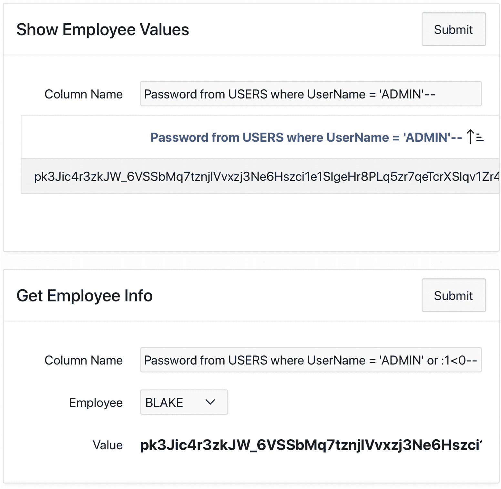
图 13-16
SQL 注入页面的恶意使用

图 13-16 中`P48_COLUMN1`的值如下：

```
Password from USERS where UserName = 'ADMIN' --
```

当 APEX 使用此字符串构造报表源时，它会得到以下 SQL 查询：

```
select distinct Password from USERS where UserName = 'ADMIN' -- from EMP
```

回想一下，字符“`--`”在 PL/SQL 中表示注释。因此，SQL 代码中的`from EMP`部分被完全忽略。换句话说，SQL 注入将针对`EMP`表的查询转变成了针对`USERS`表的查询。

`获取员工信息`区域使用了本质上相同的注入技巧。图 13-16 中`P48_COLUMN2`的值如下：

```
Password from USERS where UserName = 'ADMIN' or :1 < 0 --
```

当 APEX 使用此字符串构造报表源时，它会得到以下 SQL 查询：

```
select Password from USERS
    where UserName = 'ADMIN' or :1 < 0 --from EMP where EmpNo = :1
```

同样，注释字符之后的所有内容都被忽略，因此注入最终创建了一个对`USERS`表而非`EMP`表的查询。请注意，恶意用户必须仔细构造注入代码，以使生成的 SQL 字符串合法。考虑`获取员工信息`示例。`execute immediate`语句将员工号传递给 SQL 查询；虽然恶意查询不会使用此值，但它仍然需要一个形式参数来接收它。表达式`:1<0`实现了这个目标。指定的员工号被赋值给参数`:1`。因为员工号总是正数，这个表达式总是求值为`false`，所以它不会影响查询的输出。

一般来说，只要查询字符串是从原始的、未检查的用户输入构造的，就可能发生 SQL 注入。在这种情况下，恶意用户可能能够输入一个代码片段作为输入，从而改变构造查询的目的。因此，应用程序开发人员应始终检查用户输入，以确保其符合预期的格式。这里有三种策略：

*   避免基于文本的输入。请注意，如果用户被迫从列表中选择一个列，图 13-16 的 SQL 注入技术将不起作用（尽管 URL 修改技术可以规避此策略，稍后会看到）。
*   为输入编写一个 APEX 验证，以检测可能的代码片段。例如，在图 13-16 中，你可以拒绝接受包含空格或注释字符的列名。
*   将输入转换为“净化”形式。也就是说，编写一个函数将用户值转换为可接受的值。在图 13-16 中，该函数可能会删除输入中的所有空格，或者将每个空格转换为转义的 HTML 字符`&nbsp;`。

让我们看看如何使用这些策略来改进图 13-14 所示的`报表生成器`页面。问题当然是，基于文本的项`输入条件`要求用户输入 SQL 代码。第一种策略建议你尝试一种非基于文本的方式来指定条件。`计数和删除`演示页面的`版本 2`区域（如图 12-4 所示）展示了如何做到这一点，至少对于简单条件是这样。APEX *query builder*提供了一个更复杂的解决方案。

注意
如果你从未使用过查询构建器，你应该试一试。从 APEX SQL Workshop 开始，点击`实用程序`，然后点击`查询构建器`。点击一个表名以将其包含在查询中，然后进行探索。

第二种策略建议你编写一个验证，拒绝包含可疑关键字（如`union`或`select`）的条件字符串。这个策略在这里似乎是合理的。

第三种策略对于期望 SQL 代码作为输入的项效果不佳，如图 13-14 所示。然而，对于期望值的项，如图 13-15 中的`SQL 注入`页面，它是有用的。特别是，对于`显示员工值`区域的一个好策略是从报表源的`P48_COLUMN1`中删除所有空格，如清单 13-6 所示。

```
return 'select distinct ' || replace(:P48_COLUMN1, ' ', '') || ' from EMP';
Listing 13-6
修改清单 13-4 以避免 SQL 注入
```

类似地，你可以通过从提交过程代码的`P48_COLUMN2`中删除所有空格来改进`获取员工信息`区域。

### 防护策略
*   避免基于文本的输入。请注意，如果用户被迫从列表中选择一个列，图 13-16 的 SQL 注入技术将不起作用（尽管 URL 修改技术可以规避此策略，稍后会看到）。
*   为输入编写一个 APEX 验证，以检测可能的代码片段。例如，在图 13-16 中，你可以拒绝接受包含空格或注释字符的列名。
*   将输入转换为“净化”形式。也就是说，编写一个函数将用户值转换为可接受的值。在图 13-16 中，该函数可能会删除输入中的所有空格，或者将每个空格转换为转义的 HTML 字符`&nbsp;`。

## 跨站脚本

在*跨站脚本*技术中，恶意用户将 JavaScript 代码作为数据库值的一部分保存。这段代码就像一个陷阱：当另一个用户显示包含该值的页面时，用户的浏览器会在用户不知情的情况下执行 JavaScript 代码。JavaScript 代码可能会做诸如将用户的会话信息通过电子邮件发送给攻击者（从而让攻击者冒充用户）或让 APEX 服务器执行指定函数等事情。

跨站脚本之所以如此邪恶，是因为 JavaScript 代码是*以受害者的授权级别*执行的。因此，如果管理员成为跨站脚本攻击的受害者，攻击者将获得数据库的管理员级访问权限。

成功的跨站脚本攻击有三个要求：首先，某个表必须有一个类型为`varchar2(N)`的列，其中`N`足够大以容纳 JavaScript 代码；其次，应用程序的某个页面必须有一个用于向该字段输入数据的基于文本的项；第三，应用程序的某个页面必须配置为以“原始”未转义形式显示被污染的值。

就目前情况而言，`员工演示`应用程序不易受到跨站脚本攻击，因为`EMP`和`DEPT`都没有足够大的列。因此，为了本示例的目的，你应该通过将`DEPT`表的`Loc`列扩展为`varchar2(80)`来修改它。所需的 SQL 如下：

```
alter table DEPT
modify Loc varchar2(80)
```

现在，你可以构建一个页面来演示跨站脚本攻击。`跨站脚本`页面是`员工演示`的第 49 页，如图 13-17 所示。

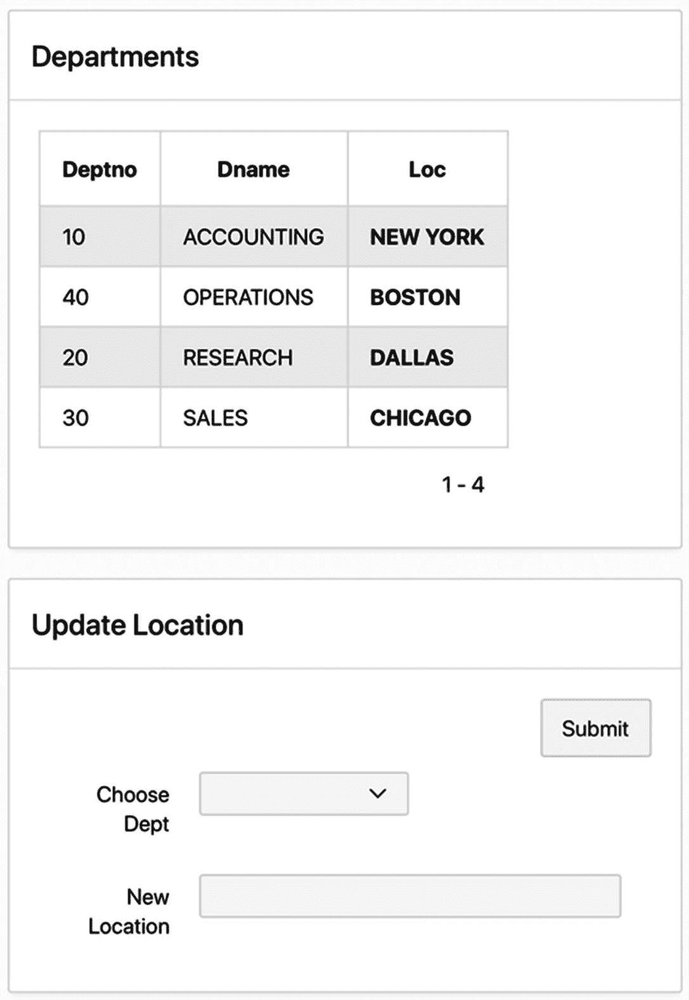
图 13-17
跨站脚本页面


此页面包含两个区域。`Departments` 区域是一个经典报表，其源查询为

```sql
select * from DEPT
order by DName
```

`Update Location` 区域是一个表单，其源查询为

```sql
select DeptNo, Loc
from DEPT
```

你应该使用第 10 章的技术来自定义表单区域。具体来说：

-   开启表单的 `Edit Enabled` 属性，并选择 `Update Row` 作为唯一允许的操作。
-   创建一个按钮，其操作为 `Submit`，其数据库操作为 `SQL UPDATE action`。
-   指定项目 `P49_DEPTNO` 是主键。同时，将其类型更改为 `Select List`，并配置值列表查询。

```sql
select DName, DeptNo
from DEPT
```

此页面还需要一个额外的配置来匹配图 13-17，即 `Loc` 列中的值应该以粗体格式显示。第 3 章展示了如何使用列的 `HTML Expression` 属性将列值包裹在 HTML 标签中。例如，你可以将 `LOC` 列的 HTML 表达式设置为：

```html
<b>#LOC#</b>
```

出于本示例的目的，我想使用一种不同的技术，即利用报表的源查询来格式化该列。具体来说，将报表的源查询更改为：

```sql
select DeptNo, DName, '<b>' || Loc || '</b>' as Loc
from DEPT
order by DName
```

请注意，该查询在部门名称周围包裹了 HTML 标签，这意味着 `LOC` 的值就是 HTML 表达式。其思路是，当显示报表时，LOC 的值应该以粗体格式化。然而，这并不完全奏效。如果你运行该页面，HTML 标签会作为值的一部分显示出来，如图 13-12 所示。

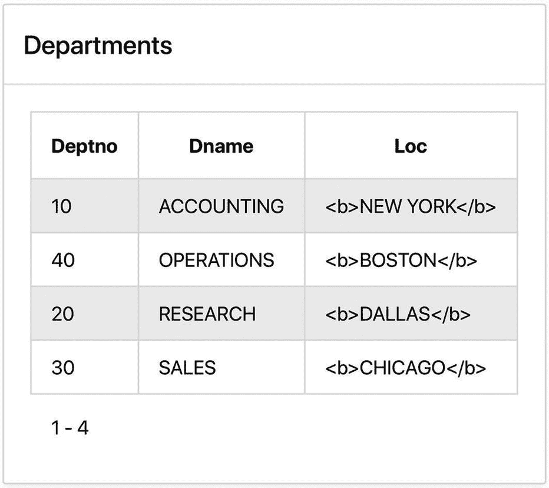
*图 13-18 报表显示了 HTML 标签*

如果你仔细想想，这个结果是有一定道理的——毕竟，报表只是显示查询的输出。然而，实际情况比这更复杂。考虑 APEX 如何渲染报表：它生成一个 HTML 表格，并将输出值放入其中。因此，例如，显示报表第一行的 HTML 代码可能如下所示：

```html
<tr>
  <td>ACCOUNTING</td>
  <td><b>NEW YORK</b></td>
</tr>
```

尽管 `<b>` 和 `</b>` 标签是作为数据输入到表格中的，但浏览器最终会将它们视为 HTML。为了使 APEX 能在报表中显示这些标签，它必须做额外的工作。具体来说，它会将 `<` 和 `>` 字符转换为恰好显示相同的其他字符。这种转换称为 *转义特殊字符*。具体来说，字符 `<` 被替换为 `&lt;`，字符 `>` 被替换为 `&gt;`。每个报表列在其 `Security` 部分都有一个 `Escape special characters` 属性。默认情况下它是开启的，这会导致 APEX 转义特殊字符，并如 13-18 图所示显示 HTML 标签。现在转到 `Loc` 列并关闭此属性。`Loc` 值中的标签将不会被转义，因此将被作为 HTML 处理。报表现在将看起来像图 13-17。

这种在 SQL 源查询中格式化数据的能力非常强大，可以让你完成通过 `HTML Expression` 属性无法实现的事情。例如，你可以选择将一列中的某些值格式化为文本，而将其他值格式化为链接或图像。然而，这种强大功能是有代价的。一旦你关闭了一列的 `Escape special characters` 属性，你就使自己面临跨站脚本攻击的风险。该属性的帮助屏幕对此点特别强调；参见图 13-19。

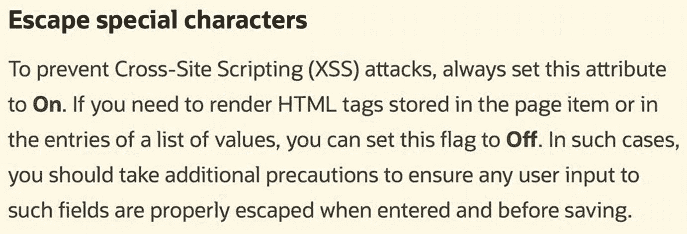
*图 13-19 Escape Special Characters 属性的帮助文本*

为了演示，让我们看看利用此页面危害应用程序是多么容易。从 `Update Location` 区域，选择任何部门，例如 `OPERATIONS`。`Location` 字段应显示当前值，即 `BOSTON`。将该值更改为：

```text
BOSTON<script>alert('Your application has been compromised')</script>
```

这个新值是一个字符串，由位置信息后跟一个调用 JavaScript 函数 `alert` 的脚本组成。当浏览器渲染此字符串时，它将显示 "BOSTON"，然后调用脚本。换句话说，此次更新对报表没有可见的影响。但是，脚本将在每次有人渲染页面时运行。

单击 `Submit Changes` 按钮。在页面重新加载之前，你的浏览器将显示一个类似于图 13-20 的警报。现在导航到其他页面再返回此页面——警报将再次显示。意识到如果没有这个警报，你根本不会知道你的应用程序已经被严重入侵，这有点令人不寒而栗。

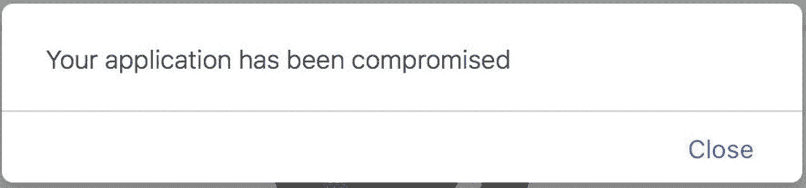
*图 13-20 跨站脚本攻击成功*

前面的 JavaScript 代码并无恶意。`alert` 函数只是在用户浏览器中显示一个警告窗口。恶意的 JavaScript 字符串几乎肯定不会弹出警报，而是会做一些更复杂和恶意的事情。很可能，当你发现问题时，为时已晚。因此，你需要确保这种情况不会发生。

消除跨站脚本攻击的唯一方法是确保页面不显示未转义的数据。有三种方法可行，我们将依次考虑：

-   拒绝不适当的数据
-   在将数据保存到数据库之前对其进行转义
-   在显示数据之前对其进行转义

### 拒绝不适当的数据

在任何数据录入页面中，防止不适当的数据被输入数据库是良好的实践。这就是数据库约束和 APEX 验证的用途。检查输入数据是否包含意外 HTML 的行为遵循相同的原理。你可以采取两种方法。

第一种方法是使用项目 `Security` 部分中的 `Restricted Characters` 属性。此属性允许你指定输入中允许哪些字符。图 13-21 显示了可能的选项。你可以要求输入只能是字母数字，或者可以限制使用某些特殊字符。

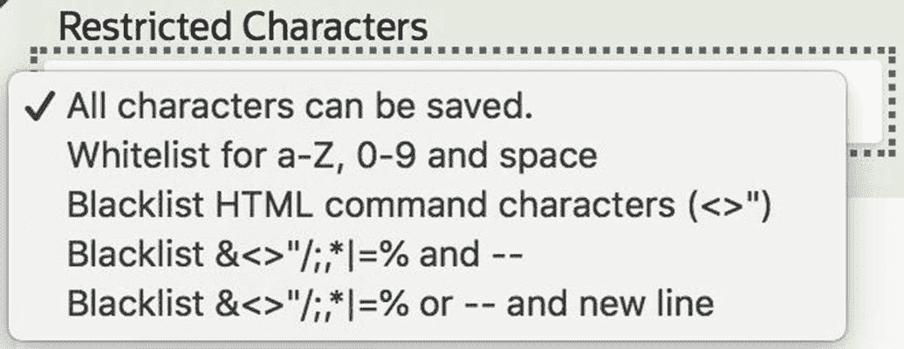
*图 13-21 Restricted Characters 属性的选项*

在当前示例中，假设部门位置是字母数字；在这种情况下，将 `P49_LOC` 的 `Restricted Characters` 属性设置为 `Whitelist for a–Z, 0–9, and space` 是合理的。如果不是，那么你至少应该将其设置为 `Blacklist HTML command characters`。

第二种方法是编写一个 APEX 验证来执行限制。APEX 提供了一个名为 `apex_escape.html` 的函数，它接受任何输入字符串，并将其转换为视觉上相同但不包含 HTML 字符的字符串。例如，代码清单 13-7 显示了一个验证的 PL/SQL 代码，如果 `P49_LOC` 的输入包含 HTML 字符，则该验证返回 `false`。

```plsql
declare
  v_LocEscaped varchar2(100);
begin
  v_LocEscaped := apex_escape.html(:P49_LOC);
  if :P49_LOC = v_LocEscaped then
    return true;
  else
    return false;
  end if;
end;
```
*代码清单 13-7 防范不需要的 HTML 输入的验证*

### 在保存数据之前转义数据


## 防止恶意攻击

### 转义 HTML 输入
与其拒绝基于 HTML 的输入，不如将其转换为不含 HTML 字符的版本。`apex_escape.html` 函数在此同样非常实用。例如，在《跨站脚本攻击》章节中，表单生成了更新数据库的流程。您可以将该流程替换为一个 PL/SQL 流程，该流程先对值进行转义，然后再保存。此类流程的代码如代码清单 13-8 所示。

```
begin
update DEPT
set Loc = apex_escape.html(:P44_LOC)
where DeptNo = :P44_DEPTNO;
end;
代码清单 13-8
转义不需要的 HTML 输入
```

### 显示前转义数据
应用程序可能无法保证数据库中不包含任何 HTML 代码，因为用户可能有其他输入数据的方式。因此，为了防止跨站脚本攻击，在将数据呈现在页面之前对其进行转义是一个好习惯。这正是 `Escape Special Characters` 属性的用途（请参考图 13-19）。如果您报表中的每一列都启用了此属性，那么您的报表就能对跨站脚本攻击免疫。

然而，如果您报表中的某一列需要关闭此属性，您就必须转义必要的字符。同样，`apex_escape.html` 函数非常实用。例如，代码清单 13-9 给出了示例报表的原始来源，而代码清单 13-10 展示了一个经过修订的版本，其中的数据已经被转义。

```
select DeptNo, DName, '' || apex_escape.html(Loc) || '' as Loc
from DEPT
order by DName
代码清单 13-10
修订后的源查询
```

```
select DeptNo, DName, '' || Loc || '' as Loc
from DEPT
order by Dname
代码清单 13-9
原始源查询
```

## URL 修改
第三种恶意攻击利用了网页的访问方式。在一个典型的非恶意场景中，用户将应用程序主页的 URL 输入浏览器。从此之后，URL 在很大程度上就不重要了；用户通过点击标签、链接和按钮导航到其他页面。
这个场景对应于应用程序的预期用途。页面上的导航链接旨在帮助用户决定接下来要查看哪些页面。事实上，衡量应用程序质量的一个标准是导航在多大程度上有助于形成连贯的用户体验。
当然，用户不一定遵循这个场景。了解应用程序 URL 结构的用户可以通过简单地构造一个有效的 URL 来访问任意页面。这种可能性给 APEX 开发人员带来了几个困难。以下小节将探讨这些困难及其解决方案。

### APEX URL 结构
APEX 应用程序支持两种不同的 URL 格式：一种是旧版语法，另一种是更新的“友好”语法。本书中使用的语法一直是旧版语法，其中应用程序和页面通过其编号来指定。例如，我的 `Employee Demo` 应用程序的编号是 91392，主页的编号是 1。因此，我的主页的旧版 URL 是

```
apex.oracle.com/pls/apex/f?p=91392:1
```

友好 URL 语法则通过名称来指定工作区、应用程序和页面，而不是编号。例如，我的主页的友好 URL 是

```
apex.oracle.com/pls/apex/understanding_apex/r/employee-demo/home
```

尽管在本章中我将继续使用旧版 URL，但大多数概念也适用于友好 URL。（即使您偏好友好 URL，您仍然需要了解恶意用户如何滥用旧版 URL。）
一个旧版 URL 支持九个冒号分隔的参数；如果某个参数的值缺失，则使用默认值。您已经知道了前三个参数：应用程序 ID、页面 ID 和会话 ID。另外两个相关的参数是第七个和第八个，它们用于设置会话状态。

关于这些参数的示例，请考虑第 6 章中的 `Employees by Department` 页面，该页面再次出现在图 13-22 中。

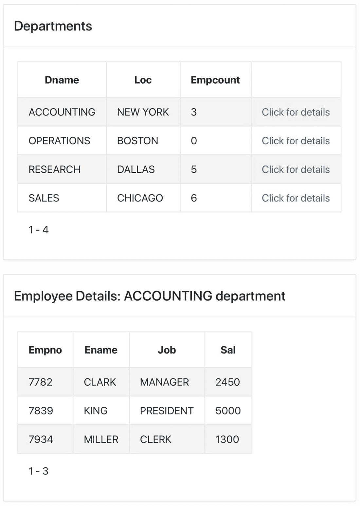

图 13-22
Employees by Department 页面

回想一下，当您点击 `Click for Details` 链接时，会发生重定向，设置 `P12_DEPTNO` 和 `P12_DNAME` 的会话状态值，然后页面会重新渲染。代码清单 13-11 显示了点击 `ACCOUNTING` 对应的链接所产生的旧版 URL，假设会话 ID 是 98765。（为了节省空间，我省略了 URL 的通用前缀。）

```
f?p=91392:12:98765::::P12_DEPTNO,P12_DNAME:10,ACCOUNTING
代码清单 13-11
Employees by Department 页面的 URL
```

此清单说明了 URL 第七个和第八个参数的用途。第七个参数是一个逗号分隔的列表，包含了要设置其值的项（`P12_DEPTNO` 和 `P12_DNAME`），而第八个参数是这些项将被设置成的值的列表（`10` 和 `ACCOUNTING`）。

### GET 与 POST
浏览器向 Web 服务器发出的请求可以是不同类型。最常见的两种类型是 GET 和 POST，它们在向服务器传递信息的方式上有所不同。POST 请求将信息放置在请求数据包内的一个特定区域。而 GET 请求则通过其 URL 将信息传递给服务器。
在 APEX 中，POST 请求由提交操作发出。为了处理一个提交，浏览器提取页面项的值，将它们打包到 POST 请求中，然后将其发送到服务器。服务器随后使用这些值来更改会话状态。如果您想验证这一点，请转到任何带有提交按钮的页面（例如 `Filter by Job and Department`）。点击提交按钮，并观察 URL 没有改变。这证明了计算的输入不是所提交 URL 的一部分，这也是您无法将提交操作的结果加入书签的原因。
另一方面，APEX 中的重定向操作发出的是 GET 请求。重定向由多种 APEX 组件执行，例如按钮、基于列表的项、列链接和分支。作为重定向的一部分，APEX 允许您将会话状态中的指定项设置为特定值。例如，在图 13-22 的 `Employees by Department` 页面中，`Click for Details` 列链接将 `P12_DEPTNO` 和 `P12_DNAME` 分别设置为当前记录的部门编号和名称。浏览器通过将此信息编码在 URL 内将其发送到服务器，如代码清单 13-11 所示。
由于 APEX URL 的结构是众所周知的，一个经过身份验证的用户有可能构造一个 URL，以应用程序开发人员未曾意图的方式访问应用程序。接下来的章节将考虑两种技术。

### 页面扫描
第一种技术称为 **页面扫描**。用户构造一系列 URL 来访问每一个可能的页面，只是为了看看会显示什么页面（如果有的话）。页面扫描的可能性意味着您不能仅仅通过隐藏页面来使其不可访问。例如，考虑图 13-12 中的 `Change Password` 页面，它是 `Employee Demo` 的第 47 页。在那一节中，您看到了如何通过为其导航菜单项分配授权方案来隐藏该页面。尽管这是一个良好的设计策略，但它并不能使页面不可访问，因为任何用户都可以通过 URL 访问该页面

```
apex.oracle.com/pls/apex/f?p=91392:47。
```


由于缺乏明确的标题结构，以下根据内容逻辑对文档进行层级划分和格式优化：

## 页面扫描与项目修改安全

由于没有好的方法来消除页面扫描，开发者的唯一对策是使用授权来限制可访问性。换句话说，页面扫描的可能性意味着为每个页面定义授权方案至关重要，无论其在导航菜单中的可见性如何。

### 项目修改

第二种技术，*项目修改*，可用于攻击那些通过 URL 设置项目值的页面。用户获取该页面的现有合法 URL，修改其赋值，并提交修改后的 URL。

例如，假设公司有第五个部门，其部门编号为 50，名称为 `SECRET`。假设你不希望该部门的成员公开，因此你将图 13-22 中 `Departments` 报告的数据源设置为排除该部门。不幸的是，很容易使用 URL 修改来获取此隐藏信息。用户只需修改清单 13-11 中的 URL，使其请求第 50 号部门的内容，如下所示：

```
f?p=91392:12:98765::::P12_DEPTNO,P12_DNAME:50,SECRET
```

再举一个例子，考虑图 10-9 的 `Form Update` 页面。图 13-23 显示了我在 `Choose Employee` 项目中选择 BLAKE 后，其 `Update Employees` 区域的情况。这个名为 `P30_EMPNO` 的项目执行了一个 `Redirect and Set Value` 操作。重定向操作生成的 URL 是：

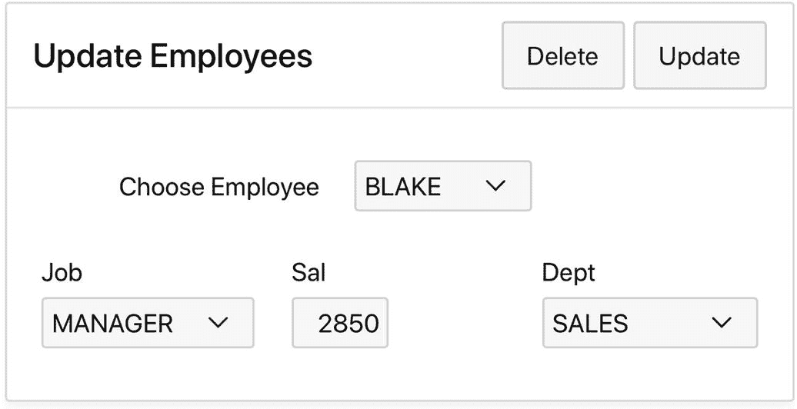

**图 13-23** 更新员工区域

```
f?p=91392:30:98765::::P30_EMPNO:7698
```

此 URL 重定向到第 30 页，并将选择列表的会话状态值设置为 7698，即 BLAKE 的员工编号。一旦我理解这一点，我就可以修改此 URL 来检索任何员工的信息。例如，如果我在浏览器中输入相同的 URL，将最后四个字符改为 `7782`，我将看到员工 CLARK 的信息。

乍一看，这种修改似乎没什么大不了的。毕竟，我为什么要费力地在 URL 中输入值，而不是使用选择列表来为我完成呢？这项技术的关键在于，无论项目在页面上如何实现，它都有效。

在图 13-23 中，`P30_EMPNO` 是一个显示所有员工的选择列表。但假设它只显示销售部门的员工，因为应用程序开发人员希望用户只能修改这些员工的记录。这无关紧要，因为我可以通过 URL 直接输入任何员工号来绕过选择列表。`P30_EMPNO` 的类型是什么，甚至它是否可见，都绝对没有影响。

项目修改也可以应用于使用提交而非重定向的页面。也就是说，你可以使用项目修改来更改通过 POST 传递且甚至不出现在 URL 中的项目的值。再次考虑图 6-5 的 `Filter by Job and Department` 页面，它显示在图 13-24 中。假设你从选择列表中选择了 `Job` 和 `Dept` 值（例如 `CLERK` 和 `RESEARCH`）然后提交。URL 将是：

```
f?p=91392:9:98765:::::
```

也就是说，项目 `P9_JOB` 和 `P9_DEPTNO` 的值不会出现在 URL 中，因为输入是通过 POST 请求发送的。

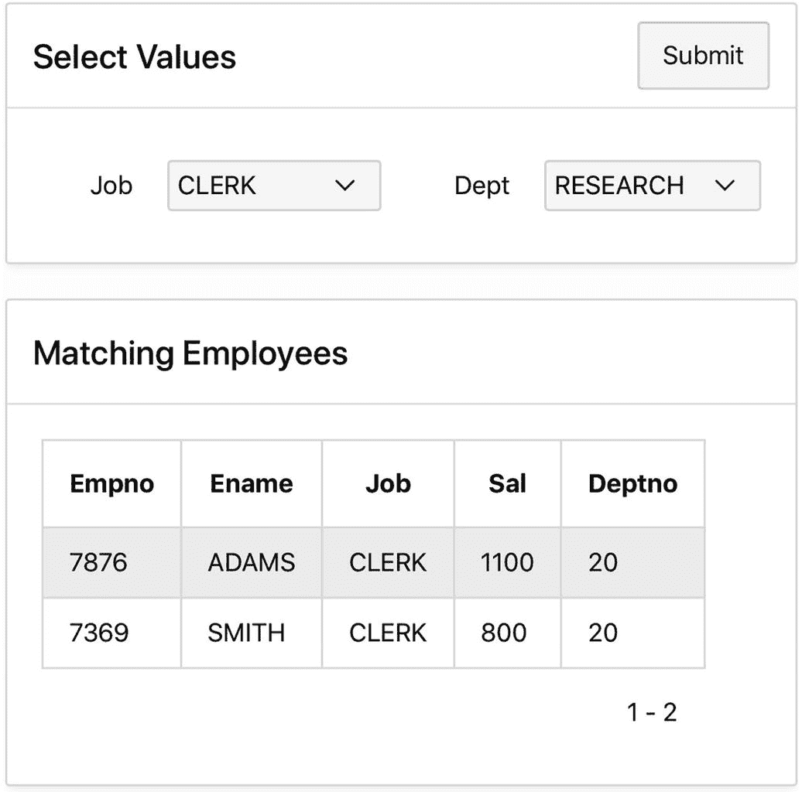

**图 13-24** 按工作和部门筛选页面

现在假设我通过向最后两个参数添加项目名和值来修改 URL，如下所示：

```
f?p=91392:9:98765::::P9_JOB,P9_DEPTNO:MANAGER,10.
```

APEX 执行请求的过程如下。它首先通过将项目值从浏览器复制到会话状态来执行提交；然后，它将 URL 中指定的值复制到两个指定的项目中，并呈现页面。因此，页面上选择的 `P9_JOB` 和 `P9_DEPTNO` 的值将被 URL 中的值覆盖。也就是说，生成的报告将列出会计部门的经理，而不管选择列表中显示的值是什么！

项目修改的可能性意味着你不能依赖基于列表的项目来对输入数据施加任何类型的限制。这对 SQL 注入和跨站脚本攻击有影响。回想一下，对这些技术的讨论指出，攻击者需要足够长的基于文本的项目进行数据输入，因此建议使用基于列表的项目。然而，攻击者可以使用项目修改直接将攻击代码输入到 URL 中。因此，除非有办法禁止项目修改，否则使用基于列表的项目无法提供安全性（并且实际上会给人一种虚假的安全感）。

### 防范项目修改

APEX 有一项名为 *页面访问保护* 的功能，其唯一目的是防止项目修改攻击。有多个保护级别。本节将仅讨论最通用的一种：`Arguments Must Have Checksum`。它的工作原理如下。

假设一个页面在此级别受到保护。如果该页面的 URL 分配了项目值，则该 URL 还必须包含这些值的校验和。当 APEX 服务器收到请求时，它会提取参数值，计算它们的校验和，并将其与 URL 中的校验和进行比较；如果不同，则拒绝该请求。

其理念是校验和函数只有 APEX 知道。当 APEX 为重定向操作生成 URL 时，它会计算校验和并将其添加到 URL 中。如果用户以任何方式修改了项目值，现有的校验和将不再正确；此外，用户将无法知道如何计算正确的值。同样，用户无法从零开始创建保存项目的 URL，因为无法确定其校验和。因此，项目修改是不可能的。

为页面启用页面访问保护有两个步骤。第一步是启用应用程序的 `Session State Protection` 属性。从应用程序的主屏幕开始，单击 `Edit Application Properties` 按钮，然后单击 `Security` 选项卡。该属性位于 `Session State Protection` 部分。很可能，该属性已经启用；如果未启用，请选择 `Enabled`。第二步是转到该页面的页面属性。`Page Access Protection` 属性位于 `Security` 部分；选择选项 `Arguments Must Have Checksum`。

作为测试，为 `Employees by Department` 页面设置页面访问保护。然后转到该页面并单击会计部门的链接。你应该看到一个类似以下的 URL：

```
f?p=91392:12:98765::::P12_DEPTNO,P12_DNAME:10,ACCOUNTING&cs=10FzVgvoxRFQBVRnEe9Ww2QSzoVM
```

请注意，此 URL 与清单 13-11 中的 URL 相同，只是末尾多了校验和信息。现在尝试对此 URL 执行项目修改（无论是否更改校验和值）。APEX 会检测到修改，并返回图 13-25 中显示的错误消息。

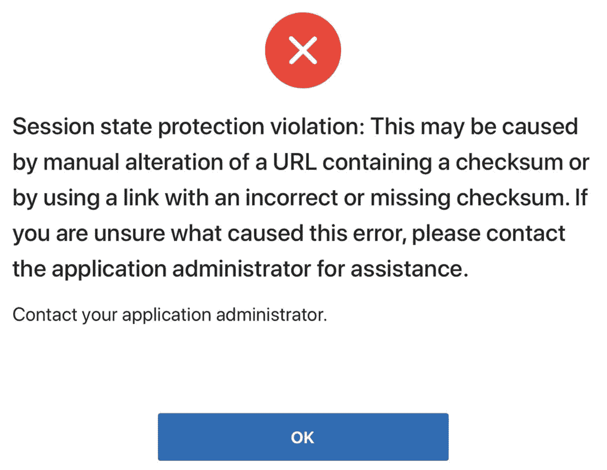

**图 13-25** 检测到尝试进行项目修改


## 安全性

### 页面访问保护的复杂性

还有一个额外的复杂情况：如果你想启用页面访问保护，就需要为应用程序的每一个页面都启用它，因为一个页面的 URL 可以设置另一个页面的项。

例如，假设`按部门查看员工`页面（演示应用的第 12 页，图 13-22）已受到保护。现在考虑一下应用程序的首页，即第 1 页。由于它没有任何项，你可能会认为没有必要要求校验和。但是，一个聪明的用户可以发出如下 URL 请求：

```
f?p=91392:1:98765::::P12_DEPTNO,P12_DNAME:10,ACCOUNTING
```

这个请求在加载首页之前，就设置了`P12_DEPTNO`和`P12_DNAME`的会话状态值。然后用户可以从首页正常导航到`按部门查看员工`页面。如果这些项的值来源于当前的会话状态值（通常情况如此），页面将使用用户指定的值进行渲染。换句话说，尽管你本意良好，用户还是成功修改了项。

## 总结

本章重点讨论了如何确保应用程序的安全性。它讨论了如何配置应用程序，使得每个用户只能执行他们应该执行的操作——不多也不少。安全性问题涉及三个方面：认证、授权和建立防护措施。

认证确保应用程序知道其用户的身份。用户提供用户名和密码来表明自己的身份；应用程序的认证方案负责将用户名/密码与主列表进行匹配。APEX 支持多种认证方案，它们根据管理用户/密码列表的组织部分不同而有所区别。你学习了如何构建一个自定义认证方案，其中应用程序本身负责维护该列表。

授权指定了每个已认证的用户可以做什么。基本的授权机制是授权方案。每个授权方案指定了一组用户。通过将授权方案与页面（或页面组件）关联，你可以将该页面（或组件）的访问权限限制在方案指定的用户。

防护措施对于防止用户执行他们未被授权的操作是必要的。本章涵盖了三种众所周知的技术：SQL 注入、跨站脚本和 URL 修改。在 SQL 注入中，用户将 SQL 代码片段作为“数据”提交，导致底层过程执行错误的查询。在跨站脚本攻击中，用户将恶意的 JavaScript 代码片段作为“数据”保存；当另一个用户试图显示该数据时，恶意代码就会执行。在 URL 修改中，用户向 APEX 服务器发送一个服务器期望的 URL 形式；然而，该 URL 请求的操作却是用户未被授权请求的。你研究了防范这些技术的方法。关键在于，如果你意识到这些风险，确保应用程序的整体安全性就相对直接了。

