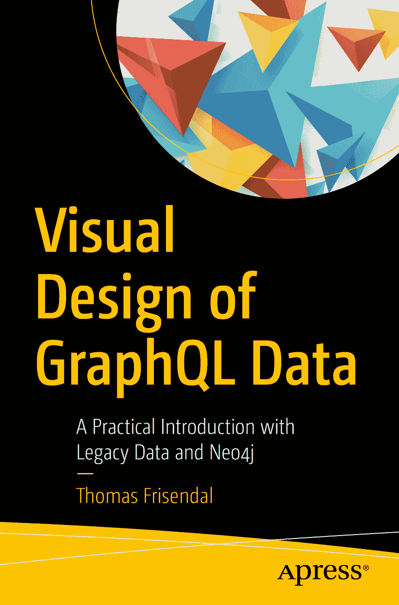

ISBN 978-1-4842-3903-2
e-ISBN 978-1-4842-3904-9
[`doi.org/10.1007/978-1-4842-3904-9`](https://doi.org/10.1007/978-1-4842-3904-9)

美国国会图书馆控制号：2018956408

© Thomas Frisendal 2018

本书受版权保护。出版者保留所有权利，无论其涉及材料的全部或部分，特别是翻译、转载、图表的重复使用、朗诵、广播、缩微胶片或其他任何物理方式的复制，以及信息存储与检索、电子改编、计算机软件，或目前已知或今后开发的任何类似或相异的方法论。

本书中可能出现已注册商标的名称、标识和图像。我们并非在每次出现商标名称、标识和图像时都使用商标符号，而是仅在编辑意义上并为商标所有者利益而使用这些名称、标识和图像，绝无侵权意图。本书中使用的商品名称、商标、服务标志及类似术语，即使未特别标识，也不应被视为表达意见，认为其是否不受产权保护。

尽管本书中的建议和信息在出版时被认为是真实和准确的，但作者、编辑或出版商均不对可能出现的任何错误或遗漏承担法律责任。出版商对本出版物所含材料不作任何明示或暗示的保证。

本书由 Springer Science+Business Media New York（地址：233 Spring Street, 6th Floor, New York, NY 10013；电话：1-800-SPRINGER；传真：(201) 348-4505；邮箱：orders-ny@springer-sbm.com；或访问 www.springeronline.com）向全球图书贸易行业发行。

Apress Media, LLC 是一家加利福尼亚州有限责任公司，其唯一成员（所有者）是 Springer Science + Business Media Finance Inc (SSBM Finance Inc)。SSBM Finance Inc 是一家特拉华州公司。

*我的爱妻，Ellen-Margrethe Soelberg，再次经历了一段与一位作者同处一个屋檐下的时光，同时她还以一贯的专业态度承担了校对工作。谢谢您！。*

