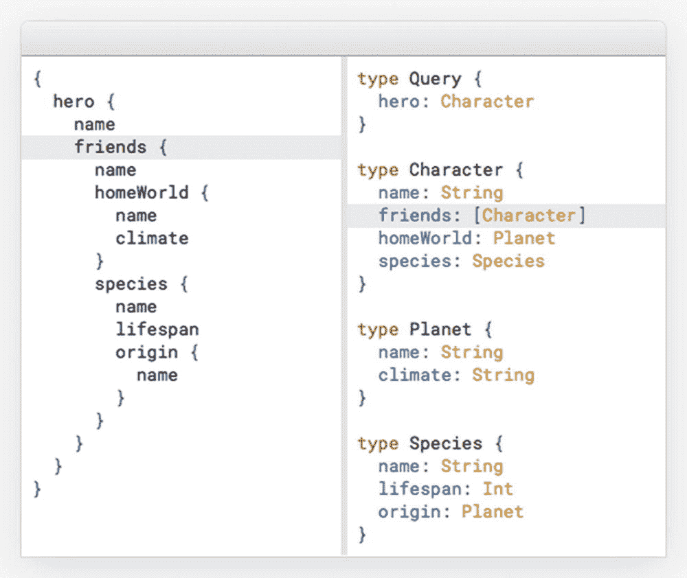

# 1. GraphQL 数据的可视化设计

## 什么是 GraphQL，为何设计很重要？

GraphQL 正受到广泛关注。GraphQL 是 Facebook 的一个开源项目，其主要信息站点位于 [`http://graphql.org/`](http://graphql.org/)。^(⁷)

我感兴趣的是 GraphQL 与设计之间的关系。这种关系无疑非常真实。用 `graphql.org` 自己的话来说：

> “用类型系统来描述什么是可能的。GraphQL API 按类型和字段来组织，而非端点。从单个端点访问数据的全部能力。GraphQL 使用类型来确保应用只请求可能的数据，并提供清晰有用的错误信息。应用可以利用类型来避免手动编写解析代码。”

GraphQL 的要旨可以从图 1-1（来自 `graphql.org`）的示例中看出。

图 1-1：GraphQL 简单示例

图 1-1 的背景是 *星球大战* 的元数据。你右侧看到的实际上是一个 GraphQL 模式的一部分。左侧看到的很可能是对该 API 的一个查询，而返回的数据集将具有完全相同的（数据）结构。

开源的 GraphQL 项目始于 2012 年，属于当今被称为 API 的软件架构范畴。用 Facebook 自己的话说：“……GraphQL [是] 一种由 Facebook 在 2012 年创建的查询语言，用于描述客户端-服务器应用程序数据模型的能力和需求”（GitHub 上的 GraphQL^(⁸)）。

`graphql.org` 网站解释得很好，因此我在此不再重复。Graphcool 有一篇很棒的博文叫“GraphQL 服务器基础：模式”，^(⁹) 其中包含了对 GraphQL 结构和行为的良好介绍。Neo4j ([`http://www.neo4j.com/`](http://www.neo4j.com/) ^(¹⁰)) 的 William Lyon 制作了一份出色的 GraphQL 概述，可作为 Dzone 的“参考卡”获取，见 GraphQL 参考卡^(¹¹)（需要登录）。

确保结构和意义正确的最佳工具是图的可视化。属性图方法对于跨多种不同数据存储的数据库设计非常强大。正如你将在本书中看到的，它同样适用于数据层 API 的设计。

另请注意，当今大多数开发人员只有带“美化”功能的缩进括号显示。由 GraphQL 模式驱动的类型补全功能也是可用的。

### 注

网上有一些“方框和箭头”级别的概念验证绘图工具。例如参见 GraphQL Voyager,^(¹²) GraphQL Visualizer,^(¹³) 或 GraphQL Rover。^(¹⁴) 它们都是“事后”工具，因为它们是根据模式定义进行可视化的。（遗憾的是，它们采用的是传统的方框和箭头风格。）

只有当你正确把握结构和意义时，才可能进行高质量的数据设计，而这正是本书的主题。

## 在 GraphQL 中定义数据结构的问题

如你所知，GraphQL 不是数据库，而是一个数据 API，它由一组 *GraphQL 模式* 描述（并由此产生）。由于很多东西都依赖于模式，你需要确保其高质量。

你同时也在审视从许多不同来源（无论是遗留系统还是新系统）生成数据的服务器。无论何种来源，都可能存在质量问题。*垃圾进，垃圾出*。因此，GraphQL API 设计可能会让你不得不处理数据发现和统一的问题，例如质量、元数据和业务接受度。

焦点应始终放在 GraphQL 服务器所暴露接口的应用或业务面向的方面，这基于服务器端模式中的定义。

考虑以下关于 GraphQL API 的指南和问题：

*   应避免结构性错误（多对多关系等）。
*   意义必须以业务术语提供和保持——最终，业务人员将通过工具接触模型。
*   必须提供唯一性。
*   身份也应得到培育，就像在数据模型中一样。
*   通过 API 展示数据时，应以对业务和开发人员友好的方式呈现（可以说是“美化”）数据——包括处理缺失或错误的数据。
*   模型本质上应是层次化的，因此需要像在多维模型中一样，细心呵护其层次结构及其级别。
*   特别是，当设置跨越底层数据模型中多对多数据结构的 API 结构时，应仔细理解这些结构的遍历方式。

本书的主要价值主张是通过添加属性图风格的可视化，来说明如何在 GraphQL 环境中处理此类问题。

## GraphQL 中的数据内容问题

处理垃圾进/垃圾出的困境关乎：

*   更好地了解数据（又名数据发现）
*   统一来自不同来源的数据（又名数据统一）。

关于数据准备和 ETL 的信息在互联网和书籍中（包括我的一本书）已经（过于）丰富。在 GraphQL 背景下，你应该注意以下 10 个最重要的问题：

*   在 API 中包含业务名称
*   提供身份和唯一性
*   展示键
*   展示状态变化
*   展示数据版本
*   展示日期和时间
*   展示关系和缺失的引用
*   确定哪些对象和哪些关系
*   展示恰当的详细程度
*   建立良好的关系

在解析器端需要做多少工作，很大程度上取决于这些问题，而其中大部分问题超出了你的控制范围：

*   数据源本身的质量（结构、意义和内容）
*   统一来自多个来源（包括上游和下游）的数据时产生的冲突

我们将在本书后面的章节中探讨这些问题。

首先，我们需要解构 GraphQL 语言。

脚注 1   2   3   4   5   6   7   8

