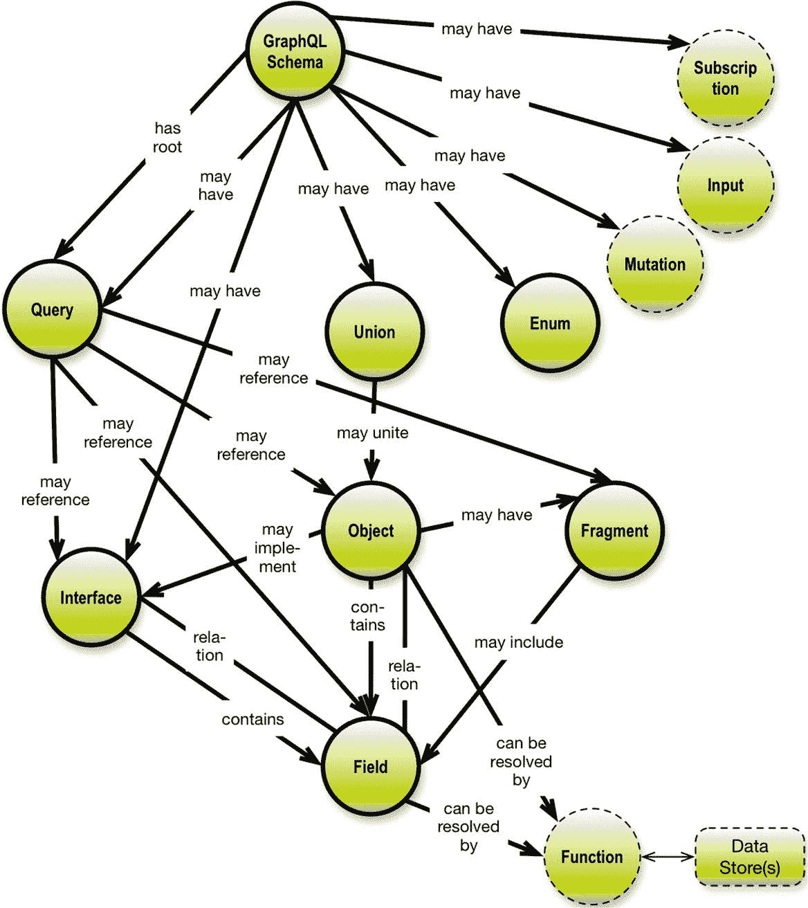
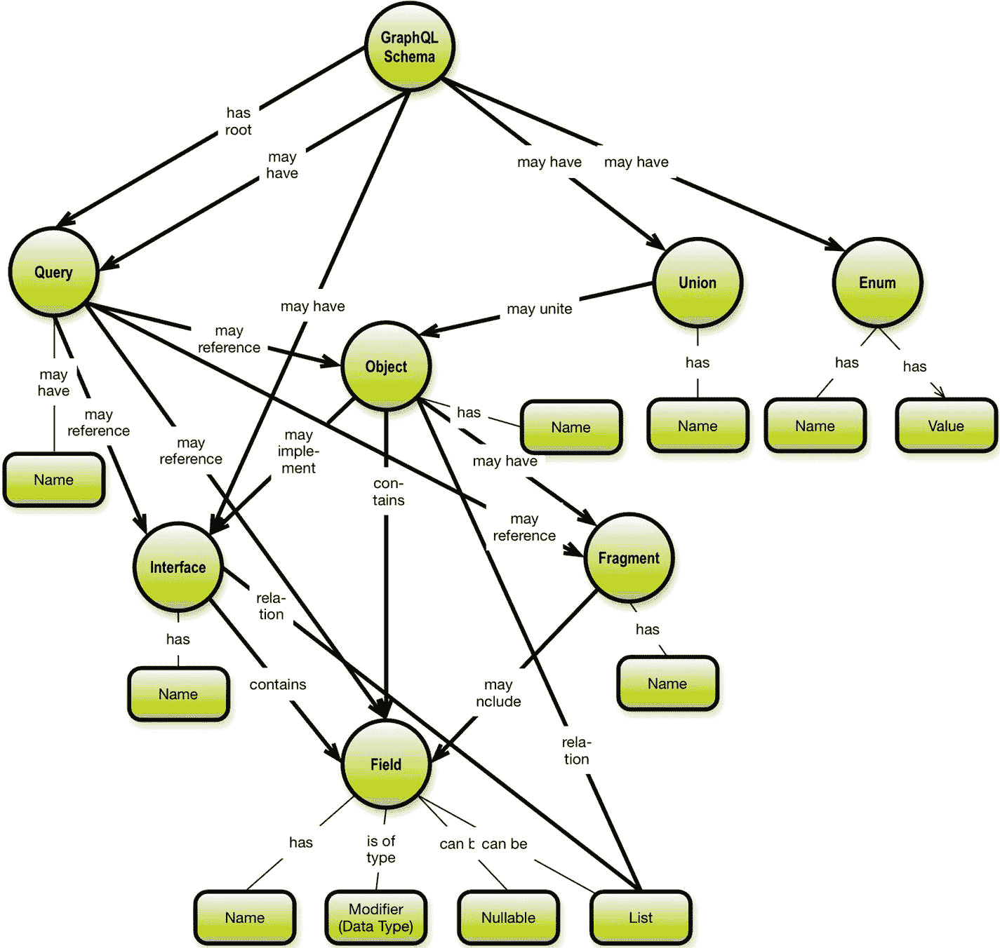

# 2. GraphQL 概念

GraphQL 上下文中定义了许多概念。图 2-1 所展示的概念模型囊括了所有重要的概念。



图 2-1 GraphQL 概念

(有关所有模式的详细信息，请参阅 GraphQL 模式介绍 [`http://graphql.org/learn/schema/`](http://graphql.org/learn/schema/)^[15])。关于图 2-1 所示的图表风格，有几点说明：

*   它是一个有向图（属于概念图类别）
*   关系是有名称的
*   关系可以是：
    *   一对一（无箭头）
    *   一对多（单箭头）
    *   多对多（双侧箭头，图 2-1 中未出现）。

您可以在我的著作 `Graph Data Modeling for NoSQL and SQL`^[16], 2016, Technics Publications (访问 [`https://technicspub.com/graph-data-modeling/`](https://technicspub.com/graph-data-modeling/)) 中了解更多关于这种图表风格的信息。

一些概念，如 `Mutation`、`Input`、`Function` 和 `Subscription`，属于应用/服务器构建服务（更新、插入、数据库映射和推送服务），它们也是模式的一部分。然而，由于我的关注点在于所暴露模型自身的结构和含义，因此在接下来的讨论中，我将忽略所有这些内容。

其余的概念大多如其名所示。以下是一些简短的解释：

| 概念 | 解释 |
| --- | --- |
| GraphQL 模式 | 定义了所暴露数据模型的结构和含义（以及数据操作函数，这里我们不讨论这些函数）。 |
| 枚举 | 基本上是一个值列表，可应用于某个字段。 |
| 查询 | 根查询定义了应用程序图（树）的锚点，并塑造了结果集。 |
| 接口 | 本质上是对象（或查询）的一个“视图”；常用于“子类型化”。 |
| 联合 | 共享相关内容的结果子图的串联。例如，各种类型的人物，如用户、演员等。 |
| 对象 | 一个业务对象（可以想想星球大战示例中的 `电影` 或 `星际飞船`）。 |
| 片段 | 子图的一个子集。内联片段通常与联合结构一起使用。 |
| 字段 | 承载数据的部分。可以是标量或列表（是的，就像重复组一样）。 |
| 指令 | 用户可定义的 GraphQL 语法扩展。 |

`@relation` 是一个很好的 GraphQL 指令示例。它是由 Graphcool^[17] 引入的（参见 [`http://www.graph.cool/`](http://www.graph.cool/)）。我非常喜欢它，因为它命名了关系。

否则，你只是像这样连接对象类型：

```
Type Movie { ..... actors: [Actor] } )
```

通常，可复用的 GraphQL 模式指令可用于多种目的：

*   强制访问权限
*   格式化日期字符串
*   为特定后端自动生成解析器函数
*   标记字符串以进行国际化
*   合成全局唯一标识符
*   指定缓存行为
*   跳过、包含或弃用字段
*   以及更多

所有详细信息请参见 Ben Newman^[18] 的博文 [`https://dev-blog.apollodata.com/reusable-graphql-schema-directives-131fb3a177d1`](https://dev-blog.apollodata.com/reusable-graphql-schema-directives-131fb3a177d1)。

请注意，在 GraphQL 规范^[19]（参见 [`https://github.com/facebook/graphql/blob/master/spec/GraphQL.md`](https://github.com/facebook/graphql/blob/master/spec/GraphQL.md)）的最新工作草案中，以下类型可以由用户定义的扩展进行扩展：标量、对象、接口、联合、枚举和输入对象。这可能会被本地服务用来表示 GraphQL 客户端仅在本地访问的数据，或者被本身就是另一个 GraphQL 服务扩展的 GraphQL 服务所使用。扩展可以是常量、指令或字段定义。

我们感兴趣的模式部分的语法图，在元层面上如图 2-2 所示。



图 2-2 GraphQL 语法元素

圆角矩形表示它们所连接的概念（对象类型）的属性。

让我们从总体上看看数据设计问题，并确定在 GraphQL API 上下文中哪些问题是相关的。

