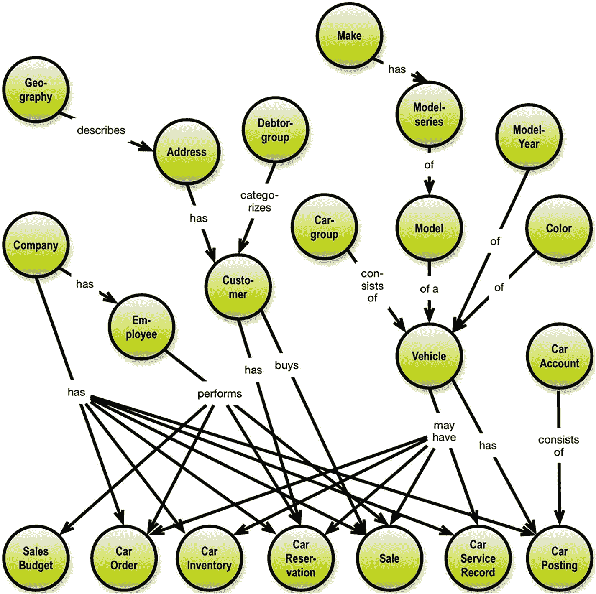

# 3. 入门指南

## 哪些设计层次？

经典的数据建模在多个方面都失败了。我们必须做得比那更好。效果不佳的是概念建模，它已经逐渐淡出，取而代之的可以说是“伟大、实用、快速、统一的数据建模实践”。

如今，许多开发组织采用一步到位的建模方法，在开发过程中必要时执行。逻辑模型和物理模型已经合并。驱动力是交付时间，而统一过程试图回答的是开发一个良好解决方案的两个方面：

*   用逻辑数据模型描述“是什么”
*   描述“如何做”的某些方面，例如，为获得更好性能而进行的物理访问优化

在 GraphQL 上下文中，目标是实现应用程序（或用户）与数据存储之间的完全独立。由于我们（在本书中）只对模式和查询感兴趣，我们应该专注于“是什么”的问题。

换句话说，我们需要对概念层次有一个全新的视角。它仍然能增加业务价值，因为它是与业务人员有效沟通术语、关系等事物的工具。这就是为什么可视化技术必须发挥主导作用。

其次，我们也应该培育“逻辑层次”，因为它（模式）是一个包含关于范围、泛化、抽象和聚合、关系与呈现等设计决策的人工制品。同样，可视化是理解和沟通的绝佳工具。

对于物理层次，我们有解析器函数的各种用例。我们将在本书后面的章节中探讨一些需求。我们会描述一些可能影响解析器功能的考虑因素，但不会给出具体的代码示例，比如 JavaScript 或类似的。

但让我们从头开始。一个好的起点是尝试理解并界定主题领域。

## 获取概览

如果你还不了解范围，你需要对你正在为其创建模式的领域有一个概览。

图 3-1 展示了一个汽车经销商中一些业务概念的概览。

图 3-1：汽车经销商概念概览

注意，上层往往是分类和其他层级结构。中间层级是参与业务流程的核心业务对象。

有趣的是，最低层的概念都是业务事件或其他记录，其中一些是快照类型（比如特定日期的库存）。

这样的概览将为你的 API 工作提供一个良好的开端，所以花几个小时在白板上创建一个概览，让其他业务人员评审它，并让它指导你后续的模式定义活动。

你也可以考虑从数据源开始自下而上地构建概览。通常，自上而下和自下而上相结合的方式能给你带来所需的结果。

请注意，最低层的概念实际上是业务的价值链——从预算开始，演变为采购，然后到库存和销售。（再到后续的维护和盈利能力计算。）

显然，不应存在“孤岛”——一切都应该与其他事物相连。

你可以在我的名为 *《NoSQL 与 SQL 的图数据建模》* [*Graph Data Modeling for* [*NoSQL and SQL*](https://technicspub.com/graph-data-modeling/) ](https://technicspub.com/graph-data-modeling/) 的书中了解更多关于概念级分析和设计的内容，^(²⁰) 2016，Technics Publications (访问 [`https://technicspub.com/graph-data-modeling/`](https://technicspub.com/graph-data-modeling/) )。

注意，即使像汽车经销商这样简单的业务运营，其连接程度也很高。显然，图表示是可行之道，`GraphQL` 开发者可以从这些如今被称为“企业知识图谱”的高层次地图中学到很多。

*一旦你开始审视字段属性，模式数据设计就会变得清晰可见，因为承载属性的概念是业务对象，而没有属性的概念可能只是抽象概念，你可能希望根据需要将其剔除或用属性进行描述。*

请注意，即使你应该尝试映射整个企业（在高层次概念图上），也不应采取太多或太大的步骤。事实上，`GraphQL` 社区近期的进展鼓励采用渐进式方法，并复用现有的模式部分与新开发的模式部分。我们将在后面的章节简要讨论这一点（模式拼接和模式绑定）。

我们正在探讨定义 `GraphQL` 模式和 API。物理的数据存取操作隐藏在解析器函数中，我们将在本书最后部分提及它们。

我们的重点既在于内容含义的业务方面，也在于相关数据的结构方面。

准确地说，我们寻找的是：

*   含义
*   结构

*这就是为什么图可视化是查看结构化信息的通用关键。*

可以公允地说，本书的视觉部分提出了属性图建模风格作为 `GraphQL` 模式的最佳设计模式。

脚注 1

