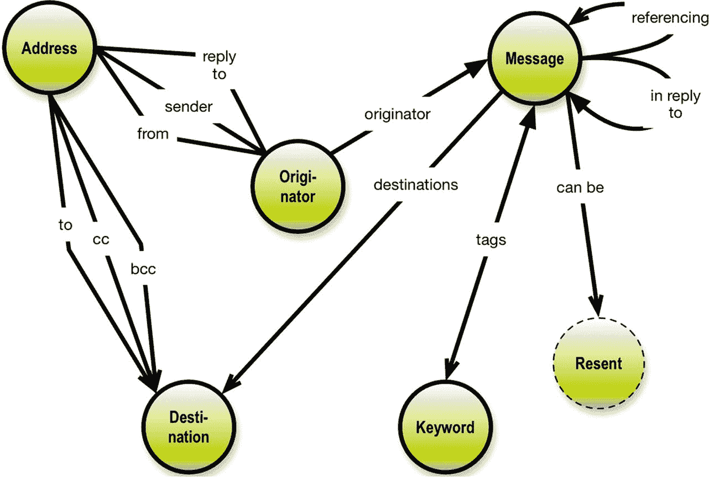
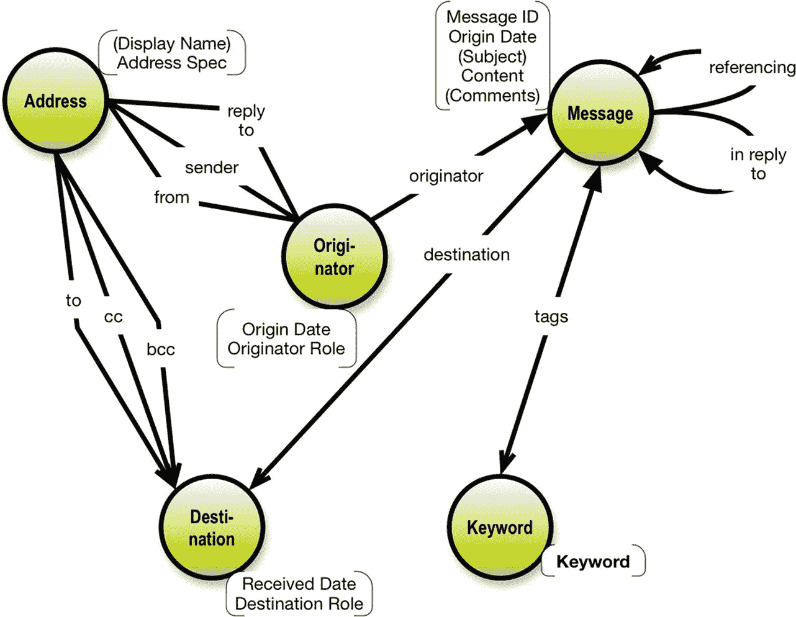
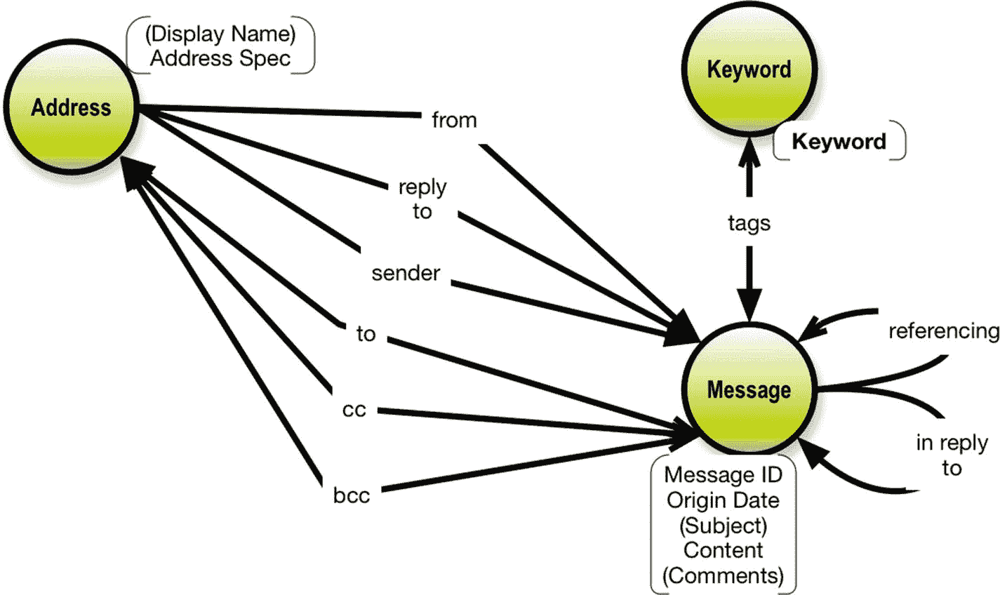

# 4. 一个电子邮件示例

`GraphQL 模式`是一个*数据图*，包含网络中的相关概念，组织为有向图。在某种程度上，你可以说 `GraphQL` 方法让一切都看起来像一个图！（反正实际情况也确实如此。）

这使得所谓的属性图方法对于 `GraphQL 模式` 设计师来说，是一个强大的可视化机会。

我们将从一个简单的电子邮件图数据模型开始。首先，让我们了解一下电子邮件的基本概念（如名为 `RFC 5322` 的互联网消息格式标准所定义）。参见图 4-1。



图 4-1：电子邮件概念概览

图 4-1 忠实于互联网标准中实际使用的术语。如果你试图由此构建一个经典的、规范化数据模型，这会引起问题，我们稍后会讨论。

注意，有些关系是一对一的（例如，来自 `地址` 的 `发件人`），而另一些是多对多的（例如，`关键词` 标记 `消息`）。也存在一些一对多的关系。我们将回到这个问题，但请务必记住：

***注意：关系基数性很重要，因为尽管 `GraphQL` 是一个有向图范式，但在 `GraphQL 模式` 内的可能查询集合是源自根查询的所有子树的子图集合。***

稍微离题一点：这个电子邮件主题领域有点复杂，所以我们暂时跳过消息重发的业务。

让我们继续以详细的属性图形式描述 `GraphQL` 数据范围的边界，如图 4-2 所示。



图 4-2：电子邮件作为属性图

注意，图 4-2 在概念模型上添加了小的属性框。这是在同一图表中描述结构和内容的一种紧凑方式。这使得该图表成为一个真正的属性图模型。（你可以在我的名为 *《NoSQL 与 SQL 的图数据建模》* [*Graph*](https://technicspub.com/graph-data-modeling/) *Data Modeling for NoSQL and SQL* ](https://technicspub.com/graph-data-modeling/) 的书中了解更多关于属性图的内容，^(²¹) 2016，Technics Publications。参见 [`https://technicspub.com/graph-data-modeling/`](https://technicspub.com/graph-data-modeling) 。）

概括一下，圆圈是*概念*，它们是图的*节点*。例如，消息是一个概念，它是多个关系的一部分，比如发件人（谁发送了消息）或“回复自”（回复的是哪条其他消息）。属性可以附加到概念（节点）和/或关系（图的边）上。

该符号使用箭头表示基数性。在图 4-2 中，你可以找到一对一、一对多和多对多的关系。有关属性图的简要解释，^(²²) 参见 [`http://bit.ly/2hMNYvE`](http://bit.ly/2hMNYvE) 。

在 `GraphQL` 背景下，属性图对于表示模式的结构很有用：



图 4-3：简化的电子邮件属性图

*   *节点是类型（对象类型、接口类型和联合类型）*
*   *关系表示类型之间的连接*
*   *属性是类型的字段（标量或列表）*

**注意** 事实上，如果你愿意“忘记”一些业务概念（比如 `发件人` 和 `收件人`），你可以将模型简化得更紧凑。参见图 4-3。


请注意，在图 4-3 所示的紧凑版本中，存在更多的多对多关系。像这样的逻辑模型（是的，逻辑模型可以包含多对多关系）对于 SQL 数据源来说是有问题的，但在图数据库中却非常合理。

请注意，在属性图中，关系是命名的。这很重要，因为这些名称是业务语义的一部分，通过可视化它们，可以更容易地审查和讨论结构所施加的含义。`Graphcool` 提供了一个 `@relation` 指令，用于将关系名称纳入模式中。这是一个非常好的主意。

属性图表示法比大多数图表方法中使用的“方框和箭头”方法要紧凑得多。在 `GraphQL` 领域，有一个名为 `GraphQL Voyager` ([`https://apis.guru/graphql-voyager/`](https://apis.guru/graphql-voyager)) 的工具。`Voyager` 基于一个标准的数据模型图表库，该库采用“方框和箭头”风格。要牢固掌握跨越，比如说，五种或八种对象类型的结构并不容易。属性图表示法要紧凑得多，并且在过去的 15 年里一直很成功，它起源于北欧。总部位于马尔默的 `Neo4J` 发明了属性图模型作为一种数据模型，他们现在是全球图数据库领域的领先企业。本文提出的属性图样式由作者在其 2016 年关于*SQL 与 NoSQL 图数据建模*的书中设计。

至此，我们已经处理了模式可视化问题，这使得 `GraphQL` 既美观又实用：

*   与业务术语和定义（结构和内容字段）保持一致
*   理解以图结构组织的复杂模式

使用 `GraphQL 模式定义语言 (SDL)` 表示，（未压缩的）电子邮件数据模型可以按照以下思路来指定：

```graphql
#
## 邮件图数据模型
#
## GraphQL 模式
#
## 基于互联网消息格式 RFC5322，但有所简化
#
## Copyright Thomas Frisendal, 2017
#

scalar Datetime
scalar AddrSpec
enum destination_role {
  To
  Cc
  Bcc
}

enum originator_role {
  From
  Sender
  Reply to
}

type Address {
  id: ID!
  display_name: String
  address_spec: AddrSpec!
  address_from: Originator! @relation(name: "From")
  address_sender: Originator @relation(name: "Sender")
  address_reply_to: Originator @relation(name: "ReplyTo")
  destination_to: [Destination] @relation(name: "To")
  destination_cc: [Destination] @relation(name: "Cc")
  destination_bcc: [Destination] @relation(name: "Bcc")
}

type Originator {
  id: ID!
  origin_date: Datetime!
  originator_role: originator_role!
  message: [Message!] @relation(name: "Originator")
  address_from: Address! @relation(name: "From")
  address_sender: Address @relation(name: "Sender")
  address_reply_to: Address @relation(name: "ReplyTo")
}

type Destination {
  id: ID!
  destination_role: destination_role!
  received_date: Datetime!
  message: Message! @relation(name: "Destination")
  address_to: [Address]! @relation(name: "To")
  address_cc: [Address] @relation(name: "Cc")
  address_bcc: [Address] @relation(name: "Bcc")
}

type Message {
  id: ID!
  subject: String
  comments: String
  originator: Originator! @relation(name: "Originator")
  destinations: [Destination]! @relation(name: "HasDestination")
  referencing: [Message] @relation(name: "Referencing")
  in_reply_to: [Message] @relation(name: "InReplyTo")
  keywords: [Keyword] @relation(name: "Tags")
}

type Keyword {
  id: ID!
  keyword: String! @isUnique
  messages: [Message] @relation(name: "Tags")
}

type Query {
  messages(limit: Int = 20): [Message]!
}

schema {
  query: Query
}
```

请注意，此示例使用了 `Graphcool` 发明的模式指令 `@relation`，尤其重要的是，它命名了关系。这是我强烈推荐的一个特性。

另请注意，此模式代码并不完整，如果直接使用可能会导致语法错误。`GraphQL` 平台确实有自己的扩展。例如，当在 `Graphcool` 上使用此示例时，会存在下划线和缺少 `@model` 指令等问题。另一方面，此示例的一个子集已用作 `Neo4j` 的基础来构建一个新的图数据库，没有出现问题。

*另请注意，属性图图示通常比模式定义语法更容易阅读和理解！*

让我们看看这个设计可能包含哪些问题。

