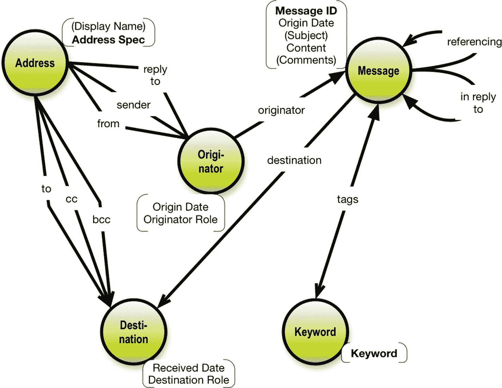
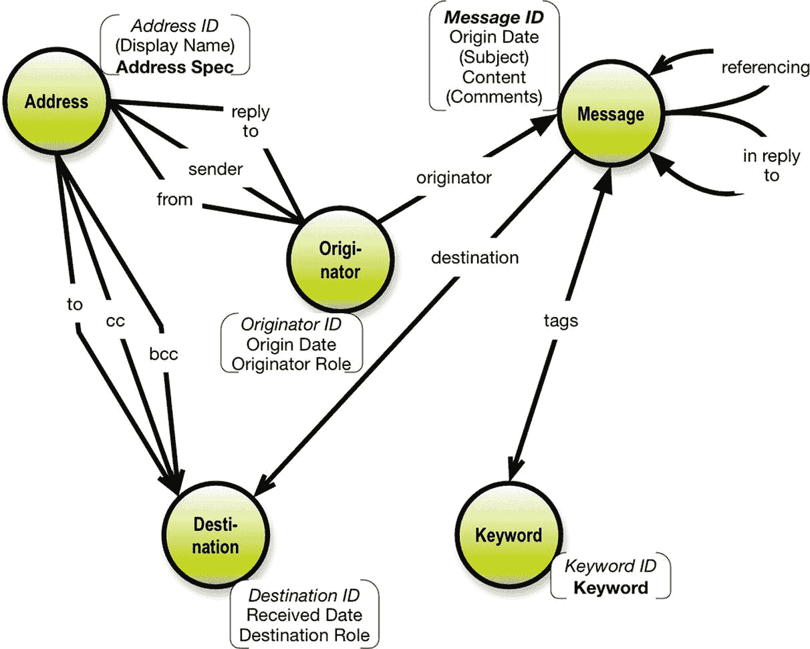

# 6. 呈现业务流程

### 确立身份与唯一性

分析函数依赖、寻找候选键的日子已离我们远去。但我们仍需处理身份与唯一性问题。由于 `GraphQL 模式` 是一个有向图，节点的身份和唯一性必须在模式层面解决。

问题何在？麻烦在于——作为人类——我们其实并不太在意唯一性。名字又算得了什么？我们都知道 James Brown 可以指代许多人。我们使用的技巧是添加上下文，比如“是的，你知道的，那位歌手，灵魂乐教父 James Brown”。因此，当这确实重要时，上下文是确切的答案。但如果一个节点代表一个名叫 James Brown 的人，我们会查看上下文来尝试推断我们谈论的是谁。

幸运的是，我们处于一个连接的图（模式）中，这意味着我们应该查看其近邻环境，并从中推断身份与唯一性。

身份在功能上源自唯一性，而唯一性设定了上下文。

换种说法，身份实际上是属性适用范围的界定（见图 5-2）。

**图 5-2** 身份由唯一性驱动

`接收日期` 与 `目标角色` 共享作用域，两者都由 `目标` 的身份驱动。目前，我们只需说明需要为 `目标` 建立可靠的身份。（这过去被称为“寻找主键”。）

唯一性是识别在业务层面是什么使一个身份成为唯一的问题。

是的，`目标` 由 `消息` 和 `地址` 的组合（无论它们的身份如何定义）唯一地定义。强制唯一性也是 API 模式设计中的一项重要任务。（以前这是“外键”的范畴。）

没有充分的理由添加视觉图标或特殊标记，因为唯一性已由结构暗示。但我确实用粗体突出了 `地址规范`、`消息 ID` 和 `关键词`（属性），因为根据业务定义，它们是唯一的。

总之，身份决定了属性的作用域（例如，`接收日期` 适用于 `目标`），而唯一性决定了在接口中确保唯一性的业务级标准（例如，`目标` 必须在 `地址` 和 `消息` 的身份组合中是唯一的）。请注意，到目前为止我们谈论的是业务层面。在大多数情况下，这些问题可能已经通过数据库中由 IT 生成的“代理键”解决了。

至少在北欧（我来自的地方），使用分配的识别号码（如社会保险号码）通常并不可取。它们无法保证始终保持唯一和持久。对我们 IT 人员来说，发明新的“自然身份”可能非常实用，对吧？多年来我们一直是推动这一趋势的人。业务人员不太反对，有时他们也能理解为什么这类键很实用。

以下是一些在图中寻找唯一性和身份的规则：

*   一个对象的唯一性由来自更高层级概念指向它的关系决定。
*   因此，一个对象的身份就是引用它的那些概念的身份的组合。
*   另一方面，属性共享它们所依赖的对象的身份，这是属性的定义标准。

所以，使用这些简单的视觉检查方法，我们可以在业务层面推断出每个对象类型的上下文及其唯一性：

| 对象类型 | 唯一性 |
| --- | --- |
| `地址` | `地址规范` |
| `发起方` | `地址规范`, `消息 ID`, `发起方角色` |
| `目标` | `地址规范`, `消息 ID`, `目标角色` |
| `消息` | `消息 ID` |
| `关键词` | `关键词 ID`, `消息 ID` |

让我们回顾一下身份和唯一性问题：

`唯一性` 是决定数据实例唯一性的业务级规则。通常，这是业务级“键”的组合，例如票号、线路号、员工号、邮政编码、产品号等。身份是参与类型唯一性的组合结果。例如，一个订单行，对于订单号（来自 `订单` 类型）和订单行号（来自 `订单行` 类型）的组合是唯一的。在大多数 IT 系统中，身份通过唯一的 `ID` 字段（关系数据库中的主键）或其他类型的代理键来确保。显然，必须解决跨多个源数据库的 `ID` 冲突。还需注意，`GraphQL API` 数据的下游需求可能对 API 交付身份和唯一性提出不同的要求。

不匹配之处可以在解析器层修复。稍后在我们将数据库连接到 API 时再详细讨论。

确立业务含义及其规则显然很重要。同样重要的是设计良好的方法来促进业务流程的导航，这就是我们接下来要探讨的内容。

### 呈现键

为了让应用程序和业务用户能够轻松访问反映业务流程的对象和事件网络，我们需要从网络导航的角度来思考。这始于让识别变得容易的问题。

显然，业务端许多拼接的身份组件（唯一性规则）并不实用。作为 API 设计师，我们被允许创造事物。一类可创造的事物被称为“键”。

例如，使用大型拼接键实际上不太实用。我们更喜欢精确、简单（单变量）字段的清晰性。这最早于 1976 年确立（在一个早期的面向对象环境中）。它很快以“代理键”的名义统治了主键和外键的世界。事实证明，业务级键很少是单层字段，除非开发 IT 解决方案的人员定义了它们。想想账号、项目编号、邮政编码之类的东西。即使使用了合理精确定义的概念，它们也不能保证在较长时间内保持唯一。例如，项目编号可能会随时间被重复使用。

### 注意

在讨论键和 ID 时，存在一些重要的作用域考量。

许多数据库设计包含系统生成的代理键。这些键很可能可以直接用作你 API 设计中的"Xxxxxx ID"标识字段，这是很好的。此类键的作用域位于数据库实例级别，但代理键很可能已被带入数据仓库表等结构中。

GraphQL 支持"`ID`"作为标量类型。此类`ID`字段的作用域仅限于该应用程序（服务器）内的该对象类型，且`ID`主要用于从缓存中获取数据。它们在该作用域内是唯一的，但不会超出此范围。

一个在解决方案级别、由系统分配键增强的电子邮件数据设计会是什么样子？

图 6-1 是一个解决方案级别的属性图，它为每个对象类型包含了一个标识符（`XxxxxxxId`）。该标识符的目的是作为对象实例的简单、持久、唯一的标识符。（这正是代理键的特性。）请注意，"Message ID"已经存在于系统中（根据定义，在互联网消息格式标准中）。

如果没有现成的代理键方案，并且数据作用域需要大于应用程序，例如为了下游的数据层面集成，那么你面对的就是一个数据架构设计问题。

键可以在解析器层面处理。稍后会详细介绍。

图 6-1
作为键字段（`ID`）添加的标识符

## 呈现状态变化

有时你必须在接口中处理状态变化。这里我们讨论的是业务状态变化。例如，在金融界，证券交易中的买入/卖出交易会经历一个大致如下的层级状态：

*   已考虑
*   已计划
*   已达成（成交）
*   已初步记账
*   已结算
*   最终已入账

（现实中可能稍微复杂一些。）问题在于同一笔交易在其生命周期中以不同的版本存在。日期和时间对于跟踪这一点是必要的。

在我们的电子邮件示例中，我们可能需要在 API 中具体化（实现）邮件是否被重发（以及何时重发）。

"让数据看起来更美观"显然是可以在解析器层面完成的事情。稍后会详细介绍。

## 呈现数据版本

这让我们来到了数据层面的版本控制。（而不是元数据层面，例如模式变更。）

不仅在数据仓库中，在其他类型的应用程序中，版本控制也是一个普遍的需求。通常需求包括：

*   哪个版本是当前版本？
*   给定版本的起点和终点是什么（精确到日期和/或时间）？
*   这个版本是何时存在的？

有时需要进行追溯更正。例如，可能需要在之后的时间点纠正一个被发现错误的价格。

保留两个版本取决于会计实务，也可能取决于法规要求。务必了解你所在环境的具体情况。

如果你涉及版本控制，应该考虑事件链。（例如，紧随此交易版本之后的*下一个*事件是日期`YYYYMMDD`上的`XXXXX`。）图非常适合对此进行建模和实现。你可能还对先前的事件链感兴趣。（例如，*先于*此交易版本的事件是日期`YYYYMMDD`上的`XXXXX`。）关于如何解决这个问题，请参阅后面章节的讨论。

