# 8. 构建正确的结构

## 哪些对象与哪些关系？

数据模型的结构当然建立在我们已讨论过的对象类型和关系之上。

但更普遍的问题源于选择合适的对象。

我们工具箱中确实有一些普遍适用的工具，如下所示：

*   抽象、概括和特化（又称聚合）
*   分类与类型化
*   生命周期依赖和版本控制
*   识别层次结构

也有一些需要注意的问题领域：

*   一对一关系
*   多对多关系与嵌套对象类型
*   树（不同种类的层次结构）

你最好的帮手之一是具有良好链接短语（依赖关系名称）的概念模型。在白板上创建模型通常就足够了。记住，概念以类似句子的方式（主语/谓语/宾语）与其他概念相关联，例如 `客户-下单-订单`。

这些小句子中的动词能告诉你很多关于结构的信息。目标仅仅是一个属性吗？包含“是”或“有”表示属性。或者它是业务对象之间的完整关系？“下单”表示一个完整的关系，因为它意味着一个将业务从一个状态转变到另一个状态的过程。

## GraphQL 模式缝合，构建拼凑体

GraphQL 正朝着由协同工作的联邦服务器组成的拼凑体发展。新功能被称为：

*   模式缝合
*   模式委托
*   模式绑定

讨论很快变得技术性。相反，让我们关注整体影响。

基本上，这些新功能允许你：

*   进行分布式查询，从一组 GraphQL 模式/服务器获取整合结果。
*   在你自己的模式与他人的模式之间建立集成，无论是在模式层面还是在解析器层面。

得益于其内省功能，GraphQL 具有高水平的“自我意识”，并且它是强类型的。这意味着集成可以受益于让远程服务器相互内省，以确定谁可以在查询中回答什么。这也为公开可用的 GraphQL API 开辟了可能性（并且已经有一些这样的 API）。因此，GraphQL 渴望在开放数据领域占据领先地位，该领域一直由 W3C 技术栈和 SPARQL 端点主导。

Sashko Stubailo 在 [`https://dev-blog.apollodata.com/graphql-schema-stitching-8af23354ac37`](https://dev-blog.apollodata.com/graphql-schema-stitching-8af23354ac37) 有一篇不错的博文^(²⁸)，并且有一个用于最简单级别（[模式缝合](https://github.com/stubailo/schema-stitching-demo)）^(²⁹)的 GitHub 仓库，如图 8-1 所示。

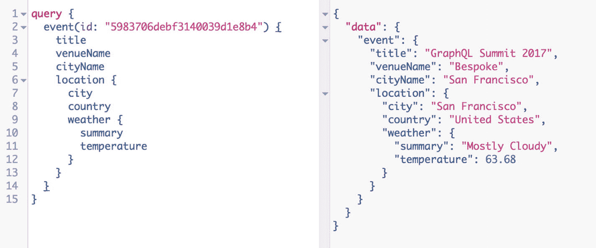

图 8-1 来自 Stubailo 的模式缝合演示

在这个拼凑体中发生的是两个查询被缝合在一起：

*   事件
*   天气预报

它们位于两个独立的服务器上，但它们知道彼此的 URL。这样它们就可以进行集成。

更多细节请参阅 Apollo 文档^(³⁰)（[`https://www.apollographql.com/docs/graphql-tools/schema-stitching.html`](https://www.apollographql.com/docs/graphql-tools/schema-stitching.html)）。

结果很明确：

*   你应该调查是否已经有其他人创建了（部分的）API，供你利用。
*   你不应该试图一次性解决所有问题。相反，采取一种拼凑的方法。
*   你应该在你的工作范围内合作和共享，以便每个人都为你所处的 GraphQL API 领域做出贡献。

结合还有从 GraphQL 模式生成模拟数据的工具这一事实，你在应用迭代开发以及前端和后端的并行开发方面拥有丰富的可能性。但是，拥有路线图和预期主要对象类型的高层次概念图会大有帮助。

## 呈现适当详细程度

抽象是你武器库中最强大的武器。抽象像图层一样工作，如图 8-5 所示。

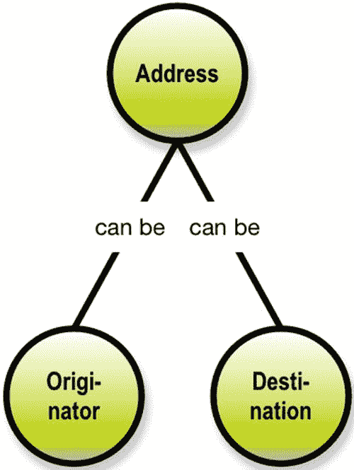

图 8-5 概括化与特化

因此，你可以将发起方地址和目的地地址概括化为仅仅“地址”。或者，你可以将地址特化为“发起方”和“目的地”。

### 注意

向上移动到更高层级是泛化；特化则是向下深入到越来越多的细节。

泛化使事物更具普适性，但同时会丢失一些细节。

而特化则让你获得更多细节，并随之带来更高的复杂性。问问你的业务专家他们真正想要和需要什么。（通常，他们想要的比需要的多一点，因为他们担心这是唯一能获得它的机会。）

事实上，电子邮件属性图的压缩版本就是一种泛化，如图 8-6 所示。

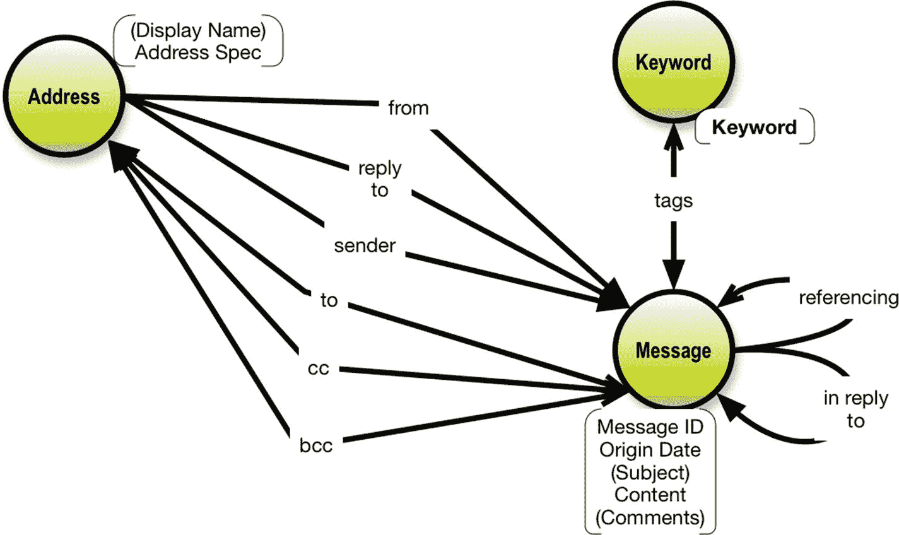

图 8-6

为简化而泛化

我们将`Originator`和`Destination`泛化，使其不再显式存在。然而，它们所扮演的角色——“发件人”、“收件人”等——作为关系在模式中得以保留。

另一种降低引用复杂性的有用方法是使用分类，这与特化相关。我们可以引入一个“消息类型”的概念，来指示消息是否为高优先级，如图 8-7 所示。

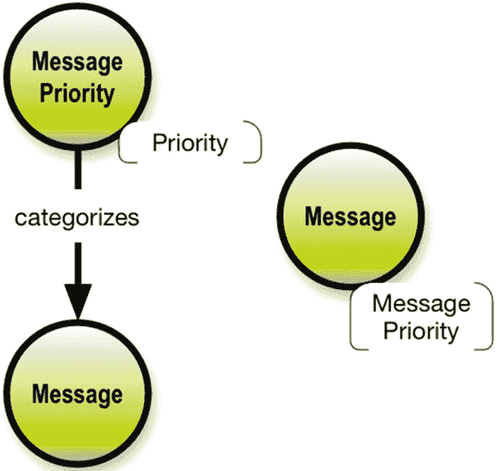

图 8-7

优先级作为类型或属性

显然，通过将`Priority`属性下推到`Message`级别可以简化这一点。

有时你可能会遇到不寻常的数据结构，这些结构可以用不同的方式处理。

### 记住

始终致力于降低复杂性。

关系数据建模中规范化方法的问题之一是它会导致大量的表。其中一些表仅作为关系的占位符。

一种这样的场景是多重类型关系，这种关系有时看起来是合乎逻辑的。

让我们来看一个三元关系。

地址可以用作目的地，而目的地可以描述为三种角色：收件人（to）、抄送（cc）和密送（bcc）。这基本上是一个具有三个参与概念的三元关系。

事实上，多对多关系背后几乎总是存在一个真实的业务对象。在多维（数据仓库）建模中，有一个称为“无事实的事实”的结构，意思是除了指向维度的外键之外没有任何信息的事实表。这样的表是所有关系的源头，而且事实上（双关语），即使无事实的事实，一旦你开始寻找，大多数情况下也具有属性（度量）。见图 8-8。

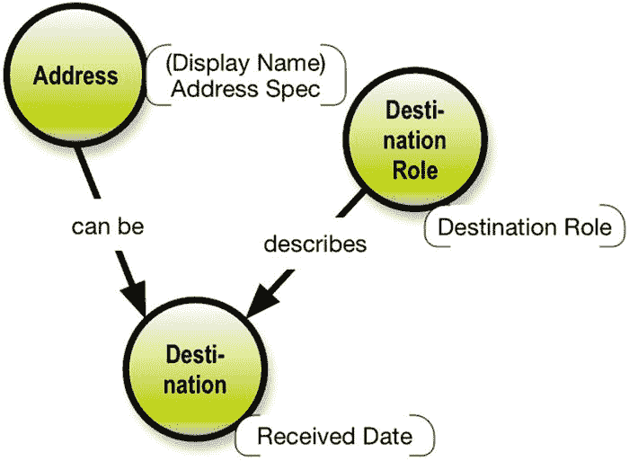

图 8-8

使用“桥接对象类型”解决三元关系

可视化这种三元关系的另一种好方法是利用属性图模型在关系上设置属性的能力。

如果你的最终目标是属性图数据库（如`Neo4J`或类似数据库），这种方法效果很好。见图 8-9。

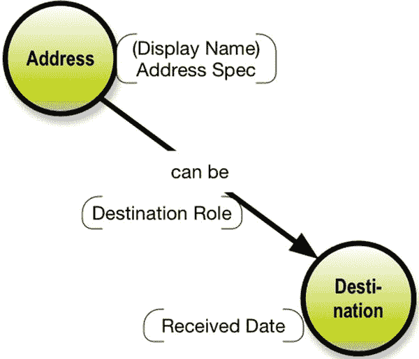

图 8-9

作为关系属性的角色

然而，如果你的数据存储是 SQL 数据库，你很可能需要将三种业务对象类型实现为三个表。在我看来，表示三种对象类型是公平且切中要害的。角色确实存在，在多对多关系的“桥接表”上使用这种分类是个好主意。

仔细想想，在关系层级上使用属性的另一个常见用途是“权重”。它表示，例如，参与度或部分所有权或类似的局部度量。这当然可以在属性图中作为边上的属性来实现，但在大多数人的观念中，一个“参与度”业务对象类型会更有意义。这让我们回到一个观点：多对多关系中，经常能找到一些实质性的东西，就像前面的例子一样。

### 注意

在`GraphQL`模式中，关系——无论是简单的名称-名称引用还是`Graphcool`模式指令`@relation`——都是不携带信息的。这让你可以选择使用专门的对象类型来承载描述关系的属性。这是一个解析器（resolver）的问题。

另一个奇特的例子是一对一关系。对象类型及其属性之间总是一对一关系，也称为*依赖*（dependencies）。但一对一关系也确实发生在业务对象类型之间。虽然不那么常见。例子往往更多属于业务规则领域，而不是数据模型领域。图 8-10 展示了一个我们之前见过的例子。

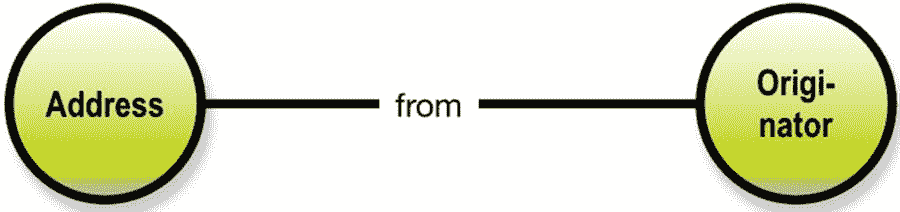

图 8-10

每个发件人只有一个来源

每个发件人只有一个“发件人”地址，对我来说，这似乎是互联网电子邮件历史遗留设计中的一项业务决策。发件人是一组“发件人”地址的邮件是完全可以想象的。

然而，值得检查该关系是否携带信息。就像前面的例子那样，情况可能如此。可以想象，“回复”（in reply to）关系承载了一个日期，由此产生的 API 设计可能应该不同。

顺便说一句，这再次证实了一个假设：大多数时候，多对多关系是携带信息的构造。

一般来说，节点和关系都可以（应该）有“名称”（正式称为节点的标签（labels）和关系的类型（types）），就像图 8-10 中的概念及其关系一样。

关系是有方向的，通过箭头可视化。

节点和关系都可能与属性相关联，属性是键值对，例如`Color:Red`。在数据模型层面，我们称键为属性名称。

### 注意

带标签的属性图模型是我们今天拥有的最灵活的通用数据模型范式。

重要的是名称和结构（节点和关系）。属性通过添加内容来补充解决方案的结构。属性基本上也只是标签，但它们可以表示“身份”（数据模型层面的键的一般概念）。

最后，自引用也会时不时地出现在数据模型中。图 8-11 展示了一个双重例子。消息可以引用另一条消息，无论是引用还是回复。

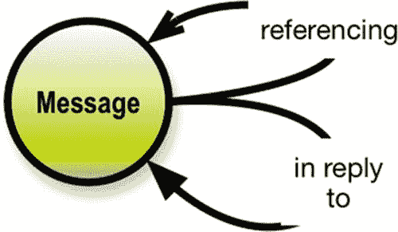

图 8-11

两个自引用

当你以后用`GraphQL`查询遍历这种自引用时，你应该理解由此产生的树状结构。最好使用`GraphiQL`来感受一下，通过操作模式。

你还应该相当确定自引用在任何意义上都不携带信息。像这样的关系经常携带开始日期和结束日期。这可能需要一个单独的小型对象类型，其名称反映关系的周期性，并以两个日期作为属性。关于这方面的更多内容将在后面的解析器章节中讨论。

你是否在努力理解数据结构？画一个简单的属性图——那会有所帮助！

## 良好的关系

关系对于构建正确的结构至关重要。即使是简单的一对多关系，也有一些需要考虑的因素。运用概念和关系分析方法的一部分理念在于，你应该关注概念之间的链接短语（即关系箭头上的标签）。如果这些名称定义得当，结构和含义必然会更加准确。

请查看图 8-12 中具有命名关系的属性图。

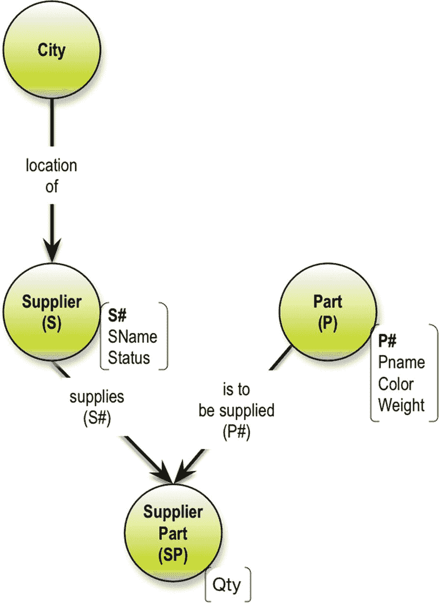
**图 8-12**
命名关系

良好、跨对象的关系基于行为动词。在此示例中，动词表示定位（`City`是`Supplier`的位置）和供应链（`Supplier`供应`SupplierPart`，而`Part`由`SupplierPart`供应）。`SupplierPart`实际上是`Suppliers`和`Parts`之间多对多关系的一个实例。名称`SupplierPart`听起来有点人为构造，不太像直接从业务术语中得来的。挑战在于我们拥有关系上的信息。`SupplierPart`携带了一个`Qty`属性（在现实中至少还包括供应日期）。图 8-13 展示了它的多对多设计。

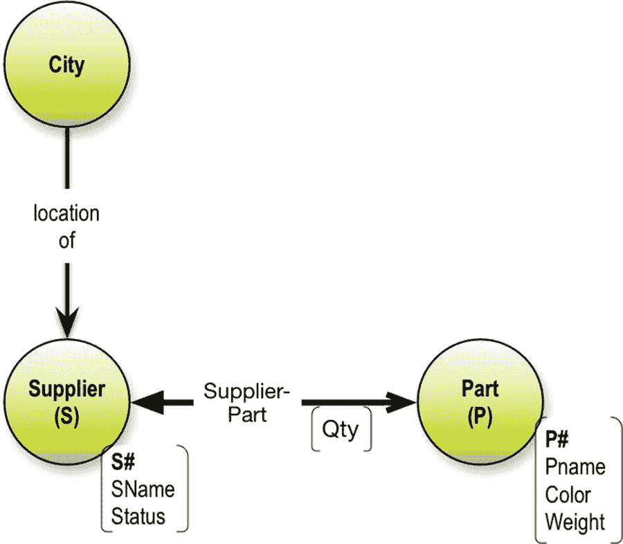
**图 8-13**
供应商零件多对多模型

通常，事物和事件不应放在关系上。在某些（大多数）图数据库中，这是允许的。这与属性配合得很好，这些属性描述了关系的特征，例如权重、所有权百分比等。

有人可能会争辩说，例如，所有权百分比是一个称为所有权部分的实体的属性，该实体是帮助实现所有者与财产之间多对多关系的关系型“桥接”表。这主要是一个业务决策。如果业务人员不认可所有权部分的概念，那么事情就到此为止。

频繁（但不总是）情况下，一个“桥接物”可以被命名，并且它通常会携带信息，就像供应商-零件示例中那样。这里要小心——构造的对象类型必须有业务能够理解的、有意义的名称和定义。另一方面，如果你不使用图数据库，你将被迫（至少在 SQL 中）具体化“桥接表”，并将关系拥有的信息放在那里。

在图数据库源中，多对多关系完全没有问题。我们将在后面的解析器讨论中对此进行讨论。

这对 GraphQL API 有什么影响？结果是树结构。在简单的供应商零件示例中，基本上有两种方式可以构建这棵树，如图 8-14 所示。

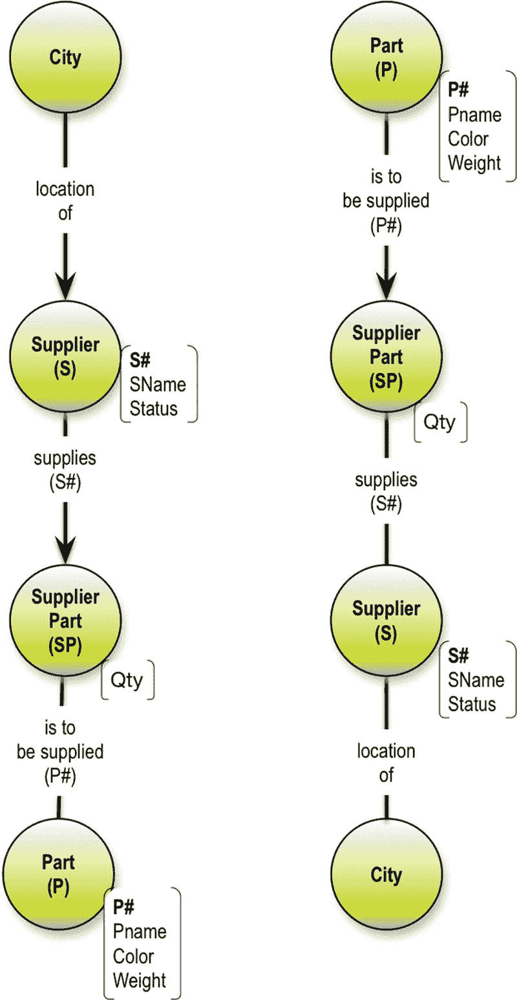
**图 8-14**
供应商零件可能的树结构

问题是，哪个解析器函数应该生成关于多对多关系的信息？在这个例子中是`QTY`，它可以与`Supplier`一起生成，也可以与`Part`一起生成。这在整个系统中并不是非常灵活。如果你选择在模式级别将多对多关系的`SupplierPart`具体化为自己的对象类型，你将获得最高程度的灵活性。

对象/事件始终是节点，它们可以扮演不同的角色并改变状态。新状态是新节点吗？这取决于业务类型。有时，新状态引入了关于对象类型/事件的新信息，这种情况下需要在两种对象类型与附加属性之间做出选择。问问业务专家，他们认为什么是最自然的表示方式。

通常，多对多关系是一个挑战，必须处理，因为 GraphQL 查询暴露的是树结构（层次化的），而没有关于关系本身的信息。

要小心驻留在关系上的信息。你无法在 GraphQL 中做到这一点，因此你可能需要为此发明一个新的对象类型。多对多关系也是如此。在查询中遍历它们时要小心。如果模式不正确，或者数据存在冗余，你就有创建笛卡尔积和“地狱查询”的风险。这将在后面关于解析器的部分进一步讨论。

记住：当你探索“陌生”数据时，可视化是你得力的助手。

脚注 1   2   3   4   5

