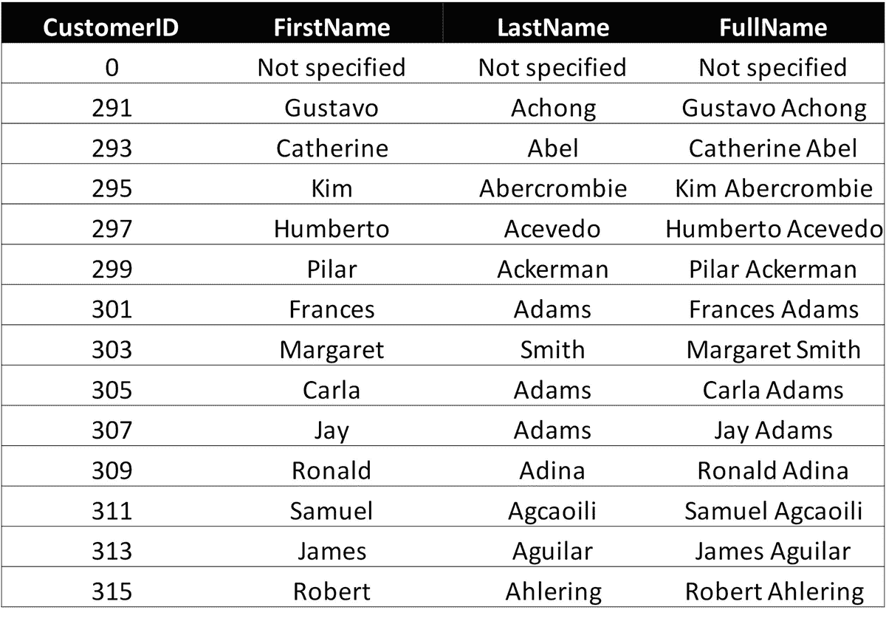

# 10. 解决遗留 SQL 数据问题

在新的空数据存储中使用 GraphQL 是简单的方式。在许多情况下，数据库模式和解析器（如果需要）可以从 GraphQL 模式生成或推断出来。

如果你计划在现有数据库中使用 GraphQL，你需要注意你的步骤，如图 10-1 所示。

**图 10-1**
跨越遗留河流通往 GraphQL 的桥梁

多年来活跃于数据仓库社区，我对 SQL 数据库“丛林”非常熟悉。将 GraphQL 应用于 SQL 数据的这一令人困惑的遗产是本章的背景。在过桥时，请期待一些惊喜。

你可以使用额外的工具，例如：

*   对象关系映射器（`ORMs`）（例如，位于 [`http://docs.sequelizejs.com/`](http://docs.sequelizejs.com/) 的 `Sequelize`^(³⁴)）
*   SQL 生成器（例如，位于 [`https://github.com/stems/join-monster/blob/master/README.md`](https://github.com/stems/join-monster/blob/master/README.md) 的 `join-monster`^(³⁵)）

我对其中任何一个都没有实际经验；你必须自己构建。从它们的网站来看，两者都不错，而且它们确实有一些客户。我对 `ORMs` 有点怀疑。在我看来，你必须构建另一个模式，仅仅是为了映射的目的。我认为这可能相当于花费相当多的时间。

在下面的例子中，我期望你的平台可以构建解析器函数，这些函数可以包含或发出（几乎不受限制的）`SQL` 命令。

让我们按照之前介绍一般问题的相同顺序，来逐步了解具体的遗留问题。

## 数据名称

通常，你需要将物理列名和表名映射到 GraphQL 类型的业务术语。这很烦人，也很耗时。

等等！也许有人已经完成了部分工作？它可能存在于报表或数据仓库的上下文中，可能就是包含映射关系的 SQL 视图和/或 ETL 作业。找找看。我是个 SQL 视图的粉丝，所以如果你需要映射，就在视图中完成，这样可以复用。如果底层数据库模式发生变化，你可以在一定程度上继续支持视图的结果集，而不影响 GraphQL 模式。使用视图也可能为你提供更好的机会，来利用 GraphQL 和源视图之间的“自动映射”。

使用`SELECT *`不是一个好主意，因为数据模型确实会变化，它们通常会扩展新的列，偶尔也会改变物理数据类型。所以这实际上是支持使用视图的又一个充分理由，可以让你的 API 更好地与物理数据隔离。

## 标识、唯一性与键

### 注意

许多 SQL 数据库设计包含了系统生成的代理键。这些键很可能可以作为你 API 设计中的`Xxxxxx ID`标识字段被复用，这很好。此类键的作用域通常在数据库实例级别，但代理键可能已被带入数据仓库表等。GraphQL 支持“ID”作为标量类型。这种 GraphQL ID 字段的作用域是在该应用程序（服务器）内的那个对象类型中，并且 ID 主要用于从缓存中获取数据。它们在该作用域内是唯一的，但也就仅此而已。

数据库中的唯一性控制方式与业务级别的唯一性规则定义方式不同。通常，表中的一行记录应在多个业务键组成的连接字符串中唯一。而这些键又经常代表一种层次结构，例如客户/订单/订单行/产品等等。

标识是控制数据库中唯一性的事物。最常见的是一个单一的“代理键”字段来保证唯一性，例如保证订单行的唯一性。原则上，代理键不应携带除行标识之外的信息。但情况并非总是如此。

在过去 20-30 年的主流数据建模中，代理键的使用非常广泛。聪明的人们给它们增加了另一个用途：标识不存在的实体！（我不会深入探讨 SQL `NULL`，因为 SQL `NULL`通常没什么好处。）如今许多应用程序依赖的是，ID（键）等于 0（零，非空）代表连接另一端的不存在实例。这当然意味着，在连接引用的数据库表中，应该存在一行`"Id" = 0`的记录。这些行通常包含默认值。这里的问题是避免使用 SQL 外连接，否则就需要用到外连接。留意“零记录”。参见图 10-2。

图 10-2：一个典型的零记录示例

如果表中没有代理键，那么就必须检查主键。通常主键是包含信息的，这是应避免的。即使是社会安全号码之类的信息也可能随时间变化。某些项目编号可能在一段闲置期后被重新使用，等等。

如果你需要生成全局唯一的对象标识符，使用 GraphQL 模式指令可能是个好方法。

## 状态、版本与管理数据

状态（例如：计划中、已订购、已交付、已归档）在旧的数据模型中并不总是被显式建模。它们可以通过 SQL `CASE`结构轻松生成，无论是在解析器函数中还是在底层视图中。业务人员喜欢它们，因为他们一直在寻找状态信息。

版本问题其实也一样。理想情况下，大多数业务需求可以通过三个新概念的简单结构来满足：

*   生效日期（对于未知的历史日期，可以是 1900-01-01）
*   失效日期（对于未知的未来日期，可以是 2099-12-31）
*   当前版本（一个标志字符串，例如包含“是”或“否”）

但是，如果遗留数据没有以版本形式持久化，你就必须到数据仓库或数据保险库数据库中寻找旧版本。如果它们不在那里，你就无法轻易满足该业务需求。如果你能为此获得资金，你可以研究时间序列范式，包括用于解决版本化数据持久化的键/值存储和图数据库。

其他管理数据可以包括（如适用）：

*   `UserId`：创建该记录的用户
*   `CreationDate`：记录的创建日期
*   `UserId`：上次更改此记录的用户
*   `ChangeTimeStamp`：上次更改的日期和时间
*   批处理标识：加载此记录的批处理
*   `LoadTimeStamp`：记录加载的时间戳
*   源系统名称（如果此记录不是黄金记录）
*   以及其他信息

在你所在组织的报表和数据仓库部分中寻找状态、版本和其他管理数据。可能有人已经完成了这项艰苦的工作。

## 标量数据类型

GraphQL 的类型系统旨在具有强制性，服务器将尽最大努力按照模式中指定的数据类型提供数据。这可能涉及将浮点值截断为整数值，如果这是保持“符合契约”所必需的。但在解析器层面仍然需要进行转换。检查你的数据。

另一个问题是“美化”你的数据。一个三位数的整数可能是一个产品类别代码，但它必须伴随一个文本描述。许多用户不会记住代码值。

GraphQL 类型系统在最新的 GraphQL 模式规范工作草案中是可扩展的。观察它在未来一年左右的发展会很有趣。

## 日期与时间

自 20 世纪 60 年代以来，IT 领域一直在与日期和时间作斗争。

让我们从基础开始。在许多数据存储和 DBMS 产品中，日期和时间被混合到各种数据类型中。有些类型可能是：

*   纯日期
*   日期和时间在一个属性中
*   时间在其自己的属性中

注意你从哪个服务器获取日期和时间信息。这在很大程度上取决于这些服务器和数据库实例的设置。

另一个问题是处理缺失日期。如果你想避免`SQL NULL`（谁不想呢？），你可以定义默认的最小和最大日期，在日期（或时间）缺失时提供。有时我们在记录中记录未来日期，这些事件现在已经发生，但相关的未来事件将在几年后才发生（例如预算）。这不是非常优雅的建模，但它确实会发生。你最终可能不得不定义一个“未来未定日期”（一个你选择的默认最大日期）。

在数据仓库领域，日期/日历维度是给定的需求。但出于与报表和分析需要了解日历（例如公共假日或银行工作日）相同的原因，普通应用程序也需要跟踪日期的几个属性，有时还包括时间。请做好准备。

## 命名关系

正如本书前面指出的，关系名称对于传达数据结构的含义非常重要。因此，在 GraphQL Schema 层面，我建议你使用 Graphcool 的`@relation`指令来传达这些结构信息。

在解析器层面，你的任务是弄清楚如何执行一个满足关系的连接。这可能是一个外键约束（如果你幸运的话）。它也可能是两个不同表中具有相同名称的两个列。或者，它可以从目标表（一个或多个列）的索引推断出来。再或者，你必须知道或者使用数据剖析来发现数据中的表间依赖关系。

## 关系类型

### 一对一关系

这些关系有时是 one-to-none，有时是 one-to-one。对于第一种情况，解析器应处理缺失实例的默认属性。通常，将两者分开有良好的业务原因，如果解析器能够产生这种效果，那么这就是你必须做的。

### 一/零 对 零/多关系

同样，如果关系为空（例如，一个没有订单的客户），树就到此为止。我认为使用“Not Available”而不是 nothing (a null) 可能更好。

### 多对多关系

这正是你需要一个大缓存的地方。你必须复制冗余信息，以维持结果集的树结构。回想一下供应商/零件的例子，如图`10-3`所示。

`图 10-3`

供应商/零件多对多模型

这对 GraphQL API 有什么影响？结果是树结构。在简单的供应商零件示例中，基本上有两种构建树的方式，如图`10-4`所示。

`图 10-4`

供应商零件可能的树

问题是，哪个解析器函数应该生成关于 M:M 关系的信息？

在这个例子中是`QTY`，它可以和`Supplier`一起生成，也可以和`Part`一起生成。这在整个系统中并不十分灵活。如果你选择在模式层面将 M:M 的`SupplierPart`具体化为它自己的对象类型，你就拥有了最高程度的灵活性。

## 缺失信息

处理缺失信息近乎是业务规则驱动的。我通常倾向于在源数据模型之上的功能层（如解析器函数）中处理此类事情。解析器需要解析缺失信息。

在这一层面，问题应以符合平台能力的方式处理。

但在面向业务的（API）一侧，我更喜欢默认值方案，而不是使用 NULL。关于这一点有很多文章，尤其是来自 Kimball Group 的。基本要点如下：

*   保留“虚拟”记录，并让它们参与层次结构和其他连接。（如果你在未知级别上报告数字，你将在聚合中需要`Unknown`实例。）
*   对于缺失信息，至少使用 Unknown 或 Not Specified 方法。
*   对于缺失日期，使用默认的低值和高值日期。
*   等等。

## 关系上的属性

这在 SQL 中不被支持。最接近的是一个辅助/桥接表，它也应该在 GraphQL 层面具体化为一个类型。

脚注 1   2

