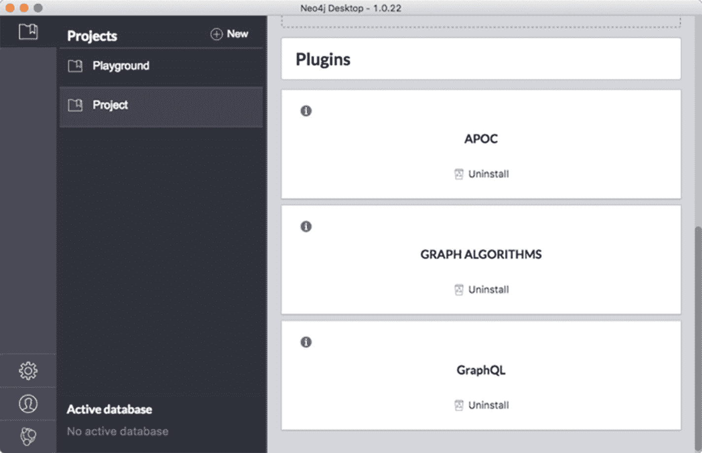
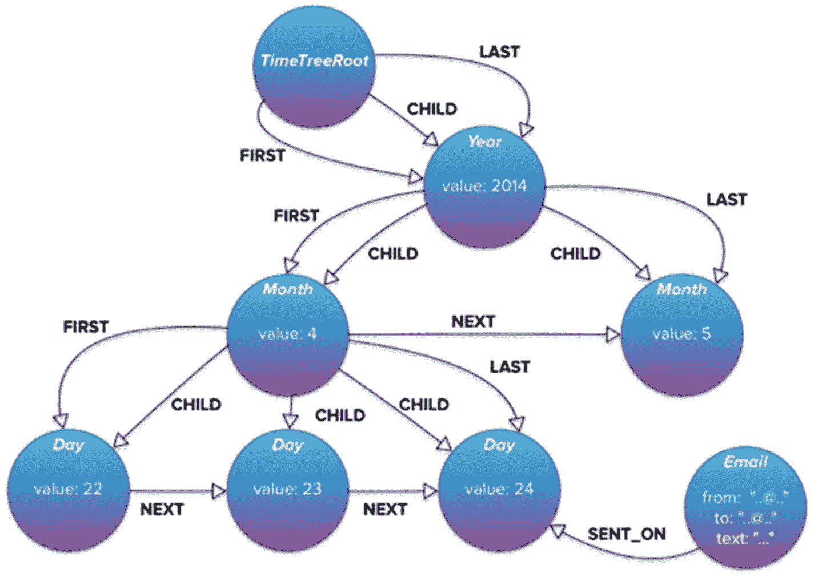
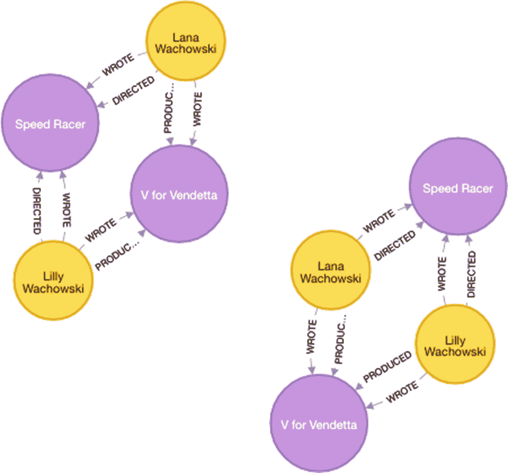

# 11. 将 GraphQL 与现有图数据库结合使用

既然 GraphQL 基于图思维，我们如何能在图数据库之上使用 GraphQL？这当然是一个相关的问题。为了回答这个问题，我们首先看一个用例，即从一个 GraphQL API 支持一个现有的图数据库。之后，我们看一个常见的用例，即 GraphQL API 将与一个新的图数据库一起使用。

由于转换是基于 DBMS 的语言，我使用 Neo4j^(³⁶) 图平台的语言（参见[`https://neo4j.com/`](https://neo4j.com/)）。它被称为 Cypher，是一种非常强大的声明性语言。虽然 Neo4j 使用 Cypher，但该语言已通过 openCypher 项目开源，现在有许多其他项目也使用 Cypher^(³⁷)（参见[`http://www.opencypher.org/`](http://www.opencypher.org/)）。

## Neo4j GraphQL 插件

Neo4j 在将 GraphQL 集成到 Neo4j 平方方面做得非常出色。最简单的使用方法是在 Neo4j Desktop 界面中安装一个插件。

Neo4j 开发者关系部门的 Will Lyon 制作了一个出色的视频来解释一切。它被称为“Using The Neo4j-GraphQL Plugin With Neo4j Desktop”^(³⁸)（参见[`https://youtu.be/J-J90uwugb4`](https://youtu.be/J-J90uwugb4)）。

基本上，该插件使你能够直接从 Neo4j 提供 GraphQL 端点，通过：

*   从现有的 Neo4j 数据生成 GraphQL 模式
*   基于你提供的 GraphQL 模式提供 GraphQL 端点
*   将 GraphQL 实时翻译为 Cypher
*   自动生成用于 GraphQL 查询的查询类型
*   自动生成用于 GraphQL 写入操作的变更类型
*   通过 GraphQL 作为`@cypher`模式指令暴露 Cypher

你也可以在 Will Lyon 的博客文章“[Using The Neo4j](https://blog.grandstack.io/using-the-neo4j-graphql-plugin-in-neo4j-desktop-c8a60aa014d9)-GraphQL Plugin In Neo4j Desktop”^(³⁹)（参见[`https://blog.grandstack.io/using-the-neo4j-graphql-plugin-in-neo4j-desktop-c8a60aa014d9`](https://blog.grandstack.io/using-the-neo4j-graphql-plugin-in-neo4j-desktop-c8a60aa014d9)）中找到有关该插件的更多信息。


## 生成你的第一个 GraphQL 模式

其实非常简单。你从 Neo4j Desktop 安装插件，如图 11-1 所示。



**图 11-1:** 在 Neo4j Desktop 中安装插件

安装插件后，你需要安装 GraphiQL 应用的 Electron 版本^(⁴⁰)，用于浏览和测试。关于设置端点和授权头以建立连接（不是什么大事）的详细信息，请参考视频和博客文章。

要根据 Neo4j 数据库中的数据生成模式，请向 Neo4j Desktop 发出此命令：

```graphql
CALL graphql.idl(null);
```

你可能需要转换现有数据，使其适合通过 GraphQL 展示。这取决于数据的质量以及元数据（标签、属性名称和关系类型）的质量。在接下来的章节中，我们将讨论潜在的问题。如果你需要做转换，值得知道的是 Neo4j-GraphQL 集成包含一个 `@cypher` 指令，它使你能够在 GraphQL 模式内做一些图形化的事情。看看这个包含嵌入式 `@cypher` 语句和类型扩展的示例：

```graphql
type Movie {
    title: ID!
    released: Int
    tagline: String
    actors: [Person] @relation(name:"ACTED_IN", direction:IN)
    director: Person @relation(name:"DIRECTED", direction:IN)
    recommendation(first:Int = 3): [Movie]
      @cypher(statement:
        "MATCH (this)-[:ACTED_IN]->()-[:ACTED_IN]-(reco:Movie)
         WHERE this <> reco
         RETURN DISTINCT reco LIMIT {first}")
}
schema {
   mutations: Mutations
}
```

请注意，带有 `@cypher` 模式指令的字段将成为“计算”字段。这种技术允许在数据存储于 Neo4j 的方式与在 GraphQL 层展示的方式之间进行一些转换。

本章引用的视频和博客文章涵盖了在现有图数据库之上以及在空白图数据库之上使用 GraphQL 的操作指南，后者是本书的最后一个主题。

让我们重新审视遗留的 SQL 问题，看看它们在现有 Neo4j 数据库的上下文中如何应用。

## 数据名称

Neo4j-GraphQL 插件将从现有的图数据中派生出 GraphQL 模式。通过采样，集成为每个 `节点标签` 添加一个类型，所有找到的属性及其类型都作为字段。

这给你提供了一个比从零开始好得多的起点。然而，当然，这在很大程度上取决于现有数据模型的质量。所以，略带讽刺地说，你应该预期会花一些时间将不太好的名称映射到面向业务的名称上。这种映射将通过编辑生成的 GraphQL 模式来完成，例如使用 `@cypher` 扩展。就像处理 SQL 一样，你可能会在这里花费时间，但花费的时间应该比在 SQL 中需要做的少。我见过的一些 SQL 数据库几乎需要考古学家才能确定数据标识。

## 标识、唯一性和键

没有约束 Neo4j 也能运行，但你也可以拥有约束。数据剖析^(⁴¹)（参见 [`https://neo4j.com/blog/data-profiling-holistic-view-neo4j/`](https://neo4j.com/blog/data-profiling-holistic-view-neo4j/)）相当容易，你应该花些时间仔细检查候选键。所以，就像处理 SQL 一样，你可能需要在这里花费一些时间。

Neo4j 节点 ID 仅供内部使用。不要将内部 Neo4j ID 用于长期的实体标识。未来版本的 Neo4j 可能会为了性能目的而调整这些 ID。创建你自己的唯一 ID 属性（最好带有约束）以跟踪实体。

## 状态、版本和内务管理

与 SQL 一样，你可能想在这里花费一些时间。不过有一个好处：Neo4j 是无模式的，因此重构数据库比在 SQL 中容易得多。

## 标量数据类型

Neo4j 本身没有显式类型，但 Neo4j-GraphQL 是强制的，在大多数情况下，默认会传输正确的类型。不过，类型转换函数是可用的。对于字符串编码的信息（本应是其他类型，例如浮点数）可能会存在问题。识别和修复这些问题可能需要一些时间。

## 日期和时间

Neo4j 本身没有任何日期和时间类型。然而，在 Neo4j 3.x 中，添加了 APOC 程序支持，包括用于日期/时间支持^(⁴²) 的程序（参见 [`https://neo4j-contrib.github.io/neo4j-apoc-procedures/#_date_and_time_conversions`](https://neo4j-contrib.github.io/neo4j-apoc-procedures/#_date_and_time_conversions)）。这使你能够通过 Cypher 命令处理大多数转换。

Cypher 本身对时间函数的支持在 3.4 版本中到来。

GraphAware 有一个名为 TimeTree^(⁴³) 的库，看起来很有趣，如图 11-2 所示。参见 [`https://graphaware.com/neo4j/2014/08/20/graphaware-neo4j-timetree.html`](https://graphaware.com/neo4j/2014/08/20/graphaware-neo4j-timetree.html)。



**图 11-2:** 来自 GraphAware 的 TimeTree

## 命名关系

Neo4j-GraphQL 插件^(⁴⁴) 将使用 `@relation` 指令生成 GraphQL 模式代码。对于 `Movie` 数据库中的 `ACTED_IN` 关系，它看起来像这样：

```graphql
type Person { name: String, movies : Movie @relation(name:"ACTED_IN", direction:OUT) }
```

如你所见，Neo4j-GraphQL 插件使用 `@relation` 指令来编码关系类型，同时也编码方向，因为在属性图模型中图是有向的。

再次强调，关系类型名称的质量（面向业务）将取决于创建者。

## 关系类型

Neo4j-GraphQL 集成将捕获你需要的大部分内容。

在 Neo4j 图数据库中，多对多（M:M）是完全可以的。然而，你将需要将它们拆分为两个。如果你还记得 `Movie` 示例，`ACTED_IN` 关系中存在一个多对多关系。这将给你两个关系（在 GraphQL 中是 `@relation`）：

*   `Movies` 是一个 `Actor` 演过的电影
*   `Actors` 列出了某部 `Movie` 中的演员

你可以很容易地在 Cypher 中检查基数：

```cypher
MATCH (p:Person)-[:WROTE]->(m)<-[:WROTE]-(coPersons:Person)
RETURN p, m, coPersons
```

路径查询返回一些数据，表明即使是 `WROTE` 关系（以及碰巧 `DIRECTED` 关系）也是多对多的，如图 11-3 所示。



**图 11-3:** 查找多对多关系

这些数据仅用于演示目的。显然，在现实生活中，在电影语境中，像这样的多对多关系案例还有很多。

## 缺失信息

与 SQL 相比，Neo4j 中处理缺失信息的方式不同。在 SQL 中你使用 `NULL` 值，但在 Neo4j（以及大多数其他 NoSQL 数据类型）中，缺失的信息就是不存在。以一个人的年龄为例。年龄是一个属性，如果一个 `Person` 节点没有已知年龄，则该节点上就缺失 `Age` 属性。

在用户端的 GraphQL 中，你可以拥有非空字段，这意味着你可能需要自己处理默认值的生成。幸运的是，如示例 GraphQL 模式所示，`@cypher` 扩展可以用于此目的。

我确实认为应该避免 `NULL`，并且可以根据业务规范用默认值来替代它们。


## 关系上的属性

以我之见，事物和事件不应被置于关系之上。在某些（大多数）图数据库中，这是允许的。然而，它非常适合与描述关系特征的属性配合使用，例如权重、所有权百分比等。

有人可能会争辩说，例如，所有权百分比是一个名为"所有权份额"的实体的属性，该实体是一个关系型桥接表，用于实现所有者与财产之间的多对多关系。这主要是一个业务决策。如果业务人员不认可"所有权份额"这个概念，那么讨论就到此为止。

如果引入一个新的业务层面概念（如"所有权份额"）是可以接受的，那么关系就会作为一个新的 `GraphQL` 对象类型显现，该类型包含一个表示百分比的标量字段。将会出现两个新的关系。显然，API 设计者必须决定遍历路径。鉴于限制在于 `GraphQL` 概念层面，这是一个可以接受的解决方案。

脚注 1 2 3 4 5 6 7 8 9

