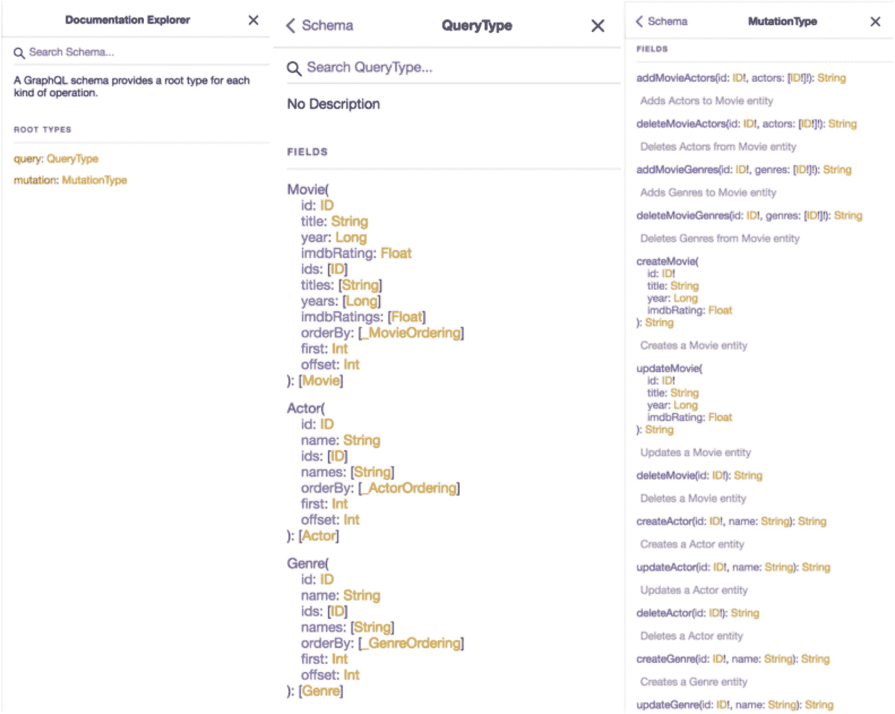
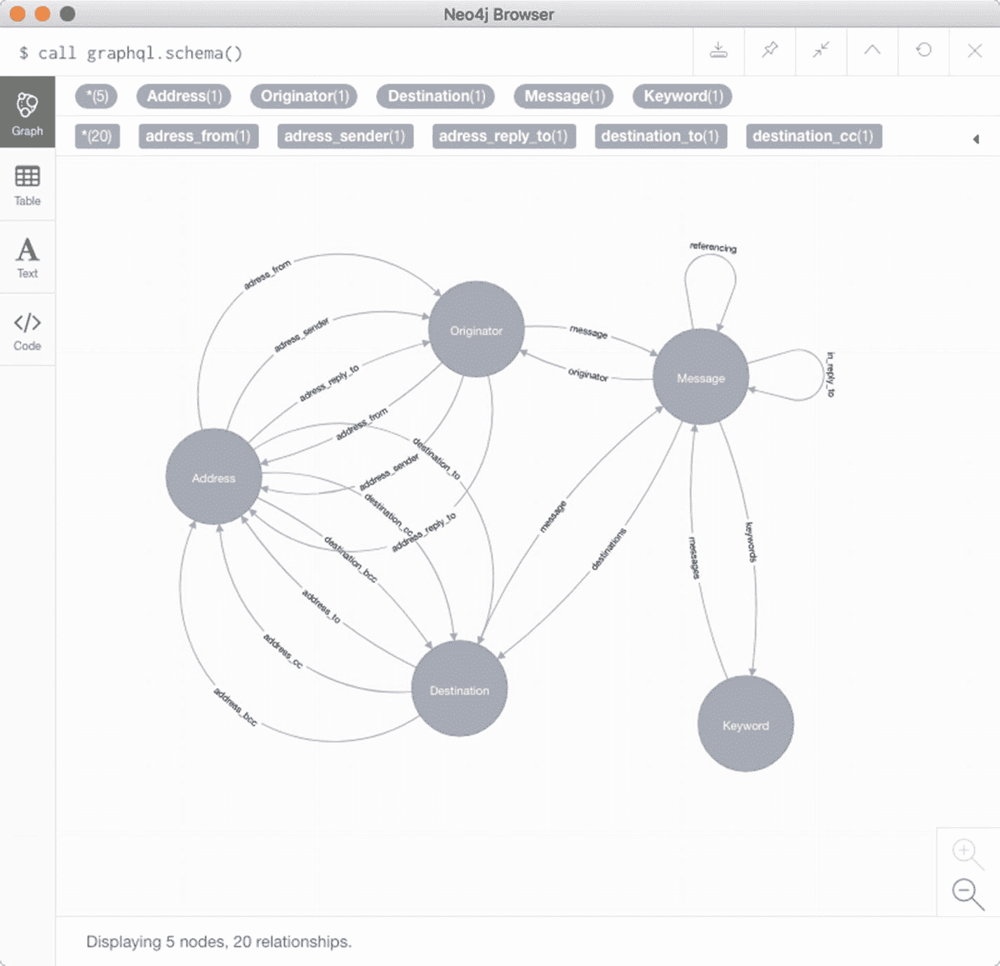
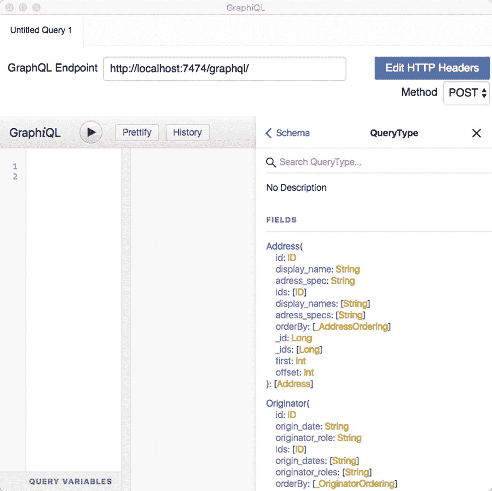

# 12. 将 `GraphQL` 与新的图数据库结合使用

## `Neo4j-GraphQL` 集成的设计目标

一个用于 `GraphQL` API 的图解决方案是什么样的？

我可以通过考察 `Neo4j-GraphQL` 插件来最好地回答这个问题。我没有重复 Will Lyon 在其视频中的内容，而是决定简要总结另一篇由 `Neo4j` 的 Will Lyon 于 2018 年 3 月撰写的最新博客文章。文章题为“五个常见的 `GraphQL` 问题以及 `Neo4j-GraphQL` 如何旨在解决它们”（参见 [`https://blog.grandstack.io/five-common-graphql-problems-and-how-neo4j-graphql-aims-to-solve-them-e9a8999c8d43`](https://blog.grandstack.io/five-common-graphql-problems-and-how-neo4j-graphql-aims-to-solve-them-e9a8999c8d43)）。

显然，使用图数据库作为 `GraphQL` API 的存储具有一些优势，你将会看到。在下文中，Will 解释了 `GraphQL` `Neo4j` 集成的愿景：

*   几周前，我读到了 Sacha Greif 在 freeCodeCamp 上的一篇文章，题为“`GraphQL` 应用中的五个常见问题（以及如何解决它们）”。我认为这是对开发者在采用 `GraphQL` 时遇到的一些问题的很好概述。

*   当我通读这个常见问题列表时，我意识到这些问题与我们在研究 `Neo4j-GraphQL` 集成应该是什么样子时用户抱怨的一些问题相同（参见 [`https://neo4j.com/developer/graphql/`](https://neo4j.com/developer/graphql/)）。最终，我们的集成设计旨在帮助开发者在构建由 `Neo4j` 支持的 `GraphQL` 服务时提高效率。

*   在这篇文章中，我想重新审视 Sacha 指出的每一个问题，并展示 `Neo4j-GraphQL` 如何解决每一个问题。

### 问题 1：模式重复

> *即，你需要一个数据库模式，还需要另一个用于你的 GraphQL 端点的模式。——Sacha Greif*

*   `GraphQL` 使用严格定义的 `schema`（模式），它定义了可用的类型和 API 的入口点。这个 `schema` 充当了 `GraphQL` API 的规范，并且通过自省功能支持强大的开发者工具，如查询补全、模拟和文档生成。然而，标准的 `GraphQL` 实现通常需要同时处理你的数据库的 `schema` 和你的 `GraphQL` API 的 `schema`。

*   为了简化构建由 `Neo4j` 支持的 `GraphQL` 应用程序的过程，`Neo4j-GraphQL` 集成使用 `GraphQL` `schema` 来推断 `Neo4j` 数据模型应该是什么样子。

*解决方案：使用 `GraphQL` 模式来驱动 `Neo4j` 数据库模型。*

### 问题 2：服务器/客户端数据不匹配

> *你的数据库和 GraphQL API 将会有不同的模式，这会导致不同的文档形状。——Sacha Greif*

*   如果你的 `GraphQL` 服务的后端不是图数据库，那么就必须进行某种映射和转换，以将数据从你在数据持久层建模的方式转换为 `GraphQL` 所需的图形状。通过使用图数据库作为我们 `GraphQL` 服务的数据层，我们预先避免了这个问题。

*   `Neo4j-GraphQL` 集成将任何任意的 `GraphQL` 请求转换为图查询语言 `Cypher`，并作为 `GraphQL` 解析器的一部分处理数据库调用。

*解决方案：将 `GraphQL` 转换为 `Cypher`。（注意：这是自动完成的。）*

### 问题 3：多余的数据库调用

> *想象一个帖子列表，每个帖子都关联一个用户。你现在想要显示 10 个这样的帖子，以及它们作者的名字。——Sacha Greif*

*   正如 Sacha 指出的，对于上面的例子，一个典型的 `GraphQL` 实现会为帖子列表进行一次数据库查询，然后为每个帖子再进行一次查询以获取用户信息。这导致了 11 次到数据库的往返请求！这就是所谓的 n+1 查询问题，常见的解决方案是使用像 `Dataloader` 这样的工具。

*   我们当然可以将 `Dataloader` 与 `Neo4j` 一起使用——它被设计为与数据层无关，但使用 `Neo4j-GraphQL` 的优势在于，它可以为任何任意的 `GraphQL` 请求生成*单个* `Cypher` 查询。这意味着对于任何 `GraphQL` 请求，我们只向数据库发出单个请求。

*解决方案：将 `GraphQL` 转换为单个 `Cypher` 查询。（注意：这是自动完成的。）*

### 问题 4：性能不佳

> *一方面你想充分利用 GraphQL 的图遍历特性（“显示评论作者的帖子的作者……”等等）。但另一方面，你不希望你的应用变得缓慢和无响应。——Sacha Greif*

*   虽然确实 `GraphQL` 支持表达像上面例子那样的图遍历，但负责解析数据的许多数据库系统并未针对这些工作负载进行优化。像 `Neo4j` 这样的图数据库则针对此类图遍历查询进行了优化。通过将 `GraphQL` 转换为 `Cypher`，我们可以利用像 `Neo4j` 这样的图数据库执行引擎的强大性能优势。此外，`GraphQL` 缺乏像 `Cypher` 这样的数据库查询语言的语义，无法表达诸如过滤、投影或聚合之类的事情。通过使用 `GraphQL` `schema` 指令，我们可以结合 `Cypher` 的强大功能与 `GraphQL`，将 `GraphQL` 字段映射到任意 `Cypher` 查询的结果。

*解决方案：在 `GraphQL` 中展现 `Cypher` 的威力。*


### 问题 5：样板代码泛滥

> *这绝非 GraphQL 应用独有问题，但它们确实通常要求你编写大量相似的样板代码。——Sacha Greif*

*   实现一个典型的 GraphQL 服务涉及为 GraphQL 服务编写一个 schema，为数据库编写一个 schema，编写解析器函数来获取数据，以及为创建和更新数据编写变更（mutations）。其中大部分是样板代码，可以通过检查 GraphQL schema 来生成。

*解决方案：从 GraphQL schema 自动生成查询（Query）和变更（Mutation）类型。参见图* *12-1* *。*



图 12-1

使用 Neo4j-GraphQL 时，查询和变更类型是自动生成的

*   我们之前提到过，解析器是通过从 GraphQL 模式推断数据库模式、将 GraphQL 转换为 Cypher 以及处理数据库调用来自动实现的。此外，GraphQL 服务的入口点（查询和变更类型）也是自动生成的，从而减少了实现基于 Neo4j 的 GraphQL 服务所需的样板代码。此外，还会为顶级查询和指向其他实体的字段生成 first、offset、filter-fields、ordering 等参数。

以上就是 Will Lyon 关于 Neo4j-GraphQL 设计目标的文章的结尾部分。

让我们看看实际效果吧！

## 从 GraphQL 模式生成你的 Neo4j 数据库

让我们在 Neo4j 中使用我在本书前面章节介绍过的电子邮件示例。

要从 GraphQL 模式生成 Neo4j 这一侧，你只需将模式中的类型定义传递给接口，方法是在 Neo4j 桌面版中执行类似这样的命令：

```
CALL graphql.idl(
'type Address {
  id: ID!
  display_name: String
  address_spec: String!
  address_from: Originator! @relation(name: "From")
  address_sender: Originator @relation(name: "Sender")
  address_reply_to: Originator @relation(name: "ReplyTo")
  destination_to: [Destination] @relation(name: "To")
  destination_cc: [Destination] @relation(name: "Cc")
  destination_bcc: [Destination] @relation(name: "Bcc")
}

type Originator {
  id: ID!
  origin_date: String!
  originator_role: String!
  message: [Message!] @relation(name: "Originator")
  address_from: Address! @relation(name: "From", direction:"IN")
  address_sender: Address @relation(name: "Sender", direction:"IN")
  address_reply_to: Address @relation(name: "ReplyTo", direction:"IN")
}

type Destination {
  id: ID!
  destination_role: String!
  received_date: String!
  message: Message! @relation(name: "Destination", direction:"IN")
  address_to: [Address]! @relation(name: "To", direction:"IN")
  address_cc: [Address] @relation(name: "Cc", direction:"IN")
  address_bcc: [Address] @relation(name: "Bcc", direction:"IN")
}

type Message {
  id: ID!
  subject: String
  comments: String
  originator: Originator! @relation(name: "Originator", direction:"IN")
   destinations: [Destination]! @relation(name: "HasDestination")
   referencing: [Message] @relation(name: "Referencing")
   in_reply_to: [Message] @relation(name: "InReplyTo")
   keywords: [Keyword] @relation(name: "Tags")
}

type Keyword {
  id: ID!
  keyword: String!
  messages: [Message] @relation(name: "Tags", direction:"IN")
}
');
```

请注意，我为 `@relation` 添加了方向，因为 Neo4j 需要知道其语义。

在 Neo4j 桌面版工作台中，结果显示为一个仅供内部使用的元数据文档，它描述了 GraphQL 模式。

Neo4j-GraphQL 插件包含一些用于在 Neo4j 中处理 GraphQL 的有用过程。其中一个重要的过程是将 GraphQL 模式可视化为图数据模型，如图 12-2 所示。



图 12-2

将 GraphQL 模式可视化为图数据模型

这让你可以检查物理图模型的结构。可以在 GraphQL 层面进行更正，然后重新处理模式。

最后，通过打开 GraphiQL GraphQL 浏览器，我们可以看到 GraphQL 模式文档。所以，到目前为止，我们已经准备好通过 GraphQL API 来查询和变更 Neo4j 图数据库中的数据了，如图 12-3 所示。



图 12-3

使用 GraphiQL 查询和操作 Neo4j 中的图数据

使用 Neo4j 图数据库作为底层数据存储，可以让你的 GraphQL 项目获得一个良好的开端。编写你的模式，告诉 Neo4j，你就可以开始通过 GraphQL 输入数据并进行查询了。

## Neo4j-GraphQL 资源

开始接触 GraphQL 和 Neo4j 的一个好地方是前面引用过的文章（作者 Will Lyon），题为“在 Neo4j Desktop 中使用 Neo4j-GraphQL 插件”。^(⁵¹) 它会指导你完成所有必要的步骤。

有一个 Neo4j-GraphQL 集成的 JavaScript 版本。[neo4j-graphql-js](https://www.npmjs.com/package/neo4j-graphql-js) NPM 包^(⁵²) 可在 [`https://www.npmjs.com/package/neo4j-graphql-js`](https://www.npmjs.com/package/neo4j-graphql-js) 获取。Neo4j-GraphQL 集成的 JavaScript 版本设计用于与所有 JavaScript GraphQL 服务器实现配合工作。

你可以在这里了解更多关于 neo4j-graphql 和 GRANDstack 项目的信息：

*   *GRANDstack.io*：^(⁵³) 与使用 GRANDstack（GraphQL、React、Apollo 和 Neo4j 数据库）构建应用程序相关的所有内容。参见 [`http://grandstack.io`](http://grandstack.io) `/`。

*   *Neo4j 和 GraphQL 开发者页面*：^(⁵⁴) 在 Neo4j 中使用 GraphQL 的方法概述。参见 [`https://neo4j.com/developer/graphql/`](https://neo4j.com/developer/graphql) 。

*   *使用 Neo4j-GraphQL 过程*：^(⁵⁵) 与 Neo4j-GraphQL 插件交互。参见 [`https://github.com/neo4j-graphql/neo4j-graphql#procedures`](https://github.com/neo4j-graphql/neo4j-graphql#procedures) 。

*   *Neo4j-GraphQL GitHub 组织*：^(⁵⁶) 在此找到 Neo4j-GraphQL 集成的代码和文档。参见 [`https://github.com/neo4j-graphql`](https://github.com/neo4j-graphql) 。

*   *neo4j-graphql-cli*：^(⁵⁷) 一个命令行工具，用于在 Neo4j Sandbox 上使用 Neo4j-GraphQL 快速启动一个 GraphQL API。参见 [`https://www.npmjs.com/package/neo4j-graphql-cli`](https://www.npmjs.com/package/neo4j-graphql-cli) 。

*   *Neo4j Slack 频道*：^(⁵⁸) 一个命令行工具，用于在 Neo4j Sandbox 上使用 Neo4j-GraphQL 快速启动一个 GraphQL API。参见 [`https://www.neo4j.com/slack`](https://www.neo4j.com/slack) 。

脚注 1   2   3   4   5   6   7   8   9   10   11   12   13   14

### 索引


#### A, B

业务流 API 设计器 业务层级密钥 数据库设计 关键字段 对象与事件网络 状态变化 版本 业务含义 API 要事 应用程序/微服务 数据名称 建立身份与唯一性 查找 标准数据结构

#### C

公司位置属性 内容要事 自定义架构指令 日期与时间 设计 维护 标量数据类型 Cypher

#### D

数据模型结构 客户-下单-订单 泛化 *对比* 特化 对象间关系 链接词 多对多关系 对象/事件 一对一关系 创始者 拼凑 属性 属性图 关系属性 自引用 供应商部件 三元关系 工具 关系类型 属性的使用

#### E, F

电子邮件数据图 Graphcool 互联网标准 节点 概述 属性图 关系

#### G, H, I, J, K, L, M

GitHub 图 GraphQL 列修饰符 内联片段 关键词 联系人列表 Graphcool 图数据库 样板代码 过载 @cypher 语句 数据名称 日期与时间 身份、唯一性与密钥 缺失信息 关系命名 Neo4j 数据库 Neo4j 桌面版 Neo4j-GraphQL 集成 Neo4j GraphQL 插件 Neo4j-GraphQL 资源 性能低下 关系上的属性 关系类型 标量数据类型 架构重复 服务器/客户端数据不匹配 状态、版本与维护 多余的数据库调用 转换 GraphQL 数据 业务流程 汽车经销概念 概念 数据内容 数据建模 数据结构 设计 图表风格 逻辑与物理模型 内容含义 单行解释 一步法 语法元素 用户自定义扩展 多样化目的 GraphQL Voyager

#### N

北欧国家

#### O

对象关系映射器

#### P, Q, R

属性图

#### S

架构定义语言 SQL 数据问题 数据名称 数据仓库社区 日期与时间 功能层 身份、唯一性与密钥 Kimball 集团 关系命名 关系上的属性 关系类型 多对多关系 一对一关系 一/零 对 零/多关系 自引用 标量数据类型 状态、版本与维护 工具

#### T, U, V, W, X, Y, Z

树 地址级/关键词级属性 电子邮件数据模型 创始者 属性图 根 基于树的非规范化 脚注 1
