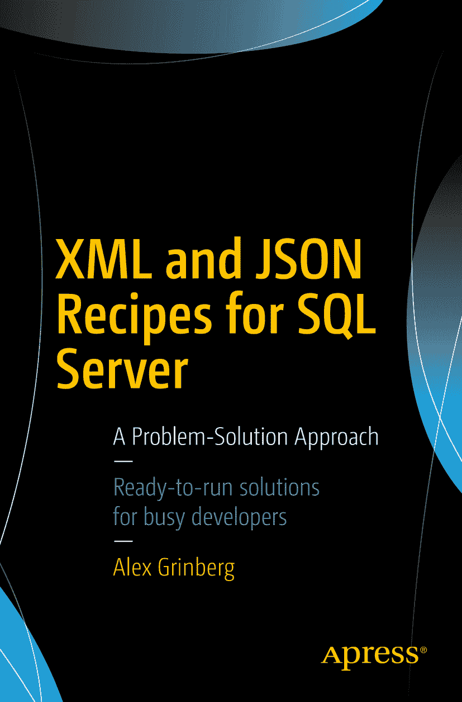

Alex Grinberg SQL Server 的 XML 与 JSON 配方：一种问题-解决方案方法

本书作者引用的任何源代码或其他补充材料，读者均可通过本书产品页面在 GitHub 上获取，地址为 [`www.apress.com/9781484231166`](http://www.apress.com/9781484231166)。如需更详细信息，请访问 [`http://www.apress.com/source-code`](http://www.apress.com/source-code)。

ISBN `978-1-4842-3116-6`

e-ISBN `978-1-4842-3117-3`

[`doi.org/10.1007/978-1-4842-3117-3`](https://doi.org/10.1007/978-1-4842-3117-3)

美国国会图书馆控制号：`2017962636`

© Alex Grinberg 2018

本作品受版权保护。无论涉及材料的整体还是部分，出版商保留所有商业权利，特别是翻译权、转载权、图表重用权、朗诵权、广播权、缩微胶片或其他物理方式的复制权，以及信息存储与检索、电子改编、计算机软件方面的传播权，或目前已知或今后开发的任何类似或相异方法。书中可能出现商标名称、标识和图像。我们并非在每次出现商标名称、标识和图像时都使用商标符号，而是仅以编辑方式并为商标所有者利益使用这些名称、标识和图像，无侵犯商标之意。本出版物中对商品名称、商标、服务标志及类似术语的使用，即使未特别标识，也不应被视为表达了这些术语是否受专有权约束的意见。

尽管本书中的建议和信息在出版时被认为是真实和准确的，但作者、编辑或出版商对可能存在的任何错误或遗漏不承担任何法律责任。出版商对本出版物包含的材料不作任何明示或暗示的保证。使用无酸纸印刷。

由 Springer Science+Business Media New York（地址：纽约州纽约市斯普林街 233 号 6 楼，邮编 10013）向全球图书贸易发行。电话 1-800-SPRINGER，传真 (201) 348-4505，电子邮件 `orders-ny@springer-sbm.com`，或访问 www.springeronline.com。

Apress Media, LLC 是一家加利福尼亚州有限责任公司，其唯一成员（所有者）是 Springer Science + Business Media Finance Inc (SSBM Finance Inc)。SSBM Finance Inc 是一家特拉华州公司。

本书献给我的父母和 Chante Silva。你们在我们心中留下了一盏永不熄灭的明灯，我们永远不会忘记。

## 致谢

多年来，我一直梦想着写一本书来分享我的知识。最终，这个梦想成真了。然而，写书并非一人之功。有许多人帮助我将本书呈现给读者。我要感谢 Apress 团队——Jonathan Gennick、Jill Balzano 和 Laura Berendson，他们激励我前进，并为本书的推进提供了宝贵建议。

我非常感激并敬重技术审阅者 Michael Coles，他为我提供了大量建议，使本书更完善、更全面地涵盖了各种配方，尤其是 `XML` 部分。同时，我要感谢 Alessandro Alpi，他在 `JSON` 部分为我提供了咨询。

我从 Cox Automotive 的同事那里获得了巨大的帮助，特别是 Cary Dickerson，他为我提供了强大的服务器来测试配方，使我能够演示和比较配方在生产环境中的运行性能。感谢 Michael Neuburger 和 Mathew Silva 在书籍撰写期间的支持。如果我遗漏了任何人，我深表歉意，但帮助过我的人太多了！

我还要感谢我的朋友 Said Salomon 和 Vince Napoli 对我的鼓励和支持。

当然，我最深切的特别感谢献给我的家人——妻子 Ludmila 和女儿们 Anna 与 Katherine，在本书撰写过程中，我给予她们的关注极少，但她们始终支持着我，并耐心等待本书的完成。

非常感谢大家！与你们共事是我的荣幸！

Alex Grinberg

## 目录

## 第一部分：SQL Server 中的 XML

### 第 1 章：XML 简介 3

#### 步入 XML 3

#### 示例数据库 4

#### 理解 XML 4

#### XML 字符实体化 6

#### 探索 XML 数据类型 7

#### 1-1. 创建未类型化的 XML 列 8

##### 问题 8

##### 解决方案 8

##### 工作原理 10

#### 1-2. 在 Visual Studio 中创建 XML 架构 11

##### 问题 11

##### 解决方案 11

##### 工作原理 13

#### 1-3. 从 SSMS 创建 XML 架构 14

##### 问题 14

##### 解决方案 15

##### 工作原理 16

#### 1-4. 将 XML 绑定到架构集合 18

##### 问题 18

##### 解决方案 18

##### 工作原理 19

#### 1-5. 创建类型化的 XML 列 20

##### 问题 20

##### 解决方案 21

##### 工作原理 21

#### 总结 22

### 第 2 章：构建 XML 23

#### 修复“无法显示 XML”错误 24

#### 2-1. 将关系数据转换为简单的 XML 格式 26

##### 问题 26

##### 解决方案 26

##### 工作原理 26

#### 2-2. 生成以表名为元素名的 XML 数据 28

##### 问题 28

##### 解决方案 28

##### 工作原理 30

#### 2-3. 生成以元素为中心的 XML 30

##### 问题 30

##### 解决方案 31

##### 工作原理 31

#### 2-4. 添加根元素 32

##### 问题 32

##### 解决方案 32

##### 工作原理 33

#### 2-5. 在 XML 数据中包含具有 NULL 值的元素 33

##### 问题 33

##### 解决方案 33

##### 工作原理 34

#### 2-6. 在 XML 中包含二进制数据 34

##### 问题 34

##### 解决方案 34

##### 工作原理 35

#### 2-7. 生成嵌套的层次结构 XML 数据 36

##### 问题 36

##### 解决方案 36

##### 工作原理 38

#### 2-8. 构建自定义 XML 38

##### 问题 38

##### 解决方案 38

##### 工作原理 40

#### 2-9. 简化自定义 XML 生成 45

##### 问题 45

##### 解决方案 45

##### 工作原理 46

#### 2-10. 向 XML 添加特殊节点 48

##### 问题 48

##### 解决方案 48

##### 工作原理 49

#### 总结 51

### 第 3 章：操作 XML 文件 53

#### 3-1. 从 SQL 将 XML 结果存储到文件 53

##### 问题 53

##### 解决方案 53

##### 工作原理 55

#### 3-2. 从 SSIS 包创建 XML 59

##### 问题 59

##### 解决方案 59

##### 工作原理 72

#### 3-3. 从存储过程加载 XML 72

##### 问题 72

##### 解决方案 72

##### 工作原理 75

#### 3-4. 从 SSIS 包加载 XML 78

##### 问题 78

##### 解决方案 78

##### 工作原理 90

#### 3-5. 实现 CLR 解决方案 92

##### 问题 92

##### 解决方案 92

##### 工作原理 96

#### 总结 99

### 第 4 章：分解 XML 101

#### 4-1. 使用内部 ENTITY 声明分解 XML 101

##### 问题 101

##### 解决方案 101

##### 工作原理 102

#### 4-2. 将 OPENXML 迁移到 XQuery 108

##### 问题 108

##### 解决方案 108

##### 工作原理 109

#### 4-3. 分解列中的 XML 113

##### 问题 113

##### 解决方案 113

##### 工作原理 114

#### 4-4. 处理遗留的 XML 存储 116

### 第 4 章：查询 XML

#### 4-5. 导航类型化的 XML 列

##### 问题

##### 解决方案

##### 工作原理

#### 4-6. 检索 XML 数据的子集

##### 问题

##### 解决方案

##### 工作原理

#### 4-7. 查找表中的所有 XML 列

##### 问题

##### 解决方案

##### 工作原理

#### 4-8. 使用多个 `CROSS APPLY` 运算符

##### 问题

##### 解决方案

##### 工作原理

#### 总结

### 第 5 章：修改 XML

#### 5-1. 向 XML 插入子元素

##### 问题

##### 解决方案

##### 工作原理

#### 5-2. 向具有命名空间的现有 XML 实例插入子元素

##### 问题

##### 解决方案

##### 工作原理

#### 5-3. 插入 XML 属性

##### 问题

##### 解决方案

##### 工作原理

#### 5-4. 有条件地插入 XML 属性

##### 问题

##### 解决方案

##### 工作原理

#### 5-5. 插入指定了位置的子元素

##### 问题

##### 解决方案

##### 工作原理

#### 5-6. 插入多个元素

##### 问题

##### 解决方案

##### 工作原理

#### 5-7. 更新 XML 元素值

##### 问题

##### 解决方案

##### 工作原理

#### 5-8. 更新 XML 属性值

##### 问题

##### 解决方案

##### 工作原理

#### 5-9. 删除 XML 属性

##### 问题

##### 解决方案

##### 工作原理

#### 5-10. 删除 XML 元素

##### 问题

##### 解决方案

##### 工作原理

#### 总结

### 第 6 章：过滤 XML

#### 6-1. 实现 `exist()` 方法

##### 问题

##### 解决方案

##### 工作原理

#### 6-2. 使用 `exist()` 方法过滤 XML 值

##### 问题

##### 解决方案

##### 工作原理

#### 6-3. 查找 XML 实例中任意位置的所有 XML 元素

##### 问题

##### 解决方案

##### 工作原理

#### 6-4. 按单个值过滤

##### 问题

##### 解决方案

##### 工作原理

#### 6-5. 通过 T-SQL 变量过滤 XML

##### 问题

##### 解决方案

##### 工作原理

#### 6-6. 与值序列进行比较

##### 问题

##### 解决方案

##### 工作原理

#### 6-7. 匹配指定的字符串模式

##### 问题

##### 解决方案

##### 工作原理

#### 6-8. 过滤值的范围

##### 问题

##### 解决方案

##### 工作原理

#### 6-9. 按多个条件过滤

##### 问题

##### 解决方案

##### 工作原理

#### 6-10. 设置否定谓词

##### 问题

##### 解决方案

##### 工作原理

#### 6-11. 过滤空值

##### 问题

##### 解决方案

##### 工作原理

#### 总结

### 第 7 章：提高 XML 性能

#### 7-1. 创建主 XML 索引

##### 问题

##### 解决方案

##### 工作原理

#### 7-2. 创建辅助 `PATH` 类型索引

##### 问题

##### 解决方案

##### 工作原理

#### 7-3. 创建辅助 `VALUE` 类型索引

##### 问题

##### 解决方案

##### 工作原理

#### 7-4. 创建辅助 `PROPERTY` 类型索引

##### 问题

##### 解决方案

##### 工作原理

#### 7-5. 创建选择性 XML 索引

##### 问题

##### 解决方案

##### 工作原理

#### 7-6. 优化选择性 XML 索引

##### 问题

##### 解决方案

##### 工作原理

#### 7-7. 创建辅助选择性 XML 索引

##### 问题

##### 解决方案

##### 工作原理

#### 7-8. 修改选择性 XML 索引

##### 问题

##### 解决方案

##### 工作原理

#### 总结

## 第二部分：SQL Server 中的 JSON

### 第 8 章：构造 JSON

#### JSON 简介

#### 8-1. 使用 `AUTO` 模式构建 JSON

##### 问题

##### 解决方案

##### 工作原理

#### 8-2. 在构建 JSON 时处理 `NULL`

##### 问题

##### 解决方案

##### 工作原理

#### 8-3. 转义 JSON 输出的括号

##### 问题

##### 解决方案

##### 工作原理

#### 8-4. 向 JSON 添加 `ROOT` 键元素

##### 问题

##### 解决方案

##### 工作原理

#### 8-5. 获得对 JSON 输出的控制权

##### 问题

##### 解决方案

##### 工作原理

#### 8-6. 处理转义字符

##### 问题

##### 解决方案

##### 工作原理

#### 8-7. 处理 CLR 数据类型

##### 问题

##### 解决方案

##### 工作原理

#### 总结

### 第 9 章：将 JSON 转换为行集

#### 9-1. 使用 JSON 检测列

##### 问题

##### 解决方案

##### 工作原理

#### 9-2. 返回 JSON 文档的子集

##### 问题

##### 解决方案

##### 工作原理

#### 9-3. 从 JSON 返回标量值

##### 问题

##### 解决方案

##### 工作原理

#### 9-4. 对返回的 `NULL` 进行故障排除

##### 问题

##### 解决方案

##### 工作原理

#### 9-5. 将 JSON 转换为表

##### 问题

##### 解决方案

##### 工作原理

#### 9-6. 处理 JSON 嵌套子对象

##### 问题

##### 解决方案

##### 工作原理

#### 9-7. 索引 JSON

##### 问题

##### 解决方案

##### 工作原理

#### 总结

### 第 10 章：修改 JSON

#### 10-1. 向 JSON 添加新的键值对

##### 问题

##### 解决方案

##### 工作原理

#### 10-2. 更新现有 JSON

##### 问题

##### 解决方案

##### 工作原理

#### 10-3. 从 JSON 中删除

##### 问题

##### 解决方案 271

##### 工作原理 271

#### 10-4. 追加 JSON 属性 273

##### 问题 273

##### 解决方案 273

##### 工作原理 274

#### 10-5. 使用多个操作进行修改 274

##### 问题 274

##### 解决方案 274

##### 工作原理 275

#### 10-6. 重命名 JSON 键 275

##### 问题 275

##### 解决方案 275

##### 工作原理 276

#### 10-7. 修改 JSON 对象 277

##### 问题 277

##### 解决方案 277

##### 工作原理 277

#### 10-8. 比较 XML 与 JSON 279

##### 问题 279

##### 解决方案 279

##### 工作原理 283

#### 总结 285

## 索引 287

## 关于作者和关于技术审校者

### 关于作者

### 关于技术审校者