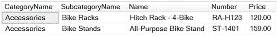
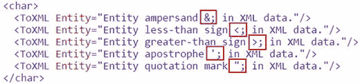

# 第一部分
SQL Server 中的 XML

## 1. XML 简介

欢迎并感谢您阅读 *SQL Server 的 XML 和 JSON 配方*。在信息技术的现代世界中，可靠且高效地存储和操作数据是首要任务之一。在过去十年中，SQL Server 已发展成为一个复杂的企业关系数据库管理系统工具，并且通过提供更多功能来可靠地存储和操作数据，它仍在不断发展。可扩展标记语言（XML）是 SQL Server 实现的技术之一，不仅用于数据操作，还用于许多内部用途，例如执行计划、扩展事件、DDL 触发器 `EventData()` 函数，以及 SQL Server 商业智能工具（`SSIS`、`SSRS`、`SSAS`）背后的构建基础。在本书的第一部分中，我将介绍并提供关于如何使用 SQL Server `XML` 数据类型的配方；讨论并演示加载、构建和分解 XML 的真实场景；并展示如何通过应用 XML 技术简化日常任务。在本书中，我将主要关注技术而非理论。

### 踏入 XML 之门

要使用 XML，我们需要理解这项技术，尤其是对于 SQL Server 而言。XML 类似于 HTML（超文本标记语言）。XML 和 HTML 都包含标记元素来描述文件或页面（对于 HTML）的内容。它们之间最大的区别在于，HTML 包含预定义的元素（标签），而 XML 的元素和属性不是预定义的，而是基于文件内描述的数据。

HTML 和 XML 之间还有几个更重要的区别：

*   XML 区分大小写，而 HTML 不区分。
*   XML 的打开元素必须关闭。HTML 可以有打开的元素而没有关闭元素。例如，`<DATA>Display Text` 在 HTML 中可以编译，但在 XML 中会返回错误。

**注意**

默认情况下，SQL Server 不区分大小写。但是，XML 区分大小写，所有 XQuery 路径语言（XPath）函数和节点测试都区分大小写（全部小写）。如果输入时使用了小写以外的任何大小写形式，它们将返回错误。

### 示例数据库

除非另有说明或在文中单独引用，本书第一部分的所有代码示例均使用 SQL Server AdventureWorks 示例数据库。AdventureWorks 数据库的 URL 是 [`https://github.com/Microsoft/sql-server-samples/releases/tag/adventureworks2014`](https://github.com/Microsoft/sql-server-samples/releases/tag/adventureworks2014)。我强烈建议您下载并安装 AdventureWorks 示例数据库来运行提供的示例。

### 理解 XML

在使用 XML 之前，我们需要解释 SQL Server 支持的两种以节点为中心的 XML 格式之间的区别：

1.  以元素为中心
2.  以属性为中心

元素和属性都可以包含数据。然而，SQL Server 针对每种格式的生成或分解（分解是将 XML 转换为行-列格式的过程）提供了专门的功能和特性。在以元素为中心的格式中，值包含在元素的开始和结束标签内，例如 `<元素名>`。以属性为中心的格式依赖于元素开始标签中元素的属性。它们通过等号分配值，并用双引号将值括起来，例如 `<元素名 属性=“值”>`。例如，清单 1 中的示例 SQL 查询返回两行，结果如图 1 所示。


图 1-1. 来自示例 SQL 查询的结果数据集

```sql
SELECT TOP (2) Category.Name AS CategoryName,
Subcategory.Name AS SubcategoryName,
Product.Name,
Product.ProductNumber AS Number,
Product.ListPrice AS Price
FROM  Production.Product Product
INNER JOIN Production.ProductSubcategory Subcategory
ON Product.ProductSubcategoryID = Subcategory.ProductSubcategoryID
LEFT JOIN Production.ProductCategory Category
ON Subcategory.ProductCategoryID = Category.ProductCategoryID
WHERE Product.ListPrice > 0
AND Product.SellEndDate IS NULL
ORDER BY CategoryName, SubcategoryName;
```
清单 1-1. 简单的 SQL 查询

这是一个示例，展示了图 1 中的关系数据在以元素为中心的 XML 格式中可能的样子。请注意，在此格式中，所有值都表示为 XML 元素，如清单 2 所示。

```xml
<ProductCategory>
  <Name>Accessories</Name>
  <ProductSubcategory>
    <Name>Bike Racks</Name>
    <Product>
      <Name>Hitch Rack - 4-Bike</Name>
      <ProductNumber>RA-H123</ProductNumber>
      <ListPrice>120.0000</ListPrice>
    </Product>
    <Product>
      <Name>Bike Stands</Name>
      <ProductNumber>ST-1401</ProductNumber>
      <ListPrice>159.0000</ListPrice>
    </Product>
  </ProductSubcategory>
</ProductCategory>
```
清单 1-2. 显示以元素为中心的 XML

从图 1 转换的关系数据可能看起来像清单 3 中所示的以属性为中心的 XML 格式。

```xml
<ProductCategory Name="Accessories">
  <ProductSubcategory Name="Bike Racks">
    <Product Name="Hitch Rack - 4-Bike" ProductNumber="RA-H123" ListPrice="120.0000"/>
    <Product Name="Bike Stands" ProductNumber="ST-1401" ListPrice="159.0000"/>
  </ProductSubcategory>
</ProductCategory>
```
清单 1-3. 显示以属性为中心的 XML

比较清单 2 中的以元素为中心的 XML 数据与清单 3 中的以属性为中心的 XML 数据，可以明确界定几个区别：

*   `以元素为中心的 XML` 比 `以属性为中心的 XML` 更大（以字符数计）。
*   `以元素为中心的 XML` 支持元素层次结构。
*   `以元素为中心的 XML` 可以使用 `xsi:nil` 属性表示 `SQL NULL`（`xsi:nil` 将在第 2 章的配方 2-5“处理具有 NULL 值的元素”中介绍）。

我们将在第 2 章“构建 XML”中提供更深入的分析，并展示更多的区别、用例和演示。

### XML 字符实体化

XML 元素由左右尖括号（小于号和大于号，“<”和“>”）定义。XML 属性值用双引号括起来。包含这些特殊字符（它们不是 XML 标记的一部分）的数据可能会在 XML 解析期间导致问题。为了解决这些潜在的冲突，XML 定义了一组特殊的字符序列，称为预定义实体，所有 XML 解析器都必须遵守。这些字符序列，包括双引号、和号、撇号、小于号和大于号，以及它们关联的 XML 实体，列在表 1 中。

表 1-1. 列出 XML 中的预定义实体

| 字符 | 实体引用 | 描述 |
| --- | --- | --- |
| `"` | `&quot;` | 双引号 |
| `&` | `&amp;` | 和号 |
| `'` | `&apos;` | 撇号（单引号） |
| `<` | `&lt;` | 小于号 |
| `>` | `&gt;` | 大于号 |

当预定义实体被实体引用替换的过程称为实体化。为了演示实体化，我获取了清单 4 中的 XML，然后键入（复制/粘贴）到记事本中。

```xml
<Catalog>
  <Product id="1" name="Product 1 &quot;Super&quot;">
    <Price>12.99</Price>
    <Description>An item with "quotes" and an & ampersand.</Description>
  </Product>
</Catalog>
```
清单 1-4. 包含预定义实体的示例 XML

然后，我将文件保存为 .xml 扩展名。例如，我将文件命名为 `XML_Entity.xml`。创建文件后，我只需双击该文件或在 Internet Explorer 中打开它。结果，实体引用将显示为正常字符，如图 2 所示。


图 1-2. 展开 XML 实体后的示例


