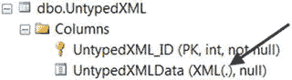

# 探索 XML 数据类型

Microsoft SQL Server 数据库中的 XML 支持首次引入于 SQL Server 2000。XML 可能包含非常长的数据字符串；因此，很少会遇到无法放入 `VARCHAR(8000)` 或 `NVARCHAR(4000)` Unicode 列的 XML 数据。由于许多 XML 数据无法放入这些数据类型，SQL Server 2000 建议 DBA 和开发人员使用 `TEXT`，在某些情况下使用 `IMAGE` 数据类型。许多人发现处理这些数据类型是一场噩梦，因为它们难以使用。此外，在 2000 版处理 XML 时，你必须使用基于 COM 的存储过程。

随着 SQL Server 2005 的发布，提供了 `XML` 数据类型，这使得处理 XML 数据变得显著更容易，并且 XML 数据可以以其原生格式存储。当在 SSMS 中将输出设置为“结果到网格”时，`XML` 数据类型的输出会返回可点击的超链接格式。要查看 XML 内容，只需点击超链接，SSMS 就会在单独的 XML 文档选项卡中显示 XML 结果。XML 文档选项卡不允许你连接到 SQL Server 实例或执行任何 SQL 语句。

`XML` 数据类型是一种便捷且设计良好的数据类型，允许你以 XML 格式存储数据和文档。在某些情况下，可以使用其他大型 SQL Server 数据类型来存储 XML 数据，例如 `NVARCHAR(MAX)`、`VARCHAR(MAX)` 或 `VARBINARY(MAX)`。旧的数据类型 `IMAGE`、`NTEXT` 和 `TEXT` 也能完成这项工作，但使用起来不那么用户友好。

例如，当 XML 数据作为文档存储，并且你不需要整体查询这些数据时，你可以使用 `NVARCHAR(MAX)`、`VARCHAR(MAX)`、`VARBINARY(MAX)`。使用 LOB 数据类型存储 XML 的最佳理由是当你需要存储 XML 的精确表示时，因为 `XML` 数据类型会存储你提供的内容，但它可能会更改不重要的空白，并且不能保证属性的顺序。看看 `msdb.dbo.sysssispackages` 表，其中的 `packagedata` 列存储了服务器端的 SSIS 包。SQL Server 使用 `IMAGE` 数据类型（在此情况下我不建议效仿 Microsoft）来存储 SSIS 包代码。对于那些从未看过 SSIS 代码的人来说，它是 XML 数据。因此，当我需要查询 SSIS 时（我有过几次这样的合理请求），我将 `packagedata` 列转换为 `VARBINARY(MAX)`，然后将其转换为 `XML` 数据类型实例，如代码清单 1-5 所示。

```sql
SELECT CAST(CAST(packagedata as VARBINARY(MAX)) AS XML) AS SSISPackage
FROM msdb.dbo.sysssispackages;
```
代码清单 1-5. 将 IMAGE 数据类型转换为 XML 数据类型

**注意**

不应考虑将旧式大型对象二进制数据类型 `IMAGE`、`NTEXT` 和 `TEXT` 用于任何列的实现。联机丛书中没有引用这些数据类型，因为它们已弃用。但是，一些系统表仍然包含它们；甚至 Microsoft 早在 2008 年就宣布 `IMAGE`、`NTEXT` 和 `TEXT` 数据类型将被弃用。

`XML` 数据类型具有以下限制：

*   存储限制为 2.1 GB。
*   不能用作表的主键。
*   不能通过 `ORDER BY` 子句进行排序。
*   不能在 `WHERE` 子句中进行比较。
*   不能用于 `GROUP BY` 子句。
*   除了 `ISNULL()`、`COALESCE()`、`DATALENGTH()`、`CAST()`、`TRY_CAST()`、`CONVERT()`、`CHOOSE()` 和 `IIF()` 函数外，不能作为任何标量内置函数的参数。
*   具有 `XML` 数据类型的列不能是链接服务器查询的一部分。
*   XML 列只能通过 XML 索引进行索引；对于聚集和非聚集表索引，XML 列可以通过 `INCLUDE` 子句包含。

XML 数据类型有两种形式：

*   非类型化 XML（默认），是未关联 XML 架构的 `XML` 数据类型实例。
*   类型化 XML 是绑定了 XML 架构的 `XML` 数据类型实例。

## 1-1. 创建非类型化 XML 列

### 问题

你想在表中定义一个非类型化 XML 列。

### 解决方案

在创建时将指定列定义为 `XML` 数据类型。代码清单 1-6 中的示例演示了如何创建一个简单的非类型化 XML 列的语法。

```sql
CREATE TABLE dbo.UntypedXML
(
    UntypedXML_ID INT IDENTITY(1, 1) NOT NULL PRIMARY KEY,
    UntypedXMLData XML
);
```
代码清单 1-6. 创建非类型化 XML 列的语法

代码清单 1-7 中的示例演示了如何向我们在代码清单 1-6 中创建的表插入新行。

```sql
INSERT INTO dbo.UntypedXML
(
    UntypedXMLData
)
SELECT N'
<ProductCategory>
    <ProductCategoryID>3</ProductCategoryID>
    <Name>Accessories</Name>
    <Products>
        <Product>
            <Name>Bike Racks</Name>
            <ProductID>100</ProductID>
            <ProductSubcategory>
                <Name>Hitch Rack - 4-Bike</Name>
                <ProductNumber>RA-H123</ProductNumber>
                <ListPrice>120.0000</ListPrice>
            </ProductSubcategory>
        </Product>
        <Product>
            <Name>Bike Stands</Name>
            <ProductID>101</ProductID>
            <ProductSubcategory>
                <Name>All-Purpose Bike Stand</Name>
                <ProductNumber>ST-1401</ProductNumber>
                <ListPrice>159.0000</ListPrice>
            </ProductSubcategory>
        </Product>
    </Products>
</ProductCategory>';
```
代码清单 1-7. 插入包含 XML 数据的新行

代码清单 1-8 中的示例演示了如何声明一个 `XML` 数据类型变量，然后将其插入我们先前创建的表中。

```sql
DECLARE @xml XML = N'
<ProductCategory>
    <Name>Accessories</Name>
</ProductCategory>';
INSERT INTO dbo.UntypedXML
(
    UntypedXMLData
)
SELECT @xml;
```
代码清单 1-8. 通过 XML 变量插入新行

**注意** 当我们将变量声明为 `XML` 数据类型然后为其赋值 XML 时，SQL Server 会隐式地将字符数据转换为 `XML` 数据类型。这适用于 `VARCHAR`、`NVARCHAR` 和 `VARBINARY` 数据类型。

代码清单 1-9 中的示例演示了如何创建一个带有 `XML` 数据类型参数的存储过程，该过程在被调用时向表中插入数据。

```sql
CREATE PROCEDURE dbo.usp_Insert_UntypedXML
    @UntypedXML XML
AS
INSERT INTO dbo.UntypedXML
(
    UntypedXMLData
)
SELECT @UntypedXML;
GO
```
代码清单 1-9. 将 XML 数据插入表的存储过程

### 工作原理

当没有 XML 架构绑定到列、变量或存储过程参数时，所创建的对象是非类型化 XML。然而，非类型化 XML 实例仍然要求其包含的 XML 数据遵循 W3C 标准的 XML 格式。当列被创建为非类型化 XML 实例时，解析器将验证传入数据，以确保 XML 数据是“格式良好”的，或者是（没有根元素的）片段，但其他方面符合格式良好的规则。例如，所有打开的元素都被关闭，打开和关闭的元素彼此匹配，并且未发现无效字符。在以下情况下，非类型化 XML 对象非常有用：

*   没有适用于该数据的 XML 架构。
*   XML 文档和数据由不同的元素和属性组成，但仍需要存储在同一个启用 XML 的列中。代码清单 1-7 和 1-8 展示了这种情况。
*   应用程序验证然后发送格式良好的 XML 或 XML 片段到表中。

创建具有非类型化 XML 列的表后，你可以在“对象资源管理器”中展开该表，然后展开列。列列表会出现，显示 `XML` 数据类型，其括号内带有一个点，表明这是一个非类型化 XML 列，如图 1-3 所示。



图 1-3. 表设计器中的非类型化 XML 列

## 1-2. 在 Visual Studio 中创建 XML 架构

### 问题

你想获取或生成一个 XML 架构来约束类型化 `XML` 列中的数据。


