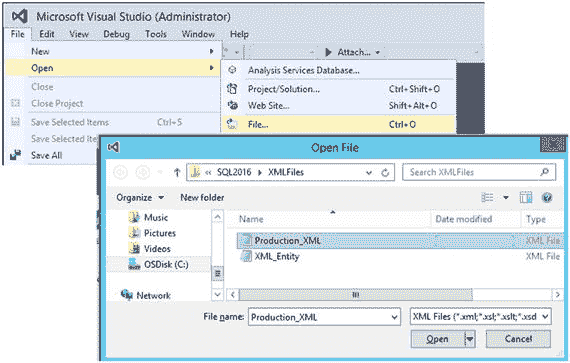
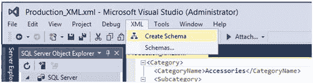
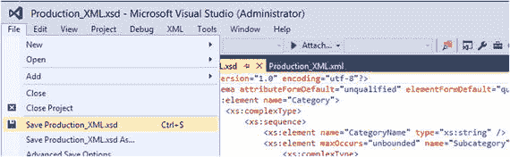
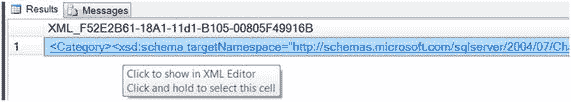
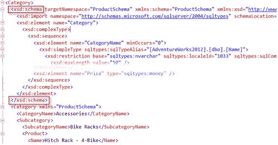
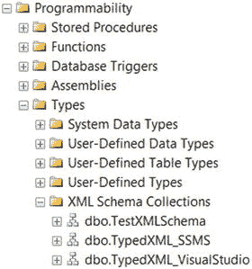

# 使用 Visual Studio 和 SSMS 生成 XML 架构

### 解决方案

要使用 Microsoft Visual Studio 生成 XML 架构，你需要使用 2008 或更新的版本。SQL Server Data Tools 也能完成此任务，因为它使用了 Microsoft Visual Studio Shell。此外，你还需要一个 XML 文件。如果你的 XML 数据是作为 `FOR XML` 子句的结果创建的（更多内容见第 2 章），请将 XML 数据保存为扩展名为 `.xml` 的文件。

要加载 XML 文件：

1.  启动 MS Visual Studio。
2.  转到文件菜单。
3.  选择“打开”选项。
4.  单击“文件”（快捷键 CTRL + O）。“打开文件”对话框将出现。
5.  导航到 XML 文件的存储位置。
6.  单击“打开”按钮，如图 1-4 所示。

    

    图 1-4. 在 Visual Studio 中打开 XML 文件

文件加载后，Visual Studio 会识别 XML 文件格式，并更改菜单选项以添加 XML 菜单选项。要生成 XML 架构，请完成以下步骤：

1.  选择 XML 菜单。
2.  单击“创建架构”选项，如图 1-5 所示。

    

    图 1-5. 创建 XML 架构

XML 架构将在一个单独的选项卡中创建。你可以复制 XML 架构内容，或保存 `.xsd` 文件（快捷键 CTRL + S）以备将来使用，如图 1-6 所示。



图 1-6. 将 XML 架构保存为 .xsd 文件

### 工作原理

在我看来，手动创建 XML 架构的时代已经结束。有很多方法可以自动生成 XML 架构。在这个教程中，我演示了两种自动创建 XML 架构的方法。这两种方法都基于 Microsoft 产品：

*   MS Visual Studio（2008 及以上版本）
*   MS SQL Server（2005 及以上版本）

为简单起见，我重用了清单 1-2 中的 XML 数据，如清单 1-10 所示。

```xml

Accessories

Bike Racks

Hitch Rack - 4-Bike
RA-H123
120.0000

Bike Stands

All-Purpose Bike Stand
ST-1401
159.0000

```
清单 1-10. 示例 XML

当你有一个 XML 文件并需要为其创建 XML 架构时，完成此任务最简单、最方便的方法是使用 Microsoft Visual Studio，如解决方案中所演示的那样。根据示例数据生成的 XML 架构如清单 1-11 所示。

```xml

```
清单 1-11. 由 Visual Studio 生成的 XML 架构

## 1-3. 从 SSMS 创建 XML 架构

### 问题

你想从 SQL Server Management Studio (SSMS) 内部生成一个 XML 架构。

### 解决方案

创建 XML 架构的另一种方法是使用 SQL Server 的 `FOR XML` 子句配合 `XMLSCHEMA` 指令。演示此选项的目的是展示一种利用 `FOR XML` 子句结果生成 XML 架构的替代方法。

要在 SQL Server 中生成内联 XSD (XML Schema Definition) 架构，你需要在查询中添加带有 `XMLSCHEMA` 关键字的 `FOR XML` 子句（`FOR XML` 子句将在第 2 章“构建 XML”中更详细地介绍）。可选地，可以在 XMLSCHEMA 关键字的括号内指定架构名称。例如，要将 ProductSchema 架构添加到你的 XSD 架构中，指定如下：`XMLSCHEMA(' [`http://schemas.microsoft.com/sqlserver/2004/07/Chapter01/ProductSchema`](http://schemas.microsoft.com/sqlserver/2004/07/Chapter01/ProductSchema) ')`，如清单 1-12 所示。

```sql
SELECT TOP (2) Category.Name AS CategoryName,
Subcategory.Name AS SubcategoryName,
Product.Name,
Product.ProductNumber AS Number,
Product.ListPrice AS Price
FROM  Production.Product Product
INNER JOIN Production.ProductSubcategory Subcategory
ON Product.ProductSubcategoryID = Subcategory.ProductSubcategoryID
LEFT JOIN Production.ProductCategory Category
ON Subcategory.ProductCategoryID = Category.ProductCategoryID
WHERE Product.ListPrice > 0
AND Product.SellEndDate IS NULL
ORDER BY CategoryName, SubcategoryName
FOR XML AUTO, ELEMENTS, XMLSCHEMA('http://schemas.microsoft.com/sqlserver/2004/07/Chapter01/ProductSchema'), ROOT('Category');
```
清单 1-12. 创建 XML 架构的查询

要提取 XSD 架构，你需要执行以下步骤：



图 1-7. 在 XML 编辑器中显示结果



图 1-8. 提取 XSD 架构部分

*   运行带有 `XMLSCHEMA` 关键字的 SQL 语句。
*   单击查询结果以在 XML 编辑器中打开带有架构的 XML，如图 1-7 所示。
*   XML 编辑器将显示 XSD 部分和 XML 部分。我们将重点关注 `<xsd:schema>` 元素。
*   从开始的 `<xsd:schema>` 标签复制到结束的 `</xsd:schema>` 标签。
*   打开一个新的 SSMS 窗口，粘贴复制的部分，如图 1-8 所示。

### 工作原理

带有 `XMLSCHEMA` 关键字的 `FOR XML` 子句提供了一种将 XML 架构添加到 XML 结果的机制。当需要将命名空间与 XML 结果关联时，应在 XMLSCHEMA 关键字后的括号中指定命名空间声明。例如：

```sql
XMLSCHEMA('http://schemas.microsoft.com/sqlserver/2004/07/Chapter01/ProductSchema'), ROOT('Category')
```

从清单 1-13 生成的 XML 结果中复制并粘贴内联 XML 架构后，最终的 XML 架构如清单 1-14 所示。

```xml

```
清单 1-13. 从 FOR XML 子句结果得到的 XML 架构

你可能已经注意到通过 Visual Studio 和 SQL Server Management Studio 生成的 XML 架构及其内容的差异。通过 SQL Server 创建的 XML 架构往往要大得多。然而，两种变体都提供了一个可以与 XML 架构集合 (XML Schema Collection) 一起使用以验证 XML 数据的 XML 架构。

## 1-4. 将 XML 绑定到架构集合

### 问题

你有一个 XML 架构，想要将其绑定到表的列以创建类型化的 XML 列。

### 解决方案

要使 XML 架构有资格绑定到表的列、XML 变量或 XML 存储过程参数，需要创建 XML 架构集合，如清单 1-14 所示。为了演示此过程，我重用了清单 1-11 中的 XML 架构。

```sql
CREATE XML SCHEMA COLLECTION dbo.TypedXML_VisualStudio
AS
N'

';
GO
```
清单 1-14. 创建 XML 架构集合


### 工作原理

创建 XML 架构集合的语法相当简单。生成 XML 架构后，需要将架构内容添加到 SQL Server XML 架构集合对象中。创建架构集合的语法（如代码清单 1-14 所示）包含几个组成部分：
*   `CREATE XML SCHEMA COLLECTION` - 声明性语句
*   `dbo` – 关系架构（如果未提供，则将使用 SQL Server 默认值）
*   XML 架构集合名称 – 任何 SQL Server 有效的唯一名称
*   `AS <schema_contents>` - XML 架构内容，可以是常量，也可以是 `xml`、`nvarchar`、`varchar` 或 `varbinary` 数据类型的标量变量

要创建 XML 架构集合，需要具备以下服务器级或数据库级权限之一：
*   `CONTROL`（服务器级）
*   `ALTER ANY DATABASE`（服务器级）
*   `ALTER`（数据库级）
*   `CONTROL`（数据库级）
*   `ALTER ANY SCHEMA` 和 `CREATE XML SCHEMA COLLECTION`（数据库级）

成功创建后，您可以在 SSMS 对象资源管理器中，在“可编程性”、“类型”、“XML 架构集合”下找到您新建的 XML 架构集合，如图 1-9 所示。


图 1-9. 查找 XML 架构集合

注意：当 XML 架构集合绑定到一个或多个列时，无法对其应用任何更改。要修改或删除 XML 架构集合，您需要首先将其从列上解除绑定。

## 1-5. 创建类型化 XML 列

### 问题

您已经创建了一个 XML 架构集合，现在希望将其绑定到一个列以创建类型化 XML 列。

### 解决方案

当 XML 架构集合成功创建后，将 XML 架构绑定到新创建表的代码如代码清单 1-15 所示。

```sql
CREATE TABLE dbo.TypedXML_VS
(
TypedXML_ID INT IDENTITY(1, 1) NOT NULL PRIMARY KEY,
TypedXMLData XML(TypedXML_VisualStudio)
);
GO
代码清单 1-15. 创建带有类型化 XML 列的新表
```

您可以使用 `ALTER TABLE … ALTER COLUMN` 语句将 XML 架构集合绑定到现有的 `XML` 列，如代码清单 1-16 所示。

```sql
ALTER TABLE TypedXML_VS
ALTER COLUMN TypedXMLData XML (TypedXML_VisualStudio);
代码清单 1-16. 将 XML 架构集合绑定到列
```

### 工作原理

将 XML 架构集合绑定到 XML 列的机制很简单。需要将 XML 架构集合名称作为 `XML` 数据类型的一部分（在括号内）指定。语法为：`column_name XML (XML_SCHEMA_COLLECTION_NAME)`。对于新表，可以在 `CREATE TABLE` DDL 命令中将 XML 架构集合绑定到列（代码清单 1-15）。当表包含非类型化 XML 列时，`ALTER TABLE` 命令将完成此任务（代码清单 1-16）。

当 XML 架构集合绑定到列后，XSD 本身无法修改或删除。但是，可以删除包含类型化 XML 列的表。要将 XSD 与列断开连接，您需要执行一个 `ALTER TABLE` DDL 命令，其中 `XML` 数据类型不带括号，如代码清单 1-17 所示。

```sql
ALTER TABLE TypedXML_VS
ALTER COLUMN TypedXMLData XML;
代码清单 1-17. 将 XSD 与列断开连接
```

XSD 解除绑定后，XML 列变为非类型化。

以下是关于类型化 XML 的几个问答。

我为什么要这样做，有什么好处？
*   能够根据 XML 架构验证 XML 数据。
*   利用基于类型信息的存储和查询优化。
*   在查询编译过程中更好地利用类型信息。

我插入到类型化 XML 列中的 XML 数据会发生什么？
*   每次插入都会根据 XML 架构进行验证；如果验证失败，则 SQL Server 会引发错误并且插入失败。

如果我的表中已存在 XML 数据，然后对其应用 XML 架构会怎样？
*   如果包含 XML 列的表已有 XML 数据，并且该 XML 不符合 XML 架构，则将 XML 架构绑定到表的操作会失败。

## 总结

SQL Server 2000 首次在 SQL 数据库中引入了 XML 功能。从那时起，XML 技术已发展成为一个全面的信息技术平台。SQL Server 2005 交付了 `XML` 数据类型。在本章中，您接触了 XML 的入门知识。我解释了元素和属性之间的区别，这对于后续章节非常重要。我定义并解释了 XML 架构，并介绍了两种生成 XML 架构的方法。在我看来，有了现代技术的支持，无需手动创建 XML 架构，因为它是一个复杂且耗时的过程。节省您的时间，如果您使用的是 Microsoft 工具 `MS Visual Studio`、`SQL Server Data Tools` 和 `SSMS`，其中任何一个都可以自动生成 XML 架构。

本书下一章将演示如何从结果集构建 XML。


