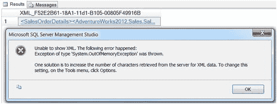
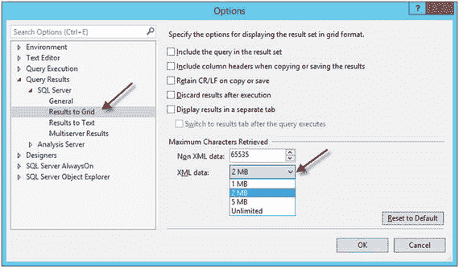

# 2. 构建 XML

XML 在 SQL Server 中通过一种复杂的数据类型来表示，它拥有特殊的语法和定义明确的格式。当我们需要构建 XML 格式的输出或将现有的 XML 拆分（shred）成关系格式时，就可以使用它。在本章中，我将提供一些方法，用于基于一张或多张表的结果集来构建 XML，并将结果格式化并呈现为 XML 输出。

`FOR XML` 子句自 SQL Server 2000 引入以来，已经历了显著的发展，成为构建 XML 输出的综合解决方案。`FOR XML` 必须是 `SELECT` 语句中的最后一个子句，并且当排序在查询中占有位置时，它必须出现在 `ORDER BY` 子句之后。

`FOR XML` 子句有以下几种模式：

*   `RAW` – 从一张或多张表中返回简单的 XML，其中每一行由一个 `<row>` 元素表示。默认生成属性中心（attribute-centric）的 XML，这意味着行中每个非空列值都表示为 `<row>` 元素的属性。但是，如果您指定了 `ELEMENTS` 指令，则行中每个列表示为嵌套在 `<row>` 元素内的一个元素。`RAW` 模式不支持嵌套元素结构。
*   `AUTO` – 从一张或多张表中返回简单的 XML 结构。`AUTO` 模式类似于 `RAW` 模式，不同之处在于，当查询的 `FROM` 子句中连接了两个或更多表时，它支持嵌套元素。
*   `EXPLICIT` – 允许您显式地构建 XML。`EXPLICIT` 模式在后台通过通用表格式访问 XML。这是一种定义明确的行集格式，与拆分后的 XML 非常相似。使用 `EXPLICIT` 模式构建 XML 需要特定的语法来定义 XML 结果的“形状”；因此，这种模式使用起来可能很复杂。SQL Server 2008 引入了 `PATH` 模式作为 `EXPLICIT` 模式的简化替代方案。
*   `PATH` – 提供了一种更简单的方式来显式构建包含元素和属性混合的 XML。这是 `EXPLICIT` 模式的一个绝佳替代方案。

当您指定 `FOR XML` 子句时，您还可以提供以下指令，这些指令控制 `FOR XML` 子句模式的格式化选项：

*   `ELEMENTS` – 返回元素中心（element-centric）的 XML。默认结果是属性中心的，此选项仅适用于 `RAW`、`AUTO` 和 `PATH` 模式。
*   `BINARY BASE64` - 以 Base-64 编码格式检索二进制数据。
*   `TYPE` - 将结果作为 XML 数据类型实例返回。
*   `ROOT` – 为 XML 结果添加顶级（根）元素，这是“格式良好” XML 的要求。
*   `XSINIL` - 当值为 `NULL` 时，在 XML 结果中返回元素名。该元素会带有一个设置为 "true" 的 `xsi:nil` 属性返回，如下所示：`<element xsi:nil = "true"/>`。
*   `ABSENT` – 与 `XSINIL` 指令相反。`ABSENT` 指令是默认值。使用时，它指定应从 XML 结果中消除 `NULL` 值。
*   `XMLSCHEMA` – 为 XML 结果添加一个内联的 W3C XML 架构 (XSD)。

## 修复“无法显示 XML”错误

要在 SQL Server Management Studio (SSMS) 中查看查询的 XML 结果，您只需单击结果窗格中显示为超链接的 XML 结果。XML 结果将在新的 SSMS XML 编辑器窗口中显示。但是，当我们处理非常大的结果集时，XML 可能会超过 XML 数据的默认限制（2 MB），并抛出带有“无法显示 XML”消息的 `System.OutOfMemoryException`，如图 2-1 所示。



图 2-1. “无法显示 XML”错误消息

错误消息建议增加从服务器检索的 XML 数据字符数。如所述，此选项可在“工具”菜单的“选项”项中找到。XML 数据的默认最大值为 2 MB。要更改此设置，请转到菜单栏中的 `工具`，然后在菜单上选择 `选项...`。进入“选项”对话框后，请执行以下操作：

1.  展开 `查询结果`。
2.  展开 `SQL Server`。
3.  单击 `结果到网格`。
4.  在右侧窗格中，使用下拉菜单更改 XML 数据的 `检索到的最大字符数`。可用设置为：1 MB、2 MB、5 MB 或 `无限制`。
5.  单击 `确定` 保存您的设置。图 2-2 显示了“选项”对话框。



图 2-2. 更改 XML 数据设置

如果您只想更改当前查询的 XML 结果最大大小，而不希望永久保存 SSMS 设置，请单击 `查询` 菜单并选择 `查询选项...`。导航到 `结果` 下的 `网格` 设置，并按照前面的方法更改 `检索到的最大字符数` XML 数据选项。

## 2-1. 将关系数据转换为简单 XML 格式

### 问题

您希望将查询结果集转换为简单的 XML 格式。

### 解决方案

SQL Server 提供了 `FOR XML` 子句，用于将查询结果格式化为 XML 数据。`RAW` 模式生成简单的 XML 格式。例如，代码清单 2-1 展示了 `FOR XML` 子句中的 `RAW` 模式。

```sql
SELECT Category.Name AS CategoryName,
Subcategory.Name AS SubcategoryName,
Product.Name,
Product.ProductNumber AS Number,
Product.ListPrice AS Price
FROM  Production.Product Product
INNER JOIN Production.ProductSubcategory Subcategory
ON Product.ProductSubcategoryID = Subcategory.ProductSubcategoryID
LEFT JOIN Production.ProductCategory Category
ON Subcategory.ProductCategoryID = Category.ProductCategoryID
WHERE Product.ListPrice > 0
AND Product.SellEndDate IS NULL
ORDER BY CategoryName, SubcategoryName
FOR XML RAW;
```

代码清单 2-1. 在 `FOR XML` 子句中演示 `RAW` 模式


### 工作原理

`RAW` 模式将查询结果集中的每一行转换为一个简单的、结构化的 XML 元素。默认情况下，`RAW` 模式为每个数据行返回一个 `<row>` 元素，所有值都映射到与源 SQL 查询中相同的列名（或列别名，如果指定了）作为属性。这种 XML 结构通常被称为以属性为中心的 XML。清单 2-2 展示了 `RAW` 模式输出的示例。

```
清单 2-2.
RAW 模式输出示例
```

注意

以属性为中心的 XML 有一个限制，它要求每个元素的属性名称必须是唯一的。因此，SQL 查询必须为每一列提供一个唯一的名称，这与创建 SQL 视图时必须提供唯一列名的方式非常相似。然而，以元素为中心的 XML 则没有这个限制。

在生产环境中，默认的 `<row>` 元素通常不适合或不适用于在 XML 数据中发送给客户端。为了将 `<row>` 元素替换为另一个在生成的 XML 数据中更友好、更符合业务逻辑的元素名称，`RAW` 模式可以接受用户定义的元素名称（行标签名称）。您可以在 `FOR XML RAW` 子句后的括号中指定此行标签名称，例如：`FOR XML RAW('ElementName')`。清单 2-3 展示了如何将默认元素名称替换为用户定义的名称，清单 2-4 展示了 XML 结果。

```sql
SELECT Category.Name AS CategoryName,
Subcategory.Name AS SubcategoryName,
Product.Name,
Product.ProductNumber AS Number,
Product.ListPrice AS Price
FROM  Production.Product Product
INNER JOIN Production.ProductSubcategory Subcategory
ON Product.ProductSubcategoryID = Subcategory.ProductSubcategoryID
LEFT JOIN Production.ProductCategory Category
ON Subcategory.ProductCategoryID = Category.ProductCategoryID
WHERE Product.ListPrice > 0
AND Product.SellEndDate IS NULL
ORDER BY CategoryName, SubcategoryName
FOR XML RAW('Product');
清单 2-3.
演示 FOR XML RAW 子句的行标签名称选项
```

```
清单 2-4.
指定了行标签名称的 FOR XML RAW 查询的结果
```

