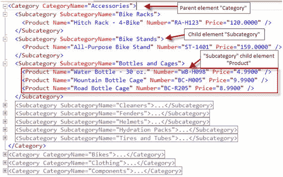

# 2-2\. 使用表名作为元素名称生成 XML 数据

### 问题

您希望简单地从单表构建 XML 结果，其中 XML 结果中的元素名称指示源表。

### 解决方案

当源查询引用单个表时，`AUTO` 模式在功能上与 `RAW` 模式非常相似。唯一的区别是，`AUTO` 模式使用源查询中指定的表名来命名表示每一行的元素。也就是说，当查询包含模式和表名时，例如 `Production.Product`，每个行元素将是 `<Production.Product>`。清单 2-5 展示了针对单表的 `AUTO` 模式。

```sql
SELECT Product.Name,
Product.ProductNumber AS Number,
Product.ListPrice AS Price
FROM  Production.Product
WHERE Product.ListPrice > 0
AND Product.SellEndDate IS NULL
ORDER BY Product.Name
FOR XML AUTO;
清单 2-5.
为单表构建 XML 的 FOR XML AUTO 查询
```

清单 2-6 展示了此查询的 XML 结果。

```
清单 2-6.
单表 FOR XML AUTO 查询的结果
```

注意

W3C XML 标准允许在元素和属性名称中使用句点 (.)。

与 `RAW` 模式不同，`AUTO` 模式不支持行标签名称选项。因此，您必须提供表别名来更改行标签元素名称。清单 2-7 展示了如何在 `AUTO` 模式下使用别名来更改元素名称。

```sql
SELECT Product.Name,
Product.ProductNumber AS Number,
Product.ListPrice AS Price
FROM  Production.Product AS Product
WHERE Product.ListPrice > 0
AND Product.SellEndDate IS NULL
ORDER BY Product.Name
FOR XML AUTO;
清单 2-7.
通过给表取别名来使用 FOR XML AUTO 更改元素名称
```

清单 2-8 展示了使用带别名的源表名执行 `FOR XML AUTO` 查询的 XML 结果。

```
清单 2-8.
源表取了别名的单表 FOR XML AUTO 查询结果
```

当 `FOR XML AUTO` 查询的源查询中连接两个或更多表时，XML 呈现不同的形状。XML 结果会嵌套多层，每一层嵌套节点的名称按照 `FROM` 子句中表的命名顺序命名。如清单 2-9 所示，基于三个表构建 XML。

```sql
SELECT Category.Name AS CategoryName,
Subcategory.Name AS SubcategoryName,
Product.Name,
Product.ProductNumber AS Number,
Product.ListPrice AS Price,
SellEndDate
FROM  Production.Product Product
INNER JOIN Production.ProductSubcategory Subcategory
ON Product.ProductSubcategoryID = Subcategory.ProductSubcategoryID
LEFT JOIN Production.ProductCategory Category
ON Subcategory.ProductCategoryID = Category.ProductCategoryID
WHERE Product.ListPrice > 0
AND Product.SellEndDate IS NULL
ORDER BY CategoryName, SubcategoryName
FOR XML AUTO;
清单 2-9.
使用 FOR XML AUTO 子句构建多个连接表的 XML 数据
```

此查询的 XML 结果格式如下：

1.  `<Category>` 是顶级元素。
2.  `<Subcategory>` 是 `<Category>` 元素的子元素。
3.  `<Product>` 是 `<Subcategory>` 元素的子元素。

应用于查询中多个连接表的 `FOR XML AUTO` 模式的分层 XML 结果如图 2-3 所示。



图 2-3.

当 `FOR XML AUTO` 模式应用于查询中的多个连接表时的分层 XML 结果

### 工作原理

`AUTO` 模式提供了一种构建 XML 的简单方法。SQL 查询引擎分析您的查询结构，并使用查询中提供的名称构建层次结构来生成元素和属性名称——这就是此模式被称为“`AUTO`”的原因。如解决方案部分所示，当实施 `FOR XML AUTO` 时，SQL Server 引擎返回分层的 XML。

