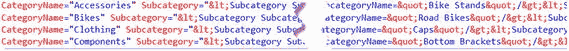
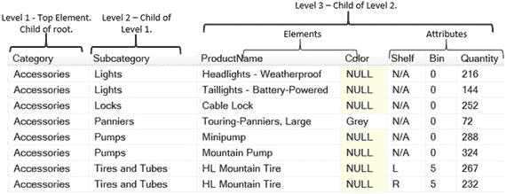

# 2-4\. 添加根元素

### 问题

您希望为生成的 XML 添加一个根（顶级）元素。

### 解决方案

`ROOT`选项会将你的 XML 结果包装在一个你选择的顶级根元素中。清单 2-12 演示了如何向查询中添加`ROOT`指令。

```sql
SELECT Product.Name,
Product.ProductNumber AS Number,
Product.ListPrice AS Price
FROM  Production.Product AS Product
WHERE Product.ListPrice > 0
AND Product.SellEndDate IS NULL
ORDER BY Product.Name
FOR XML AUTO, ELEMENTS, ROOT;
```
清单 2-12.
向`FOR XML AUTO`查询添加`ROOT`指令

清单 2-13 展示了同时使用`ELEMENTS`和`ROOT`指令的`FOR XML AUTO`查询结果。

```xml
<root>
  <Product>
    <Name>All-Purpose Bike Stand</Name>
    <Number>ST-1401</Number>
    <Price>159.0000</Price>
  </Product>
  <Product>
    <Name>AWC Logo Cap</Name>
    <Number>CA-1098</Number>
    <Price>8.9900</Price>
  </Product>
  <Product>
    <Name>Bike Wash - Dissolver</Name>
    <Number>CL-9009</Number>
    <Price>7.9500</Price>
  </Product>
  ...
</root>
```
清单 2-13.
使用`ELEMENTS`和`ROOT`指令生成的格式良好 XML 片段

### 工作原理

`ROOT`选项指定你的 XML 结果将被包装在一个单独的顶级根元素中。默认情况下，`ROOT`指令生成一个名为`<root>`的顶级元素。然而，默认名称`<root>`也可以通过在括号中指定用户定义的值来替换。例如：`FOR XML AUTO, ELEMENTS, ROOT('Products')`。当指定了根元素名称时，XML 结果将使用你指定的名称作为顶级根元素。在前面的例子中，根元素将被命名为`<Products>`。

## 2-5. 在 XML 数据中包含值为 NULL 的元素

### 问题

默认情况下，SQL Server 生成的 XML 会排除任何包含`NULL`的列。你希望特别包含那些包含`NULL`的列。

### 解决方案

`ELEMENTS`指令的`XSINIL`选项强制 XML 结果包含那些源列包含`NULL`的元素。清单 2-14 演示了如何向你的查询添加`XSINIL`选项。

```sql
SELECT Product.Name,
Product.ProductNumber AS Number,
Product.ListPrice AS Price,
SellEndDate
FROM  Production.Product AS Product
WHERE Product.ListPrice > 0
ORDER BY Product.Name
FOR XML AUTO, ELEMENTS XSINIL, ROOT('Products');
```
清单 2-14.
向`FOR XML`查询添加`XSINIL`选项

清单 2-15 展示了使用`XSINIL`选项的结果。

```xml
...
<Product>
  <Name>Bike Wash - Dissolver</Name>
  <Number>CL-9009</Number>
  <Price>7.9500</Price>
  <SellEndDate xsi:nil="true"/>
</Product>
<Product>
  <Name>Cable Lock</Name>
  <Number>LO-C100</Number>
  <Price>25.0000</Price>
  <SellEndDate>2013-05-29T00:00:00</SellEndDate>
</Product>
...
```
清单 2-15.
`XSINIL`选项查询结果的片段

在示例结果中，产品编号`CL-9009`在数据库中的`SellEndDate`为`NULL`，因此它用一个设置为“true”的`xsi:nil`属性来表示。然而，产品编号`LO-C100`有一个非`NULL`的`SellEndDate`值，所以它没有`xsi:nil`属性。

### 工作原理

`ELEMENTS`指令支持两个选项：
1.  `XSINIL` – 此选项强制 XML 结果为源数据中的`NULL`值生成元素。
2.  `ABSENT` – 此选项将源数据中包含`NULL`值的任何元素排除在你的 XML 结果之外。这是`ELEMENTS`指令的默认选项，无需显式指定。

`XSINIL`和`ABSENT`选项被视为`ELEMENTS`指令的一部分，并且在需要时可以这样指定。因此，与指令不同，`XSINIL`和`ABSENT`选项与其`ELEMENTS`指令之间用空格分隔，而不是逗号。

## 2-6. 在 XML 中包含二进制数据

### 问题

你希望将二进制列的内容包含在你的 XML 数据中。

### 解决方案

你可能会遇到查询包含二进制数据的列的情况，并且你希望将这些二进制数据包含在你的 XML 结果中。考虑清单 2-16，这是一个试图以 XML 格式返回二进制数据的查询。

```sql
SELECT LargePhotoFileName,
LargePhoto
FROM  Production.ProductPhoto
FOR XML AUTO, ELEMENTS;
```
清单 2-16.
检索 XML 格式二进制数据的失败查询

当你尝试执行此查询时，它会引发错误：

`FOR XML AUTO requires primary keys to create references for 'LargePhoto'. Select primary keys, or use BINARY BASE64 to obtain binary data in encoded form if no primary keys exist.`

此查询失败，因为你没有在结果集中包含主键列。如清单 2-17 所示更改查询将解决此问题。

```sql
SELECT LargePhotoFileName,
LargePhoto,
ProductPhotoID
FROM  Production.ProductPhoto
FOR XML AUTO, ELEMENTS;
```
清单 2-17.
检索 XML 格式二进制数据的有效查询

然而，返回的不是预期的二进制数据，而是对主键行的引用，如清单 2-18 所示。

```xml
<ProductPhoto ProductPhotoID="70">
  <LargePhotoFileName>racer02_black_large.gif</LargePhotoFileName>
  <LargePhoto>dbobject/Production.ProductPhoto[@ProductPhotoID='70']/@LargePhoto</LargePhoto>
</ProductPhoto>
```
清单 2-18.
带有对主键行引用的二进制数据查询结果片段

为了在你的 XML 结果中包含二进制数据的实际表示，只需将`BINARY BASE64`指令应用于你的`FOR XML`子句。此指令强制 XML 结果以 Base64 编码格式包含二进制数据。清单 2-19 演示了`FOR XML`子句的`BINARY BASE64`指令。

```sql
SELECT LargePhotoFileName,
LargePhoto
FROM  Production.ProductPhoto
FOR XML AUTO, ELEMENTS, BINARY BASE64;
```
清单 2-19.
使用`FOR XML`子句的`BINARY BASE64`指令

### 工作原理

`BINARY BASE64`指令以 Base-64 格式对二进制数据进行编码。当查询返回`varbinary`数据类型的列时，`FOR XML`子句的`BINARY BASE64`指令会在你的 XML 结果中以 Base-64 编码的形式返回你的二进制数据。

每个`FOR XML`模式使用特定规则作用于结果集中的二进制数据：
*   `AUTO`模式在查询结果中包含主键时，返回对二进制列和行的引用。
*   `RAW`和`EXPLICIT`模式在查询有包含二进制数据的列时会引发错误。
*   只有`PATH`模式在未指定`BINARY BASE64`指令时不会引发错误，并会返回包含二进制数据的 XML 结果。

例如，执行以下查询：
```sql
SELECT LargePhotoFileName, LargePhoto
FROM  [Production].[ProductPhoto]
FOR XML PATH;
```
以及这个查询：
```sql
SELECT LargePhotoFileName, LargePhoto
FROM  [Production].[ProductPhoto]
FOR XML AUTO, ELEMENTS, BINARY BASE64;
```
两个查询都将返回相同的结果。然而，当二进制数据是结果集的一部分时，我强烈建议对所有`FOR XML`模式包含`BINARY BASE64`指令。这是因为你需要检索实际的数据，而不是数据的引用，就像当主键列在`SELECT`子句中列出时可能发生的那样。

## 2-7. 生成嵌套的层次结构 XML 数据

### 问题

你希望将生成 XML 的子查询的结果嵌套到外部生成 XML 的查询中，以创建更复杂的层次结构 XML 数据。


## 2-8. 构建自定义 XML

### 问题

您希望对生成的 XML 格式进行细粒度控制。

### 解决方案

在之前的方案中，我们关注的是返回以元素为中心或以属性为中心的 XML 的 `RAW` 和 `AUTO` 模式，并根据源表和列名（或别名）自动生成名称。但如果您想对以元素为中心或以属性为中心的 XML 结果有更多控制呢？`EXPLICIT` 模式让您能对 XML 结果有更多的控制。清单 2-23 展示了一个使用自定义结构生成 XML 结果的查询。

```
SELECT 1                AS Tag,
       0                AS Parent,
       Prod.Name        AS [Categories!1!Category!ELEMENT],
       NULL             AS [Subcategories!2!Subcategory!ELEMENT],
       NULL             AS [Product!3!ProductName!ELEMENT],
       NULL             AS [Product!3!Color!ELEMENTXSINIL],
       NULL             AS [Product!3!Shelf],
       NULL             AS [Product!3!Bin],
       NULL             AS [Product!3!Quantity]
FROM   Production.ProductCategory Prod
UNION ALL
SELECT 2                AS Tag,
       1                AS Parent,
       Category.Name,
       Subcategory.Name,
       NULL,
       NULL,
       NULL,
       NULL,
       NULL
FROM   Production.ProductCategory Category
       INNER JOIN Production.ProductSubcategory Subcategory
         ON Category.ProductCategoryID = Subcategory.ProductCategoryID
UNION ALL
SELECT 3                AS Tag,
       2                AS Parent,
       ProductCategory.Name,
       Subcategory.Name,
       Product.Name,
       Product.Color,
       Inventory.Shelf,
       Inventory.Bin,
       Inventory.Quantity
FROM   Production.Product Product
       INNER JOIN Production.ProductInventory Inventory
         ON Product.ProductID = Inventory.ProductID
       INNER JOIN Production.ProductSubcategory Subcategory
         ON Product.ProductSubcategoryID = Subcategory.ProductSubcategoryID
       INNER JOIN Production.ProductCategory
         ON Subcategory.ProductCategoryID = Production.ProductCategory.ProductCategoryID
ORDER  BY [Categories!1!Category!ELEMENT],
          [Subcategories!2!Subcategory!ELEMENT],
          [Product!3!ProductName!ELEMENT]
FOR XML EXPLICIT, ROOT('Products');
清单 2-23.
使用 EXPLICIT 模式控制 XML 结果的格式
```

### 解决方案（续）

您可能遇到需要通过 SQL 相关子查询生成分层 XML 的情况。例如，AdventureWorks 数据库中的产品类别可以有多个相关的子类别。假设您想要生成一个列出所有产品类别的 XML 结果，每个类别内嵌其产品子类别。

您的第一个 SQL 查询可能如清单 2-20 所示。

```
SELECT Category.Name AS CategoryName,
(
  SELECT Subcategory.Name AS SubcategoryName
  FROM   Production.ProductSubcategory Subcategory
  WHERE  Subcategory.ProductCategoryID = Category.ProductCategoryID
  FOR XML AUTO
) Subcategory
FROM   Production.ProductCategory Category
FOR XML AUTO, ROOT('Categories');
清单 2-20.
首次尝试使用相关子查询创建分层 XML
```

此查询的结果在整个 XML 数据中生成了诸如 `&lt;` 和 `&gt;` 这样的 XML 实体，如图 2-4 所示，而不是预期的正确嵌套的 XML 元素。



图 2-4.

首次尝试创建分层 XML 数据的结果

如何以 XML 格式返回查询？您需要正确的标签，而不是 XML `&gt;` 和 `&lt;` 实体。

为了强制结果集以正确的 XML 格式返回，请将 `TYPE` 指令添加到您的 `FOR XML` 子句中。清单 2-9 演示了此选项。清单 2-21 显示了生成的 XML。

```
SELECT Category.Name AS CategoryName,
(
  SELECT Subcategory.Name AS SubcategoryName
  FROM   Production.ProductSubcategory Subcategory
  WHERE  Subcategory.ProductCategoryID = Category.ProductCategoryID
  FOR XML AUTO, TYPE
) Subcategory
FROM   Production.ProductCategory Category
FOR XML AUTO, ELEMENTS, TYPE, ROOT('Categories');
清单 2-21.
实现 TYPE 指令
```

这个添加了 `TYPE` 指令的更新查询的结果如清单 2-22 所示。

```

...

清单 2-22.
使用嵌套子查询和 TYPE 指令生成的嵌套分层 XML 片段。
```

### 工作原理

默认情况下，`FOR XML` 子句返回 `nvarchar(max)` 数据类型的结果。子查询生成的 XML 作为字符数据返回，而不是所需的 XML 格式。当 SQL Server 将 XML 数据转换为字符格式时，它会正确地对某些特殊字符进行实体编码，例如“`<`”和“`>`”字符（分别为 `&lt;` 和 `&gt;`）。`TYPE` 指令强制 SQL 以正确的 XML 格式返回 XML 结果，而不对内容进行实体编码。`TYPE` 指令可以与所有 `FOR XML` 模式一起使用。


### 工作原理

`EXPLICIT`模式是`FOR XML`中最复杂的模式之一。所有元素和属性都需要显式提供，每个子块也必须显式链接到父级。与`RAW`和`AUTO`等其他模式相比，使用`EXPLICIT`模式的查询语句要冗长得多。然而，`EXPLICIT`模式的好处在于，它为控制查询结果生成的 XML 形状提供了更大的灵活性。

为了更好地理解`EXPLICIT`模式的工作原理，我将通过一个示例来讲解。让我们从一个基础的 T-SQL 查询开始，如代码清单 2-24 所示，该查询展示了我们希望转换为 XML 结构的 SQL。

```sql
SELECT ProductCategory.Name Category,
Subcategory.Name Subcategory,
Product.Name ProductName,
Product.Color,
Inventory.Shelf,
Inventory.Bin,
Inventory.Quantity
FROM Production.Product Product
INNER JOIN Production.ProductInventory Inventory
ON Product.ProductID = Inventory.ProductID
INNER JOIN Production.ProductSubcategory Subcategory
ON Product.ProductSubcategoryID = Subcategory.ProductSubcategoryID
INNER JOIN Production.ProductCategory
ON Subcategory.ProductCategoryID = Production.ProductCategory.ProductCategoryID
ORDER BY ProductCategory.Name, Subcategory.Name, Product.Name;
```
**代码清单 2-24.** 我们希望转换为 XML 格式的 SQL 查询

代码清单 2-24 中的 SQL 返回了基于类别和子类别的产品列表。因此，我们需要做出决定并回答几个问题：
1.  我们希望 XML 的结构是怎样的？
2.  XML 需要有多少个同级层级？
3.  哪些列将被映射为元素，哪些应该是属性？
4.  我们是否需要保留值为`NULL`的元素？

在图 2-5 中，我们展示了代码清单 2-24 查询的结果，并开始为想要的 XML 结果绘制路线图。图 2-5 展示了一个路线图示例，它将帮助我们使用`EXPLICIT`模式构建查询。


**图 2-5.** 代码清单 2-24 中的查询结果

以此图为指导，我们将定义一个逻辑结构来模拟目标 XML 结构。该逻辑结构如代码清单 2-25 所示。

```xml
<ELEMENT />
<ELEMENT />
<ELEMENT />
<ELEMENT XSINIL />
```
**代码清单 2-25.** 建议的逻辑 XML 结构

遵循图 2-5 的路线图和代码清单 2-25 的逻辑 XML 结构，最终的 XML 结构将由五个嵌套层级组成，包含：
*   `<Products>` 是根元素。
*   `<Categories>` 是一个容器数据元素，直接容纳每个 `<Category>` 元素及其所有相关的 `<Subcategory>` 元素。
*   `<Category>` 是 `<Categories>` 元素的直接子元素，将包含类别名称。`<Subcategories>` 元素与 `<Category>` 元素是同级元素，同时也是 `<Categories>` 元素的直接子元素。这是用于存放与同级 `<Category>` 元素相关的、特定于子类别的数据的容器元素。
*   `<Subcategory>` 是 `<Subcategories>` 元素的直接子元素。此元素保存当前子类别的名称。`<Product>` 元素代表子类别内的单个产品。此元素是 `<Subcategories>` 元素的直接子元素，也是 `<Subcategory>` 元素的同级元素。`<Product>` 元素将分配有多个属性，并充当产品特定数据元素的容器。
*   `<ProductName>` 是包含产品名称的数据元素。`<Color>` 元素在有值时包含产品的颜色。`<Color>` 元素被标识为 `XSINIL`，这意味着即使源列为 `NULL`，我们也希望此元素出现在结果中。`<ProductName>` 和 `<Color>` 元素是同级元素，两者都是 `<Product>` 元素的直接子元素。

下一步是构建查询。`EXPLICIT`模式的语法有某些需要遵循的规则和规范：
1.  查询可以包含一个或多个 `SELECT` 语句块，使用 `UNION ALL` 将它们全部连接起来。
2.  每个 `SELECT` 语句块必须包含两个名为 `Tag` 和 `Parent` 的整数类型列，作为查询的前两列。这些列定义了父级和子级层级之间的结构关系。例如，代码清单 2-23 有多个嵌套层级，`SELECT` 子句确立了层级结构，如代码清单 2-26 中的代码片段所示。
    ```sql
    SELECT 1 AS Tag,
    0 AS Parent,
    .
    .
    .
    UNION ALL
    SELECT 2 AS Tag,
    1 AS Parent,
    .
    .
    .
    UNION ALL
    SELECT 3  AS Tag,
    2  AS Parent,
    .
    .
    .
    ```
    **代码清单 2-26.** `Tag` 和 `Parent` 列定义 XML 层级结构的代码片段

    在第一个 `SELECT` 查询中，`Parent` 列以值 0 开始层级。`Tag` 列指定层级编号。在第二个 `SELECT` 查询中，`Tag` 值成为 `Parent` 并递增到下一个数字。这种交替机制应用于每个层级。
3.  下一个重要的规则是建立 XML 结构。在 `EXPLICIT` 模式下，每个列必须在第一个 `SELECT` 块中定义，并且 `EXPLICIT` 模式对此有特殊的语法。在代码清单 2-23 中，您可以看到 `Tag` 和 `Parent` 列之后的所有列都有一个非常特定的别名样式，其格式必须为：`[ElementName!TagNumber!AttributeName!Directive]`。我们在代码清单 2-23 查询中的一个例子是 `[Categories!1!Category!ELEMENT]`。这个特定的别名定义了我们 XML 中 `<Category>` 元素的结构，它包含类别名称。下面是这个别名的分解：
    *   `Categories` – 元素名称的通用标识符。
    *   `1` – 元素的标签编号，代表嵌套的 XML 层级。值为 1 表示这是顶级元素（不包括根元素）。
    *   `Category` – 值属性的名称，除非指定了 `ELEMENT` 指令，此时它用作元素名称。
    *   `ELEMENT` – 该指令指定以元素为中心的表示。以属性为中心是默认设置，因此无需指定以属性为中心的表示。如果使用 `ELEMENTXSINIL`，即使源值为 `NULL`，该元素也将被包含。每个别名部分由感叹号 (!) 分隔，这种命名约定是规则的一部分。因为每个别名包含特殊字符（“!”），所以它们必须用引号括起来。以下是代码清单 2-23 中的其他别名：
        *   `[Subcategories!2!Subcategory!ELEMENT]` – Categories 元素的子级（标签 2），表示子类别值，以元素为中心。
        *   `[Product!3!ProductName!ELEMENT]` – Subcategories 元素的子级（标签 3），表示产品名称值，以元素为中心。
        *   `[Product!3!Color!ELEMENTXSINIL]` – Subcategories 的子级（标签 3），表示颜色值，以元素为中心，带有 `XSINIL` 指令。
        *   `[Product!3!Shelf]` – Subcategories 的子级（标签 3），表示货架值，以属性为中心。
        *   `[Product!3!Bin]` – Subcategories 的子级（标签 3），表示货仓位值，以属性为中心。
        *   `[Product!3!Quantity]` – Subcategories 的子级（标签 3），表示数量值，以属性为中心。
4.  在给定的 `TagNumber` 内，别名的 `ElementName` 部分必须相同，即使值是从不同的表中检索的。例如，对于 `TagNumber` 3，必须始终使用 `Product` 作为 `ElementName`，如下所示：
    ```sql
    [Product!3!ProductName!ELEMENT] -- 表 Product，列 Name
    [Product!3!Color!ELEMENTXSINIL] -- 表 Product，列 Color
    [Product!3!Shelf] – 表 Inventory 列 Shelf
    [Product!3!Bin] - 表 Inventory 列 Bin
    [Product!3!Quantity] - 表 Inventory 列 Quantity
    ```
5.  源查询的 `SELECT` 块都必须遵守 SQL 的 `UNION ALL` 运算符规则。每个 `SELECT` 语句必须具有相同数量的列。当不需要某列时，必须用 `NULL` 值填充。
6.  排序是 `EXPLICIT` 模式的一个重要考虑因素。`ORDER BY` 子句最终确定 XML 层级结构。因此，排序顺序需要遵循父级到子级的序列。`ORDER BY` 子句中的列名必须与顶级 `SELECT` 查询中的别名相同。例如：
    ```sql
    ORDER BY [Categories!1!Category!ELEMENT],
    [Subcategories!2!Subcategory!ELEMENT],
    [Product!3!ProductName!ELEMENT]
    ```

显然，实现 `EXPLICIT` 模式比我们目前讨论的其他模式要复杂得多；然而，`EXPLICIT` 模式为用户提供了对 XML 生成过程的完全控制。与其他模式不同，此 `FOR XML` 模式可以通过内部指令进行扩展，允许用户控制每个单独的 XML 元素和属性。表 2-1 列出了 `EXPLICIT` 模式的指令。

**表 2-1.** `EXPLICIT` 模式指令列表

| 指令 | 定义 | 语法示例 |
| --- | --- | --- |
| `ID, IDREF, IDREFS` | 启用文档内链接，类似于关系数据库中的主键和外键关系。 | `[Product!3!ProductList!IDREFS]` |
| `CDATA` | 如果指令设置为 `CDATA`，则包含的数据不会被实体编码，而是放入 CDATA 节中。`CDATA` 属性必须是匿名的。 | `[Product!3!!CDATA]` |
| `HIDE` | 隐藏节点。当您仅为了排序目的而检索值，但不希望它们出现在结果 XML 中时，此指令很有用。 | `[Product!3!Shelf!HIDE]` |
| `ELEMENT` | 生成元素而不是属性。 | `[Product!3!ProductName!ELEMENT]` |
| `ELEMENTXSINIL` | 为 `NULL` 值生成带有 `xsi:nil=“true”` 属性的元素。类似于 `XSINIL` 指令。 | `[Product!3!Color!ELEMENTXSINIL]` |
| `XML` | 生成元素，就像元素指令一样。不同之处在于，xml 指令不进行实体编码。 | `[Product!3!Color!XML]` |
| `XMLTEXT` | 如果指定了 xmltext 指令，则列内容将被包装在单个标签中，该标签与文档的其余部分集成。 | `[Parent!1!!XMLTEXT]` |

