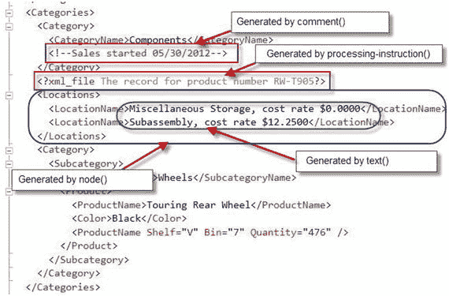
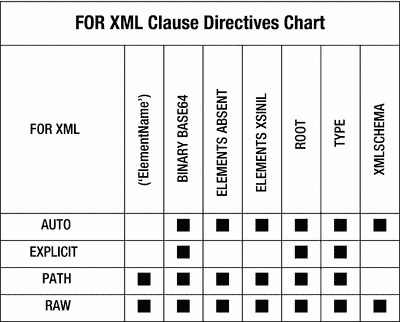

# 2-10. 向 XML 添加特殊节点

### 问题

你希望向生成的 XML 数据中添加特殊节点，例如注释、处理指令或自定义文本。

### 解决方案

`FOR XML` 子句的 `PATH` 模式支持 XML 路径语言（XPath）节点测试。XPath 语法支持一部分节点测试名称，这些名称充当函数。这些函数向最终的 XML 输出添加特定类型的节点。清单 2-28 是一个演示多个 XPath 节点测试的查询。

```sql
SELECT ProductCategory.Name AS "Category/CategoryName",
N'Sales started ' + convert(nvarchar(12), Product.SellStartDate, 101) AS "Category/comment()",
N'The record for product number ' + Product.ProductNumber AS "processing-instruction(xml:file)",
(
SELECT DISTINCT Location.Name "text()", N', cost rate $',
Location.CostRate "text()"
FROM Production.ProductInventory Inventory
INNER JOIN Production.Location Location
ON Inventory.LocationID = Location.LocationID
WHERE Product.ProductID = Inventory.ProductID
FOR XML PATH('LocationName'), TYPE
) AS "Locations/node()",
Subcategory.Name AS "Category/Subcategory/SubcategoryName",
Product.Name AS "Category/Subcategory/Product/ProductName",
Product.Color AS "Category/Subcategory/Product/Color",
Inventory.Shelf AS "Category/Subcategory/Product/ProductName/@Shelf",
Inventory.Bin AS "Category/Subcategory/Product/ProductName/@Bin",
Inventory.Quantity AS "Category/Subcategory/Product/ProductName/@Quantity"
FROM Production.Product Product
INNER JOIN Production.ProductInventory Inventory
ON Product.ProductID = Inventory.ProductID
INNER JOIN Production.ProductSubcategory Subcategory
ON Product.ProductSubcategoryID = Subcategory.ProductSubcategoryID
INNER JOIN Production.ProductCategory
ON Subcategory.ProductCategoryID = Production.ProductCategory.ProductCategoryID
ORDER BY ProductCategory.Name, Subcategory.Name, Product.Name
FOR XML PATH('Categories'), ELEMENTS XSINIL, ROOT('Products');
```
清单 2-28. 演示 XPath 节点测试

注意

XPath 节点测试名称区分大小写。因此，所有节点测试名称必须以小写字母输入，否则 SQL 将引发错误。例如，当函数 `text()` 被输入为 `Text()` 时，会抛出类似于以下的错误：Msg 6850, Level 16, State 1 … Column name ‘Text()’ contains an invalid XML identifier as required by FOR XML; …

### 工作原理

当 XPath 节点测试在 `PATH` 模式下使用时，它们会向您的 XML 结果添加一个特殊节点。节点测试始终位于 XPath 列别名的末尾。例如，在 `“Category/comment()”` 路径或 `“processing-instruction(xml:file)”` 路径中。此外，节点测试也可以单独用作列别名，无需层次路径。表 2-2 列出了支持的 `FOR XML PATH` XPath 节点测试。

表 2-2. XPath 节点测试

| 节点类型 | 节点返回 | 节点示例 |
| --- | --- | --- |
| `comment()` | 返回注释节点。 | `element/comment()` 选择上下文节点之后出现的所有注释节点。 |
| `node()` | 返回任何类型的节点。可用于向结果添加子集 XML。 | `element/node()` 选择上下文节点之前出现的所有节点。 |
| `processing-instruction(name)` | 返回处理指令节点。 | `processing instruction(PI Name)` 选择上下文节点内的所有处理指令节点。 |
| `text()` | 返回文本节点。可用于将多个列合并为一个 XML 元素。 | `element/text()` 选择作为上下文节点子节点的文本节点。 |

回顾清单 2-28 中的代码，我们可以看到以下内容：

1.  要在 `<CategoryName>` 元素下生成注释，需要在别名中提供带有 `comment()` 节点测试的路径。生成的 XML 会将数据行映射到 XML 结果中的特殊注释标签 `<!--comment-->` 中。根据我们的示例代码：
    ```sql
    N'Sales started' + convert(nvarchar(12), Product.SellStartDate, 101) AS "Category/comment()"
    ```

2.  `processing-instruction(name)` 节点测试必须在其括号内指定目标名称。如果未提供目标名称，将引发错误。此函数创建格式为 `<?name ?>` 的特殊 XML 节点。例如：
    ```sql
    N'The record for product number ' + Product.ProductNumber AS "processing-instruction(xml:file)"
    ```

3.  当需要将多个列连接为单个元素时，`text()` 节点测试非常有用。例如：
    ```sql
    SELECT DISTINCT Location.Name "text()", ', cost rate $',
    Location.CostRate "text()"
    ```

4.  当需要将值插入 XML 数据类型时，`node()` 节点测试很有用。在清单 2-28 中，相关子查询执行两个操作。首先，它连接位置和成本率列；其次，它产生一个 XML 结果，因为一个产品可能有多个关联的位置。图 2-6 在一个 XML 结果中演示了所有 XPath 节点测试函数。
    
    图 2-6. 包含所有 XPath 节点测试函数的 XML 结果

## 总结

本章讨论了四种 `FOR XML` 模式：`RAW`、`AUTO`、`EXPLICIT` 和 `PATH`。详细解释了每种模式，并针对特定情况提供了应使用的最佳模式建议，以及如何实现每种模式的技巧。我还讨论了指令、它们的功能以及每个指令如何与各种 XML 模式交互。如果您需要构建自定义 XML 结果，本章提供了如何构建健壮的自定义 XML 数据的方向。

`FOR XML` 子句为用户提供了强大而高效的选项，用于从关系数据构建 XML 结果。图 2-7 中的图表说明了每种 `FOR XML` 模式支持的指令。

图 2-7. 按模式分类的可用 `FOR XML` 指令

下一章将演示如何将 XML 结果存储在存储介质（磁盘、SSD 驱动器、SAN 等）上，以及如何将 XML 文件上传到表中。

