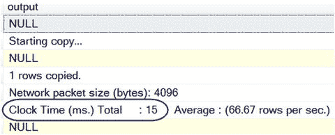
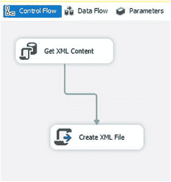
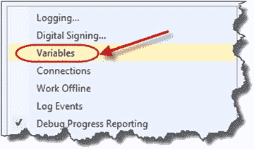
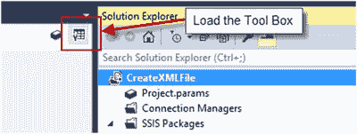
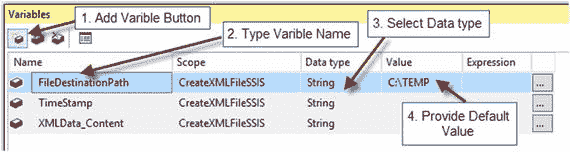
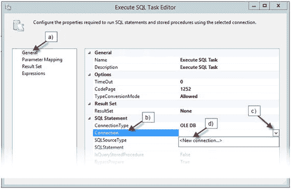
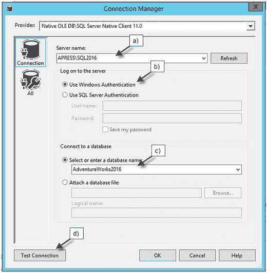
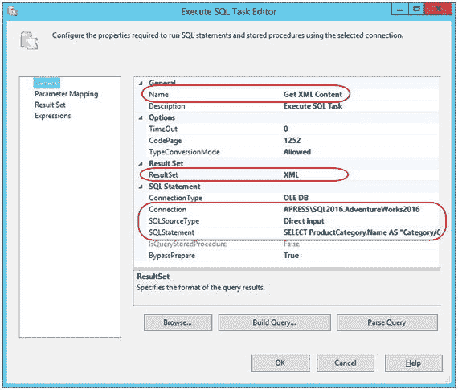

# 3. 操作 XML 文件

在第 2 章中，我们讨论了如何从 SQL 查询结果集构建 XML。在我们开始回顾如何分解 XML 数据的选项之前，我们首先需要知道如何将 XML 结果存储在存储介质（磁盘、SSD 驱动器、SAN 等）上，以及如何将 XML 文件上传到表中。本章将演示操作 XML 文件的各种选项。

## 3-1. 从 SQL 将 XML 结果存储到文件中

### 问题

您希望将 SQL 中生成的 XML 结果存储为 `.xml` 文件。

### 解决方案

`BCP`（大容量复制程序）实用程序允许将数据导出到 XML 文件。当文件路径有效且 SQL Server 帐户具有存储文件所需的足够权限时，则可以从存储过程执行该过程。清单 3-1 演示了存储过程如何使用 `@FilePath` 参数中提供的文件路径创建 XML 文件。

```sql
CREATE PROCEDURE dbo.usp_WriteXMLFile
@XML XML,
@FilePath nvarchar(200)
AS
BEGIN
SET NOCOUNT ON;
IF (OBJECT_ID('tempdb..##XML') IS NOT NULL)
DROP TABLE ##XML;
CREATE TABLE ##XML (XMLHolder XML);
INSERT INTO ##XML
(
XMLHolder
)
SELECT @XML;
-- 准备日志表
DECLARE @cmd TABLE
(
name NVARCHAR(35),
minimum INT,
maximum INT,
config_value INT,
run_value INT
);
DECLARE @run_value        INT;
-- 保存原始配置集
EXECUTE master.dbo.sp_configure 'show advanced options', 1;
RECONFIGURE ;
INSERT INTO @cmd
(
name,
minimum,
maximum,
config_value,
run_value
)
EXECUTE sp_configure 'xp_cmdshell';
SELECT @run_value = run_value
FROM @cmd;
IF @run_value = 0
BEGIN
-- 启用 xp_cmdshell
EXEC sp_configure 'xp_cmdshell', 1;
RECONFIGURE;
END;
DECLARE @SQL nvarchar(300) = '';
SET @SQL = 'bcp ##XML out "' + @FilePath + '\Categories_'
+ FORMAT(GETDATE(), N'yyyyMMdd_hhmmss')
+ '.xml" -S "' + @@SERVERNAME + '" -T -c';
-- REPLACE(REPLACE(REPLACE(CONVERT(varchar(20), GETDATE(), 120), '-', ''), ' ', '_'), ':', '')
-- 对于仍在使用 SQL Server 2008 R2 或更早版本的用户，请使用 REPLACE 代替 FORMAT。FORMAT 函数在 SQL 2012 中引入。
EXECUTE master..xp_cmdshell @SQL;
IF @run_value = 0
BEGIN
-- 禁用 xp_cmdshell
EXECUTE sp_configure 'xp_cmdshell', 0;
RECONFIGURE;
END;
IF (OBJECT_ID('tempdb..##XML') IS NOT NULL)
DROP TABLE ##XML;
SET NOCOUNT OFF;
END;
GO
```
清单 3-1. 使用存储过程通过目标文件路径写入 XML 文件

### 工作原理

存储过程 `usp_WriteXMLFile`（如清单 3-1 所示）包含几个重要组件，以实现在 SQL Server 内部成功创建 XML 文件。让我们分解这个存储过程，来了解 XML 文件写入过程是如何工作的：

1.  参数 `@FilePath` 是 XML 文件的目标路径。该参数使得存储过程非常灵活，尤其是在不同环境（如开发、预演和生产环境）中运行时。
2.  `CREATE` 一个全局临时表 (`##XML`)，最后再 `DROP` 它。使用一个名为 `XMLHolder`、数据类型为 `XML` 的列来获取 `XML` 数据。需要创建全局临时表的情况比较少见；然而，如果引用了会话级临时表，`BCP` 命令将会报错。因此，我们可以使用永久表或全局临时表。如果过程属于并发进程的一部分，那么使用全局临时表总是存在风险。全局临时表在整个服务器范围内可见，如果其他人碰巧同时使用该存储过程，某个用户的表可能会被覆盖，从而导致结果不准确。请参考第 3 章的代码示例，其中存储过程 `usp_WriteXMLFileDynamicTable` 演示了如何解决此问题。
3.  将 `XML` 数据 `INSERT` 到全局临时表 (`##XML`) 中。
4.  要从存储过程或 SSMS 运行 `BCP` 命令，服务器实例需要配置 `xp_cmdshell` 选项值为 1。这意味着实例允许运行 `xp_cmdshell` 扩展存储过程。有些情况下，出于安全原因，可能要求将服务器实例的配置保持为值 0（禁用状态）。在这种情况下，你仍然需要编写代码，在创建 XML 文件时将服务器实例从值 0 切换到 1，然后再切换回 0。由于 `BCP` 命令能够在毫秒级内创建 XML 文件，因此在服务器设置为值 0 以启用 `xp_cmdshell` 存储过程来创建 XML 文件的这几毫秒内，实际上没有安全风险。
    *   为了保留原始设置，创建了表变量 `@cmd`。
    *   系统存储过程 `sp_configure` 使用参数值 `'xp_cmdshell'`。该结果被插入到表变量 `@cmd` 中，它反映了 `'xp_cmdshell'` 选项的当前状态。
    *   以下语句 `SELECT @run_value = run_value FROM @cmd` 将局部变量 `@run_value` 赋值，以保存 `xp_cmdshell` 选项的 `run_value` 供进一步分析。
    *   条件语句 `IF @run_value = 0` 检测是否需要将选项值从 0 更改为 1。
5.  创建变量 `@SQL` 来组合 `BCP` 实用程序的语句。
6.  最终的命令取决于实例和数据库名称，可能如下所示：

    让我们更仔细地看看 `BCP` 创建 XML 文件所需的所有参数和开关：
    *   `BCP` – 批量复制实用程序的可执行文件名。
    *   `##XML` – 包含 XML 数据的表名。
    *   `out` – 指示从表中复制数据并将其发送到目标。
    *   `"C:\TEMP\Categories_20170310_164701.xml"` – 文件路径。
    *   `-S "APRESS\SQL2016"` – 服务器名称。
    *   `-T` – 指定 `BCP` 命令在受信任的连接下运行。要使用 SQL Server 凭据运行 `BCP`，请使用 `-U login_Name -P password` 选项代替 `-T`。
    *   `-c` – 指定输出内容为字符数据类型。**注意** 以短横线开头的 `BCP` 参数区分大小写。例如，`-T` 是用于受信任连接的选项；而 `-t` 是字段终止符。
    语句 `exec master..xp_cmdshell @SQL` 运行 `BCP` 命令。
    语句 `IF @run_value = 0` 条件检测是否需要将选项值从 1 改回 0。
    为了完成流程，应该销毁 `##XML` 表。

```sql
IF (OBJECT_ID('tempdb..##XML') IS NOT NULL)
DROP TABLE ##XML;
```

```cmd
BCP ##XML out "C:\TEMP\Categories_20170310_164701.xml" -S "APRESS\SQL2016" -T -c
```

要测试存储过程，请运行以下代码：

```sql
DECLARE @x XML
SET @x = (
SELECT ProductCategory.Name AS "Category/CategoryName",
(
SELECT DISTINCT Location.Name "text()", ', cost rate $',
Location.CostRate "text()"
FROM Production.ProductInventory Inventory
INNER JOIN Production.Location Location
ON Inventory.LocationID = Location.LocationID
WHERE Product.ProductID = Inventory.ProductID
FOR XML PATH('LocationName'), TYPE
) AS "Locations/node()",
Subcategory.Name AS "Category/Subcategory/SubcategoryName",
Product.Name AS "Category/Subcategory/Product/ProductName",
Product.Color AS "Category/Subcategory/Product/Color",
Inventory.Shelf AS "Category/Subcategory/Product/ProductName/@Shelf",
Inventory.Bin AS "Category/Subcategory/Product/ProductName/@Bin",
Inventory.Quantity AS "Category/Subcategory/Product/ProductName/@Quantity"
FROM Production.Product Product
INNER JOIN Production.ProductInventory Inventory
ON Product.ProductID = Inventory.ProductID
INNER JOIN Production.ProductSubcategory Subcategory
ON Product.ProductSubcategoryID = Subcategory.ProductSubcategoryID
INNER JOIN Production.ProductCategory
ON Subcategory.ProductCategoryID = ProductCategory.ProductCategoryID
ORDER BY ProductCategory.Name, Subcategory.Name, Product.Name
FOR XML PATH('Categories'), ELEMENTS XSINIL, ROOT('Products')
)
EXECUTE usp_WriteXMLFile @x, 'C:\TEMP'
```

当存储过程 `usp_WriteXMLFile` 执行完成后，`BCP` 实用程序会返回完成状态及运行时间（以毫秒为单位）。如图 3-1 所示，我创建 XML 文件的运行时间是 15 毫秒。XML 文件创建在 `C:\TEMP` 目录中。图 3-1 展示了 `BCP` 实用程序的输出。


**图 3-1.** 显示 `BCP` 实用程序完成状态

如果需要隐藏完成输出状态，则在执行 `xp_cmdshell` 扩展存储过程之前，向存储过程中添加以下代码：

```sql
DECLARE @stat TABLE
(
BCPStat VARCHAR(500)
);
INSERT INTO @stat
(
BCPStat
)
EXECUTE master..xp_cmdshell @SQL;
```

`@stat` 表变量吸收了 `BCP` 的完成输出；因此存储过程不会返回任何消息。

**注意**
“3-1 从 SQL 将 XML 结果存储到文件中”和“3-3 从存储过程加载 XML”这两个方案都实现了 `xp_cmdshell` 扩展存储过程。`xp_cmdshell` 存储过程存在安全风险，这就是它默认在 SQL Server 中被禁用的原因。这两个方案都实现了 `xp_cmdshell`，其逻辑是自我检测并开关，以最小化安全风险。但是，如果由于任何原因，你在使用 `xp_cmdshell` 时遇到问题，请考虑采用方案“3-5 实现 CLR 解决方案”作为 `xp_cmdshell` 的替代方案。

## 3-2. 从 SSIS 包创建 XML

### 问题

你想要开发一个替代使用 `BCP` 实用程序从结果集创建 XML 文件的方法？


### 解决方案

BCP 实用工具是一个方便的旧式命令行实用工具，但 SSIS 是 Microsoft 的标准 ETL 解决方案。SSIS 包可以为数据转换过程提供全面的解决方案。SSIS 至少提供三个选项来执行创建 XML 文件的任务：

1.  `脚本任务`
2.  `平面文件目标`
3.  `导出列` 转换

这些选项中的每一个都相对容易完成；然而，我的偏好是 `脚本任务`。我有几个论据来支持我的偏好：

*   `脚本任务` 是进行文件操作的简便快速的解决方案。
*   只需几行代码（无论是 C# 还是 VB.NET），你就可以提供任务解决方案（即使你没有任何 .NET 知识，只需复制提供的代码即可）。
*   调试过程轻松高效。
*   使用 `脚本任务`，你可以完全控制整个过程。

## SSIS 包创建

为了获得完整的 SSIS 解决方案，我们需要创建三个控制流任务：

1.  一个名为“获取 XML 内容”的 `执行 SQL 任务`，用于从数据库获取 XML 结果。
2.  为 `TimeStamp` 变量设置表达式，以获取用于 XML 文件名的日期和时间。
3.  一个名为“创建 XML 文件”的 `脚本任务`，用于将 XML 文件写入目标位置。

图 3-2 展示了一个简单的 SSIS 包控制流。



*图 3-2. 显示 SSIS 包。*

要创建 SSIS 包，请新建一个 Integration Services 项目。将包命名为 `CreateXMLFile` 并保存项目。然后从 `工具箱` 将 `执行 SQL 任务` 拖放到包设计器窗格上。如果 `工具箱` 在你的新项目中没有显示，请按下图 3-3 所示右上角的按钮。



*图 3-4. 弹出上下文菜单的“变量”选项。*

我们需要创建三个包级别的变量。要创建变量，请在设计器窗格的空白区域单击鼠标右键。在弹出菜单中选择“变量”以加载 `变量` 对话框，如图 3-4 所示。



*图 3-3. 显示工具箱按钮位置。*

在 `变量` 对话框中：

*   单击“添加变量”按钮。
*   键入变量名称。
*   选择适当的数据类型（在我们的例子中，选择 `String` 数据类型）。
*   在需要时提供变量默认值。
*   另外，请确保该变量具有 SSIS 包作用域。

图 3-5 展示了 `变量` 表单条目。



*图 3-5. 显示变量表单条目。*

**提示：** 良好的做法是使用变量代替硬编码的值，这样在执行包时可以有更大的灵活性。

以上变量已创建，下面描述了它们的用途：



*图 3-6. 显示配置 OLE DB 连接表单的步骤。*

*   `FileDestinationPath` – 用于指定目标文件夹。此变量可以在包外部修改，实际上提供了参数功能。
*   `TimeStamp` – 用于获取文件名时间戳。
*   `XMLData_Content` – 用于存储将要写入文件的 XML 结果。

## 配置执行 SQL 任务

创建变量后，我们就可以放置和配置名为“获取 XML 内容”的 `执行 SQL 任务`。从 `工具箱` 中将 `执行 SQL 任务` 拖放到设计器表面。要配置 `执行 SQL 任务`，你可以双击该任务，或右键单击它并从上下文菜单中选择“编辑…”。当 `执行 SQL 任务编辑器` 显示出来时，我们就可以开始配置任务了。任务配置需要以下步骤：

1.  首先，我们需要创建或选择一个现有的到 SQL Server 的 `连接`。在 `执行 SQL 任务编辑器` 中，从左侧的编辑器选项列表中选择 `常规`。
2.  单击 `连接`。
3.  在右侧选择下拉箭头。
4.  单击 `<新建连接>` 以打开 `连接` 对话框，或选择现有连接。图 3-6 展示了选择现有连接或调用 `配置 OLE DB 连接表单` 的步骤。

通过单击“新建…”按钮配置 `OLE DB 连接表单`。在 `连接管理器` 对话框中：



*图 3-7. 显示连接管理器表单配置步骤。*

1.  从 `服务器名称` 下拉列表中选择或输入源服务器名称。
2.  在“登录到服务器”选项中，选择身份验证类型。
3.  在“连接到数据库”选项中，选择数据库名称。
4.  可选但建议的操作是，单击 `测试连接` 按钮以确认你的配置。图 3-7 展示了 `连接管理器` 对话框配置步骤。

## 配置 SQL 语句

连接准备好后，下一步是添加 SQL 查询。在 `连接` 属性下，检查 `SQLSourceType` 属性。默认情况下，该值为 `直接输入`，但请再次确认选中了 `直接输入`。最重要的属性之一是 `SQLStatement`。在本示例中，我们将采用第 2 章中演示的查询。要配置 `SQLStatement` 属性，只需添加清单 3-2 中用于 SSIS 包的 SQL 查询。

```sql
SELECT ProductCategory.Name AS "Category/CategoryName",
(
SELECT DISTINCT Location.Name "text()", ', cost rate $',
Location.CostRate "text()"
FROM Production.ProductInventory Inventory
INNER JOIN Production.Location Location
ON Inventory.LocationID = Location.LocationID
WHERE Product.ProductID = Inventory.ProductID
FOR XML PATH('LocationName'), TYPE
) AS "Locations/node()",
Subcategory.Name AS "Category/Subcategory/SubcategoryName",
Product.Name AS "Category/Subcategory/Product/ProductName",
Product.Color AS "Category/Subcategory/Product/Color",
Inventory.Shelf AS "Category/Subcategory/Product/ProductName/@Shelf",
Inventory.Bin AS "Category/Subcategory/Product/ProductName/@Bin",
Inventory.Quantity AS "Category/Subcategory/Product/ProductName/@Quantity"
FROM Production.Product Product
INNER JOIN Production.ProductInventory Inventory
ON Product.ProductID = Inventory.ProductID
INNER JOIN Production.ProductSubcategory Subcategory
ON Product.ProductSubcategoryID = Subcategory.ProductSubcategoryID
INNER JOIN Production.ProductCategory
ON Subcategory.ProductCategoryID = Production.ProductCategory.ProductCategoryID
ORDER BY ProductCategory.Name, Subcategory.Name, Product.Name
FOR XML PATH('Categories'), ELEMENTS XSINIL, ROOT('Products');
```

*清单 3-2. SSIS 包的查询清单（列出类别）。*

最后，在 `常规` 菜单上，将 `结果集` 属性设置为 `XML`。图 3-8 显示了 `常规` 菜单配置。



*图 3-8.*


