# 显示常规菜单配置

“获取 XML 内容”任务的查询没有任何参数。要设置正确的参数，请单击“结果集”菜单。我们在“常规”菜单中设置的查询将 XML 作为标量 CLOB（字符大对象）值返回。因此，我们将把返回的结果绑定到先前创建的某个变量。从“变量名”下拉列表中，选择 `XMLData_Content` 变量。将“结果名称”属性设置为 `0`。由于我们没有为结果集命名，将其设置为 `0` 将选择结果集的第一列。图 3-9 说明了结果集菜单的配置。

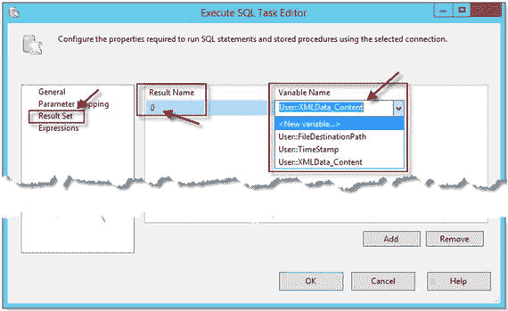

**图 3-9. 显示结果集菜单配置**

执行 SQL 任务“获取 XML 内容”没有设置表达式。因此，按“确定”完成任务配置。

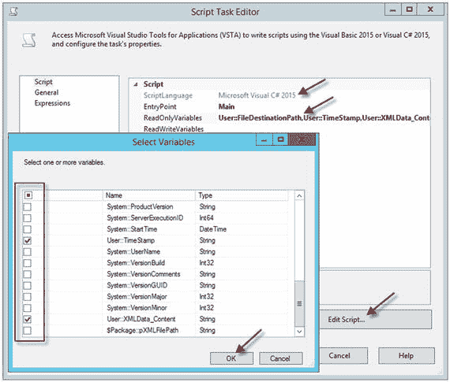

**图 3-12. 显示脚本任务管理器属性**

## 显示如何为变量设置表达式

下一步是为 `TimeStamp` 变量设置表达式。在真实的生产环境中，大多数 XML 文件名都应包含时间戳。时间戳有多种格式选项，应根据客户或业务需求选择最合适的格式。例如，我见过最常实现的格式是 `yyyyMMdd_HHmmss`。对于这个值，SSIS 包必须使用不同于 T-SQL 甚至 .NET 应用程序的语法。例如，清单 3-3 演示了用于获取日期时间戳的 SSIS 语法。

```csharp
(DT_STR, 4, 1252) DATEPART("yyyy", GETDATE()) +
RIGHT("0" + (DT_STR, 2, 1252) DATEPART("mm", GETDATE()),2) +
RIGHT("0" + (DT_STR, 2, 1252) DATEPART("dd", GETDATE()),2)  + "_" +
RIGHT("0" + (DT_STR, 2, 1252) DATEPART("hh", GETDATE()),2)  +
RIGHT("0" + (DT_STR, 2, 1252) DATEPART("mi", GETDATE()),2)  +
RIGHT("0" + (DT_STR, 2, 1252) DATEPART("ss", GETDATE()),2)
```

**清单 3-3. 显示 SSIS 语法**

要设置变量表达式：

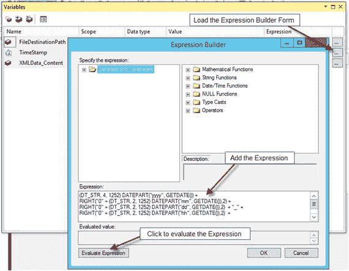

**图 3-10. 显示如何为变量设置表达式**

*   右键单击包字段。从弹出菜单中选择“变量”。
*   单击“表达式”部分中的变量按钮以加载“表达式生成器”窗体。
*   将清单 3-3 中的代码放入“表达式”文本框。
*   单击“计算表达式”按钮以验证表达式代码。
*   单击“确定”按钮以完成设置。图 3-10 说明了如何为变量设置表达式。

## 显示脚本任务管理器属性

脚本任务“创建 XML 文件”，顾名思义，将 XML 文件写入目标文件路径，该路径通过 SSIS 包的 `FileDestinationPath` 变量分配，该变量具有公共接口，在包外部可见。脚本任务是一个编程模块，开发人员可以在其中使用 C# 和 VB.NET 语言编写实现功能的代码，这使得脚本任务在 SQL Server 开发人员中非常受欢迎。然而，脚本任务可以简化并扩展 SSIS 包的功能。对于脚本任务“创建 XML 文件”，需要使用几行代码来完成该过程。要配置该任务：

*   从工具箱中将“脚本任务”拖到开发区域。
*   将名称更改为“创建 XML 文件”。
*   将“获取 XML 内容”任务与“创建 XML 文件”任务链接起来。单击“获取 XML 内容”任务，抓住绿色箭头，拖动到“创建 XML 文件”任务上，然后释放鼠标。这将在两个任务之间创建一个优先级约束（此包不需要配置优先级约束）。参见图 3-11，说明了优先级约束的初始化。

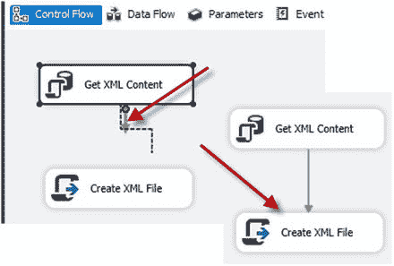

**图 3-11. 在任务之间创建优先级约束**

*   要加载脚本任务管理器，请双击“创建 XML 文件”任务。
*   默认情况下，脚本任务管理器的 `ScriptLanguage` 设置为 `Microsoft Visual C# 2015`（Microsoft Visual Basic 2015 是另一个选项；但是，本示例将使用 C#），并且在脚本任务编辑器中 `EntryPoint` 属性设置为 `“Main”`（脚本首先执行的函数名）。
*   此任务中的变量无需更改。因此，单击 `ReadOnlyVariables` 属性以将变量绑定到任务。在属性的右侧，单击按钮以加载包变量列表。在变量 `User::FileDestinationPath`、`User::TimeStamp`、`User::XMLData_Content` 旁边放置一个勾选标记，然后单击“确定”。
*   单击“编辑脚本…”按钮以加载编程模块。图 3-12 说明了脚本任务管理器属性。

**提示**

在单击“编辑脚本…”按钮之前，请高亮显示并复制所有已选择的变量。您稍后在代码模块中将需要它们。另外，请记住，在代码中引用变量名时，它们是区分大小写的。

当脚本编辑器窗口加载后，转到 `Main()` 函数。默认情况下，`Main()` 包含清单 3-4 中所示的代码。

```csharp
public void Main()
{
    // TODO: Add your code here
    Dts.TaskResult = (int)ScriptResults.Success;
}
```

**清单 3-4. 显示 Main() 函数的默认代码**

首先，将值 `“TODO: Add your code here”` 替换为已保存的变量列表。保留 `“//”`，因为它表示注释。接下来，声明两个字符串变量并重新分配包变量的值（使用您保存的变量引用）。`Main()` 函数变量 `strFilePath` 的结果将是 XML 文件路径；因此，包变量 `FileDestinationPath` 被硬编码为 `“Categories_”` 加上包变量 `TimeStamp` 和 `“.xml”` 作为文件扩展名，指示 XML 文件的目标路径。

`Main()` 函数的第二部分实际将 XML 文件写入存储。我们需要创建一个 `StreamWriter` 对象的实例。`StreamWriter` 类属于 `System.IO` 命名空间，该命名空间不是编程模块的默认命名空间的一部分，这意味着我们有两种选择：在代码中添加 `“using System.IO;”` 语句，或者使用 `System.IO` 命名空间作为完全限定符来引用 `StreamWriter` 类。因此，我们只需要一行代码来实例化 `StreamWriter` 类。在下面的例子中，我们将在 `Main()` 函数的代码中使用第二个选项。清单 3-5 中的代码演示了用于写入文件的 C# 代码。

```csharp
public void Main()
{
    // User::FileDestinationPath,User::TimeStamp,User::XMLData_Content
    string strFilePath = Dts.Variables["User::FileDestinationPath"].Value.ToString() + @"\\Categories_" + Dts.Variables["User::TimeStamp"].Value.ToString() + ".xml";
    string strXML = Dts.Variables["User::XMLData_Content"].Value.ToString();
    System.IO.StreamWriter file = new System.IO.StreamWriter(strFilePath);
    file.Write(strXML);
    file.Close();
    Dts.TaskResult = (int)ScriptResults.Success;
}
```

**清单 3-5. 用于写入 XML 文件的函数编码**

要完成脚本任务，请保存并关闭脚本编辑器窗口。单击脚本任务的“确定”按钮。您的 SSIS 包现在可以进行测试了。

## 测试 SSIS 包

要测试 SSIS 包，请按“开始”按钮。当 SSIS 成功完成时，每个任务上都会显示带有复选标记的绿色圆圈。图 3-13 说明了 SSIS 包成功完成的情况。

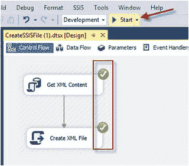

**图 3-13. 测试 SSIS 包**


要停止 SSIS 包，请按红色方块按钮，或单击包底部的“Package execution completed with success”链接。图 3-14 说明了停止包的选项。

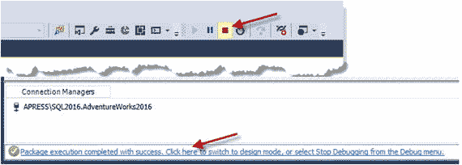

图 3-14. 显示切换包到设计模式的选项

至此，SSIS 包开发完成，XML 文件已在指定目标文件夹 `C:\TEMP` 中创建。

### 工作原理

SSIS 包 `Get XML Content` 中的 `Execute SQL Task` 向 SQL Server 提交查询。`Connection Manager` 提供对 SQL Server 实例和数据库名称的引用，必要时还包括连接凭据。查询结果被赋值给包级变量 `XMLData_Content`。`TimeStamp` 变量的表达式计算日期和时间，以提供唯一性并防止文件冲突。

`Create XML File` `Script Task` 执行 C# 代码，将 XML 结果写入文件。包变量提供文件内容和 XML 文件路径。

## 3-3. 从存储过程加载 XML

### 问题

你想利用 T-SQL 从一个或多个源位置读取 XML 文件。

### 解决方案

SQL Server 能够读取 XML 文件内容并将 XML 写入表中。将文件写入存储与从存储将 XML 数据写入表（加载 XML）的机制是不同的。当文件写入存储时，我们处理的是每个文件一个 XML 输出。然而，当加载文件时，源位置可能有一个或多个文件。因此，T-SQL 代码需要解决以下问题：

*   获取符合特定条件的文件名；例如，所有扩展名为 `.xml` 的文件。
*   访问每个文件并读取文件内容。
*   将文件内容加载（`INSERT`）到表中。

代码清单 3-6 演示了此问题的解决方案。

```sql
CREATE PROCEDURE dbo.usp_LoadXMLFromFile
@FilePath nvarchar(100)
AS
BEGIN
SET NOCOUNT ON;
-- Prepare log table
DECLARE @cmd TABLE
(
name NVARCHAR(35),
minimum INT,
maximum INT,
config_value INT,
run_value INT
);
DECLARE @run_value        INT;
-- Save original configuration set
INSERT @cmd
(
name,
minimum,
maximum,
config_value,
run_value
)
EXEC sp_configure 'xp_cmdshell';
SELECT @run_value = run_value
FROM @cmd;
IF @run_value = 0
BEGIN
-- Enable xp_cmdshell
EXEC sp_configure 'xp_cmdshell', 1;
RECONFIGURE;
END;
IF NOT EXISTS
(
SELECT *
FROM sys.objects
WHERE object_id = OBJECT_ID(N'[dbo].[_XML]') AND type in (N'U')
)
CREATE TABLE dbo._XML
(
ID INT NOT NULL IDENTITY(1,1) PRIMARY KEY,
XMLFileName NVARCHAR(300),
XML_LOAD XML,
Created DATETIME
)
ELSE
TRUNCATE TABLE dbo._XML;
DECLARE @DOS NVARCHAR(300) = N'',
@DirBaseLocation NVARCHAR(500),
@FileName NVARCHAR(300),
@SQL NVARCHAR(1000) = N'';
DECLARE @files TABLE
(
tID INT IDENTITY(1,1) NOT NULL PRIMARY KEY,
XMLFile NVARCHAR(300)
);
-- Verify that last character is \
SET @DirBaseLocation = IIF(RIGHT(@FilePath, 1) = '\', @FilePath, @FilePath + '\');
SET @DOS = 'dir /B /O:-D ' + @DirBaseLocation;
INSERT @files
(
XMLFile
)
EXEC master..xp_cmdshell @DOS;
IF @run_value = 0
BEGIN
-- Disable xp_cmdshell
EXECUTE sp_configure 'xp_cmdshell', 0;
RECONFIGURE;
END;
DECLARE cur CURSOR
FOR          SELECT XMLFile
FROM @files
WHERE XMLFile like '%.xml';
OPEN cur;
FETCH NEXT
FROM cur
INTO @FileName;
WHILE @@FETCH_STATUS = 0
BEGIN
BEGIN TRY
SET @SQL = 'INSERT INTO _XML SELECT ''' + @DirBaseLocation + @FileName
+ ''', X, GETDATE()  FROM OPENROWSET(BULK N''' + @DirBaseLocation + @FileName
+ ''', SINGLE_BLOB) as tempXML(X)';
EXECUTE sp_executesql @SQL;
FETCH NEXT
FROM cur
INTO @FileName;
END TRY
BEGIN CATCH
SELECT @SQL, ERROR_MESSAGE();
END CATCH
END;
CLOSE cur;
DEALLOCATE cur;
SET NOCOUNT OFF;
END;
GO
```
代码清单 3-6. 演示存储过程 usp_LoadXMLFromFile


### 工作原理

存储过程 `usp_LoadXMLFromFile`（如清单 3-6 所示）提供了一种从一个或多个文件加载 XML 数据的解决方案。该存储过程有一个输入参数 `@FilePath`，数据类型为 `nvarchar(100)`。此参数用于指定 XML 源文件的位置。

1.  启用/禁用扩展存储过程 `xp_cmdshell` 的机制在配方 3-1 中有描述。此过程对于存储过程 `usp_LoadXMLFromFile` 是相同的。
2.  我们需要确保目标表 `_XML` 存在。如果数据库中没有该表，则需要创建它。如果表已存在，根据业务需求，可以截断数据或保留历史数据。以下示例展示了如何截断表：

    ```
    IF NOT EXISTS (SELECT * FROM sys.objects
    WHERE object_id = OBJECT_ID(N'[dbo].[_XML]') AND type in (N'U'))
    CREATE TABLE _XML
    (
    ID int IDENTITY(1,1) PRIMARY KEY
    ,XMLFileName nvarchar(300)
    ,XML_LOAD XML, Created datetime
    )
    ELSE
    TRUNCATE TABLE _XML
    ```

3.  为处理需求声明多个变量：

    ```
    @DOS nvarchar(300) = '' – 准备 DOS 命令。
    @DirBaseLocation nvarchar(500) – 验证并格式化源路径。
    @FileName nvarchar(300) – 用于获取文件名。
    @SQL nvarchar(1000) = '' – 准备用于 INSERT 过程的 SQL。
    @files TABLE – 用于从源位置获取所有文件名。
    ```

4.  验证最后一个字符是反斜杠 (`\`)。我们需要确保存储过程接收到以 `\` 结尾的有效路径。如果缺少最后一个反斜杠，则需要向提供的路径添加一个反斜杠。例如：

    ```
    IIF(RIGHT(@FilePath, 1) = '\', @FilePath, @FilePath + '\');
    ```

    `IIF` 函数由 SQL Server 2012 版引入。该函数有三个参数：
    1.  条件 - `RIGHT(@FilePath, 1) = '\'` 用于检查最后一个字符是否为 `\`。
    2.  真值结果 - 当找到该字符时，不执行任何操作。
    3.  假值结果 - 当未找到时，向参数添加 `\`。
5.  准备 Windows 命令解释器命令，以从源位置获取所有文件的列表。Windows 命令解释器命令 `dir` 返回指定路径下的所有文件和子目录。但是，`dir` 命令除了文件名外还返回其他信息。`"/B"` 表示使用裸格式（仅文件名），`"/O:-D"` 指定按创建日期降序排序。

    ```
    SET @DOS = 'dir /B /O:-D ' + @DirBaseLocation  ;
    ```

6.  扩展存储过程 `xp_cmdshell` 执行 Windows 命令解释器命令，并将源位置的所有可用文件插入。

    ```
    INSERT @files
    EXEC master..xp_cmdshell @DOS;
    ```

7.  接下来，我们需要遍历扩展名为 `".xml"` 的每个文件。这可以通过为表变量声明游标并在游标上建立循环来完成。

    ```
    DECLARE cur CURSOR
    FOR     SELECT XMLFile
    FROM @files
    WHERE XMLFile like '%.xml';
    OPEN cur;
    FETCH NEXT
    FROM cur
    INTO @FileName;
    WHILE @@FETCH_STATUS = 0
    ```

8.  在 `WHILE` 循环内，我们需要为每个文件组合 `INSERT` 语句，该语句读取文件内容并将 XML 插入 `_XML` 表。例如：

    ```
    INSERT INTO _XML
    SELECT 'C:\TEMP\Categories.xml', X, GETDATE()
    FROM OPENROWSET(BULK N'C:\TEMP\Categories.xml', SINGLE_BLOB) AS tempXML(X);
    ```

    上述 SQL 代码的关键是 `OPENROWSET()` 函数。`BULK` 选项指定我们将从源文件中批量读取所有内容。然后是 `BULK` 后面的一个空格，接着是文件位置。`SINGLE_BLOB` 选项指定文件内容作为单列返回，数据类型为 `VARBINARY(MAX)`，这非常适合 XML 数据。别名语法 `AS tempXML(X)` 必须是 `table(column)` 格式：
    *   `tempXML` – 表别名
    *   `X` – 列别名
    其他 `OPENROWSET` 选项 `SINGLE_CLOB`（返回 `varchar(max)`）和 `SINGLE_NCLOB`（返回 `nvarchar(max)`）不适合 XML 导入数据，因为只有 `SINGLE_BLOB` 支持所有 Windows 编码转换。
9.  系统存储过程 `sp_executesql` 执行组合好的 SQL。

    ```
    EXECUTE sp_executesql @SQL ;
    ```

10. 错误处理程序允许进程运行，并返回有问题的 SQL 的错误详情。可选地，您可以创建一个表来记录错误。运行存储过程的代码示例：

    ```
    EXEC dbo.usp_LoadXMLFromFile 'C:\Temp'
    ```

但是，缺点是您将丢失错误处理程序日志记录，并且如果正在加载的其中一个文件失败，则该文件将不会被加载。

## 3-4. 从 SSIS 包加载 XML

### 问题

您希望使用一个 SSIS ETL 包将一个或多个 XML 文件加载到数据库中。


### 解决方案

SSIS 提供了一套全面的工具，用于从指定目录加载 XML 文件。

一个用于加载多个 XML 文件的 SSIS 包，比配方 3-2 “从 SSIS 包创建 XML” 中展示的写入 XML 文件的 SSIS 包更复杂。`LoadXMLFromFile` 这个 SSIS 包是基于以下业务规则创建的：

1.  检查源目录中是否存在 `.xml` 文件。
2.  如果在源位置未找到文件，则停止包执行。
3.  如果找到匹配的文件，则截断目标表。
4.  从所有可用的 `.xml` 扩展名文件加载 XML 内容。
5.  将所有已处理的文件移动到 Archive 文件夹。

`LoadXMLFromFile` SSIS 包由以下部分组成：

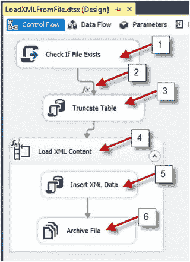
*图 3-15. 展示设计模式下的 `LoadXMLFromFile` SSIS 包*

1.  一个“Check If File Exists”脚本任务，它使用 C# 代码来验证源位置是否存在任何 XML 文件。
2.  优先级约束（在“Check If File Exists”和“Truncate Table”之间的绿色箭头）公式有条件地验证 `FlagIsFileExist` 变量，并扮演“停止”或“继续”的角色。
3.  一个执行 SQL 任务“Truncate Table”，有条件地执行 T-SQL 代码来创建或截断表。
4.  “Load XML Content” 循环容器遍历 XML 文件。
5.  “Insert XML Data” 执行 SQL 任务执行一条 T-SQL 语句，将 XML 文件内容插入到 `_XML` 表中。
6.  “Archive File” 文件系统任务将 XML 文件移动到 Archive 文件夹。图 3-15 展示了该 SSIS 包。

创建了以下 SSIS 包变量以提供包的灵活性和功能：

1.  `ArchiveFile` – 为文件系统任务“Archive File”提供 `DestinationVariable` 属性。使用表达式 `@[User::ArchiveLocation] + @[User::FileName]` 创建。
2.  `ArchiveLocation` – 提供存档文件夹的目标路径。
3.  `FileName` – 映射到循环容器“Load XML Content”。从每次迭代中获取 XML 文件名。
4.  `FlagIsFileExist` – 被赋予 `true` 或 `false` 值，并控制优先级约束表达式。
5.  `SourceFile` – 为文件系统任务“Archive File”提供 `SourceVariable`。创建表达式 `@[User::SourceLocation] + @[User::FileName]`。
6.  `SourceLocation` – 提供源文件夹的源路径。
7.  `SQLScript` – 组合 T-SQL 以将 XML 内容插入到 `_XML` 表中，使用以下表达式：

```sql
"INSERT INTO _XML
SELECT '" + @[User::SourceLocation]  + @[User::FileName] + "', X, GETDATE()
FROM OPENROWSET(BULK N'" + @[User::SourceLocation]  + @[User::FileName] + "', SINGLE_BLOB) as tempXML(X)"
```

图 3-16 展示了变量列表。

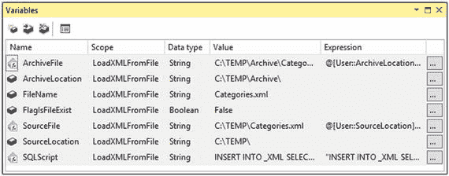
*图 3-16. 展示 SSIS 包变量列表*

现在我们将讨论任务的配置。在本教程中，我不会深入太多细节，因为配方 3-2 已经详细涵盖了这个主题。

1.  **脚本任务 “Check If File Exists”。** 这次，脚本任务检查源位置是否有扩展名为 `.xml` 的文件。没有其他任务能提供此功能。两个变量被映射到该任务：

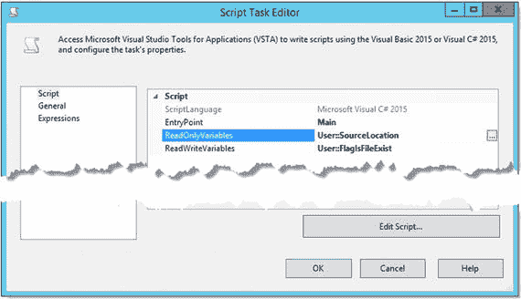
*图 3-17. 演示脚本任务变量映射*
    *   `SourceLocation` – `ReadOnlyVariable`。
    *   `FlagIsFileExist` – `ReadWriteVariable`。代码可以修改该变量值。图 3-17 展示了变量。点击 `Edit Script` 命令按钮。将以下代码添加到 `Main()` 函数中：

```csharp
    Dts.Variables["User::FlagIsFileExist"].Value =              (System.IO.Directory.GetFiles(Dts.Variables["User::SourceLocation"].Value.ToString(), "*.xml").Length != 0);
```

保存然后关闭代码窗口。点击 `OK` 命令按钮完成设置。
2.  **优先级约束（在 “Check If File Exists” 和 “Truncate Table” 之间的绿色箭头）。** 要打开优先级约束编辑器，请双击箭头。在优先级约束编辑器中：
    *   选择 `Evaluation operation`: `Expression`
    *   对于 `Expression` 属性，键入表达式：`@[User::FlagIsFileExist] == true`
    点击 `OK` 保存设置。图 3-18 展示了优先级约束编辑器。

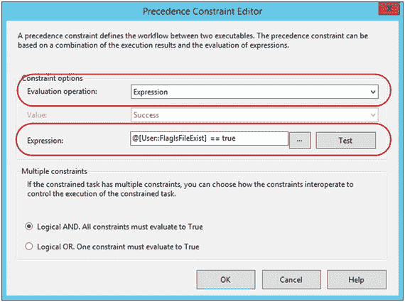
*图 3-18. 展示优先级约束编辑器设置*
3.  **执行 SQL 任务 “Truncate Table”。** 在 `General` 菜单上打开执行 SQL 任务编辑器：
    *   对于 `Connection` 属性，添加一个新连接。指定目标服务器和数据库。
    *   将以下代码添加到 `SQLStatement` 属性：

```sql
    IF NOT EXISTS (SELECT * FROM sys.objects
    WHERE object_id = OBJECT_ID(N'[dbo].[_XML]') AND type in (N'U'))
    CREATE TABLE _XML
    (
    ID int IDENTITY(1,1) PRIMARY KEY
    ,XMLFileName nvarchar(300)
    ,XML_LOAD XML, Created datetime
    )
    ELSE
    TRUNCATE TABLE _XML
```

点击 `OK` 完成设置。图 3-19 展示了执行 SQL 任务编辑器。

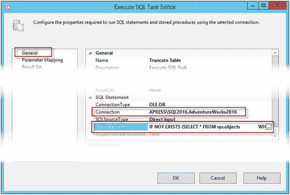
*图 3-19. 展示执行 SQL 任务设置*
4.  **“Load XML Content” 循环容器。** 打开循环容器编辑器并点击 `Collect` 菜单：

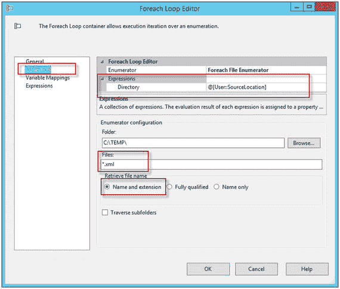
*图 3-21. 演示收集菜单设置*
    *   选择 `An expression`，然后加载表达式属性编辑器。
    *   选择 `Directory` 属性并添加表达式：`@[User::SourceLocation]`。
    *   点击 `OK` 完成设置。图 3-20 展示了表达式属性编辑器。表达式值反映在 `Folder` 属性中。

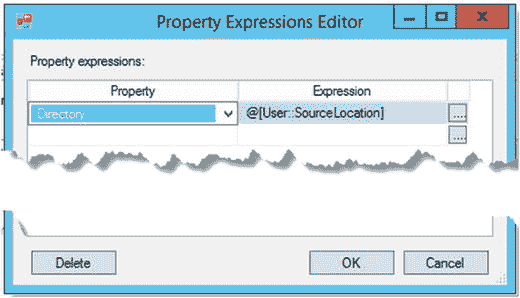
*图 3-20. 展示表达式属性编辑器*
    *   在 `Files` 属性中，键入目标文件名模式，即 Windows 文件名模式。它在模式中使用 Windows 文件名通配符。由于我们搜索所有 XML 文件进行迭代，因此使用扩展名模式 `*.xml` 来过滤掉除 XML 文件外的所有文件。
    *   对于 `Retrieve the file name` 属性，选择 `Name and extension`。图 3-21 展示了收集菜单。
5.  点击 `Variable Mapping` 菜单。从下拉列表中选择 `FileName` 变量。图 3-22 展示了变量映射菜单。点击 `OK` 完成设置。

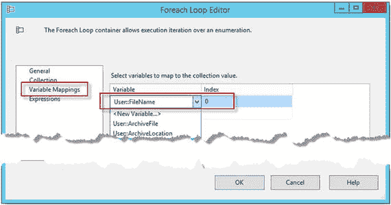
*图 3-22. 映射 FileName 变量*
6.  **“Insert XML Data” 执行 SQL 任务。** 打开执行 SQL 任务编辑器。默认将显示 `General` 选项卡。
    *   选择先前在上一个执行 SQL 任务中使用的现有连接。
    *   在 `SQLStatement` 属性中，键入 `exec sp_executesql ?`。问号指定该任务将有一个输入变量作为参数。图 3-23 展示了 `General` 菜单。

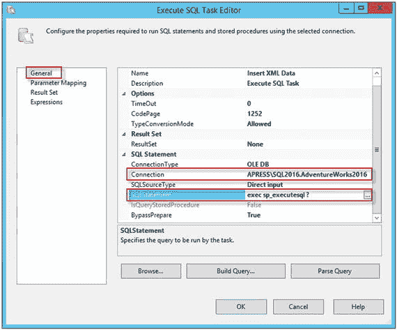
*图 3-23. 展示常规菜单设置*
点击 `Parameter Mapping` 菜单。

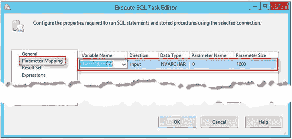
*图 3-24.*


