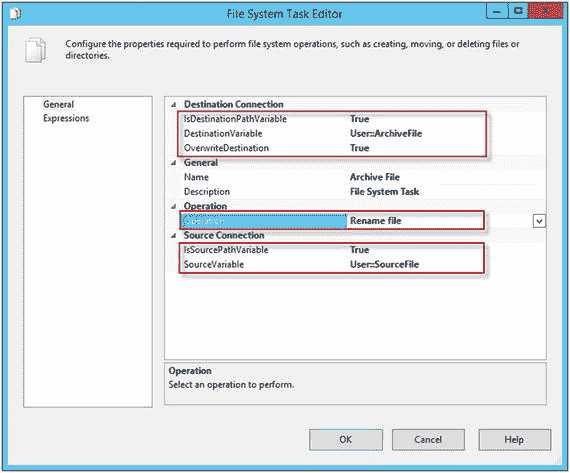
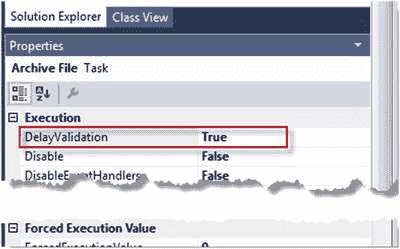
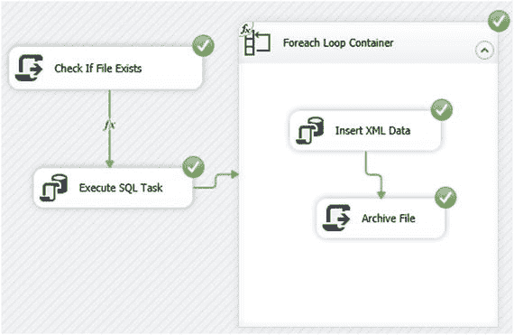
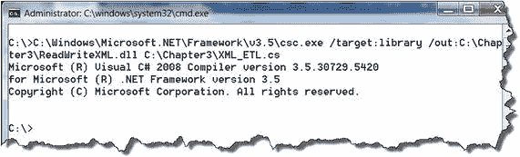
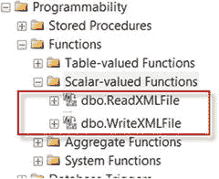
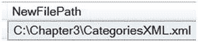

# 显示参数映射菜单设置

*   从下拉列表中选择 `User::SQLScript` 变量。该 SQLScript 变量通过表达式公式组合 `INSERT` T-SQL 语句。当 Foreach Loop Container “Load XML Content” 将文件名赋给 `FileName` 变量时，`SQLScript` 表达式公式会在遍历指定目录中所有文件时不断重组新的 T-SQL 代码，如下例所示：

    ```
    INSERT INTO _XML
    SELECT 'C:\TEMP\Categories.xml', X, GETDATE()
    FROM OPENROWSET(BULK N'C:\TEMP\Categories.xml', SINGLE_BLOB) as tempXML(X)
    ```

*   对于 `Direction` 属性，选择 `Input`。
*   对于 `Data Type` 属性，选择 `NVARCHAR`。
*   对于 `Parameter Name` 属性，输入 `0`。
*   对于 `Parameter Size` 属性，输入 `1000`。图 3-24 说明了参数映射菜单。
*   单击 `OK` 完成设置。

## 7. 文件系统任务 “归档文件”：打开文件系统任务编辑器。
在“常规”菜单上：



图 3-25. 显示文件系统任务设置

*   将 `Operation` 属性设置为 `"重命名文件"`。
*   将 `IsSourcePathVariable` 属性设置为 `"True"`。
*   对于 `SourceVariable` 属性，选择 `"User::SourceFile"` 变量。
*   将 `IsDestinationPathVariable` 属性设置为 `"True"`。
*   对于 `DestinationVariable` 属性，选择 `"User::ArchiveFile"` 变量。
*   将 `OverwriteDestination` 属性设置为 `"True"`。
*   单击 `OK` 完成设置。图 3-25 说明了文件系统任务编辑器。

我建议将文件系统任务属性（位于 SSIS IDE 右侧）`DelayValidation` 设置为 `True`，以防止在包加载时，默认源文件名在源位置不存在而导致错误。图 3-26 说明了此属性。



图 3-26. 显示 `DelayValidation` 属性的设置

恭喜，SSIS 包 `LoadXMLFromFile` 配置完成！请务必保存您的工作。图 3-27 显示您已成功完成的 SSIS 包。



图 3-27. 显示成功的 SSIS 包

### 它是如何工作的
SSIS 包通过检查由 `SourceLocation` 变量指示的源位置中具有 `.xml` 扩展名的文件来启动流程。默认值可以在包外部修改。代码如下：

```
Dts.Variables["User::FlagIsFileExist"].Value = (System.IO.Directory.GetFiles(Dts.Variables["User::SourceLocation"].Value.ToString(), "*.xml").Length != 0);
```
返回文件计数（如果有）。比较条件 `!= 0` 返回布尔值：当计数大于 0 时为 `true`；当计数等于 0 时为 `false`。结果值赋给 `FlagIsFileExist` 变量。

在“优先约束”中的表达式 `@[User::FlagIsFileExist] == true` 有条件地检查 `User::FlagIsFileExist` 变量值。当表达式返回 `true` 时，包转到下一个任务。当表达式返回否定结果 (`false`) 时，包执行终止。

“截断表”执行 SQL 任务删除旧值并为新的行集准备 `_XML` 表。

随着包的进行，Foreach 循环容器配置为检查源位置并检索所有具有 `.xml` 扩展名的可用文件。Foreach 循环容器遍历文件名列表，并在每次迭代中将每个文件名赋给 `User::FileName` 变量。

变量 `SQLScript` 的表达式公式在 `FileName` 变量每次接收新值时更改 `INSERT` T-SQL 语句。“插入 XML 数据”执行 SQL 任务将 `INSERT` T-SQL 语句发送到 SQL Server 实例。

文件系统任务将处理后的文件从源位置发送到归档位置。

文件系统任务的一个替代方案是脚本任务，这是我的个人偏好，适用于那些对脚本任务中使用的 C# 编程语言感到不舒服的 DBA。因此，文件系统任务是一个固定的任务，其配置不涉及代码。对于那些希望对移动文件过程有更多控制的人，我建议实现脚本任务而不是文件系统任务。要配置脚本任务，请完成以下步骤：
*   将脚本任务拖放到 Foreach 循环容器 “Load XML Content” 内。
*   双击脚本任务以打开脚本任务编辑器。
*   对于 `ScriptLanguage` 属性，选择 `Microsoft Visual C#`。
*   对于 `ReadOnlyVariables` 属性，添加变量 `User::ArchiveFile` 和 `User::SourceFile`（高亮并复制变量名称）。
*   单击 `编辑脚本…` 按钮。
*   转到 `Main()` 函数并添加以下代码：

    ```
    string from = Dts.Variables["User::SourceFile"].Value.ToString();
    string to = Dts.Variables["User::ArchiveFile"].Value.ToString();
    System.IO.File.Move(from, to); // 移动文件
    ```

*   保存并关闭 C# Visual Studio。
*   单击 `OK` 按钮完成配置。

正如您从这个示例中看到的，通过少量编码，您现在可以完全控制将文件从源位置移动到归档目录。

SSIS 包可以通过 SQL Server Agent 作业部署，该作业将按自定义计划自动运行。也可以从存储过程中执行该包。清单 3-7 演示了如何从存储过程执行 SSIS 包。

```
DECLARE @SourceLocation VARCHAR(200) = 'C:\\TEMP\\';
DECLARE @ArchiveLocation VARCHAR(200) = 'C:\\TEMP\\Archive\\';
SET @SQLQuery = 'DTEXEC /FILE ^"C:\SQL2016\Chapter3\CreateXMLFile\CreateXMLFile\LoadXMLFromFile.dtsx^" '
SET @SQLQuery = @SQLQuery + ' /SET \Package.Variables[SourceLocation].Value;^"'+ @SourceLocation + '^"
/SET \Package.Variables[ArchiveLocation].Value;^"'+ @ArchiveLocation + '^"';
EXEC master..xp_cmdshell @SQLQuery ;
```
清单 3-7. 显示从存储过程执行 SSIS 包的代码

## 3-5. 实现 CLR 解决方案
### 问题
您希望创建 SQL Server 对象来写入和读取 XML 文件，这些对象不实现扩展存储过程并提供更安全的功能。

### 解决方案

CLR（公共语言运行时）函数能够扩展 T-SQL 功能，其操作方式与 SQL Server 用户定义对象（对于本解决方案，即用户定义函数）相同。然而，CLR 对象需要使用 `dll`（动态链接库）文件格式（扩展名为 `.dll`），这是 Windows 程序代码和过程所使用的格式。本解决方案的代码演示了如何使用 Visual Studio C#。代码清单 3-8 展示了该 C# 文件的代码。

```csharp
using System;
using System.Data;
using System.Data.SqlClient;
using System.Data.SqlTypes;
using Microsoft.SqlServer.Server;
using System.IO;
public partial class XMLFileETL
{
    [SqlFunction]
    public static SqlString WriteXMLFile(SqlString XMLContent,
        SqlString DirPath,
        SqlString FileName,
        SqlBoolean DateStamp)
    {
        /*  参数:
            XMLContent: 包含 XML 文档。
            DirPath: 要写入的目录路径。
            FileName: 文件名。
            DateStamp: 决定是否为文件添加日期时间戳。
        */
        try
        {
            string strXMLFile = "";
            // 检查输入参数是否为 NULL。
            if (!XMLContent.IsNull &&
                !DirPath.IsNull &&
                !FileName.IsNull)
            {
                // 构建文件路径字符串
                string strStamp = (DateStamp) ? "_" + DateTime.Now.ToString("yyyyMMdd_HHmmss") : "";
                strXMLFile = DirPath.Value + "\\" + FileName.Value + strStamp + ".xml";
                // 初始化 StreamWriter 类的新实例
                using (var newFile = new StreamWriter(strXMLFile.Value))
                {
                    // 写入文件。
                    newFile.WriteLine(XMLContent);
                }
                // 成功时返回文件路径。
                return strXMLFile;
            }
            else
                // 当任何输入值为 NULL 时返回警告。
                return "Input parameters with NULL detected";
        }
        catch (Exception ex)
        {
            // 出错时返回 null。
            return ex.Message.ToString();
        }
    }

    [SqlFunction]
    public static SqlString ReadXMLFile(SqlString FilePath)
    {
        // 参数:
        // FilePath: XML 文件的路径。
        try
        {
            // 声明局部变量
            string fileContent = "";
            // 检查参数是否为 null。
            if (!FilePath.IsNull)
            {
                // 为指定路径初始化 StreamReader 类的新实例。
                var fileStream = new FileStream(FilePath.Value, FileMode.Open, FileAccess.Read);
                using (var streamReader = new StreamReader(fileStream))
                {
                    fileContent = streamReader.ReadToEnd();
                }
            }
            // 返回 XML 文档
            return fileContent;
        }
        catch (Exception ex)
        {
            // 出错时发送异常消息。
            return ex.Message.ToString();
        }
    }
};
```

*代码清单 3-8. 创建 `WriteXMLFile` 和 `ReadXMLFile` SQL Server CLR 函数*

#### 注册 C# 代码文件

注册 C# 代码文件的步骤：

*   创建名为 "`第 3 章`" 的文件夹。
*   将 `XML_ETL.cs` 文件（可在本书代码示例中找到）保存到 "`第 3 章`" 文件夹中。
*   打开 Windows 命令行 (`cmd.exe`)，然后运行代码清单 3-9 中所示的命令行。`cmd.exe` 的输出如图 3-28 所示。



*图 3-28. 显示命令行结果*

```bash
C:\Windows\Microsoft.NET\Framework\v3.5\csc.exe /target:library /out:C:\Chapter3\ReadWriteXML.dll C:\Chapter3\XML_ETL.cs
```

*代码清单 3-9. 展示用于注册 `dll` 的命令行。*

#### 使用 T-SQL 进行配置

代码清单 3-10 展示了用于配置服务器和数据库的 T-SQL 解决方案。创建的标量函数如图 3-29 所示。



*图 3-29. 显示已创建的 CLR 函数*

```sql
-- 启用 CLR
USE master
GO
sp_configure 'clr enabled', 1;
GO
RECONFIGURE
GO
-- 配置
USE AdventureWorks
GO
ALTER DATABASE AdventureWorks SET TRUSTWORTHY ON;
GO
-- 创建程序集
CREATE ASSEMBLY ReadWriteXML
FROM 'C:\Chapter3\ReadWriteXML.dll'
WITH PERMISSION_SET = EXTERNAL_ACCESS;
GO
-- 创建函数
CREATE FUNCTION dbo.WriteXMLFile(
    @Content nvarchar(MAX),
    @DirPath nvarchar(500),
    @FileName nvarchar(100),
    @DateStamp bit)
RETURNS nvarchar(MAX) WITH EXECUTE AS CALLER
AS
EXTERNAL NAME ReadWriteXML.XMLFileETL.WriteXMLFile;
GO
CREATE FUNCTION dbo.ReadXMLFile(@FilePath nvarchar(500))
RETURNS nvarchar(MAX) WITH EXECUTE AS CALLER
AS
EXTERNAL NAME ReadWriteXML.XMLFileETL.ReadXMLFile;
GO
```

*代码清单 3-10. 创建 CLR 函数*


### 工作原理

CLR 项目结合了 XML 文件的读写功能。将多个 C# 函数放在一个类中比为每个函数创建一个类更实用。因此，读写功能都封装在一个 C# 类对象中。要创建 C# 文件，需要使用 MS Visual Studio C# 或 VB 工具。如何创建 Visual Studio 项目超出了本书的讨论范围。有许多资源详细介绍了如何创建 CLR 项目。

C# 代码的顶部列出了识别代码函数和方法所必需的命名空间或库。`using` 方法向类添加一个命名空间。当启动一个新项目时，类会列出默认的命名空间。包含文件读写功能的 `System.IO` 命名空间不在默认列表中。因此，你必须手动添加 `System.IO` 命名空间。CLR 类必须有一个部分类（partial type）。过程属性（procedure attribute）指定了 SQL Server 目标对象。例如：用户定义函数使用 `[SQLFunction]` 属性，存储过程使用 `[SQLProcedure]` 属性，等等。CLR 过程类型必须是 `public static`。

`WriteXMLFile` 函数在成功时返回创建的文件完整路径，在失败或检测到 `NULL` 参数值时返回错误消息。

该函数有四个输入参数：

*   `XMLContent` – 必需，数据类型 `SQLString`，包含 XML 文档。
*   `DirPath` – 必需，数据类型 `SQLString`，要写入的目录路径。
*   `FileName` – 必需，数据类型 `SQLString`，文件名。
*   `DateStamp` – 必需，数据类型 `SQLBoolean`，决定是否向文件添加日期时间戳。

验证输入参数后，下一步是构建文件路径。首先，参数 `DateStamp` 需要检查日期时间戳是否会是文件名的一部分，然后连接参数和变量：

```csharp
string strStamp = (DateStamp) ? "_"
+ DateTime.Now.ToString("yyyyMMdd_HHmmss") : "";
strXMLFile = DirPath.Value + "\\" + FileName.Value + strStamp + ".xml";
```

最后一步——使用提供的路径写入 XML 文件：

```csharp
using (var newFile = new StreamWriter(strXMLFile.Value))
{
    newFile.WriteLine(XMLContent);
}
```

`ReadXMLFile` 函数在成功时返回 XML 文件内容，在失败时返回错误消息。该函数有一个参数：

*   `FilePath` – 必需，数据类型 `SQLString`，XML 文件的路径。

当 `FileStream` 函数建立与 XML 文件的连接后，`StreamReader` 函数会读取整个文件，然后 `ReadXMLFile` 函数返回 XML 文档：

```csharp
var fileStream = new FileStream(FilePath.Value, FileMode.Open, FileAccess.Read);
using (var streamReader = new StreamReader(fileStream))
{
    fileContent = streamReader.ReadToEnd();
}
return fileContent;
```

如果你使用 Visual Studio 开发 CLR 过程，那么你可以构建解决方案来创建 `dll` 文件，或者运行命令行来构建并注册 `dll` 文件：

```cmd
C:\Windows\Microsoft.NET\Framework\v3.5\csc.exe /target:library /out:C:\Chapter3\ReadWriteXML.dll C:\Chapter3\XML_ETL.cs
```

当 `dll` 文件准备就绪后，我们转到 SSMS 进行以下操作：

1.  确保启用了‘clr enabled’选项：

    ```sql
    sp_configure 'clr enabled', 1
    ```

2.  切换到用户数据库并 `SET TRUSTWORTHY ON`。
3.  创建一个程序集（assembly）以引用 `dll`：

    ```sql
    CREATE ASSEMBLY ReadWriteXML FROM
    'C:\Chapter3\ReadWriteXML.dll'
    WITH PERMISSION_SET = EXTERNAL_ACCESS
    ```

对于程序集，在指定了名称和 `dll` 文件路径后，你需要设置 `PERMISSION_SET` 参数，该参数有三个选项：

*   `SAFE` – 首选，当 `dll` 无法访问外部系统资源（例如注册表、文件、环境变量或网络）时使用。
*   `EXTERNAL_ACCESS` – `dll` 可以访问注册表、文件和环境变量。但是，这些访问不能在 SQL Server 实例之外进行。
*   `UNSAFE` – 无限制访问。

`ReadWriteXML.dll` 需要访问文件；因此，为 `ReadWriteXML` 的程序集设置了 `EXTERNAL_ACCESS` 选项。一旦创建了 `ASSEMBLY`，就可以创建函数了。例如：

```sql
CREATE FUNCTION dbo.ReadXMLFile(@FilePath nvarchar(500))
RETURNS nvarchar(MAX) WITH EXECUTE AS CALLER
AS
EXTERNAL NAME ReadWriteXML.XMLFileETL.ReadXMLFile
```

在 `CREATE FUNCTION` 部分，指定了架构和名称后，你需要列出所有参数以匹配 C# `dll` 中的函数。确保位置和数据类型相同。`RETURNS` 部分的数据类型也必须匹配。`EXTERNAL NAME` 包含三个引用，例如：

1.  `ASSEMBLY` 名称
2.  CLR 类名
3.  CLR 函数名

```sql
EXTERNAL NAME ReadWriteXML.XMLFileETL.ReadXMLFile
```

清单 3-11 演示了 `WriteXMLFile` 函数的 T_SQL 执行。结果如图 3-30 所示。



图 3-30. 显示函数结果

```sql
SELECT  dbo.WriteXMLFile(N'
<Accessories>
  <Bike Racks>
    <Product>
      <Name>Hitch Rack - 4-Bike</Name>
      <ProductNumber>RA-H123</ProductNumber>
      <ListPrice>120.0000</ListPrice>
    </Product>
  </Bike Racks>
  <Bike Stands>
    <Product>
      <Name>All-Purpose Bike Stand</Name>
      <ProductNumber>ST-1401</ProductNumber>
      <ListPrice>159.0000</ListPrice>
    </Product>
  </Bike Stands>
</Accessories>
', 'C:\Chapter3', 'CategoriesXML', 0) NewFilePath
```
清单 3-11. 执行 `WriteXMLFile` 函数

清单 3-12 演示了 `ReadXMLFile` 函数的 T_SQL 执行。结果如图 3-31 所示。


图 3-31. 显示函数结果

```sql
SELECT cast(dbo.ReadXMLFile('C:\Chapter3\CategoriesXML.xml') as xml) XMLFile
```
清单 3-12. 执行 `ReadXMLFile` 函数

CLR 过程提供了一种安全的方式来扩展 SQL Server 功能。但是，在处理 CLR 过程时，编程技能是首选。

## 本章小结

本章演示了多种解决方案，详细说明了如何将 XML 结果写入文件，以及如何从源位置加载 XML 文件（或多个文件）。请注意，这不是唯一的解决方案，因为在当今世界，此类任务可以使用其他技术完成，例如 PowerShell、.NET 应用程序（C# 或 VB.NET）等。然而，对于使用 SQL Server 的 T-SQL 代码编译 SSIS 包装包来说，这些都是优秀的解决方案。

下一章的配方将涵盖如何将 XML 文档转换为行和列，也称为“XML 分解”。

