# 4. 分解 XML

将 XML 数据转换为关系型列和行并不是一个简单的过程。`OPENXML` 函数是在 SQL Server 2000 中引入的，用于分解 XML 数据，然后在 SQL Server 2005 中通过 XPath 语言（也称为 XQuery）改进了 XML 分解。从那时起，查询 XML 数据的过程成为了一个提供结果的可靠解决方案。本章将演示如何将 XML 数据作为单个单元进行查询，并通过表的列返回检索到的数据。

## 4-1. 使用内部实体声明分解 XML

### 问题

你希望将作为参数传递给存储过程或从表中作为单个 XML 值检索出的 XML 数据，转换成行集结果。


### 解决方案

`OPEXML` 函数提供了一个全面的解决方案，用于查询分配给 `VARCHAR`、`NVARCHAR` 和 `XML` 数据类型的变量和参数中的 XML 数据。代码清单 4-1 中的 T-SQL 代码演示了该解决方案。可以在 AdventureWorks 数据库中找到一组示例数据。

```sql
DECLARE @xml nvarchar(max),
@idoc int,
@ns varchar(200) =
N'';
SELECT @xml = cast(Instructions as nvarchar(max))
FROM [Production].[ProductModel]
WHERE ProductModelID = 7;
EXECUTE sp_xml:preparedocument @idoc OUTPUT, @xml, @ns;
SELECT StepInstruction,
LaborStation,
LaborHours,
LotSize,
MachineHours,
SetupHours,
Material,
Tool
FROM OPENXML(@idoc, 'df:root/df:Location/df:step', 2)
WITH (
LaborStation INT '../@LocationID',
LaborHours REAL '../@LaborHours',
LotSize INT '../@LotSize ',
MachineHours REAL '../@MachineHours ',
SetupHours REAL '../@SetupHours ',
Material VARCHAR(100) 'df:material',
Tool VARCHAR(100) 'df:tool',
StepInstruction VARCHAR(2000) '.'
);
EXECUTE sp_xml:removedocument @idoc;
```

**代码清单 4-1.** 使用 `OPENXML` 函数分解 XML

查询输出如图 4-1 所示。

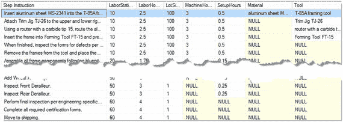

图 4-1. 显示流程输出


### 工作原理

在开始分解 XML 之前，第一步是确定 XML 结构，以及哪些元素和属性将成为结果集的一部分。这可以通过在 AdventureWorks 数据库上执行 SQL 来分析 XML 数据来完成，如代码清单 4-2 所示。

```sql
SELECT Instructions
FROM Production.ProductModel
WHERE ProductModelID = 7;
```
*代码清单 4-2. 检索单个产品模型的示例 XML 说明的查询*

XML 结果太大，无法在书页中完整显示。因此，代码清单 4-3 中的 XML 片段已为演示目的进行了格式化。

```xml
<root xmlns="http://schemas.microsoft.com/sqlserver/2004/07/adventure-works/ProductModelInstructions">
  <Adventure Works CyclesFR-210B Instructions....</Description>
  <Location LocationID="10" LaborHours="0.5" ...>
    <step>...</step>
    <step>
      <material>aluminum sheet MS-2341</material>
      <tool>T-85A framing tool</tool>
    </step>
    ...
  </Location>
</root>
```
*代码清单 4-3. 演示结果数据的 XML 片段*

## 数据准备

`<root>` 元素有一个命名空间，该命名空间必须是 `OPENXML` 函数 XML 初始化的一部分。因此，声明了几个变量。这些变量的用途如下：

1.  `@xml` (`XML`) – 从表中将 XML 数据作为单个单元检索。
2.  `@idoc` (`INT`) – 存储从 `sp_xml_preparedocument` 系统存储过程返回的文档句柄，以允许 `OPENXML` 访问 XML 数据。
3.  `@ns` (`VARCHAR`(200)) – 存储 XML 命名空间，提供给 `sp_xml_preparedocument` 系统存储过程，以及用于指定命名空间声明的参数 `xpath_namespaces`。

> **注意**
> 当 XML 具有命名空间时，无法避免该命名空间。如果在 `sp_xml_preparedocument` 系统存储过程中未声明和指定命名空间，`OPENXML` 函数将不会返回结果集。命名空间有助于避免名称冲突，并唯一标识 XML 数据中的元素和属性。

分配给 `@ns` 变量的值需要更多解释。在代码清单 4-1 中，`<root>` 元素中的命名空间声明与分配给 `@ns` 变量的那个略有不同。根元素命名空间如代码清单 4-4 所示。

```xml
xmlns="http://schemas.microsoft.com/sqlserver/2004/07/adventure-works/ProductModelInstructions"
```
*代码清单 4-4. `<root>` 元素中的命名空间声明*

示例代码中 `@ns` 变量的命名空间声明略有不同，如代码清单 4-5 所示。

```sql
@ns = 'xmlns:df="http://schemas.microsoft.com/sqlserver/2004/07/adventure-works/ProductModelInstructions"'
```
*代码清单 4-5. `@ns` 变量命名空间声明*

变量 `@ns` 的值包含一个额外的部分 `xmlns:df=…`，其中 `df`（“default”的缩写）可以指定任何别名。最常用的别名是 `ns`。该命名空间用作 `OPENXML` 函数元素的引用。简而言之，这就像在不使用模式“Production”的情况下引用 `ProductModel` 表一样。我们必须使用 `Production.ProductModel` 来提供对该表的引用；否则 SSMS 将抛出错误：“object not found”。主要区别在于 XML 解析器不会引发错误，而是会简单地忽略元素及其属性。因此，不会返回任何结果。

代码清单 4-6 中的代码在代码清单 4-2 的基础上，将结果赋值给一个 `XML` 变量：

```sql
SELECT @xml = Instructions
FROM Production.ProductModel
WHERE ProductModelID = 7;
```
*代码清单 4-6. 将 XML 示例数据赋值给 XML 变量*

系统存储过程 `sp_xml_preparedocument` 使用 MSXML 解析器 (`Msxmlsql.dll`) 来解析 XML 数据，并返回一个数值（`INT` 数据类型）值，该值提供了一个指针（变量 `@doc`）以访问 XML。

存储过程 `sp_xml_preparedocument` 有三个参数：

1.  `@hdoc` (`INT` OUTPUT) – 必需，整数数据类型。
2.  `@xmltext` (`NTEXT`) – 必需，可以是任何文本数据类型（`VARCHAR`、`NVARCHAR`、`XML`、`TEXT` 或 `NTEXT`）。使用的数据类型必须能隐式转换为旧的 `NTEXT` 数据类型；因此不允许使用 `VARBINARY`。
3.  `@xpath_namespaces` (`NTEXT`) – 可选，可以是任何文本数据类型（`VARCHAR`、`NVARCHAR`、`XML`、`TEXT`、`NTEXT` 或 `XML`）。请注意，此参数的类型转换限制与 `@xmltext` 参数相同。

当 XML 文档在执行存储过程 `sp_xml_preparedocument` 并返回后被加载到内存中时，XML 文档处理程序（内存指针）通过将值输出到 `@doc` 变量来返回该值，如代码清单 4-7 所示。

```sql
EXECUTE sp_xml_preparedocument @doc OUTPUT, @xml, @ns;
```
*代码清单 4-7. 调用 `sp_xml_preparedocument` 过程*

## OPENXML 函数

现在，流程已准备好将 XML 文档转换为关系结果集。返回结果集的查询包含三个部分：

*   `SELECT` 子句 – 将结果提供给用户。
*   `OPENXML` 函数 – 提供对 XML 文档的访问，并将 XPath 设置为起始元素。
*   `WITH` 构造 – 定义描述构成 XML 数据的每个元素和属性的表。

XML 分解过程从 `OPENXML` 函数开始。`OPENXML` 函数有三个输入参数：

*表 4-1. `@flags` 参数的取值列表*

| 标志 | 描述 |
| --- | --- |
| 0 | 默认为以属性为中心的映射。 |
| 1 | 指定数据的以属性为中心的映射。 |
| 2 | 指定数据的以元素为中心的映射。 |
| 8 | 可与标志 1 或标志 2 组合使用，按位 OR 运算。此标志表示消耗的数据不应复制到溢出属性 `@mp:xmltext`。 |

1.  `@idoc` (`INT`) – [必需] 是 XML 文档的内部表示形式，由执行 `sp_xml_preparedocument` 存储过程创建。
2.  `@rowpattern` (`NVARCHAR`) – [必需] 是标识起始元素的 XPath 模式。
3.  `@flags` (`TINYINT`) – [可选] 指示 XML 文档的映射方式。标志值列于表 4-1 中。

`OPENXML` 函数是 `FROM` 子句的一部分，因为 XML 数据是数据源。代码清单 4-1 演示了设置在 `FROM` 子句中的 `OPENXML` 函数：`FROM OPENXML(@idoc, 'df:root/df:Location/df:step', 2)`。

第一个参数直接来自存储过程 `sp_xml_preparedocument` 的输出，我们为函数提供了存储在变量中的输出。XPath 模式并不直观，需要详细的 XML 结构分析。让我们从示例 4-1 所示的 XML 中移除数据，以分离并分析其结构，如代码清单 4-8 所示。

```xml
<root xmlns="...">
  <Location LocationID="10" ...>
    <step>
      <material>...</material>
      <tool>...</tool>
    </step>
    <step>
      <material>...</material>
      <tool>...</tool>
    </step>
  </Location>
</root>
```
*代码清单 4-8. 展示裸 XML 结构的片段*

我用来正确定义 XPath 并分解 XML 的规则是：

*   当同一个子元素被多次列出时，XPath 模式必须指向该元素。
*   `<step>` 元素的层次结构是：`root/Location/step`。
*   此分析对于为 `OPENXML` 函数指定高效的 XPath 非常重要。代码清单 4-1 中的查询返回的结果显示，值为“10”的 `LaborStation` 属性（`Location` 元素的属性）在此特定示例中有 6 个步骤，但步骤数量可能有所不同。代码清单 4-8 中的元素层次结构是 `root/Location/step/`，因此 `<material>` 和 `<tool>` 都是 `<step>` 的子元素，它们各自包含一个文本节点。因此，XPath `root/Location/step` 将满足 `OPENXML` 函数的 `@rowpattern` 参数要求。稍后，我们将在 `WITH` 构造中为每个元素和属性数据单元格提供精确的路径。

对于可选参数 `@flags`，我们提供了值 `2`，因为 XPath 的终点 `<step>` 是一个元素，并且 `<Location>` 元素有几个属性将成为结果集的一部分。这种以元素为中心和以属性为中心的特性组合是 `@flags = 2` 的最佳场景。

`WITH` 构造提供了结果输出的规范。XML 是层次数据，因此为了检索特定的元素和属性，我们需要提供精确的源数据位置。在大多数情况下，源数据位于为 `@rowpattern` 参数指定的位置之外。

XML 数据的层次结构可以与 Windows 文件夹/文件结构相比较。想象一下浏览文件夹结构。简而言之，如果您需要将不同文件夹中的多个文件复制到一个新文件夹中，那么您需要从一个文件夹导航到另一个文件夹以收集所有需要的文件。因此，`WITH` 构造构建一个表，该表将返回从元素和属性收集的数据。与普通表不同，`WITH` 构造具有列名、数据类型和 XML 项位置路径。代码清单 4-1 中的 `WITH` 构造，在代码清单 4-9 中重现，定义了其结构。

```sql
WITH (
    LaborStation INT '../@LocationID',
    LaborHours REAL '../@LaborHours',
    LotSize INT '../@LotSize ',
    MachineHours REAL '../@MachineHours ',
    SetupHours REAL '../@SetupHours ',
    Material VARCHAR(100) 'df:material',
    Tool VARCHAR(100) 'df:tool',
    StepInstruction VARCHAR(2000) '.'
)
```
*代码清单 4-9. 定义 XML 结构的 `WITH` 子句*

`LocationID`、`LaborHours`、`LotSize` 和 `MachineHours` 是 `<Location>` 元素的属性（参见代码清单 4-3），而 `<Location>` 是 `<step>` 元素的父元素。要从这些属性中检索数据，我们需要从 `<step>` 元素向上移动一级，因为 `OPENXML` 函数被设置为指向 `<step>` 元素，它位于下一级。为了让 XML 读取正确的步骤并考虑到它读取的是下一级，您必须向上移动一级。“LaborStation”是 `LocationID` 属性的别名，数据类型是 `INT`，因为 `LocationID` 是一个整数。`'../@LocationID'` 值的路径结构意味着：

*   `"../"` - 从当前位置向上移动一级。
*   `"@"` - 指定这是一个属性。
*   `LocationID` – 是原始属性名。

相同的机制适用于其他 `LaborHours`、`LotSize` 和 `MachineHours` 属性。

`<material>` 和 `<tool>` 元素都是 `<step>` 元素的子元素。因此，我们需要向下移动以访问元素的数据，例如：

*   `Material` - 元素别名。
*   `VARCHAR(100)` - 呈现的数据类型。
*   `'df:material'` – `df:` 命名空间引用，`material` 是元素名。

最后一列是 `StepInstruction`，数据类型是 `VARCHAR`(2000)，`' . '` 表示当前上下文节点是 XPath `rowpattern` 参数的最终元素。

`SELECT` 子句返回以下列，这些列在 `WITH` 构造中被赋予了别名：

*   `StepInstruction` – `<step>` 元素的别名。
*   `LaborStation` – `LocationID` 属性的别名。
*   `LaborHours` – `LaborHours` 属性的别名。
*   `LotSize` – `LotSize` 属性的别名。
*   `MachineHours` – `MachineHours` 属性的别名。
*   `SetupHours` – `SetupHours` 属性的别名。
*   `Material` – `<material>` 元素的别名。
*   `Tool` – `<tool>` 元素的别名。

## 内存释放

最后，我们需要从内存中释放 XML 文档。当我们将 XML 处理程序设置为必需的参数时，存储过程 `sp_xml_removedocument` 会移除 XML 文档：

```sql
EXECUTE sp_xml_removedocument @idoc;
```

> **警告**
> SQL Server 不为通过 `sp_xml_preparedocument` 存储过程处理的 XML 文档提供垃圾回收。XML 文档存储在 SQL Server 的内部缓存中，MSXML 解析器使用 SQL Server 可用总内存的八分之一。因此，必须通过 `sp_xml_removedocument` 存储过程显式设置内存释放。否则，服务器将出现内存泄漏问题，并会定期重启该过程，这将消耗服务器内存。


## 4-2. 将 OPENXML 迁移到 XQuery

### 问题

你需要找到 `OPENXML` 函数的替代方法来解析 XML 文档。

### 解决方案

SQL Server 2005 引入了 `XML` 数据类型和 XQuery 语言支持，通过五个 XML 数据类型方法实现：`nodes()`、`value()`、`query()`、`exist()` 和 `modify()`。这些方法允许对 XML 数据进行全面操作。对于 `XML` 数据类型，传统的存储过程 `sp_xml_preparedocument` 和 `sp_xml_removedocument` 已被弃用（详见解决方案 4-1）且不再使用。代码清单 4-10 展示了如何使用 `nodes()` 和 `value()` 方法将 `OPENXML()` 函数处理过程迁移到 XQuery 代码。

```sql
DECLARE @xml XML;
SELECT @xml = Instructions
FROM [Production].[ProductModel]
WHERE ProductModelID = 7;
WITH XMLNAMESPACES('http://schemas.microsoft.com/sqlserver/2004/07/adventure-works/ProductModelManuInstructions' as df)
SELECT RTRIM(LTRIM(REPLACE(instruct.value('.', 'VARCHAR(2000)'), CHAR(10), ''))) AS StepInstruction,
instruct.value('../@LocationID', 'INT') AS LaborStation,
instruct.value('../@LaborHours', 'REAL') AS LaborHours,
instruct.value('../@LotSize', 'INT') AS LotSize,
instruct.value('../@MachineHours', 'REAL') AS MachineHours,
instruct.value('../@SetupHours', 'REAL') AS SetupHours,
instruct.value('df:material[1]', 'VARCHAR(100) ') AS Material,
instruct.value('df:tool[1]', 'VARCHAR(100) ') AS Tool
FROM @xml.nodes('df:root/df:Location/df:step') prod(instruct);
```

代码清单 4-10.
将 OPENXML 迁移到 XQuery

**注意**

所有 XQuery 方法都是**区分大小写**的；因此，为避免错误，方法 `nodes()`、`value()`、`query()`、`exist()` 和 `modify()` 必须**仅使用小写字母**。

### 工作原理

`OPENXML` 函数是在 SQL Server 2000 中引入的，当时 `XML` 数据类型尚不存在。因此，每个 `XML` 文档都需要从诸如 `VARCHAR`、`NVARCHAR`、`BINARY`、`IMAGE`、`TEXT` 和 `NTEXT` 等数据类型转换成一种可由 `MSXML` 操作的内部格式。这是通过 `sp_xml_preparedocument` 存储过程完成的。

自 SQL Server 2005 引入 `XML` 数据类型以来，`XML` 的分解和构建过程得到了极大简化。`XQuery` 语言直接与 `XML` 数据类型配合工作。因此，当分解过程基于 `XML` 数据类型时，就不再需要额外的步骤来准备 `XML` 数据；或者，也可以使用 `CAST()` 和 `CONVERT()` 函数将 `XML` 数据显式转换为 `XML` 数据类型。

`CONVERT` 和 `CAST` 函数之间的区别在于，`CONVERT` 函数不属于 `ANSI-SQL` 规范，而 `CAST` 是。然而，最重要的是，`CONVERT` 有一个可选的第三个参数，该参数为转换过程提供了额外的功能，例如控制空白处理或应用内联文档类型定义（`DTD`）。以下是 `CONVERT` 函数的 `XML` 样式参数值说明：

*   `0` – （默认值）丢弃 `XML` 中无关紧要的空白，并且不允许使用内部 `DTD`。
*   `1` – 保留 `XML` 中无关紧要的空白。但是，不允许使用内部 `DTD`。
*   `2` – 丢弃无关紧要的空白，并启用有限的内部 `DTD`。
*   `3` – 保留无关紧要的空白，并启用有限的内部 `DTD`。

清单 4-2 展示了将 `OPENXML` 函数迁移到 `XQuery` 语言的解决方案。第一行声明了 `XML` 变量，如清单 4-11 所示。

```
DECLARE @xml XML;
清单 4-11.
声明 XML 变量
```

接下来，我们将 `XML` 数据值赋给该变量，如清单 4-12 所示。

```
SELECT @xml = Instructions
FROM Production.ProductModel
WHERE ProductModelID = 7;
清单 4-12.
填充 XML 变量
```

要分解具有 `xml` 命名空间的 `XML` 文档（如清单 4-2 所示），我们需要声明 `XML` 命名空间的实例。SQL Server 的 `WITH XMLNAMESPACES` 子句允许我们列出并实例化 `XML` 命名空间。`WITH XMLNAMESPACES` 子句的声明语法结合了 `WITH` 和 `XMLNAMESPACES` 关键字。编写此 `T-SQL` 代码时，请务必确保 `WITH` 结构前有一个分号（`;`）。

**提示**

良好的实践是让所有 `SQL` 语句以分号（`;`）终止。`WITH XMLNAMESPACES` 子句与 `WITH CTE` 子句类似，必须始终通过分号与前面的语句分隔开。否则，`SQL Server` 将会抛出错误。

为了与清单 4-1 中的旧语法匹配，此示例创建了相同的 `xml` 命名空间名称，使用 "`df`" 作为前缀，如清单 4-13 所示。

```
WITH XMLNAMESPACES('http://schemas.microsoft.com/sqlserver/2004/07/adventure-works/ProductModelManuInstructions' as df)
清单 4-13.
声明带前缀 “df” 的 XML 命名空间
```

然而，当 `XML` 文档只有一个 `XML` 命名空间时，该命名空间可以被声明为 `DEFAULT`，无需为 `XML` 命名空间指定显式的命名空间前缀。清单 4-14 展示了使用默认 `xml` 命名空间分解 `XML` 文档。

```
WITH XMLNAMESPACES(DEFAULT 'http://schemas.microsoft.com/sqlserver/2004/07/adventure-works/ProductModelManuInstructions')
SELECT RTRIM(LTRIM(REPLACE(instruct.value('.', 'varchar(2000)'), CHAR(10), ''))) AS StepInstruction
instruct.value('../@LocationID', 'int') AS LaborStation,
instruct.value('../@LaborHours', 'real') AS LaborHours,
instruct.value('../@LotSize', 'int') AS LotSize,
instruct.value('../@MachineHours', 'real') AS MachineHours,
instruct.value('../@SetupHours', 'real') AS SetupHours,
instruct.value('material[1]', 'varchar(100) ') AS Material,
instruct.value('tool[1]', 'varchar(100) ') AS Tool
FROM @xml.nodes('root/Location/step') prod(instruct);
WITH XMLNAMESPACES('http://schemas.microsoft.com/sqlserver/2004/07/adventure-works/ProductModelManuInstructions' as df)
SELECT RTRIM(LTRIM(REPLACE(instruct.value('.', 'varchar(2000)'), CHAR(10), ''))) AS StepInstruction,
instruct.value('../@LocationID', 'int') AS LaborStation,
instruct.value('../@LaborHours', 'real') AS LaborHours,
instruct.value('../@LotSize', 'int') AS LotSize,
instruct.value('../@MachineHours', 'real') AS MachineHours,
instruct.value('../@SetupHours', 'real') AS SetupHours,
instruct.value('df:material[1]', 'varchar(100) ') AS Material,
instruct.value('df:tool[1]', 'varchar(100) ') AS Tool
FROM @xml.nodes('df:root/df:Location/df:step') prod(instruct);
清单 4-14.
使用 DEFAULT xml 命名空间以及再次使用 “df” 前缀分解 XML 文档
```

要从 `XML` 文档返回表结构的结果集，我们需要提供元素路径，然后指定元素和属性值。`nodes()` 方法类似于用于提供元素引用的 `OPENXML` 函数；然而，区别如下：

使用 `OPENXML` 设置对 `XML` 文档的访问

```
FROM OPENXML(@doc, 'df:root/df:Location/df:step', 2)
```

与使用 `nodes()` 方法设置对 `XML` 变量的访问进行比较

1.  `XML` 数据类型 `nodes()` 方法与 `OPENXML` 函数的主要区别在于，`XQuery` 期望的是 `XML` 数据类型；因此，不需要 `XML` 处理器（`@doc` 变量）。
2.  `nodes()` 方法不使用映射 `@flags` 参数。

```
FROM @xml.nodes('df:root/df:Location/df:step') prod(instruct)
```

元素位置路径对于 `OPENXML` 函数和 `nodes` 方法是相同的。重要的是要注意，`nodes()` 方法需要一个完全限定的别名，例如 `table(column)`。在清单 4-14 中，别名是 `prod(instruct)`。在我个人的 `SQL` 脚本中，我使用 `T(C)` 别名，它简短而简单，但在生产环境中，我建议使用比 `T(C)` 更具体的名称。

要构造 `XML` 输出，`OPENXML` 函数必须使用 `WITH()` 结构，而使用 `XQuery` 时，`value()` 方法表示元素和属性值，并且不使用 `WITH()` 结构。`WITH()` 结构和 `value()` 方法之间的主要区别在于，`WITH()` 结构的语法序列是 `别名 + 数据类型 + 项`，而 `value()` 方法则正好相反：`项 + 数据类型 + 别名`；例如：

```
OPENXML 输出规范的一部分
WITH (
LaborStation INT '../@LocationID',
LaborHours REAL '../@LaborHours',
LotSize INT '../@LotSize ',
MachineHours REAL '../@MachineHours ',
SetupHours REAL '../@SetupHours ',
Material VARCHAR(100) 'df:material',
Tool VARCHAR(100) 'df:tool',
StepInstruction VARCHAR(2000) '.'
)
```

与 `XQuery` 输出规范进行比较

```
SELECT  instruct.value('.', 'varchar(2000)') AS StepInstruction,
instruct.value('../@LocationID', 'int') AS LaborStation,
instruct.value('../@LaborHours', 'real') AS LaborHours,
instruct.value('../@LotSize', 'int') AS LotSize,
instruct.value('../@MachineHours', 'real') AS MachineHours,
instruct.value('../@SetupHours', 'real') AS SetupHours,
instruct.value('df:material[1]', 'varchar(100) ') AS Material,
instruct.value('df:tool[1]', 'varchar(100) ') AS Tool
```

`value()` 方法有两个参数：

1.  指示元素或属性的 `XPath` 路径。
2.  用于转换的目标数据类型。

两个参数都是 `NVARCHAR` 类型；因此，值必须用单引号括起来，并且 `value()` 方法必须基于在 `nodes()` 方法中指定的列别名。如果未指定引用，将抛出错误 “Msg 195, Level 15, State 10, Line # ‘value’ is not a recognized built-in function name”。

`OPENXML() WITH` 子句与 `value()` 方法之间另一个重要的区别是，`value()` 方法需要一个单例原子值，对于元素引用，用基于 1 的索引引用（"`[1]`"）来指示。例如：

```
instruct.value('df:material[1]', 'VARCHAR(100)') AS Material
```

指示的单例原子值具有一个基于 1 的数组索引（大多数现代编程语言实现基于 0 的数组索引）。这为 `XML` 数据提供了多次列出相同元素名称的能力。例如，`XML` 多次列出了 `Address` 元素：

```
<Address>Line 1</Address>
<Address>Line 2</Address>
<Address>Line 3</Address>
```

在这种情况下，为了显示所有三行 `Address`，`value()` 方法代码将如下所示：

```
c.value('Address[1]', 'VARCHAR(100)') AS Line1
c.value('Address[2]', 'VARCHAR(100)') AS Line2
c.value('Address[3]', 'VARCHAR(100)') AS Line3
```

当缺少单例时，编译器将抛出错误：“Msg 2389, Level 16, State 1, Line # XQuery [value()]: ‘value()’ requires a singleton (or empty sequence).”。因此，在使用 `value()` 方法时，请务必确保为元素提供了单例原子值。


## 4-3. 从列中分解 XML

### 问题

分解前文（4-1 和 4-2 节）中展示的 XML 文档，是一个需要从一个 XML 值导航到另一个 XML 值的游标过程。你需要在不打开游标的情况下，跨表的列来分解 XML。

### 解决方案

4-1 和 4-2 节的方案基于一次分解一个 XML 变量的 XML 内容。然而，在许多情况下，我们需要跨整个表或至少跨多行来分解 XML，如清单 4-15 所示。

```
United Security
BM
Mountain
ISDN
```
清单 4-15. 显示来自表 `Sales.Store` 列 `Demographics` 的 XML

`XML` 数据类型不仅允许你从 `XML` 变量分解 XML 数据，还允许直接从表中的 `XML` 类型列进行分解。清单 4-16 演示了如何查询 XML 列。

```sql
WITH XMLNAMESPACES(default 'http://schemas.microsoft.com/sqlserver/2004/07/adventure-works/StoreSurvey')
SELECT details.value('AnnualSales[1]', 'MONEY') AS AnnualSales,
details.value('AnnualRevenue[1]', 'MONEY') AS AnnualRevenue,
details.value('BankName[1]', 'VARCHAR(50)') AS BankName,
details.value('BusinessType[1]', 'VARCHAR(10)') AS BusinessType,
details.value('YearOpened[1]', 'INT') AS YearOpened,
details.value('Specialty[1]', 'VARCHAR(50)') AS Specialty,
details.value('SquareFeet[1]', 'INT') AS SquareFeet,
details.value('Brands[1]', 'VARCHAR(10)') AS Brands,
details.value('Internet[1]', 'VARCHAR(10)') AS Internet,
details.value('NumberEmployees[1]', 'SMALLINT') AS NumberEmployees
FROM Sales.Store
CROSS APPLY Demographics.nodes('StoreSurvey') survey(details);
```
清单 4-16. 显示从 XML 列返回结果集的 XQuery 代码

结果如图 4-2 所示。

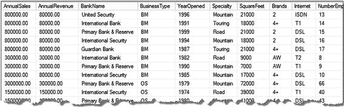
图 4-2. XQuery 处理产生的结果

### 工作原理

清单 4-17 中展示的来自表 `Sales.Store`、列 `Demographics` 的 XML 文档相对简单。该 XML 具有根元素 `<StoreSurvey>`，所有后续元素都是此 XML 根的子元素。这是一个一级深度的 XML 结构。这种结构在生产环境中很常见，因为数据库设计者在可能的情况下倾向于为了性能原因而在列中保持简单的 XML 结构。因此，要将 XML 数据转换为行，我们需要在 `nodes()` 方法中提供对根元素的引用。之后，`value()` 方法在单独的列中显示每个元素，如前面的图 4-2 所示。

为了在表的列上进行导航，SQL Server 2005 引入了两种运算符：
1.  `CROSS APPLY` – 允许在外部表表达式返回的每一行上调用一个表值函数。在 `CROSS APPLY` 的上下文中，XML `nodes()` 方法被视为表值函数。
2.  `OUTER APPLY` - 等同于 `LEFT OUTER JOIN`，当结果集返回查询外部表表达式的所有行时。

解决方案在清单 4-16 中，为查询实现了 `CROSS APPLY` 运算符。然而，`OUTER APPLY` 运算符会返回相同的结果集，因为 `Demographics` 列中没有任何包含 `NULL` 值的行。

让我们比较一下基于清单 4-17 中的 `XML` 变量分解 XML 值，与清单 4-15 中展示的表列分解之间的差异。

```sql
DECLARE @x XML;
SELECT @x = Demographics  FROM Sales.Store  WHERE BusinessEntityID = 292;
WITH XMLNAMESPACES(default 'http://schemas.microsoft.com/sqlserver/2004/07/adventure-works/StoreSurvey')
SELECT details.value('AnnualSales[1]', 'MONEY') AS AnnualSales,
details.value('AnnualRevenue[1]', 'MONEY') AS AnnualRevenue,
details.value('BankName[1]', 'VARCHAR(50)') AS BankName,
details.value('BusinessType[1]', 'VARCHAR(10)') AS BusinessType,
details.value('YearOpened[1]', 'INT') AS YearOpened,
details.value('Specialty[1]', 'VARCHAR(50)') AS Specialty,
details.value('SquareFeet[1]', 'INT') AS SquareFeet,
details.value('Brands[1]', 'VARCHAR(10)') AS Brands,
details.value('Internet[1]', 'VARCHAR(10)') AS Internet,
details.value('NumberEmployees[1]', 'SMALLINT') AS NumberEmployees
FROM @x.nodes('StoreSurvey') survey(details);
```
清单 4-17. 分解 XML 变量

主要的 SQL 代码差异见清单 4-18。当我们在 `FROM` 子句中引用变量时，应用于变量的 `nodes()` 方法返回一个行集，该行集表示分解单个文档的结果。这与针对表的 `CROSS APPLY` 相反，后者从表的每一行分解 XML 并生成一个单一的行集。清单 4-17 显示了分解 XML 变量和列之间的代码差异。

```sql
FROM @x.nodes('StoreSurvey ') survey(details);
```
从变量分解 XML，并与以下对比：

```sql
FROM Sales.Store CROSS APPLY Demographics.nodes('StoreSurvey') survey(details);
```
从列分解 XML

`SELECT` 子句对于变量和列分解过程是相同的。要检索元素值，`value()` 方法需要提供 XPath 路径，该路径指定了带有单例索引指示符的元素名称以及数据类型。例如：`details.value('SquareFeet[1]', 'INT') AS SquareFeet.`

在 `SELECT` 子句中列出列别名始终是一个好习惯。当缺少别名时我们不会收到错误，而且我个人更喜欢不收到带有默认列名“(无列名)”的结果。

**注意**

XML 元素和属性是区分大小写的；因此，当在 `value()` 方法中引用元素和属性时，其大小写必须与 XML 文档完全一致。否则，对于 XML 类型的列，解析器将抛出错误。例如，当元素 `AnnualSales` 被指定为 `details.value(‘annualsales[1]’, ‘money’)` 时，你将收到错误：消息 2263，级别 16，状态 1，第 2 行 XQuery `[Sales.Store.Demographics.value()]`: 在类型元素 “({ `http://schemas.microsoft.com/sqlserver/2004/07/adventure-works/StoreSurvey}:StoreSurvey,#anonymous` )” 中没有名为 “{ `http://schemas.microsoft.com/sqlserver/2004/07/adventure-works/StoreSurvey}:annualsales` ” 的元素。如果 XML 值将列存储为非类型化的 XML，那么错误指定项目的分解结果将是 `NULL`。这同样适用于 XML 变量。我不断警告读者注意 XML 的大小写敏感性，因为这是 XQuery 新手最常见的错误。例如，当我们以小写、大写或混合大小写键入函数 `CASE` 时，SQL Server T-SQL 不会引发任何错误。然而，XQuery 没有为我们提供这种便利，我们必须遵循大小写规则。但是，当 SQL Server 实例或数据库安装在任何类型的二进制排序规则下时，对象名称元数据（表、列等）是区分大小写的。

## 4-4. 处理遗留的 XML 存储

### 问题

你想处理以 `XML` 以外的数据类型存储在表列中的 XML 数据。


### 解决方案

在过去的二十年里，SQL Server 发生了巨大的变化。其中最重大的改动之一是在 SQL Server 2005 中引入的。微软向 IT 市场推出了一款革命性的 RDBMS 产品。`NTEXT`、`TEXT` 和 `IMAGE` 数据类型被弃用。然而，在遗留数据库中，XML 文档可能存储在 `VARCHAR`、`NVARCHAR`、`VARBINARY`、`IMAGE`、`TEXT` 和 `NTEXT` 数据类型的列中。在这种情况下，必须将该列转换为 `XML` 数据类型。

**注意**

在某些情况下，你会将数据存储在非 XML 类型的列中，例如：XML 数据包含内部 DTD 或 ENTITY 声明；以及业务要求完全按照接收到的 XML 格式存储数据，包括不重要的空白字符。但是，`NTEXT`、`TEXT` 和 `IMAGE` 数据类型不应被考虑。请使用 `VARCHAR`、`NVARCHAR`、`VARBINARY`。

例如，SQL Server 继续使用 `IMAGE` 数据类型在 `msdb.dbo.sysssispackages` 表中存储 SSIS 包，如图 4-3 所示。所有 SSIS 包都是 XML 文档。

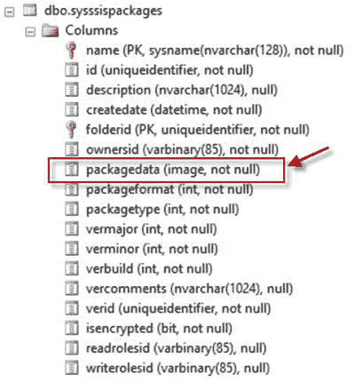

图 4-3

展示 `msdb.dbo.sysssispackages` 结构

让我们设定这个场景：你有一个任务，要找到所有通过 SQL Server 维护计划运行数据库备份的服务器，并列出计划中使用的所有数据库。对于几台服务器来说，这个任务很容易完成。但你还需要检查数百个 SQL Server 实例。与其登录到每个实例并打开每个单独的维护计划，不如从 `sysssispackages` 表中拆解 `packagedata` 列，如代码清单 4-18 所示，因为这是一个高效得多的过程。

```sql
WITH XMLNAMESPACES ('www.microsoft.com/SqlServer/Dts' AS DTS,
'www.microsoft.com/sqlserver/dts/tasks/sqltask' AS SQLTask),
Package
AS
(
SELECT name,
CAST(CAST(packagedata AS VARBINARY(MAX)) AS XML) AS package
FROM msdb.dbo.sysssispackages
WHERE packagetype = 6
)
SELECT Package.name as MaintenancePlanName,
PKG.value('@SQLTask:DatabaseName', 'NVARCHAR(128)')  AS DatabaseName,
PKG.value('(../@SQLTask:BackupDestinationAutoFolderPath)', 'NVARCHAR(500)') AS BackupDestinationFolderPath
FROM Package
CROSS APPLY package.nodes('//DTS:ObjectData/SQLTask:SqlTaskData/SQLTask:SelectedDatabases') SSIS(PKG);
```

代码清单 4-18
拆解 SSIS 包代码

拆解 SQL Server 维护计划 SSIS 包的结果如图 4-4 所示。

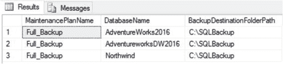

图 4-4

拆解维护计划的结果

### 工作原理

正如我在“解决方案”中提到的，`packagedata` 列是一个 `IMAGE` 数据类型，不能直接由 `nodes()` 方法处理。因此，必须将该列转换为 `XML` 数据类型。这就是为什么解决方案查询包含一个 `XMLNAMESPACES` 声明块和一个名为 `Package` 的 CTE，用于将 `packagedata` 列转换为 `XML` 数据类型以进行进一步拆解。

这些 SQL 维护作业 SSIS 包包含两个命名空间，因此 `XMLNAMESPACES` 声明必须同时包含它们：

1.  `'www.microsoft.com/SqlServer/Dts'` – `<dts:executable>` 顶层元素。
2.  `'www.microsoft.com/sqlserver/dts/tasks/sqltask'` – `<SQLTask:SqlTaskData>` 子元素。

`Package` CTE 为 XQuery 拆解过程准备 `packagedata` 列。CTE 返回 SSIS 包的名称，并显式将 `packagedata` 列转换为 `XML` 数据类型。`IMAGE` 数据类型无法显式转换为 `XML` 数据类型。第一步是显式将 `IMAGE` 数据类型转换为 `VARBINARY(MAX)`，后者可以转换为 `XML`，例如：`CAST(CAST(packagedata AS VARBINARY(MAX)) AS XML)`。

`packagetype` 列有五个可能的值。

*   0 - 默认值
*   1 - SQL Server 导入和导出向导
*   3 - SQL Server 复制
*   5 - SSIS 设计器
*   6 - 维护计划设计器或向导

在此示例中，我们专注于维护计划；因此，我们可以在 `WHERE` 子句中过滤结果为 `packagetype = 6`。

解决方案查询的最后一部分拆解维护计划 XML 并交付结果集。在处理 `SELECT` 子句中的值之前，我们需要在 XML 数据中建立一个元素路径。当我们处理表和列时，`CROSS APPLY` 操作符有助于遍历这些值。`nodes()` 方法没有指向源元素的完整路径。SSIS XML 很大；因此，“//”提供了一个指向源元素的快捷路径，并在 XML 文档中匹配表达式模式。你也可以在 `WHERE` 子句中使用前导通配符 “%”。元素路径 `//DTS:ObjectData/SQLTask:SqlTaskData/SQLTask:SelectedDatabases` 告诉你忽略前导元素并匹配 XML 结构中最右侧的部分。请记住，`nodes()` 方法需要双部分别名，所以 `SSIS(PKG)` 是表（列）别名。

`SELECT` 子句与 `Package.name` 列一起从 XML 数据中返回两个值，如示例 4-6 所示的部分 XML 所示：

1.  `PKG.value('@SQLTask:DatabaseName', 'NVARCHAR(128)') as DatabaseName`，是 `SQLTask:SelectedDatabases` 元素的 `SQLTask:DatabaseName` 属性。要在 `value()` 方法中处理属性，“@”字符指示该值是属性，不需要单例。
2.  `PKG.value('(../@SQLTask:BackupDestinationAutoFolderPath)', 'NVARCHAR(500)')` 可用作 `BackupDestinationFolderPath`。

`SQLTask:BackupDestinationAutoFolderPath` 同样是一个属性。然而，`nodes()` 方法设置在 `SQLTask:SelectedDatabases` 元素上，该元素是 `SQLTask:SqlTaskData` 元素的子元素。因此，要访问 `SQLTask:BackupDestinationAutoFolderPath` 属性，我们需要向上移动一个 XML 层级到 `SQLTask:SqlTaskData` 元素。步骤操作符 “../” 完成了这个过程。

```xml
<!-- 此处应为 Listing 4-19 的 XML 代码片段内容 -->
```

代码清单 4-19
展示源 XML 的格式化片段

## 4-5. 导航类型化 XML 列

### 问题

你想解决在拆解类型化 XML 列时遇到的“无法隐式原子化或将‘fn:data()’应用于复杂内容元素”错误。


### 解决方案

当尝试分解一个类型化的 XML 列时，如代码清单 4-20 所示，`XPath` 路径可能会产生错误。

```
WITH XMLNAMESPACES('http://schemas.microsoft.com/sqlserver/2004/07/adventure-works/ProductModelManuInstructions' as df)
SELECT ProductModelID,
instruct.value('.', 'VARCHAR(2000)') AS StepInstruction,
instruct.value('../@LocationID', 'INT') AS LaborStation,
instruct.value('../@LaborHours', 'REAL') AS LaborHours,
instruct.value('../@LotSize', 'INT') AS LotSize,
instruct.value('../@MachineHours', 'REAL') AS MachineHours,
instruct.value('../@SetupHours', 'REAL') AS SetupHours,
instruct.value('df:material[1]', 'VARCHAR(100) ') AS Material,
instruct.value('df:tool[1]', 'VARCHAR(100) ') AS Tool
FROM Production.ProductModel
CROSS APPLY Instructions.nodes('df:root/df:Location/df:step') prod(instruct);
代码清单 4-20.
首次尝试分解类型化 XML 列
```

然而，此代码会产生一个类似于以下内容的错误：

```
Msg 9314, Level 16, State 1, Line 2
XQuery [Production.ProductModel.Instructions.value()]: Cannot implicitly atomize or apply 'fn:data()' to complex content elements, found type 'df{http://schemas.microsoft.com/sqlserver/2004/07/adventure-works/ProductModelManuInstructions}:StepType' within inferred type 'element(df{http://schemas.microsoft.com/sqlserver/2004/07/adventure-works/ProductModelManuInstructions}:step,df{http://schemas.microsoft.com/sqlserver/2004/07/adventure-works/ProductModelManuInstructions}:StepType)'.
```

为了修复此错误，我们必须引入 `XQuery` 数据访问器函数 `fn:string()`，以防止当 `value()` 方法使用 `"../"` 步进运算符访问单例原子实例时发生错误，如代码清单 4-21 所示。

```
WITH XMLNAMESPACES('http://schemas.microsoft.com/sqlserver/2004/07/adventure-works/ProductModelManuInstructions' as df)
SELECT ProductModelID,
instruct.value('fn:string(.)', 'varchar(2000)') AS StepInstruction,
instruct.value('fn:string(../@LocationID)', 'int') AS LaborStation,
instruct.value('fn:string(../@LaborHours)', 'real') AS LaborHours,
instruct.value('fn:string(../@LotSize)', 'int') AS LotSize,
instruct.value('fn:string(../@MachineHours)', 'real') AS MachineHours,
instruct.value('fn:string(../@SetupHours)', 'real') AS SetupHours,
instruct.value('df:material[1]', 'varchar(100) ') AS Material,
instruct.value('df:tool[1]', 'varchar(100) ') AS Tool
FROM Production.ProductModel
CROSS APPLY Instructions.nodes('df:root/df:Location/df:step') prod(instruct);
代码清单 4-21.
应用 fn:string() 函数修复 Msg 9314 错误
```

查询结果如图 4-5 所示。

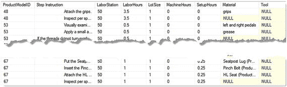

图 4-5.
使用 `fn:string()` 函数分解类型化 XML 列的结果

### 工作原理

`SQL Server XQuery` 实现了三个数据访问器函数：
*   `fn:string()` – 提取元素或属性的字符串值。
*   `fn:data()` – 从元素或属性中提取标量（类型化）值。
*   `text()` – 从元素或属性返回单个值。

如你所见，这三个函数在功能上非常相似。为了检验每个函数的功能，让我们分析代码清单 4-22 的结果，其中的 `XML` 部分模拟了来自 `Instructions` 列的 `XML`。

```
DECLARE @x XML = '
<top>
    <level1>1</level1>
    <level2>2</level2>
</top>
<!-- extra text
element -->
3';
SELECT @x.query('/top/level1/text()') Text_Function,
@x.query('fn:data(/*)') Data_Function,
@x.query('fn:string(/*[1])') String_Function;
代码清单 4-22.
分析数据访问器函数。query() 方法将在下一个配方 4-6 “检索 XML 数据的子集”中介绍
```

此查询的结果如图 4-6 所示。


图 4-6.
显示数据访问器函数结果

代码清单 4-22 及其结果（如图 4-6 所示）演示了数据访问器函数：
*   `text()` 函数从元素 `<level1>` 返回单个值 “1”。
*   `fn:data()` 函数连接了值。
*   `fn:string()` 函数要求单例，并为 `level1` 和 `level2` 元素返回值。

对于代码清单 4-22 中的解决方案，`fn:string()` 函数是最合适的，因为它使用了局部元素引用：`instruct.value('fn:string(.)', 'varchar(2000)')`。例如，`fn:data()` 会返回错误，而 `text()` 函数会为 `Instructions` 列返回部分值，如代码清单 4-23 所示。

```
WITH XMLNAMESPACES('http://schemas.microsoft.com/sqlserver/2004/07/adventure-works/ProductModelManuInstructions' as df)
SELECT instruct.value('./text()[1]', 'varchar(2000)') AS Step_Instruction_by_text,
instruct.value('fn:string(.)', 'varchar(2000)') AS Step_Instruction_by_string
FROM Production.ProductModel
CROSS APPLY Instructions.nodes('df:root/df:Location/df:step') prod(instruct);
代码清单 4-23.
演示 text() 和 fn:string() 函数的结果差异
```

代码清单 4-23 的结果如图 4-7 所示。

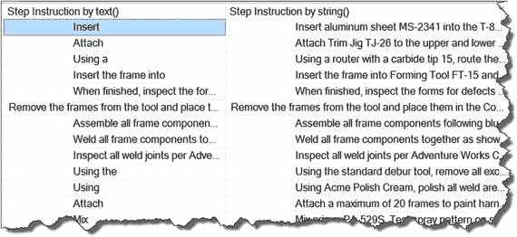

图 4-7.
`text()` 和 `fn:string()` 函数之间的差异

## 4-6. 检索 XML 数据的子集

### 问题

你希望从 `XML` 文档中返回特定的子集并保持 `XML` 格式。

### 解决方案

`query()` 方法允许你检索 `XML` 实例的特定部分。代码清单 4-24 演示了如何从 `SQL Server` 的动态管理视图 (`DMVs`) 中查询执行计划，并从执行计划中检索 `Statements` 部分。

```
SELECT TOP (25)
@@SERVERNAME as ServerName,
qs.Execution_count as Executions,
qs.total_worker_time as TotalCPU,
qs.total_physical_reads as PhysicalReads,
qs.total_logical_reads as LogicalReads,
qs.total_logical_writes as LogicalWrites,
qs.total_elapsed_time as Duration,
qs.total_worker_time/qs.execution_count as [Avg CPU Time],
DB_NAME(qt.dbid) DatabaseName,
qt.objectid,
OBJECT_NAME(qt.objectid, qt.dbid) ObjectName,
qp.query_plan as XMLPlan,
query_plan.query('declare default element namespace "http://schemas.microsoft.com/sqlserver/2004/07/showplan";
//Batch/Statements') as SQLStatements
FROM sys.dm_exec_query_stats qs
CROSS APPLY sys.dm_exec_sql_text(qs.sql_handle) as qt
CROSS APPLY sys.dm_exec_query_plan(plan_handle) as qp
WHERE qt.dbid IS NOT NULL
ORDER BY TotalCPU DESC;
代码清单 4-24.
从执行计划返回 SQL 语句 XML
```


### 工作原理

在 XQuery 方法中，`query()`方法直接且易于使用。要返回`XML`实例的子集，你需要指定一个`XML`变量或列，以及目标元素或属性的路径。`query()`方法返回`XML`数据类型的实例。例如，要从分配给变量`@x`的`ProductDescription` `XML`实例（如代码清单 4-25 所示）中返回`Features` `XML`，结果如图 4-8 所示。

```sql
DECLARE @x XML ='
<ProductDescription ProductID="1">
  <Features>
    <Feature 1>
        3 years
        parts and labor
    </Feature>
    <Feature 2>
        10 years
        maintenance contract available through your dealer or any AdventureWorks retail store.
    </Feature>
  </Features>
  <Specifications>
    <Color>front</Color>
    <Size>small</Size>
  </Specifications>
</ProductDescription>
';
SELECT @x.query('ProductDescription/Features');
```

**代码清单 4-25.** 从`XML`返回 Features 子集

结果如代码清单 4-26 所示。

```xml
<Features>
  <Feature 1>
    3 years
    parts and labor
  </Feature>
  <Feature 2>
    10 years
    maintenance contract available through your dealer or any AdventureWorks retail store.
  </Feature>
</Features>
```

**代码清单 4-26.** `query()`方法的结果

代码清单 4-25 展示了从一个不包含任何命名空间的`XML`变量返回结果。因此，无需为`query()`方法指定任何`XMLNAMESPACES`。然而，对于类型化的`XML`，`query()`方法需要声明命名空间，如本配方的解决方案部分（代码清单 4-24）所示。该解决方案使用默认语法声明命名空间，因为执行计划`XML`只引用了一个命名空间：

```sql
query_plan.query('declare default element namespace "http://schemas.microsoft.com/sqlserver/2004/07/showplan";
                    //Batch/Statements') as SQLStatements
```

或者，代码清单 4-27 中定义了`XML`实例中的两个命名空间。因此，每个命名空间都必须单独声明，如下所示。

```sql
SELECT name,
       CAST(CAST(packagedata AS varbinary(MAX)) AS XML) AS package,
       CAST(CAST(packagedata AS varbinary(MAX)) AS XML).query('declare namespace         DTS="www.microsoft.com/SqlServer/Dts";
declare namespace SQLTask="www.microsoft.com/sqlserver/dts/tasks/sqltask";
                              //DTS:ObjectData//SQLTask:SqlTaskData/SQLTask:SelectedDatabases') as SQLStatements
FROM msdb.dbo.sysssispackages
WHERE packagetype = 6;
```

**代码清单 4-27.** 在`query()`方法的 XQuery 中声明多个命名空间

要声明命名空间，你可以使用`query()`方法的内部 XQuery 格式，也可以使用`XMLNAMESPACES`语法，如代码清单 4-28 所示。

```sql
WITH XMLNAMESPACES('www.microsoft.com/SqlServer/Dts' as DTS,
                   'www.microsoft.com/sqlserver/dts/tasks/sqltask' as SQLTask)
SELECT name,
       CAST(CAST(packagedata AS varbinary(MAX)) AS XML) AS package,
       CAST(CAST(packagedata AS varbinary(MAX)) AS XML).query('//DTS:ObjectData//SQLTask:SqlTaskData/SQLTask:SelectedDatabases') as SQLStatements
FROM msdb.dbo.sysssispackages
WHERE packagetype = 6;
```

**代码清单 4-28.** 在`query()`方法中使用`XMLNAMESPACES`代替 XQuery 命名空间声明

作为本配方的总结，我想再演示一个示例，其中返回带有用户定义根元素的`XML`实例子集（代码清单 4-29）。其语法是 `query('<Root>{/XMLPath/}</Root>')`。

```sql
WITH XMLNAMESPACES('www.microsoft.com/SqlServer/Dts' as DTS,
                   'www.microsoft.com/sqlserver/dts/tasks/sqltask' as SQLTask)
SELECT name,
       CAST(CAST(packagedata AS varbinary(MAX)) AS XML) AS package,
       CAST(CAST(packagedata AS varbinary(MAX)) AS XML).query('{//DTS:ObjectData//SQLTask:SqlTaskData/SQLTask:SelectedDatabases}') as SQLStatements
FROM msdb.dbo.sysssispackages
WHERE packagetype = 6;
```

**代码清单 4-29.** 使用用户定义的根元素返回`query()`函数结果

你可以根据自己的偏好选择`query()`方法使用的语法。

## 4-7. 查找表中的所有 XML 列

### 问题

你想查找那些可能以非`XML`数据类型存储的`XML`文档。

### 解决方案

我从未遇到过需要在客户端检测`XML`文档的情况，但当客户端不确定`XML`存储在何处时，仅仅依赖`XML`数据类型并不是一个好策略。正如配方 4-4 所解释的，`XML`文档可能存储在`XML`、`VARCHAR`、`NVARCHAR`、`VARBINARY`、`IMAGE`、`TEXT`和`NTEXT`数据类型的列中。因此，我编写了一个`SQL`脚本，用于动态地在数据库的所有列中“嗅探”`XML`文档，如代码清单 4-30 所示。

```sql
SET NOCOUNT ON;
DECLARE @SQL nvarchar(1000),
        @tblName nvarchar(200),
        @clmnName nvarchar(100),
        @DType nvarchar(100);
IF (OBJECT_ID('tempdb.dbo.#Result')) IS NOT NULL
    DROP TABLE #Result;
CREATE TABLE #Result
(
    XMLValue XML,
    TopElement NVARCHAR(100),
    tblName NVARCHAR(200),
    clmnName NVARCHAR(100),
    DateType NVARCHAR(100)
);
IF (OBJECT_ID('tempdb.dbo.#XML')) IS NOT NULL
    DROP TABLE #XML;
CREATE TABLE #XML
(
    Val XML,
    TopElmn VARCHAR(100)
);
DECLARE cur
CURSOR FOR
SELECT XMLClmn = 'WITH CTE AS
                   (SELECT TOP 1 '+ CASE t.name WHEN ''IMAGE'' THEN '' TRY_CONVERT(XML, CAST(' + QUOTENAME(c.name)  + '' AS VARBINARY(MAX))) AS tst, ''
                                          ELSE '' TRY_CONVERT(XML, ' + QUOTENAME(c.name)  + '') as tst, '' END + QUOTENAME(c.name)  + '' FROM ''
                                          + QUOTENAME(s.name) +''.'' + QUOTENAME(o.name) +
                                          ''
                                          WHERE '+ CASE t.name WHEN ''IMAGE'' THEN '' TRY_CONVERT(XML, CAST(' + QUOTENAME(c.name)  + '' AS VARBINARY(MAX)))''
                                          ELSE '' TRY_CONVERT(XML, ' + QUOTENAME(c.name)  + '') '' END +'' IS NOT NULL
                   )
                   SELECT TOP (1) tst,
                          c.value(''fn:local-name(.)[1]'', ''VARCHAR(200)'') AS TopNodeName
                   FROM CTE CROSS APPLY tst.nodes(''/*'') AS t(c);',
       s.name + ''.'' + o.name AS TableName,
       c.name AS ColumnName ,
       t.name
FROM sys.columns c
INNER JOIN sys.types t
    ON c.system_type_id = t.system_type_id
INNER JOIN sys.objects o
    ON c.object_id = o.object_id
    AND o.type = ''u''
INNER JOIN sys.schemas s
    ON s.schema_id = o.schema_id
WHERE (t.name IN(''xml'',''varchar'', ''nvarchar'', ''varbinary'') AND c.max_length = -1)
   OR (t.name IN (''image'', ''text'', ''ntext''));
OPEN cur;
FETCH NEXT
FROM cur
INTO @SQL, @tblName, @clmnName, @DType;
WHILE @@FETCH_STATUS = 0
BEGIN
    INSERT INTO #XML
    EXEC(@SQL);
    INSERT #Result
    SELECT Val, TopElmn, @tblName, @clmnName, @DType
    FROM #XML;
    TRUNCATE TABLE #XML;
    FETCH NEXT FROM cur INTO @SQL, @tblName, @clmnName, @DType;
END
DEALLOCATE cur;
SELECT XMLValue,TopElement,tblName,clmnName,DateType
FROM #Result;
DROP TABLE #Result;
DROP TABLE #XML;
SET NOCOUNT OFF;
```

**代码清单 4-30.** 跨表和列检测`XML`文档

为了演示结果，该`SQL`脚本在`msdb`数据库上执行，如图 4-8 所示。

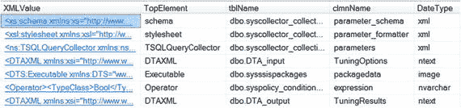

**图 4-8.** 来自`msdb`数据库的结果

**重要提示** 此解决方案使用了`TRY_CONVERT()`函数，该函数仅在 `SQL Server` 2012 及更高版本中可用。


### 工作原理

## 数据类型过滤与验证

该解决方案基于以下几个逻辑过程：

*   `FROM` 子句从系统表（`sys.columns`、`sys.types`、`sys.objects` 和 `sys.schemas`）中获取有关可能存储 XML 数据的列、其所属表和架构的信息。
*   `WHERE` 子句过滤数据类型。理论上，XML 文档可能存在于数据类型为 `XML`、`VARCHAR`、`NVARCHAR`、`VARBINARY`、`IMAGE`、`TEXT` 和 `NTEXT` 的列中。XML 文档本质上是冗长的。因此，期望数据类型 `VARCHAR`、`NVARCHAR` 和 `VARBINARY` 的长度为 -1，即在数据类型长度规范中为 `MAX`。其他数据类型 `IMAGE`、`TEXT` 和 `NTEXT` 则不需要此额外的长度过滤器。
*   `SELECT` 子句动态构建用于验证的 SQL。关键函数 `TRY_CONVERT()` 自 SQL Server 2012 起可用。我们利用了 `TRY_CONVERT()` 的行为：当数据类型无法转换为指定类型时，该函数返回 `NULL`。例如，`CAST()` 和 `CONVERT()` 函数在转换失败时会返回错误（消息 9420，XML 解析：第 1 行，字符 2，非法 xml 字符）。因此，任何无法转换为 `XML` 数据类型的值都会被过滤掉。如技巧 4-4 所述，`IMAGE` 数据类型无法直接转换为 `XML`。因此，`CASE` 表达式使用了两次转换验证；第一次针对 `IMAGE` 数据类型，如代码清单 4-31 所示，第二次针对 `VARCHAR`、`NVARCHAR`、`VARBINARY`、`TEXT` 和 `NTEXT` 数据类型，如代码清单 4-32 所示。

```sql
WITH CTE AS
(
SELECT TOP (1) TRY_CONVERT(XML, CAST(packagedata AS VARBINARY(MAX))) AS tst,
packagedata
FROM dbo.sysssispackages
WHERE  TRY_CONVERT(XML, CAST(packagedata AS VARBINARY(MAX))) IS NOT NULL
)
SELECT TOP (1) tst,
c.value('local-name(.)[1]', 'VARCHAR(200)') AS TopNodeName
FROM CTE
CROSS APPLY tst.nodes('/*') AS t(c);
代码清单 4-31.
验证 IMAGE 数据类型
```

```sql
WITH CTE AS
(
SELECT TOP (1) TRY_CONVERT(XML, expression) as tst,
expression
FROM dbo.syspolicy_conditions_internal
WHERE  TRY_CONVERT(XML, expression) IS NOT NULL
)
SELECT TOP (1) tst,
c.value('fn:local-name(.)[1]', 'VARCHAR(200)') AS TopNodeName
FROM CTE
CROSS APPLY tst.nodes('/*') AS t(c);
代码清单 4-32.
验证 VARCHAR, NVARCHAR, VARBINARY, TEXT 和 NTEXT 数据类型
```

## 代码执行过程

代码的工作方式如下：

*   游标执行在 `SELECT` 子句中生成的每个 SQL 脚本。
*   临时表 `#XML` 获取返回的行。
*   临时表 `#Result` 从 `#XML` 表获取行，并从游标获取变量。
*   清理 `#XML` 表，为下一行验证做准备。
*   销毁游标。
*   返回收集的数据。
*   删除临时表。

## CTE 外部 SELECT 块分析

以上是对流程的描述。然而，我想仔细研究一下代码清单 4-32 中 CTE 的外部 `SELECT` 块：

```sql
SELECT TOP (1) tst,
c.value('fn:local-name(.)[1]', 'VARCHAR(200)') AS TopNodeName
FROM CTE
CROSS APPLY tst.nodes('/*') AS t(c);
```

列 `tst`（代表测试）在成功转换为 `XML` 数据类型时返回 XML 值。列 `TopNodeName` 返回第一个可用的元素名称，即根元素。`fn:local-name()` 函数根据提供的参数返回元素名称。点号（当前上下文节点）是传递给 `fn:local-name()` 函数的参数，而 `nodes()` 方法设置为 `"/*"`（`child::node()` 和 `/node()` 轴的简写），它是单个元素的通配符。因此，这个组合的 XML 解析器意味着——从 XML 文档中返回第一个可用的名称。

当 `node()` 方法设置为 `"//*"`（`descendant-or-self` 轴的简写）时，我们可以得到不同的效果，这意味着查看并访问 XML 数据中的每个元素。这可以与 T-SQL 过滤器相比较，例如 `WHERE ColumnName LIKE '%text%'`。这样，解析器会遍历 XML 数据中的所有元素，如代码清单 4-33 所示。使用单个点作为参数的 `fn:local-name()` 函数返回当前元素名称，例如 `details.value('local-name(.)[1]', 'VARCHAR(100)')`。使用父轴步进（双点号），它返回上一级（即父级）的元素，例如 `details.value('local-name(..)[1]', 'VARCHAR(100)')`，如图 4-9 所示。

```sql
WITH ALLELEMENTS
AS
(
SELECT TOP 1 Demographics
FROM Sales.Store
)
SELECT
details.value('local-name(..)[1]', 'VARCHAR(100)') AS ParentNodeName,
details.value('local-name(.)[1]', 'VARCHAR(100)') AS NodeName
FROM ALLELEMENTS
CROSS APPLY Demographics.nodes('//*') survey(details);
代码清单 4-33.
显示 XML 数据中的所有元素
```

从 XML 数据中检索所有元素的结果如图 4-9 所示。

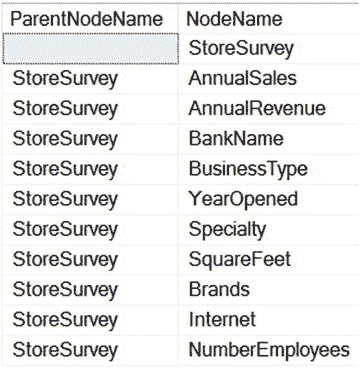

**图 4-9.** 动态返回 XML 元素的结果

## 4-8. 使用多个 CROSS APPLY 运算符

### 问题

你需要分解一个类型化 XML 列，但希望使用多个 `CROSS APPLY` 运算符来导航 XML。

### 解决方案

在技巧 4-5 “导航类型化 XML 列”中，我演示了如何使用 `"../"` 导航来分解类型化 XML 列。实现多个 `CROSS APPLY` 运算符可以作为 XML 导航的替代方案，如代码清单 4-34 所示。

```sql
WITH XMLNAMESPACES('http://schemas.microsoft.com/sqlserver/2004/07/adventure-works/ProductModelManuInstructions' as df)
SELECT ProductModelID,
step.value('fn:string(.)', 'varchar(2000)') AS StepInstruction,
instruct.value('@LocationID', 'int') AS LaborStation,
instruct.value('@LaborHours', 'real') AS LaborHours,
instruct.value('@LotSize', 'int') AS LotSize,
instruct.value('@MachineHours', 'real') AS MachineHours,
instruct.value('@SetupHours', 'real') AS SetupHours,
step.value('df:material[1]', 'varchar(100) ') AS Material,
step.value('df:tool[1]', 'varchar(100) ') AS Tool
FROM Production.ProductModel
CROSS APPLY Instructions.nodes('df:root/df:Location') prod(instruct)
CROSS APPLY instruct.nodes('df:step') ins(step);
代码清单 4-34.
演示多个 CROSS APPLY 运算符的解决方案
```

查询结果如图 4-10 所示。

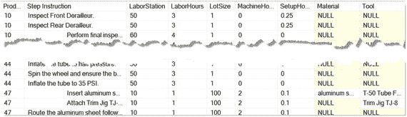

**图 4-10.** 应用多个 CROSS APPLY 运算符的结果

### 工作原理

使用多个 `CROSS APPLY` 运算符的关键在于将一个 `CROSS APPLY` 应用于第二个 `CROSS APPLY` 的结果，如我们的示例代码所示：

```sql
FROM Production.ProductModel
CROSS APPLY Instructions.nodes('df:root/df:Location') prod(instruct)
CROSS APPLY instruct.nodes('df:step') ins(step)
```

第一个 `CROSS APPLY` 引用 `ProductModel` 表的 `XML` 指令列，以创建一个基础结果集，供给第二个 `CROSS APPLY`：

```sql
CROSS APPLY Instructions.nodes('df:root/df:Location') prod(instruct)
```

第二个 `CROSS APPLY` 通过其 `instruct` 列别名获取第一个 `CROSS APPLY` 的结果：

```sql
CROSS APPLY instruct.nodes('df:step') ins(step)
```

最后，`SELECT` 子句使用 `instruct` 别名检索父元素，并使用 `step` 别名引用子元素。技巧 4-5 和 4-8 中的解决方案产生的结果集完全相同，但 `SELECT` 和 `FROM` 子句中的语法不同。

## 摘要

拆解 XML 数据的能力是在 SQL Server 中操作 XML 的一个非常重要的方面。许多内置的 SQL Server 流程都使用 XML；例如：

*   执行计划
*   扩展事件
*   DDL 触发器
*   SSIS 和 SSRS 后台代码

XQuery 语言通过允许动态且强大的编程式 XML 探索与操作，从而简化了 SQL Server 以及数据库管理员和开发人员的任务，更高效地利用了运行时间。

## 5. 修改 XML

XML XQuery 能够修改 XML 变量的 XML 实例和 XML 列。XQuery 的 `modify()` 方法提供了添加、删除和更新 XML 元素、属性及其值的能力。本章将讨论并通过实际案例演示如何将 `modify()` 方法应用于 XML 实例。

### 5-1. 在 XML 中插入一个子元素

### 问题

你想在一个现有的 XML 实例中插入一个子元素。

### 解决方案

你可能会遇到需要向现有 XML 实例中插入一个 XML 元素的情况。考虑清单 5-1 所示的简单 XML 数据。

```
清单 5-1.
简单的 XML 数据
```

SQL Server 通过 XML 数据类型的 `modify()` 方法提供对 XML 数据修改语言（XML DML）的支持。XML DML 是 W3C XQuery 标准的一个扩展，因为 XQuery 缺少数据操作语句和函数。清单 5-2 展示了如何使用 `modify()` 方法的 XML DML `insert` 语句将一个新元素插入到现有 XML 数据中的特定位置。结果如图 5-1 所示。

```
DECLARE @XMLDoc xml;
SET @XMLDoc =
'

';
SET @XMLDoc.modify('insert 3 year parts and labor extended maintenance is available into (/Root/ProductDescription/Features)[1]');
SELECT @XMLDoc;
清单 5-2.
为 Features 元素插入第一个子元素
```

XML DML `insert` 语句的结果如图 5-1 所示。

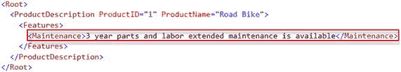
图 5-1. 在现有 XML 数据中插入子元素的结果

### 工作原理

`modify()` 方法的 XML DML 语言与 T-SQL DML 的 `INSERT`、`UPDATE` 和 `DELETE` 方法类似，但具有更多附加选项。这是合理的，因为 XML DML 在修改 XML 实例时必须考虑 XML 结构。`modify()` 方法不仅按值修改 XML 文档，还会修改其元素和属性。因此，`modify()` 方法在逻辑上可以被视为 T-SQL 的 DML 和 DDL 语言的一个子集的组合。我们将在本章的其他配方中讨论这些其他的 XML DML 语句和附加选项。

本配方演示了如何将一个新的子元素 `Maintenance` 添加到 XML 实例中的父元素 `Features`。在原始 XML 实例（如清单 5-1 所示）中，`Features` 元素没有任何子元素。我们不需要向 `modify()` 方法提供子元素位置的具体说明，因为 `Maintenance` 元素是 `Features` 元素的第一个子元素。清单 5-2 中提供的值来插入新元素的解决方案遵循以下模式：

1.  `insert` 是指定“插入”模式的关键词。
2.  `<Maintenance> 3 years parts and labor extended maintenance is available</Maintenance>` —— 是元素值模式，指示我们希望插入的元素。
3.  `into` 是关键词，其后的目标 XPath 路径指示我们将元素插入到 XML 中的哪个位置。
4.  `(/Root/ProductDescription/Features)[1]` 是插入的目标 XPath 路径。注意，目标 XPath 需要一个单例实例。当未提供单例（在此例中是通过 `[1]` 索引）时，XML DML 解析器将抛出以下错误：
    ```
    消息 2226，级别 16，状态 1，第 10 行
    XQuery [modify()]: 'insert' 的目标必须是单个节点，找到的是 'element(Features,xdt:untyped) *'
    ```

`modify(@xml:dml)` 方法接受一个参数。因此，发送给该方法的所有 `@xml:dml` 模式都作为单个字符串值提交，如清单 5-2 所示：

```
modify('insert
3 year parts and labor extended maintenance is available 
into (/Root/ProductDescription/Features)[1]');
```

### 5-2. 在包含命名空间的现有 XML 实例中插入子元素

### 问题

你想在一个包含命名空间的 XML 实例中插入一个子元素。

### 解决方案

当 XML 实例包含 XML 命名空间时，你需要在 `modify()` 方法内声明该 XML 命名空间。清单 5-3 在配方 5-1 的解决方案基础上进行了演示。

```
DECLARE @XMLDoc xml;
SET @XMLDoc =
'

';
SET @XMLDoc.modify('declare namespace ns="http://schemas.microsoft.com/sqlserver/2004/07/adventure-works/ProductModelManuInstructions";
insert 3 year parts and labor extended maintenance is available into (/ns:Root/ns:ProductDescription/ns:Features)[1]');
SELECT @XMLDoc;
显示 XML 结果：

3 year parts and labor extended maintenance is available

清单 5-3.
在 modify()方法中声明 XML 命名空间
```

### 工作原理

正如你所看到的，清单 5-1 和清单 5-3 之间有一个虽小但重要的区别。清单 5-3 在 XML 实例内部定义了一个 XML 命名空间。这个微小的差异影响了 `modify()` 方法的语法。如果 `modify()` 方法忽略了 XML 命名空间，XQuery 将无法找到目标 XPath 路径，导致 XML 不会发生任何更改，如清单 5-4 所示。结果如图 5-2 所示。

```
DECLARE @XMLDoc xml;
SET @XMLDoc =
'
<ProductDescription ProductID="1" xmlns="http://schemas.microsoft.com/sqlserver/2004/07/adventure-works/ProductModelManuInstructions">
  <Summary>
    <m:Features xmlns:m="http://schemas.microsoft.com/sqlserver/2004/07/adventure-works/ProductModel">
      <m:feature>Vacuum formed dual wall polycarbonate</m:feature>
      <m:feature>Dual material molded outer shell</m:feature>
      <m:feature>3 year parts and labor extended maintenance is available</m:feature>
    </m:Features>
  </Summary>
</ProductDescription>
';
SET @XMLDoc.modify('insert 3 year parts and labor extended maintenance is available into (/Root/ProductDescription/Features)[1]');
SELECT @XMLDoc;
```

清单 5-4.
XML 命名空间导致 `modify()` 方法未能更新目标 XML

结果如图 5-2 所示，表明此 `modify()` 方法并未更新源 XML。

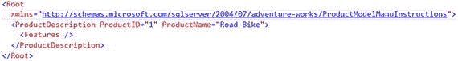

图 5-2.
在 `modify()` 方法中忽略命名空间时生成的 XML

如图 5-2 所见，返回的 XML 实例没有变化。要纠正这个问题，必须在 `modify()` 方法内部声明 XML 命名空间。因此，对于带有命名空间的 XML 实例，模式中的第一部分必须是命名空间声明，例如：

```
modify('declare namespace ns = "http://schemas.microsoft.com/sqlserver/2004/07/ adventure-works/ProductModelManuInstructions"; ... )
```

声明的名称 `ns` 是用户定义的，因此你可以选择任何符合 SQL Server 命名约定的名称来声明命名空间，例如名称中不能有空格，首字符必须是字母，后续字符可以是字母数字等。声明命名空间后，在 `modify()` 方法中使用这个名称作为每个元素的一部分，包括新模式和目标模式。例如：

```
insert 3 year parts and labor extended maintenance is available into (/ns:Root/ns:ProductDescription/ns:Features)[1]
```

**提示**
使用 `modify()` 方法后，务必验证结果。例如，解析器对于被忽略的命名空间声明不会抛出错误，而且操作似乎成功完成。然而，`modify()` 实际上并未将 XML DML 操作应用到你的 XML 数据上。

作为 `modify()` 方法内部命名空间声明语法的替代方案，也可以使用 T-SQL 的外部 `WITH XMLNAMESPACES` 声明来完成此任务。当 XML 文档只有一个命名空间时，可以使用默认命名空间，如清单 5-5 所示。

```
DECLARE @XMLDoc xml;
WITH XMLNAMESPACES(default 'http://schemas.microsoft.com/sqlserver/2004/07/adventure-works/ProductModelManuInstructions')
SELECT @XMLDoc =
'
<ProductDescription ProductID="1" xmlns="http://schemas.microsoft.com/sqlserver/2004/07/adventure-works/ProductModelManuInstructions">
  <Summary>
    <Features>
      <feature>Vacuum formed dual wall polycarbonate</feature>
      <feature>Dual material molded outer shell</feature>
    </Features>
  </Summary>
</ProductDescription>
';
SET @XMLDoc.modify('insert 3 year parts and labor extended maintenance is available into (/Root/ProductDescription/Features)[1]');
```

清单 5-5.
使用 `WITH XMLNAMESPACES` 声明默认 XML 命名空间

当你使用 `WITH XMLNAMESPACES` 子句时，`SET` 操作符将不起作用。你必须改用 `SELECT` 子句。

## 5-3. 插入 XML 属性

### 问题

你想在现有 XML 数据的 XML 元素中插入一个属性。

### 解决方案

属性是 XML 元素的一个特性。因此，`modify()` 方法提供了 `attribute` 选项来向元素添加属性，如清单 5-6 所示。

```
DECLARE @XMLDoc xml;
SET @XMLDoc =
'
<ProductDescription ProductID="1">
  <Summary>
    <Features>
      <Maintenance>
        <feature>Vacuum formed dual wall polycarbonate</feature>
        <feature>Dual material molded outer shell</feature>
      </Maintenance>
    </Features>
  </Summary>
</ProductDescription>
';
SET @XMLDoc.modify('insert attribute ProductModel {"Mountain-100"} into (/Root/ProductDescription/Features/Maintenance)[1]');
SELECT @XMLDoc;
```

清单 5-6.
将 `ProductModel` 属性插入到 `Maintenance` 元素中

结果如图 5-3 所示。

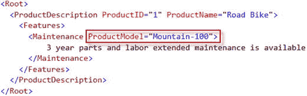

图 5-3.
向元素中插入属性后的 XML 结果

### 工作原理

第 4 章解释了元素和属性的 XPath 路径语法是不同的。同样地，`modify()` 方法也存在差异。首先，`insert` 语句有一个额外的 `attribute` 选项，在插入元素时不指定这个选项。其次，属性不用尖括号包围。最后，属性的值被放入双引号内的花括号中，紧跟在属性名称之后。因此，添加属性的语法遵循以下模式：

1.  `insert attribute` 关键字表示你希望向元素中插入一个属性。
2.  `ProductModel {"Mountain-100"}` 是属性的名称和值。
3.  `into` 表示目标元素的 XPath 路径即将到来。
4.  `(/Root/ProductDescription/Features/Maintenance)[1]` 是属性的目标 XPath 路径。单例数值位置谓词是目标 XPath 的必需组成部分。

例如：

```
modify('insert attribute ProductModel {"Mountain-100"} into (/Root/ProductDescription/Features/Maintenance)[1]');
```

将 XPath 路径用括号括起来，然后在末尾加上数值位置谓词，意味着单例适用于路径中的每一步。不带括号的 XPath 路径则期望单例应用于每个元素。例如：`/Root[1]/ProductDescription[1]/Features[1]/Maintenance[1]`。

示例语法将属性 `ProductModel` 及其值 “Mountain-100” 添加到 `Maintenance` 元素的第一个实例中。

此外，`modify()` 方法允许你向一个元素插入多个属性。要向元素添加属性列表：

1.  在 `insert` 指令后打括号。
2.  列出属性，用逗号分隔。
3.  闭合括号。

清单 5-7 展示了这一点。

```
DECLARE @XMLDoc xml;
SET @XMLDoc =
'
<ProductDescription ProductID="1">
  <Summary>
    <Features>
      <Maintenance>
        <feature>Vacuum formed dual wall polycarbonate</feature>
        <feature>Dual material molded outer shell</feature>
      </Maintenance>
    </Features>
  </Summary>
</ProductDescription>
';
SET @XMLDoc.modify('insert
(
attribute ProductModel {"Mountain-100"},
attribute LaborType {"Manual"}
) into (/Root/ProductDescription/Features/Maintenance)[1]');
SELECT @XMLDoc;
```

清单 5-7.
向 `Maintenance` 元素插入多个属性

结果如图 5-4 所示。

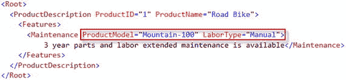

图 5-4.
向 `Maintenance` 元素插入多个属性后的结果

## 5-4. 条件性地插入 XML 属性

### 问题

你想基于一个比较条件插入一个 XML 属性。

### 解决方案

可以在 `modify()` 方法中实现 `if … else` 条件语句，如清单 5-8 所示。

```
DECLARE @XMLDoc xml;
SET @XMLDoc =
'
<ProductDescription ProductID="1">
  <Summary>
    <Features>
      <Maintenance>
        <feature>Vacuum formed dual wall polycarbonate</feature>
        <feature>Dual material molded outer shell</feature>
      </Maintenance>
    </Features>
  </Summary>
</ProductDescription>
';
SET @XMLDoc.modify('insert
if (/Root/ProductDescription[@ProductID=1])
then attribute ProductModel {"Road-150"}
else (attribute ProductModel {"Mountain-100"} )
into (/Root/ProductDescription/Features/Maintenance)[1]');
SELECT @XMLDoc;
```

清单 5-8.
将属性插入操作包装在 `if-then-else` 条件中

结果如图 5-5 所示。

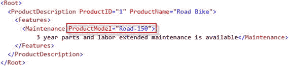

图 5-5.
条件性属性插入后的 XML 结果


### 5-5. 在指定位置插入子元素

### 问题
你希望将一个新元素插入到现有的元素组中，并强制其遵循特定的位置顺序。

### 解决方案
`modify()` 方法的 `insert` 语句有四个关键字，可用于指定子元素在元素组中的位置：

*   `as first`
*   `as last`
*   `after`
*   `before`

这些关键字用于指定新元素的放置位置，如列表 5-9 所示。

```sql
DECLARE @XMLDoc xml;
SET @XMLDoc =
'<Root>
<ProductDescription ProductID="1">
  <Features>
    <Color>Red</Color>
    <Material>Aluminium</Material>
    <BikeFrame>Carbon</BikeFrame>
  </Features>
</ProductDescription>
</Root>';
SET @XMLDoc.modify('insert 1 year parts and labor
as first  into (/Root/ProductDescription/Features)[1]');
SET @XMLDoc.modify('insert Aluminium
as last into (/Root/ProductDescription/Features)[1]');
SET @XMLDoc.modify('insert Strong long lasting
after (/Root/ProductDescription/Features/Material)[1]')
SET @XMLDoc.modify('insert Silver
before (/Root/ProductDescription/Features/BikeFrame)[1]')
SELECT @XMLDoc;
-- 列表 5-9.
-- 演示使用 as first、as last、after 和 before 关键字在父元素 Features 下排列子元素
```

结果如图 5-6 所示。

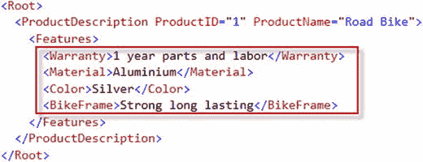

图 5-6.
使用位置指定符的插入指令结果

### 工作原理
关键字 `as first`、`as last`、`after` 和 `before` 为子元素提供位置指定。每个关键字的含义不言自明：

*   `as first` – 将子元素添加到第一个位置。
*   `as last` – 将子元素添加到最后一个位置。
*   `after` – 将子元素添加到提供的同级元素位置之后。
*   `before` – 将子元素添加到提供的同级元素位置之前。

`as first` 和 `as last` 的语法与 `after` 和 `before` 的语法略有不同。例如，`as first` 和 `as last` 的语法如下：

*   `modify('insert <ChildElement> as first into (/XPath/<ParentElement>)[1]')`
*   `modify('insert <ChildElement> as last into (/XPath/<ParentElement>)[1]')`

`insert` 指令提供子元素及其值，然后由 `as first` 或 `as last` 指定符指明该元素在其同级元素中所处的位置。最后一步，父元素的 XPath 指明了子元素的目标位置。

对于 `before` 和 `after` 关键字，与 `as first` 和 `as last` 相比有两个区别：

*   未使用 `into` 关键字。
*   XPath 中引用了 `<ParentElement>/<SiblingElement>` 元素，新元素（在它之前或之后）将放置在该元素旁边。
*   `modify('insert <ChildElement> before (/XPath/<ParentElement>/<SiblingElement>)[1]')`
*   `modify('insert <ChildElement> after (/XPath/<ParentElement>/<SiblingElement>)[1]')`

### 5-6. 插入多个元素

### 问题
你希望向 XML 文档中插入多个同级元素。

### 解决方案
与属性不同（你可以通过逗号分隔来添加多个属性及其值），`modify()` 方法中的直接 `insert` 语句不支持插入多个元素。但是，XQuery 扩展函数 `sql:variable()` 可以帮助解决这个问题，如列表 5-10 所示。

```sql
DECLARE @XMLDoc xml;
SET @XMLDoc =
'<Root>
<ProductDescription ProductID="1">
  <Features/>
</ProductDescription>
</Root>';
DECLARE @newElements xml;
SET @newElements =
'<Warranty>1 year parts and labor</Warranty>
<Material>Aluminium</Material>
<Color>Silver</Color>
<BikeFrame>Strong long lasting</BikeFrame>';
SET @XMLDoc.modify('insert
sql:variable("@newElements")
into (/Root/ProductDescription/Features)[1]')
SELECT @XMLDoc;
-- 列表 5-10.
-- 向 XML 实例中插入多个同级元素
```

生成的 XML 如图 5-6 所示（重复该图）。


### 工作原理
如解决方案部分所述，`modify()` 方法在 `insert` 指令中不支持直接使用多个同级元素列表。XQuery `sql:variable()` 扩展函数为我们提供了一个指向 XML 块的引用，这使得 `insert` 指令机制能够像插入单个新元素一样工作。

要向 XML 实例中插入多个同级元素，需要以下步骤：

1.  声明一个变量为 `XML` 数据类型（`NVARCHAR` 或 `VARCHAR` 数据类型也可以工作，但我建议保持与 `XML` 数据类型一致）。
2.  将一个 XML 元素列表赋值给该变量。

例如：

```sql
DECLARE @newElements xml;
SET @newElements =
'<Warranty>1 year parts and labor</Warranty>
<Material>Aluminium</Material>
<Color>Silver</Color>
<BikeFrame>Strong long lasting</BikeFrame>';
```

`insert` 部分与配方 5-1 “向你的 XML 中插入子元素” 中解释的相同。但是，使用了函数 `sql:variable()` 而不是特定的子元素。例如：

```sql
modify('insert
sql:variable("@newElements")
into (/Root/ProductDescription/Features)[1]')
```

XQuery 扩展函数 `sql:variable()` 是这个用于向 XML 实例插入多个同级元素的简单解决方案的关键部分。

### 5-7. 更新 XML 元素值

### 问题
你希望更新 XML 实例中的元素值。

### 解决方案
`modify()` 方法的 `replace value of` 语句用于更新 XML 实例的元素值。列表 5-11 演示了将 `Color` 元素值从 “Silver” 更新为 “Black” 的解决方案。

```sql
DECLARE @XMLDoc xml;
SET @XMLDoc =
'<Root>
<ProductDescription ProductID="1">
  <Features>
    <Warranty>1 year parts and labor</Warranty>
    <Material>Aluminium</Material>
    <Color>Silver</Color>
    <BikeFrame>Strong long lasting</BikeFrame>
  </Features>
</ProductDescription>
</Root>';
SET @XMLDoc.modify('replace value of
(/Root/ProductDescription/Features/Color/text())[1] with "Black"')
SELECT @XMLDoc;
-- 列表 5-11.
-- 更新 <Color> 元素的值
```

结果如图 5-7 所示。

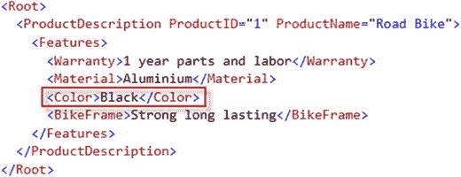

图 5-7.
显示 `Color` 元素值被更新后的结果


### 工作原理

`modify()`方法实现了`replace value of`语句，用于更新 XML 实例元素的值。当 XML 数据类型在 SQL Server 205 中引入时，许多 DBA 和 SQL Server 开发者感到困惑（至少我认识的所有 SQL Server 专业人员都是如此）。我们原本期待一个名为“update”之类的指令；然而，`replace value of`指令却用于更新 XML 实例的元素和属性。之前的配方为我们提供了`insert`指令的多种“变体”，这在实践上是正确的。插入过程对 XML 实例有很多选项。与插入相比，更新 XML 实例元素相当直接。要修改 XML 实例元素值，你需要以下步骤：

1.  指定`modify()`方法的`replace value of`语句。
2.  左括号，提供指向 XML 元素的 XPath 路径；为目标元素实现`text()`函数；闭合括号并指定单例。
3.  在`with`关键字后，用双引号指定新的元素值。

例如：

```
modify('replace value of
(/Root/ProductDescription/Features/Color/text())[1]
with "Black"')
```

## 5-8. 更新 XML 属性值

### 问题

你想更新 XML 实例中某个属性的值。

### 解决方案

更新 XML 实例属性的解决方案与更新元素相对接近。然而，更新属性有一些特定之处，如清单 5-12 所示。`ProductName`属性的值从“Road Bike”被修改为“Mountain Bike”。

```
DECLARE @XMLDoc xml;
SET @XMLDoc =
'
<ProductDescription ProductName="Road Bike">
  <Features>
    <Feature>1 year parts and labor</Feature>
    <Feature>Aluminium</Feature>
    <Feature>Silver</Feature>
    <Feature>Strong long lasting</Feature>
  </Features>
</ProductDescription>
';
SET @XMLDoc.modify('replace value of
(/Root/ProductDescription/@ProductName)[1] with "Mountain Bike"');
SELECT @XMLDoc;
```

清单 5-12. 更新 `ProductName` 属性

结果如图 5-8 所示。

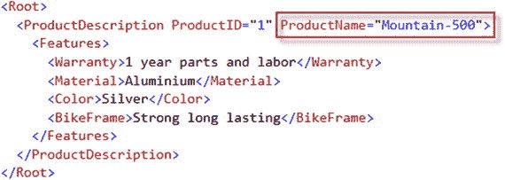

图 5-8. 属性 `ProductName` 值更新后的结果展示

### 工作原理

更新 XML 实例属性与更新元素没有太大区别。要修改 XML 实例属性值，你需要：

1.  指定`modify()`方法的`replace value of`语句。
2.  指向要更新的 XML 属性的 XPath 路径，属性名前加上`@`符号，并用括号括起来。XPath 路径必须是单例节点。
3.  在`with`关键字后，用双引号指定新的属性值。

修改元素和属性的主要区别在于，属性必须以`@`符号为前缀，并且更新属性不需要`text()`节点测试。

## 5-9. 删除 XML 属性

### 问题

你想从 XML 属性中删除一个属性。

### 解决方案

在`modify()`方法中使用`delete`语句，如清单 5-13 所示。

```
DECLARE @XMLDoc xml;
SET @XMLDoc =
'
<ProductDescription ProductName="Road Bike">
  <Features>
    <Feature>1 year parts and labor</Feature>
    <Feature>Aluminium</Feature>
    <Feature>Silver</Feature>
    <Feature>Strong long lasting</Feature>
  </Features>
</ProductDescription>
';
SET @XMLDoc.modify('delete /Root/ProductDescription/@ProductName')
SELECT @XMLDoc;
```

清单 5-13. 从 XML 实例中删除 `ProductName` 属性

结果如图 5-9 所示。

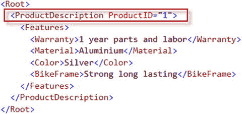

图 5-9. 从 XML 实例中删除属性后的结果

### 工作原理

删除属性的语法比更新属性的语法更简单。要从 XML 实例中删除属性，`modify()`方法需要`delete`语句和指向该属性的 XPath 路径。记住属性以`@`符号为前缀。此外，`ProductDescription`元素在 XML 文档中是唯一的，因此这种情况下不需要单例。例如：

```
modify('delete /Root/ProductDescription/@ProductName')
```

在需要移除元素所有属性的情况下，XPath 应包含目标元素路径后跟`/@*`，如清单 5-14 所示。

```
DECLARE @XMLDoc xml;
SET @XMLDoc =
'
<ProductDescription ProductName="Road Bike">
  <Features>
    <Feature>1 year parts and labor</Feature>
    <Feature>Aluminium</Feature>
    <Feature>Silver</Feature>
    <Feature>Strong long lasting</Feature>
  </Features>
</ProductDescription>
';
SET @XMLDoc.modify('delete /Root/ProductDescription/@*')
SELECT @XMLDoc;
```

清单 5-14. 删除 `ProductDescription` 元素的所有属性

结果如图 5-10 所示。

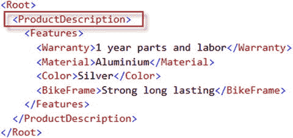

图 5-10. `<ProductDescription>` 元素所有属性被删除后的结果展示

## 5-10. 删除 XML 元素

### 问题

你想从 XML 实例中删除一个元素。

### 解决方案

从 XML 实例中移除元素的机制与移除属性非常相似。从示例 XML 中删除`Color`元素的解决方案在清单 5-15 中演示。

```
DECLARE @XMLDoc xml;
SET @XMLDoc =
'
<ProductDescription ProductName="Road Bike">
  <Features>
    <Feature>1 year parts and labor</Feature>
    <Feature>Aluminium</Feature>
    <Feature>Silver</Feature>
    <Feature>Strong long lasting</Feature>
  </Features>
</ProductDescription>
';
SET @XMLDoc.modify('delete /Root/ProductDescription/Features/Color')
SELECT @XMLDoc;
```

清单 5-15. 从 XML 实例中删除 `Color` 元素

结果如图 5-11 所示。

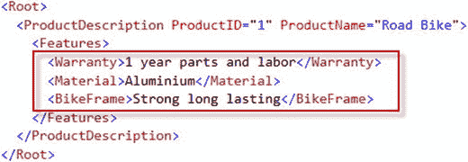

图 5-11. 从 XML 实例中删除 `Color` 元素后的结果

### 工作原理

要从 XML 实例中删除元素，`modify()`方法指定`delete`语句和指向目标元素的 XPath 路径。当 XML 中有多个同名元素时，删除特定元素需要单例，例如：

```
<Color>Aluminium</Color>
<Color>Silver</Color>
<Color>Blue</Color>
<Feature>Strong long lasting</Feature>
modify('delete /Root/ProductDescription/Features/Color[1]')
```

删除后的结果是`<Color>Silver</Color>`消失，`<Color>Blue</Color>`保留。

要从父元素中删除所有子元素，XPath 应指向父元素加上`/*`，如清单 5-16 所示。

```
DECLARE @XMLDoc xml;
SET @XMLDoc =
'
<ProductDescription ProductName="Road Bike">
  <Features>
    <Feature>1 year parts and labor</Feature>
    <Feature>Aluminium</Feature>
    <Feature>Silver</Feature>
    <Feature>Strong long lasting</Feature>
  </Features>
</ProductDescription>
';
SET @XMLDoc.modify('delete /Root/ProductDescription/Features/*')
SELECT @XMLDoc;
```

清单 5-16. 从 `Features` 元素中删除所有子元素

结果如图 5-12 所示。

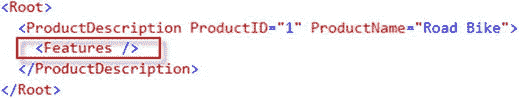

图 5-12. `Features` 元素所有子元素被删除后的 XML 结果

要删除注释、处理指令，甚至是元素内的文本，你可以将节点测试与`delete`一起使用，如清单 5-17 所示。结果如图 5-13 所示。

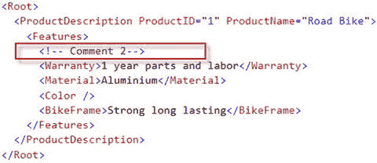

图 5-13. 删除结果展示

```
DECLARE @XMLDoc xml;
SET @XMLDoc =
'
<ProductDescription ProductName="Road Bike">
  <Features>
    <Feature>1 year parts and labor</Feature>
    <Feature>Aluminium</Feature>
    <Feature>Silver</Feature>
    <Feature>Strong long lasting</Feature>
  </Features>
</ProductDescription>
';
SET @XMLDoc.modify('delete (/Root/ProductDescription/Features/comment())[1]');
SET @XMLDoc.modify('delete (/Root/ProductDescription/Features/Color/text())[1]');
SET @XMLDoc.modify('delete (/Root/ProductDescription/Features/processing-instruction())[1]');
SELECT @XMLDoc;
```

清单 5-17. 使用节点测试删除其他类型的 XML 节点

## 总结

`modify()`方法为操作 XML 实例的节点提供了全面的解决方案。这些指令：

*   `insert`
*   `replace value of`
*   `delete`

这些指令能够以相对简单的语法修改 XML 实例中的任何元素和属性。

在下一章中，配方将涵盖如何高效地过滤 XML。


