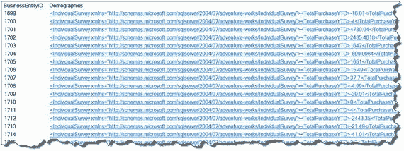
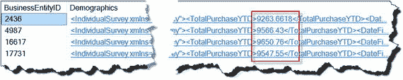
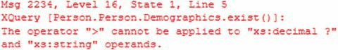
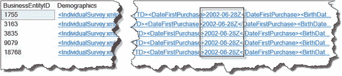

# 6. 过滤 XML

XQuery 的过滤机制与 T-SQL 的 WHERE 子句相比存在一些差异和特殊规范。根据我的经验，当数据库管理员和开发人员为 XQuery 实现过滤时，通常基于 T-SQL 策略，或者创建效率低下且可能非常难以维护的动态 SQL，尤其是当过滤器以动态 SQL 形式实现时。本章将通过许多示例来演示如何为 XQuery 请求实现过滤器。

## 6-1. 使用 exist( ) 方法

### 问题

你希望判断在 XML 数据中是否存在特定的元素或属性。

### 解决方案

`exist()` 方法允许你判断在 XML 实例中是否存在某个元素或属性。代码清单 6-1 演示了使用 `exist()` 方法来检索所有在根元素 `IndividualSurvey` 下直接包含 `YearlyIncome` 元素的 XML 实例。

```sql
WITH XMLNAMESPACES
(
DEFAULT N'http://schemas.microsoft.com/sqlserver/2004/07/adventure-works/IndividualSurvey'
)
SELECT BusinessEntityID,
Demographics
FROM Person.Person
WHERE Demographics.exist('IndividualSurvey/YearlyIncome') = 1;
代码清单 6-1.
检索包含 YearlyIncome 元素的实例
```

查询结果如图 6-1 所示。



图 6-1.

通过 `YearlyIncome` 元素过滤数据

### 工作原理

`exist()` 方法验证提供的参数是否存在，然后返回：

*   `TRUE`（位值 `1`），当 XQuery 表达式返回非空结果时。
*   `FALSE`（位值 `0`），当 XQuery 表达式返回空结果时。
*   `NULL`，当 XQuery 表达式传入的是 `NULL` 或 XML 实例是 `NULL` 时。

因此，要检测 XML 实例中是否包含 `YearlyIncome` 元素，`exist()` 方法接受一个 XQuery 表达式，该表达式应用于 XML 实例时会返回一个或多个 `YearlyIncome` 元素。代码清单 6-2 中的 XML 是代码清单 6-1 中查询所针对的示例 XML 数据。

```xml
-16.01
2003-09-01Z
1961-02-23Z
M
25001-50000
M

Graduate Degree
Clerical

0-1 Miles

代码清单 6-2.
示例 XML 数据
```

代码清单 6-2 中的 XML 结构相对简单。根元素是 `IndividualSurvey`，它最多可以包含 13 个子元素。

要查询此 XML 并返回所有 XML 实例包含 `YearlyIncome` 元素的行，我们需要引用 XML 命名空间。在提供的解决方案中，为简单起见，XML 命名空间被设置为 `DEFAULT`，如下所示：

```sql
WITH XMLNAMESPACES(DEFAULT
'http://schemas.microsoft.com/sqlserver/2004/07/adventure-works/IndividualSurvey')
```

在 `WHERE` 子句中，`exist()` 方法接受一个指向我们目标元素的 XQuery 表达式。当 XQuery 表达式返回非空结果时，`exist()` 方法将返回 `TRUE`：

```sql
WHERE Demographics.exist('IndividualSurvey/YearlyIncome') = 1
```

当 `YearlyIncome` 元素存在于 XML 实例中时，`exist()` 方法返回值 `1`（代表 `TRUE` 的数值），该行便会包含在结果集中。

检测属性的机制类似，只是 XQuery 语法上有一些细微差别以匹配属性。来自 `Demographics` 列的 XML 数据不包含属性。示例 6-2 展示了当 `YearlyIncome` 元素具有 `currency` 属性时的情况。

```sql
DECLARE @survey XML = N'

-16.01
2003-09-01Z
1961-02-23Z
M
25001-50000
M

Graduate Degree
Clerical

0-1 Miles
示例 6-2.
展示带有 currency 属性的 YearlyIncome 元素

</IndividualSurvey>';
```

在这种特定情况下，解决方案将如代码清单 6-3 所示。

```sql
WITH XMLNAMESPACES
(
DEFAULT 'http://schemas.microsoft.com/sqlserver/2004/07/adventure-works/IndividualSurvey'
)
SELECT @survey,
CASE WHEN @survey.exist('IndividualSurvey/YearlyIncome/@currency') = 1 THEN N'IndividualSurvey/YearlyIncome/@currency attribute is present.'
ELSE N'currency attribute is NOT present.'
END AS hasCurrency;
代码清单 6-3.
搜索 @currency 属性
```

如示例所示，要检测属性，你需要提供指向该属性的 XPath。

## 6-2. 使用 exist( ) 方法过滤 XML 值

### 问题

你希望根据值来过滤 XML 列，但查询不实现 XQuery 方法，例如 `nodes()`、`value()` 和 `query()`。

### 解决方案

`exist()` 方法可以提供针对 XML 文本节点的过滤，特别是在需要检查 XML 实例以满足特定搜索条件时。同时，`SELECT` 子句不包含任何 XQuery 处理。代码清单 6-4 检索所有 `TotalPurchaseYTD` 元素值大于 `9,000` 的 XML 实例。

```sql
WITH XMLNAMESPACES
(
DEFAULT N'http://schemas.microsoft.com/sqlserver/2004/07/adventure-works/IndividualSurvey'
)
SELECT BusinessEntityID,
Demographics
FROM Person.Person
WHERE Demographics.exist('IndividualSurvey[TotalPurchaseYTD > 9000]') = 1;
代码清单 6-4.
使用 XQuery 根据值过滤 XML 实例
```

图 6-2 展示了查询结果。



图 6-2.

返回 `TotalPurchaceYTD` 大于 `9000.00` 的行


### 工作原理

除了检测 XML 元素和属性（如 Recipe 6-1 所述）之外，`exist()` 方法还可以根据实例值高效地过滤 XML。当查询从表中返回列，并且 XML 实例不是分解过程的必需部分，但同时需要根据 XML 值过滤表中的行时，可以使用 `exist()` 方法作为过滤机制，基于搜索条件返回行。

与 Recipe 6-1 中演示的区别在于，`exist()` 方法有一个针对 `TotalPurchaseYTD` 元素值的过滤条件，而不是检查元素是否存在，例如：

```xquery
Demographics.exist('IndividualSurvey[TotalPurchaseYTD > 9000]')
```

将 XML 实例的过滤器与 T-SQL 的 `WHERE` 子句进行比较时，存在一些差异。XML 过滤器为 `exist()` 方法指定了一个用方括号（`[`，`]`）括起来的布尔表达式（`nodes()` 方法的过滤器将在本章后面演示）。解决方案演示了过滤以返回 `TotalPurchaseYTD` 值大于 $9000.00 的行。`exist()` 方法的过滤器参数包含以下组件：

1.  父元素 `IndividualSurvey`
2.  左方括号
3.  带有比较运算符和值的子元素 `TotalPurchaseYTD`
4.  右方括号

将它们组合在一起，我们的 XQuery 过滤器具有以下语法：

```xquery
IndividualSurvey[TotalPurchaseYTD > 9000]
```

> **注意**
> 应用过滤器时，路径中的步骤是隐含的。例如，实际的步骤应该是：`IndividualSurvey/.[TotalPurchaseYTD > 9000]`。但当应用过滤器时，步骤被隐含：`IndividualSurvey[TotalPurchaseYTD > 9000]`。

XML 比较运算符列于表 6-1 中。

**表 6-1. XML 比较运算符演示**

| 运算符 | 值 | 描述 |
| :--- | :--- | :--- |
| `=` | `eq` | 等于 |
| `!=` | `ne` | 不等于 |
| `>` | `gt` | 大于 |
| `<` | `lt` | 小于 |
| `>=` | `ge` | 大于等于 |
| `<=` | `le` | 小于等于 |
| `<<` | `N/A` | 节点顺序在前比较 |
| `>>` | `N/A` | 节点顺序在后比较 |
| `is` | `N/A` | 节点标识相等 |

“文档顺序”是 XML 的一个核心概念。它是节点顺序比较的基础。XQuery 节点顺序比较运算符 `<<`、`>>` 和 `is` 对于读者来说可能是新的，因为在 T-SQL 中没有等效的运算符。在 XQuery 中，`is` 比较运算符检查节点标识相等；也就是说，它告诉你运算符两侧的两个节点是否是同一个节点。节点运算符 `<<`（在前）和 `>>`（在后）基于文档顺序比较 XML 节点。如果 `<<` 运算符左侧的节点在文档顺序上先于右侧的节点，则返回 `true`。如果 `>>` 运算符左侧的节点在文档顺序上跟随右侧的节点，则返回 `true`。清单 6-5 比较了 `<Education>` 的第一个实例与 `<Occupation>` 元素节点位置，返回 `true`，因为在文档顺序上 `<Education>` 元素出现在 `<Occupation>` 元素之前。

```xquery
WITH XMLNAMESPACES
(
DEFAULT N'http://schemas.microsoft.com/sqlserver/2004/07/adventure-works/IndividualSurvey'
)
SELECT BusinessEntityID,
Demographics.value('(/IndividualSurvey/Education)[1]', 'NVARCHAR(50)') AS Education,
Demographics.value('(/IndividualSurvey/Occupation)[1]', 'NVARCHAR(50)') AS Occupation,
Demographics.value('(/IndividualSurvey/Education)[1] << (/IndividualSurvey/Occupation)[1]', 'NVARCHAR(10)') AS Precedes
FROM Person.Person
WHERE Demographics IS NOT NULL;
```

XML 过滤不支持数据类型之间的隐式转换，如果尝试比较两个不兼容的值，则会返回错误。例如，`TotalPurchaseYTD` 元素期望一个 `xs:decimal` 类型，但值被实现为 `xs:string` 类型。在这种情况下，SQL Server 会抛出错误，清单 6-6 触发了错误消息。

**图 6-3. 显示错误消息**


```xquery
WITH XMLNAMESPACES
(
DEFAULT N'http://schemas.microsoft.com/sqlserver/2004/07/adventure-works/IndividualSurvey'
)
SELECT BusinessEntityID,
Demographics
FROM Person.Person
WHERE Demographics.exist('IndividualSurvey[TotalPurchaseYTD > "9000"]') = 1;
```

**清单 6-6. 引发类型转换错误**

字符串类型值需要用双引号括起来，数字类型值则不需要。日期、时间和日期时间类型是例外，XML 过滤器直接处理转换，如清单 6-7 所示。

```xquery
WITH XMLNAMESPACES
(
DEFAULT N'http://schemas.microsoft.com/sqlserver/2004/07/adventure-works/IndividualSurvey'
)
SELECT BusinessEntityID,
Demographics
FROM Person.Person
WHERE Demographics.exist
('IndividualSurvey[DateFirstPurchase=xs:date("2002-06-28Z")]') = 1;
```

**清单 6-7. 使用日期类型过滤**

结果如图 6-4 所示。

**图 6-4. 按日期过滤 XML 实例的结果**


XQuery 支持以下日期和时间转换函数：

*   `xs:date()` 用于日期类型
*   `xs:time()` 用于时间类型
*   `xs:dateTime()` 用于日期时间类型

`DateFirstPurchase` 元素值是“2002-06-28Z”，其中“Z”是零子午线，即 Z 说明符（“Z”实际上表示 UTC 偏移量 +00:00）。对于过滤值，“Z”是可选的，因此，`xs:date("2002-06-28")` 和 `xs:date("2002-06-28Z")` 将返回相同的结果。

