# 6-3. 在 XML 实例中任何位置查找所有 XML 元素的出现

### 问题

您想要定位 XML 元素的所有出现，无论它在 XML 实例中的哪个位置。

### 解决方案

在 XQuery 路径表达式中的步骤前放置双斜杠 `//`（`/descendant-or-self::node()/` 的简写），为您提供了一个快捷步骤运算符，以检索当前上下文节点及其所有后代节点。当它出现在 XQuery 路径表达式的开头时，它会检索 XML 数据中的所有节点。您可以在 `node()` 方法中使用此方法，以避免显式指定对目标元素的完整引用，如清单 6-8 所示。

```xquery
WITH XMLNAMESPACES
(
N'http://schemas.microsoft.com/sqlserver/2004/07/adventure-works/Resume' AS ns
)
SELECT
Info.value(N'(/ns:Resume/ns:Name/ns:Name.First)[1]', 'NVARCHAR(30)') AS FirstName,
Info.value(N'(/ns:Resume/ns:Name/ns:Name.Last)[1]', 'NVARCHAR(30)') AS LastName,
Info.value('fn:string(../../../../ns:Address[1]/ns:Addr.Location[1]/ns:Location[1]/ns:Loc.CountryRegion[1])', 'NVARCHAR(100)') AS Country,
Info.value('fn:string(../ns:Tel.Type[1])', 'NVARCHAR(15)') AS PhoneType,
Info.value('fn:string(../ns:Tel.AreaCode[1])', 'NVARCHAR(9)') AS AreaCode,
Info.value('fn:string(.)', 'NVARCHAR(20)') AS CandidatePhone
FROM HumanResources.JobCandidate
CROSS APPLY Resume.nodes('//ns:Tel.Number') AS Person(Info);
```

**清单 6-8. 通过存储过程插入新行**

查询结果如图 6-5 所示。

**图 6-5. 显示 SQL 结果**
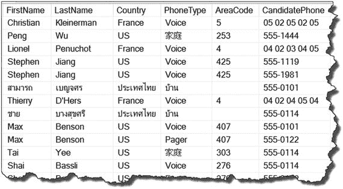


### 工作原理

SQL Server XQuery 可以通过在 `nodes()` 方法中为源元素添加前导双斜杠来缩短对源元素的引用，例如 `Resume.nodes(‘//ns:Tel.Number’)`。这里 “//” 是 XQuery 路径步骤 “`descendant-or-self::node()`” 的快捷方式。当搜索 `nodes()` 方法所操作的 XML 数据中包含的所有元素时，XQuery 引擎会使用这种方式。

`Tel.Number` 元素（作为 `HumanResources.JobCandidate` 表的 `Resume` 列的一部分）的层级结构如图 6-6 所示。

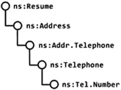

图 6-6. 展示 Tel.Number 元素层级

`nodes()` 方法针对 `Tel.Number` 元素的完全限定 XQuery 路径表达式在代码清单 6-9 中演示。

```
WITH XMLNAMESPACES
(
N'http://schemas.microsoft.com/sqlserver/2004/07/adventure-works/Resume' AS ns
)
SELECT
.
.
.
FROM HumanResources.JobCandidate
CROSS APPLY Resume.nodes
('/ns:Resume/ns:Address/ns:Addr.Telephone/ns:Telephone/ns:Tel.Number')
AS Person(Info);
```

代码清单 6-9. 演示对 Tel.Number 元素的完全限定引用

注意

显然，“`//`” 轴操作符提供了一种设置对深层子元素引用的便捷方式。然而，在最终决定之前应对此技术进行彻底测试，因为它可能在 XML 分解（shredding）过程中导致性能问题。第 7 章将提供有关 `nodes()` 方法性能优化的更多细节。

## 6-4. 通过单值过滤

### 问题

在分解 XML 实例时，你需要设置一个单值过滤器。

### 解决方案

在 `nodes()` 方法中设置过滤器，如代码清单 6-10 所示。结果如图 6-7 所示。

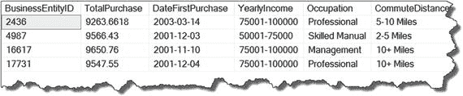

图 6-7. 过滤后的 XQuery 查询结果

```
WITH XMLNAMESPACES
(
DEFAULT N'http://schemas.microsoft.com/sqlserver/2004/07/adventure-works/IndividualSurvey'
)
SELECT BusinessEntityID,
ref.value('TotalPurchaseYTD', 'MONEY') AS TotalPurchase,
ref.value('DateFirstPurchase', 'DATE') AS DateFirstPurchase,
ref.value('YearlyIncome', 'NVARCHAR(20)') AS YearlyIncome,
ref.value('Occupation', 'NVARCHAR(15)') AS Occupation,
ref.value('CommuteDistance', 'NVARCHAR(15)') AS CommuteDistance
FROM Person.Person CROSS APPLY
Demographics.nodes('IndividualSurvey[TotalPurchaseYTD > 9000]') AS dmg(ref);
```

代码清单 6-10. 在 nodes() 方法中设置单值过滤器

### 工作原理

XQuery 语言支持在 `nodes()` 方法内部进行过滤。XQuery 过滤器的语法与 T-SQL 的 `WHERE` 子句非常相似，但不完全相同。表 6-1 列出了所有用于 XQuery 过滤器的比较运算符（请参阅“工作原理”部分中的食谱 6-2）。它们基本相同，只有一个小区别：不等于运算符，XQuery 仅实现 “!=” 作为选项。另一方面，T-SQL 为 DBA 和开发人员在 “!=” 和 “<>” 运算符之间提供了选择（T-SQL 的最佳实践是使用 “<>” 运算符）。

要在 `nodes()` 方法中设置单值过滤器，你需要：

1.  父元素 `IndividualSurvey`
2.  开括号 `[`
3.  带有比较运算符和要比较值的子元素 `TotalPurchaseYTD`
4.  闭括号 `]`

实际上，所有步骤与食谱 6-2 中为 `exist()` 方法演示的步骤相同。例如，两者的过滤器部分都是：

```
IndividualSurvey[TotalPurchaseYTD > 9000]
```

然而，`exist()` 方法的性能比 `nodes()` 方法稍好。由于这两种方法服务于完全不同的功能，`exist()` 方法用于过滤，而 `nodes()` 用于分解。

## 6-5. 通过 T-SQL 变量过滤 XML

### 问题

你希望基于 T-SQL 变量值过滤 XML 结果。

### 解决方案

SQL Server XQuery 函数 `sql:variable()` 允许你的 XQuery 查询表达式访问 T-SQL 变量或参数的值，以便将其包含在搜索条件中。`sql:variable()` 函数的最佳实现和演示是存储过程，如代码清单 6-11 所示。

```
CREATE PROCEDURE dbo.usp_DemographicsByYearlyIncome
@YearlyIncome NVARCHAR(20)
AS
BEGIN
WITH XMLNAMESPACES
(
DEFAULT N'http://schemas.microsoft.com/sqlserver/2004/07/adventure-works/IndividualSurvey'
)
SELECT BusinessEntityID,
ref.value('TotalPurchaseYTD', 'MONEY') AS TotalPurchase,
ref.value('DateFirstPurchase', 'DATE') AS DateFirstPurchase,
ref.value('YearlyIncome', 'NVARCHAR(20)') AS YearlyIncome,
ref.value('Occupation', 'NVARCHAR(15)') AS Occupation,
ref.value('CommuteDistance', 'NVARCHAR(15)') AS CommuteDistance
FROM Person.Person
CROSS APPLY Demographics.nodes('IndividualSurvey[YearlyIncome=sql:variable("@YearlyIncome")]') AS dmg(ref);
END;
GO
```

代码清单 6-11. 使用 sql:variable() 函数创建存储过程

### 工作原理

XQuery 具有 `sql:variable()` 函数，该函数允许你在不显式指定搜索条件的情况下过滤 XQuery。`sql:variable()` 函数将 T-SQL 声明的变量或存储过程参数渲染并映射到 XQuery。`sql:variable()` 函数可以是 `nodes()` 和 `exist()` 方法的一部分，以提供过滤功能。

实现 `sql:variable()` 函数以过滤 XML 元素的语法如下：

```
parentElement[childElement comparisonOperator sql:variable(“@varible”)]
```

实现 `sql:variable()` 函数以过滤 XML 属性的语法如下：

```
parentElement[@attribute comparisonOperator sql:variable(“@varible”)]
```

代码清单 6-12 演示了使用不同参数值多次执行 `usp_DemographicsByYearlyIncome` 存储过程。

```
EXECUTE dbo.usp_DemographicsByYearlyIncome '0-25000';
GO
EXECUTE dbo.usp_DemographicsByYearlyIncome '25001-50000';
GO
EXECUTE dbo.usp_DemographicsByYearlyIncome '50001-75000';
GO
EXECUTE dbo.usp_DemographicsByYearlyIncome '75001-100000';
GO
EXECUTE dbo.usp_DemographicsByYearlyIncome 'greater than 100000';
GO
```

代码清单 6-12. 调用 usp_DemographicsByYearlyIncome 存储过程

使用参数值 '0-25000' 执行存储过程的结果如图 6-8 所示。

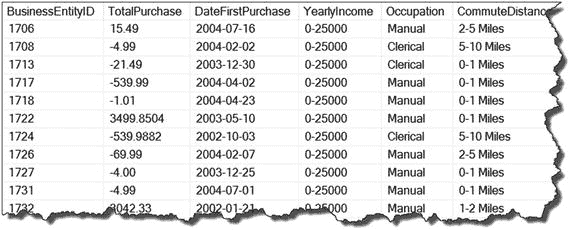

图 6-8. 显示存储过程结果

注意

`sql:variable( )` 函数是 XQuery 的一部分；因此，该函数区分大小写，并且必须仅以小写形式引用。任何其他大小写的实现都将触发错误：Msg 2395, … There is no function ‘{urn:schemas-microsoft-com:xml-sql}:Variable( )’。但是，传递给 `sql:variable( )` 函数的变量名不区分大小写。

## 6-6. 与值序列进行比较

### 问题

你需要通过值列表过滤 XML 实例，类似于 T-SQL `WHERE` 子句中的 `IN` 谓词。


### 解决方案

清单 6-13 演示了如何在 XML 实例中，通过针对一个值序列使用“=`”通用比较运算符来模拟 `IN` 谓词。

```sql
WITH XMLNAMESPACES
(
DEFAULT N'http://schemas.microsoft.com/sqlserver/2004/07/adventure-works/IndividualSurvey'
)
SELECT BusinessEntityID,
ref.value('TotalPurchaseYTD', 'MONEY') AS TotalPurchase,
ref.value('DateFirstPurchase', 'DATE') AS DateFirstPurchase,
ref.value('YearlyIncome', 'NVARCHAR(20)') AS YearlyIncome,
ref.value('Occupation', 'NVARCHAR(15)') AS Occupation,
ref.value('CommuteDistance', 'NVARCHAR(15)') AS CommuteDistance
FROM Person.Person
CROSS APPLY Demographics.nodes('IndividualSurvey[Occupation=("Clerical","Manual", "Professional")]') AS dmg(ref);
```

清单 6-13. 发送值列表以筛选 XML 实例

查询结果如图 6-9 所示。

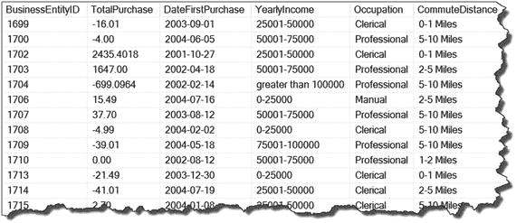

图 6-9. 显示经值列表处理后的 XQuery 结果

### 工作原理

通过值序列筛选 XML 实例的机制相对简单，但并不直观。DBA 和开发人员最常犯的错误是试图采用 T-SQL 中的 `IN` 谓词来定义此筛选器。然而，解决方案要简单得多。在 `nodes()` 方法中列出值的语法是：

```xquery
parentElement[childElement = (value1, value2, value3,...)]
```

当通过值列表筛选数据时，T-SQL 与 XQuery 的区别在于：XQuery 语法使用等于通用比较运算符 (`=`)，而 T-SQL 中的 `IN` 谓词则使用 `WHERE` 子句。

## 6-7. 匹配指定的字符串模式

### 问题

你想根据字符串模式筛选 XML 实例。

### 解决方案

XQuery `fn:contains()` 函数可匹配 XML 元素或属性中的字符串模式，如清单 6-14 所示。

```sql
WITH XMLNAMESPACES
(
DEFAULT N'http://schemas.microsoft.com/sqlserver/2004/07/adventure-works/IndividualSurvey'
)
SELECT BusinessEntityID,
Demographics,
ref.value('TotalPurchaseYTD', 'MONEY') AS TotalPurchase,
ref.value('DateFirstPurchase', 'DATE') AS DateFirstPurchase,
ref.value('YearlyIncome', 'NVARCHAR(20)') AS YearlyIncome,
ref.value('Occupation', 'NVARCHAR(15)') AS Occupation,
ref.value('CommuteDistance', 'NVARCHAR(15)') AS CommuteDistance
FROM Person.Person
CROSS APPLY Demographics.nodes('IndividualSurvey[ ( fn:contains(Occupation[1], "Manual" ) ) ]') AS dmg(ref);
```

清单 6-14. 在 Occupation 元素中搜索字符串 “Manual”

图 6-10 展示了结果。

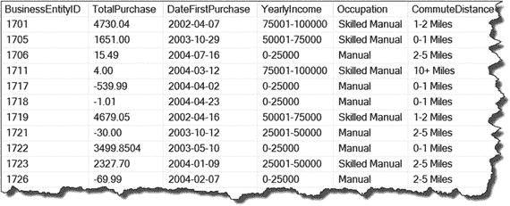

图 6-10. 显示 IndividualSurvey 元素匹配值模式的 XQuery 查询结果

### 工作原理

XQuery `contains()` 函数有两个参数：
1. 一个 XML 实例元素或属性
2. 一个字符串模式

`contains()` 函数返回一个 `xs:boolean` 数据类型 (`true`, `false`)，具体取决于参数 1 中的元素或属性值是否匹配参数 2 中的字符串模式。当参数被通配符包围时（例如：`'%ARGUMENT%'`，即匹配任何出现情况），`contains()` 函数机制与 T-SQL `LIKE` 运算符类似。

不幸的是，SQL Server 不支持 XQuery 函数 `fn:starts-with()` 和 `fn:ends-with()`。然而，当你的任务需要使用类似 `fn:starts-with()` 或 `fn:ends-with()` 的功能来筛选值时，你可以使用 XQuery 和 T-SQL 混合解决方案来完成此任务，如清单 6-15 所示。

```sql
WITH XMLNAMESPACES
(
DEFAULT N'http://schemas.microsoft.com/sqlserver/2004/07/adventure-works/IndividualSurvey'
),
Subset AS
(
SELECT BusinessEntityID,
ref.value('TotalPurchaseYTD', 'MONEY') AS TotalPurchase,
ref.value('DateFirstPurchase', 'DATE') AS DateFirstPurchase,
ref.value('YearlyIncome', 'NVARCHAR(20)') AS YearlyIncome,
ref.value('Occupation', 'NVARCHAR(15)') AS Occupation,
ref.value('CommuteDistance', 'NVARCHAR(15)') AS CommuteDistance
FROM Person.Person
CROSS APPLY Demographics.nodes('IndividualSurvey[ fn:contains(Occupation[1], "Manual" ) ]') AS dmg(ref)
)
SELECT BusinessEntityID,
TotalPurchase,
DateFirstPurchase,
YearlyIncome,
Occupation,
CommuteDistance
FROM Subset
WHERE Occupation LIKE 'Manual%';
```

清单 6-15. 使用 `fn:contains()` XQuery 和 T-SQL 混合解决方案筛选 XML 实例

图 6-11 展示了结果。

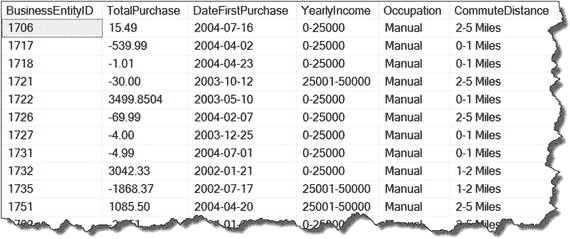

图 6-11. 显示 XQuery 和 T-SQL 混合解决方案的结果

## 6-8. 筛选值范围

### 问题

你想根据值范围筛选 XML 实例，类似于 T-SQL 的 `BETWEEN` 运算符。

### 解决方案

XQuery 逻辑 `and` 运算符可用于连接两个谓词，为 XML 实例定义范围筛选器，如清单 6-16 所示。

```sql
WITH XMLNAMESPACES
(
DEFAULT N'http://schemas.microsoft.com/sqlserver/2004/07/adventure-works/IndividualSurvey'
)
SELECT BusinessEntityID,
ref.value('TotalPurchaseYTD', 'MONEY') TotalPurchase,
ref.value('DateFirstPurchase', 'DATE') DateFirstPurchase,
ref.value('YearlyIncome', 'NVARCHAR(20)') YearlyIncome,
ref.value('Occupation', 'NVARCHAR(15)') Occupation,
ref.value('CommuteDistance', 'NVARCHAR(15)') CommuteDistance
FROM Person.Person
CROSS APPLY Demographics.nodes('IndividualSurvey[ TotalPurchaseYTD >= 1000 and TotalPurchaseYTD <= 2000 ]') AS dmg(ref);
```

清单 6-16. 实现值范围筛选器

结果如图 6-12 所示。

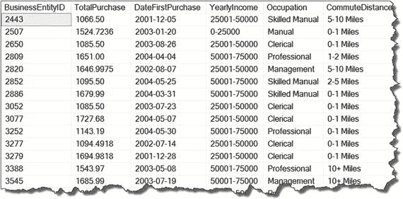

图 6-12. 显示应用值范围筛选条件的 XQuery 结果

### 工作原理

为 XQuery 设置值范围筛选器所使用的实现方法，与使用 T-SQL `WHERE` 子句的方法类似。T-SQL 有 `BETWEEN` 运算符作为值范围筛选的额外选项。然而，XQuery 筛选器 `“elementName >= value and elementName <= value”` 实现了与 `BETWEEN` 运算符相同的功能。因此，清单 6-16 中的解决方案展示了 XQuery 的值范围筛选器，例如：`‘IndividualSurvey[ TotalPurchaseYTD >= 1000 and TotalPurchaseYTD <= 2000 ]’`。

**注意**
XQuery 中的所有运算符同样区分大小写。为避免错误，请仅使用小写的 `“and”` 和 `“or”` 运算符。

## 6-9. 按多个条件筛选

### 问题

你想根据多个元素、属性或条件筛选 XML 实例。

### 解决方案

XQuery 提供了 `and` 和 `or` 逻辑运算符来创建复合谓词，从而实现针对 XML 实例的多个筛选条件，如清单 6-17 所示。

```sql
WITH XMLNAMESPACES
(
DEFAULT N'http://schemas.microsoft.com/sqlserver/2004/07/adventure-works/IndividualSurvey'
)
SELECT BusinessEntityID,
ref.value('TotalPurchaseYTD', 'MONEY') AS TotalPurchase,
ref.value('DateFirstPurchase', 'DATE') AS DateFirstPurchase,
ref.value('YearlyIncome', 'NVARCHAR(20)') AS YearlyIncome,
ref.value('Occupation', 'NVARCHAR(15)') AS Occupation,
ref.value('CommuteDistance', 'NVARCHAR(15)') AS CommuteDistance
FROM Person.Person
CROSS APPLY Demographics.nodes('IndividualSurvey[ TotalPurchaseYTD >= 1001
and TotalPurchaseYTD < 2000
and DateFirstPurchase >= xs:date("2004-07-30Z") ]'
) AS dmg(ref);
```

清单 6-17. 实现多个筛选条件

结果如图 6-13 所示。

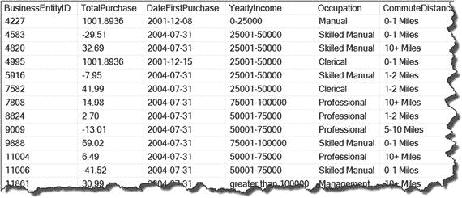

图 6-13. 显示应用多个筛选条件的 XQuery 结果


### 工作原理

本示例展示了清单 6-17 中针对多个元素的 XQuery 过滤器。此示例中的逻辑是筛选满足以下条件的 XML 实例：

1.  `TotalPurchaseYTD` 值介于 `1001` 和 `1004` 之间，**并且**
2.  `CommuteDistance` 等于 `“0-1 Miles,”` **或者**
3.  `DateFirstPurchase > “2004-07-30Z.”`

`nodes()` 方法实现了四个谓词以满足过滤条件。本示例展示了 `and` 和 `or` 这两个逻辑运算符。解决方案的 XQuery 表达式编写如下：

```xquery
IndividualSurvey[ TotalPurchaseYTD >= 1001
and TotalPurchaseYTD <= 1004
and CommuteDistance = "0-1 Miles"
or DateFirstPurchase > xs:date("2004-07-30") ]
```

通过这种方式，本示例演示了在 XML 实例中设置多个过滤条件。

注意：出于演示目的，本章选择了 `Person.Person` 表及其包含 19,972 行的 `Demographics` 列。然而，`Demographics` 列是以元素为中心的 XML。因此，未提供针对 XML 属性的过滤示例。引用 XML 属性时存在细微差别。当在谓词中引用属性时，其名称前有一个 `@` 符号。清单 6-17 展示了包含 `TotalPurchaseYTD` 元素 `currency` 属性的 XML 部分。因此，按属性进行过滤的语法为：`nodes(‘IndividualSurvey/YearlyIncome@currency=“$”)’)`。

### 6-10. 设置否定谓词

### 问题

您需要通过设置否定运算符来过滤 XML 实例。例如，T-SQL 的 `NOT IN` 谓词。

### 解决方案

XQuery 的否定函数是 `fn:not()`。当包裹在 XQuery 谓词周围时，`fn:not()` 返回该谓词的**有效布尔值**的相反值。清单 [6-18 展示了一个使用 `fn:not()` 的例子，同时也展示了通用比较运算符 `!=`，它本身等价于用 `fn:not()` 包裹一个 `=` 谓词。

```sql
WITH XMLNAMESPACES
(
DEFAULT N'http://schemas.microsoft.com/sqlserver/2004/07/adventure-works/IndividualSurvey'
)
SELECT BusinessEntityID,
ref.value('TotalPurchaseYTD[1]', 'MONEY') AS TotalPurchase,
ref.value('DateFirstPurchase[1]', 'DATE') AS DateFirstPurchase,
ref.value('YearlyIncome[1]', 'NVARCHAR(15)') AS YearlyIncome,
ref.value('Occupation[1]', 'NVARCHAR(15)') AS Occupation,
ref.value('CommuteDistance[1]', 'NVARCHAR(15)') AS CommuteDistance
FROM Person.Person
CROSS APPLY Demographics.nodes('IndividualSurvey[ YearlyIncome != "0-25000" and fn:not( Occupation = ( "Clerical","Manual","Professional" ) ) ]') AS dmg(ref);
```
清单 6-18. 演示否定运算符

结果如图 6-14 所示。

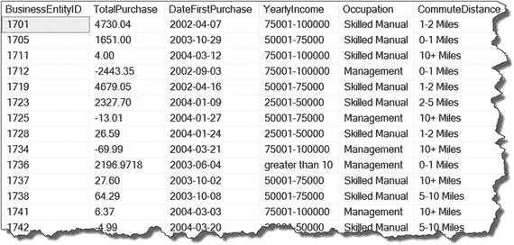

图 6-14. 显示带有否定谓词的 XQuery 结果

### 工作原理

XQuery 有三种否定运算符：

*   `!=` 用于通用比较的**不等于**运算符
*   `ne` 用于值比较的**不等于**运算符
*   `fn:not()` 用于列表和值范围的**函数**

在“解决方案”部分，清单 6-18 同时演示了针对单个值条件和值列表设置否定过滤器，例如：

`IndividualSurvey[YearlyIncome ne "0-25000" and fn:not( Occupation = ( “Clerical”, “Manual”, “Professional” ) ) ]`

### 6-11. 过滤空值

### 问题

您想根据元素或属性中是否存在值来过滤 XML 实例。

### 解决方案

XQuery 的 `fn:empty()` 函数用于验证给定的 XML 元素或属性是否有值，如清单 6-19 所示。

```sql
WITH XMLNAMESPACES
(
DEFAULT N'http://schemas.microsoft.com/sqlserver/2004/07/adventure-works/IndividualSurvey'
)
SELECT BusinessEntityID,
ref.value('TotalPurchaseYTD[1]', 'MONEY') AS TotalPurchase,
ref.value('DateFirstPurchase[1]', 'DATE') AS DateFirstPurchase,
ref.value('YearlyIncome[1]', 'NVARCHAR(15)') AS YearlyIncome,
ref.value('Occupation[1]', 'NVARCHAR(15)') AS Occupation,
ref.value('CommuteDistance[1]', 'NVARCHAR(15)') AS CommuteDistance
FROM person.Person
CROSS APPLY Demographics.nodes('IndividualSurvey[fn:not(fn:empty(Occupation))
and fn:not( Occupation = ( "Clerical", "Manual", "Professional" ) ) ]') AS dmg(ref);
```
清单 6-19. 验证值的存在性

结果如图 6-15 所示。

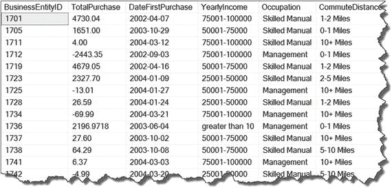

图 6-15. 显示实现 `fn:empty()` 函数作为过滤器后的 XQuery 结果

注意：XQuery 函数 `fn:empty( )` 是 XQuery 中 `exist( )` 方法的替代方案。`nodes( )` 方法不支持 `exist( )` 方法。因此，`fn:empty( )` 和 `fn:not( )` 在 `nodes( )` 方法中配合良好，其功能类似于 T-SQL 的 `IS NULL` 和 `IS NOT NULL` 运算符。

### 工作原理

`fn:empty()` 函数检查 XML 实例的元素和属性值是否为空。从逻辑上讲，`fn:empty()` 提供了检测 XML 数据中任何空值的功能。“解决方案”部分演示了返回 `Occupation` 元素有值的行的语法，即该元素不为空。因此，在清单 6-14 中同时使用了 `fn:not()` 和 `fn:empty()`：

```xquery
IndividualSurvey fn:not( fn:empty( Occupation ) )
```

如“解决方案”部分所述，`fn:empty()` 函数是 `exist()` 方法的替代方案，见清单 [6-20。

```sql
WITH XMLNAMESPACES
(
DEFAULT N'http://schemas.microsoft.com/sqlserver/2004/07/adventure-works/IndividualSurvey'
)
SELECT BusinessEntityID,
ref.value('TotalPurchaseYTD[1]', 'MONEY') AS TotalPurchase,
ref.value('DateFirstPurchase[1]', 'DATE') AS DateFirstPurchase,
ref.value('YearlyIncome[1]', 'NVARCHAR(15)') AS YearlyIncome,
ref.value('Occupation[1]', 'NVARCHAR(15)') AS Occupation,
ref.value('CommuteDistance[1]', 'NVARCHAR(15)') AS CommuteDistance
FROM Person.Person
CROSS APPLY Demographics.nodes
('IndividualSurvey[fn:not( Occupation = ("Clerical", "Manual", "Professional" ) ) ]') AS dmg(ref)
WHERE Demographics.exist('IndividualSurvey/Occupation') = 1;
```
清单 6-20. 演示 `fn:empty()` 函数的替代方法

结果如图 6-16 所示。

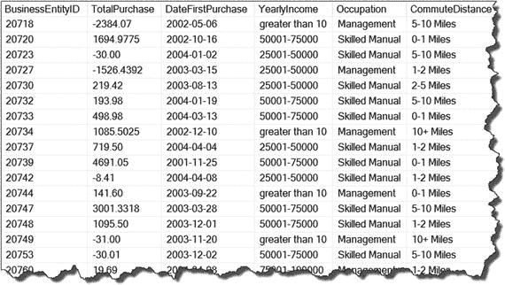

图 6-16. 显示使用 `fn:empty()` 函数替代方案后的 XQuery 结果

当使用 T-SQL `SET STATISTICS TIME ON;` 选项执行清单 6-19 和 6-20 时，SQL Server 显示 `fn:empty()` 比 `exist()` 方法具有微小的性能优势，如清单 6-21 所示。

```sql
-- fn:empty() 函数
(7652 行受影响)
SQL Server 执行时间:
CPU 时间 = 454 ms，经过时间 = 496 ms。
-- exist() 方法
(7652 行受影响)
SQL Server 执行时间:
CPU 时间 = 485 ms，经过时间 = 577 ms。
```
清单 6-21. 显示 `fn:empty()` 函数和 `exist()` 方法的执行输出

注意：在您的电脑上输出的性能数据可能不同。


## 摘要

“过滤 XML”章节演示了如何为 XML 实例实现内部 XQuery 过滤机制。T-SQL `WHERE` 子句提供了比 XQuery 内部过滤更全面的过滤机制。然而，正如前面章节所演示的，XQuery 拥有过滤 XML 实例的充足能力。

SQL DBA 和开发人员在过滤 XML 时最常见的误解是，为了简单起见而直接实现 T-SQL `WHERE` 子句。对于处理 XML 实例的过滤过程，这是一种低效的解决方案，因为 T-SQL `WHERE` 子句在引擎返回结果集时才对 XML 进行过滤，而 XQuery 则直接返回过滤后的值。清单 6-22 比较了 XQuery 和 `WHERE` 子句两者的执行 CPU 利用率和时间。

```
SET STATISTICS TIME ON;
WITH XMLNAMESPACES
(
DEFAULT N'http://schemas.microsoft.com/sqlserver/2004/07/adventure-works/IndividualSurvey'
)
SELECT BusinessEntityID,
ref.value('fn:string(TotalPurchaseYTD[1])', 'MONEY') AS TotalPurchase,
ref.value('fn:string(DateFirstPurchase[1])', 'DATE') AS DateFirstPurchase,
ref.value('fn:string(YearlyIncome[1])', 'NVARCHAR (20)') AS YearlyIncome,
ref.value('fn:string(Occupation[1])', 'NVARCHAR(15)') AS Occupation,
ref.value('fn:string(CommuteDistance[1])', 'NVARCHAR(15)') AS CommuteDistance
FROM Person.Person
CROSS APPLY Demographics.nodes('IndividualSurvey[Occupation="Manual"]') AS dmg(ref);
WITH XMLNAMESPACES
(
DEFAULT N'http://schemas.microsoft.com/sqlserver/2004/07/adventure-works/IndividualSurvey'
)
SELECT BusinessEntityID,
ref.value('fn:string(TotalPurchaseYTD[1])', 'MONEY') AS TotalPurchase,
ref.value('fn:string(DateFirstPurchase[1])', 'DATE') AS DateFirstPurchase,
ref.value('fn:string(YearlyIncome[1])', 'NVARCHAR(20)') AS YearlyIncome,
ref.value('fn:string(Occupation[1])', 'NVARCHAR(15)') AS Occupation,
ref.value('fn:string(CommuteDistance[1])', 'NVARCHAR(15)') AS CommuteDistance
FROM Person.Person
CROSS APPLY Demographics.nodes('IndividualSurvey') AS dmg(ref)
WHERE ref.value('fn:string(Occupation[1])', 'NVARCHAR(15)') = 'Manual';
SET STATISTICS TIME OFF ;
清单 6-22.
演示执行差异
```

结果如清单 6-23 所示。

```
-- XQuery nodes() 过滤
(2384 行受影响)
SQL Server 执行时间:
CPU 时间 = 235 ms,  已用时间 = 271 ms.
-- T-SQL WHERE 子句
(2384 行受影响)
SQL Server 执行时间:
CPU 时间 = 593 ms,  已用时间 = 601 ms.
清单 6-23.
显示 XQuery 和 WHERE 子句进程的执行输出:
```

清单 6-23 中的结果表明，XQuery 的效率比 `WHERE` 子句高出一倍多。因此，XQuery 过滤应该是你的首选。

> 注意
> 在你的个人电脑上，返回的性能数字可能不同。

## 7. 提升 XML 性能

性能效率始终是 DBA 和开发人员最关心的问题。索引是提高数据传递过程的首选方法。然而，XML 数据的逻辑树结构无法像普通的关系数据那样进行索引。因此，随着 SQL Server 2005 的推出，Microsoft 为 XML 数据类型列添加了一种索引机制。XML 数据与表中列的标量数据不同，因此 XML 索引机制提供了专门的主 XML 索引和辅助 XML 索引。在 SQL Server 2012 中，XML 索引通过选择性 XML 索引进行了增强，这提高了对大型 XML 数据的搜索效率。

### 7-1 创建主 XML 索引

### 问题

你想要改进对 XML 数据类型列的过滤过程。

### 解决方案

添加主 XML 索引可以改进对 XML 数据类型列的过滤过程。为了演示，我们将创建一个包含 XML 列的新表，向其中填充数据，然后在其上创建主 XML 索引。清单 7-1 演示了如何在新表的 `Demographic` 列上创建主 XML 索引。图 7-1 显示了创建的索引。

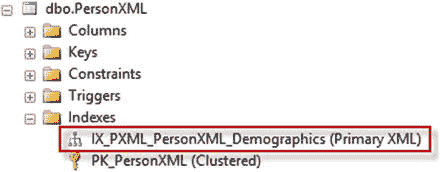
图 7-1.
显示为 PersonXML 表创建的索引

```
-- 这些设置在创建 XML 索引时很重要
SET NUMERIC_ROUNDABORT OFF;
SET ARITHABORT ON;
SET ANSI_NULLS ON;
SET ANSI_PADDING ON;
SET ANSI_WARNINGS ON;
SET CONCAT_NULL_YIELDS_NULL ON;
SET QUOTED_IDENTIFIER ON;
GO
-- 删除表 (SQL Server 2016 语法)
DROP TABLE IF EXISTS dbo.PersonXML
-- 创建名为 PersonXML 的表并填充数据
CREATE TABLE dbo.PersonXML
(
PersonID INT NOT NULL,
FirstName NVARCHAR(30) NOT NULL,
MiddleName NVARCHAR(20)NULL,
LastName NVARCHAR(30) NOT NULL,
Demographics XML NULL,
CONSTRAINT PK_PersonXML PRIMARY KEY CLUSTERED
(
PersonID ASC
)
);
GO
INSERT dbo.PersonXML
(
PersonID,
FirstName,
MiddleName,
LastName,
Demographics
)
SELECT BusinessEntityID,
FirstName,
MiddleName,
LastName,
Demographics
FROM Person.Person;
GO
-- 现在在 dbo.PersonXML 表上创建主 XML 索引
CREATE PRIMARY XML INDEX IX_PXML_PersonXML_Demographics
ON dbo.PersonXML
(
Demographics
);
GO
清单 7-1.
创建主 XML 索引
```


### 工作原理

在我们的示例中，我们创建了一个 `dbo.PersonXML` 表来演示 XML 索引的创建和性能。清单 7-2 展示了创建该表并用 AdventureWorks 数据库中 `Person.Person` 表的数据加载它的 SQL 代码。请注意所示的会话级别设置（通过 `SET` 语句）。在表中创建 XML 列或向 XML 列添加 XML 索引时，这些设置很重要。

```
-- These settings are important when creating XML indexes
SET NUMERIC_ROUNDABORT OFF;
SET ARITHABORT ON;
SET ANSI_NULLS ON;
SET ANSI_PADDING ON;
SET ANSI_WARNINGS ON;
SET CONCAT_NULL_YIELDS_NULL ON;
SET QUOTED_IDENTIFIER ON;
GO
-- Drop table SQL Server 2016 syntax
DROP TABLE IF EXISTS dbo.PersonXML
-- Create and populate a table called PersonXML
CREATE TABLE dbo.PersonXML
(
PersonID INT NOT NULL,
FirstName NVARCHAR(30) NOT NULL,
MiddleName NVARCHAR(20)NULL,
LastName NVARCHAR(30) NOT NULL,
Demographics XML NULL,
CONSTRAINT PK_PersonXML PRIMARY KEY CLUSTERED
(
PersonID ASC
)
);
GO
```
清单 7-2. 创建和填充 PersonXML 表

清单 7-3 展示了一个从 XML 列获取结果的 SQL 查询。图 7-2 显示了在创建主 XML 索引之前，此查询 SQL 代码的实际执行计划。

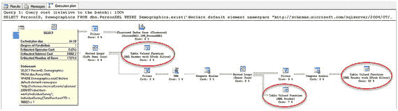
图 7-2. 显示创建主 XML 索引前的执行计划

```
SELECT PersonID, Demographics
FROM dbo.PersonXML
WHERE Demographics.exist('declare default element namespace "http://schemas.microsoft.com/sqlserver/2004/07/adventure-works/IndividualSurvey";
IndividualSurvey[TotalPurchaseYTD > 9000]') = 1;
```
清单 7-3. 使用过滤器进行 XQuery 采样

查看为 XQuery 创建的执行计划，其有几个不同于典型 T-SQL 查询的步骤：

*   表值函数 `[XML Reader with XPath filter]`
*   表值函数 `[XML Reader]`

这两个步骤分别占总查询成本的最高百分比，92% 和 7%。这些步骤指定了 XML 运行时拆解机制，非常类似于普通关系 SQL 查询中的表扫描。这意味着，根据 XML 实例的大小，XML 拆解过程在性能方面可能非常耗费资源。图 7-3 展示了表值函数 `[XML Reader]` 步骤的属性值。

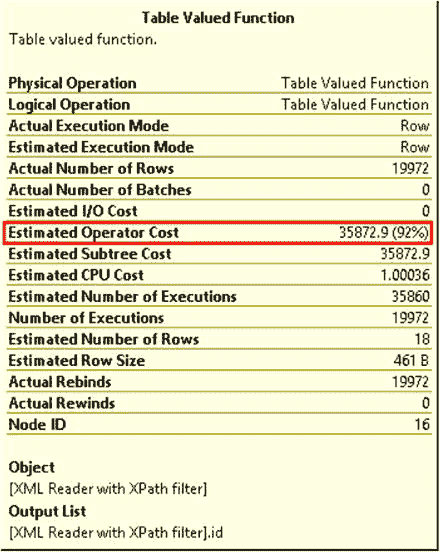
图 7-3. 显示表值函数 `[XML Reader]` 步骤属性

```
CREATE PRIMARY XML INDEX IX_PXML_PersonXML_Demographics
ON dbo.PersonXML
(
Demographics
);
GO
```
清单 7-4. 创建 XML 主索引

一旦创建了主 XML 索引，您就可以在 SSMS 上启用实际执行计划后，重新运行清单 7-5（与清单 7-2 相同）中的查询：

```
SELECT PersonID, Demographics
FROM dbo.PersonXML
WHERE Demographics.exist('declare default element namespace "http://schemas.microsoft.com/sqlserver/2004/07/adventure-works/IndividualSurvey";
IndividualSurvey[TotalPurchaseYTD > 9000]') = 1;
```
清单 7-5. 使用主 XML 索引查询 PersonXML 表

在得到的执行计划中，表值函数 `[XML Reader with XPath filter]` 步骤和表值函数 `[XML Reader]` 被聚簇索引查找 `[PrimaryXML]` 步骤所取代。图 7-4 展示了返回的执行计划。

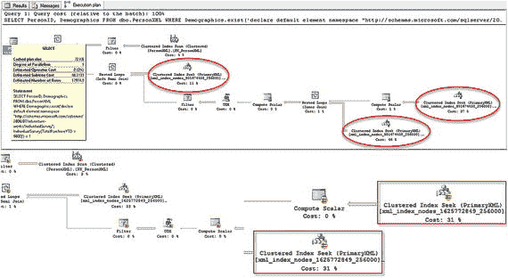
图 7-4. 显示创建主 XML 索引后的执行计划

图 7-5 展示了聚簇索引查找 `[PrimaryXML]` 步骤属性。使用主 XML 索引后，估算运算符成本从表值函数 `[XML Reader]` 步骤的 35782.9（92%）下降到了聚簇索引查找 `[PrimaryXML]` 步骤的 21.2796（46%）。

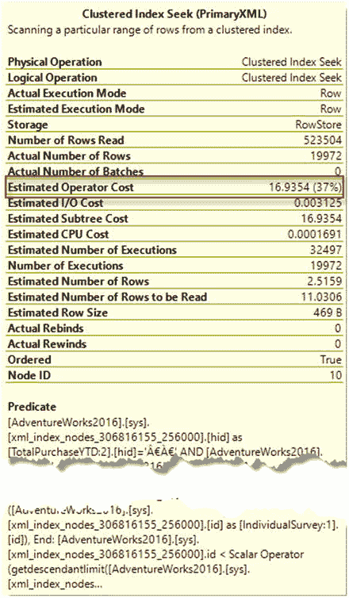
图 7-5. 显示聚簇索引查找 `[PrimaryXML]` 步骤属性

`CREATE PRIMARY XML INDEX` 语句包含三个部分，用于指定索引名称、在其上创建索引的表以及在其上创建索引的 XML 列的名称，如下所示：

```
CREATE PRIMARY XML INDEX 
ON 
(  );
```

创建主 XML 索引时，需要遵循以下规则：

*   包含 XML 列的表必须有一个聚集主键。
*   当存在主 XML 索引时，不能使用 DDL 语句删除或更改表的聚集主键。在修改主键之前，必须删除所有 XML 索引。
*   只能在单个 `XML` 类型列上创建主 XML 索引。
*   每个 XML 索引必须具有数据库范围内唯一的名称。
*   创建 XML 索引时，无法为用户表单独指定文件组或分区信息。
*   当删除主 XML 索引时，依赖于它的所有辅助 XML 索引都会被自动删除。
*   为 XML 索引将 `IGNORE_DUP_KEY` 和 `ONLINE` 选项设置为 `OFF`。
*   主 XML 索引在名称方面与视图有相同的限制。
*   只有包含 `XML` 类型列的表才能拥有 XML 索引。视图、具有 `XML` 类型列的表值变量或 `XML` 类型变量不能拥有 XML 索引。
*   当将 `XML` 类型列从未类型化更改为类型化 XML 时，不应存在任何 XML 索引。如果表上存在 XML 索引，可以使用 `ALTER TABLE ALTER COLUMN` 选项。在更改列类型之前，必须删除 XML 索引。
*   创建 XML 索引时，必须将以下会话选项设置为 `ON`：`ARITHABORT`、`ANSI_NULLS`、`ANSI_PADDING`、`ANSI_WARNINGS`、`CONCAT_NULL_YIELDS_NULL`、`QUOTED_IDENTIFIER`。
*   创建 XML 索引时，选项 `NUMERIC_ROUNDABORT` 必须设置为 `OFF`。

主 XML 索引可以显著提高 XQuery 性能。因此，XML 索引可以是提高 SQL Server XQuery 性能的一个非常有吸引力的解决方案。然而，XML 索引有几个相关的注意事项。首先，添加主 XML 索引可能会消耗大量的存储空间。当创建 `PRIMARY XML` 索引时，SQL Server 会将给定列中的 XML 数据拆解为关系格式，只能由查询执行引擎访问。这可能消耗比存储未索引 XML 数据所需多一倍以上的存储空间。

在决定是否添加主 XML 索引时，请考虑以下建议：

*   如果 XML 列不是 XQuery 过程的一部分，通常不需要 XML 索引。
*   分析您的查询配置文件。如果您需要一次性查询大量行，或者您的 XML 数据量很大，则值得考虑 XML 索引。如果这些条件不适用，那么存储成本可能会超过效率收益。
*   添加主 XML 索引的一个充分理由是，如果您需要添加辅助 XML 索引以提高特定类别查询的效率（将在接下来的三个部分中讨论）。如果您希望添加辅助 XML 索引，则必须先添加主 XML 索引。

## 7-2 创建辅助 PATH 类型索引

### 问题

您想用 `exist()` 方法改进 XML 列的过滤。


