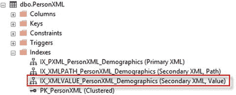
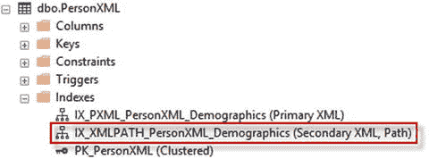
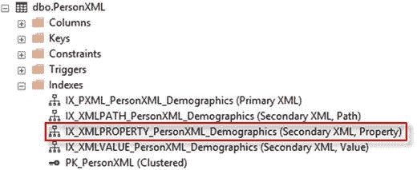
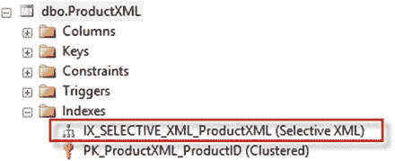
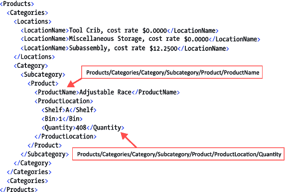
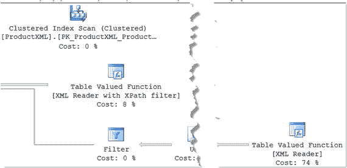
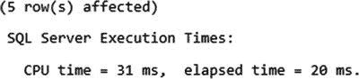
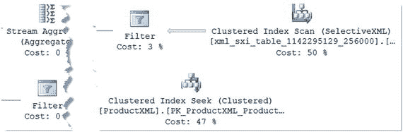
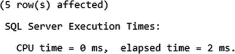
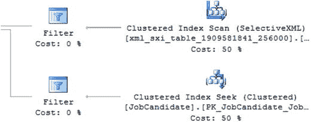

# 7-3 创建二级 VALUE 类型索引

### 问题

当 XQuery 中使用了通配符或路径未完全指定时，你希望提升 XML 列的查询性能。

### 解决方案

当路径未完全指定或包含通配符时，二级值类型 XML 索引有助于提升 XQuery 性能。清单 7-10 创建了我们在解决方案 7-1 和 7-2 中创建的示例表和一级 XML 索引。如果你已创建此表，则无需重新创建。

```sql
-- 这些设置在创建 XML 索引时很重要
SET NUMERIC_ROUNDABORT OFF;
SET ARITHABORT ON;
SET ANSI_NULLS ON;
SET ANSI_PADDING ON;
SET ANSI_WARNINGS ON;
SET CONCAT_NULL_YIELDS_NULL ON;
SET QUOTED_IDENTIFIER ON;
GO
-- 删除表 SQL Server 2016 语法
DROP TABLE IF EXISTS dbo.PersonXML
-- 创建并填充名为 PersonXML 的表
CREATE TABLE dbo.PersonXML
(
PersonID INT NOT NULL,
FirstName NVARCHAR(30) NOT NULL,
MiddleName NVARCHAR(20)NULL,
LastName NVARCHAR(30) NOT NULL,
Demographics XML NULL,
CONSTRAINT PK_PersonXML PRIMARY KEY CLUSTERED
(
PersonID ASC
)
);
GO
INSERT dbo.PersonXML
(
PersonID,
FirstName,
MiddleName,
LastName,
Demographics
)
SELECT BusinessEntityID,
FirstName,
MiddleName,
LastName,
Demographics
FROM Person.Person;
GO
-- 现在在 dbo.PersonXML 表上创建一级 XML 索引
CREATE PRIMARY XML INDEX IX_PXML_PersonXML_Demographics
ON dbo.PersonXML
(
Demographics
);
GO
```
清单 7-10. 创建带 XML 列的示例表和一级 XML 索引

清单 7-11 展示了如何在示例表上创建二级值 XML 索引，图 7-7 显示了已创建的 XML 索引。


图 7-7. 确认已创建二级值 XML 索引

```sql
CREATE XML INDEX IX_XMLVALUE_PersonXML_Demographics
ON dbo.PersonXML
(
Demographics
)
USING XML INDEX IX_PXML_PersonXML_Demographics
FOR VALUE;
```
清单 7-11. 创建二级值类型索引

二级路径类型 XML 索引可提升 XML 数据类型 `exist()` 方法的查询性能。清单 7-6 创建了与解决方案 7-2 相同的表并对其应用了一级 XML 索引，因为这是此解决方案的两个必要条件。清单 7-7 演示了如何在表上创建二级路径 XML 索引。图 7-6 显示了已创建的索引。

```sql
-- 这些设置在创建 XML 索引时很重要
SET NUMERIC_ROUNDABORT OFF;
SET ARITHABORT ON;
SET ANSI_NULLS ON;
SET ANSI_PADDING ON;
SET ANSI_WARNINGS ON;
SET CONCAT_NULL_YIELDS_NULL ON;
SET QUOTED_IDENTIFIER ON;
GO
-- 删除表 SQL Server 2016 语法
DROP TABLE IF EXISTS dbo.PersonXML
-- 创建并填充名为 PersonXML 的表
CREATE TABLE dbo.PersonXML
(
PersonID INT NOT NULL,
FirstName NVARCHAR(30) NOT NULL,
MiddleName NVARCHAR(20)NULL,
LastName NVARCHAR(30) NOT NULL,
Demographics XML NULL,
CONSTRAINT PK_PersonXML PRIMARY KEY CLUSTERED
(
PersonID ASC
)
);
GO
INSERT dbo.PersonXML
(
PersonID,
FirstName,
MiddleName,
LastName,
Demographics
)
SELECT BusinessEntityID,
FirstName,
MiddleName,
LastName,
Demographics
FROM Person.Person;
GO
-- 现在在 dbo.PersonXML 表上创建一级 XML 索引
CREATE PRIMARY XML INDEX IX_PXML_PersonXML_Demographics
ON dbo.PersonXML
(
Demographics
);
GO
```
清单 7-6. 创建带有一级 XML 索引的示例表

`GO` 清单 7-7 向我们先前创建的、带有一级 XML 索引的示例表添加了一个二级路径 XML 索引。


图 7-6. 显示已创建的二级路径类型 XML 索引

```sql
CREATE XML INDEX IX_XMLPATH_PersonXML_Demographics
ON dbo.PersonXML
(
Demographics
)
USING XML INDEX IX_PXML_PersonXML_Demographics
FOR PATH;
```
清单 7-7. 创建二级路径 XML 索引

### 工作原理

一级 XML 索引可以提升在 XML 数据类型列上查询的性能。二级 XML 索引可以在一级 XML 索引的基础上进一步提升查询性能。如果你的查询倾向于在 `WHERE` 子句中指定 `exist()` 方法，那么 `SECONDARY PATH` 类型索引可能进一步提升查询速度。清单 7-8 指定了一个查询 XQuery 路径是否存在的查询。

```sql
SELECT PersonID, Demographics
FROM dbo.PersonXML
WHERE Demographics.exist('declare default element namespace "http://schemas.microsoft.com/sqlserver/2004/07/adventure-works/IndividualSurvey";
/IndividualSurvey/Occupation') = 1;
```
清单 7-8. 演示指定查询路径的 SECONDARY PATH 类型索引

清单 7-9 展示了另一个选项，其中同时指定了路径和谓词。

```sql
SELECT PersonID, Demographics
FROM dbo.PersonXML
WHERE Demographics.exist('declare default element namespace "http://schemas.microsoft.com/sqlserver/2004/07/adventure-works/IndividualSurvey";
/IndividualSurvey[TotalPurchaseYTD > 9000]') = 1;
```
清单 7-9. 显示同时指定路径和谓词的二级路径类型 XML 索引。

二级路径类型 XML 索引以及值类型和属性类型的二级索引，都是建立在一级 XML 索引之上的。创建二级路径 XML 索引的 `CREATE XML INDEX` 语法包含四个部分：

```sql
CREATE XML INDEX 
ON 
(    )
USING XML INDEX  FOR PATH;
```

**注意**
当一级 XML 索引被删除时，所有关联的二级 XML 索引会自动被删除。


### 工作原理

次级值类型索引可以在路径未完全指定或包含通配符时提升 XQuery 的效率，例如：

*   `//ELEMENT[ELEMENT = "Filter Condition"]`
*   `/ELEMENT/@*[. = "Filter Condition"]`
*   `//ELEMENT[@ATTRIBUTE = "Filter Condition"]`

实际上，次级值类型索引在谓词筛选条件值已知的情况下能提升查询性能。清单 7-12 展示了 XQuery 如何从使用值索引中受益。

```
SELECT PersonID,
ref.value('declare default element namespace "http://schemas.microsoft.com/sqlserver/2004/07/adventure-works/IndividualSurvey";
TotalPurchaseYTD[1]', 'money') TotalPurchase,
ref.value('declare default element namespace "http://schemas.microsoft.com/sqlserver/2004/07/adventure-works/IndividualSurvey";
DateFirstPurchase[1]', 'date') DateFirstPurchase,
ref.value('declare default element namespace "http://schemas.microsoft.com/sqlserver/2004/07/adventure-works/IndividualSurvey";
YearlyIncome[1]', 'varchar(20)') YearlyIncome,
ref.value('declare default element namespace "http://schemas.microsoft.com/sqlserver/2004/07/adventure-works/IndividualSurvey";
Occupation[1]', 'varchar(15)') Occupation,
ref.value('declare default element namespace "http://schemas.microsoft.com/sqlserver/2004/07/adventure-works/IndividualSurvey";
CommuteDistance[1]', 'varchar(15)') CommuteDistance
FROM PersonXML
CROSS APPLY Demographics.nodes('declare default element namespace "http://schemas.microsoft.com/sqlserver/2004/07/adventure-works/IndividualSurvey";
/*[YearlyIncome="50001-75000"]') dmg(ref);
清单 7-12.
展示 XQuery 如何从利用次级值 XML 索引中受益
```

创建次级值类型索引的语法包含四个组成部分：

```
CREATE XML INDEX 
ON 
(    )
USING XML INDEX  FOR VALUE;
```

**Caution**

祖辈或自身轴操作符，例如 `XML_Column.nodes('//ELEMENT'`)，是在 `nodes()` 方法中建立路径引用的便捷方式。然而，对于 XML 实例具有深层嵌套元素的 XML 数据类型列，此技术可能会降低性能。这是 XML 分解过程中最常见的性能问题之一。因此，我建议（在可能的情况下）在 `nodes()` 方法中提供更详细的路径。例如，`XML_Column.nodes('//ELEMENT/CHILD_ELMNT')` 可以提升你的 XML 分解性能。

## 7-4 创建次级属性类型索引

### 问题

你希望提升从列中检索一个或多个值的 XML 列的性能。

### 解决方案

如果你的 XQuery 从 XML 列中检索一个或多个值，次级属性类型 XML 索引会很有帮助。清单 7-13 创建了我们在解决方案 7-1、7-2 和 7-3 中使用的演示表，并在其上创建了主 XML 索引。

```
-- 这些设置在创建 XML 索引时很重要
SET NUMERIC_ROUNDABORT OFF;
SET ARITHABORT ON;
SET ANSI_NULLS ON;
SET ANSI_PADDING ON;
SET ANSI_WARNINGS ON;
SET CONCAT_NULL_YIELDS_NULL ON;
SET QUOTED_IDENTIFIER ON;
GO
-- 删除表（SQL Server 2016 语法）
DROP TABLE IF EXISTS dbo.PersonXML
-- 创建并填充一个名为 PersonXML 的表
CREATE TABLE dbo.PersonXML
(
PersonID INT NOT NULL,
FirstName NVARCHAR(30) NOT NULL,
MiddleName NVARCHAR(20) NULL,
LastName NVARCHAR(30) NOT NULL,
Demographics XML NULL,
CONSTRAINT PK_PersonXML PRIMARY KEY CLUSTERED
(
PersonID ASC
)
);
GO
INSERT dbo.PersonXML
(
PersonID,
FirstName,
MiddleName,
LastName,
Demographics
)
SELECT BusinessEntityID,
FirstName,
MiddleName,
LastName,
Demographics
FROM Person.Person;
GO
-- 现在在 dbo.PersonXML 表上创建主 XML 索引
CREATE PRIMARY XML INDEX IX_PXML_PersonXML_Demographics
ON dbo.PersonXML
(
Demographics
);
GO
清单 7-13.
创建带 XML 列的示例表及主 XML 索引
```

清单 7-14 展示了如何创建次级属性 XML 索引。图 7-8 展示了已创建的索引。



图 7-8.

确认索引已创建

```
CREATE XML INDEX IX_XMLPROPERTY_PersonXML_Demographics
ON dbo.PersonXML
(
Demographics
)
USING XML INDEX IX_PXML_PersonXML_Demographics
FOR PROPERTY;
清单 7-14.
创建次级属性 XML 索引
```

### 工作原理

次级属性类型索引可以在通过 `value()` 方法检索一个或多个值的 XML 列查询时提供性能优势。清单 7-15 展示了当存在 `PROPERTY` 索引时，使用 XQuery 的优势。

```
SELECT PersonID,
ref.value('declare default element namespace "http://schemas.microsoft.com/sqlserver/2004/07/adventure-works/IndividualSurvey";
TotalPurchaseYTD[1]', 'money') TotalPurchase,
ref.value('declare default element namespace "http://schemas.microsoft.com/sqlserver/2004/07/adventure-works/IndividualSurvey";
DateFirstPurchase[1]', 'date') DateFirstPurchase,
ref.value('declare default element namespace "http://schemas.microsoft.com/sqlserver/2004/07/adventure-works/IndividualSurvey";
YearlyIncome[1]', 'varchar(20)') YearlyIncome,
ref.value('declare default element namespace "http://schemas.microsoft.com/sqlserver/2004/07/adventure-works/IndividualSurvey";
Occupation[1]', 'varchar(15)') Occupation,
ref.value('declare default element namespace "http://schemas.microsoft.com/sqlserver/2004/07/adventure-works/IndividualSurvey";
CommuteDistance[1]', 'varchar(15)') CommuteDistance
FROM PersonXML
CROSS APPLY Demographics.nodes('declare default element namespace "http://schemas.microsoft.com/sqlserver/2004/07/adventure-works/IndividualSurvey";
IndividualSurvey[TotalPurchaseYTD > 1000 and TotalPurchaseYTD < 1005
and CommuteDistance = "0-1 Miles"]') dmg(ref);
清单 7-15.
展示当存在 PROPERTY 索引时使用 XQuery 的优势
```

创建次级属性 XML 索引的语法包含四个组成部分：

```
CREATE XML INDEX 
ON 
(    )
USING XML INDEX  FOR PROPERTY;
```

## 7-5 创建选择性 XML 索引

### 问题

你希望在存储大型 XML 文档的 XML 列上创建索引，但希望最小化索引的存储空间。


### 解决方案

选择性 XML 索引旨在为存储大型 XML 文档的 XML 列提升 XQuery 性能并优化 XML 索引存储。代码清单 7-16 创建了一个包含无类型 XML 列的新示例表，使用示例 XML 数据填充它，并为其创建了一个选择性 XML 索引。图 7-9 展示了已创建的索引。


图 7-9. 确认已为 ProductXML 表创建选择性 XML 索引

```sql
-- 创建包含 XML 列和 XML 索引的表时，这些设置很重要
SET NUMERIC_ROUNDABORT OFF;
SET ARITHABORT ON;
SET ANSI_NULLS ON;
SET ANSI_PADDING ON;
SET ANSI_WARNINGS ON;
SET CONCAT_NULL_YIELDS_NULL ON;
SET QUOTED_IDENTIFIER ON;
GO
-- 删除表（SQL Server 2016 语法）
DROP TABLE IF EXISTS dbo.ProductXML
-- 创建包含 XML 列的演示表
CREATE TABLE dbo.ProductXML
(
ProductID INT NOT NULL,
Name NVARCHAR(50) NOT NULL,
ProductNumber NVARCHAR(25) NOT NULL,
ProductDetails XML NULL
CONSTRAINT PK_ProductXML_ProductID PRIMARY KEY CLUSTERED
(
ProductID ASC
)
);
GO
-- 使用示例 XML 数据填充表
INSERT INTO dbo.ProductXML
(
ProductID,
Name,
ProductNumber,
ProductDetails
)
SELECT Product2.ProductId,
Product2.Name,
Product2.ProductNumber,
(
SELECT ProductCategory.Name AS "Category/CategoryName",
(
SELECT DISTINCT Location.Name "text()", ', 成本率 $',
Location.CostRate "text()"
FROM Production.ProductInventory Inventory
INNER JOIN Production.Location Location
ON Inventory.LocationID = Location.LocationID
WHERE Product.ProductID = Inventory.ProductID
FOR XML PATH('LocationName'), TYPE
) AS "Locations/node()",
Subcategory.Name AS "Category/Subcategory/SubcategoryName",
Product.Name AS "Category/Subcategory/Product/ProductName",
Product.Color AS "Category/Subcategory/Product/Color",
Inventory.Shelf AS "Category/Subcategory/Product/ProductLocation/Shelf",
Inventory.Bin AS "Category/Subcategory/Product/ProductLocation/Bin",
Inventory.Quantity AS "Category/Subcategory/Product/ProductLocation/Quantity"
FROM Production.Product Product
LEFT JOIN Production.ProductInventory Inventory
ON Product.ProductID = Inventory.ProductID
LEFT JOIN Production.ProductSubcategory Subcategory
ON Product.ProductSubcategoryID = Subcategory.ProductSubcategoryID
LEFT JOIN Production.ProductCategory
ON Subcategory.ProductCategoryID = Production.ProductCategory.ProductCategoryID
WHERE Product.ProductID = Product2.ProductId
ORDER BY ProductCategory.Name, Subcategory.Name, Product.Name
FOR XML PATH('Categories'), ROOT('Products'), ELEMENTS, TYPE
)
FROM Production.Product Product2;
GO
-- 创建选择性 XML 索引
CREATE SELECTIVE XML INDEX IX_SELECTIVE_XML_ProductXML
ON dbo.ProductXML
(
ProductDetails
)
FOR
(
Quantity = '/Products/Categories/Category/Subcategory/Product/ProductLocation/Quantity',
ProductName = '/Products/Categories/Category/Subcategory/Product/ProductName'
);
GO
```
代码清单 7-16. 创建选择性 XML 索引


### 工作原理

主 XML 索引会将所有 XML 数据分解为关系格式，而选择性 XML 索引则不会这样做。对于大型 XML 实例，主 XML 索引可能会占用大量空间并消耗服务器资源。选择性 XML 索引则针对一个或多个路径中指定的值进行操作。这在许多情况下可以使选择性 XML 索引比主 XML 索引小得多。创建选择性 XML 索引的语法比创建主 XML 索引的语法更复杂。例如，清单 7-16 中演示的选择性 XML 索引，在 FOR 子句中标识了两条 XQuery 路径，指向两个深度嵌套的元素节点；即：

*   `Quantity`
*   `ProductName`

选择性 XML 索引路径必须是完全限定且完整的路径，即，路径不允许使用缩写。该索引包含由这些路径标识的节点。清单 7-17 展示了一个示例 XML 片段，其中说明了在选择性 XML 索引路径中标识的 `Quantity` 和 `ProductName` 元素节点的 XML 路径。

**清单 7-17.** 来自上一个示例的 XML 片段示例



清单 7-18 中的查询是在创建选择性 XML 索引之前运行的。结果如图 7-10 所示（时间统计），其执行计划如图 7-11 所示。


**图 7-11.** 索引创建前的执行计划


**图 7-10.** 显示索引创建前的时间统计

```sql
SET STATISTICS TIME ON;
SELECT ProductID, Name, ProductNumber, ProductDetails
FROM dbo.ProductXML
WHERE ProductDetails.exist('Products/Categories/Category/Subcategory/Product/ProductLocation/Quantity[.="622"]') = 1;
SET STATISTICS TIME OFF;
```
**清单 7-18.** 展示示例查询

在创建了索引 `IX_SELECTIVE_XML_ProductXML` 之后，清单 7-19 中的查询生成了更高效的运行时和执行计划，如图 7-12 和图 7-13 所示。


**图 7-13.** 显示创建选择性 XML 索引后执行计划的改进


**图 7-12.** 显示改进的时间统计

```sql
SET STATISTICS TIME ON;
SELECT ProductID, Name, ProductNumber, ProductDetails
FROM dbo.ProductXML
WHERE ProductDetails.exist('Products/Categories/Category/Subcategory/Product/ProductLocation/Quantity[.="622"]') = 1;
```
**清单 7-19.** 创建选择性 XML 索引后运行的示例查询

在没有 `XMLNAMESPACES` 的 XML 实例的 XML 列上创建 `SELECTIVE XML` 索引的语法包含以下部分：

```sql
CREATE SELECTIVE XML INDEX 
ON 
()
FOR ( Path_name1 = 'XML path',
Path Name2 = 'XML path',
Path Name3 = 'XML path')
```

当 XML 列存储带有 `XMLNAMESPACES` 的 XML 实例时，必须在 `CREATE SELECTIVE INDEX` 语句中声明 `XMLNAMESPACE`。例如，如果你想改进对 `HumanResources.JobCandidate` 表的 `Resume` 列的搜索。清单 7-20 展示了如何查询带有命名空间的 XML 列。

```sql
WITH XMLNAMESPACES('http://schemas.microsoft.com/sqlserver/2004/07/adventure-works/Resume' as ns)
SELECT JobCandidateID, Resume
FROM HumanResources.JobCandidate
WHERE Resume.exist('/ns:Resume/ns:Name/ns:Name.First[.="Stephen"]') = 1
```
**清单 7-20.** 用于搜索求职者的 SQL 代码

清单 7-21 演示了如何在 `HumanResources.JobCandidate` 表的 `Resume` 列上创建选择性 XML 索引。图 7-14 显示了在创建选择性 XML 索引后，清单 7-19 中查询的 SQL 执行计划。


**图 7-14.** 显示创建选择性 XML 索引后的 SQL 执行计划

```sql
CREATE SELECTIVE XML INDEX IX_SELECTIVE_XML_HumanResources_JobCandidate
ON [HumanResources].[JobCandidate]
(
[Resume]
)
WITH XMLNAMESPACES
(
DEFAULT 'http://schemas.microsoft.com/sqlserver/2004/07/adventure-works/Resume'
)
FOR
(
LastName = '/Resume/Name/Name.Last'
,FirstName = '/Resume/Name/Name.First'
);
```
**清单 7-21.** 在包含 `XMLNAMESPACE` 的列上创建 `SELECTIVE XML INDEX` 的语句

在带有 `XMLNAMESPACES` 的 XML 实例的 XML 列上创建选择性 XML 索引的语法包含以下部分：

```sql
CREATE SELECTIVE XML INDEX 
ON 
()
WITH XMLNAMESPACES(DEFAULT 'XMLNAMESPACE URI')
FOR ( Path_Name1 = 'XML path',
Path_Name2 = 'XML path',
Path_Name3 = 'XML path')
```

创建选择性 XML 索引的优势在于，你可以实现一个或多个 XML 路径，以专注于你的搜索条件中主要使用的 XML 值。

> **注意**
> 微软建议优先设置选择性 XML 索引。但是，如果你的选择性 XML 索引映射了许多路径，那么 `PRIMARY` XML 索引可能是更好的选择。

### 7-6 优化选择性 XML 索引

### 问题

你想优化选择性 XML 索引的性能。

### 解决方案

实现提示可以优化选择性 XML 索引。清单 7-22 演示了选择性 XML 索引的不同提示。

```sql
CREATE SELECTIVE XML INDEX IX_SELECTIVE_XML_ProductXML_Hint_Sample
ON dbo.ProductXML
(
ProductDetails
)
FOR
(
SubcategoryName = '/Products/Categories/Category/Subcategory/SubcategoryName' AS XQUERY 'node()',
Shelf = '/Products/Categories/Category/Subcategory/Product/ProductLocation/Shelf',
Bin = '/Products/Categories/Category/Subcategory/Product/ProductLocation/Bin' AS XQUERY 'xs:double' SINGLETON,
ProductName = '/Products/Categories/Category/Subcategory/Product/ProductName' AS SQL nvarchar(40),
CategoryName = '/Products/Categories/Category/CategoryName' AS XQUERY 'xs:string' MAXLENGTH(35)
);
```
**清单 7-22.** 测试选择性 XML 索引的不同提示


### 工作原理

选择性 XML 索引提示分为两种：

* `SQL Server` – 面向 SQL 数据类型映射。例如：`PathName` = ‘/root/element’ AS SQL nvarchar(40)
* `XQUERY` – 面向 XQuery 数据类型映射。例如：`PathName` = ‘/root/element’ AS XQUERY ‘xs:string’

表 `7-1` 描述了可用于改进选择性 XML 索引的优化提示。

表 7-1.
选择性 XML 索引优化提示说明

| 优化提示 | 适用于 | 提示说明 |
| --- | --- | --- |
| `node()` | XQuery | 减少所需的存储空间。检查节点是否存在。 |
| `SINGLETON` | XQuery 和 SQL Server | 确保该组只有一个实例，以便可以据此优化索引。请避免后续添加其他实例，因为这可能导致问题。 |
| `DATA TYPE` | XQuery | 使用数据类型优化索引。如果某些内容破坏了数据类型，则可能会出现问题，索引中将显示 null。 |
| `MAXLENGTH` | XQuery | 查看 XQuery 类型 `xs:string` 并使用允许的字符串最大值来优化索引很有帮助。但是，如果现有字符串长于指定的 `MAXLENGTH`，则可能会导致问题，因为索引可能会失败。 |

表 `7-2` 列出了在类型化和非类型化 XML 列上创建的选择性 XML 索引提示可用的 XQuery 数据类型。

表 7-2.
提示可用的 XQuery 数据类型

| 类型化 XML | 非类型化 XML |
| --- | --- |
| `xs:anyUri` |   |
| `xs:boolean` | `xs:boolean` |
| `xs:date` | `xs:date` |
| `xs:dateTime` | `xs:dateTime` |
| `xs:day` |   |
| `xs:decimal` |   |
| `xs:double` | `xs:double` |
| `xs:float` |   |
| `xs:int` |   |
| `xs:integer` |   |
| `xs:language` |   |
| `xs:long` |   |
| `xs:name` |   |
| `xs:NCName` |   |
| `xs:negativeInteger` |   |
| `xs:nmtoken` |   |
| `xs:nonNegativeInteger` |   |
| `xs:nonPositiveInteger` |   |
| `xs:positiveInteger` |   |
| `xs:qname` |   |
| `xs:short` |   |
| `xs:string` | `xs:string` |
| `xs:time` | `xs:time` |
| `xs:token` |   |
| `xs:unsignedByte` |   |
| `xs:unsignedInt` |   |
| `xs:unsignedLong` |   |
| `xs:unsignedShort` |   |

当提示应用于索引时，选择性 XML 索引可以获得益处。表 `7-3` 列出了选择性 XML 索引优化提示的益处。

表 7-3.
选择性 XML 索引优化提示的有效性

| 优化提示 | 存储效率 | 性能提升 |
| --- | --- | --- |
| `node()` | 是 | 否 |
| `SINGLETON` | 否 | 是 |
| `DATA TYPE` | 是 | 是 |
| `MAXLENGTH` | 是 | 是 |

表 `7-4` 列出了每种数据类型支持的优化提示。

表 7-4.
优化提示与数据类型对照表

| 优化提示 | XQuery 数据类型 | SQL 数据类型 |
| --- | --- | --- |
| `node()` | 是 | 否 |
| `SINGLETON` | 是 | 是 |
| `DATA TYPE` | 是 | 否 |
| `MAXLENGTH` | 是 | 否 |

## 7-7 创建辅助选择性 XML 索引

### 问题

你想要提升选择性 XML 索引的性能。

### 解决方案

辅助选择性 XML 索引可以提升选择性 XML 索引的性能。清单 `7-23` 在 `HumanResources.JobCandidate` 表上创建了选择性 XML 索引（来源于解决方案 7-6），这是此解决方案的先决条件。

```sql
CREATE SELECTIVE XML INDEX IX_SELECTIVE_XML_ProductXML_Hint_Sample
ON dbo.ProductXML
(
ProductDetails
)
FOR
(
SubcategoryName = '/Products/Categories/Category/Subcategory/SubcategoryName' AS XQUERY 'node()',
Shelf = '/Products/Categories/Category/Subcategory/Product/ProductLocation/Shelf',
Bin = '/Products/Categories/Category/Subcategory/Product/ProductLocation/Bin' AS XQUERY 'xs:double' SINGLETON,
ProductName = '/Products/Categories/Category/Subcategory/Product/ProductName' AS SQL nvarchar(40),
CategoryName = '/Products/Categories/Category/CategoryName' AS XQUERY 'xs:string' MAXLENGTH(35)
);
```
清单 7-23.
为选择性 XML 索引测试不同提示

清单 `7-24` 展示了如何在 `HumanResources.JobCandidate` 表上创建辅助选择性 XML 索引。

```sql
CREATE XML INDEX IX_SELECTIVE_SECONDARY_XML_HumanResources_JobCandidate
ON HumanResources.JobCandidate
(
Resume
)
USING XML INDEX IX_SELECTIVE_XML_HumanResources_JobCandidate
FOR (LastName);
```
清单 7-24.
演示如何创建辅助选择性 XML 索引

### 工作原理

辅助选择性 XML 索引提升了选择性 XML 索引的性能。其语法类似于辅助 XML 索引的语法，主要区别在于：选择性 XML 索引在 `USING XML INDEX` 子句中指定，而 `FOR` 子句则实现了选择性 XML 索引路径之一。

创建辅助选择性 XML 索引的语法包含以下组件：

```sql
CREATE XML INDEX 
ON 
()
USING XML INDEX ()
FOR (  )
```

辅助选择性 XML 索引必须包含一个提升（promoted）了数据类型的路径。例如：

* `SQL Server` 类型是 ‘/Resume/Name/Name.First’ AS SQL varchar(20)
* `XQuery` 类型是 ‘/Resume/Name/Name.First’ AS XQUERY ‘xs:string’ MAXLENGTH(20)

当数据类型未被提升时，`SQL Server` 会引发错误：

```sql
Msg 6391, Level 16, State 0, Line 111
Path 'LastName' is promoted to a type that is invalid for use as a key column in a secondary selective XML index.
```

## 7-8 修改选择性 XML 索引

### 问题

你想要从选择性 XML 索引中添加或删除路径。


