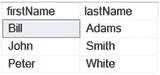
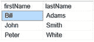
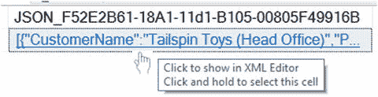
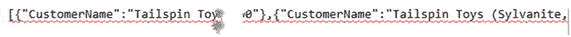
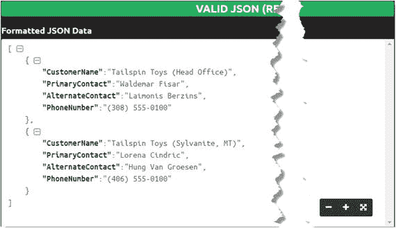
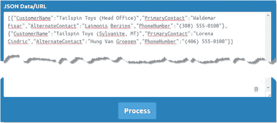
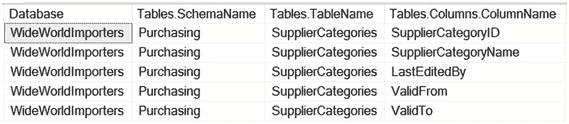
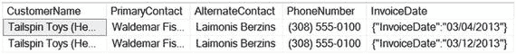

# JSON 简介

JSON 是 "JavaScript Object Notation" 的首字母缩写，发音为 "Jason"。它旨在成为一种更易于解读和紧凑的解决方案，用于表示复杂的数据结构并促进系统间的数据交换。

将 JSON 与 XML 比较时，选择 JSON 有许多优势：

*   与 XML 不同，JSON 不使用完整的标记结构，这使其更紧凑。
*   JSON 不是一种数据类型（至少对于 SQL Server 2016 而言）。SQL Server 将 JSON 表示为类似于 `nvarchar(max)` 的字符串。Microsoft 建议将 JSON 存储为 `nvarchar(max)`。
*   JSON 易于解析和构建。
*   JSON 数据结构易于理解。
*   JSON 是 NoSQL 数据库（如 CouchDB、MongoDB 等）的原生文件结构。

JSON 模型格式有两个块：

*   对象（Objects） - 用大括号 `{}` 包裹。一个空对象 `{}` 被视为有效的 JSON 数据。列表 8-1：`TopObject` 是一个对象块。
*   数组（Arrays） - 用方括号 `[]` 包裹。一个空数组 `[]` 也被视为有效的 JSON 数据。列表 8-1：`arrayOfObjects` 和 `arrayOfValues` 是数组块。

```
{
"TopObject": {
"numericKey": 2016,
"stringKey": "a text value",
"nullKey": null,
"booleanKey": true,
"dateKey": "2017-11-14"
},
"arrayOfObjects": [
{"item": 1},
{"item": 2},
{"item": 3}
] ,
"arrayOfValues": [
"SQL",
"XML",
"JSON"
]
}
清单 8-1.
展示 JSON 结构
```

一个 JSON 成员由一个键值对 `{"key": "value"}` 表示。成员的键必须包含在双引号内。键在对象的结构中必须是唯一的。成员的字符串类型和日期类型值需要包含在双引号内。布尔值和数值不应包含在双引号内。但是，当布尔值使用 `true` 或 `false` 字面量时，这些值应为小写。表 8-1 演示了 SQL Server 数据类型与 JSON 之间的数据类型转换。

带有前导零的数字被视为字符串。因此，它们必须包含在双引号内。对象的每个成员和数组的每个值后面都必须跟一个逗号，但最后一个键值对除外。

表 8-1.

展示从 SQL Server 到 JSON 的数据类型转换

| 类别 | SQL 类型 | JSON 类型 |
| --- | --- | --- |
| `字符和字符串类型` | `nvarchar, varchar, nchar, char` | `string` |
| `数值类型` | `int, bigint, float, decimal, numeric` | `number` |
| `位类型` | `bit` | `Boolean (true or false)` |
| `日期和时间类型` | `date, datetime, datetime2, time, datetimeoffset` | `string` |
| `CLR 类型` | `geometry, geography (except hierarchyid)` | `不支持。这些类型会返回错误。将数据转换或转换为受支持的 JSON 类型，或在 SELECT 列表中使用 CLR 属性或方法 – 例如，任何 CLR 类型的 `ToString()`，或 `geometry` 类型的 `STAsText()`。数据类型 `hierarchyid` 不需要显式转换。` |
| `其他类型` | `uniqueidentifier, money, varbinary, binary, timestamp, rowversion` | `string` |

表 8-2 展示了 XML 和 JSON 数据及其解析方法的并排比较。

表 8-2.

比较 XML 和 JSON

| XML 示例 | JSON 示例 |
| --- | --- |
| `<employees>` `<employee>` `<firstName>Bill</firstName>` `<lastName>Adams</lastName>` `</employee>` `<employee>` `<firstName>John</firstName>` `<lastName>Smith</lastName>` `</employee>` `<employee>` `<firstName>Peter</firstName>` `<lastName>White</lastName>` `</employee>` `</employees>` | `{"employees":` `[` `{"firstName":"Bill", "lastName":"Adams"},` `{"firstName":"John", "lastName":"Smith"},` `{"firstName":"Peter", "lastName":"White"}` `]` `}` |
| `XML 解析方法` | `JSON 解析方法` |
| `Declare @x XML =` `'<employees>` `<employee>` `<firstName>Bill</firstName>` `<lastName>Adams</lastName>` `</employee>` `<employee>` `<firstName>John</firstName>` `<lastName>Smith</lastName>` `</employee>` `<employee>` `<firstName>Peter</firstName>` `<lastName>White</lastName>` `</employee>` `</employees>';` `SELECT` `c.value('firstName[1]', 'varchar(30)')  AS firstName` `,c.value('lastName[1]', 'varchar(30)') AS lastName` `FROM @x.nodes('//employee') t(c);` | `declare @j nvarchar(max) =` `'{"employees":` `[` `{"firstName":"Bill", "lastName":"Adams"},` `{"firstName":"John", "lastName":"Smith"},` `{"firstName":"Peter", "lastName":"White"}` `]` `}';` `SELECT firstName, lastName` `FROM OPENJSON (@j, '$.employees')` `WITH` `(` `firstName varchar(30),` `lastName varchar(30)` `);` |
| `XML 结果` | `JSON 结果` |
|  |  |

SQL Server 提供了四个内置函数和 `SELECT` 查询的 `FOR JSON` 子句来处理和创建 JSON 文档，如表 8-3 所示。

与 XML 方法不同，JSON 函数不区分键（key）。但是，当在 JSON 函数以及 `ToString()` 和 `STAsText()` CLR 函数中引用时，键成员仍然是区分大小写的。

表 8-3.

描述 JSON 内置函数

| JSON 过程 | 过程类型 | 描述 |
| --- | --- | --- |
| `FOR JSON` | 子句 | 构建 JSON 文档。 |
| `ISJSON()` | 函数 | 验证字符串是否具有有效的 JSON。 |
| `JSON_VALUE()` | 函数 | 从 JSON 文档中检索标量值。 |
| `JSON_QUERY()` | 函数 | 从 JSON 文档中检索对象或数组。 |
| `JSON_MODIFY()` | 函数 | 修改 JSON 文档。 |
| `OPENJSON()` | 表值函数 | 将 JSON 文档转换为包含行和列的表格式。 |

本书第二部分提供了适用于 SQL Server 的 JSON 食谱。

## 8-1. 使用 AUTO 模式构建 JSON

### 问题

你想要自动构建 JSON 格式的结果。

### 解决方案

`FOR JSON` 子句的 `AUTO` 模式返回 JSON 格式的行。清单 8-2 展示了一个来自单个对象的 `FOR JSON` 子句的 `AUTO` 模式。图 8-1 显示了一个返回的 JSON 行。清单 8-3 展示了来自查询结果的格式化 JSON。



图 8-1.

在网格中显示 JSON 结果

```
SELECT TOP (2) CustomerName
,PrimaryContact
,AlternateContact
,PhoneNumber
FROM WideWorldImporters.Website.Customers
FOR JSON AUTO;
清单 8-2.
显示
```

```
[
{
"CustomerName":"Tailspin Toys (Head Office)",
"PrimaryContact":"Waldemar Fisar",
"AlternateContact":"Laimonis Berzins",
"PhoneNumber":"(308) 555-0100"
},
{
"CustomerName":"Tailspin Toys (Sylvanite, MT)",
"PrimaryContact":"Lorena Cindric",
"AlternateContact":"Hung Van Groesen",
"PhoneNumber":"(406) 555-0100"
}
]
清单 8-3.
显示格式化的 JSON 结果
```


### 工作原理

`FOR JSON`子句在`AUTO`模式下会将输出格式化为 JSON 结果集。`AUTO`模式会根据`FROM`和`SELECT`子句中涉及的表（或多张表）自动确定 JSON 格式。清单 8-3 返回了一个简单的 JSON 输出，因为其结果基于单一的`Website.Customers`表。默认情况下，结果在 SSMS 网格中显示为超链接。用户点击结果时，JSON 会在 XML 编辑器中打开。然而，结果将以未格式化的单行字符串形式加载。图 8-2 展示了在 XML 编辑器中未格式化的结果。



图 8-2.

在 XML 编辑器中显示 JSON 结果

因此，较小的 JSON 结果可以手动格式化，如清单 8-3 所示。然而，对于较大的 JSON，手动格式化可能需要花费大量时间来完成此任务。

有几个网站提供验证 JSON 并将未格式化的 JSON 值转换为格式化 JSON 数据的功能。我偏好的 JSON 格式化工具之一是 JSONFormatter，其 URL 如下：[`https://jsonformatter.curiousconcept.com/`](https://jsonformatter.curiousconcept.com/)。该程序易于操作：



图 8-4.

显示格式化 JSON 数据窗口



图 8-3.

显示 JSONFormatter 界面

1.  从 XML 编辑器获取 JSON 结果。
2.  粘贴到 JSONFormatter 验证窗口中，如图 8-3 所示。
3.  点击`Process`按钮。
4.  有效的 JSON 将显示在格式化 JSON 数据窗口中，如图 8-4 所示。

注意

作为 JSONFormatter 的替代方案，JSON Editor Online 是另一个格式化应用程序；URL：[`http://www.jsoneditoronline.org/`](http://www.jsoneditoronline.org/)。我更喜欢 JSONFormatter，因为该应用程序会保留所有提交的 JSON 代码。因此，当我需要回溯到某些结果时，无需重新提交 JSON 代码。

当在`FROM`子句中处理多个表以返回 JSON 数据时，必须记住表和列别名会影响 JSON 输出。例如，清单 8-4 演示了使用未为表和列设置别名的查询构建的 JSON。对于此类`db_name()`函数，只会创建一个数据库别名。清单 8-5 在 JSON 输出中显示了查询结果。

```
SELECT db_name() as [Database],
sys.schemas.name,
sys.objects.name,
sys.columns.name
FROM sys.objects
JOIN sys.schemas on sys.objects.schema_id = sys.schemas.schema_id
JOIN sys.columns ON sys.columns.object_id = sys.objects.object_id
JOIN ( SELECT TOP (1) o.object_id, count(c.name) [name]
FROM sys.columns c
JOIN sys.objects o ON c.object_id = o.object_id WHERE type = 'u'
GROUP BY o.object_id HAVING COUNT(c.name) < 6
)  countCol
ON countCol.object_id = sys.objects.object_id
WHERE type = 'u'
FOR JSON AUTO;
清单 8-4.
显示使用原始表名的 SQL
```

```
{   "Database":"WideWorldImporters",
"name":"Purchasing",
"sys.objects":[
{   "name":"SupplierCategories",
"sys.columns":[
{
"name":"SupplierCategoryID"
},
{
"name":"SupplierCategoryName"
},
{
"name":"LastEditedBy"
},
{
"name":"ValidFrom"
},
{
"name":"ValidTo"
}
]
}
]
}
清单 8-5.
显示 JSON 输出
```

清单 8-6 演示了使用带有别名的表的查询构建的 JSON。清单 8-7 在 JSON 输出中显示了查询结果。

```
SELECT db_name() as [Database],
[Schema].name as [SchemaName],
[Table].name  as [TableName],
[Column].name as [ColumnName]
FROM sys.objects [Table]
JOIN sys.schemas [Schema] on [Table].schema_id = [Schema].schema_id
JOIN sys.columns [Column] ON [Column].object_id = [Table].object_id
JOIN ( SELECT TOP (1) o.object_id, COUNT(c.name) [name]
FROM sys.columns c JOIN sys.objects o
ON c.object_id = o.object_id where type = 'u'
GROUP BY o.object_id HAVING COUNT(c.name) < 6)  countCol
ON countCol.object_id = [Table].object_id
WHERE type = 'u'
FOR JSON AUTO;
清单 8-6.
显示使用了表别名的 SQL
```

```
{   "Database":"WideWorldImporters",
"SchemaName":"Purchasing",
"Table":[
{   "TableName":"SupplierCategories",
"Column":[
{
"ColumnName":"SupplierCategoryID"
},
{
"ColumnName":"SupplierCategoryName"
},
{
"ColumnName":"LastEditedBy"
},
{
"ColumnName":"ValidFrom"
},
{
"ColumnName":"ValidTo"
}
]
}
]
}
清单 8-7.
显示 JSON 输出
```

将清单 8-5 和 8-7 中的 JSON 进行比较，可以看到清单 8-7 比清单 8-5 更具描述性，例如，“`sys.objects`”与“`Table`”。

## 8-2\. 处理 JSON 构建时的 NULL 值

### 问题

当值为`NULL`时，你希望保留键元素名称。

### 解决方案

`FOR JSON`子句中的`INCLUDE_NULL_VALUES`选项指定当列为`NULL`值时，JSON 输出中必须呈现一个 JSON 键元素。清单 8-8 演示了一个带有`INCLUDE_NULL_VALUES`选项的`FOR JSON`子句。清单 8-9 显示了查询生成的 JSON 输出。

```
USE [WideWorldImporters];
SELECT TOP (1) [CustomerName]
,[PrimaryContact]
,[AlternateContact]
,[PhoneNumber]
FROM [Website].[Customers] where [AlternateContact] IS NOT NULL
UNION ALL
SELECT TOP (1) [CustomerName]
,[PrimaryContact]
,[AlternateContact]
,[PhoneNumber]
FROM [Website].[Customers] where [AlternateContact] IS NULL
FOR JSON AUTO, INCLUDE_NULL_VALUES;
清单 8-8.
带有 INCLUDE_NULL_VALUES 选项的 FOR JSON 子句
```

```
[  {
"CustomerName":"Tailspin Toys (Head Office)",
"PrimaryContact":"Waldemar Fisar",
"AlternateContact":"Laimonis Berzins",
"PhoneNumber":"(308) 555-0100"
},
{
"CustomerName":"Eric Torres",
"PrimaryContact":"Eric Torres",
"AlternateContact":null,
"PhoneNumber":"(307) 555-0100"
}
]
清单 8-9.
显示返回的 JSON
```

### 工作原理

默认情况下，`FOR JSON`子句会忽略具有默认值的元素。因此，JSON 输出中将缺少关键元素。例如，当执行清单 8-8 中所示但没有`INCLUDE_NULL_VALUES`选项的查询时，`"AlternateContact"`将在 JSON 输出的第二部分中缺失。清单 8-10 演示了查询和返回的 JSON 输出。

```
SELECT TOP (1) [CustomerName]
,[PrimaryContact]
,[AlternateContact]
,[PhoneNumber]
FROM [Website].[Customers] where [AlternateContact] IS NOT NULL
UNION ALL
SELECT TOP (1) [CustomerName]
,[PrimaryContact]
,[AlternateContact]
,[PhoneNumber]
FROM [Website].[Customers] where [AlternateContact] IS NULL
FOR JSON AUTO ;
[
{
"CustomerName":"Tailspin Toys (Head Office)",
"PrimaryContact":"Waldemar Fisar",
"AlternateContact":"Laimonis Berzins",
"PhoneNumber":"(308) 555-0100"
},
{
"CustomerName":"Eric Torres",
"PrimaryContact":"Eric Torres",
"PhoneNumber":"(307) 555-0100"
}
]
清单 8-10.
显示查询和 JSON 输出
```

## 8-3\. 转义 JSON 输出的方括号

### 问题

你想移除包围 JSON 输出的方括号。


### 解决方案

`WITHOUT_ARRAY_WRAPPER`选项构建的 JSON 输出没有周围的方括号`[]`。清单 8-11 展示了`FOR JSON`子句中的`WITHOUT_ARRAY_WRAPPER`选项。清单 8-12 展示了没有方括号`[]`的 JSON 输出。

```sql
SELECT TOP (2) [CustomerName]
,[PrimaryContact]
,[AlternateContact]
,[PhoneNumber]
FROM [WideWorldImporters].[Website].[Customers]
FOR JSON AUTO, WITHOUT_ARRAY_WRAPPER;
Listing 8-11.
Showing WITHOUT_ARRAY_WRAPPER option
```

```json
{
"CustomerName":"Tailspin Toys (Head Office)",
"PrimaryContact":"Waldemar Fisar",
"AlternateContact":"Laimonis Berzins",
"PhoneNumber":"(308) 555-0100"
},
{
"CustomerName":"Tailspin Toys (Sylvanite, MT)",
"PrimaryContact":"Lorena Cindric",
"AlternateContact":"Hung Van Groesen",
"PhoneNumber":"(406) 555-0100"
}
Listing 8-12.
Showing JSON output
```

### 工作原理

默认情况下，`FOR JSON`子句返回被方括号`[]`包围的 JSON 输出。这创建了作为初始数组而非对象的 JSON 输出。然而，某些输出不需要周围的括号。在这种情况下，`WITHOUT_ARRAY_WRAPPER`选项会移除包围 JSON 输出的方括号。

## 8-4. 向 JSON 添加 ROOT 键元素

### 问题

你希望向 JSON 输出添加一个用户定义的、单一的顶层键元素。

### 解决方案

`ROOT`选项向 JSON 输出添加一个单一的顶层键元素。清单 8-13 展示了带有`ROOT`选项的`FOR JSON`子句。清单 8-14 展示了带有顶层键元素`"Customers"`的 JSON 输出。

```sql
SELECT TOP (2) [CustomerName]
,[PrimaryContact]
,[AlternateContact]
,[PhoneNumber]
FROM [WideWorldImporters].[Website].[Customers]
FOR JSON AUTO, ROOT('Customers')
Listing 8-13.
Showing ROOT option
```

```json
{
"Customers":[
{
"CustomerName":"Tailspin Toys (Head Office)",
"PrimaryContact":"Waldemar Fisar",
"AlternateContact":"Laimonis Berzins",
"PhoneNumber":"(308) 555-0100"
},
{
"CustomerName":"Tailspin Toys (Sylvanite, MT)",
"PrimaryContact":"Lorena Cindric",
"AlternateContact":"Hung Van Groesen",
"PhoneNumber":"(406) 555-0100"
}
]
}
Listing 8-14.
Showing JSON output with top key element “Customers”
```

### 工作原理

`ROOT`选项是`FOR JSON`子句的可选部分。

`ROOT`选项可以与`INCLUDE_NULL_VALUES`选项组合使用。但是，当`WITHOUT_ARRAY_WRAPPER`与`ROOT`选项组合时，SQL Server 会引发清单 8-15 中显示的错误。

```sql
Msg 13620, Level 16, State 1, Line 5
ROOT option and WITHOUT_ARRAY_WRAPPER option cannot be used together in FOR JSON. Remove one of these options.
Listing 8-15.
Showing the error message when ROOT combined with WITHOUT_ARRAY_WRAPPER option
```

## 8-5. 获取对 JSON 输出的控制权

### 问题

你希望获得对复杂 JSON 输出的完全控制。

### 解决方案

`PATH`模式允许你构建由你控制的 JSON 输出。清单 8-16 展示了一个使用`FOR JSON`子句和`PATH`模式的查询，该查询返回了清单 8-17 中显示的级联 JSON 输出。

```sql
USE WideWorldImporters;
SELECT db_name()     as 'Database',
[Schema].name as 'Tables.SchemaName',
[Table].name  as 'Tables.TableName',
[Column].name as 'Tables.Columns.ColumnName'
FROM sys.objects [Table]
JOIN sys.schemas [Schema] on [Table].schema_id = [Schema].schema_id
JOIN sys.columns [Column] ON [Column].object_id = [Table].object_id
WHERE type = 'u' and [Table].name = 'SupplierCategories'
FOR JSON PATH;
Listing 8-16.
Showing FOR JSON with PATH mode
```

```json
[{
"Database": "WideWorldImporters",
"Tables": {
"SchemaName": "Purchasing",
"TableName": "SupplierCategories",
"Columns":         {
"ColumnName": "SupplierCategoryID"
}
}
},
{
"Database": "WideWorldImporters",
"Tables": {
"SchemaName": "Purchasing",
"TableName": "SupplierCategories",
"Columns":         {
"ColumnName": "SupplierCategoryName"
}
}
},
{
"Database": "WideWorldImporters",
"Tables": {
"SchemaName": "Purchasing",
"TableName": "SupplierCategories",
"Columns":         {
"ColumnName": "LastEditedBy"
}
}
},
{
"Database": "WideWorldImporters ",
"Tables": {
"SchemaName": "Purchasing",
"TableName": "SupplierCategories",
"Columns":        {
"ColumnName": "ValidFrom"
}
}
},
{
"Database": "WideWorldImporters",
"Tables": {
"SchemaName": "Purchasing",
"TableName": "SupplierCategories",
"Columns":       {
"ColumnName": "ValidTo"
}
}
}]
Listing 8-17.
Showing JSON output
```


### 工作原理

`PATH` 模式允许指定构建 JSON 输出的结构。`PATH` 与 `AUTO` 模式之间的区别在于，`AUTO` 模式通过解析查询中 `FROM` 和 `SELECT` 子句的结构来自动生成 JSON 输出。如果查询基于单个表，那么 `PATH` 和 `AUTO` 模式会返回类似的 JSON 输出。然而，在大多数情况下，JSON 输出是基于多个表构建的，此时 `AUTO` 模式并非最佳选择，因为你对 JSON 输出的期望并不总是与 `AUTO` 模式返回的结果相同。使用 `PATH` 模式，你可以规定 JSON 结构的样式。

JSON 结构是在 `SELECT` 子句中构建的。当别名用逗号分隔时，会为元素和值建立一个父子层级。例如，图 8-5 展示了三层结构：

1.  数据库
2.  表 {架构 和 表}
3.  列 {列名}

图 8-5 展示了相同查询返回的 T-SQL 结果，但没有使用 `FOR JSON` 子句，如代码清单 8-18 所示。



图 8-5. 展示将转换为 JSON 的 T-SQL

```sql
SELECT db_name()     as 'Database',
[Schema].name as 'Tables.SchemaName',
[Table].name  as 'Tables.TableName',
[Column].name as 'Tables.Columns.ColumnName'
FROM sys.objects [Table]
JOIN sys.schemas [Schema] on [Table].schema_id = [Schema].schema_id
JOIN sys.columns [Column] ON [Column].object_id = [Table].object_id
WHERE type = 'u' and [Table].name = 'SupplierCategories'
```

代码清单 8-18. 展示为图 8-5 生成结果的查询

当我们转换 T-SQL 输出时，我们期望得到代码清单 8-19 所示的 JSON 结构。

```
Database : 值  -> 第 1 层
Tables_ 集合 -> 第 2 层
{
SchemaName : 值
TableName : 值
Columns_ 集合 -> 第 3 层
{
ColumnName : 值
}
}
```

代码清单 8-19. 展示 JSON 结构

`SELECT` 子句中的别名构建了代码清单 8-19 所示的结构。将结果转换为 JSON 时，别名中的每个句点都会构建一个额外的 JSON 对象层级。例如：

```json
"Database": "WideWorldImporters", -> 顶层，别名 'Database'
"Tables": {  -> Database 键元素的子层，别名 'Tables.___'
"SchemaName": "Purchasing",           -> 详情 'Tables.SchemaName'
"TableName": "SupplierCategories", -> 详情 'Tables.TableName'
"Columns": -> Tables 的子层，别名 'Tables.Columns.___'
{
"ColumnName": "SupplierCategoryID" -> 详情 'Tables.Columns.ColumnName'
}
}
```

这样，代码清单 8-19 中的查询就返回了一个有效的 JSON 结果集。然而，生成的输出存在一个问题。JSON 对象 `Tables{}` 对每一列都进行了重复，使得输出比我们预期的要大。理想情况下，将 `Columns` 部分作为数组而不是对象返回会更高效，并将所有列列在数组内部。这样，JSON 结构会略有不同。代码清单 8-20 展示了 `Columns` 部分作为数组的 JSON 结构，其中 `ColumnName` 键元素和值被方括号 `[]` 包围。

```
Database : 值  -> 第 1 层
Tables_ 集合 -> 第 2 层
{
SchemaName : 值
TableName : 值
Columns_ 集合 -> 第 3 层
[
{ColumnName : 值},{ColumnName : 值}, ...
]
}
```

代码清单 8-20. 展示 Columns 部分作为数组的 JSON 结构

要完成这样的任务，我们需要将列名列表封装到一个内联子查询中，并使用带有 `AUTO` 模式的 `FOR JSON` 子句，如代码清单 8-21 所示。然而，对于内联子查询，`AUTO` 和 `PATH` 模式返回相同的结果。JSON 输出如代码清单 8-22 所示。

```sql
SELECT db_name() as 'Database',
[Schema].name as 'Tables.SchemaName',
[Table].name as 'Tables.TableName',
(SELECT [Column].name as ColumnName FROM sys.columns [Column]
WHERE [Column].object_id = [Table].object_id FOR JSON AUTO
) as 'Tables.Columns'
FROM sys.objects [Table]
JOIN sys.schemas [Schema] on [Table].schema_id = [Schema].schema_id
WHERE type = 'u' and [Table].name = 'SupplierCategories'
FOR JSON PATH;
```

代码清单 8-21. 将列名封装在数组内

```json
[
{
"Database": "WideWorldImporters",
"Tables": {
"SchemaName": "Purchasing",
"TableName": "SupplierCategories",
"Columns": [
{
"ColumnName": "SupplierCategoryID"
},
{
"ColumnName": "SupplierCategoryName"
},
{
"ColumnName": "LastEditedBy"
},
{
"ColumnName": "ValidFrom"
},
{
"ColumnName": "ValidTo"
}
]
}
}
]
```

代码清单 8-22. 展示带有 Columns 数组的 JSON 输出

如你所见，代码清单 8-22 中的 JSON 输出比解决方案部分提供的代码清单 8-17 中的 JSON 小得多。我特意展示了两种创建 JSON 输出的方法。在某些情况下，你需要面向对象的 JSON，如代码清单 8-16 和 8-17 所示；在另一种情况下，你需要创建带有值数组的紧凑 JSON，如代码清单 8-21 和 8-22 所示。

## 8-6. 处理转义字符

### 问题

你不希望在 JSON 输出中返回转义字符 `\`。

### 解决方案

`JSON_QUERY()` 函数可消除 JSON 输出中的转义字符。代码清单 8-23 展示了 `JSON_QUERY()` 函数如何“修复”包含 JSON 数据的 `InvoiceDate` 列的 JSON 输出。代码清单 8-24 展示了 JSON 输出。要创建 `CustomerInvoice` 表，请先运行代码清单 8-25。

```sql
SELECT [CustomerName]
,[PrimaryContact]
,[AlternateContact]
,[PhoneNumber]
,JSON_QUERY(InvoiceDate) InvoiceDate
FROM CustomerInvoice
FOR JSON PATH;
```

代码清单 8-23. 展示结合 `FOR JSON` 子句和 `PATH` 模式的 `JSON_QUERY()` 函数

```json
[{
"CustomerName":"Tailspin Toys (Head Office)",
"PrimaryContact":"Waldemar Fisar",
"AlternateContact":"Laimonis Berzins",
"PhoneNumber":"(308) 555-0100",
"InvoiceDate":{ "InvoiceDate":"03/04/2013"}
},
{
"CustomerName":"Tailspin Toys (Head Office)",
"PrimaryContact":"Waldemar Fisar",
"AlternateContact":"Laimonis Berzins",
"PhoneNumber":"(308) 555-0100",
"InvoiceDate":{"InvoiceDate":"03/12/2013"}
}]
```

代码清单 8-24. 展示修复后的 JSON 输出


### 工作原理

为了演示如何实现 `JSON_QUERY()` 函数以消除 JSON 输出中的转义字符，我们需要创建一个包含 JSON 数据列的表。代码清单 8-8 演示了创建表 `CustomerInvoice` 的查询，其中列 `InvoiceDate` 存储 JSON 数据。图 8-6 展示了表 `CustomerInvoice` 的结果集。



图 8-6. 显示表 `CustomerInvoice` 结果集

```sql
SELECT TOP (2)
[CustomerName]
,[PrimaryContact]
,[AlternateContact]
,[PhoneNumber]
,CAST((QUOTENAME('"InvoiceDate":' + QUOTENAME(CONVERT(varchar(20),InvoiceDate, 101) , '"'), '{')) AS VARCHAR(MAX)) InvoiceDate
INTO CustomerInvoice
FROM [Website].[Customers] Customers JOIN [Sales].[Invoices]  Invoices
ON Invoices.CustomerID = Customers.CustomerID;
代码清单 8-25. 在列 `InvoiceDate` 中包含 JSON 数据来创建表 `CustomerInvoice`
```

列 `InvoiceDate` 中的 JSON 数据包含正斜杠，例如：`{"InvoiceDate":"03/04/2013"}`，这对于 JSON 来说是一个无效字符。表 8-4 列出了无效的 JSON 字符。

**表 8-4.** JSON 无效字符

| 字符 | 描述 |
| --- | --- |
| `"` | 双引号 |
| `\` | 反斜杠 |
| `/` | 正斜杠 |
| 可能性较低的 SQL Server 数据字符 | |
| `\r` | 回车符 ASCII 码 13 |
| `\n` | 换行符 ASCII 码 10 |
| `\t` | 水平制表符 ASCII 码 9 |
| `\b` | 退格符 ASCII 码 8 |
| `\f` | 换页符 ASCII 码 12 |

如果代码清单 8-26 中的查询在没有使用 `JSON_QUERY()` 函数的情况下执行，那么 JSON 输出将包含转义字符 `\`，如代码清单 8-27 所示。

```sql
SELECT CustomerName, PrimaryContact, AlternateContact, PhoneNumber, InvoiceDate
FROM CustomerInvoice
FOR JSON PATH;
代码清单 8-26. 在没有 `JSON_QUERY()` 的情况下构建 JSON
```

```json
[
{
"CustomerName":"Tailspin Toys (Head Office)",
"PrimaryContact":"Waldemar Fisar",
"AlternateContact":"Laimonis Berzins",
"PhoneNumber":"(308) 555-0100",
"InvoiceDate":"{\"InvoiceDate\":\"03\/04\/2013\"}"
},
{
"CustomerName":"Tailspin Toys (Head Office)",
"PrimaryContact":"Waldemar Fisar",
"AlternateContact":"Laimonis Berzins",
"PhoneNumber":"(308) 555-0100",
"InvoiceDate":"{\"InvoiceDate\":\"03\/12\/2013\"}"
}
]
代码清单 8-27. 显示代码清单 8-26 中构建的 JSON 输出
```

最初，`JSON_QUERY()` 函数与 XML 的 `query()` 函数非常相似，它根据提供的路径返回 JSON 子集。（第 9 章“将 JSON 转换为行集”将更详细地介绍 `JSON_QUERY()` 函数。）`JSON_QUERY()` 函数具有以下两个参数：

1.  JSON 表达式，必需。
2.  JSON 路径，可选。

当存储 JSON 的列被传递给 `JSON_QUERY()` 时，`FOR JSON` 子句会信任 `JSON_QUERY()`，因为该函数总是返回有效的 JSON，因此输出不需要转义字符。

