# 9. 将 JSON 转换为行集

在本章中，我们将讨论一些方法，演示如何检测 JSON 文档、不同的 JSON 解构方式，以及在需要筛选 JSON 文档时如何提高性能。SQL Server 的 JSON 集成功能提供了全面的覆盖，可以将 JSON 文档转换为标量值和行-列集。您将找到各种经过测试的示例和可能的场景，以帮助您为任务找到最合适的解决方案。

## 9-1. 检测包含 JSON 的列

### 问题

您希望检测数据库中所有包含 JSON 数据的列。

### 解决方案

`ISJSON()` 函数用于检测数据是否为有效的 JSON。清单 9-1 演示了如何在数据库中检测 JSON 文档的过程。图 9-1 展示了 SQL 脚本的结果。

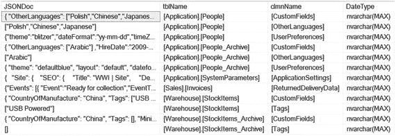

*图 9-1. 显示已检测到的包含 JSON 数据的表和列*

```sql
SET NOCOUNT ON;
DECLARE @SQL nvarchar(1000)
IF (OBJECT_ID('tempdb.dbo.#Result')) IS NOT NULL
DROP TABLE #Result
CREATE TABLE #Result (tblName nvarchar(200),
clmnName nvarchar(100),
DateType nvarchar(100),
JSONDoc nvarchar(MAX),)
DECLARE cur CURSOR
FOR
SELECT 'SELECT TOP (1) ''' + QUOTENAME(s.name) +'.' + QUOTENAME(o.name) + ''' as TblName, '''
+ QUOTENAME(c.name)  + ''' as ClmName, '''
+ t.name  + QUOTENAME(case c.max_length when -1 then 'MAX' ELSE cast(c.max_length as varchar(5)) END , ')') + ''' as DataType, '
+ QUOTENAME(c.name)  + ' FROM '
+ QUOTENAME(s.name) +'.' + QUOTENAME(o.name) +
' WHERE ISJSON(' + QUOTENAME(c.name)  + ') = 1;'
FROM sys.columns c
JOIN sys.types t on c.system_type_id = t.system_type_id
JOIN sys.objects o ON c.object_id = o.object_id AND o.type = 'u'
JOIN sys.schemas s ON s.schema_id = o.schema_id
WHERE t.name IN('varchar', 'nvarchar')
AND (c.max_length = -1 OR c.max_length > 100)
OPEN cur
FETCH NEXT FROM cur INTO @SQL
WHILE @@FETCH_STATUS = 0
BEGIN
print @SQL
INSERT #Result
EXEC(@SQL)
FETCH NEXT FROM cur INTO @SQL
END
DEALLOCATE cur;
SELECT JSONDoc,tblName,clmnName,DateType
FROM #Result
ORDER BY tblName, clmnName
DROP TABLE #Result
SET NOCOUNT OFF;
```

*清单 9-1. 检测 JSON 数据*

### 工作原理

`ISJSON()` 函数验证字符串类型的值是否为有效的 JSON。`ISJSON()` 函数返回：

*   1 表示该字符串是有效的 JSON 文档。
*   0 表示该字符串是无效的 JSON 文档。
*   NULL 表达式为 NULL 值。

空的花括号 `{}` 和空的方括号 `[]` 被视为有效的 JSON，因此，`ISJSON()` 函数对这些值返回 1。`ISJSON()` 函数将用于检测 JSON 文档，并建立一个游标来构建动态 SQL，如清单 9-2 所示。

```sql
DECLARE cur CURSOR
FOR
SELECT 'SELECT TOP (1) ''' + QUOTENAME(s.name) +'.' + QUOTENAME(o.name) + ''' as TblName, '''
+ QUOTENAME(c.name)  + ''' as ClmName, '''
+ t.name  + QUOTENAME(case c.max_length when -1 then 'MAX' ELSE cast(c.max_length as varchar(5)) END , ')') + ''' as DataType, '
+ QUOTENAME(c.name)  + ' FROM '
+ QUOTENAME(s.name) +'.' + QUOTENAME(o.name) +
' WHERE ISJSON(' + QUOTENAME(c.name)  + ') = 1;'
FROM sys.columns c
JOIN sys.types t on c.system_type_id = t.system_type_id
JOIN sys.objects o ON c.object_id = o.object_id AND o.type = 'u'
JOIN sys.schemas s ON s.schema_id = o.schema_id
WHERE t.name IN('varchar', 'nvarchar')
AND (c.max_length = -1 OR c.max_length > 100);
```

*清单 9-2. 构建动态 SQL 以检测 JSON 文档*

存储 JSON 的列具有 `nvarchar` 和 `varchar` 数据类型。理论上，`nchar` 和 `char` 数据类型的列也可以存储 JSON；但是，固定长度的数据类型并不适合 JSON。错误的设计考虑可能会在二进制数据类型（例如用于 JSON 文档的 `varbinary` 和 `image`）中实现。

**注意**

Microsoft 推荐使用 `nvarchar(max)` 作为存储 JSON 文档的标准数据类型，正如在 WideWorldImporters 示例数据库（图 9-1）中所实现的那样。所有存储 JSON 的列都具有 `nvarchar(max)` 数据类型。

因此，用于游标的动态 SQL（清单 9-1）筛选了表 `sys.types`，并将列名筛选为 '`varchar`'、'`nvarchar`'。在第 4 章中，方法 4-7 演示了当数据类型筛选器包含另外四种数据类型：`varbinary`、`image`、`text` 和 `ntext` 时，如何检测 XML 列。此外，列长度小于 100 时存储 JSON 的可能性较小。因此，对来自表 `sys.columns` 的 `max_length` 列按 -1（即 `MAX`）或大于 100 进行了筛选。

游标的 `SELECT` 语句生成的动态 SQL 输出如下：

1.  `Schema.TableName` – 定义架构和表
2.  `ColumnName` – 定义列名
3.  `DataType(data length)` – 定义数据类型
4.  列名 – 定义返回的 JSON 文档

`WHERE` 子句使用列名作为参数实现 `ISJSON()`。动态 SQL 行的输出如清单 9-3 所示。动态 SQL 的结果如图 9-2 所示。

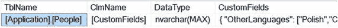

*图 9-2. 显示清单 9-3 的输出*

```sql
SELECT TOP (1) '[Application].[People]' as TblName,
'[CustomFields]' as ClmName,
'nvarchar(MAX)' as DataType,
[CustomFields]
FROM [Application].[People]
WHERE ISJSON([CustomFields]) = 1;
```

*清单 9-3. 动态 SQL 生成的代码*

循环遍历动态 SQL 的每一行，并检查每列中是否存在潜在的 JSON 文档。当 `ISJSON()` 返回值 1（表示 TRUE）时，该 SQL 的输出将被记录到临时表 `#Result` 中，该表在游标声明之前创建。当游标遍历完成后，临时表 `#Result` 将返回所有已记录的行。

## 9-2. 返回 JSON 文档的子集

### 问题

您希望从 JSON 文档中返回一个对象或数组。

### 解决方案

`JSON_QUERY()` 函数从包含 JSON 文档的变量或列中返回一个子集（对象或数组）。清单 9-4 演示了如何从存储在 `Sales.Invoices` 表 `ReturnedDeliveryData` 列中的 JSON 文档中返回 `Events` 数组对象（其中的两个）。结果如清单 9-5 所示。

```sql
SELECT TOP (1) JSON_QUERY([ReturnedDeliveryData], '$.Events')
FROM [Sales].[Invoices];
```

*清单 9-4. 返回 Events 数组*

```json
[
{
"Event":"Ready for collection",
"EventTime":"2013-01-01T12:00:00",
"ConNote":"EAN-125-1051"
},
{
"Event":"DeliveryAttempt",
"EventTime":"2013-01-02T07:05:00",
"ConNote":"EAN-125-1051",
"DriverID":15,
"Latitude":41.3617214,
"Longitude":-81.4695602,
"Status":"Delivered"
}
]
```

*清单 9-5. 清单 [9-4] 的结果*


### 工作原理

`JSON_QUERY()` 函数有两个参数：

1.  **Expression** – 一个必需的参数，期望来自列名或变量的 JSON 文档。
2.  **Path** – 一个可选的参数，提供到 JSON 对象部分的文档路径。

> **注意**
>
> 路径参数中的美元符号 (`$`) 表示 JSON 上下文，可以将其视为顶级对象。

示例方案演示的 JSON 文档存储在 `Sales.Invoices` 表的 `ReturnedDeliveryData` 列中。例如，清单 9-6 中显示的完整 JSON 文档有两个额外的键元素 `DeliveredWhen` 和 `ReceivedBy`，它们不属于 `JSON_QUERY()` 结果的一部分，因为路径参数被设置为包含两个子数组的对象 `Events`。

```json
{
"Events":[
{
"Event":"Ready for collection",
"EventTime":"2013-01-01T12:00:00",
"ConNote":"EAN-125-1051"
},
{
"Event":"DeliveryAttempt",
"EventTime":"2013-01-02T07:05:00",
"ConNote":"EAN-125-1051",
"DriverID":15,
"Latitude":41.3617214,
"Longitude":-81.4695602,
"Status":"Delivered"
}
],
"DeliveredWhen":"2013-01-02T07:05:00",
"ReceivedBy":"Aakriti Byrraju"
}
```
**清单 9-6.** 显示完整的 JSON 文档

要返回单个数组对象，路径参数需要指定一个数组索引，如清单 9-7 所示。清单 9-8 展示了单个数组对象的 JSON 输出。

```sql
SELECT TOP (1) JSON_QUERY([ReturnedDeliveryData], '$.Events[0]')
FROM [Sales].[Invoices];
```
**清单 9-7.** 引用单个 JSON 数组对象

```json
{
"Event":"Ready for collection",
"EventTime":"2013-01-01T12:00:00",
"ConNote":"EAN-125-1051 "
}
```
**清单 9-8.** 显示数组输出

> **警告**
>
> 与基于 1 的起始索引的 XML 单例不同，JSON 数组是基于 0 的。因此，要引用第一个数组对象或数组值，索引必须是 0，而不是 1。

当 `JSON_QUERY()` 函数未设置路径参数时，该函数返回完整的 JSON 文档。

## 9-3. 从 JSON 返回标量值

### 问题

你想从 JSON 文档中返回一个标量值。

### 解决方案

`JSON_VALUE()` 函数从 JSON 文档中提取标量值，如清单 9-9 所示。查询结果如图 9-3 所示。

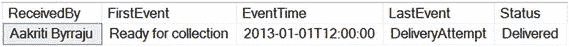
**图 9-3.** 显示查询结果

```sql
SELECT TOP (1) JSON_value([ReturnedDeliveryData], '$.ReceivedBy') ReceivedBy
,JSON_value([ReturnedDeliveryData], '$.Events[0].Event') FirstEvent
,JSON_value([ReturnedDeliveryData], '$.Events[0].EventTime') EventTime
,JSON_value([ReturnedDeliveryData], '$.Events[1].Event') LastEvent
,JSON_value([ReturnedDeliveryData], '$.Events[1].Status') [Status]
FROM [Sales].[Invoices];
```
**清单 9-9.** 返回标量值

### 工作原理

`JSON_VALUE()` 函数有两个必需参数：

1.  **Expression** – 期望来自列名或变量的 JSON 文档。
2.  **Path** – 到 JSON 标量值的 JSON 文档路径。

与返回对象和数组的 `JSON_QUERY()` 函数不同，`JSON_VALUE()` 函数返回 JSON 标量值。如果您尝试使用 `JSON_QUERY()` 函数返回标量值，将返回 `NULL`。`JSON_VALUE()` 函数则相反——当路径引用对象或数组而不是键时，它返回 `NULL`。例如，清单 9-10 中的查询演示了在 `JSON_VALUE()` 和 `JSON_QUERY()` 函数之间翻转对象和值引用。图 9-4 显示了当引用标量值的 `JSON_VALUE()` 返回 `ReceivedBy` 值而引用标量值的 `JSON_QUERY()` 返回 `NULL` 时的结果。在接下来的两列中，引用数组的 `JSON_VALUE()` 返回 `NULL` 值，而引用数组的 `JSON_QUERY()` 返回一个 JSON 片段。

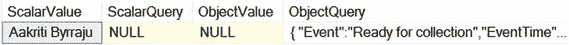
**图 9-4.** 显示查询结果

```sql
SELECT TOP (1) JSON_VALUE([ReturnedDeliveryData], '$.ReceivedBy') ScalarValue
,JSON_QUERY([ReturnedDeliveryData], '$.ReceivedBy') ScalarQuery
,JSON_VALUE([ReturnedDeliveryData], '$.Events[0]') ObjectValue
,JSON_QUERY([ReturnedDeliveryData], '$.Events[0]') ObjectQuery
FROM [Sales].[Invoices];
```
**清单 9-10.** 演示 `JSON_VALUE()` 和 `JSON_QUERY()` 函数

`JSON_VALUE()` 函数为标量值返回 `nvarchar(4000)` 数据类型。清单 9-11 演示了如何验证 `JSON_VALUE()` 函数返回的数据类型。图 9-5 显示了返回的结果。

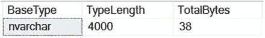
**图 9-5.** 验证代码的输出结果

```sql
DECLARE @Value sql_variant
SELECT @Value =
(
SELECT TOP (1) JSON_value([ReturnedDeliveryData], '$."ReceivedBy"')
FROM [Sales].[Invoices]
);
SELECT SQL_VARIANT_PROPERTY(@Value,'BaseType') BaseType,
CAST(SQL_VARIANT_PROPERTY(@Value, 'MaxLength')as int) /
CASE SQL_VARIANT_PROPERTY(@Value,'BaseType') WHEN 'nvarchar'
THEN 2 ELSE 1 END TypeLength,
SQL_VARIANT_PROPERTY(@Value,'TotalBytes') TotalBytes;
```
**清单 9-11.** 通过 `JSON_VALUE()` 函数验证返回的数据类型

当标量值大于 4000 个字符时，该函数返回 `NULL`。清单 9-12 演示了当标量值 `LongText` 包含 5,009 个字符并由 `JSON_VALUE()` 函数处理时的 JSON 文档。查询结果如图 9-6 所示。

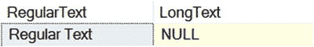
**图 9-6.** 显示查询结果

```sql
declare @json nvarchar(max) = '
{
"RegularText":"Regular Text",
"LongText":"Long Text' + REPLICATE(' too long ', 500) + '"
}'
SELECT JSON_VALUE(@json, '$.RegularText') RegularText ,
JSON_VALUE(@json, '$.LongText') LongText
```
**清单 9-12.** 演示超出字符限制的文本如何影响 `JSON_VALUE()` 函数输出

> **注意**
>
> 当 JSON 键包含无效字符（如空格）时，键必须用双引号 (`“”`) 括起来。例如，当键是 `Last Name` 时，路径参数将是：
> ```sql
> SELECT JSON_VALUE(@json, '$."Last Name"')
> ```

## 9-4. 对返回的 NULL 进行故障排除

### 问题

你想对 JSON 标量值为 `NULL` 的原因进行故障排除。

### 解决方案

在 JSON 函数中实现严格模式（strict mode）会在返回 `NULL` 时引发错误。清单 9-13 演示了严格模式下的查询。错误消息如清单 9-14 所示。

```sql
SELECT JSON_VALUE([ReturnedDeliveryData], 'strict $.receivedby') ReceivedBy
FROM [Sales].[Invoices];
```
**清单 9-13.** 强制 `JSON_VALUE()` 函数引发错误

```text
Msg 13608, Level 16, State 5, Line 1
Property cannot be found on the specified JSON path.
```
**清单 9-14.** 显示错误消息


## 9-4. 为 JSON 路径实现严格模式

### 工作原理

支持 `path` 参数的 JSON 函数可以实现**严格模式**，以强制在返回的标量值为 `NULL` 时抛出错误。这些函数包括：

*   `JSON_VALUE()`
*   `JSON_QUERY()`
*   `JSON_MODIFY()`
*   `OPENJSON()`

对于支持路径参数的函数，其路径参数可以在两种模式下运行：

*   `lax` 模式（默认），JSON 函数返回标量 `NULL` 值
*   `strict` 模式，JSON 函数返回错误而非 `NULL` 值

**注意**

`lax` 和 `strict` 关键字都是**区分大小写**的；因此，实现时必须全部使用小写。

清单 9-15 展示了在严格模式下执行代码时，如何检测 `JSON_VALUE()` 函数标量输出的问题。清单 9-16 展示了错误消息。

```sql
declare @json nvarchar(max) = '
{
"RegularText":"Regular Text",
"LongText":"Long Text' + REPLICATE(' too long ', 500) + '"
}'
SELECT JSON_VALUE(@json, 'strict $.LongText') LongText
```

*清单 9-15. 实现严格模式*

```sql
Msg 13625, Level 16, State 1, Line 7
String value in the specified JSON path would be truncated.
```

*清单 9-16. 显示错误消息*

清单 9-16 中的错误消息通知文本超过了最大 4,000 个字符的限制。然而，`OPENJSON()` 函数（我们将在下一个配方中介绍）可以解决这个问题。

## 9-5. 将 JSON 转换为表

### 问题

你希望将一个 JSON 文档转换为行列格式。

### 解决方案

`OPENJSON()` 表值函数可拆分 JSON 文档并以行列格式返回结果集。清单 9-17 拆分了来自表 `[Application].[People]`、列 `[UserPreferences]` 的 JSON 文档。图 9-7 显示了查询结果。

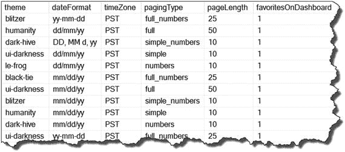

*图 9-7. 显示查询结果*

```sql
SELECT UserPref.theme,
       UserPref.[dateFormat],
       UserPref.timeZone,
       UserPref.pagingType,
       UserPref.pageLength,
       UserPref.favoritesOnDashboard
FROM [Application].[People]
CROSS APPLY OPENJSON([UserPreferences])
WITH
(
   theme         varchar(20) '$.theme',
   [dateFormat]  varchar(20) '$.dateFormat',
   timeZone      varchar(10) '$.timeZone',
   pagingType    varchar(20) '$.table.pagingType',
   pageLength    int         '$.table.pageLength',
   favoritesOnDashboard bit  '$.favoritesOnDashboard'
) AS UserPref;
```

*清单 9-17. 将 JSON 转换为表结构*

### 工作原理

`OPENJSON()` 表值函数拆分并将 JSON 文档转换为行集。由于 `OPENJSON()` 函数返回一个行集，因此可以使用 `CROSS APPLY` 和 `OUTER APPLY` 运算符在 `FROM` 子句中使用它。

`OPENJSON()` 函数由两个参数和一个 `WITH` 子句组成：

*   `jsonExpression`（必需）– 有效的 JSON 列或变量
*   `path`（可选）– JSON 对象或数组路径
*   `WITH` 子句（可选）– 显式定义输出表；因此，需要为每一列指定名称和数据类型。可选地，`WITH` 子句可以引用对象或数组，如清单 9-18 所示。

在我们查看清单 9-17 中的查询细节之前，我们将讨论来自 `[Application].[People]` 表、列 `[UserPreferences]` 的一个 JSON 文档，如清单 9-18 所示。

```json
{
  "theme": "blitzer",
  "dateFormat": "yy-mm-dd",
  "timeZone": "PST",
  "table": {
    "pagingType": "full_numbers",
    "pageLength": 25
  },
  "favoritesOnDashboard": true
}
```

*清单 9-18. 显示 JSON 文档*

该文档有四个被视为第一级的键值对元素：

*   `theme`
*   `dateFormat`
*   `timeZone`
*   `favoritesOnDashboard`

此外，子对象 `table` 还包含另外两个键值对元素：

*   `pagingType`
*   `pageLength`

解决方案部分（清单 9-17）中的 `OPENJSON()` 函数仅实现了必需的参数，即 `UserPreferences` 列，例如：`OPENJSON([UserPreferences])`。对于提供的解决方案，无需指定路径参数，因为所有 JSON 键都在 `WITH` 子句中显式定义了，例如：

```sql
CROSS APPLY OPENJSON([UserPreferences])
WITH
(
   theme        varchar(20) '$.theme',
   [dateFormat] varchar(20) '$.dateFormat',
   timeZone     varchar(10) '$.timeZone',
   pagingType   varchar(20) '$.table.pagingType',
   pageLength   int         '$.table.pageLength',
   favoritesOnDashboard bit '$.favoritesOnDashboard'
) AS UserPref
```

`OPENJSON()` 函数默认可以定义为处理所有第一级键。例如，当 `WITH` 子句没有为第一级键指定显式路径时，`OPENJSON()` 函数会返回相同的输出，如清单 9-19 所示。

```sql
SELECT UserPref.theme,
       UserPref.[dateFormat],
       UserPref.timeZone,
       UserPref.pagingType,
       UserPref.pageLength,
       UserPref.favoritesOnDashboard
FROM [Application].[People]
CROSS APPLY OPENJSON([UserPreferences])
WITH
(
   theme        varchar(20),
   [dateFormat] varchar(20),
   timeZone     varchar(10),
   pagingType   varchar(20) '$.table.pagingType',
   pageLength   int         '$.table.pageLength',
   favoritesOnDashboard bit
) AS UserPref;
```

*清单 9-19. 使用默认的第一级键拆分 JSON 文档*

这种实现方式有一个注意事项：`WITH` 子句中的所有第一级键必须与 JSON 文档名称匹配，并且名称**区分大小写**。子对象 `table` 由于是第二级 JSON，仍然需要路径规范。

当 `OPENJSON()` 函数完全使用默认值（即，没有路径参数且没有 `WITH` 子句）时，该函数返回三列：

| Type 列值 | JSON 数据类型描述 |
| --- | --- |
| 0 | `NULL` |
| 1 | `string` |
| 2 | `int` |
| 3 | `boolean` (true/false) |
| 4 | `array` |
| 5 | `object` |

*   `Key` – `nvarchar(4000)`，返回一个 JSON 键、对象或数组名称。
*   `Value` – `nvarchar(max)`，返回一个 JSON 属性值。
*   `Type` – `int`，返回 JSON 属性值的类型。类型描述如表 9-1 所示。

清单 9-20 使用了清单 9-18 中的 JSON 数据，将变量中的 JSON 文档表示为表结构。图 9-8 展示了来自 JSON 变量的结果。

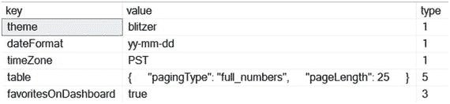

*图 9-8. 显示 OPENJSON() 函数结果*

```sql
declare @json varchar(max) =
'{
  "theme": "blitzer",
  "dateFormat": "yy-mm-dd",
  "timeZone": "PST",
  "table": {
    "pagingType": "full_numbers",
    "pageLength": 25
  },
  "favoritesOnDashboard": true
}'
SELECT [key], [value], [type]
FROM OPENJSON(@json);
```

*清单 9-20. 运行不带可选参数或 WITH 子句的 OPENJSON() 函数*

## 9-6. 处理 JSON 嵌套子对象

### 问题

你希望拆分具有多个嵌套级别的 JSON。


## 9-6. 处理多级 JSON

### 解决方案

要切分（shred）一个子对象，你需要在一个父级`OPENJSON(…) WITH(…)`块中设置对该子对象的引用。新的 JSON 实例将作为一个独立的子对象 JSON 存在。演示的解决方案是一个与数据库无关的过程，可以在任何兼容级别（`COMPATIBILITY_LEVEL`）为 130 或更高的数据库上运行。完整的解决方案在`清单 9-21`中展示。最终的查询结果如图`9-9`所示。

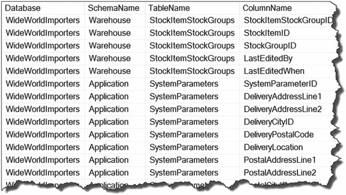
图 9-9：显示最终结果

```sql
SET NOCOUNT ON;
DECLARE @JSON nvarchar(MAX),
@schema nvarchar(30),
@tbl nvarchar(128),
@objID int
DROP TABLE IF EXISTS dbo.Table_Info_JSON;
CREATE TABLE Table_Info_JSON (
TableID int PRIMARY KEY,
DBName nvarchar(128),
[SchemaName] nvarchar(30),
tblName nvarchar(128),
JSONDoc nvarchar(MAX)
);
DECLARE cur CURSOR FOR
SELECT object_id, [Schema].name, [Table].name
FROM sys.objects [Table]
JOIN sys.schemas [Schema] on [Table].schema_id = [Schema].schema_id
WHERE type = 'u';
OPEN cur ;
FETCH NEXT FROM cur INTO @objID, @schema, @tbl;
WHILE @@FETCH_STATUS = 0
BEGIN
SELECT @JSON = (
SELECT db_name() as 'Database',
[Schema].name as 'Tables.SchemaName',
[Table].name as 'Tables.TableName',
(SELECT [Column].name ColumnName FROM sys.columns [Column]
WHERE [Column].object_id = [Table].object_id FOR JSON AUTO
) AS 'Tables.Columns'
FROM sys.objects [Table]
JOIN sys.schemas [Schema] on [Table].schema_id = [Schema].schema_id
WHERE [Table].object_id = @objID
FOR JSON PATH, WITHOUT_ARRAY_WRAPPER
);
INSERT Table_Info_JSON
SELECT @objID, DB_NAME(), @schema, @tbl, @JSON;
FETCH NEXT FROM cur INTO @objID, @schema, @tbl;
END;
DEALLOCATE cur;
SET NOCOUNT OFF;
SELECT db.[Database]    -- first level
, tbl.SchemaName -- second level
, tbl.TableName  -- second level
, clmn.ColumnName -- third level
FROM dbo.Table_Info_JSON
CROSS APPLY OPENJSON (JSONDoc)
WITH
(
[Database] varchar(30),
[Tables] nvarchar(MAX) AS JSON
) as db
CROSS APPLY OPENJSON ([Tables])
WITH
(
TableName varchar(30),
SchemaName varchar(30),
[Columns] nvarchar(MAX) AS JSON
) as tbl
CROSS APPLY OPENJSON ([Columns])
WITH
(
ColumnName varchar(30)
) as clmn;
```
`清单 9-21`：切分多个 JSON 子对象的解决方案

### 工作原理

切分多级子对象 JSON 数据的机制是基于一个父子对象的引用集。要理解其工作原理，我们需要仔细查看`清单 9-22`中来自`Table_Info_JSON`表的 JSON 文档。

```json
{
"Database": "WideWorldImporters",
"Tables": {
"SchemaName": "Warehouse",
"TableName": "Colors",
"Columns": [
{ "ColumnName": "ColorID" },
{ "ColumnName": "ColorName" },
{ "ColumnName": "LastEditedBy" },
{ "ColumnName": "ValidFrom" },
{ "ColumnName": "ValidTo" }
]
}
}
```
`清单 9-22`：显示 JSON 文档

示例`9-9`中显示的 JSON 文档有三个层级：
*   顶级（Level 1）– 键 `"Database"`
*   子级（Level 2）– 对象 `"Tables"`
*   子级（Level 3）– 数组 `"Columns"`

因此，在`FROM`子句中反映出的 JSON 结构如`清单 9-23`所示：

```sql
FROM dbo.Table_Info_JSON
CROSS APPLY OPENJSON (JSONDoc) <- reference to the table column
WITH
(
[Database] varchar(30),
[Tables] nvarchar(MAX) AS JSON
) as db
CROSS APPLY OPENJSON ([Tables]) <- reference to [Tables] JSON object
WITH
(
TableName varchar(30),
SchemaName varchar(30),
[Columns] nvarchar(MAX) AS JSON
) as tbl
CROSS APPLY OPENJSON ([Columns]) <- reference to [Columns] JSON array
WITH
(
ColumnName varchar(30)
) as clmn
```
`清单 9-23`：显示`FROM`子句

在`OPENJSON`函数的`WITH`子句中引用子级集合。子对象名称必须是`nvarchar(MAX)`数据类型，并设置为`AS JSON`对象。例如：`[Tables] nvarchar(MAX) AS JSON`。

`SELECT`子句使用在`FROM`子句中创建的别名来交付结果：

```sql
SELECT db.[Database]    -- first level
, tbl.SchemaName -- second level
, tbl.TableName  -- second level
, clmn.ColumnName -- third level
```

## 9-7. JSON 索引

### 问题

你想要通过索引来改进 JSON 过滤性能。

### 解决方案

要为 JSON 文档创建索引，你需要为 JSON 标量值添加一个计算列，然后在此列上创建索引。`清单 9-24`演示了如何向现有表添加针对 JSON 值的索引。该索引是针对图`9-10`中所示的 JSON 值创建的。

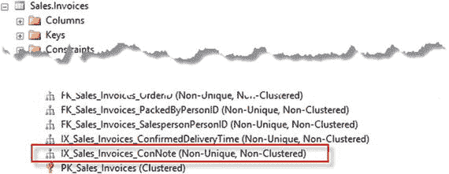
图 9-10：显示 JSON 索引

```sql
USE [WideWorldImporters];
SET ANSI_NULLS ON;
ALTER TABLE [Sales].[Invoices] ADD ConNote AS
CAST(JSON_VALUE([ReturnedDeliveryData], '$.Events[0].ConNote') AS varchar(20)) PERSISTED
CREATE  INDEX IX_Sales_Invoices_ConNote
ON [Sales].[Invoices]
(
[ConNote]
)INCLUDE(
[InvoiceDate]
,[DeliveryInstructions]
,[TotalDryItems]
,[TotalChillerItems]
,[ConfirmedDeliveryTime]
,[ConfirmedReceivedBy]
);
```
`清单 9-24`：为 JSON 键值`ConNote`创建索引


### 工作原理

在 SQL Server 中，JSON 并不像 XML 那样被视为一种数据类型。它更类似于一个包含多个值的结构化字符串，并以 `nvarchar(max)` 数据类型存储（如果你遵循 Microsoft 的建议）。因此，存储 JSON 文档的列无法像标量值表列那样拥有传统索引。然而，可以通过 `JSON_VALUE()` 标量函数获取一个标量 JSON 值，这正是为 JSON 文档创建索引的关键。

为 JSON 文档创建索引机制包含两个步骤：

1.  使用 `JSON_VALUE()` 函数向表添加一个计算列，该函数从 JSON 文档中返回一个标量值。计算列必须使用 `PERSISTED` 选项。另外，你需要记住 `JSON_VALUE()` 函数返回的数据类型是 `nvarchar(4000)`。因此，我建议将 `JSON_VALUE()` 函数返回的数据长度转换为更接近原始数据的长度。例如：
    ```sql
    CAST(JSON_VALUE([ReturnedDeliveryData], '$.Events[0].ConNote') AS varchar(20)) PERSISTED
    ```

2.  在你的计算列上创建索引。根据需要，索引可以包含 `INCLUDE` 子句来创建一个完全覆盖的索引。

为 JSON 文档创建索引可以极大地提升性能。清单 9-25 展示了一个查询，该查询对 JSON 键元素 `ConNote` 上的计算列应用了筛选器。

```sql
SET STATISTICS IO,TIME ON;
SELECT [InvoiceDate]
,[DeliveryInstructions]
,[TotalDryItems]
,[TotalChillerItems]
,[ConfirmedDeliveryTime]
,[ConfirmedReceivedBy]
,[ConNote]
FROM [Sales].[Invoices]
WHERE [ConNote] = 'EAN-125-1051';
SET STATISTICS IO,TIME OFF;
```
*清单 9-25. 筛选 ConNote 列*

图 9-11 展示了该查询的 "STATISTICS IO, TIME" 结果和执行计划。清单 9-26 是该查询在索引创建前后的比较。

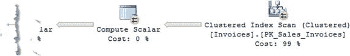

```sql
---- 无索引
SQL Server parse and compile time:
CPU time = 0 ms, elapsed time = 0 ms.
(1 row(s) affected)
Table 'Invoices'. Scan count 9, logical reads 8843, physical reads 0, read-ahead reads 0, lob logical reads 0, lob physical reads 0, lob read-ahead reads 0.
Table 'Worktable'. Scan count 0, logical reads 0, physical reads 0, read-ahead reads 0, lob logical reads 0, lob physical reads 0, lob read-ahead reads 0.
(1 row(s) affected)
SQL Server Execution Times:
CPU time = 94 ms,  elapsed time = 60 ms.
```
*清单 9-26. 比较索引创建前后的查询*

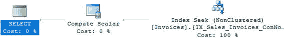
*图 9-11. 比较索引创建前后的执行计划和 STATISTICS 结果*

```sql
---- 无索引
SQL Server parse and compile time:
CPU time = 0 ms, elapsed time = 0 ms.
(1 row(s) affected)
Table 'Invoices'. Scan count 9, logical reads 8843, physical reads 0, read-ahead reads 0, lob logical reads 0, lob physical reads 0, lob read-ahead reads 0.
Table 'Worktable'. Scan count 0, logical reads 0, physical reads 0, read-ahead reads 0, lob logical reads 0, lob physical reads 0, lob read-ahead reads 0.
(1 row(s) affected)
SQL Server Execution Times:
CPU time = 94 ms,  elapsed time = 60 ms.
---- 有索引
SQL Server parse and compile time:
CPU time = 0 ms, elapsed time = 0 ms.
(1 row(s) affected)
Table 'Invoices'. Scan count 1, logical reads 3, physical reads 0, read-ahead reads 0, lob logical reads 0, lob physical reads 0, lob read-ahead reads 0.
(1 row(s) affected)
SQL Server Execution Times:
CPU time = 0 ms,  elapsed time = 33 ms.
```

如你所见，使用索引筛选后性能得到了显著提升。

## 总结

SQL Server 2016 引入了 JSON 集成，与最新技术配合良好。第 9 章“将 JSON 转换为行集”介绍了完整的 SQL Server 函数集以及大量用于分解和交付 JSON 文档结果的示例。

下一章将演示如何修改 JSON 文档，并最终比较 JSON 和 XML 的性能。

