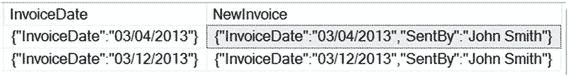
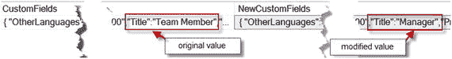
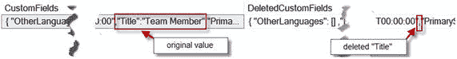
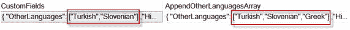
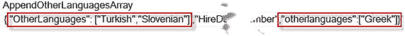
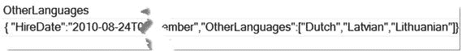

# 10. 修改 JSON

为了在 JSON 文档中插入、删除和更新数据，SQL Server 2016 引入了 `JSON_MODIFY()` 函数，用于更新 JSON 字符串值。与 XML 的 `modify()` 方法相比，此函数仅支持追加模式，而 XML 方法则提供了插入、删除和替换模式。第 10 章“修改 JSON”将演示许多配方，解释如何更新 JSON 文档。在本章最后一节，我将比较 XML 和 JSON 之间的性能。

## 10-1. 向 JSON 添加新的键值对

### 问题

你想向 JSON 文档添加一个新的键值对。

### 解决方案

当第二个参数路径值在 JSON 文档中不存在时，`JSON_MODIFY()` 函数会添加一个新的键值对。清单 10-1 展示了使用 `JSON_MODIFY()` 函数修改 `InvoiceDate` 列的查询，向 JSON 文档添加了一个新键 "SentBy"，其值为 "John Smith"。图 10-1 显示了包含原始 (`InvoiceDate`) 和修改后的 JSON 文档 (`NewInvoice`) 列的结果。


*图 10-1. 显示查询结果*

```sql
SELECT CustomerName
, PrimaryContact
, AlternateContact
, PhoneNumber
, InvoiceDate
, JSON_MODIFY(InvoiceDate,'$.SentBy', 'John Smith') NewInvoice
FROM [dbo].[CustomerInvoice];
```
*清单 10-1. 向 JSON 文档添加新的键值对*

### 工作原理

`JSON_MODIFY()` 函数返回更新后的 JSON 文档。它有三个必需参数：

1.  **表达式** – 列、变量或有效的硬编码 JSON 的名称。
2.  **路径** – 指向值的键路径。仅支持追加模式。对于其他操作，如插入和更新，函数在自定义模式下工作。
3.  **新值** – 替换现有值或作为新值添加到 JSON 的值。

要添加新的键值对，你不需要指定特殊模式。例如，要插入一个新值，你可以使用 `JSON_MODIFY()` 函数，它是自定义的，这意味着如果路径包含一个现有的键，则更新其值。当键不存在时，一个新的键值对会被添加到 JSON 字符串中。

在“解决方案”部分，清单 10-1 中，首先使用 `JSON_MODIFY()` 函数检查 `InvoiceDate` 列中是否存在键 "SentBy"。例如：`JSON_MODIFY(InvoiceDate,'$.SentBy', 'John Smith')`。在该列中未找到此键。因此，该函数添加了一个新键 "SentBy"，其值为 "John Smith"。

## 10-2. 更新现有的 JSON

### 问题

你想更改现有键的值。

### 解决方案

`JSON_MODIFY()` 函数的 `Path` 参数必须存在于 JSON 文档中。清单 10-2 演示了将键 "Title" 和值 "Team Member" 修改为 "Manager" 的查询。图 10-2 显示了原始和修改后的 JSON 文档。


*图 10-2. 比较查询输出*

```sql
SELECT CustomFields
,JSON_MODIFY(CustomFields,'$.Title', 'Manager') NewCustomFields
FROM [Application].[People]
WHERE FullName = 'Hudson Onslow';
```
*清单 10-2. 修改 JSON 文档*


### 工作原理

`JSON_MODIFY()` 函数是自定义的，如前面的配方 10-1 所解释。`CustomFields` 列中的 JSON 文档包含键“Title”。因此，当通过 JSON 字符串检测到键路径时，`JSON_MODIFY()` 函数会更新其值属性。此概念将在解决方案部分的列表 10-2 中演示。

## 10-3. 从 JSON 中删除

### 问题

你想从 JSON 文档中删除一个键值对。

### 解决方案

如果需要删除键值对，请将 `JSON_MODIFY()` 函数的第三个参数 `NewValue` 设置为 `NULL`，如列表 10-3 所示。图 10-3 显示了原始和修改后的 JSON。



图 10-3.

比较删除键“Title”后的查询输出

```sql
SELECT CustomFields
,JSON_MODIFY(CustomFields,'$.Title', NULL) NewCustomFields
FROM [Application].[People]
WHERE FullName = 'Hudson Onslow';
```
列表 10-3.
使用值 `NULL` 删除键“Title”

### 工作原理

当 `JSON_MODIFY()` 函数的第三个参数 (`NewValue`) 为 `NULL` 时，该键值对将从 JSON 中删除。此概念适用于键、对象和数组。列表 10-4 演示了如何从 JSON 变量 `@j` 中删除数组“OtherLanguages”。表 10-1 对比了原始 JSON 和经过 `JSON_MODIFY()` 函数处理后的 JSON。

表 10-1.

并排比较结果

| 原始 JSON | 删除了数组 OtherLanguages 的 JSON |
| --- | --- |
| `{` `"OtherLanguages": [` `"Polish",` `"Chinese",` `"Japanese"` `],` `"HireDate": "2008-04-19T00:00:00",` `"Title": "Team Member",` `"PrimarySalesTerritory": "Plains",` `"CommissionRate": "0.98"` `}` | `{` `"HireDate": "2008-04-19T00:00:00",` `"Title": "Team Member",` `"PrimarySalesTerritory": "Plains",` `"CommissionRate": "0.98"` `}` |

```sql
declare @j as nvarchar(MAX) =
N'{
"OtherLanguages": [
"Polish",
"Chinese",
"Japanese"
],
"HireDate": "2008-04-19T00:00:00",
"Title": "Team Member",
"PrimarySalesTerritory": "Plains",
"CommissionRate": "0.98"
}';
SELECT JSON_MODIFY(@j,'$.OtherLanguages', NULL) DeletedOtherLanguages;
```
列表 10-4.
删除数组

另一个例子演示了从分配给变量 `@j` 的 JSON 文档中删除对象“table”，如列表 10-5 所示。表 10-2 对比了原始 JSON 和经过 `JSON_MODIFY()` 函数处理后的 JSON。

表 10-2.

并排比较结果

| 原始 JSON | 删除了对象 table 的 JSON |
| --- | --- |
| `{` `"theme": "humanity",` `"dateFormat": "dd/mm/yy",` `"timeZone": "PST",` `"table": {` `"pagingType": "full",` `"pageLength": 50` `},` `"favoritesOnDashboard": true` `}` | `{` `"theme": "humanity",` `"dateFormat": "dd/mm/yy",` `"timeZone": "PST",` `"favoritesOnDashboard": true` `}` |

```sql
declare @j nvarchar(MAX) =
N'{
"theme": "humanity",
"dateFormat": "dd/mm/yy",
"timeZone": "PST",
"table": {
"pagingType": "full",
"pageLength": 50
},
"favoritesOnDashboard": true
}';
SELECT JSON_MODIFY(@j,'$.table', NULL) Delete_table;
```
列表 10-5.
从 JSON 文档中删除对象 “table”

所有示例都展示了使用 `JSON_MODIFY()` 函数从 JSON 字符串中删除键、对象和数组是多么容易。

## 10-4. 追加 JSON 属性

### 问题

你想向现有数组添加一个新值。

### 解决方案

`JSON_MODIFY()` 函数的追加模式指定需要将新值添加到现有的数组列表中。列表 10-6 演示了如何向“OtherLanguages”数组添加新语言。带有 JSON 输出的返回结果的“前后”对比显示在图 10-4 中。



图 10-4.

显示新语言追加到 JSON 数组

```sql
SELECT CustomFields
,JSON_MODIFY(CustomFields,'append $.OtherLanguages', 'Greek') AS
AppendOtherLanguagesArray
FROM [Application].[People]
WHERE FullName = 'Isabella Rupp';
```
列表 10-6.
将希腊语追加到 JSON 数组

### 工作原理

`JSON_MODIFY()` 函数提供了一个可选的追加模式。追加模式指定了路径参数，并指示 `JSON_MODIFY()` 函数向现有列表添加新值。当指定了追加模式但键路径不存在时，`JSON_MODIFY()` 函数会创建一个新的键值对。例如，如果列表 10-6 中的解决方案查询在“OtherLanguages”数组以小写拼写时执行，如列表 10-7 所示。此时，`JSON_MODIFY()` 函数会创建一个新的“otherlanguages”数组。结果如图 10-5 所示。



图 10-5.

显示带有重复数组的 JSON

```sql
SELECT CustomFields
,JSON_MODIFY(CustomFields,'append $.otherlanguages', 'Greek') AS
AppendOtherLanguagesArray
FROM [Application].[People]
WHERE FullName = 'Isabella Rupp';
```
列表 10-7.
追加一个不存在的数组

为避免此类错误，请确保为 `JSON_MODIFY()` 函数路径参数提供了正确的 JSON 路径。

## 10-5. 使用多重操作进行修改

### 问题

你想对 JSON 字符串应用多个值更改。

### 解决方案

使用提供的参数为 `JSON_MODIFY()` 函数创建多个内联引用。列表 10-8 演示了多次调用 `JSON_MODIFY()` 函数。以下内容被依次更改：

1.  将值“Greek”追加到“OtherLanguages”数组。
2.  将“Title”:“Team Member”更新为“Title”:“Manager”。
3.  插入“CommissionRate”:“1.19”键值对。

表 10-3 对比了原始 JSON 和经过 `JSON_MODIFY()` 函数处理后的 JSON。

表 10-3.

并排比较结果

| 原始 JSON | 修改后的 JSON |
| --- | --- |
| `{` `"OtherLanguages": [` `"Turkish",` `"Slovenian"` `],` `"HireDate": "2010-08-24T00:00:00",` `"Title": "Team Member"` `}` | `{ "OtherLanguages": [` `"Turkish",` `"Slovenian",` `"Greek"` `],` `"HireDate": "2010-08-24T00:00:00",` `"Title": "Manager",` `"CommissionRate": "1.19"` `}` |

```sql
SELECT CustomFields
,JSON_MODIFY(
JSON_MODIFY(
JSON_MODIFY(CustomFields,'append $.OtherLanguages', 'Greek')
, '$.Title', 'Manager')
,'$.CommissionRate', '1.19') AS Multi_Changes
FROM [Application].[People]
WHERE FullName = 'Isabella Rupp';
```
列表 10-8.
演示多次调用 `JSON_MODIFY()` 函数

### 工作原理

`JSON_MODIFY()` 函数能够通过连续的内联调用进行多重修改。`JSON_MODIFY()` 函数返回修改后的 JSON。因此，每个返回的 JSON 字符串都可以被连续处理以进行另一次修改。

## 10-6. 重命名 JSON 键

### 问题

你想重命名一个 JSON 键。


## 10-7\. 修改 JSON 对象

### 问题

你需要替换 JSON 数组对象中的所有值。

### 解决方案

`JSON_MODIFY()` 函数通过指定的 `Path` 和 `NewValue` 参数来替换 JSON 数组中的所有值。代码清单 10-10 展示了替换 JSON 数组的解决方案部分。表 10-5 对原始和修改后的 JSON 数组进行了并排比较。

表 10-5.
JSON 结果的并排比较

| 原始 JSON | 修改后的 JSON |
| --- | --- |
| `{` `"OtherLanguages": [` `"Turkish", "Slovenian"` `],` `"HireDate": "2010-08-24T00:00:00",` `"Title": "Team Member"` `}` | `{` `"OtherLanguages": [` `"Dutch", "Latvian", "Lithuanian"` `],` `"HireDate": "2010-08-24T00:00:00",` `"Title": "Team Member"` `}` |

```sql
SELECT CustomFields, JSON_MODIFY(CustomFields, '$.OtherLanguages',
JSON_QUERY('["Dutch","Latvian","Lithuanian"]')) OtherLanguages
FROM [Application].[People]
WHERE FullName = 'Isabella Rupp';
```
代码清单 10-10.
替换 JSON 数组

### 工作原理

要替换 JSON 数组，`JSON_MODIFY()` 函数会检测并验证参数路径，然后将 `newValue` 参数应用于 JSON。`NewValue` 参数必须是一个有效的 JSON 数组或对象部分。例如，`["Dutch", "Latvian", "Lithuanian"]` 就是代码清单 10-10 中使用的 `NewValue` 参数的一个有效数组部分。

`JSON_MODIFY()` 函数的行为特性在于，`newValue` 参数中的值会被视为字符串处理。因此，所有特殊字符（例如：双引号、正斜杠和反斜杠）都会使用反斜杠 `"\\"` 进行转义。这就是为什么 `NewValue` 参数需要用 `JSON_QUERY()` 函数包裹起来以移除转义字符的原因。

解决方案部分提供了一个用于创建 JSON 数组的查询。然而，代码清单 10-11 展示了一个用于替换 JSON 对象的类似方案。提醒一下：数组由方括号包围，包含同一属性和类型的值列表。而当对象由花括号 `{}` 包围时，它可以包含具有不同属性和类型的键值对列表。表 10-6 对原始和修改后的 JSON 对象进行了并排比较。

表 10-6.
JSON 结果的并排比较

| 原始 JSON | 修改后的 JSON |
| --- | --- |
| `{` `"theme": "ui-darkness",` `"dateFormat": "dd/mm/yy",` `"timeZone": "PST",` `"table": {` `"pagingType": "simple",` `"pageLength": 10` `},` `"favoritesOnDashboard": true` `}` | `{` `"theme": "ui-darkness",` `"dateFormat": "dd/mm/yy",` `"timeZone": "PST",` `"table": {` `"pagingType": "full",` `"pageLength": 25,` `"pageScope": "private"` `},` `"favoritesOnDashboard": true` `}` |

```sql
SELECT [UserPreferences],
JSON_MODIFY([UserPreferences], '$.table',
JSON_QUERY('{"pagingType":"full","pageLength":25,"pageScope":"private"}')   ) AS ModifiedUserPreferences
FROM [Application].[People]
WHERE FullName = 'Isabella Rupp';
```
代码清单 10-11.
替换 JSON 对象

另一种解决方案可以是：
1.  删除 `OtherLanguages` 数组。
2.  使用新内容重新插入 `OtherLanguages` 数组。

该技术的代码展示在代码清单 10-12 中。代码的执行结果如图 10-7 所示。


图 10-7.
显示查询输出

```sql
SELECT CustomFields,
JSON_MODIFY(
JSON_MODIFY(CustomFields, '$.OtherLanguages', NULL), '$.OtherLanguages', JSON_QUERY('["Dutch","Latvian","Lithuanian"]')) OtherLanguages
FROM [Application].[People]
WHERE FullName = 'Isabella Rupp';
```
代码清单 10-12.
演示删除并重新插入的查询

这种技术的低效之处（我倾向于不使用“有问题”这个词，因为代码返回了正确的结果）在于：
*   `OtherLanguages` 数组会移动到 JSON 的最后位置，因此该数组会丢失其在 JSON 文档中的原始位置。
*   你需要额外实现一个 `JSON_MODIFY()` 函数。

我不推荐使用这种技术来替换对象或数组。

## 10-8\. 比较 XML 与 JSON

### 问题

你想比较 XML 和 JSON 的性能。

### 解决方案

该解决方案分几个步骤实现。代码清单 10-13 展示了该过程的 T-SQL 代码。表 10-7 对 JSON 和 XML 进行了并排比较。

比较步骤：
1.  创建两个表，一个用于 JSON 字符串，另一个用于 XML 实例。
2.  创建一个插入过程，将相同的数据转换为 JSON 和 XML。
3.  运行 XML 分解（shredding）。
4.  运行 JSON 分解（shredding）。
5.  比较结果（将在“工作原理”部分进行回顾）

表 10-7.
JSON 文档与 XML 实例的并排比较

| JSON 文档 | XML 实例 |
| --- | --- |
| `{` `"Database": "WideWorldImporters",` `"Tables": {` `"SchemaName": "Warehouse",` `"TableName": "Colors",` `"Columns": [` `{"ColumnName": "ColorID"},` `{"ColumnName": "ColorName"},` `{"ColumnName": "LastEditedBy"},` `{"ColumnName": "ValidFrom"},` `{"ColumnName": "ValidTo"}` `]` `}` `}` | `<TableInfo>` `<Database>WideWorldImporters</Database>` `<Tables>` `<SchemaName>Warehouse</SchemaName>` `<TableName>Colors</TableName>` `<Columns>` `<Column ColumnName="ColorID" />` `<Column ColumnName="ColorName" />` `<Column ColumnName="LastEditedBy" />` `<Column ColumnName="ValidFrom" />` `<Column ColumnName="ValidTo" />` `</Columns>` `</Tables>` `</TableInfo>` |


## XML 插入
```
SET NOCOUNT ON;
DECLARE @XML XML,
@schema nvarchar(30),
@tbl nvarchar(128),
@objID int,
@time datetime2;
DROP TABLE IF EXISTS dbo.Table_Info_XML;
CREATE TABLE Table_Info_XML (
TableID int PRIMARY KEY,
DBName nvarchar(128),
[SchemaName] nvarchar(30),
tblName nvarchar(128),
XMLDoc XML
);
DECLARE cur CURSOR FOR
SELECT object_id, [Schema].name, [Table].name
FROM sys.objects [Table]
JOIN sys.schemas [Schema] on [Table].schema_id = [Schema].schema_id
WHERE type = 'u';
OPEN cur;
FETCH NEXT FROM cur INTO @objID, @schema, @tbl;
SET @time = GETDATE();
WHILE @@FETCH_STATUS = 0
BEGIN
SELECT @XML = (
SELECT db_name() as 'Database',
[Schema].name as 'Tables/SchemaName',
[Table].name as 'Tables/TableName',
(SELECT name as ColumnName FROM sys.columns [Column]
WHERE [Column].object_id = [Table].object_id FOR XML AUTO, TYPE
) AS 'Tables/Columns'
FROM sys.objects [Table]
JOIN sys.schemas [Schema] on [Table].schema_id = [Schema].schema_id
WHERE [Table].object_id = @objID
FOR XML PATH('TableInfo')
);
INSERT Table_Info_XML
SELECT @objID, DB_NAME(), @schema, @tbl, @XML;
FETCH NEXT FROM cur INTO @objID, @schema, @tbl;
END;
DEALLOCATE cur ;
SELECT DATEDIFF(MILLISECOND, @time, GETDATE()) as XML_TIME;
SET NOCOUNT OFF;
GO
```
## JSON 插入
```
SET NOCOUNT ON;
DECLARE @JSON nvarchar(MAX),
@schema nvarchar(30),
@tbl nvarchar(128),
@objID int,
@time datetime2
DROP TABLE IF EXISTS dbo.Table_Info_JSON;
CREATE TABLE Table_Info_JSON (
TableID int PRIMARY KEY,
DBName nvarchar(128),
[SchemaName] nvarchar(30),
tblName nvarchar(128),
JSONDoc nvarchar(MAX)
);
DECLARE cur CURSOR FOR
SELECT object_id, [Schema].name, [Table].name
FROM sys.objects [Table]
JOIN sys.schemas [Schema] on [Table].schema_id = [Schema].schema_id
WHERE type = 'u';
OPEN cur;
FETCH NEXT FROM cur INTO @objID, @schema, @tbl;
SET @time = GETDATE();
WHILE @@FETCH_STATUS = 0
BEGIN
SELECT @JSON = (
SELECT db_name() as 'Database',
[Schema].name as 'Tables.SchemaName',
[Table].name as 'Tables.TableName',
(SELECT [Column].name ColumnName FROM sys.columns [Column]
WHERE [Column].object_id = [Table].object_id FOR JSON AUTO
) AS 'Tables.Columns'
FROM sys.objects [Table]
JOIN sys.schemas [Schema] on [Table].schema_id = [Schema].schema_id
WHERE [Table].object_id = @objID
FOR JSON PATH, WITHOUT_ARRAY_WRAPPER
);
INSERT Table_Info_JSON
SELECT @objID, DB_NAME(), @schema, @tbl, @JSON;
FETCH NEXT FROM cur INTO @objID, @schema, @tbl;
END;
DEALLOCATE cur ;
SELECT DATEDIFF(MILLISECOND, @time, GETDATE()) as JSON_TIME;
SET NOCOUNT OFF;
GO
```
## 切分 XML
```
SET STATISTICS TIME ON;
SELECT clm.value('../../../Database[1]', 'varchar(50)') as [Database]
,clm.value('../../SchemaName[1]', 'varchar(50)') as SchemaName
,clm.value('../../TableName[1]', 'varchar(50)') as TableName
,clm.value('@ColumnName', 'varchar(50)') as ColumnName
FROM dbo.Table_Info_XML
CROSS APPLY XMLDoc.nodes('TableInfo/Tables/Columns/Column') as tbl(clm);
SET STATISTICS TIME OFF;
```
## 切分 JSON
```
SET STATISTICS TIME ON;
SELECT db.[Database]
, tbl.SchemaName
, tbl.TableName
, clmn.ColumnName
FROM dbo.Table_Info_JSON
CROSS APPLY OPENJSON (JSONDoc)
WITH
(
[Database] varchar(30),
[Tables] nvarchar(MAX) AS JSON
) as db
CROSS APPLY OPENJSON ([Tables])
WITH
(
TableName varchar(30),
SchemaName varchar(30),
[Columns] nvarchar(MAX) AS JSON
) as tbl
CROSS APPLY OPENJSON ([Columns])
WITH
(
ColumnName varchar(30)
) as clmn
SET STATISTICS TIME OFF ;
```
*清单 10-13. 演示 T-SQL 代码*

### 工作原理
比较 XML 和 JSON 的五步机制已在“解决方案”部分列出，同时列出了用于创建表、建立并运行游标以使用 `FOR XML` 子句加载 XML 和使用 `FOR JSON` 子句加载 JSON 的 T-SQL 代码（清单 10-13）；最后一步是将 XML 和 JSON 列切分为行集。到目前为止，您应该对这段代码很熟悉了，因为本例的代码与前面几个配方中的代码非常相似。

该比较在 WideWorldImporters 数据库上运行。但是，该代码与数据库无关，可以在兼容级别为 130 或更高的任何数据库上运行。在“工作原理”部分，我想比较两个过程的性能数字。插入运行时间（以毫秒为单位）如表 10-8 所示。在 `Table_Info_JSON` 和 `Table_Info_XML` 表中，都插入了 573 行。测量是通过 `DATEDIFF()` 函数对 JSON 和 XML 插入分别进行的。在游标启动之前将开始时间分配给一个变量，并在游标释放之后执行函数调用。

**表 10-8. 并排比较插入时间**

| JSON 插入 | XML 插入 |
| --- | --- |
| 20 毫秒 | 26 毫秒 |

切分操作通过启用 `STATISTICS TIME` 进行测量。每个切分过程单独运行，并使用 SSMS 选项“结果到文本”（“结果到网格”返回的数字略高）。

JSON 切分记录：
```
(573 行受影响)
SQL Server 执行时间:
CPU 时间 = 0 ms， 已用时间 = 14 ms。
```

XML 切分记录：
```
(573 行受影响)
SQL Server 执行时间:
CPU 时间 = 15 ms， 已用时间 = 21 ms。
```

> **注意**
>
> 在您的电脑上，输出的性能数字可能有所不同。

总而言之，在插入和切分过程中，JSON 的性能明显略优于 XML。然而，这并不意味着您需要立即实施 JSON！每种技术都有其优缺点。例如，JSON 比 XML 更轻量，处理速度更快，因此对于相对较小且没有深层父子结构的文档来说可能是一个不错的选择。然而，截至目前，JSON 是字符串数据格式，无法与稳固的 XML 数据类型竞争，后者实际上是一种语言。有许多选项使 XML 不可替代：XML Schema、属性和命名空间等。我建议不要采取极端行动。任何技术都应结合最佳实用性能来使用，即根据具体情况选择更合适的方案。


## 总结

至此结束！我亲爱的读者，我已与您分享了我的知识。本书中的所有配方，均源自我为不同客户和公司所面临并解决的生产环境解决方案。我已尽最大可能，尽可能全面地涵盖了 SQL Server 环境下处理 XML 和 JSON 的配方，希望您能找到确切的解决方案，或者至少获得解决您 XML 和 JSON 问题所需的知识和指导。

在此，我想感谢您阅读本书。希望本书内容能为您遇到的问题带来实用的解决方案，并为您的 SQL Server 技能增添额外的知识。

## 索引

**A**
`` `AUTO 模式```, `` `JSON 格式化结果```, `` `JSONFormatter```, `` `接口```, `` `表和列```, `` `XML 编辑器```

**B**
`` `二进制数据```

**C, D**
`` `公共语言运行时 (CLR)```, `` `命令行创建```, `` `数据类型```, `` `CAST() 函数```, `` `字符串```, `` `ToString() 函数```, `` `PERMISSION_SET```, `` `WriteXMLFile 和 ReadXMLFile```

**自定义 XML 生成**
`` `代码片段```, `` `EXPLICIT 模式```, `` `逻辑结构```, `` `PATH 模式```

**E**
`` `以元素为中心的 XML```, `` `实现 exist() 函数```

**可扩展标记语言 (XML)**
`` `以属性为中心```, `` `二进制数据```, `` `字符```, `` `子句模式```, `` `数据设置```, `` `数据类型```, `` `以元素为中心 vs . HTML```, `` `NULL 值```, `` `根元素```, `` `架构集合```, `` `SSMS```, `` `表名```, `` `类型化 未类型化```, `` `Visual Studio```

**F, G, H**
`` `筛选 XML```, `` `空值```, `` `执行```, `` `exist(), XQuery```, `` `进程```, `` `多个条件```, `` `否定运算符```, `` `值范围```, `` `值序列```, `` `单个值```, `` `存储过程```, `` `字符串模式```, `` `Tel.Number 元素```, `` `T-SQL```

**I**
`` `内部实体声明```, `` `@flags 参数```, `` `命名空间声明```, `` `@ns 变量```, `` `OPEXML 函数```, `` `产品型号```, `` `结果数据```, `` `sp_xml:preparedocument```, `` `WITH 子句```, `` `XPath``**

**`ISJSON() 函数`**
`` `数据库```, `` `SELECT 字符串```, `` `WHERE```

**J, K, L**
`` `JavaScript 对象表示法 (JSON)```, `` `AUTO 模式```, `` `优势```, `` `块括号```, `` `内置函数```, `` `CLR```, `` `数据类型```, `` `列```, `` `转义字符```, `` `索引```, `` `ConNote```, `` `STATISTICS```, `` `NULL```, `` `PATH 模式```, `` `查询```, `` `ROOT 键元素```, `` `SELECT 子句```, `` `SQL Server```, `` `子对象```, `` `XML```

**`JSON_MODIFY() 函数`**
`` `键值对```, `` `添加追加模式```, `` `删除```, `` `多个修改```, `` `对象```, `` `重命名```, `` `更新```, `` `XML vs. JSON```

**`JSON_QUERY() 函数`**
`` `DeliveredWhen 和 ReceivedBy```, `` `返回事件```, `` `单个数组对象```

**`JSON_VALUE() 函数`**
`` `JSON_QUERY() 函数```, `` `LongText```, `` `返回的数据类型```, `` `标量值```

**M**
`` `modify() 方法```, `` `删除属性值```, `` `XML 元素```, `` `插入元素属性```, `` `if-then-else```, `` `多个元素```, `` `命名空间```, `` `位置序列```, `` `XML DML```, `` `更新属性值元素值```

**多个 CROSS APPLY 运算符**

**N**
`` `嵌套 XML 元素```, `` `节点测试```, `` `NULL 值```, `` `JSON_VALUE() 函数```, `` `严格模式```

**O**
`` `OPENJSON() 函数```, `` `键值元素```, `` `表```, `` `WITH 子句```

**`OPENXML 函数`**
`` `CONVERT 和 CAST 函数```, `` `数据类型```, `` `DEFAULT```, `` `nodes() 方法```, `` `value() 方法```, `` `WITH() 方法```, `` `XQuery```

**P, Q**
`` `PATH 类型索引创建```, `` `辅助路径```

**创建主 XML 索引**
`` `PersonXML```, `` `规则```

**R**
`` `关系数据```, `` `ROOT 键元素```

**S**
`` `辅助属性类型 XML 索引```, `` `辅助选择性 XML 索引```, `` `辅助值类型 XML 索引```, `` `创建选择性 XML 索引```, `` `执行计划```, `` `嵌套元素节点```, `` `查询```, `` `统计信息```, `` `表和列```, `` `XMLNAMESPACE```, `` `修改优化```

**分解 XML**
`` `列分布```, `` `内部实体```, `` `请参阅内部实体声明```, `` `遗留数据库```, `` `多个 CROSS APPLY```, `` `请参阅多个 CROSS APPLY 运算符```, `` `OPENXML 函数```, `` `请参阅 OPENXML 函数```, `` `子集表和列```, `` `数据库```, `` `IMAGE 数据类型```, `` `逻辑过程```, `` `SELECT 子句```, `` `类型化 XML 列```, `` `SQL Server Management Studio (SSMS)```

**SSIS 包**
`` `BCP 实用工具```, `` `集合菜单```, `` `配置```, `` `控制流```, `` `DelayValidation```, `` `评估表达式```, `` `执行 SQL 任务编辑器```, `` `表达式属性编辑器```, `` `文件系统任务属性```, `` `灵活性和功能```, `` `LoadXMLFromFile```, `` `Main() 函数```, `` `映射菜单, FileName```, `` `OLE DB 连接```, `` `参数映射菜单```, `` `优先级约束编辑器```, `` `脚本任务管理器```, `` `变量```, `` `存储过程```, `` `测试```, `` `工具箱```, `` `变量列表```, `` `变量```

**存储 XML 结果**
`` `BCP 实用工具```, `` `文件路径```, `` `文件写入过程```, `` `T-SQL```

**T**
`` `T-SQL, 变量值```

**类型化 XML 列**
`` `创建分解```, `` `fn query() text() XPath```

**U, V, W**
`` `未类型化 XML```

**X, Y, Z**
`` `XML 数据修改语言 (XML DML)```